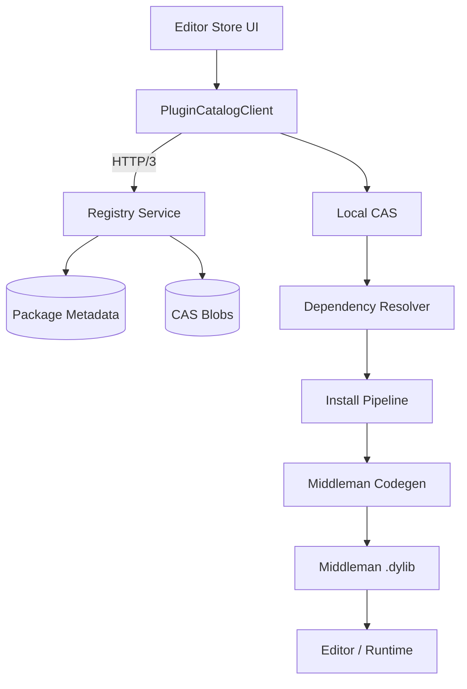
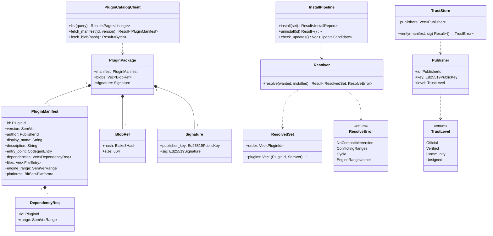
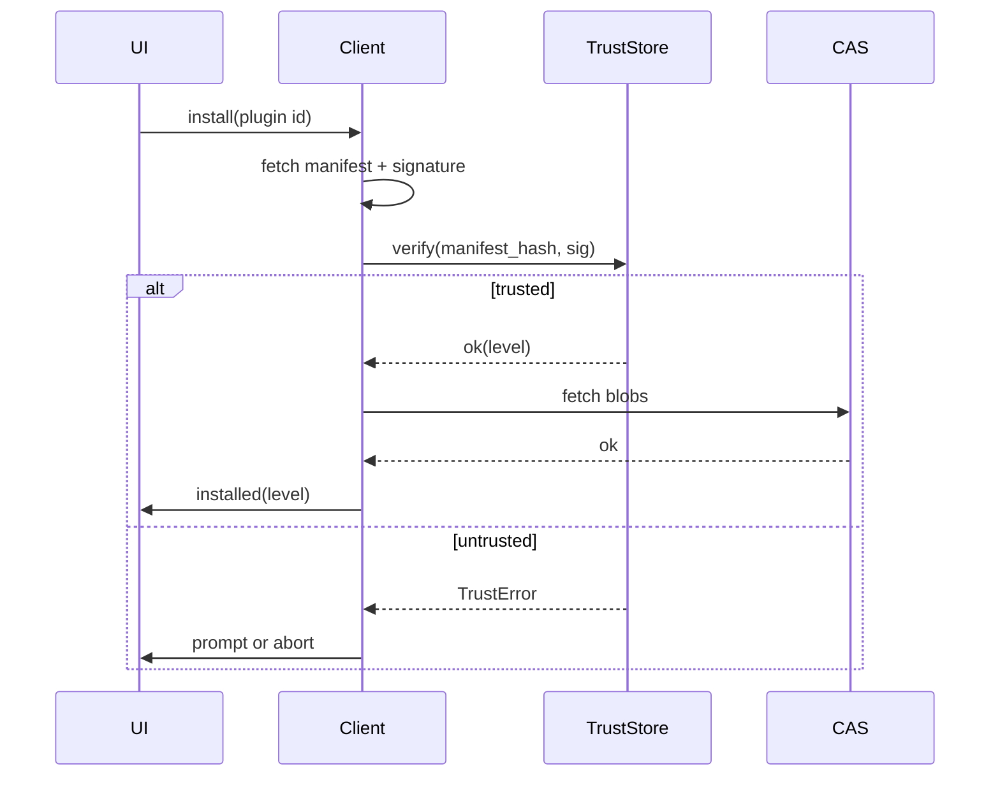
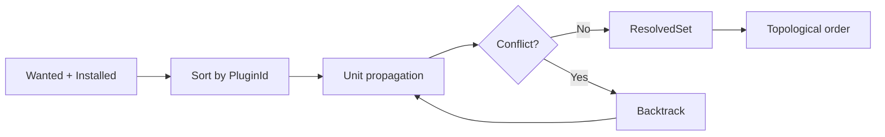

# Plugin Marketplace Protocol Design

## Requirements Trace

> **Canonical sources:** Features, requirements, and user stories live in
> [features/](../../features/), [requirements/](../../requirements/), and
> [user-stories/](../../user-stories/).

### Primary Requirements

| Feature     | Requirement  | User Story    | Design Element                          |
|-------------|--------------|---------------|-----------------------------------------|
| F-15.17.1   | R-15.17.1    | US-15.17.1    | `PluginCatalogClient` protocol          |
| F-15.17.2   | R-15.17.2    | US-15.17.2    | Install pipeline (CAS + codegen)        |
| F-15.17.7   | R-15.17.7    | US-15.17.7    | `PluginPackage` format                  |
| F-15.17.8   | R-15.17.8    | US-15.17.8    | Signature verification and trust chain  |
| F-15.17.12  | R-15.17.12   | US-15.17.12   | Semver dependency resolution            |
| F-15.17.29  | R-15.17.29   | US-15.17.29   | Self-hosted registry endpoints          |
| F-15.17.30  | R-15.17.30   | US-15.17.30   | Update checking and bulk update         |

1. **R-15.17.1** -- Client fetches catalog listings via a typed protocol with pagination and search
2. **R-15.17.2** -- Install pipeline downloads, verifies, processes codegen, and registers plugin
3. **R-15.17.7** -- A plugin package is a signed data bundle; not shipping prebuilt binaries
4. **R-15.17.8** -- Every plugin carries an ed25519 signature chained to a publisher key
5. **R-15.17.12** -- Dependency resolver uses semver ranges; picks highest compatible
6. **R-15.17.29** -- Self-hosted registries speak the same protocol as the public registry
7. **R-15.17.30** -- Client checks for updates on launch and on demand, honors pinning

### Cross-Cutting Dependencies

| Dependency         | Source    | Consumed API                          |
|--------------------|-----------|---------------------------------------|
| Plugins-as-data    | F-13.1.9  | `PluginManifest`, codegen entry point |
| Middleman dylib    | F-1.3.5   | Middleman build pipeline              |
| Content-addressable| F-15.11.1 | CAS for blobs                         |
| QUIC transport     | F-11.3.1  | Catalog HTTP/3 client                 |
| Credential store   | F-15.10.1 | Platform keyring for publisher tokens |
| Editor core        | F-15.1.1  | Install UI bridge                     |

---

## Overview

Plugins in Harmonius are **data packages**, not prebuilt dynamic libraries. Each plugin contains a
manifest, a set of asset blobs, a bundle of codegen input files, and metadata. On install, the
client stores the raw package in a content-addressable store (CAS), then the codegen pipeline
rebuilds the middleman `.dylib` that contains every installed plugin's types. The engine loads the
new `.dylib` at next editor launch (or hot-reload when available).

The marketplace protocol is the transport and trust layer. It does **not** define the UI of the
store — that is [F-15.17.1](../../features/tools/asset-store.md) — it defines the on-wire
formats, signing rules, CAS layout, and dependency resolution algorithm.

### Design Principles

1. **Content-addressable** -- every blob is keyed by its `blake3` hash; duplicates dedupe naturally
2. **Sign then pack** -- signatures cover the root manifest hash, not individual blobs
3. **Plugins are data** -- no prebuilt binaries cross the network; codegen rebuilds locally
4. **Registry-agnostic** -- public and self-hosted registries speak the same HTTP/3 protocol
5. **Deterministic resolution** -- version selection is a deterministic function of the input set
6. **Offline-capable** -- once fetched, all plugin work runs without network access
7. **Integrity at every step** -- download, extract, and codegen each re-verify hashes

---

## Architecture

### Component Layout



### Class Diagram



---

## API Design

### Package Manifest

```rust
#[derive(Archive, Serialize, Deserialize)]
pub struct PluginManifest {
    pub id: PluginId,
    pub version: SemVer,
    pub author: PublisherId,
    pub display_name: String,
    pub description: String,
    pub entry_point: CodegenEntry,
    pub dependencies: Vec<DependencyReq>,
    pub files: Vec<FileEntry>,
    pub engine_range: SemVerRange,
    pub platforms: BitSet<Platform>,
}

pub struct FileEntry {
    pub path: String,
    pub blob: BlobRef,
    pub role: FileRole,
}

pub enum FileRole {
    CodegenSource,
    Asset,
    License,
    Preview,
    Documentation,
}
```

### Catalog Client

```rust
pub struct PluginCatalogClient {
    registry: Url,
    transport: Quic3Client,
    trust: TrustStore,
    local_cas: PathBuf,
}

impl PluginCatalogClient {
    pub fn list(&self, query: CatalogQuery) -> Result<Page<Listing>, CatalogError>;
    pub fn fetch_manifest(
        &self,
        id: PluginId,
        version: SemVer,
    ) -> Result<PluginManifest, CatalogError>;
    pub fn fetch_blob(&self, hash: Blake3Hash) -> Result<Bytes, CatalogError>;
}
```

The `fetch_blob` path is idempotent and cacheable. The client first checks `local_cas` before
issuing a network request; on a hit the network is skipped entirely.

### Resolver

```rust
pub struct Resolver;

impl Resolver {
    pub fn resolve(
        wanted: &[DependencyReq],
        installed: &[InstalledPlugin],
        catalog: &dyn ManifestSource,
    ) -> Result<ResolvedSet, ResolveError>;
}
```

The resolver runs PubGrub-style backtracking over semver ranges. Input order is deterministic
(sorted by `PluginId`) so two runs with the same inputs produce the same output.

### Install Pipeline

```rust
pub struct InstallPipeline {
    client: PluginCatalogClient,
    codegen: MiddlemanCodegen,
    store: PluginStore,
}

impl InstallPipeline {
    pub fn install(&mut self, set: &ResolvedSet) -> Result<InstallReport, InstallError>;
    pub fn uninstall(&mut self, id: PluginId) -> Result<(), InstallError>;
    pub fn check_updates(&self) -> Vec<UpdateCandidate>;
}
```

Install sequence:

1. Fetch all missing manifests from the catalog
2. Verify each manifest's signature against the `TrustStore`
3. Fetch all missing blobs, streaming directly into CAS under `<hash>.blob`
4. Re-hash on extract and compare against manifest `BlobRef::hash`
5. Invoke `MiddlemanCodegen::rebuild(installed_set)` to regenerate the `.dylib`
6. Atomically swap the `middleman.dylib` symlink

If any step fails, no partial state is committed.

---

## Trust Model

### Trust Levels

| Level       | Source                              | Requirements                           |
|-------------|-------------------------------------|----------------------------------------|
| Official    | First-party Harmonius team          | Key baked into editor build            |
| Verified    | Marketplace-reviewed publisher      | Publisher key signed by marketplace CA |
| Community   | Any publisher with a registered key | Self-signed; warned on install         |
| Unsigned    | Local-only development packages     | Installation requires developer mode   |

### Verification Flow



Signature is over `blake3(manifest_archive_bytes)`. Blob integrity is ensured by manifest, so a
single signature covers the whole package.

---

## CAS Layout

```text
.harmonius/plugins/
  cas/
    blobs/<2-hex-prefix>/<full-hash>.blob
    manifests/<plugin-id>-<version>.rkyv
  installed/
    <plugin-id>/
      current -> ../../cas/manifests/<plugin-id>-<version>.rkyv
  middleman/
    middleman.dylib
    middleman.rs.gen
```

- `cas/blobs` is append-only; garbage collection runs on uninstall
- `installed/<id>/current` is a symlink to the active version's manifest
- Middleman outputs live under `middleman/` and are regenerated on any install / uninstall

---

## Dependency Resolution



The resolver works over `(PluginId, SemVerRange)` pairs. It picks the highest version in range that
is compatible with every installed plugin, backtracking when no version satisfies the intersection
of ranges. Circular dependencies produce `ResolveError::Cycle`. The resolved set is emitted in
topological order so the codegen pipeline can process dependents after their dependencies.

---

## Update Checking

On launch, the client calls `check_updates`:

```rust
pub struct UpdateCandidate {
    pub plugin: PluginId,
    pub installed: SemVer,
    pub available: SemVer,
    pub changelog: Option<String>,
    pub pinned: bool,
}
```

Pinned plugins are reported but not auto-updated. The bulk update action calls `install` on the
union of non-pinned candidates.

---

## Platform Considerations

| Platform | Credential Store           | Transport           |
|----------|----------------------------|---------------------|
| Windows  | Windows Credential Manager | `quinn` over WinSock|
| macOS    | Keychain                   | `quinn` over BSD    |
| Linux    | Secret Service (libsecret) | `quinn` over BSD    |

All network I/O goes through the main-thread I/O bridge as `IoRequest`. The catalog client never
touches sockets directly from a worker thread.

### Marketplace Registry Protocol

The protocol is HTTP/3 with JSON bodies and binary blob responses:

| Method | Path                                          | Purpose                          |
|--------|-----------------------------------------------|----------------------------------|
| GET    | `/api/v1/catalog?q=...&page=...`              | Paginated listing                |
| GET    | `/api/v1/plugins/<id>/<version>/manifest`     | Fetch manifest rkyv              |
| GET    | `/api/v1/blobs/<blake3>`                      | Fetch blob                       |
| GET    | `/api/v1/plugins/<id>/versions`               | List available versions          |
| POST   | `/api/v1/publish`                             | Upload a new version (auth'd)    |
| GET    | `/api/v1/publishers/<id>/key`                 | Fetch publisher public key       |

Self-hosted registries implement the same endpoints under their own base URL. The client uses the
same code path for both; trust decisions are per-registry.

---

## Test Plan

See [plugin-marketplace-test-cases.md](plugin-marketplace-test-cases.md) for TC-15.17.x.y entries:

- Unit tests for manifest parsing, signature verification, resolver, CAS layout
- Integration tests against a local test registry
- Benchmarks for fetch, resolve, and install latency

---

## Open Questions

1. How does the resolver handle `*` or `latest` ranges when the registry is offline?
2. What is the revocation policy for compromised publisher keys? CRL fetched at launch?
3. Do we support delta updates (fetch only changed blobs) or always full packages?
4. Should unsigned plugins be forbidden outright in shipping editor builds?
