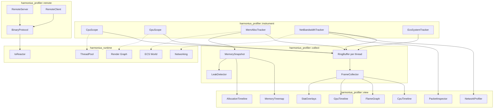
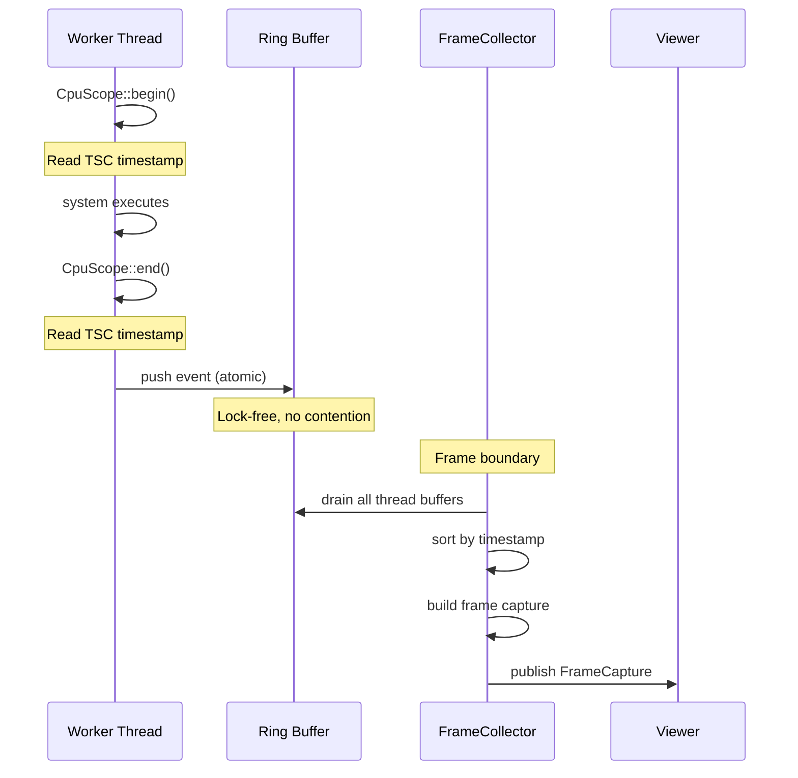
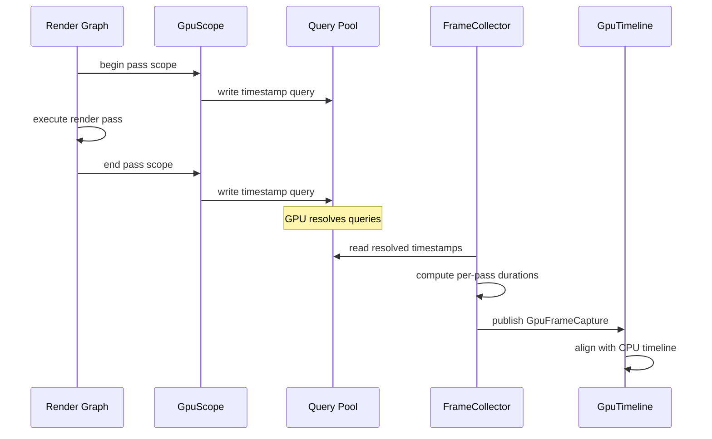
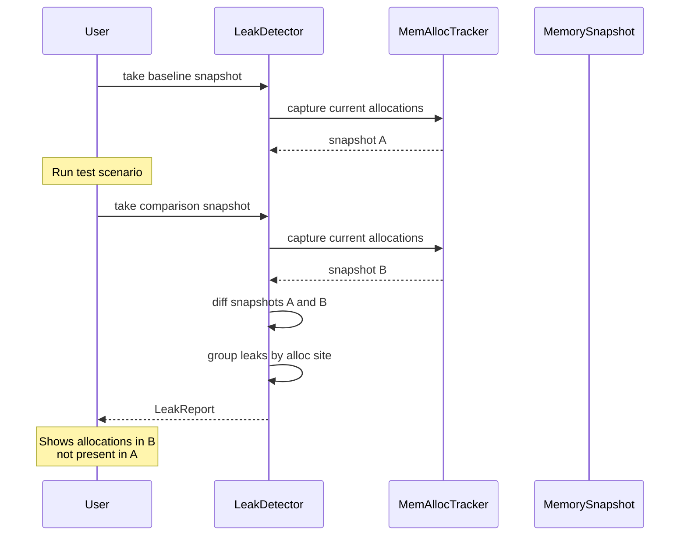
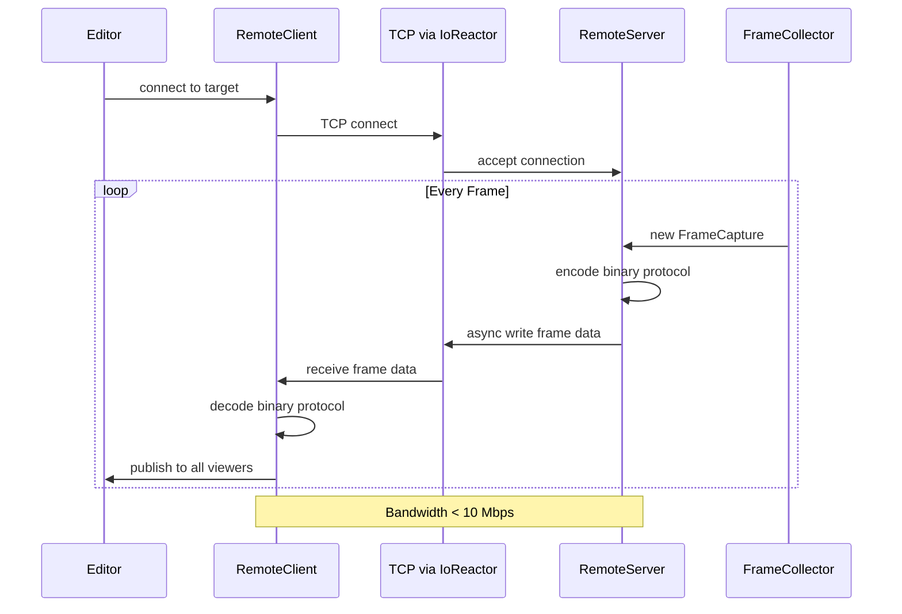
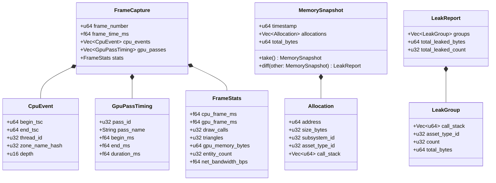

# Profiling Tools Design

## Requirements Trace

> **Canonical sources:** Features, requirements, and user stories are defined in
> [features/tools-editor/](../../features/tools-editor/),
> [requirements/tools-editor/](../../requirements/tools-editor/), and
> [user-stories/tools-editor/](../../user-stories/tools-editor/). The table below traces design
> elements to those definitions.

| Feature | Requirement | Description |
|---------|-------------|-------------|
| F-15.5.1 | R-15.5.1 | CPU frame profiler with swimlane timeline and flame graph |
| F-15.5.2 | R-15.5.2 | GPU profiler with per-pass timing and vendor counters |
| F-15.5.3 | R-15.5.3 | Memory profiler with allocation tracking and treemap |
| F-15.5.4 | R-15.5.4 | Leak detection by snapshot comparison |
| F-15.5.5 | R-15.5.5 | Network profiler with bandwidth monitoring and packet inspector |
| F-15.5.6 | R-15.5.6 | Stat overlays on game viewport |
| F-15.5.7 | R-15.5.7 | Remote profiling over TCP |

## Overview

The profiling subsystem provides instrumentation, collection, visualization, and remote streaming of
performance data across CPU, GPU, memory, network, and ECS systems. All instrumentation uses
lock-free data structures to keep measurement overhead below 1% of frame time at 300+ FPS.

Key principles:

- **Lock-free instrumentation.** All recording paths use per-thread ring buffers with atomic
  operations. No mutexes in the hot path.
- **100% ECS-based.** Profiler state (frame captures, snapshots, overlays) is stored as ECS
  components on profiler entities. Visualization systems query these components.
- **Controlled I/O.** Remote streaming and CSV export use the `IoReactor` async I/O path. No stdlib
  file I/O.
- **Static dispatch.** Platform-specific backends are selected at compile time via `cfg` attributes.
  No trait objects for instrumentation.
- **< 1% overhead.** All instrumentation paths are designed for sub-microsecond per-event cost. The
  profiler must not perturb the system under measurement.

## Architecture

### Module Boundaries



```text
harmonius_profiler/
├── instrument/
│   ├── cpu_scope.rs       # CpuScope, begin/end
│   │                      # zone markers
│   ├── gpu_scope.rs       # GpuScope, timestamp
│   │                      # query insertion
│   ├── mem_tracker.rs     # MemAllocTracker, per-
│   │                      # allocation recording
│   ├── net_tracker.rs     # NetBandwidthTracker,
│   │                      # per-channel counters
│   └── ecs_tracker.rs     # EcsSystemTracker, per-
│                          # system timing
├── collect/
│   ├── ring_buffer.rs     # Lock-free per-thread
│   │                      # ring buffer
│   ├── frame_collector.rs # FrameCollector, per-
│   │                      # frame aggregation
│   ├── snapshot.rs        # MemorySnapshot, point-
│   │                      # in-time capture
│   └── leak.rs            # LeakDetector, snapshot
│                          # diff comparison
├── view/
│   ├── cpu_timeline.rs    # Swimlane chart, filter
│   │                      # by thread/subsystem
│   ├── flame_graph.rs     # Flame graph and flat
│   │                      # profile views
│   ├── gpu_timeline.rs    # GPU pass timeline,
│   │                      # vendor counters
│   ├── memory_treemap.rs  # Live treemap of memory
│   │                      # by subsystem
│   ├── alloc_timeline.rs  # Historical allocation
│   │                      # rate timeline
│   ├── net_profiler.rs    # Bandwidth graphs, per-
│   │                      # channel breakdown
│   ├── packet_inspector.rs# Packet decode, field
│   │                      # view
│   └── stat_overlays.rs   # HUD overlays, CSV
│                          # export
├── remote/
│   ├── server.rs          # RemoteServer, listens
│   │                      # for editor connections
│   ├── client.rs          # RemoteClient, connects
│   │                      # from editor to target
│   └── protocol.rs        # BinaryProtocol, frame
│                          # data encoding
└── platform/
    ├── windows.rs         # ETW, CaptureStackBackTrace
    ├── macos.rs           # os_signpost, backtrace
    └── linux.rs           # perf counters, backtrace
```

### Lock-Free Instrumentation Pipeline



### GPU Profiling Pipeline



### Memory Leak Detection Flow



### Remote Profiling Data Flow



### Core Data Structures



## API Design

### CPU Instrumentation

```rust
/// A CPU profiling zone. Created at the start of
/// a scope; records begin/end timestamps.
pub struct CpuScope { /* ... */ }

impl CpuScope {
    /// Begin a profiling zone. Reads the TSC
    /// timestamp counter. Cost: ~10 ns.
    #[inline(always)]
    pub fn begin(name: &'static str) -> Self;

    /// End the zone and push the event to the
    /// thread-local ring buffer.
    #[inline(always)]
    pub fn end(self);
}

/// RAII guard that calls `CpuScope::end()` on
/// drop. Preferred usage pattern.
pub struct CpuScopeGuard { /* ... */ }

impl CpuScopeGuard {
    #[inline(always)]
    pub fn new(name: &'static str) -> Self;
}

impl Drop for CpuScopeGuard {
    #[inline(always)]
    fn drop(&mut self);
}

/// Macro for instrumenting a block. Expands to a
/// CpuScopeGuard binding.
/// Usage: `profile_scope!("my_system");`
#[macro_export]
macro_rules! profile_scope {
    ($name:expr) => {
        let _guard = CpuScopeGuard::new($name);
    };
}
```

### GPU Instrumentation

```rust
/// GPU profiling scope. Inserts timestamp queries
/// around a render graph pass.
pub struct GpuScope { /* ... */ }

impl GpuScope {
    /// Begin a GPU profiling scope. Inserts a
    /// timestamp query into the command buffer.
    pub fn begin(
        name: &'static str,
        cmd: &mut CommandBuffer,
        query_pool: &QueryPool,
    ) -> Self;

    /// End the scope. Inserts a second timestamp
    /// query.
    pub fn end(
        self,
        cmd: &mut CommandBuffer,
        query_pool: &QueryPool,
    );
}

/// GPU timestamp query pool. Manages a ring of
/// timestamp query slots.
pub struct QueryPool { /* ... */ }

impl QueryPool {
    pub fn new(capacity: u32) -> Self;

    /// Allocate a query slot. Returns None if the
    /// pool is exhausted.
    pub fn allocate(&self) -> Option<QuerySlot>;

    /// Read resolved timestamps from the previous
    /// frame's queries. Non-blocking.
    pub fn read_resolved(
        &self,
    ) -> Vec<GpuPassTiming>;
}

/// Vendor-specific GPU counter access.
pub struct VendorCounters { /* ... */ }

impl VendorCounters {
    /// Query shader occupancy for the current frame.
    pub fn shader_occupancy(&self) -> Option<f32>;

    /// Query wave utilization.
    pub fn wave_utilization(&self) -> Option<f32>;

    /// Query overdraw ratio per pass.
    pub fn overdraw_ratio(
        &self,
        pass_id: u32,
    ) -> Option<f32>;
}
```

### Lock-Free Ring Buffer

```rust
/// Lock-free, per-thread ring buffer for profiling
/// events. Each worker thread owns one buffer.
/// Events are written by the instrumented thread
/// and drained by the frame collector.
pub struct ProfileRingBuffer { /* ... */ }

impl ProfileRingBuffer {
    /// Create a ring buffer with the given capacity
    /// (power of two).
    pub fn new(capacity: u32) -> Self;

    /// Push an event. Lock-free (single producer).
    /// Returns false if the buffer is full (events
    /// dropped under extreme load).
    #[inline(always)]
    pub fn push(&self, event: CpuEvent) -> bool;

    /// Drain all events since the last drain.
    /// Called by the frame collector at the frame
    /// boundary. Lock-free (single consumer).
    pub fn drain(&self) -> Vec<CpuEvent>;

    /// Number of events currently buffered.
    pub fn len(&self) -> u32;

    /// Whether events were dropped since last drain.
    pub fn events_dropped(&self) -> bool;
}
```

### Frame Collector

```rust
/// Aggregates profiling data from all sources into
/// per-frame captures.
pub struct FrameCollector { /* ... */ }

impl FrameCollector {
    pub fn new(
        thread_count: u32,
        query_pool: QueryPool,
    ) -> Self;

    /// Collect a frame capture. Called at the frame
    /// boundary. Drains all per-thread ring buffers,
    /// reads GPU query results, and assembles the
    /// capture.
    pub fn collect_frame(
        &mut self,
    ) -> FrameCapture;

    /// Register a thread's ring buffer.
    pub fn register_thread(
        &mut self,
        thread_id: u32,
        buffer: &ProfileRingBuffer,
    );

    /// Get the most recent N frame captures for
    /// display.
    pub fn recent_frames(
        &self,
        count: u32,
    ) -> &[FrameCapture];

    /// Get a specific frame for comparison.
    pub fn get_frame(
        &self,
        frame_number: u64,
    ) -> Option<&FrameCapture>;
}

/// A complete per-frame profiling capture.
pub struct FrameCapture {
    pub frame_number: u64,
    pub frame_time_ms: f64,
    pub cpu_events: Vec<CpuEvent>,
    pub gpu_passes: Vec<GpuPassTiming>,
    pub stats: FrameStats,
}

/// Aggregate statistics for a single frame.
pub struct FrameStats {
    pub cpu_frame_ms: f64,
    pub gpu_frame_ms: f64,
    pub draw_calls: u32,
    pub triangles: u32,
    pub gpu_memory_bytes: u64,
    pub entity_count: u32,
    pub net_bandwidth_bps: f64,
}
```

### CPU Timeline View

```rust
/// Filter for the CPU timeline view.
#[derive(Clone, Debug, Default)]
pub struct TimelineFilter {
    pub thread_ids: Option<Vec<u32>>,
    pub subsystem_names: Option<Vec<String>>,
    pub min_duration_us: Option<f64>,
}

/// View mode for the CPU profiler.
#[derive(Clone, Copy, Debug, PartialEq, Eq)]
pub enum CpuProfileViewMode {
    /// Swimlane chart with one lane per thread.
    Timeline,
    /// Flame graph (call stack depth view).
    FlameGraph,
    /// Flat profile (sorted by total time).
    FlatProfile,
}

/// CPU timeline viewer. Displays swimlane chart,
/// flame graph, or flat profile.
pub struct CpuTimeline { /* ... */ }

impl CpuTimeline {
    pub fn new() -> Self;

    /// Set the view mode.
    pub fn set_view_mode(
        &mut self,
        mode: CpuProfileViewMode,
    );

    /// Apply a filter to the displayed events.
    pub fn set_filter(
        &mut self,
        filter: TimelineFilter,
    );

    /// Set the frame to display.
    pub fn set_frame(
        &mut self,
        capture: &FrameCapture,
    );

    /// Enable frame-to-frame comparison. Shows two
    /// frames side by side.
    pub fn set_comparison(
        &mut self,
        baseline: &FrameCapture,
        current: &FrameCapture,
    );

    /// Get the selected zone's details.
    pub fn selected_zone(
        &self,
    ) -> Option<&CpuEvent>;
}
```

### GPU Timeline View

```rust
/// GPU timeline viewer. Displays per-pass timing
/// aligned with the CPU timeline.
pub struct GpuTimeline { /* ... */ }

impl GpuTimeline {
    pub fn new() -> Self;

    /// Set the frame capture to display.
    pub fn set_frame(
        &mut self,
        capture: &FrameCapture,
    );

    /// Get vendor-specific counters for a pass.
    pub fn get_vendor_counters(
        &self,
        pass_id: u32,
    ) -> Option<VendorCounterData>;

    /// Get overdraw statistics for a pass.
    pub fn get_overdraw(
        &self,
        pass_id: u32,
    ) -> Option<f32>;
}

/// Vendor counter data for a specific pass.
#[derive(Clone, Debug)]
pub struct VendorCounterData {
    pub shader_occupancy: Option<f32>,
    pub wave_utilization: Option<f32>,
    pub alu_utilization: Option<f32>,
}
```

### Memory Profiler

```rust
/// Tracks all CPU and GPU memory allocations.
pub struct MemAllocTracker { /* ... */ }

impl MemAllocTracker {
    pub fn new() -> Self;

    /// Record an allocation. Called from the global
    /// allocator hook. Lock-free per-thread path.
    #[inline(always)]
    pub fn record_alloc(
        &self,
        address: u64,
        size: u32,
        subsystem: u32,
        asset_type: u32,
    );

    /// Record a deallocation.
    #[inline(always)]
    pub fn record_dealloc(&self, address: u64);

    /// Take a point-in-time memory snapshot.
    pub fn take_snapshot(&self) -> MemorySnapshot;

    /// Get the current per-frame allocation rate.
    pub fn per_frame_alloc_rate(&self) -> u32;

    /// Get total memory by subsystem.
    pub fn memory_by_subsystem(
        &self,
    ) -> Vec<(u32, u64)>;
}

/// A point-in-time snapshot of all live allocations.
pub struct MemorySnapshot {
    pub timestamp: u64,
    pub allocations: Vec<Allocation>,
    pub total_bytes: u64,
}

/// A single tracked allocation.
#[derive(Clone, Debug)]
pub struct Allocation {
    pub address: u64,
    pub size_bytes: u32,
    pub subsystem_id: u32,
    pub asset_type_id: u32,
    pub call_stack: Vec<u64>,
}

impl MemorySnapshot {
    /// Diff two snapshots to find leaks.
    pub fn diff(
        &self,
        later: &MemorySnapshot,
    ) -> LeakReport;
}
```

### Leak Detection

```rust
/// Report of memory leaks found by comparing two
/// snapshots.
pub struct LeakReport {
    pub groups: Vec<LeakGroup>,
    pub total_leaked_bytes: u64,
    pub total_leaked_count: u32,
}

/// A group of leaked allocations sharing the same
/// call stack.
#[derive(Clone, Debug)]
pub struct LeakGroup {
    pub call_stack: Vec<u64>,
    pub asset_type_id: u32,
    pub count: u32,
    pub total_bytes: u64,
}

/// Leak detector for automated and manual leak
/// checking.
pub struct LeakDetector { /* ... */ }

impl LeakDetector {
    pub fn new(tracker: &MemAllocTracker) -> Self;

    /// Take a baseline snapshot.
    pub fn take_baseline(&mut self);

    /// Compare current state against baseline.
    pub fn check(&self) -> LeakReport;

    /// Check that no net allocations grew. Returns
    /// Ok(()) if no leaks, Err(report) if leaks
    /// found. Suitable for CI automation.
    pub fn assert_no_leaks(
        &self,
    ) -> Result<(), LeakReport>;
}
```

### Memory Treemap View

```rust
/// Interactive treemap visualization of memory
/// consumption.
pub struct MemoryTreemap { /* ... */ }

impl MemoryTreemap {
    pub fn new() -> Self;

    /// Update the treemap from a snapshot.
    pub fn update(
        &mut self,
        snapshot: &MemorySnapshot,
    );

    /// Set the grouping mode.
    pub fn set_grouping(
        &mut self,
        mode: TreemapGrouping,
    );

    /// Get the selected allocation details.
    pub fn selected_allocation(
        &self,
    ) -> Option<&Allocation>;
}

/// Grouping mode for the memory treemap.
#[derive(Clone, Copy, Debug, PartialEq, Eq)]
pub enum TreemapGrouping {
    BySubsystem,
    ByAssetType,
    ByAllocSite,
}
```

### Network Profiler

```rust
/// Tracks network bandwidth per channel.
pub struct NetBandwidthTracker { /* ... */ }

impl NetBandwidthTracker {
    pub fn new() -> Self;

    /// Record bytes sent/received on a channel.
    #[inline(always)]
    pub fn record(
        &self,
        channel: u32,
        direction: NetDirection,
        bytes: u32,
    );

    /// Get per-channel bandwidth for the current
    /// frame.
    pub fn per_channel_bandwidth(
        &self,
    ) -> Vec<ChannelBandwidth>;

    /// Get total bandwidth over time for graphing.
    pub fn bandwidth_history(
        &self,
        seconds: f32,
    ) -> Vec<(f64, f64)>;
}

/// Network traffic direction.
#[derive(Clone, Copy, Debug, PartialEq, Eq)]
pub enum NetDirection {
    Upstream,
    Downstream,
}

/// Bandwidth for a single channel.
#[derive(Clone, Debug)]
pub struct ChannelBandwidth {
    pub channel_id: u32,
    pub channel_name: String,
    pub upstream_bps: f64,
    pub downstream_bps: f64,
}

/// Bandwidth budget threshold for spike alerts.
#[derive(Clone, Debug)]
pub struct BandwidthBudget {
    pub upstream_limit_bps: f64,
    pub downstream_limit_bps: f64,
}

/// Packet inspector for decoding individual packets.
pub struct PacketInspector { /* ... */ }

impl PacketInspector {
    pub fn new() -> Self;

    /// Decode a raw packet into structured fields.
    pub fn decode(
        &self,
        data: &[u8],
    ) -> DecodedPacket;

    /// Set a filter to capture specific packet
    /// types.
    pub fn set_filter(
        &mut self,
        filter: PacketFilter,
    );

    /// Get recently captured packets.
    pub fn recent_packets(
        &self,
        count: u32,
    ) -> &[DecodedPacket];
}

/// A decoded network packet.
#[derive(Clone, Debug)]
pub struct DecodedPacket {
    pub timestamp: f64,
    pub direction: NetDirection,
    pub channel_id: u32,
    pub size_bytes: u32,
    pub fields: Vec<PacketField>,
}

/// A single field within a decoded packet.
#[derive(Clone, Debug)]
pub struct PacketField {
    pub name: String,
    pub value: String,
    pub offset: u32,
    pub size: u32,
}
```

### ECS System Profiler

```rust
/// Per-system timing tracked by the ECS scheduler.
pub struct EcsSystemTracker { /* ... */ }

impl EcsSystemTracker {
    pub fn new() -> Self;

    /// Record the execution time of a system.
    #[inline(always)]
    pub fn record_system(
        &self,
        system_name: &'static str,
        duration_us: f64,
    );

    /// Get per-system timing for the current frame.
    pub fn system_timings(
        &self,
    ) -> Vec<SystemTiming>;

    /// Get the top N most expensive systems.
    pub fn top_systems(
        &self,
        n: u32,
    ) -> Vec<SystemTiming>;
}

/// Timing data for a single ECS system.
#[derive(Clone, Debug)]
pub struct SystemTiming {
    pub name: &'static str,
    pub duration_us: f64,
    pub thread_id: u32,
}
```

### Stat Overlays

```rust
/// Individual stat overlay that can be toggled.
#[derive(Clone, Copy, Debug, PartialEq, Eq)]
pub enum StatOverlay {
    Fps,
    FrameTime,
    DrawCalls,
    TriangleCount,
    GpuMemory,
    CpuThreadUtilization,
    NetworkBandwidth,
    EntityCount,
}

/// HUD overlay configuration.
#[derive(Clone, Debug)]
pub struct OverlayConfig {
    pub enabled: Vec<StatOverlay>,
    pub compact_mode: bool,
    pub position: OverlayPosition,
}

/// Overlay position on screen.
#[derive(Clone, Copy, Debug, PartialEq, Eq)]
pub enum OverlayPosition {
    TopLeft,
    TopRight,
    BottomLeft,
    BottomRight,
}

/// Renders stat overlays on the game viewport.
pub struct StatOverlays { /* ... */ }

impl StatOverlays {
    pub fn new() -> Self;

    /// Toggle an individual overlay.
    pub fn set_enabled(
        &mut self,
        overlay: StatOverlay,
        enabled: bool,
    );

    /// Set compact mode for mobile screens.
    pub fn set_compact(&mut self, compact: bool);

    /// Start recording overlay data to CSV.
    pub async fn start_csv_recording(
        &mut self,
        path: &str,
        reactor: &IoReactor,
    );

    /// Stop CSV recording and flush to disk.
    pub async fn stop_csv_recording(&mut self);

    /// Update overlay values from the latest
    /// frame capture.
    pub fn update(
        &mut self,
        capture: &FrameCapture,
    );
}
```

### Remote Profiling

```rust
/// Remote profiling server running on the target
/// (game client, dedicated server, mobile device).
pub struct RemoteServer { /* ... */ }

impl RemoteServer {
    pub fn new(port: u16) -> Self;

    /// Start listening for editor connections.
    pub async fn start(
        &mut self,
        reactor: &IoReactor,
    );

    /// Stop the server.
    pub async fn stop(&mut self);

    /// Publish a frame capture to all connected
    /// editors.
    pub async fn publish_frame(
        &self,
        capture: &FrameCapture,
    );

    /// Set capture granularity to limit bandwidth.
    pub fn set_granularity(
        &mut self,
        granularity: CaptureGranularity,
    );
}

/// Capture granularity for bandwidth control.
#[derive(Clone, Copy, Debug, PartialEq, Eq)]
pub enum CaptureGranularity {
    /// Full capture: all events, all stacks.
    Full,
    /// Summary: per-system totals, no call stacks.
    Summary,
    /// Minimal: frame stats only.
    Minimal,
}

/// Remote profiling client running in the editor.
pub struct RemoteClient { /* ... */ }

impl RemoteClient {
    pub fn new() -> Self;

    /// Connect to a remote target.
    pub async fn connect(
        &mut self,
        host: &str,
        port: u16,
        reactor: &IoReactor,
    ) -> Result<(), RemoteError>;

    /// Disconnect from the remote target.
    pub async fn disconnect(&mut self);

    /// Get the next frame capture from the remote
    /// target.
    pub async fn next_frame(
        &mut self,
    ) -> Result<FrameCapture, RemoteError>;

    /// Check if connected.
    pub fn is_connected(&self) -> bool;

    /// Get the current bandwidth usage in bytes
    /// per second.
    pub fn bandwidth_usage(&self) -> f64;
}

/// Binary protocol for encoding/decoding frame
/// captures over TCP.
pub struct BinaryProtocol { /* ... */ }

impl BinaryProtocol {
    /// Encode a frame capture to bytes. Uses varint
    /// compression for timestamps and sizes.
    pub fn encode(
        capture: &FrameCapture,
    ) -> Vec<u8>;

    /// Decode a frame capture from bytes.
    pub fn decode(
        data: &[u8],
    ) -> Result<FrameCapture, DecodeError>;
}
```

### Platform Integration

```rust
/// Platform-specific profiler integration.
/// Selected at compile time via cfg attributes.

/// Windows ETW integration for kernel-level
/// thread scheduling data.
#[cfg(target_os = "windows")]
pub struct EtwIntegration { /* ... */ }

#[cfg(target_os = "windows")]
impl EtwIntegration {
    pub fn new() -> Self;
    pub fn enable_thread_scheduling(&mut self);
    pub fn context_switches(
        &self,
    ) -> Vec<ContextSwitch>;
}

/// macOS os_signpost integration for Instruments
/// compatibility.
#[cfg(target_os = "macos")]
pub struct SignpostIntegration { /* ... */ }

#[cfg(target_os = "macos")]
impl SignpostIntegration {
    pub fn new() -> Self;
    pub fn emit_begin(
        &self,
        name: &'static str,
    );
    pub fn emit_end(
        &self,
        name: &'static str,
    );
}

/// Linux perf integration for hardware counters.
#[cfg(target_os = "linux")]
pub struct PerfIntegration { /* ... */ }

#[cfg(target_os = "linux")]
impl PerfIntegration {
    pub fn new() -> Self;
    pub fn read_hardware_counters(
        &self,
    ) -> HardwareCounters;
}

/// Call stack capture using platform-native APIs.
pub struct StackCapture;

impl StackCapture {
    /// Capture the current call stack. Uses
    /// CaptureStackBackTrace on Windows, backtrace
    /// on macOS/Linux.
    #[inline(always)]
    pub fn capture(
        max_frames: u32,
    ) -> Vec<u64>;
}
```

### Error Types

```rust
pub enum RemoteError {
    ConnectionRefused,
    ConnectionLost,
    Timeout,
    ProtocolMismatch {
        expected: u32,
        received: u32,
    },
    BandwidthExceeded,
}

pub enum DecodeError {
    InvalidHeader,
    TruncatedData,
    UnsupportedVersion(u32),
    ChecksumMismatch,
}
```

## Data Flow

### Frame Profiling Lifecycle

1. Each worker thread owns a `ProfileRingBuffer`. Systems call `profile_scope!("name")` which
   creates a `CpuScopeGuard`.
2. On scope entry, the TSC is read (~10 ns). On scope exit, the TSC is read again and a `CpuEvent`
   is pushed to the ring buffer (atomic, lock-free).
3. At the frame boundary, `FrameCollector::collect_frame()` drains all per-thread ring buffers and
   reads resolved GPU timestamp queries.
4. Events are sorted by timestamp and assembled into a `FrameCapture`.
5. The CPU timeline, flame graph, GPU timeline, and stat overlays read from the capture.

### Memory Tracking Pipeline

1. The global allocator is hooked to call `MemAllocTracker::record_alloc()` on every allocation and
   `record_dealloc()` on every free.
2. Each allocation records its size, subsystem tag, asset type, and call stack.
3. `take_snapshot()` captures all live allocations at a point in time.
4. `MemorySnapshot::diff()` compares two snapshots to find leaks (allocations in the later snapshot
   not present in the earlier one).
5. The treemap view groups allocations by subsystem or asset type for interactive exploration.

### Remote Profiling Pipeline

1. The target runs a `RemoteServer` that listens on a TCP port.
2. The editor's `RemoteClient` connects to the target.
3. Each frame, the server encodes the `FrameCapture` with `BinaryProtocol::encode()` (varint
   compressed) and writes it via `IoReactor::write()`.
4. The client reads and decodes frame data via `IoReactor::read()`.
5. All viewer widgets display remote data identically to local data.
6. `CaptureGranularity` controls how much data is sent to keep bandwidth under 10 Mbps.

## Platform Considerations

| Feature | Windows | macOS | Linux |
|---------|---------|-------|-------|
| CPU timestamps | `rdtsc` via inline asm or `QueryPerformanceCounter` | `mach_absolute_time` | `clock_gettime(MONOTONIC)` or `rdtsc` |
| Thread scheduling | ETW `CSwitch` events | os_signpost | perf `sched:sched_switch` |
| Stack capture | `CaptureStackBackTrace` | `backtrace` (libunwind) | `backtrace` (libunwind) |
| GPU timestamps | D3D12 timestamp queries | Metal timestamp queries | Vulkan timestamp queries |
| Vendor counters | AMD AGS, NVIDIA NVAPI | Metal GPU counters API | Vulkan pipeline statistics |
| Remote transport | TCP via IOCP | TCP via GCD | TCP via io_uring |
| Signpost compat | N/A | `os_signpost_emit_with_type` | N/A |

All timestamps are normalized to nanoseconds using per-platform frequency calibration. TSC frequency
is read once at startup via `cpuid` (x86) or `mach_timebase_info` (Apple Silicon).

### Overhead Budget

| Component | Budget per event | Notes |
|-----------|-----------------|-------|
| CpuScope begin+end | < 20 ns | Two TSC reads + one atomic push |
| Ring buffer push | < 5 ns | Single-producer lock-free |
| Frame drain (1000 events) | < 50 us | Single-consumer bulk drain |
| GPU query pair | ~0 ns CPU | GPU-side timestamp, no CPU stall |
| Alloc record | < 50 ns | Lock-free + optional stack capture |
| Stack capture (16 frames) | < 1 us | Platform-specific unwinder |

At 300 FPS with 1000 CPU events per frame, total overhead is ~20 us per frame out of 3.3 ms budget
(0.6%).

## Test Plan

### Unit Tests

| Test | Req | Description |
|------|-----|-------------|
| `test_ring_buffer_push_drain` | R-15.5.1 | Push 10k events, drain all, verify none lost. |
| `test_ring_buffer_overflow` | R-15.5.1 | Overflow buffer, verify events_dropped() returns true. |
| `test_frame_collector_sort` | R-15.5.1 | Collect from 4 threads, verify events sorted by timestamp. |
| `test_flame_graph_depth` | R-15.5.1 | Nested scopes A>B>C, verify depth 0,1,2 in flame graph. |
| `test_timeline_filter_thread` | R-15.5.1 | Filter by thread_id, verify only matching events shown. |
| `test_frame_comparison` | R-15.5.1 | Compare two frames, verify delta highlighting correct. |
| `test_gpu_pass_timing` | R-15.5.2 | Insert begin/end queries, verify duration > 0. |
| `test_gpu_cpu_alignment` | R-15.5.2 | Verify GPU timeline aligns with CPU frame boundary. |
| `test_vendor_counter_amd` | R-15.5.2 | Read AMD occupancy counter on AMD GPU, verify non-null. |
| `test_alloc_tracking` | R-15.5.3 | Allocate 100 blocks, verify all tracked with correct sizes. |
| `test_dealloc_tracking` | R-15.5.3 | Allocate and free, verify removed from live set. |
| `test_treemap_by_subsystem` | R-15.5.3 | Group by subsystem, verify bytes sum matches total. |
| `test_callstack_capture` | R-15.5.3 | Capture stack, verify at least 3 frames with known function. |
| `test_per_frame_alloc_rate` | R-15.5.3 | Allocate N per frame, verify rate matches N. |
| `test_leak_detection` | R-15.5.4 | Allocate without free between snapshots, verify leak found. |
| `test_no_false_leak` | R-15.5.4 | Allocate and free between snapshots, verify no leak reported. |
| `test_leak_grouping` | R-15.5.4 | Multiple leaks from same site, verify grouped correctly. |
| `test_net_bandwidth_channel` | R-15.5.5 | Record on 3 channels, verify per-channel sums correct. |
| `test_net_bandwidth_sum` | R-15.5.5 | Per-channel sums match total within 1%. |
| `test_packet_decode` | R-15.5.5 | Encode known packet, decode, verify fields match. |
| `test_overlay_fps_nonzero` | R-15.5.6 | Active scene, verify FPS overlay shows > 0. |
| `test_overlay_toggle` | R-15.5.6 | Toggle overlay off, verify not rendered. |
| `test_csv_export` | R-15.5.6 | Record 10 frames, export CSV, verify row count. |
| `test_remote_encode_decode` | R-15.5.7 | Encode FrameCapture, decode, verify identical. |
| `test_remote_connect` | R-15.5.7 | Client connects to server, verify handshake. |
| `test_ecs_system_timing` | R-15.5.1 | Record system execution, verify timing non-zero. |

### Integration Tests

| Test | Req | Description |
|------|-----|-------------|
| `test_overhead_under_1_pct` | R-15.5.1 | Run 300 FPS workload with profiler, verify overhead < 1%. |
| `test_etw_integration` | R-15.5.1 | Windows: verify ETW context switch events captured. |
| `test_signpost_integration` | R-15.5.1 | macOS: verify os_signpost events emitted. |
| `test_perf_integration` | R-15.5.1 | Linux: verify perf hardware counters read. |
| `test_gpu_pass_sum` | R-15.5.2 | Sum all pass durations, verify within 10% of total GPU time. |
| `test_remote_data_fidelity` | R-15.5.7 | Profile same workload local and remote, verify data matches. |
| `test_remote_bandwidth` | R-15.5.7 | Stream at Full granularity, verify < 10 Mbps. |
| `test_leak_ci_automation` | R-15.5.4 | Run test scenario, call assert_no_leaks(), verify CI pass/fail. |
| `test_overlay_all_platforms` | R-15.5.6 | Stat overlays render on Windows, macOS, Linux, mobile. |

### Benchmarks

| Benchmark | Target | Source |
|-----------|--------|--------|
| CpuScope begin+end | < 20 ns | US-15.5.1.5 |
| Ring buffer push | < 5 ns | US-15.5.1.5 |
| Frame drain (1000 events) | < 50 us | US-15.5.1.5 |
| Total overhead at 300 FPS | < 1% frame time | US-15.5.1.8 |
| Alloc record (no stack) | < 50 ns | US-15.5.3.5 |
| Stack capture (16 frames) | < 1 us | US-15.5.3.6 |
| Snapshot diff (100k allocs) | < 100 ms | US-15.5.4.1 |
| Remote encode (1 frame) | < 500 us | US-15.5.7.5 |
| Remote bandwidth (Full) | < 10 Mbps | US-15.5.7.5 |

### VFX Budget Integration

The profiler integrates with the VFX particle budget system. Particle count, emitter count, and GPU
simulation time are tracked as profiler counters. Budget overruns trigger profiler markers for
identification in the timeline view.

## Design Q & A

**Q1. What is the biggest constraint limiting this design?**

The < 1% overhead budget at 300+ FPS (US-15.5.1.8) forces all instrumentation to use lock-free
per-thread ring buffers with no heap allocation in the hot path. Lifting this would allow richer
per-event metadata (full call stacks, component data snapshots) at every scope boundary. The best
solution without this constraint would be full tracing with per-event context, similar to Chrome's
tracing infrastructure. The impact is significantly more detailed profiling data, but even a 2%
overhead at 300 FPS steals 66 microseconds per frame, which can mask the real performance profile.

**Q2. How can this design be improved?**

The `FrameCollector` (F-15.5.1) drains all ring buffers at the frame boundary, which creates a
latency spike proportional to total event count. The memory profiler (F-15.5.3) captures call stacks
on every allocation, adding ~1 us per alloc even when the profiler UI is closed. The remote
profiling protocol (F-15.5.7) uses a custom binary format without schema evolution support.
Amortizing drain across the frame, making stack capture opt-in per subsystem, and adding protocol
versioning would improve robustness.

**Q3. Is there a better approach?**

An alternative is to use platform-native profiling exclusively (ETW on Windows, Instruments on
macOS, perf on Linux) rather than a custom instrumentation system. We build custom because platform
tools cannot display engine-specific concepts like ECS system timings, render graph pass budgets, or
network channel breakdowns. The custom profiler also enables remote profiling to mobile devices
(F-15.5.7) where platform tools are limited.

**Q4. Does this design solve all customer problems?**

The profiler lacks automated regression detection -- it captures data but does not alert when frame
times regress between builds. There is no support for profiling audio thread performance, despite
the audio runtime having a strict < 0.5 ms latency budget. Adding CI-integrated performance
regression tests with historical comparison and an audio thread profiler lane would serve teams
shipping on mobile platforms where performance budgets are tight.

**Q5. Is this design cohesive with the overall engine?**

The profiler integrates directly with the ECS scheduler for system timing, the render graph for GPU
pass timing, the networking layer for bandwidth tracking, and the VFX system for particle budgets.
All remote I/O uses `IoReactor`. Platform backends are selected via `cfg` attributes, matching the
engine's platform abstraction pattern. The `profile_scope!` macro is designed to be zero-cost when
profiling is compiled out, aligning with the static dispatch preference. No significant cohesion
gaps exist.

## Open Questions

1. **TSC vs. platform timer** -- `rdtsc` is the fastest timestamp source (~10 ns) but requires
   frequency calibration and is not available on Apple Silicon. `mach_absolute_time` is the macOS
   equivalent. Determine whether to abstract behind a single `Timestamp::now()` or use
   platform-specific calls.
2. **Ring buffer capacity** -- Larger buffers reduce drop risk but consume more memory. With 16
   workers at 64K events each, total is ~16 MB. Profile typical event rates to size appropriately.
3. **Stack capture frequency** -- Capturing call stacks on every allocation adds ~1 us overhead per
   alloc. Consider sampling (every Nth alloc) for high- frequency allocation paths.
4. **GPU query pool recycling** -- Timestamp queries must not be read until the GPU has resolved
   them (typically 1-2 frames later). Triple-buffering the query pool is standard; confirm this
   suffices.
5. **Remote protocol versioning** -- The binary protocol needs forward/backward compatibility for
   editor-target version mismatches. Determine whether to use a self-describing format or fixed
   schema with version negotiation.
6. **Vendor counter availability** -- AMD, NVIDIA, and Apple expose different counter sets.
   Determine the common subset to display by default vs. vendor- specific tabs.
7. **CI leak detection threshold** -- Zero-tolerance leak detection may produce false positives from
   intentional caches. Define a configurable allowlist or byte threshold for CI automation.
