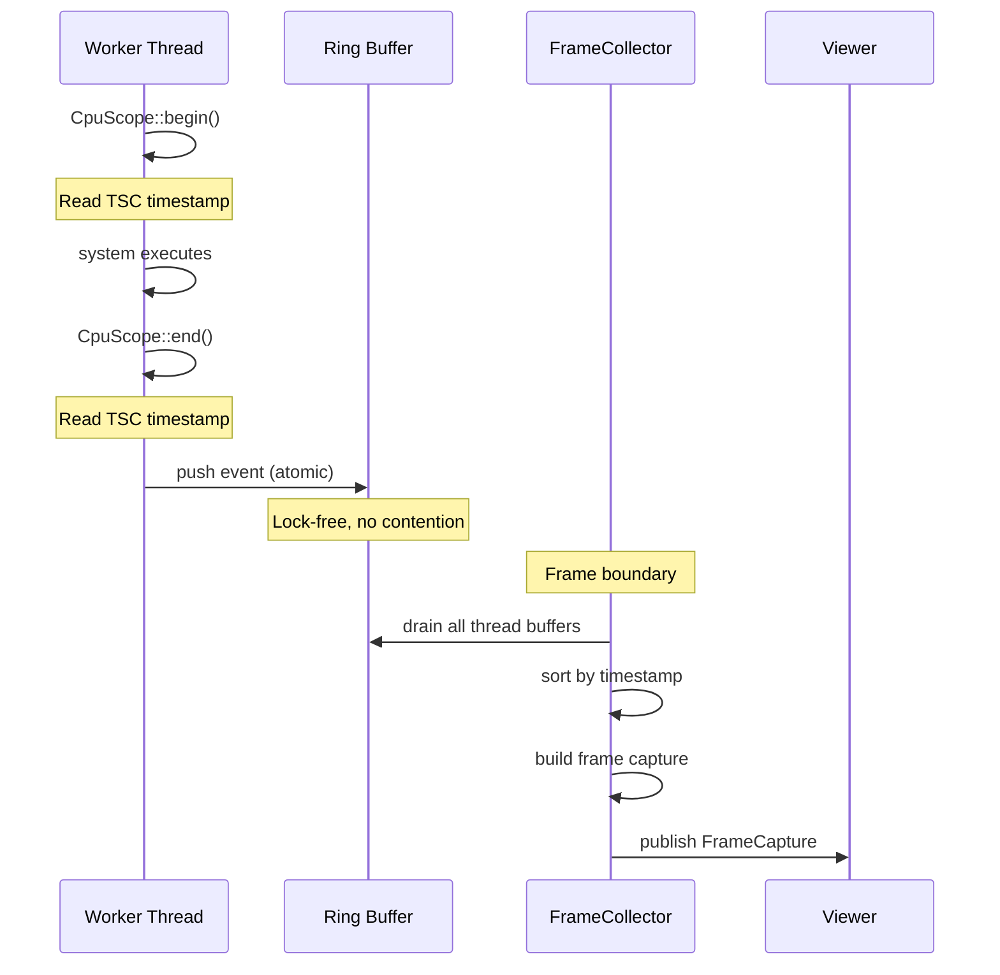
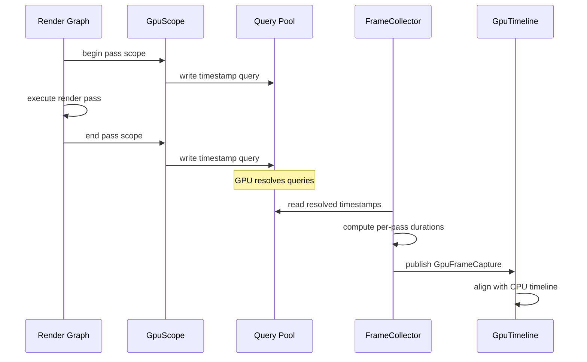
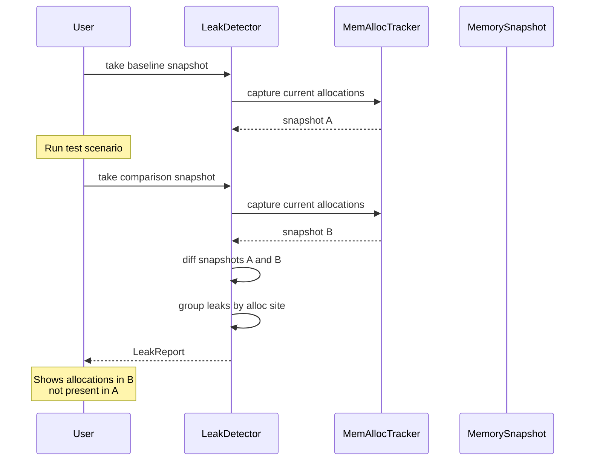
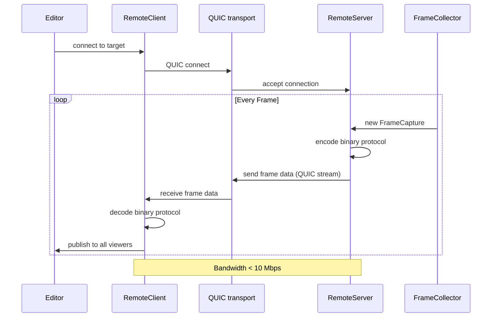
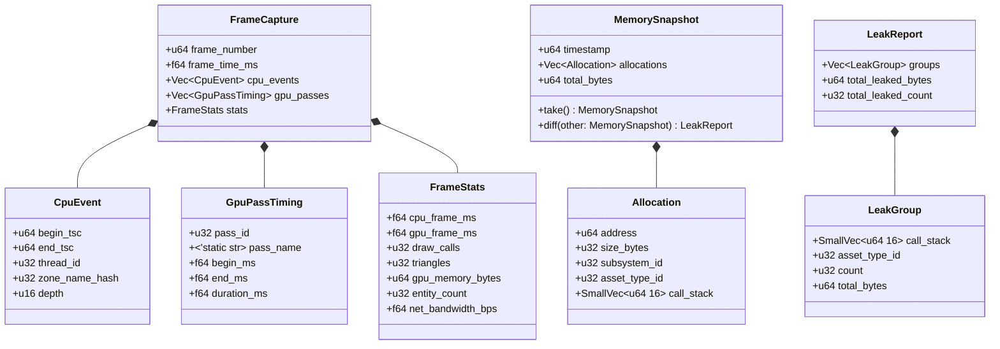

# Profiling Tools Design

## Requirements Trace

> **Canonical sources:** Features, requirements, and user stories are defined in
> [features/tools-editor/](../../features/), [requirements/tools-editor/](../../requirements/), and
> [user-stories/tools-editor/](../../user-stories/). The table below traces design elements to those
> definitions.

| Feature  | Requirement |
|----------|-------------|
| F-15.5.1 | R-15.5.1    |
| F-15.5.2 | R-15.5.2    |
| F-15.5.3 | R-15.5.3    |
| F-15.5.4 | R-15.5.4    |
| F-15.5.5 | R-15.5.5    |
| F-15.5.6 | R-15.5.6    |
| F-15.5.7 | R-15.5.7    |

1. **F-15.5.1** — CPU frame profiler with swimlane timeline and flame graph
2. **F-15.5.2** — GPU profiler with per-pass timing and vendor counters
3. **F-15.5.3** — Memory profiler with allocation tracking and treemap
4. **F-15.5.4** — Leak detection by snapshot comparison
5. **F-15.5.5** — Network profiler with bandwidth monitoring and packet inspector
6. **F-15.5.6** — Stat overlays on game viewport
7. **F-15.5.7** — Remote profiling over QUIC

## Overview

The profiling subsystem provides instrumentation, collection, visualization, and remote streaming of
performance data across CPU, GPU, memory, network, ECS, physics, audio, asset streaming, per-thread
arenas, and GPU VRAM. All instrumentation uses lock-free data structures to keep measurement
overhead below 1% of frame time at 300+ FPS.

Key principles:

- **Lock-free instrumentation.** All recording paths use per-thread ring buffers with atomic
  operations. No mutexes in the hot path.
- **ECS-primary (~90%)-based.** Profiler state (frame captures, snapshots, overlays) is stored as
  ECS components on profiler entities. Visualization systems query these components.
- **Controlled I/O.** Remote streaming uses crossbeam-channel. CSV export uses fire-and-forget
  writes via platform-native I/O (io_uring/IOCP/GCD). No stdlib file I/O, no async/await.
- **Static dispatch.** Platform-specific backends are selected at compile time via `cfg` attributes.
  No trait objects for instrumentation.
- **< 1% overhead.** All instrumentation paths are designed for sub-microsecond per-event cost. The
  profiler must not perturb the system under measurement.

## Architecture

### Module Boundaries

```mermaid
graph TD
    subgraph "harmonius_profiler::instrument"
        CS[CpuScope]
        GS[GpuScope]
        MA[MemAllocTracker]
        AW[ArenaWatermarkTracker]
        NA[NetBandwidthTracker]
        NL[NetworkLatencyTracker]
        EA[EcsSystemTracker]
        PT[PhysicsTracker]
        AU[AudioTracker]
        AS[AssetStreamingTracker]
        VR[VramBreakdownTracker]
    end

    subgraph "harmonius_profiler::collect"
        RB[RingBuffer per thread]
        FC[FrameCollector]
        MS[MemorySnapshot]
        LD[LeakDetector]
    end

    subgraph "harmonius_profiler::view"
        TL[CpuTimeline]
        FG[FlameGraph]
        GT[GpuTimeline]
        TM[MemoryTreemap]
        AT[AllocationTimeline]
        NP[NetworkProfiler]
        PI[PacketInspector]
        SO[StatOverlays]
    end

    subgraph "harmonius_profiler::remote"
        RS[RemoteServer]
        RC[RemoteClient]
        BP[BinaryProtocol]
    end

    subgraph "harmonius_runtime"
        ECS[ECS World]
        TP[ThreadPool]
        RG[Render Graph]
        CH[crossbeam-channel]
        NET[Networking QUIC]
        PHY[Physics]
        AUD[Audio]
        ASSET[Asset Pipeline]
    end

    CS --> RB
    GS --> RB
    MA --> RB
    AW --> RB
    NA --> RB
    NL --> RB
    EA --> RB
    PT --> RB
    AU --> RB
    AS --> RB
    VR --> RB

    RB --> FC
    FC --> TL
    FC --> FG
    FC --> GT
    FC --> SO

    MA --> MS
    MS --> TM
    MS --> AT
    MS --> LD

    NA --> NP
    NA --> PI

    RS --> BP
    RC --> BP
    BP --> CH

    CS -.-> TP
    GS -.-> RG
    MA -.-> ECS
    NA -.-> NET
    PT -.-> PHY
    AU -.-> AUD
    AS -.-> ASSET
```



### Lock-Free Instrumentation Pipeline



### GPU Profiling Pipeline



### Memory Leak Detection Flow



### Remote Profiling Data Flow



### Core Data Structures



### Cross-Subsystem Integration

The profiler collects data from every major engine subsystem. All data paths are pull-based at the
frame boundary — no subsystem pushes data proactively.

| Subsystem         | Data collected                                    | Mechanism                        |
|-------------------|---------------------------------------------------|----------------------------------|
| ECS scheduler     | Per-system timing                                 | `EcsSystemTracker`               |
| Render graph      | Per-pass GPU timing                               | `GpuScope` + timestamp queries   |
| Job system        | Worker busy/idle, steal count, queue depth        | `JobSystemTracker`               |
| Memory allocators | Per-alloc tracking                                | `MemAllocTracker`                |
| Per-thread arenas | Watermark, reset count                            | `ArenaWatermarkTracker`          |
| GPU VRAM          | Per-resource-type usage                           | GPU memory queries               |
| Networking        | Bandwidth + latency                               | `NetBandwidthTracker` + `NLT`    |
| Asset pipeline    | Load queue, cache, bandwidth                      | `AssetStreamingTracker`          |
| Audio             | Callback timing, voices, underruns                | `AudioTracker`                   |
| Physics           | Broadphase/narrowphase/solver timing              | `PhysicsTracker`                 |
| VFX               | Particle count, compute dispatch time             | `VfxTracker`                     |
| Viewport stats    | FPS, tris, meshlets, draws (see `level-world.md`) | `StatOverlays` → `FrameStats`    |
| UI                | Layout time, paint time, widget count             | `UITracker`                      |

1. **`NLT`** — `NetworkLatencyTracker` (RTT histogram, jitter, packet loss, retransmit count).
2. **Viewport stats** — `StatOverlays` feeds `FrameStats` as an ECS resource. The viewport
   statistics overlay (level-world.md RF-32) reads `Res<FrameStats>` directly.

### Codegen and Middleman Boundary

Profiler component types (`CpuScope`, `GpuScope`, all trackers listed above) are **engine-internal**
— they live in the `harmonius_profiler` crate, not the middleman `.dylib`.

User-defined profiler zones from logic graphs (see `scripting.md`) register their zone names in the
middleman at codegen time. The middleman exposes a `register_zone(name: &'static str) -> ZoneId`
function. Zone IDs are stable across hot-reloads. The engine resolves IDs to names via a static
table generated at codegen time — no runtime string allocation.

## API Design

### CPU Instrumentation

```rust
/// A CPU profiling zone. Created at the start of
/// a scope; records begin/end timestamps.
pub struct CpuScope { /* ... */ }

impl CpuScope {
    /// Begin a profiling zone. Reads the TSC
    /// timestamp counter. Cost: ~10 ns.
    #[inline(always)]
    pub fn begin(name: &'static str) -> Self;

    /// End the zone and push the event to the
    /// thread-local ring buffer.
    #[inline(always)]
    pub fn end(self);
}

/// RAII guard that calls `CpuScope::end()` on
/// drop. Preferred usage pattern.
pub struct CpuScopeGuard { /* ... */ }

impl CpuScopeGuard {
    #[inline(always)]
    pub fn new(name: &'static str) -> Self;
}

impl Drop for CpuScopeGuard {
    #[inline(always)]
    fn drop(&mut self);
}

/// Macro for instrumenting a block. Expands to a
/// CpuScopeGuard binding.
/// Usage: `profile_scope!("my_system");`
#[macro_export]
macro_rules! profile_scope {
    ($name:expr) => {
        let _guard = CpuScopeGuard::new($name);
    };
}
```

### GPU Instrumentation

```rust
/// GPU profiling scope. Inserts timestamp queries
/// around a render graph pass.
pub struct GpuScope { /* ... */ }

impl GpuScope {
    /// Begin a GPU profiling scope. Inserts a
    /// timestamp query into the command buffer.
    pub fn begin(
        name: &'static str,
        cmd: &mut CommandBuffer,
        query_pool: &QueryPool,
    ) -> Self;

    /// End the scope. Inserts a second timestamp
    /// query.
    pub fn end(
        self,
        cmd: &mut CommandBuffer,
        query_pool: &QueryPool,
    );
}

/// GPU timestamp query pool. Manages a ring of
/// timestamp query slots.
pub struct QueryPool { /* ... */ }

impl QueryPool {
    pub fn new(capacity: u32) -> Self;

    /// Allocate a query slot. Returns None if the
    /// pool is exhausted.
    pub fn allocate(&self) -> Option<QuerySlot>;

    /// Read resolved timestamps from the previous
    /// frame's queries. Non-blocking.
    pub fn read_resolved(
        &self,
    ) -> Vec<GpuPassTiming>;
}

/// Vendor-specific GPU counter access.
pub struct VendorCounters { /* ... */ }

impl VendorCounters {
    /// Query shader occupancy for the current frame.
    pub fn shader_occupancy(&self) -> Option<f32>;

    /// Query wave utilization.
    pub fn wave_utilization(&self) -> Option<f32>;

    /// Query overdraw ratio per pass.
    pub fn overdraw_ratio(
        &self,
        pass_id: u32,
    ) -> Option<f32>;
}
```

### Lock-Free Ring Buffer

```rust
/// Lock-free, per-thread ring buffer for profiling
/// events. Each worker thread owns one buffer.
/// Events are written by the instrumented thread
/// and drained by the frame collector.
pub struct ProfileRingBuffer { /* ... */ }

impl ProfileRingBuffer {
    /// Create a ring buffer with the given capacity
    /// (power of two).
    pub fn new(capacity: u32) -> Self;

    /// Push an event. Lock-free (single producer).
    /// Returns false if the buffer is full (events
    /// dropped under extreme load).
    #[inline(always)]
    pub fn push(&self, event: CpuEvent) -> bool;

    /// Drain all events since the last drain into
    /// the provided frame arena slice. Lock-free
    /// (single consumer). Called by `FrameCollector`
    /// at the frame boundary; avoids heap allocation.
    pub fn drain_into(&self, arena: &mut FrameArena);

    /// Number of events currently buffered.
    pub fn len(&self) -> u32;

    /// Whether events were dropped since last drain.
    pub fn events_dropped(&self) -> bool;
}
```

### Frame Collector

```rust
/// Aggregates profiling data from all sources into
/// per-frame captures. Internally uses per-thread
/// frame arenas: `drain()` writes into a
/// pre-allocated arena buffer; `FrameCapture`
/// vectors borrow from that arena. The arena is
/// reset at the start of each `collect_frame()`.
pub struct FrameCollector { /* ... */ }

impl FrameCollector {
    pub fn new(
        thread_count: u32,
        query_pool: QueryPool,
    ) -> Self;

    /// Collect a frame capture. Called at the frame
    /// boundary (end of frame, after present submit,
    /// before next frame begin; runs on the worker
    /// thread that owns the game loop phase). Drains
    /// all per-thread ring buffers into the frame
    /// arena, reads GPU query results from frame
    /// N-2, and assembles the capture.
    pub fn collect_frame(
        &mut self,
    ) -> FrameCapture;

    /// Register a thread's ring buffer.
    pub fn register_thread(
        &mut self,
        thread_id: u32,
        buffer: &ProfileRingBuffer,
    );

    /// Get the most recent N frame captures for
    /// display.
    pub fn recent_frames(
        &self,
        count: u32,
    ) -> &[FrameCapture];

    /// Get a specific frame for comparison.
    pub fn get_frame(
        &self,
        frame_number: u64,
    ) -> Option<&FrameCapture>;
}

/// A complete per-frame profiling capture.
pub struct FrameCapture {
    pub frame_number: u64,
    pub frame_time_ms: f64,
    pub cpu_events: Vec<CpuEvent>,
    pub gpu_passes: Vec<GpuPassTiming>,
    pub stats: FrameStats,
}

/// Aggregate statistics for a single frame.
pub struct FrameStats {
    pub cpu_frame_ms: f64,
    pub gpu_frame_ms: f64,
    pub draw_calls: u32,
    pub triangles: u32,
    pub gpu_memory_bytes: u64,
    pub entity_count: u32,
    pub net_bandwidth_bps: f64,
}
```

### CPU Timeline View

```rust
/// Filter for the CPU timeline view.
#[derive(Clone, Debug, Default)]
pub struct TimelineFilter {
    pub thread_ids: Option<Vec<u32>>,
    pub subsystem_names: Option<Vec<String>>,
    pub min_duration_us: Option<f64>,
}

/// View mode for the CPU profiler.
#[derive(Clone, Copy, Debug, PartialEq, Eq)]
pub enum CpuProfileViewMode {
    /// Swimlane chart with one lane per thread.
    Timeline,
    /// Flame graph (call stack depth view).
    FlameGraph,
    /// Flat profile (sorted by total time).
    FlatProfile,
}

/// CPU timeline viewer. Displays swimlane chart,
/// flame graph, or flat profile.
pub struct CpuTimeline { /* ... */ }

impl CpuTimeline {
    pub fn new() -> Self;

    /// Set the view mode.
    pub fn set_view_mode(
        &mut self,
        mode: CpuProfileViewMode,
    );

    /// Apply a filter to the displayed events.
    pub fn set_filter(
        &mut self,
        filter: TimelineFilter,
    );

    /// Set the frame to display.
    pub fn set_frame(
        &mut self,
        capture: &FrameCapture,
    );

    /// Enable frame-to-frame comparison. Shows two
    /// frames side by side.
    pub fn set_comparison(
        &mut self,
        baseline: &FrameCapture,
        current: &FrameCapture,
    );

    /// Get the selected zone's details.
    pub fn selected_zone(
        &self,
    ) -> Option<&CpuEvent>;
}
```

### GPU Timeline View

```rust
/// GPU timeline viewer. Displays per-pass timing
/// aligned with the CPU timeline.
pub struct GpuTimeline { /* ... */ }

impl GpuTimeline {
    pub fn new() -> Self;

    /// Set the frame capture to display.
    pub fn set_frame(
        &mut self,
        capture: &FrameCapture,
    );

    /// Get vendor-specific counters for a pass.
    pub fn get_vendor_counters(
        &self,
        pass_id: u32,
    ) -> Option<VendorCounterData>;

    /// Get overdraw statistics for a pass.
    pub fn get_overdraw(
        &self,
        pass_id: u32,
    ) -> Option<f32>;
}

/// Vendor counter data for a specific pass.
#[derive(Clone, Debug)]
pub struct VendorCounterData {
    pub shader_occupancy: Option<f32>,
    pub wave_utilization: Option<f32>,
    pub alu_utilization: Option<f32>,
}
```

### Memory Profiler

```rust
/// Tracks all CPU and GPU memory allocations.
pub struct MemAllocTracker { /* ... */ }

impl MemAllocTracker {
    pub fn new() -> Self;

    /// Record an allocation. Called from the global
    /// allocator hook. Lock-free per-thread path.
    #[inline(always)]
    pub fn record_alloc(
        &self,
        address: u64,
        size: u32,
        subsystem: u32,
        asset_type: u32,
    );

    /// Record a deallocation.
    #[inline(always)]
    pub fn record_dealloc(&self, address: u64);

    /// Take a point-in-time memory snapshot.
    pub fn take_snapshot(&self) -> MemorySnapshot;

    /// Get the current per-frame allocation rate.
    pub fn per_frame_alloc_rate(&self) -> u32;

    /// Get total memory by subsystem.
    pub fn memory_by_subsystem(
        &self,
    ) -> Vec<(u32, u64)>;
}

/// A point-in-time snapshot of all live allocations.
pub struct MemorySnapshot {
    pub timestamp: u64,
    pub allocations: Vec<Allocation>,
    pub total_bytes: u64,
}

/// A single tracked allocation.
#[derive(Clone, Debug)]
pub struct Allocation {
    pub address: u64,
    pub size_bytes: u32,
    pub subsystem_id: u32,
    pub asset_type_id: u32,
    /// Inline storage for up to 16 frames; avoids
    /// heap allocation in the common case.
    pub call_stack: SmallVec<[u64; 16]>,
}

impl MemorySnapshot {
    /// Diff two snapshots to find leaks.
    pub fn diff(
        &self,
        later: &MemorySnapshot,
    ) -> LeakReport;
}
```

### Leak Detection

```rust
/// Report of memory leaks found by comparing two
/// snapshots.
pub struct LeakReport {
    pub groups: Vec<LeakGroup>,
    pub total_leaked_bytes: u64,
    pub total_leaked_count: u32,
}

/// A group of leaked allocations sharing the same
/// call stack.
#[derive(Clone, Debug)]
pub struct LeakGroup {
    /// Inline storage for up to 16 frames.
    pub call_stack: SmallVec<[u64; 16]>,
    pub asset_type_id: u32,
    pub count: u32,
    pub total_bytes: u64,
}

/// Leak detector for automated and manual leak
/// checking.
pub struct LeakDetector { /* ... */ }

impl LeakDetector {
    pub fn new(tracker: &MemAllocTracker) -> Self;

    /// Take a baseline snapshot.
    pub fn take_baseline(&mut self);

    /// Compare current state against baseline.
    pub fn check(&self) -> LeakReport;

    /// Check that no net allocations grew. Returns
    /// Ok(()) if no leaks, Err(report) if leaks
    /// found. Suitable for CI automation.
    pub fn assert_no_leaks(
        &self,
    ) -> Result<(), LeakReport>;
}
```

### Memory Treemap View

```rust
/// Interactive treemap visualization of memory
/// consumption.
pub struct MemoryTreemap { /* ... */ }

impl MemoryTreemap {
    pub fn new() -> Self;

    /// Update the treemap from a snapshot.
    pub fn update(
        &mut self,
        snapshot: &MemorySnapshot,
    );

    /// Set the grouping mode.
    pub fn set_grouping(
        &mut self,
        mode: TreemapGrouping,
    );

    /// Get the selected allocation details.
    pub fn selected_allocation(
        &self,
    ) -> Option<&Allocation>;
}

/// Grouping mode for the memory treemap.
#[derive(Clone, Copy, Debug, PartialEq, Eq)]
pub enum TreemapGrouping {
    BySubsystem,
    ByAssetType,
    ByAllocSite,
}
```

### Network Profiler

```rust
/// Tracks network bandwidth per channel.
pub struct NetBandwidthTracker { /* ... */ }

impl NetBandwidthTracker {
    pub fn new() -> Self;

    /// Record bytes sent/received on a channel.
    #[inline(always)]
    pub fn record(
        &self,
        channel: u32,
        direction: NetDirection,
        bytes: u32,
    );

    /// Get per-channel bandwidth for the current
    /// frame.
    pub fn per_channel_bandwidth(
        &self,
    ) -> Vec<ChannelBandwidth>;

    /// Get total bandwidth over time for graphing.
    pub fn bandwidth_history(
        &self,
        seconds: f32,
    ) -> Vec<(f64, f64)>;
}

/// Network traffic direction.
#[derive(Clone, Copy, Debug, PartialEq, Eq)]
pub enum NetDirection {
    Upstream,
    Downstream,
}

/// Bandwidth for a single channel.
#[derive(Clone, Debug)]
pub struct ChannelBandwidth {
    pub channel_id: u32,
    pub channel_name: String,
    pub upstream_bps: f64,
    pub downstream_bps: f64,
}

/// Bandwidth budget threshold for spike alerts.
#[derive(Clone, Debug)]
pub struct BandwidthBudget {
    pub upstream_limit_bps: f64,
    pub downstream_limit_bps: f64,
}

/// Packet inspector for decoding individual packets.
pub struct PacketInspector { /* ... */ }

impl PacketInspector {
    pub fn new() -> Self;

    /// Decode a raw packet into structured fields.
    pub fn decode(
        &self,
        data: &[u8],
    ) -> DecodedPacket;

    /// Set a filter to capture specific packet
    /// types.
    pub fn set_filter(
        &mut self,
        filter: PacketFilter,
    );

    /// Get recently captured packets.
    pub fn recent_packets(
        &self,
        count: u32,
    ) -> &[DecodedPacket];
}

/// A decoded network packet.
#[derive(Clone, Debug)]
pub struct DecodedPacket {
    pub timestamp: f64,
    pub direction: NetDirection,
    pub channel_id: u32,
    pub size_bytes: u32,
    pub fields: Vec<PacketField>,
}

/// A single field within a decoded packet.
#[derive(Clone, Debug)]
pub struct PacketField {
    pub name: String,
    pub value: String,
    pub offset: u32,
    pub size: u32,
}
```

### ECS System Profiler

```rust
/// Per-system timing tracked by the ECS scheduler.
pub struct EcsSystemTracker { /* ... */ }

impl EcsSystemTracker {
    pub fn new() -> Self;

    /// Record the execution time of a system.
    #[inline(always)]
    pub fn record_system(
        &self,
        system_name: &'static str,
        duration_us: f64,
    );

    /// Get per-system timing for the current frame.
    pub fn system_timings(
        &self,
    ) -> Vec<SystemTiming>;

    /// Get the top N most expensive systems.
    pub fn top_systems(
        &self,
        n: u32,
    ) -> Vec<SystemTiming>;
}

/// Timing data for a single ECS system.
#[derive(Clone, Debug)]
pub struct SystemTiming {
    pub name: &'static str,
    pub duration_us: f64,
    pub thread_id: u32,
}
```

### Arena Watermark Tracker

```rust
/// Tracks per-thread arena high-water mark and
/// reset count for the current frame.
pub struct ArenaWatermarkTracker { /* ... */ }

impl ArenaWatermarkTracker {
    pub fn new() -> Self;

    /// Record peak usage and reset count for a
    /// named arena on the given thread.
    #[inline(always)]
    pub fn record(
        &self,
        thread_id: u32,
        arena_name: &'static str,
        peak_bytes: u32,
        reset_count: u32,
        current_bytes: u32,
    );

    /// Get per-arena watermarks for the current
    /// frame. Returns arenas that exceeded 80%
    /// of their capacity.
    pub fn watermarks(&self) -> Vec<ArenaWatermark>;
}

/// Watermark data for a single arena.
#[derive(Clone, Debug)]
pub struct ArenaWatermark {
    pub thread_id: u32,
    pub arena_name: &'static str,
    pub peak_bytes: u32,
    pub capacity_bytes: u32,
    pub reset_count: u32,
    /// True if peak_bytes > 80% of capacity.
    pub near_full: bool,
}
```

### Physics Tracker

```rust
/// Per-frame physics timing breakdown.
pub struct PhysicsTracker { /* ... */ }

impl PhysicsTracker {
    pub fn new() -> Self;

    /// Record all physics phase timings for
    /// the current frame.
    #[inline(always)]
    pub fn record_frame(
        &self,
        data: PhysicsFrameData,
    );

    /// Get the most recent physics frame data.
    pub fn latest(&self) -> Option<PhysicsFrameData>;
}

/// Per-frame physics profiling data.
#[derive(Clone, Debug)]
pub struct PhysicsFrameData {
    pub broadphase_us: f64,
    pub narrowphase_us: f64,
    pub solver_us: f64,
    pub solver_iterations: u32,
    pub contact_count: u32,
    pub island_count: u32,
    pub ccd_sweep_count: u32,
}
```

### Asset Streaming Tracker

```rust
/// Tracks the asset streaming pipeline state.
pub struct AssetStreamingTracker { /* ... */ }

impl AssetStreamingTracker {
    pub fn new() -> Self;

    /// Record the current streaming state.
    #[inline(always)]
    pub fn record_frame(
        &self,
        data: StreamingFrameData,
    );

    /// Get the most recent streaming frame data.
    pub fn latest(
        &self,
    ) -> Option<StreamingFrameData>;
}

/// Per-frame asset streaming profiling data.
#[derive(Clone, Debug)]
pub struct StreamingFrameData {
    pub load_queue_depth: u32,
    pub active_io_requests: u32,
    pub streaming_bandwidth_mbs: f32,
    pub cache_hits: u32,
    pub cache_misses: u32,
    pub avg_load_time_ms: f32,
    pub pending_high_priority: u32,
}
```

### Audio Tracker

```rust
/// Tracks audio thread callback timing and
/// buffer health.
pub struct AudioTracker { /* ... */ }

impl AudioTracker {
    pub fn new() -> Self;

    /// Record audio callback data. Called from
    /// the audio thread; lock-free.
    #[inline(always)]
    pub fn record_callback(
        &self,
        data: AudioCallbackData,
    );

    /// Get the most recent audio frame data.
    pub fn latest(&self) -> Option<AudioCallbackData>;
}

/// Per-callback audio profiling data.
#[derive(Clone, Debug)]
pub struct AudioCallbackData {
    /// Callback execution time (must stay < 0.5 ms).
    pub callback_us: f64,
    pub buffer_fill_pct: f32,
    pub underrun_count: u32,
    pub active_voice_count: u32,
    pub mixer_load_pct: f32,
    pub spatial_processing_us: f64,
}
```

### Network Latency Tracker

```rust
/// Tracks per-connection network latency metrics.
pub struct NetworkLatencyTracker { /* ... */ }

impl NetworkLatencyTracker {
    pub fn new() -> Self;

    /// Record a round-trip time sample for a
    /// connection.
    #[inline(always)]
    pub fn record_rtt(
        &self,
        connection_id: u32,
        rtt_us: u32,
    );

    /// Record a packet loss event.
    #[inline(always)]
    pub fn record_loss(
        &self,
        connection_id: u32,
    );

    /// Record a retransmission event.
    #[inline(always)]
    pub fn record_retransmit(
        &self,
        connection_id: u32,
    );

    /// Get latency summary for all connections.
    pub fn latency_summary(
        &self,
    ) -> Vec<LatencySummary>;
}

/// Latency statistics for a single connection.
#[derive(Clone, Debug)]
pub struct LatencySummary {
    pub connection_id: u32,
    pub rtt_min_us: u32,
    pub rtt_avg_us: u32,
    pub rtt_max_us: u32,
    pub rtt_p99_us: u32,
    pub jitter_us: u32,
    pub packet_loss_pct: f32,
    pub retransmit_count: u32,
}
```

### GPU VRAM Breakdown

```rust
/// Tracks GPU VRAM usage broken down by
/// resource type.
pub struct VramBreakdownTracker { /* ... */ }

impl VramBreakdownTracker {
    pub fn new() -> Self;

    /// Update VRAM usage snapshot. Called once
    /// per frame after GPU resource updates.
    pub fn record_frame(&self, data: VramBreakdown);

    /// Get the most recent VRAM breakdown.
    pub fn latest(&self) -> Option<VramBreakdown>;
}

/// Per-frame GPU VRAM breakdown.
#[derive(Clone, Debug)]
pub struct VramBreakdown {
    pub textures_bytes: u64,
    pub vertex_buffers_bytes: u64,
    pub index_buffers_bytes: u64,
    pub structured_buffers_bytes: u64,
    pub indirect_buffers_bytes: u64,
    pub render_targets_bytes: u64,
    pub acceleration_structures_bytes: u64,
    pub total_bytes: u64,
}
```

### Stat Overlays

```rust
/// Individual stat overlay that can be toggled.
#[derive(Clone, Copy, Debug, PartialEq, Eq)]
pub enum StatOverlay {
    Fps,
    FrameTime,
    DrawCalls,
    TriangleCount,
    GpuMemory,
    CpuThreadUtilization,
    NetworkBandwidth,
    EntityCount,
}

/// HUD overlay configuration.
#[derive(Clone, Debug)]
pub struct OverlayConfig {
    /// Inline storage for up to 8 overlays; avoids
    /// heap allocation in the common case.
    pub enabled: SmallVec<[StatOverlay; 8]>,
    pub compact_mode: bool,
    pub position: OverlayPosition,
}

/// Overlay position on screen.
#[derive(Clone, Copy, Debug, PartialEq, Eq)]
pub enum OverlayPosition {
    TopLeft,
    TopRight,
    BottomLeft,
    BottomRight,
}

/// Renders stat overlays on the game viewport.
pub struct StatOverlays { /* ... */ }

impl StatOverlays {
    pub fn new() -> Self;

    /// Toggle an individual overlay.
    pub fn set_enabled(
        &mut self,
        overlay: StatOverlay,
        enabled: bool,
    );

    /// Set compact mode for mobile screens.
    pub fn set_compact(&mut self, compact: bool);

    /// Start recording overlay data to CSV.
    /// Queues writes to the main thread via
    /// platform-native fire-and-forget I/O.
    pub fn start_csv_recording(
        &mut self,
        path: &'static str,
    );

    /// Stop CSV recording. Remaining data is
    /// flushed on the next main-thread I/O poll.
    pub fn stop_csv_recording(&mut self);

    /// Update overlay values from the latest
    /// frame capture.
    pub fn update(
        &mut self,
        capture: &FrameCapture,
    );
}
```

### Remote Profiling

```rust
/// Remote profiling server running on the target
/// (game client, dedicated server, mobile device).
pub struct RemoteServer { /* ... */ }

impl RemoteServer {
    pub fn new(port: u16) -> Self;

    /// Start listening for editor connections.
    /// Called from the main thread; polls QUIC
    /// completions in the OS event loop.
    pub fn start(&mut self);

    /// Stop the server and close all QUIC streams.
    pub fn stop(&mut self);

    /// Enqueue a frame capture for all connected
    /// editors. Non-blocking; data is sent on the
    /// next main-thread I/O poll.
    pub fn publish_frame(
        &self,
        capture: &FrameCapture,
    );

    /// Set capture granularity to limit bandwidth.
    pub fn set_granularity(
        &mut self,
        granularity: CaptureGranularity,
    );
}

/// Capture granularity for bandwidth control.
#[derive(Clone, Copy, Debug, PartialEq, Eq)]
pub enum CaptureGranularity {
    /// Full capture: all events, all stacks.
    Full,
    /// Summary: per-system totals, no call stacks.
    Summary,
    /// Minimal: frame stats only.
    Minimal,
}

/// Remote profiling client running in the editor.
pub struct RemoteClient { /* ... */ }

impl RemoteClient {
    pub fn new() -> Self;

    /// Initiate a QUIC connection to a remote target.
    /// Returns immediately; connection completes on
    /// the next main-thread I/O poll.
    pub fn connect(
        &mut self,
        host: &str,
        port: u16,
    ) -> Result<(), RemoteError>;

    /// Close the QUIC connection.
    pub fn disconnect(&mut self);

    /// Poll for the next decoded frame capture.
    /// Returns None if no data is available yet.
    pub fn poll_frame(
        &mut self,
    ) -> Option<Result<FrameCapture, RemoteError>>;

    /// Check if connected.
    pub fn is_connected(&self) -> bool;

    /// Get the current bandwidth usage in bytes
    /// per second.
    pub fn bandwidth_usage(&self) -> f64;
}

/// Binary protocol for encoding/decoding frame
/// captures over a QUIC stream. Uses varint
/// compression for streaming (low latency).
///
/// **Wire vs. saved format distinction:**
/// - *Wire* (streaming): this custom varint protocol.
///   Optimizes for low per-frame encoding latency
///   (~500 us). Does not support random access.
/// - *Saved* (file export for offline analysis):
///   rkyv zero-copy format. Supports mmap access
///   and fast seek. Written via fire-and-forget
///   platform I/O on the main thread.
pub struct BinaryProtocol { /* ... */ }

impl BinaryProtocol {
    /// Encode a frame capture to bytes. Uses varint
    /// compression for timestamps and sizes.
    pub fn encode(
        capture: &FrameCapture,
    ) -> Vec<u8>;

    /// Decode a frame capture from bytes.
    pub fn decode(
        data: &[u8],
    ) -> Result<FrameCapture, DecodeError>;
}
```

### Platform Integration

```rust
/// Platform-specific profiler integration.
/// Selected at compile time via cfg attributes.

/// Windows ETW integration for kernel-level
/// thread scheduling data.
#[cfg(target_os = "windows")]
pub struct EtwIntegration { /* ... */ }

#[cfg(target_os = "windows")]
impl EtwIntegration {
    pub fn new() -> Self;
    pub fn enable_thread_scheduling(&mut self);
    pub fn context_switches(
        &self,
    ) -> Vec<ContextSwitch>;
}

/// macOS os_signpost integration for Instruments
/// compatibility.
#[cfg(target_os = "macos")]
pub struct SignpostIntegration { /* ... */ }

#[cfg(target_os = "macos")]
impl SignpostIntegration {
    pub fn new() -> Self;
    pub fn emit_begin(
        &self,
        name: &'static str,
    );
    pub fn emit_end(
        &self,
        name: &'static str,
    );
}

/// Linux perf integration for hardware counters.
#[cfg(target_os = "linux")]
pub struct PerfIntegration { /* ... */ }

#[cfg(target_os = "linux")]
impl PerfIntegration {
    pub fn new() -> Self;
    pub fn read_hardware_counters(
        &self,
    ) -> HardwareCounters;
}

/// Call stack capture using platform-native APIs.
pub struct StackCapture;

impl StackCapture {
    /// Capture the current call stack. Uses
    /// CaptureStackBackTrace on Windows, backtrace
    /// on macOS/Linux.
    #[inline(always)]
    pub fn capture(
        max_frames: u32,
    ) -> Vec<u64>;
}
```

### Error Types

```rust
pub enum RemoteError {
    ConnectionRefused,
    ConnectionLost,
    Timeout,
    ProtocolMismatch {
        expected: u32,
        received: u32,
    },
    BandwidthExceeded,
}

pub enum DecodeError {
    InvalidHeader,
    TruncatedData,
    UnsupportedVersion(u32),
    ChecksumMismatch,
}
```

## Data Flow

### Frame Profiling Lifecycle

1. Each worker thread owns a `ProfileRingBuffer`. Systems call `profile_scope!("name")` which
   creates a `CpuScopeGuard`.
2. On scope entry, the TSC is read (~10 ns). On scope exit, the TSC is read again and a `CpuEvent`
   is pushed to the ring buffer (atomic, lock-free).
3. At the frame boundary, `FrameCollector::collect_frame()` drains all per-thread ring buffers and
   reads resolved GPU timestamp queries.
4. Events are sorted by timestamp and assembled into a `FrameCapture`.
5. The CPU timeline, flame graph, GPU timeline, and stat overlays read from the capture.

### Frame-Boundary Handoff Protocol

`collect_frame()` runs at **end of frame, after present submit, before the next frame begins**. It
runs on the **worker thread that owns the game loop** (no dedicated collector thread).

Sequence:

1. Main thread signals frame end (sends `FrameEnd` message via crossbeam-channel to workers).
2. Workers flush any remaining in-progress `CpuScope` events to their ring buffers before returning
   from their current job.
3. `FrameCollector::collect_frame()` resets the frame arena, then drains all per-thread ring buffers
   via `drain_into()` (single consumer per buffer — no race condition).
4. Reads resolved GPU timestamp queries from frame N-2 (triple-buffered query pool; GPU has resolved
   them by now).
5. Assembles the `FrameCapture` from the arena-backed event slices plus GPU results.
6. Publishes `FrameCapture` to the ECS `Res<LatestFrameCapture>` resource (viewer systems read it
   next frame) and sends it to `RemoteServer` via crossbeam-channel.

### Memory Tracking Pipeline

1. The global allocator is hooked to call `MemAllocTracker::record_alloc()` on every allocation and
   `record_dealloc()` on every free.
2. Each allocation records its size, subsystem tag, asset type, and call stack.
3. `take_snapshot()` captures all live allocations at a point in time.
4. `MemorySnapshot::diff()` compares two snapshots to find leaks (allocations in the later snapshot
   not present in the earlier one).
5. The treemap view groups allocations by subsystem or asset type for interactive exploration.

### Remote Profiling Pipeline

1. The target runs a `RemoteServer` that listens on a QUIC port. Transport: quinn-proto (Linux),
   MsQuic (Windows), Networking.framework (Apple).
2. The editor's `RemoteClient` connects to the target via QUIC.
3. Each frame, the server enqueues the `FrameCapture` (encoded with `BinaryProtocol::encode()`,
   varint compressed) onto a dedicated QUIC stream. Sent on the next main-thread I/O poll.
4. The client polls for decoded frame data via `RemoteClient::poll_frame()` on the main thread.
5. Decoded frames are forwarded to viewer widgets via crossbeam-channel.
6. All viewer widgets display remote data identically to local data.
7. `CaptureGranularity` controls how much data is sent to keep bandwidth under 10 Mbps.

### Viewport Stats Overlay Data Path

The `StatOverlays` system feeds data to the viewport statistics overlay defined in `level-world.md`
RF-32. The shared path is:

1. `FrameCollector::collect_frame()` assembles `FrameStats` from all trackers.
2. `FrameCapture` (containing `FrameStats`) is published to `Res<LatestFrameCapture>`.
3. The `StatOverlays` ECS system reads `Res<LatestFrameCapture>` and writes display values to
   `Res<ViewportStatValues>` (defined in `level-world.md`).
4. The viewport overlay renderer (level-world.md RF-32) reads `Res<ViewportStatValues>` and renders
   the on-screen HUD each frame.
5. No direct coupling between the profiler and the viewport renderer — only the shared ECS resource
   crosses the boundary.

## Platform Considerations

| Platform | Timer              | GPU queries             | Remote transport        |
|----------|--------------------|-------------------------|-------------------------|
| Windows  | QPC                | D3D12 timestamp         | MsQuic                  |
| macOS    | `mach_absolute_time` | Metal timestamp       | Networking.framework    |
| Linux    | `clock_gettime`    | Vulkan timestamp        | quinn-proto             |
| iOS      | `mach_absolute_time` | Metal timestamp       | Networking.framework    |
| Android  | `clock_gettime`    | Vulkan timestamp        | quinn-proto             |
| Consoles | Platform SDK       | Platform SDK            | Platform SDK            |

1. **Windows** — CPU: `QueryPerformanceCounter`. Thread scheduling: ETW `CSwitch` events. Stack:
   `CaptureStackBackTrace`. GPU: D3D12 timestamp queries. Vendor: AMD AGS, NVIDIA NVAPI.
2. **macOS** — CPU: `mach_absolute_time`, calibrated via `mach_timebase_info`. Thread scheduling:
   `os_signpost_emit_with_type` (Instruments compatible). Stack: `backtrace` (libunwind). GPU: Metal
   timestamp queries via `objc2-metal`. Vendor: Metal GPU counters API.
3. **Linux** — CPU: `clock_gettime(CLOCK_MONOTONIC)` or `rdtsc`. Thread scheduling: perf
   `sched:sched_switch`. Stack: `backtrace` (libunwind). GPU: Vulkan timestamp queries. Vendor:
   Vulkan pipeline statistics.
4. **iOS** — CPU: `mach_absolute_time`. GPU: Metal timestamp queries. Thermal state: monitor via
   `NSProcessInfo.thermalState` (`objc2-foundation`); expose as a profiler counter. Additional:
   `os_signpost` for Instruments integration on device.
5. **Android** — CPU: `clock_gettime`. GPU: Vulkan timestamp queries. Additional: Android Simpleperf
   integration for CPU perf counters on rooted/dev devices. Thermal throttling state via
   `AThermal_getThermalStatus`.
6. **Consoles** — All profiling uses platform SDK APIs. Remote transport uses platform-specific
   networking. Details documented under NDA separately.

All timestamps are normalized to nanoseconds using per-platform frequency calibration. TSC frequency
is read once at startup via `cpuid` (x86) or `mach_timebase_info` (Apple Silicon).

### Overhead Budget

| Component | Budget per event | Notes |
|-----------|-----------------|-------|
| CpuScope begin+end | < 20 ns | Two TSC reads + one atomic push |
| Ring buffer push | < 5 ns | Single-producer lock-free |
| Frame drain (1000 events) | < 50 us | Single-consumer bulk drain |
| GPU query pair | ~0 ns CPU | GPU-side timestamp, no CPU stall |
| Alloc record | < 50 ns | Lock-free + optional stack capture |
| Stack capture (16 frames) | < 1 us | Platform-specific unwinder |

At 300 FPS with 1000 CPU events per frame, total overhead is ~20 us per frame out of 3.3 ms budget
(0.6%).

### Algorithm References

| Algorithm | Reference |
|-----------|-----------|
| SPSC ring buffer | Lamport, "Specifying Concurrent Program Modules" (1983) — <https://lamport.azurewebsites.net/pubs/pubs.html#specifying> |
| Flame graphs | Brendan Gregg, "The Flame Graph" (CACM 2016) — <https://www.brendangregg.com/flamegraphs.html> |
| Squarified treemaps | Bruls, Huizing, van Wijk, "Squarified Treemaps" (2000) — <https://www.win.tue.nl/~vanwijk/stm.pdf> |
| GPU timestamp calibration | Vulkan spec §43.3 "Timestamp Queries" — <https://registry.khronos.org/vulkan/specs/latest/html/vkspec.html#queries-timestamps> |
| GPU timestamp calibration | D3D12 — <https://learn.microsoft.com/en-us/windows/win32/api/d3d12/nf-d3d12-id3d12commandqueue-getclockcalibration> |
| GPU timestamp calibration | Metal — <https://developer.apple.com/documentation/metal/mtlcountersamplebuffer> |

## Test Plan

### Unit Tests

| Test                          | Req      |
|-------------------------------|----------|
| `test_ring_buffer_push_drain` | R-15.5.1 |
| `test_ring_buffer_overflow`   | R-15.5.1 |
| `test_frame_collector_sort`   | R-15.5.1 |
| `test_flame_graph_depth`      | R-15.5.1 |
| `test_timeline_filter_thread` | R-15.5.1 |
| `test_frame_comparison`       | R-15.5.1 |
| `test_gpu_pass_timing`        | R-15.5.2 |
| `test_gpu_cpu_alignment`      | R-15.5.2 |
| `test_vendor_counter_amd`     | R-15.5.2 |
| `test_alloc_tracking`         | R-15.5.3 |
| `test_dealloc_tracking`       | R-15.5.3 |
| `test_treemap_by_subsystem`   | R-15.5.3 |
| `test_callstack_capture`      | R-15.5.3 |
| `test_per_frame_alloc_rate`   | R-15.5.3 |
| `test_leak_detection`         | R-15.5.4 |
| `test_no_false_leak`          | R-15.5.4 |
| `test_leak_grouping`          | R-15.5.4 |
| `test_net_bandwidth_channel`  | R-15.5.5 |
| `test_net_bandwidth_sum`      | R-15.5.5 |
| `test_packet_decode`          | R-15.5.5 |
| `test_overlay_fps_nonzero`    | R-15.5.6 |
| `test_overlay_toggle`         | R-15.5.6 |
| `test_csv_export`             | R-15.5.6 |
| `test_remote_encode_decode`   | R-15.5.7 |
| `test_remote_connect`         | R-15.5.7 |
| `test_ecs_system_timing`      | R-15.5.1 |

1. **`test_ring_buffer_push_drain`** — Push 10k events, drain all, verify none lost.
2. **`test_ring_buffer_overflow`** — Overflow buffer, verify events_dropped() returns true.
3. **`test_frame_collector_sort`** — Collect from 4 threads, verify events sorted by timestamp.
4. **`test_flame_graph_depth`** — Nested scopes A>B>C, verify depth 0,1,2 in flame graph.
5. **`test_timeline_filter_thread`** — Filter by thread_id, verify only matching events shown.
6. **`test_frame_comparison`** — Compare two frames, verify delta highlighting correct.
7. **`test_gpu_pass_timing`** — Insert begin/end queries, verify duration > 0.
8. **`test_gpu_cpu_alignment`** — Verify GPU timeline aligns with CPU frame boundary.
9. **`test_vendor_counter_amd`** — Read AMD occupancy counter on AMD GPU, verify non-null.
10. **`test_alloc_tracking`** — Allocate 100 blocks, verify all tracked with correct sizes.
11. **`test_dealloc_tracking`** — Allocate and free, verify removed from live set.
12. **`test_treemap_by_subsystem`** — Group by subsystem, verify bytes sum matches total.
13. **`test_callstack_capture`** — Capture stack, verify at least 3 frames with known function.
14. **`test_per_frame_alloc_rate`** — Allocate N per frame, verify rate matches N.
15. **`test_leak_detection`** — Allocate without free between snapshots, verify leak found.
16. **`test_no_false_leak`** — Allocate and free between snapshots, verify no leak reported.
17. **`test_leak_grouping`** — Multiple leaks from same site, verify grouped correctly.
18. **`test_net_bandwidth_channel`** — Record on 3 channels, verify per-channel sums correct.
19. **`test_net_bandwidth_sum`** — Per-channel sums match total within 1%.
20. **`test_packet_decode`** — Encode known packet, decode, verify fields match.
21. **`test_overlay_fps_nonzero`** — Active scene, verify FPS overlay shows > 0.
22. **`test_overlay_toggle`** — Toggle overlay off, verify not rendered.
23. **`test_csv_export`** — Record 10 frames, export CSV, verify row count.
24. **`test_remote_encode_decode`** — Encode FrameCapture, decode, verify identical.
25. **`test_remote_connect`** — Client connects to server, verify handshake.
26. **`test_ecs_system_timing`** — Record system execution, verify timing non-zero.

### Integration Tests

| Test                         | Req      |
|------------------------------|----------|
| `test_overhead_under_1_pct`  | R-15.5.1 |
| `test_etw_integration`       | R-15.5.1 |
| `test_signpost_integration`  | R-15.5.1 |
| `test_perf_integration`      | R-15.5.1 |
| `test_gpu_pass_sum`          | R-15.5.2 |
| `test_remote_data_fidelity`  | R-15.5.7 |
| `test_remote_bandwidth`      | R-15.5.7 |
| `test_leak_ci_automation`    | R-15.5.4 |
| `test_overlay_all_platforms` | R-15.5.6 |

1. **`test_overhead_under_1_pct`** — Run 300 FPS workload with profiler, verify overhead < 1%.
2. **`test_etw_integration`** — Windows: verify ETW context switch events captured.
3. **`test_signpost_integration`** — macOS: verify os_signpost events emitted.
4. **`test_perf_integration`** — Linux: verify perf hardware counters read.
5. **`test_gpu_pass_sum`** — Sum all pass durations, verify within 10% of total GPU time.
6. **`test_remote_data_fidelity`** — Profile same workload local and remote, verify data matches.
7. **`test_remote_bandwidth`** — Stream at Full granularity, verify < 10 Mbps.
8. **`test_leak_ci_automation`** — Run test scenario, call assert_no_leaks(), verify CI pass/fail.
9. **`test_overlay_all_platforms`** — Stat overlays render on Windows, macOS, Linux, mobile.

### Benchmarks

| Benchmark | Target | Source |
|-----------|--------|--------|
| CpuScope begin+end | < 20 ns | US-15.5.1.5 |
| Ring buffer push | < 5 ns | US-15.5.1.5 |
| Frame drain (1000 events) | < 50 us | US-15.5.1.5 |
| Total overhead at 300 FPS | < 1% frame time | US-15.5.1.8 |
| Alloc record (no stack) | < 50 ns | US-15.5.3.5 |
| Stack capture (16 frames) | < 1 us | US-15.5.3.6 |
| Snapshot diff (100k allocs) | < 100 ms | US-15.5.4.1 |
| Remote encode (1 frame) | < 500 us | US-15.5.7.5 |
| Remote bandwidth (Full) | < 10 Mbps | US-15.5.7.5 |

### VFX Budget Integration

The profiler integrates with the VFX particle budget system. Particle count, emitter count, and GPU
simulation time are tracked as profiler counters. Budget overruns trigger profiler markers for
identification in the timeline view.

## Design Q & A

**Q1. What is the biggest constraint limiting this design?**

The < 1% overhead budget at 300+ FPS (US-15.5.1.8) forces all instrumentation to use lock-free
per-thread ring buffers with no heap allocation in the hot path. Lifting this would allow richer
per-event metadata (full call stacks, component data snapshots) at every scope boundary. The best
solution without this constraint would be full tracing with per-event context, similar to Chrome's
tracing infrastructure. The impact is significantly more detailed profiling data, but even a 2%
overhead at 300 FPS steals 66 microseconds per frame, which can mask the real performance profile.

**Q2. How can this design be improved?**

The `FrameCollector` (F-15.5.1) drains all ring buffers at the frame boundary, which creates a
latency spike proportional to total event count. The memory profiler (F-15.5.3) captures call stacks
on every allocation, adding ~1 us per alloc even when the profiler UI is closed. The remote
profiling protocol (F-15.5.7) uses a custom binary format without schema evolution support.
Amortizing drain across the frame, making stack capture opt-in per subsystem, and adding protocol
versioning would improve robustness.

**Q3. Is there a better approach?**

An alternative is to use platform-native profiling exclusively (ETW on Windows, Instruments on
macOS, perf on Linux) rather than a custom instrumentation system. We build custom because platform
tools cannot display engine-specific concepts like ECS system timings, render graph pass budgets, or
network channel breakdowns. The custom profiler also enables remote profiling to mobile devices
(F-15.5.7) where platform tools are limited.

**Q4. Does this design solve all customer problems?**

The profiler lacks automated regression detection -- it captures data but does not alert when frame
times regress between builds. There is no support for profiling audio thread performance, despite
the audio runtime having a strict < 0.5 ms latency budget. Adding CI-integrated performance
regression tests with historical comparison and an audio thread profiler lane would serve teams
shipping on mobile platforms where performance budgets are tight.

**Q5. Is this design cohesive with the overall engine?**

The profiler integrates directly with the ECS scheduler for system timing, the render graph for GPU
pass timing, the networking layer for bandwidth tracking, and the VFX system for particle budgets.
All remote I/O uses platform-native QUIC (quinn-proto/MsQuic/Networking.framework) via synchronous
main-thread polling. Platform backends are selected via `cfg` attributes, matching the engine's
platform abstraction pattern. The `profile_scope!` macro is designed to be zero-cost when profiling
is compiled out, aligning with the static dispatch preference. No significant cohesion gaps exist.

## Open Questions

1. **TSC vs. platform timer** -- `rdtsc` is the fastest timestamp source (~10 ns) but requires
   frequency calibration and is not available on Apple Silicon. `mach_absolute_time` is the macOS
   equivalent. Determine whether to abstract behind a single `Timestamp::now()` or use
   platform-specific calls.
2. **Ring buffer capacity** -- Larger buffers reduce drop risk but consume more memory. With 16
   workers at 64K events each, total is ~16 MB. Profile typical event rates to size appropriately.
3. **Stack capture frequency** -- Capturing call stacks on every allocation adds ~1 us overhead per
   alloc. Consider sampling (every Nth alloc) for high- frequency allocation paths.
4. **GPU query pool recycling** -- Timestamp queries must not be read until the GPU has resolved
   them (typically 1-2 frames later). Triple-buffering the query pool is standard; confirm this
   suffices.
5. **Remote protocol versioning** -- The binary protocol needs forward/backward compatibility for
   editor-target version mismatches. Determine whether to use a self-describing format or fixed
   schema with version negotiation.
6. **Vendor counter availability** -- AMD, NVIDIA, and Apple expose different counter sets.
   Determine the common subset to display by default vs. vendor- specific tabs.
7. **CI leak detection threshold** -- Zero-tolerance leak detection may produce false positives from
   intentional caches. Define a configurable allowlist or byte threshold for CI automation.

## Review feedback

### RF-1: Remove all async/await and Tokio

Remove `async fn` from all 8+ methods. Remove Tokio as I/O backend. Replace with: platform-native
I/O (io_uring/IOCP/GCD) for CSV export via fire-and-forget writes, crossbeam-channel for remote
profiling data streaming. Remote server/client use synchronous poll on the main thread.

### RF-2: Replace TCP with QUIC

Remote profiling transport must use QUIC: quinn-proto (Linux), MsQuic (Windows),
Networking.framework (Apple). Profiler data streams over a dedicated QUIC stream.

### RF-3: Missing profiling domains

Add dedicated trackers:

1. **ArenaWatermarkTracker** — per-thread arena high-water mark, reset count, current usage. Reports
   if any arena exceeded 80% capacity.
2. **PhysicsTracker** — broadphase time, narrowphase time, solver iterations, solver time, contact
   count, island count, CCD sweep count. Integrates with physics system instrumentation points.
3. **AssetStreamingTracker** — load queue depth, active I/O requests, streaming bandwidth (MB/s),
   cache hit/miss ratio, average load time per asset type, pending loads by priority.
4. **AudioTracker** — audio thread callback timing, buffer fill level, underrun count, active voice
   count, mixer load, spatial processing time. Resolves the gap acknowledged in Q4.
5. **NetworkLatencyTracker** — RTT histogram (min/avg/max/p99), jitter, packet loss rate,
   retransmission count. Complements the existing NetBandwidthTracker.
6. **GPU VRAM breakdown** — per-resource-type memory: textures, buffers
   (vertex/index/structured/indirect), render targets, acceleration structures. Not just total
   `gpu_memory_bytes`.

### RF-4: Cross-subsystem integration table

| Subsystem | Data collected | Mechanism |
|-----------|---------------|-----------|
| ECS scheduler | Per-system timing | EcsSystemTracker |
| Render graph | Per-pass GPU timing | GpuScope + timestamp queries |
| Job system | Worker busy/idle, steal count, queue depth | JobSystemTracker |
| Memory allocators | Per-alloc tracking | MemAllocTracker |
| Per-thread arenas | Watermark, reset count | ArenaWatermarkTracker |
| GPU VRAM | Per-resource-type usage | GPU memory queries |
| Networking | Bandwidth + latency | NetBandwidthTracker + latency |
| Asset pipeline | Load queue, cache, bandwidth | AssetStreamingTracker |
| Audio | Callback timing, voices, underruns | AudioTracker |
| Physics | Broadphase/narrowphase/solver timing | PhysicsTracker |
| VFX | Particle count, compute dispatch time | VfxTracker |
| Viewport stats | FPS, tris, meshlets, draws | level-world.md RF-32 |
| UI | Layout time, paint time, widget count | UITracker |

### RF-5: Complete platform considerations

| Platform | Timer | GPU queries | Remote transport |
|----------|-------|------------|-----------------|
| Windows | QPC | D3D12 timestamp | MsQuic |
| macOS | mach_absolute_time | Metal timestamp | Networking.framework |
| Linux | clock_gettime | Vulkan timestamp | quinn-proto |
| iOS | mach_absolute_time | Metal timestamp | Networking.framework |
| Android | clock_gettime | Vulkan timestamp | quinn-proto |
| Consoles | Platform SDK | Platform SDK | Platform SDK |

Add iOS thermal state monitoring, Android Simpleperf integration notes.

### RF-6: Codegen/middleman note

Profiler component types (`CpuScope`, `GpuScope`) are engine-internal, not codegen'd. However,
user-defined profiler zones from logic graphs (scripting.md) register their zone names in the
middleman at codegen time. Document which types are engine-internal vs middleman.

### RF-7: SmallVec

`OverlayConfig::enabled` → `SmallVec<[StatOverlay; 4]>`. `Allocation::call_stack` →
`SmallVec<[u64; 16]>`.

### RF-8: Per-thread arenas for frame collection

`drain()` returns into a pre-allocated arena buffer. `FrameCapture` vectors allocate from the frame
arena. Arena reset after collection.

### RF-9: rkyv for saved captures

Saved profiler captures (file export for offline analysis) use rkyv. The wire protocol remains
custom binary with varint compression (streaming latency requirements justify this divergence —
document it).

### RF-10: Game loop phase

`FrameCollector::collect_frame()` runs at end of frame, after present submit, before next frame
begin. Document exact phase and which thread runs it.

### RF-11: Frame-boundary handoff protocol

Sequence: (1) main thread signals frame end, (2) workers flush remaining events to ring buffers, (3)
`FrameCollector` drains all ring buffers (single consumer, no race), (4) reads GPU queries from N-2
frame (resolved by now), (5) assembles `FrameCapture`, (6) publishes to UI + remote stream. Document
which thread runs steps 3-6.

### RF-12: Algorithm reference URLs

Add URLs for: Lamport SPSC ring buffer, Brendan Gregg flame graphs, squarified treemaps (Bruls et
al.), GPU timestamp query calibration (vendor best practices).

### RF-13: Viewport stats overlay integration

Cross-reference level-world.md RF-32. The profiler's `StatOverlays` system feeds data to the
viewport statistics overlay. Document the shared data path: profiler collects → `FrameStats`
resource → viewport overlay reads and renders.

### RF-14: Fix GpuPassTiming.pass_name

Replace `String pass_name` with `&'static str` (render graph pass names are known at compile time)
or a `u32 zone_name_hash` like `CpuEvent`.

### RF-15: Convert ASCII directory tree to Mermaid or remove

The file tree duplicates information from the module boundaries diagram.

### RF-16: Render performance profiling depth

1. **Per-pass GPU timing** — every render graph node reports its GPU time via timestamp queries.
   Displayed as a flame graph per frame: GBuffer → shadow cascades → lighting → post-process → UI.
   Click any pass to see: draw call count, triangle count, meshlet count, pixel fill rate, texture
   bandwidth.
2. **GPU utilization** — query GPU vendor counters (AMD GPUPerfAPI, NVIDIA Nsight, Intel Metrics
   Discovery, Metal GPU counters via objc2) for: shader unit occupancy, compute unit utilization,
   ALU utilization, texture unit utilization, memory bandwidth utilization. Display as per-frame
   percentages alongside the GPU timeline.
3. **Shader profiling** — per-shader execution time. Identify the most expensive shaders by total
   GPU time across all draw calls. Display shader complexity heat map in the viewport: each pixel
   colored by the shader execution cost at that pixel (from GPU timestamp per-draw or hardware
   shader profiling counters).
4. **Custom shader debugging** — for user-authored material graph shaders (codegen'd HLSL): inject
   debug outputs into the shader at authoring time. A "Debug" pin on any material graph node writes
   its value to a debug render target. The profiler displays the debug target as a viewport overlay.
   No shader recompilation needed — debug outputs are compiled in at codegen time, activated by a
   runtime flag.
5. **Overdraw visualization** — render each pixel with a counter shader. Display as heat map: blue=1
   pass, green=2, yellow=3, red=4+. Identifies Z-sorting issues and transparency cost.
6. **Bandwidth analysis** — track GPU memory bandwidth per pass: texture reads, buffer reads, render
   target writes. Identify bandwidth-bound passes. Cross-reference with GPU utilization counters.

### RF-17: Custom game logic profiling

1. **Logic graph profiling** — every codegen'd logic graph function (from scripting.md) is
   instrumented with CPU scope markers. The profiler shows per-graph-instance execution time. Flame
   graph drill-down: graph → node → sub-expression. Identifies which logic graph nodes are
   bottlenecks.
2. **Poorly designed logic graph detection** — automated warnings:
   - Graph executes > 1 ms per instance (threshold configurable)
   - Graph has > 100 nodes (complexity warning)
   - Graph has redundant computations (same subgraph evaluated multiple times — codegen should CSE
     these, but warn if not)
   - Graph performs ECS queries inside a loop (N+1 query pattern)
   - Graph allocates heap memory (should use arena)
The profiler's "Logic Graph Health" panel lists all graphs sorted by execution cost with warnings.
3. **Custom material profiling** — per-material GPU cost. Sort all materials by total GPU time.
   Identify materials that are disproportionately expensive relative to their screen coverage.
4. **Game system profiling** — per-ECS-system timing is already in `EcsSystemTracker`. Expand with:
   entity count per system query, component access pattern (read vs write), cache miss estimation
   (archetype fragmentation), system dependency graph visualization (which systems block which).

### RF-18: CPU and GPU counter integration

1. **Unified timeline** — CPU and GPU events on the same timeline, correlated by frame number. CPU
   flame graph on top, GPU flame graph on bottom, with vertical alignment at frame boundaries. Shows
   CPU-GPU overlap (pipelining efficiency) and CPU-GPU sync points (bubbles).
2. **CPU-GPU correlation** — match CPU draw call submission to GPU draw execution. Click a CPU
   `submit_draw` event to highlight the corresponding GPU execution region. Shows
   submission-to-execution latency.
3. **Counter aggregation** — collect CPU counters (instructions retired, cache misses, branch
   mispredictions via `perf` / ETW / Instruments) alongside GPU counters. Display in synchronized
   columns per frame.
4. **Platform counter APIs:**
   - Windows: ETW (Event Tracing for Windows) + D3D12 PIX markers
   - macOS: Instruments + Metal GPU counters via objc2
   - Linux: `perf_event_open` + Vulkan timestamp queries
   - Consoles: platform SDK profiling APIs
5. **Bottleneck identification** — automated analysis: if GPU is 100% utilized and CPU is idle, the
   frame is GPU-bound. If CPU is busy and GPU is idle, CPU-bound. If both are idle, the frame is
   sync-bound (waiting for vsync or a fence). Display as a per-frame badge: "GPU-bound",
   "CPU-bound", "balanced", "sync-bound".

### RF-19: Custom benchmark framework

1. **Benchmark definition** — a benchmark is a logic graph that sets up a scene, runs N frames, and
   collects profiler data. Authored in the editor like any other logic graph. The graph produces:
   - Scene setup (spawn entities, configure systems)
   - Warm-up phase (N frames, data discarded)
   - Measurement phase (M frames, data collected)
   - Teardown (despawn entities)
2. **Benchmark runner** — an editor panel or CLI command that executes a benchmark suite. Runs each
   benchmark in sequence. Captures: frame time (min/avg/max/p99), GPU time, memory usage, specific
   counter values. Outputs results as a report (rkyv for data, Markdown for human-readable).
3. **Regression detection** — compare benchmark results against a baseline. Flag regressions: if p99
   frame time increased > 10% (configurable threshold), report as regression. Integrates with CI:
   benchmark suite runs on every commit, results stored, trends tracked.
4. **Built-in benchmarks:**
   - Stress tests: 10K entities, 100K triangles, 1000 lights
   - ECS throughput: iterate 1M entities with N components
   - Render graph: full deferred pipeline at 1080p / 4K
   - Physics: 1000 rigid bodies with contacts
   - Streaming: load/unload 100 cells
   - Logic graph: 1000 graph instances executing
   - UI: 500 widget layout + paint
5. **A/B comparison** — run the same benchmark before and after a change. Display side-by-side
   results with delta percentage and statistical significance (require N runs for confidence).
6. **Deterministic benchmarks** — benchmarks run with fixed random seeds, fixed timestep, and
   deterministic ECS iteration to produce reproducible results across runs.

### RF-20: Editor performance profiling

1. **Editor-specific metrics:**
   - UI layout time per frame
   - UI paint time per frame
   - Widget count and dirty count
   - Viewport render time (separate from game render)
   - Inspector property enumeration time
   - Content browser thumbnail generation time
   - Logic graph editor canvas render time (node count)
   - Undo stack memory usage
2. **Editor profiler panel** — dedicated panel (separate from game profiler) showing editor-specific
   metrics. Identifies editor bottlenecks: slow inspectors (too many properties), slow content
   browser (too many thumbnails), slow graph editor (too many nodes).
3. **Editor frame budget** — target: editor interaction < 16 ms (60 fps). When any editor system
   exceeds its budget, the profiler highlights it in red. Budget table:

| Editor system | Budget |
|--------------|--------|
| UI layout | < 2 ms |
| UI paint | < 2 ms |
| Viewport render | < 8 ms |
| Inspector update | < 1 ms |
| Content browser | < 2 ms |
| Graph canvas | < 4 ms |
| Undo/redo | < 1 ms |

### RF-21: ECS profiling depth

1. **Per-system breakdown** — execution time, entity count queried, component access count, cache
   line utilization estimate (based on archetype fragmentation).
2. **Archetype health** — list all archetypes by entity count and component count. Flag archetypes
   with < 10 entities (fragmented, poor cache utilization). Suggest archetype merging if components
   are often co-accessed.
3. **System dependency graph** — visualize system execution order as a DAG. Color by execution time.
   Show parallel execution lanes (which systems run simultaneously on different workers). Identify
   bottleneck systems (longest sequential path).
4. **Entity budget** — per-scene entity count by archetype. Warning when total entities exceed
   platform budget (mobile: 50K, desktop: 500K). Show entity creation/destruction rate per frame.
5. **Component memory** — per-component-type memory usage across all archetypes. Identify bloated
   components (large structs that waste cache when only one field is accessed).

### RF-22: Engine development profiling

The profiler must also support profiling the engine itself during development:

1. **Engine CI benchmarks** — the same benchmark framework (RF-19) runs against the engine's own
   test scenes on every commit. Results tracked as a time series. Regressions flagged in CI.
2. **Compile time profiling** — track middleman .dylib compilation time. Break down by: codegen
   time, rustc compilation time, linking time. Identify which codegen'd types contribute most to
   compile time.
3. **Hot-reload latency** — measure end-to-end hot-reload time: file change detected → codegen →
   rustc → .dylib swap → first frame with new code. Target: < 2 seconds for typical changes.
4. **Memory leak detection** — track all allocations in the engine across a test run. Report
   allocations that were never freed. Integrate with CI: memory leak = test failure.
5. **Thread contention** — track mutex/channel contention: how often do workers block waiting for a
   lock or channel? Which locks are most contended? (Should be near-zero with the lock-free
   architecture, but measure to verify.)
6. **Platform I/O profiling** — measure io_uring/IOCP/GCD completion latency. Track I/O queue depth,
   submission rate, completion rate. Identify I/O bottlenecks.
7. **Test coverage heat map** — not execution profiling, but useful: which engine code paths are
   exercised by the test suite? Identify untested code. Uses `cargo-llvm-cov` integration.
