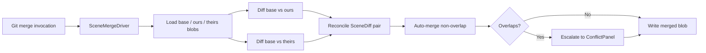
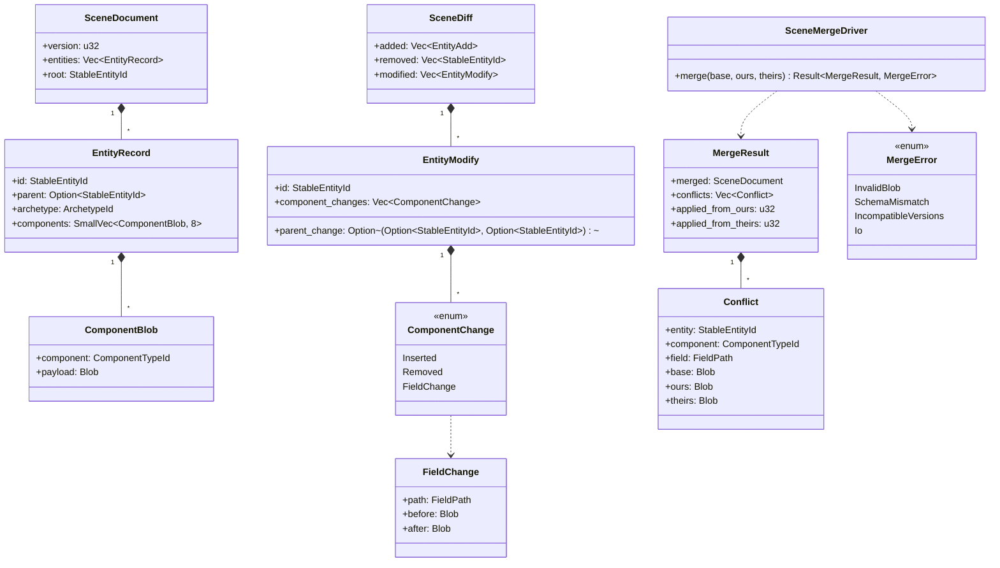
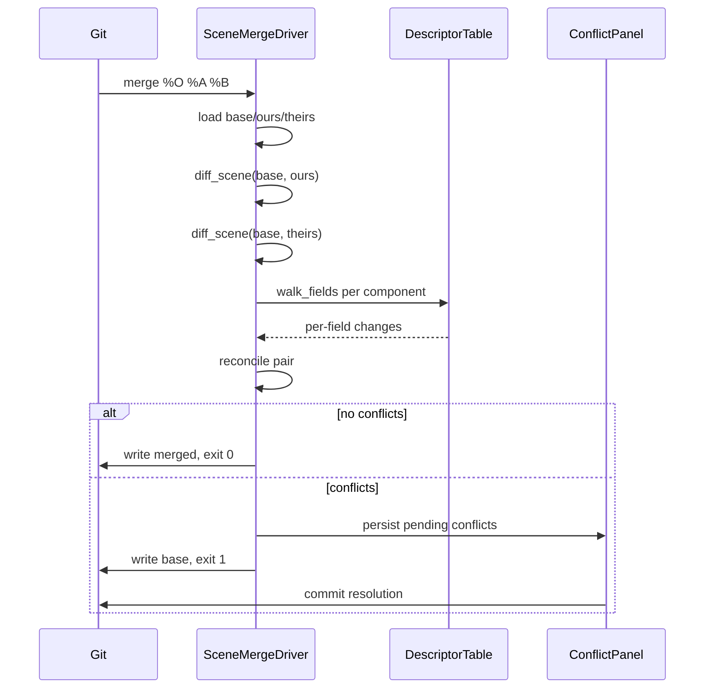

# Scene Versioning and Structural Merge Design

## Requirements Trace

> **Canonical sources:** Features, requirements, and user stories live in
> [features/](../../features/), [requirements/](../../requirements/), and
> [user-stories/](../../user-stories/).

### Primary Requirements

| Feature    | Requirement  | User Story   | Design Element                       |
|------------|--------------|--------------|--------------------------------------|
| F-15.10.3  | R-15.10.3    | US-15.10.3   | `SceneMergeDriver` Git driver        |
| F-15.10.9  | R-15.10.9    | US-15.10.9   | Per-property three-way merge         |
| F-12.7.4   | R-12.7.4     | US-12.7.4    | `SceneDiff` structural diff          |
| F-15.8.13  | R-15.8.13    | US-15.8.13   | Entity-level diff (add/del/mod)      |
| F-15.10.10 | R-15.10.10   | US-15.10.10  | Conflict resolution UI bridge        |

1. **R-15.10.3** -- Git merge driver that produces a merged scene without binary conflict markers
2. **R-15.10.9** -- Each conflicting scene property offers ours / theirs / manual resolution
3. **R-12.7.4** -- `SceneDiff` enumerates added, deleted, and modified entities with component data
4. **R-15.8.13** -- Every entity change records before/after blobs keyed by `(EntityRef, CompId)`
5. **R-15.10.10** -- Unresolvable conflicts escalate to the binary conflict resolver UI

### Cross-Cutting Dependencies

| Dependency           | Source    | Consumed API                         |
|----------------------|-----------|--------------------------------------|
| Scene serialization  | F-12.7.1  | `SceneDocument` rkyv archive         |
| Codegen type map     | F-1.4.1   | `ComponentDescriptor` table          |
| Editor commands      | F-15.1.3  | `CommandPayload` for apply/undo      |
| Asset database       | F-12.3.1  | Stable `EntityRef` across sessions   |
| Binary conflict UI   | F-15.10.9 | `ConflictPanel` handler              |

---

## Overview

Scene files in Harmonius are rkyv binary documents, not text. Native Git merge therefore produces a
binary conflict. `scene-versioning` replaces that behavior with a structural three-way merge that
understands entities, components, and property fields via codegen'd type descriptors.

The merge pipeline consumes `base`, `ours`, and `theirs` scene blobs, emits a `SceneDiff` for each
side against the base, then reconciles the two diffs into a `MergeResult`. Non-conflicting changes
from both sides are auto-applied. Overlapping property changes produce `Conflict` records that the
binary conflict UI resolves interactively.

### Design Principles

1. **Structural, not textual** -- scenes are typed trees; diff and merge operate on typed fields
2. **Stable entity identity** -- every entity has a `StableEntityId(u64)` persisted in the scene
3. **Per-property granularity** -- conflict granularity is a single `(Entity, Component, FieldPath)`
4. **Deterministic** -- identical inputs produce identical merge output (golden tests)
5. **Git-native integration** -- registered via `.gitattributes` and `.git/config`
6. **No HashMap on hot path** -- diff indices use sorted `Vec<(StableEntityId, ChangeSet)>`
7. **Headless-friendly** -- full merge runs in CI and on headless machines; UI is optional

---

## Architecture

### Pipeline Flow



### Class Diagram



### Scene Identity Model

Entities inside a `SceneDocument` carry a `StableEntityId(u64)` that is assigned at spawn and never
reused. This ID is what diff and merge key on; Git renames and tree moves are irrelevant at the
scene level. If two branches independently spawn new entities, their IDs are guaranteed unique by
the `StableEntityIdAllocator` (128-bit namespace seeded from the creator's `UserId`).

---

## API Design

### Scene Document

```rust
#[derive(Archive, Serialize, Deserialize)]
pub struct SceneDocument {
    pub version: u32,
    pub root: StableEntityId,
    pub entities: Vec<EntityRecord>,
}

#[derive(Archive, Serialize, Deserialize)]
pub struct EntityRecord {
    pub id: StableEntityId,
    pub parent: Option<StableEntityId>,
    pub archetype: ArchetypeId,
    pub components: SmallVec<[ComponentBlob; 8]>,
}
```

### Diff

```rust
pub fn diff_scene(base: &SceneDocument, other: &SceneDocument) -> SceneDiff;

pub struct SceneDiff {
    pub added: Vec<EntityAdd>,
    pub removed: Vec<StableEntityId>,
    pub modified: Vec<EntityModify>,
}

pub struct EntityModify {
    pub id: StableEntityId,
    pub parent_change: Option<(Option<StableEntityId>, Option<StableEntityId>)>,
    pub component_changes: Vec<ComponentChange>,
}

pub enum ComponentChange {
    Inserted { component: ComponentTypeId, value: Blob },
    Removed { component: ComponentTypeId, old: Blob },
    FieldChange { component: ComponentTypeId, path: FieldPath, before: Blob, after: Blob },
}
```

Per-field diff uses codegen'd `walk_fields()` functions. A component without field walkers falls
back to whole-component replacement (`Inserted`/`Removed` pair with old and new blobs).

### Merge Driver

```rust
pub struct SceneMergeDriver {
    descriptors: ComponentDescriptorTable,
}

impl SceneMergeDriver {
    pub fn merge(
        &self,
        base: &SceneDocument,
        ours: &SceneDocument,
        theirs: &SceneDocument,
    ) -> Result<MergeResult, MergeError>;
}

pub struct MergeResult {
    pub merged: SceneDocument,
    pub conflicts: Vec<Conflict>,
    pub applied_from_ours: u32,
    pub applied_from_theirs: u32,
}
```

### Conflict Reconciliation Rules

| Ours change       | Theirs change     | Resolution                                |
|-------------------|-------------------|-------------------------------------------|
| None              | Any               | Apply theirs                              |
| Any               | None              | Apply ours                                |
| Add entity        | Add entity (same id diff) | Impossible (ids unique per user)  |
| Remove entity     | Remove entity     | Apply remove                              |
| Remove entity     | Modify entity     | Conflict: entity-level                    |
| Modify entity     | Remove entity     | Conflict: entity-level                    |
| FieldChange same  | FieldChange same  | Equal? Apply once, else per-field conflict|
| FieldChange diff  | FieldChange diff  | Apply both (different fields)             |
| Insert component  | Insert component  | Equal blob? Apply once, else conflict     |
| Remove component  | FieldChange same  | Conflict                                  |

---

## Git Integration

### `.gitattributes`

```text
*.hscene merge=harmonius-scene
*.hprefab merge=harmonius-scene
```

### `.git/config`

```text
[merge "harmonius-scene"]
  name = Harmonius structural scene merge
  driver = harmonius merge-driver --base %O --ours %A --theirs %B --output %A
  recursive = binary
```

The driver writes the merged scene to `%A` and exits zero on clean merges. On conflicts, it writes
the base version and exits one so Git marks the file unmerged. The editor detects the unmerged state
on next open and launches the conflict panel.

### CLI Entry Point

```rust
pub fn run_merge_driver(args: MergeDriverArgs) -> i32 {
    let base = load_scene(&args.base)?;
    let ours = load_scene(&args.ours)?;
    let theirs = load_scene(&args.theirs)?;
    let driver = SceneMergeDriver::new(descriptor_table());
    match driver.merge(&base, &ours, &theirs) {
        Ok(r) if r.conflicts.is_empty() => { write_scene(&args.output, &r.merged)?; 0 }
        Ok(r) => { persist_conflicts(&args.output, &r)?; 1 }
        Err(_) => 2,
    }
}
```

---

## Data Flow



---

## New / Deleted / Modified Representation

| Kind              | Wire Form                                                          |
|-------------------|--------------------------------------------------------------------|
| New entity        | `EntityAdd { record: EntityRecord }`                               |
| Deleted entity    | `StableEntityId` in `SceneDiff::removed`                           |
| Modified entity   | `EntityModify { id, parent_change, component_changes }`            |
| New component     | `ComponentChange::Inserted { component, value }`                   |
| Removed component | `ComponentChange::Removed { component, old }`                      |
| Field edit        | `ComponentChange::FieldChange { component, path, before, after }` |
| Reparent          | `EntityModify::parent_change = Some((old, new))`                   |

`FieldPath` is a small Vec of `(field_name, Option<index>)` pairs, supporting nested structs and
vector indices. Vector edits with length changes always produce a whole-component replacement to
avoid index reassignment ambiguity.

---

## Platform Considerations

| Platform | Notes                                                            |
|----------|------------------------------------------------------------------|
| Windows  | Driver invoked via `cmd /c harmonius.exe merge-driver ...`       |
| macOS    | Driver invoked via POSIX exec; xattrs on scene files ignored     |
| Linux    | Driver invoked via POSIX exec; symlinks resolved before load     |

All file I/O uses the platform I/O bridge (no direct filesystem calls from systems). The merge
driver process runs synchronously under Git — it is safe to block inside the driver.

---

## Test Plan

See [scene-versioning-test-cases.md](scene-versioning-test-cases.md) for TC-15.10.x.y entries:

- Unit tests for diff, reconcile, and merge on typed component trees
- Integration tests via actual Git merge invocation
- Benchmarks for diff / merge latency on large scenes

---

## Open Questions

1. How do we represent schema migrations across versions during a three-way merge?
2. Should the driver emit a merge commit message summarizing per-property resolutions?
3. What is the policy for cyclic parenting produced by parallel reparent edits?
4. Do we snapshot base scenes into a CAS for fast re-open without re-fetching from Git history?
