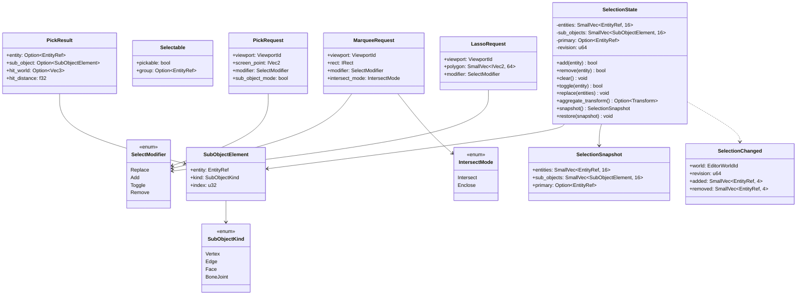
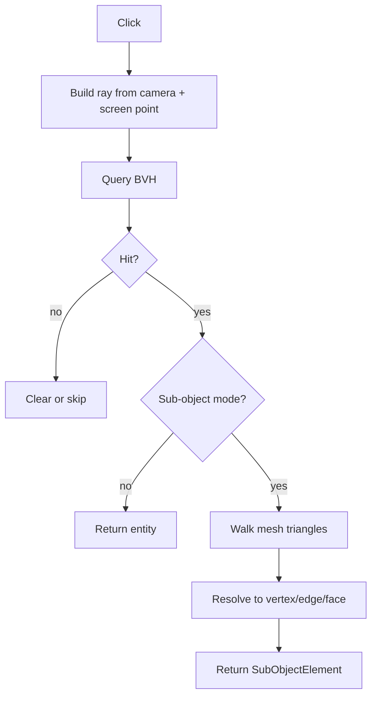
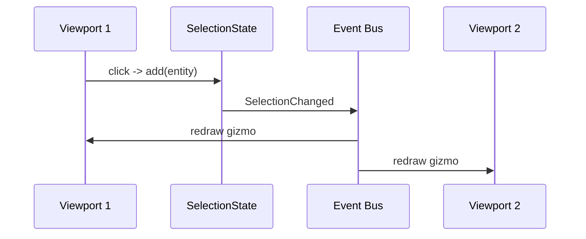
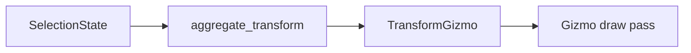

# Editor Selection Model Design

## Requirements Trace

> **Canonical sources:** Features, requirements, and user stories live in
> [features/](../../features/), [requirements/](../../requirements/), and
> [user-stories/](../../user-stories/).

### Primary Requirements

| Feature    | Requirement | User Story   | Design Element                  |
|------------|-------------|--------------|---------------------------------|
| F-15.1.4.1 | R-15.1.4.1  | US-15.1.4.1  | `SelectionState` per-world      |
| F-15.1.4.2 | R-15.1.4.2  | US-15.1.4.2  | `Selectable` component          |
| F-15.1.4.3 | R-15.1.4.3  | US-15.1.4.3  | Multi-viewport selection sync   |
| F-15.1.4.4 | R-15.1.4.4  | US-15.1.4.4  | Sub-object picking              |
| F-15.1.4.5 | R-15.1.4.5  | US-15.1.4.5  | Marquee selection               |
| F-15.1.4.6 | R-15.1.4.6  | US-15.1.4.6  | Lasso selection                 |
| F-15.1.4.7 | R-15.1.4.7  | US-15.1.4.7  | Gizmo coupling                  |
| F-15.1.4.8 | R-15.1.4.8  | US-15.1.4.8  | Selection events for observers  |

1. **R-15.1.4.1** -- `SelectionState` per editor world, stored as `Res<SelectionState>`
2. **R-15.1.4.2** -- `Selectable` component with pickable flag and parent group
3. **R-15.1.4.3** -- Selection changes broadcast to all viewports via event
4. **R-15.1.4.4** -- Sub-object picking via CPU raycast + BVH query; supports vertex/edge/face
5. **R-15.1.4.5** -- Rectangle marquee selects intersecting or enclosed entities
6. **R-15.1.4.6** -- Lasso (closed polygon) selection using point-in-polygon
7. **R-15.1.4.7** -- Gizmo position and axis set from selection aggregate transform
8. **R-15.1.4.8** -- `SelectionChanged` event emitted on any mutation

### Cross-Cutting Dependencies

| Dependency       | Source    | Consumed API                  |
|------------------|-----------|-------------------------------|
| Editor core      | F-15.1    | `EditorWorld`, viewport state |
| Scene transforms | F-1.2.1   | `GlobalTransform`             |
| Spatial index    | F-1.9.1   | BVH for ray/volume queries    |
| Events           | F-1.5.1   | `SelectionChanged`            |
| Undo/redo        | F-15.1.3  | Selection snapshots           |
| Mesh assets      | F-2.4     | Sub-object triangle data      |

---

## Overview

Selection drives nearly every other editor feature: property inspector, gizmos, outliner, transform
commands, cut/copy/paste. This document specifies the unified selection model covering entity,
sub-object, multi-viewport, marquee, and lasso operations.

### Design Principles

1. **Single source of truth** -- one `SelectionState` resource per editor world
2. **Viewports share selection** -- multi-viewport editors broadcast changes
3. **Sub-object as an element reference** -- `SubObjectElement { entity, kind, index }`
4. **CPU raycast for picking** -- spatial BVH + mesh triangle walk
5. **Gizmos read selection** -- selection is data; gizmos are a view
6. **Events, not polling** -- panels subscribe to `SelectionChanged`
7. **No HashMap on hot path** -- entity set is `SmallVec<[EntityRef; 16]>` with sort-on-insert

---

## Architecture

### Class Diagram



### Picking Flow



---

## API Design

### Selection State

```rust
#[derive(Resource, Default)]
pub struct SelectionState {
    entities: SmallVec<[EntityRef; 16]>,
    sub_objects: SmallVec<[SubObjectElement; 16]>,
    primary: Option<EntityRef>,
    revision: u64,
}

impl SelectionState {
    pub fn add(&mut self, entity: EntityRef) -> bool {
        match self.entities.binary_search(&entity) {
            Ok(_) => false,
            Err(idx) => {
                self.entities.insert(idx, entity);
                self.primary.get_or_insert(entity);
                self.revision += 1;
                true
            }
        }
    }

    pub fn replace(&mut self, entities: impl IntoIterator<Item = EntityRef>) {
        self.entities.clear();
        self.sub_objects.clear();
        self.primary = None;
        for e in entities {
            self.add(e);
        }
    }

    pub fn snapshot(&self) -> SelectionSnapshot {
        SelectionSnapshot {
            entities: self.entities.clone(),
            sub_objects: self.sub_objects.clone(),
            primary: self.primary,
        }
    }

    pub fn restore(&mut self, snap: SelectionSnapshot) {
        self.entities = snap.entities;
        self.sub_objects = snap.sub_objects;
        self.primary = snap.primary;
        self.revision += 1;
    }
}
```

### Picking

```rust
pub fn pick(
    req: &PickRequest,
    world: &EditorWorld,
    bvh: &SharedBvh,
) -> PickResult {
    let camera = world.camera(req.viewport);
    let ray = camera.screen_to_ray(req.screen_point);

    let Some(hit) = bvh.raycast(ray, &PickFilter::selectable()) else {
        return PickResult::miss();
    };

    if !req.sub_object_mode {
        return PickResult::entity(hit.entity, hit.world_point, hit.distance);
    }

    let mesh = world.mesh_for(hit.entity);
    let element = resolve_sub_object(&mesh, hit.triangle_index, hit.barycentric);
    PickResult::sub_object(hit.entity, element, hit.world_point, hit.distance)
}
```

### Marquee / Lasso

```rust
pub fn marquee_select(
    req: &MarqueeRequest,
    world: &EditorWorld,
) -> SmallVec<[EntityRef; 16]> {
    let camera = world.camera(req.viewport);
    let frustum = camera.build_sub_frustum(req.rect);
    world
        .selectable_bounds()
        .filter(|b| match req.intersect_mode {
            IntersectMode::Intersect => frustum.intersects(b.bounds),
            IntersectMode::Enclose => frustum.encloses(b.bounds),
        })
        .map(|b| b.entity)
        .collect()
}
```

Lasso builds a 2D polygon, projects each selectable entity's bounds to screen, and uses
point-in-polygon on the center (or bounds corners).

---

## Data Flow

### Viewport Sync



### Selection -> Gizmo



`aggregate_transform()` returns the average of selected entities' `GlobalTransform`, used to
position the gizmo.

---

## Platform Considerations

| Platform | Screen Point Source          |
|----------|------------------------------|
| Desktop  | Mouse                        |
| Touch    | Tap centroid                 |
| VR       | Controller ray projection    |

All inputs feed the same `PickRequest` structure; only the screen-point source differs.

---

## Test Plan

See [selection-model-test-cases.md](selection-model-test-cases.md) for TC-15.1.4.x.y entries:

- Unit tests for add/remove/toggle/clear/replace, snapshot/restore
- Integration tests for picking, sub-object resolution, marquee, lasso
- Event emission tests
- Benchmarks for 10k-entity marquee

---

## Open Questions

1. Should sub-objects persist across selection refreshes, or clear on each new pick?
2. Do we support mixed entity + sub-object selection (both at once)?
3. How does selection behave during play-in-editor (frozen? mirrored?)?
4. Should gizmo snapping affect aggregate transform calculation?
