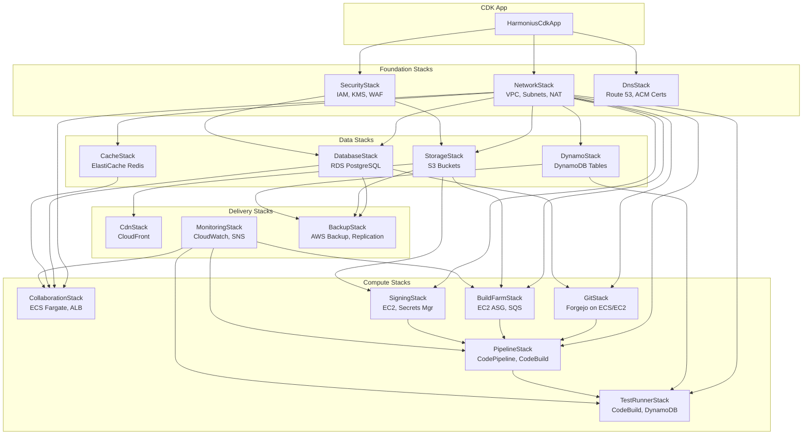
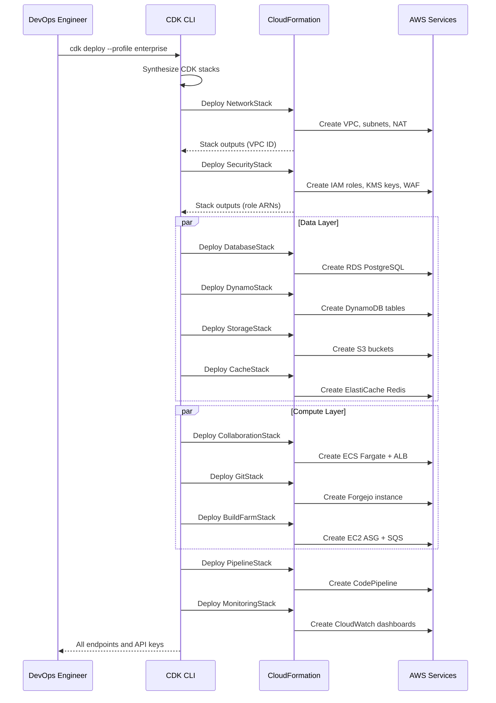
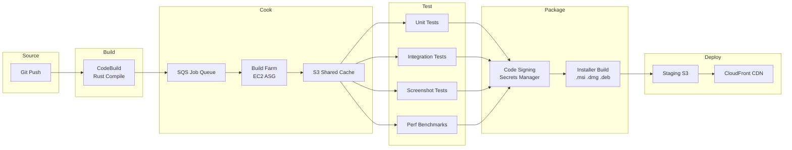
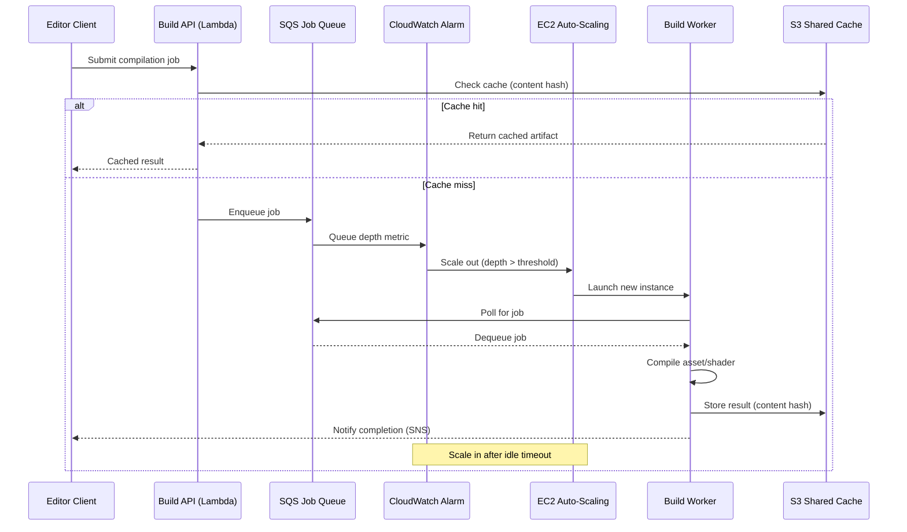
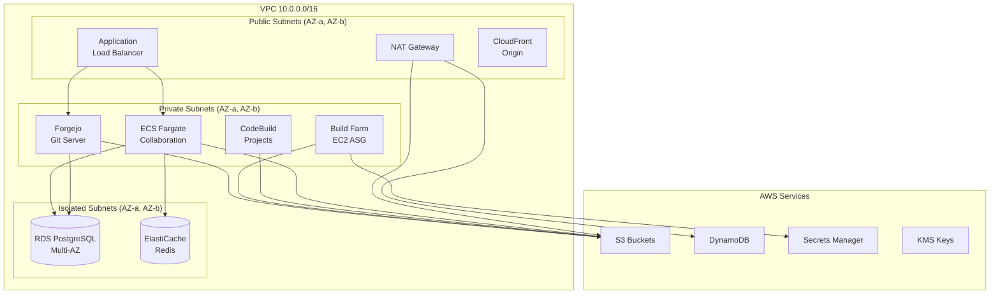

# Server Infrastructure Design

## Requirements Trace

> **Canonical sources:** Features, requirements, and user stories are defined in
> [features/tools-editor/](../../features/tools-editor/),
> [requirements/tools-editor/](../../requirements/tools-editor/), and
> [user-stories/tools-editor/](../../user-stories/tools-editor/). The table below traces design
> elements to those definitions.

| Feature | Requirement | Description |
|---------|-------------|-------------|
| F-15.18.1 | R-15.18.1 | AWS CDK deployment stacks (Free Tier + Enterprise) |
| F-15.18.2 | R-15.18.2 | Live collaboration server (CRDT, WebSocket, RDS, S3) |
| F-15.18.3 | R-15.18.3 | Git and Git LFS hosting with locking |
| F-15.18.4 | R-15.18.4 | Asset and shader compilation server (build farm) |
| F-15.18.5 | R-15.18.5 | Signing and distribution server |
| F-15.18.6 | R-15.18.6 | Continuous deployment pipeline |
| F-15.18.7 | R-15.18.7 | Test runner infrastructure |
| F-15.18.8 | R-15.18.8 | Shared cache and database services |
| F-15.18.9 | R-15.18.9 | Backup and disaster recovery |
| F-15.18.10 | R-15.18.10 | Enterprise security configuration |

## Overview

The server infrastructure provides a fully self-hosted AWS backend for the Harmonius engine. All
components are deployed via modular AWS CDK stacks in TypeScript. A single CLI command provisions
the entire stack. Two deployment profiles exist: **Free Tier** (solo developers, prototyping) and
**Enterprise** (production studios, multi-AZ, auto-scaling).

Key subsystems:

1. **Collaboration** -- CRDT server for real-time multi-user editing
2. **Git hosting** -- Forgejo with S3-backed LFS
3. **Build farm** -- Auto-scaling EC2 for asset cooking and shader compilation
4. **CI/CD pipeline** -- CodePipeline for build, test, sign, package, deploy
5. **Data services** -- RDS PostgreSQL, DynamoDB, Redis, S3 shared cache
6. **Security** -- VPC isolation, WAF, KMS encryption, IAM least-privilege
7. **Monitoring** -- CloudWatch dashboards, SNS alerts, CloudTrail audit
8. **Backup/DR** -- Automated backups, cross-region replication

All Rust client code (editor plugins, CLI tools) uses `async`/`await` with platform-native async I/O
per project constraints. The CDK stacks themselves are TypeScript (AWS CDK requirement).

## Architecture

### CDK Stack Dependency Graph



### Deployment Sequence



### CI/CD Pipeline Flow



### Build Farm Auto-Scaling



### Network Topology (Enterprise)



### Module Layout

```text
harmonius_infra/
├── bin/
│   └── app.ts              # CDK app entry point
├── lib/
│   ├── config.ts           # DeploymentProfile enum,
│   │                       # stack configuration
│   ├── foundation/
│   │   ├── network.ts      # VPC, subnets, NAT,
│   │   │                   # security groups
│   │   ├── security.ts     # IAM roles, KMS keys,
│   │   │                   # WAF rules
│   │   └── dns.ts          # Route 53, ACM certs
│   ├── data/
│   │   ├── database.ts     # RDS PostgreSQL
│   │   ├── dynamo.ts       # DynamoDB tables
│   │   ├── storage.ts      # S3 buckets, lifecycle
│   │   └── cache.ts        # ElastiCache Redis
│   ├── compute/
│   │   ├── collaboration.ts # ECS Fargate, ALB,
│   │   │                    # WebSocket
│   │   ├── git.ts          # Forgejo on ECS/EC2,
│   │   │                   # LFS config
│   │   ├── build-farm.ts   # EC2 ASG, SQS queue,
│   │   │                   # scaling policy
│   │   ├── signing.ts      # EC2, Secrets Manager,
│   │   │                   # CodePipeline action
│   │   ├── pipeline.ts     # CodePipeline stages,
│   │   │                   # CodeBuild projects
│   │   └── test-runner.ts  # CodeBuild, golden
│   │                       # image S3, DynamoDB
│   ├── delivery/
│   │   ├── cdn.ts          # CloudFront
│   │   │                   # distributions
│   │   ├── monitoring.ts   # CloudWatch dashboards,
│   │   │                   # SNS topics, alarms
│   │   └── backup.ts       # AWS Backup plans,
│   │                       # cross-region
│   └── profiles/
│       ├── free-tier.ts    # Free tier defaults
│       └── enterprise.ts   # Enterprise defaults
├── tools/
│   └── restore-cli/        # Rust CLI for DR
│       ├── Cargo.toml
│       └── src/
│           └── main.rs
└── test/
    └── stacks/             # CDK snapshot tests
```

## Deployment Profile Comparison

| Resource | Free Tier | Enterprise |
|----------|-----------|------------|
| VPC | Default VPC | Custom VPC, 3 AZs, NAT Gateway |
| RDS | db.t3.micro, single-AZ, 20 GB | db.r6g.large, Multi-AZ, 500 GB, read replicas |
| DynamoDB | On-demand, no PITR | Provisioned, PITR enabled |
| ElastiCache | None (use DynamoDB) | cache.r6g.large Redis cluster |
| ECS Collaboration | 1 Fargate task, 0.25 vCPU | Auto-scaling 2-10 tasks, 1 vCPU |
| Git Server | t3.micro EC2, 5 GB S3 | m6i.large, unlimited S3, CloudFront |
| Build Farm | t3.micro (CPU only) | c6i.2xlarge + g5.xlarge spot ASG |
| CodeBuild | 1 project, small compute | Parallel projects, large compute |
| CloudFront | None | Full CDN for assets and LFS |
| WAF | None | SQL injection, XSS, rate limiting |
| GuardDuty | None | Enabled |
| Backups | 7-day RDS, S3 versioning | 35-day, cross-region replication |
| Estimated cost | $0-5/month | $300-1500/month |

### Core Data Structures

```mermaid
classDiagram
    class DeploymentProfile {
        <<enumeration>>
        FreeTier
        Enterprise
    }
    class BuildJobType {
        <<enumeration>>
        AssetCook
        ShaderCompile
        LogicGraphCompile
    }
    class TargetPlatform {
        <<enumeration>>
        Windows
        MacOs
        Linux
        Ios
        Android
    }
    class PipelineStage {
        <<enumeration>>
        Source
        Build
        Cook
        Test
        Package
        Deploy
    }
    class PipelineStatus {
        <<enumeration>>
        Succeeded
        Failed
        InProgress
        Cancelled
    }
    class Permission {
        <<enumeration>>
        ReadOnly
        ReadWrite
        Admin
    }
    class TestSuiteKind {
        <<enumeration>>
        Unit
        Integration
        Screenshot
        PerformanceBenchmark
        Stress
    }
    class AlarmSeverity {
        <<enumeration>>
        Info
        Warning
        Critical
    }
    class MetricNamespace {
        <<enumeration>>
        BuildFarm
        Collaboration
        Pipeline
        TestRunner
        GitServer
    }
    class IssueSeverity {
        <<enumeration>>
        Warning
        Critical
    }
    class InfraConfig {
        +String account_id
        +String region
        +DeploymentProfile profile
        +String engine_version
        +Option~String~ domain
        +bool cross_region_dr
    }
    class BuildJob {
        +ContentHash content_hash
        +BuildJobType job_type
        +String source_url
    }
    class BuildJobResult {
        <<enumeration>>
        CacheHit
        Compiled
        Failed
    }
    class BuildFarmClient {
        -String api_endpoint
        -String auth_token
        +submit(job) Future~JobId~
        +poll_status(job_id) Future~BuildJobResult~
        +check_cache(hash) Future~Option~String~~
    }
    class CollabMessage {
        <<enumeration>>
        CrdtOp
        Presence
        AccessControl
        Chat
        SessionEvent
    }
    class CollabClient {
        -String ws_endpoint
        +connect(session_id) Future~CollabSession~
    }
    class CollabSession {
        -SessionId session_id
        +send(msg) Future~Result~
        +recv() Future~CollabMessage~
        +disconnect() Future~Result~
    }
    class PipelineConfig {
        +String git_webhook_url
        +bool enable_cook
        +bool enable_signing
        +Vec~TargetPlatform~ target_platforms
    }
    class PipelineResult {
        +String execution_id
        +Vec~StageResult~ stage_results
        +PipelineStatus overall_status
    }
    class StageResult {
        +PipelineStage stage
        +PipelineStatus status
        +u64 duration_ms
    }
    class RestoreTarget {
        <<enumeration>>
        Full
        Database
        Storage
        DynamoTable
    }
    class BackupStatus {
        +Option~u64~ rds_last_backup
        +bool s3_versioning_enabled
        +bool cross_region_healthy
    }
    class RestoreClient {
        -InfraConfig config
        +check_status() Future~BackupStatus~
        +restore(target) Future~Result~
    }
    class TestRunResult {
        +TestSuiteKind suite
        +u32 passed
        +u32 failed
        +u32 skipped
    }
    class ScreenshotConfig {
        +u8 pixel_threshold
        +f32 diff_percent_threshold
        +String golden_bucket
    }
    class AlarmConfig {
        +String name
        +MetricNamespace namespace
        +f64 threshold
        +AlarmSeverity severity
    }

    InfraConfig --> DeploymentProfile
    BuildJob --> BuildJobType
    BuildFarmClient --> BuildJob
    BuildFarmClient --> BuildJobResult
    CollabClient --> CollabSession
    CollabSession --> CollabMessage
    CollabMessage --> Permission
    PipelineConfig --> TargetPlatform
    PipelineResult *-- StageResult
    StageResult --> PipelineStage
    StageResult --> PipelineStatus
    RestoreClient --> RestoreTarget
    RestoreClient --> BackupStatus
    BackupStatus --> IssueSeverity
    TestRunResult --> TestSuiteKind
    AlarmConfig --> AlarmSeverity
    AlarmConfig --> MetricNamespace
```



## API Design

### CDK Stack Configuration

```rust
/// Deployment profile selection.
#[derive(Clone, Copy, Debug, PartialEq, Eq)]
pub enum DeploymentProfile {
    /// Solo developers, prototyping. Stays within
    /// AWS Free Tier limits.
    FreeTier,
    /// Production studios. Multi-AZ, auto-scaling,
    /// full security controls.
    Enterprise,
}

/// Top-level configuration for all CDK stacks.
/// Passed to every stack constructor.
pub struct InfraConfig {
    /// AWS account ID.
    pub account_id: String,
    /// AWS region (e.g., "us-east-1").
    pub region: String,
    /// Deployment profile.
    pub profile: DeploymentProfile,
    /// Engine version this infrastructure is
    /// pinned to.
    pub engine_version: String,
    /// Domain name for Route 53 (optional).
    pub domain: Option<String>,
    /// Enable cross-region DR replication.
    pub cross_region_dr: bool,
    /// DR replication target region.
    pub dr_region: Option<String>,
}
```

### Build Job Submission (Rust Client)

```rust
/// A compilation job submitted to the build farm.
pub struct BuildJob {
    /// Content hash of the source asset.
    pub content_hash: ContentHash,
    /// Job type determines instance requirements.
    pub job_type: BuildJobType,
    /// Source asset bytes (S3 presigned upload URL).
    pub source_url: String,
    /// Notification topic ARN for completion.
    pub notify_topic: Option<String>,
}

#[derive(Clone, Copy, Debug, PartialEq, Eq)]
pub enum BuildJobType {
    /// Texture compression, LOD generation,
    /// meshlet building.
    AssetCook,
    /// HLSL to DXIL/SPIR-V/MSL compilation.
    ShaderCompile,
    /// Logic graph bytecode generation.
    LogicGraphCompile,
}

/// Result of a build job.
pub enum BuildJobResult {
    /// Cache hit -- artifact already existed.
    CacheHit { artifact_url: String },
    /// Compiled successfully.
    Compiled {
        artifact_url: String,
        duration_ms: u64,
    },
    /// Compilation failed.
    Failed { error: String },
}

/// Client for submitting jobs to the build farm.
/// All methods are async -- uses platform-native
/// I/O per project constraints.
pub struct BuildFarmClient {
    api_endpoint: String,
    auth_token: String,
}

impl BuildFarmClient {
    pub fn new(
        api_endpoint: String,
        auth_token: String,
    ) -> Self;

    /// Submit a build job. Returns immediately
    /// with a job ID. Poll or await SNS
    /// notification for completion.
    pub async fn submit(
        &self,
        job: BuildJob,
    ) -> Result<JobId, BuildError>;

    /// Poll job status.
    pub async fn poll_status(
        &self,
        job_id: JobId,
    ) -> Result<BuildJobResult, BuildError>;

    /// Check the shared cache for a pre-built
    /// artifact by content hash.
    pub async fn check_cache(
        &self,
        hash: ContentHash,
    ) -> Result<Option<String>, BuildError>;
}
```

### Collaboration Server Protocol

```rust
/// WebSocket message types for the collaboration
/// server.
#[derive(Clone, Debug)]
pub enum CollabMessage {
    /// CRDT operation for entity edits.
    CrdtOp {
        document_id: DocumentId,
        operation: Vec<u8>,
    },
    /// Presence update (cursor, selection).
    Presence {
        user_id: UserId,
        position: CursorPosition,
    },
    /// Access control change.
    AccessControl {
        document_id: DocumentId,
        user_id: UserId,
        permission: Permission,
    },
    /// Chat message relay.
    Chat {
        channel_id: ChannelId,
        sender: UserId,
        content: String,
    },
    /// Session join/leave notification.
    SessionEvent {
        session_id: SessionId,
        event: SessionEventKind,
    },
}

#[derive(Clone, Copy, Debug, PartialEq, Eq)]
pub enum Permission {
    ReadOnly,
    ReadWrite,
    Admin,
}

#[derive(Clone, Debug)]
pub enum SessionEventKind {
    Joined { user_id: UserId },
    Left { user_id: UserId },
}

/// Collaboration client. All I/O is async.
pub struct CollabClient {
    ws_endpoint: String,
    auth_token: String,
}

impl CollabClient {
    pub fn new(
        ws_endpoint: String,
        auth_token: String,
    ) -> Self;

    /// Connect to a collaboration session.
    pub async fn connect(
        &self,
        session_id: SessionId,
    ) -> Result<CollabSession, CollabError>;
}

/// An active collaboration session over WebSocket.
pub struct CollabSession {
    session_id: SessionId,
}

impl CollabSession {
    /// Send a CRDT operation.
    pub async fn send(
        &self,
        msg: CollabMessage,
    ) -> Result<(), CollabError>;

    /// Receive the next message from the server.
    pub async fn recv(
        &self,
    ) -> Result<CollabMessage, CollabError>;

    /// Disconnect gracefully.
    pub async fn disconnect(
        self,
    ) -> Result<(), CollabError>;
}
```

### CI/CD Pipeline Configuration

```rust
/// Pipeline stage configuration. Stages can be
/// enabled or disabled per project phase.
pub struct PipelineConfig {
    /// Git server webhook URL for push triggers.
    pub git_webhook_url: String,
    /// Enable asset cooking stage.
    pub enable_cook: bool,
    /// Enable GPU screenshot tests.
    pub enable_screenshot_tests: bool,
    /// Enable performance benchmark tests.
    pub enable_perf_tests: bool,
    /// Enable code signing stage.
    pub enable_signing: bool,
    /// Enable store submission stage.
    pub enable_store_submit: bool,
    /// Target platforms to build for.
    pub target_platforms: Vec<TargetPlatform>,
    /// SNS topic ARN for failure notifications.
    pub failure_topic: String,
}

#[derive(Clone, Copy, Debug, PartialEq, Eq)]
pub enum TargetPlatform {
    Windows,
    MacOs,
    Linux,
    Ios,
    Android,
}

#[derive(Clone, Copy, Debug, PartialEq, Eq)]
pub enum PipelineStage {
    Source,
    Build,
    Cook,
    Test,
    Package,
    Deploy,
}

/// Pipeline execution result.
pub struct PipelineResult {
    pub execution_id: String,
    pub stage_results: Vec<StageResult>,
    pub overall_status: PipelineStatus,
}

pub struct StageResult {
    pub stage: PipelineStage,
    pub status: PipelineStatus,
    pub duration_ms: u64,
    pub logs_url: String,
}

#[derive(Clone, Copy, Debug, PartialEq, Eq)]
pub enum PipelineStatus {
    Succeeded,
    Failed,
    InProgress,
    Cancelled,
}
```

### Backup and Restore CLI

```rust
/// Restore target selection.
pub enum RestoreTarget {
    /// Restore all services to a point in time.
    Full { timestamp: u64 },
    /// Restore only RDS to a point in time.
    Database { timestamp: u64 },
    /// Restore specific S3 bucket version.
    Storage {
        bucket: String,
        version_id: String,
    },
    /// Restore DynamoDB table to a point in time.
    DynamoTable {
        table_name: String,
        timestamp: u64,
    },
}

/// Backup status for monitoring.
pub struct BackupStatus {
    pub rds_last_backup: Option<u64>,
    pub s3_versioning_enabled: bool,
    pub dynamo_pitr_enabled: bool,
    pub cross_region_healthy: bool,
    pub issues: Vec<BackupIssue>,
}

pub struct BackupIssue {
    pub resource: String,
    pub severity: IssueSeverity,
    pub message: String,
}

#[derive(Clone, Copy, Debug, PartialEq, Eq)]
pub enum IssueSeverity {
    Warning,
    Critical,
}

/// Restore CLI client. All I/O is async.
pub struct RestoreClient {
    config: InfraConfig,
}

impl RestoreClient {
    pub fn new(config: InfraConfig) -> Self;

    /// Check backup status across all services.
    pub async fn check_status(
        &self,
    ) -> Result<BackupStatus, RestoreError>;

    /// Restore from backup.
    pub async fn restore(
        &self,
        target: RestoreTarget,
    ) -> Result<(), RestoreError>;

    /// List available restore points.
    pub async fn list_restore_points(
        &self,
    ) -> Result<Vec<RestorePoint>, RestoreError>;
}
```

### Test Runner Configuration

```rust
/// Test suite types executed by the test runner.
#[derive(Clone, Copy, Debug, PartialEq, Eq)]
pub enum TestSuiteKind {
    /// Rust `cargo test` unit tests.
    Unit,
    /// Multi-system integration tests.
    Integration,
    /// Render scene, compare against golden image.
    Screenshot,
    /// Measure frame time, draw calls, memory.
    PerformanceBenchmark,
    /// Spawn N entities, simulate M seconds.
    Stress,
}

/// Result of a single test run.
pub struct TestRunResult {
    pub suite: TestSuiteKind,
    pub passed: u32,
    pub failed: u32,
    pub skipped: u32,
    pub duration_ms: u64,
    pub failures: Vec<TestFailure>,
}

pub struct TestFailure {
    pub test_name: String,
    pub message: String,
    /// S3 URL to diff image (screenshot tests).
    pub diff_url: Option<String>,
}

/// Screenshot comparison thresholds.
pub struct ScreenshotConfig {
    /// Maximum per-pixel color distance (0-255).
    pub pixel_threshold: u8,
    /// Maximum percentage of differing pixels.
    pub diff_percent_threshold: f32,
    /// S3 bucket for golden images.
    pub golden_bucket: String,
}
```

### Monitoring and Alerting

```rust
/// CloudWatch metric namespaces.
#[derive(Clone, Copy, Debug, PartialEq, Eq)]
pub enum MetricNamespace {
    BuildFarm,
    Collaboration,
    Pipeline,
    TestRunner,
    GitServer,
}

/// Alarm severity levels.
#[derive(Clone, Copy, Debug, PartialEq, Eq)]
pub enum AlarmSeverity {
    /// Informational, no page.
    Info,
    /// Warning, email notification.
    Warning,
    /// Critical, SNS + PagerDuty.
    Critical,
}

/// Alarm definition for the monitoring stack.
pub struct AlarmConfig {
    pub name: String,
    pub namespace: MetricNamespace,
    pub metric_name: String,
    pub threshold: f64,
    pub comparison: ComparisonOperator,
    pub period_seconds: u32,
    pub evaluation_periods: u32,
    pub severity: AlarmSeverity,
}

#[derive(Clone, Copy, Debug, PartialEq, Eq)]
pub enum ComparisonOperator {
    GreaterThanThreshold,
    LessThanThreshold,
    GreaterThanOrEqual,
    LessThanOrEqual,
}
```

### Error Types

```rust
pub enum BuildError {
    /// Network error communicating with API.
    Network { message: String },
    /// Authentication failed.
    Unauthorized,
    /// Job not found.
    NotFound { job_id: JobId },
    /// Queue is full, retry later.
    QueueFull,
    /// Compilation failed.
    CompilationFailed { error: String },
}

pub enum CollabError {
    /// WebSocket connection failed.
    ConnectionFailed { message: String },
    /// Authentication failed.
    Unauthorized,
    /// Session not found or expired.
    SessionNotFound { session_id: SessionId },
    /// Server closed the connection.
    Disconnected,
}

pub enum RestoreError {
    /// No backup found for the given timestamp.
    NoBackupAvailable { timestamp: u64 },
    /// Restore in progress, cannot start another.
    RestoreInProgress,
    /// AWS API error.
    AwsError { service: String, message: String },
}
```

## Data Flow

### Build Job Lifecycle

1. Editor client calls `BuildFarmClient::submit()`.
2. Lambda handler checks S3 cache by content hash.
3. On cache hit, return presigned URL immediately.
4. On cache miss, enqueue job to SQS.
5. CloudWatch alarm triggers ASG scale-out if queue depth exceeds threshold.
6. EC2 worker polls SQS, dequeues job.
7. Worker downloads source from S3 presigned URL.
8. Worker executes compilation (asset cook, shader compile, or logic graph compile).
9. Worker uploads result to S3 shared cache keyed by content hash.
10. Worker publishes completion to SNS topic.
11. Editor receives SNS notification (or polls).
12. CloudWatch alarm triggers ASG scale-in after idle timeout (5 minutes).

### Collaboration Session Lifecycle

1. Editor opens `CollabClient::connect()` via WebSocket to the ALB endpoint.
2. ALB routes to an ECS Fargate task.
3. Server authenticates via JWT token.
4. Server loads document state from RDS PostgreSQL.
5. Client sends CRDT operations via WebSocket.
6. Server broadcasts operations to all session participants.
7. Server persists CRDT state to RDS periodically (every 5 seconds or on significant changes).
8. Large binary assets are stored in S3, referenced by content hash in the CRDT document.
9. On disconnect, server updates presence state and notifies remaining participants.

### CI/CD Pipeline Execution

1. Git push triggers webhook to CodePipeline.
2. **Source stage:** CodeBuild clones repository.
3. **Build stage:** CodeBuild compiles Rust (debug + release) for all target platforms.
4. **Cook stage:** Build artifacts submitted to SQS for asset cooking on the build farm. Results
   stored in S3 shared cache.
5. **Test stage:** CodeBuild projects run unit, integration, screenshot, and performance tests in
   parallel. Failed tests halt the pipeline. Results stored in DynamoDB.
6. **Package stage:** Signing server signs binaries using credentials from Secrets Manager.
   Installer packages (.msi, .dmg, .deb) are built.
7. **Deploy stage:** Packages uploaded to staging S3. CloudFront invalidation triggered.
8. SNS notifications sent on success or failure.

### Backup and Restore Flow

1. AWS Backup runs scheduled backups:
   - RDS: automated snapshots per retention policy
   - S3: versioning + lifecycle rules
   - DynamoDB: continuous PITR
2. Enterprise profile replicates to DR region:
   - S3 cross-region replication
   - RDS read replica in DR region
   - DynamoDB global tables
3. CloudWatch monitors backup health.
4. On failure, SNS alert to operations team.
5. Restore CLI queries available restore points.
6. Restore CLI initiates restore via AWS APIs.
7. Restore CLI monitors progress and reports.

## Platform Considerations

### AWS Service Selection

| Component | AWS Service | Justification |
|-----------|-------------|---------------|
| Networking | VPC, ALB | Private subnets isolate databases; ALB handles WebSocket |
| Compute (containers) | ECS Fargate | Serverless containers; no EC2 management for collab/git |
| Compute (build) | EC2 ASG | GPU instances (g5) for shaders; spot pricing for cost |
| Compute (CI) | CodeBuild | Managed build environment; scales to zero |
| Database | RDS PostgreSQL | ACID transactions for collaboration state, user data |
| NoSQL | DynamoDB | Test results, metrics; auto-scaling, PITR |
| Cache | ElastiCache Redis | Session state, hot catalog; sub-millisecond reads |
| Object storage | S3 | Asset packages, LFS objects, build cache, backups |
| CDN | CloudFront | Global edge caching for asset downloads, LFS |
| Queue | SQS | Build job queue; dead-letter for failed jobs |
| Secrets | Secrets Manager | Signing credentials, DB passwords; auto-rotation |
| Encryption | KMS | At-rest encryption for RDS, S3, DynamoDB, EBS |
| Monitoring | CloudWatch | Metrics, logs, dashboards, alarms |
| Alerts | SNS | Email, SMS, webhook, PagerDuty integration |
| CI/CD | CodePipeline | Orchestrates build, test, sign, deploy stages |
| DNS | Route 53 | Custom domains for all endpoints |
| Security | WAF | SQL injection, XSS, rate limiting on ALB |
| Audit | CloudTrail | API call logging for compliance |
| Threat detection | GuardDuty | Anomaly detection (enterprise only) |
| Backup | AWS Backup | Centralized backup management |
| Git hosting | Forgejo (self-hosted) | GitHub-compatible API; open source; lightweight |

### Security Controls by Profile

| Control | Free Tier | Enterprise |
|---------|-----------|------------|
| VPC isolation | Default VPC | Custom VPC, private/public/isolated subnets |
| IAM policies | Least-privilege per service | Least-privilege + service control policies |
| Encryption at rest | KMS (S3, RDS) | KMS (all services) + CMK rotation |
| Encryption in transit | TLS 1.2 | TLS 1.3 enforced |
| WAF | Disabled | SQL injection, XSS, rate limit rules |
| GuardDuty | Disabled | Enabled + SNS alerts |
| CloudTrail | Disabled | Enabled, S3 log delivery |
| Secrets rotation | Manual | Automatic 30-day rotation |
| Network ACLs | Default | Restrictive per-subnet |

### Rust Client Async I/O

All Rust client code (editor plugins, restore CLI) uses `async`/`await` with the engine's
`IoReactor` for HTTP and WebSocket communication. No blocking I/O calls. HTTP requests use the
platform-native async backends (IOCP, GCD, io_uring) through the reactor abstraction.

```rust
// Example: submit build job from editor
async fn submit_build(
    client: &BuildFarmClient,
    asset: &AssetData,
) -> Result<String, BuildError> {
    let hash = asset.content_hash();

    // Check cache first (async HTTP via reactor)
    if let Some(url) = client.check_cache(hash).await?
    {
        return Ok(url);
    }

    // Submit job (async HTTP via reactor)
    let job_id = client
        .submit(BuildJob {
            content_hash: hash,
            job_type: BuildJobType::AssetCook,
            source_url: asset.upload_url().to_string(),
            notify_topic: None,
        })
        .await?;

    // Poll until complete (async, yields between)
    loop {
        match client.poll_status(job_id).await? {
            BuildJobResult::Compiled {
                artifact_url,
                ..
            } => return Ok(artifact_url),
            BuildJobResult::Failed { error } => {
                return Err(
                    BuildError::CompilationFailed {
                        error,
                    },
                );
            }
            BuildJobResult::CacheHit {
                artifact_url,
            } => return Ok(artifact_url),
        }
    }
}
```

## Test Plan

### Unit Tests

| Test | Req | Description |
|------|-----|-------------|
| `test_free_tier_instance_sizes` | R-15.18.1 | Verify Free Tier profile uses only t3.micro/t4g.micro instances |
| `test_enterprise_multi_az` | R-15.18.1 | Verify Enterprise profile creates resources in 3 AZs |
| `test_stack_outputs_contain_endpoints` | R-15.18.1 | Verify CDK stack outputs include all endpoint URLs and API keys |
| `test_collab_crdt_merge` | R-15.18.2 | Verify CRDT operations merge correctly with concurrent edits |
| `test_collab_presence_tracking` | R-15.18.2 | Verify presence updates propagate to all session members |
| `test_git_api_compatibility` | R-15.18.3 | Verify Forgejo REST API matches GitHub API for editor operations |
| `test_lfs_lock_unlock` | R-15.18.3 | Verify LFS lock prevents concurrent binary edits |
| `test_build_job_cache_hit` | R-15.18.4 | Verify cache hit returns artifact without queuing job |
| `test_build_job_cache_miss` | R-15.18.4 | Verify cache miss enqueues job and returns result |
| `test_signing_secrets_not_on_disk` | R-15.18.5 | Verify signing credentials are fetched from Secrets Manager only |
| `test_pipeline_failed_test_blocks` | R-15.18.6 | Verify failed test stage prevents progression to packaging |
| `test_screenshot_diff_threshold` | R-15.18.7 | Verify screenshot comparison respects pixel/percent thresholds |
| `test_kms_encryption_enabled` | R-15.18.8 | Verify KMS encryption on all S3 buckets, RDS, DynamoDB |
| `test_rds_backup_retention` | R-15.18.9 | Verify RDS backup retention matches profile (7 or 35 days) |
| `test_waf_sql_injection_block` | R-15.18.10 | Verify WAF blocks SQL injection in HTTP requests |

### Integration Tests

| Test | Req | Description |
|------|-----|-------------|
| `test_full_stack_deploy_free_tier` | R-15.18.1 | Deploy full Free Tier stack, verify all endpoints respond |
| `test_full_stack_deploy_enterprise` | R-15.18.1 | Deploy full Enterprise stack, verify multi-AZ and security |
| `test_collab_two_editors_sync` | R-15.18.2 | Two editor instances edit the same entity via collaboration server |
| `test_git_push_pull_lfs` | R-15.18.3 | Push a repo with LFS objects, pull from another client, verify data |
| `test_build_farm_shader_compile` | R-15.18.4 | Submit shader compilation, verify output matches local compile |
| `test_build_farm_auto_scale` | R-15.18.4 | Flood queue with jobs, verify ASG scales out, then back in |
| `test_pipeline_end_to_end` | R-15.18.6 | Push commit, verify pipeline completes all stages |
| `test_pipeline_failure_notification` | R-15.18.6 | Push failing commit, verify SNS notification sent |
| `test_screenshot_regression_blocks` | R-15.18.7 | Introduce visual regression, verify pipeline halted |
| `test_restore_rds_backup` | R-15.18.9 | Delete data, restore from backup, verify recovery |
| `test_cross_region_replication` | R-15.18.9 | Write to primary, verify data appears in DR region |
| `test_deploy_completes_under_15min` | US-15.18.1.7 | Verify full stack deployment completes within 15 minutes |
| `test_free_tier_cost_limits` | US-15.18.1.4 | Verify Free Tier stays within AWS Free Tier resource limits |

### CDK Snapshot Tests

| Test | Description |
|------|-------------|
| `test_network_stack_snapshot` | Verify NetworkStack template matches expected CloudFormation |
| `test_security_stack_snapshot` | Verify SecurityStack IAM policies match expected |
| `test_database_stack_snapshot` | Verify DatabaseStack RDS configuration matches expected |
| `test_build_farm_stack_snapshot` | Verify BuildFarmStack ASG and SQS match expected |
| `test_pipeline_stack_snapshot` | Verify PipelineStack stages match expected |

### Performance Tests

| Test | Target | Source |
|------|--------|--------|
| Build job submission latency | < 200 ms (cache hit) | US-15.18.4.1 |
| Collab operation round-trip | < 100 ms | US-15.18.2.4 |
| Git LFS download throughput | >= 80% of CloudFront bandwidth | US-15.18.3.1 |
| Pipeline total duration | < 30 min (small project) | US-15.18.6.1 |
| Stack deployment time | < 15 min (full stack) | US-15.18.1.7 |

## Open Questions

1. **Forgejo vs Gitea** -- Forgejo is the community fork of Gitea. Both expose a GitHub-compatible
   API. Forgejo has stronger community governance. Need to evaluate feature parity for LFS locking.
2. **Spot instance interruption handling** -- Build farm uses spot instances for cost savings. Need
   a strategy for job retry when spot instances are reclaimed (SQS visibility timeout + dead-letter
   queue).
3. **Collaboration server horizontal scaling** -- WebSocket sessions are stateful. Need sticky
   sessions on the ALB or a shared session store (Redis) for Fargate task migration.
4. **macOS signing in CI** -- iOS and macOS signing requires a macOS build agent. AWS offers Mac EC2
   instances (mac1.metal) but they are expensive and have 24-hour minimum allocation. Evaluate
   external macOS CI (Mac Stadium) as an alternative.
5. **CDK language** -- CDK stacks are TypeScript per AWS CDK convention. A Rust CDK (aws-cdk-rs)
   exists but is immature. Evaluate switching to Rust CDK when it reaches 1.0.
6. **Multi-region active-active** -- Current design is active-passive DR. Active-active would reduce
   latency for geographically distributed teams but adds significant complexity (conflict
   resolution, global DynamoDB tables, RDS Aurora Global).
7. **Cost alerting** -- Free Tier users need alerts if usage approaches Free Tier limits. AWS
   Budgets can provide this, but the CDK stack should configure budget alarms automatically.
