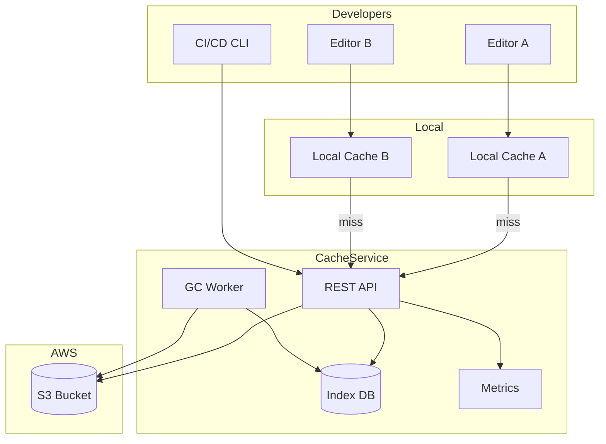
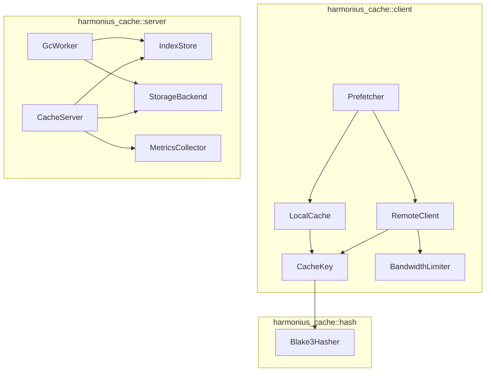
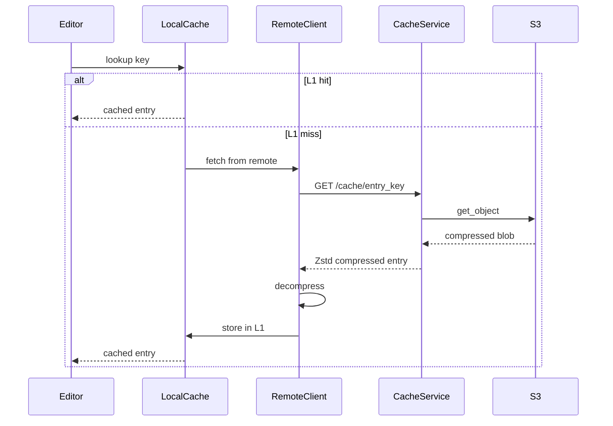
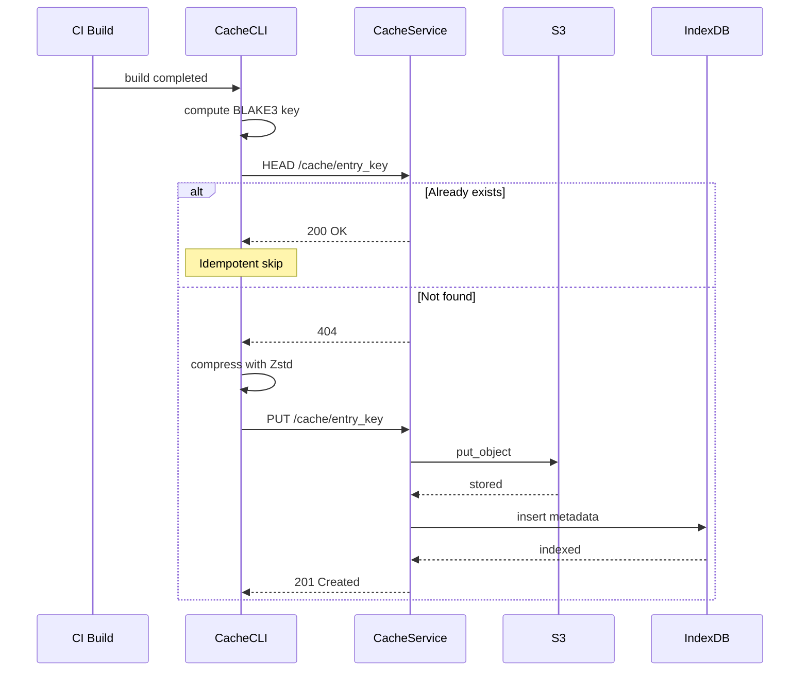
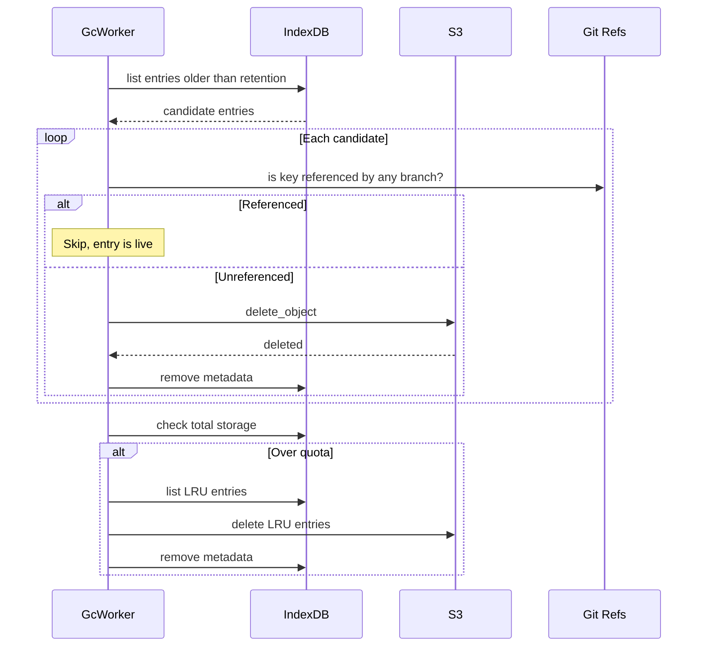
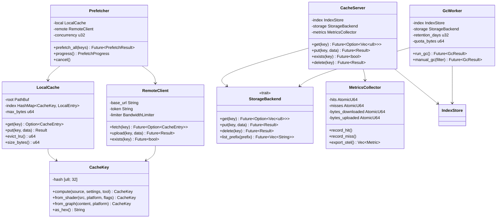

# Shared Asset Cache Design

## Requirements Trace

| Feature | Requirement | Description |
|---------|-------------|-------------|
| F-15.11.1 | R-15.11.1 | Centralized compiled asset cache keyed by content hash |
| F-15.11.2 | R-15.11.2 | Shader compilation cache per platform and permutation |
| F-15.11.3 | R-15.11.3 | Logic graph compilation cache (bytecode + AOT) |
| F-15.11.4 | R-15.11.4 | New developer onboarding acceleration |
| F-15.11.5 | R-15.11.5 | Cache invalidation and garbage collection |
| F-15.11.6 | R-15.11.6 | Cache transport and storage backends |
| F-15.11.7 | R-15.11.7 | CI/CD cache population |
| F-15.11.8 | R-15.11.8 | Cache hit metrics and monitoring |

## Overview

The shared asset cache eliminates redundant builds across the
team. When any developer (or CI build) compiles an asset, the
result is uploaded to a centralized cache keyed by a BLAKE3
content hash. Other developers download the cached result
instead of rebuilding locally.

Key design decisions:

1. **Content-addressable storage (CAS)** — cache keys are
   BLAKE3 hashes computed from source content + build
   settings + tool version. Identical inputs always produce
   identical keys.
2. **Three cache entry types** — compiled assets, compiled
   shader variants (SPIR-V/MSL/DXIL), and compiled logic
   graph bytecode/AOT native code.
3. **Two-tier cache** — local disk cache (L1) for instant
   hits, remote S3-backed cache (L2) for shared access.
4. **CI/CD population** — build servers populate the cache
   for all target platforms. Nightly builds warm the cache
   for all active branches.
5. **Zstd compression** — all cache entries are compressed
   before transfer and storage.
6. **Self-hosted AWS** — S3 for storage, REST API (Rust +
   axum) for cache operations, deployed as containers on
   ECS or Kubernetes.
7. **Platform-native HTTP** — NSURLSession on macOS, WinHTTP
   on Windows, libcurl on Linux.

## Architecture

### System Architecture



### Module Boundaries



### File Layout

```
harmonius_cache/
├── client/
│   ├── key.rs           # CacheKey — BLAKE3 hash
│   │                    # computation from source +
│   │                    # settings + tool version
│   ├── local.rs         # LocalCache — L1 disk cache
│   │                    # with LRU eviction
│   ├── remote.rs        # RemoteClient — HTTP client
│   │                    # for L2 cache service
│   ├── prefetch.rs      # Prefetcher — parallel
│   │                    # download on first launch
│   ├── bandwidth.rs     # BandwidthLimiter —
│   │                    # configurable download
│   │                    # throttling
│   └── progress.rs      # ProgressDashboard — download
│                        # status per category
├── server/
│   ├── main.rs          # Cache service entry point
│   ├── api.rs           # REST API routes
│   ├── index.rs         # IndexStore — metadata DB
│   │                    # (PostgreSQL or SQLite)
│   ├── storage.rs       # StorageBackend trait + S3
│   │                    # implementation
│   ├── gc.rs            # GcWorker — scheduled and
│   │                    # manual garbage collection
│   └── metrics.rs       # MetricsCollector —
│                        # OpenTelemetry export
├── hash/
│   └── blake3.rs        # BLAKE3 content hash with
│                        # domain separation
├── compress/
│   └── zstd.rs          # Zstd compression /
│                        # decompression
└── cli/
    └── main.rs          # Standalone CLI for headless
                         # CI/CD cache population
```

### Cache Lookup Flow



### CI/CD Population Flow



### Garbage Collection Flow



### Core Data Structures



## API Design

### Cache Key

```rust
/// A 32-byte BLAKE3 content hash used as the
/// cache key. Computed from source content, build
/// settings, and tool version.
#[derive(
    Clone, Copy, Debug, PartialEq, Eq, Hash,
)]
pub struct CacheKey {
    hash: [u8; 32],
}

impl CacheKey {
    /// Compute a cache key for a compiled asset.
    ///
    /// The key incorporates:
    /// - Source file content (BLAKE3)
    /// - Build settings (serialized)
    /// - Tool version string
    ///
    /// Identical inputs always produce identical
    /// keys.
    pub fn compute(
        source: &[u8],
        settings: &BuildSettings,
        tool_version: &str,
    ) -> Self;

    /// Compute a cache key for a compiled shader
    /// variant.
    ///
    /// The key incorporates:
    /// - Shader source hash (BLAKE3)
    /// - Target platform
    /// - Feature permutation flags
    pub fn from_shader(
        source_hash: &[u8; 32],
        platform: TargetPlatform,
        flags: ShaderFeatureFlags,
    ) -> Self;

    /// Compute a cache key for compiled logic
    /// graph output.
    ///
    /// The key incorporates:
    /// - Graph content hash (BLAKE3)
    /// - Target platform (for AOT native code)
    /// - Bytecode entries are platform-agnostic
    pub fn from_graph(
        content_hash: &[u8; 32],
        platform: Option<TargetPlatform>,
    ) -> Self;

    /// Return the hex-encoded key string for use
    /// in URLs and file paths.
    pub fn as_hex(&self) -> String;

    /// Return the raw 32-byte hash.
    pub fn as_bytes(&self) -> &[u8; 32];
}
```

### Build Settings

```rust
/// Build settings that contribute to the cache
/// key. Changing any field invalidates the cache.
#[derive(Clone, Debug)]
pub struct BuildSettings {
    /// Compiler optimization level.
    pub optimization: OptimizationLevel,
    /// Target platform for the build.
    pub platform: TargetPlatform,
    /// Target architecture.
    pub architecture: Architecture,
    /// Additional build flags (sorted).
    pub flags: Vec<String>,
}

#[derive(Clone, Copy, Debug, PartialEq, Eq)]
pub enum OptimizationLevel {
    Debug,
    Release,
    RelWithDebInfo,
}

#[derive(Clone, Copy, Debug, PartialEq, Eq)]
pub enum TargetPlatform {
    Windows,
    MacOS,
    Linux,
    IOS,
    Android,
    Xbox,
    PlayStation,
    Switch,
}

#[derive(Clone, Copy, Debug, PartialEq, Eq)]
pub enum Architecture {
    X86_64,
    Arm64,
}
```

### Local Cache (L1)

```rust
/// A cache entry stored locally on disk.
#[derive(Clone, Debug)]
pub struct CacheEntry {
    pub key: CacheKey,
    pub data: Vec<u8>,
    pub entry_type: EntryType,
    pub created_at: i64,
    pub source_size: u64,
    pub compiled_size: u64,
}

/// Type of cached compilation output.
#[derive(Clone, Copy, Debug, PartialEq, Eq)]
pub enum EntryType {
    /// Compiled asset (textures, meshes, etc).
    CompiledAsset,
    /// Compiled shader variant.
    ShaderVariant {
        platform: TargetPlatform,
    },
    /// Compiled logic graph bytecode.
    GraphBytecode,
    /// Compiled logic graph AOT native code.
    GraphNativeCode {
        architecture: Architecture,
    },
}

/// Local disk cache with LRU eviction.
pub struct LocalCache { /* ... */ }

impl LocalCache {
    /// Open or create a local cache at the given
    /// root directory.
    pub fn open(
        root: &Path,
        max_bytes: u64,
    ) -> Result<Self, CacheError>;

    /// Lookup a cache entry by key. Returns None
    /// on miss.
    pub fn get(
        &self,
        key: &CacheKey,
    ) -> Option<CacheEntry>;

    /// Store a cache entry. Triggers LRU eviction
    /// if the cache exceeds max_bytes.
    pub fn put(
        &self,
        key: CacheKey,
        entry: &CacheEntry,
    ) -> Result<(), CacheError>;

    /// Check if a key exists without reading data.
    pub fn contains(
        &self,
        key: &CacheKey,
    ) -> bool;

    /// Evict least-recently-used entries until
    /// the cache is under max_bytes. Returns bytes
    /// freed.
    pub fn evict_lru(&self) -> u64;

    /// Total size of the local cache in bytes.
    pub fn size_bytes(&self) -> u64;

    /// Number of entries in the local cache.
    pub fn entry_count(&self) -> u64;
}
```

### Remote Client (L2)

```rust
/// Configuration for the remote cache client.
pub struct RemoteConfig {
    /// Base URL of the cache service.
    pub base_url: String,
    /// Authentication token.
    pub token: String,
    /// Maximum concurrent downloads.
    pub concurrency: u32,
    /// Bandwidth limit in bytes per second.
    /// None for unlimited.
    pub bandwidth_limit: Option<u64>,
}

/// HTTP client for the remote cache service.
/// Uses platform-native HTTP stack.
pub struct RemoteClient { /* ... */ }

impl RemoteClient {
    pub fn new(
        config: RemoteConfig,
    ) -> Result<Self, CacheError>;

    /// Fetch a cache entry from the remote.
    /// Returns None if not found. Decompresses
    /// Zstd on receipt.
    pub async fn fetch(
        &self,
        key: &CacheKey,
    ) -> Result<Option<CacheEntry>, CacheError>;

    /// Upload a cache entry to the remote.
    /// Compresses with Zstd before upload.
    /// Idempotent: uploading an existing key is
    /// a no-op.
    pub async fn upload(
        &self,
        key: &CacheKey,
        entry: &CacheEntry,
    ) -> Result<(), CacheError>;

    /// Check if a key exists on the remote
    /// without downloading.
    pub async fn exists(
        &self,
        key: &CacheKey,
    ) -> Result<bool, CacheError>;
}
```

### Prefetcher

```rust
/// Progress of a prefetch operation.
#[derive(Clone, Debug)]
pub struct PrefetchProgress {
    pub total_entries: u64,
    pub completed_entries: u64,
    pub total_bytes: u64,
    pub downloaded_bytes: u64,
    pub cache_hits: u64,
    pub cache_misses: u64,
    pub estimated_seconds_remaining: Option<u64>,
    pub entries_per_category: HashMap<
        EntryType, CategoryProgress,
    >,
}

/// Per-category download progress.
#[derive(Clone, Debug)]
pub struct CategoryProgress {
    pub total: u64,
    pub completed: u64,
    pub bytes_downloaded: u64,
}

/// Parallel prefetcher for first-launch cache
/// warming. Runs in parallel with Git LFS
/// downloads.
pub struct Prefetcher { /* ... */ }

impl Prefetcher {
    pub fn new(
        local: LocalCache,
        remote: RemoteClient,
        concurrency: u32,
    ) -> Self;

    /// Prefetch all entries for the given keys.
    /// Downloads from remote cache in parallel,
    /// respecting bandwidth limits. Entries
    /// already in local cache are skipped.
    pub async fn prefetch_all(
        &self,
        keys: &[CacheKey],
    ) -> Result<PrefetchResult, CacheError>;

    /// Current progress snapshot.
    pub fn progress(&self) -> PrefetchProgress;

    /// Cancel the prefetch operation.
    pub fn cancel(&self);
}
```

### Cache Resolver

```rust
/// Unified cache lookup across L1 and L2 tiers.
pub struct CacheResolver { /* ... */ }

impl CacheResolver {
    pub fn new(
        local: LocalCache,
        remote: RemoteClient,
    ) -> Self;

    /// Resolve a cache key. Checks L1 first,
    /// then L2. On L2 hit, populates L1.
    pub async fn resolve(
        &self,
        key: &CacheKey,
    ) -> Result<Option<CacheEntry>, CacheError>;

    /// Store a newly compiled entry in both L1
    /// and L2.
    pub async fn store(
        &self,
        key: CacheKey,
        entry: &CacheEntry,
    ) -> Result<(), CacheError>;
}
```

### Server API

```rust
/// REST API routes for the cache service.
///
/// GET  /cache/{key}       — download entry
/// PUT  /cache/{key}       — upload entry
/// HEAD /cache/{key}       — check existence
/// DELETE /cache/{key}     — delete entry (admin)
/// POST /cache/gc          — trigger manual GC
/// GET  /cache/metrics     — prometheus metrics
/// GET  /cache/health      — health check
///
/// All routes require Bearer token authentication.

/// Cache server configuration.
pub struct ServerConfig {
    /// Listen address and port.
    pub listen_addr: String,
    /// S3 bucket name for storage.
    pub s3_bucket: String,
    /// S3 region.
    pub s3_region: String,
    /// Database connection URL.
    pub database_url: String,
    /// Retention window in days for GC.
    pub retention_days: u32,
    /// Maximum storage quota in bytes.
    pub quota_bytes: u64,
    /// GC schedule (cron expression).
    pub gc_schedule: String,
}

/// The cache service process.
pub struct CacheServer { /* ... */ }

impl CacheServer {
    pub async fn start(
        config: ServerConfig,
    ) -> Result<Self, CacheError>;

    pub async fn shutdown(
        &self,
    ) -> Result<(), CacheError>;
}
```

### Storage Backend

```rust
/// Abstraction over storage backends. The primary
/// implementation is S3, but local filesystem and
/// HTTP backends are available for alternative
/// deployments.
pub trait StorageBackend: Send + Sync {
    /// Retrieve an object by key.
    fn get(
        &self,
        key: &str,
    ) -> impl Future<
        Output = Result<
            Option<Vec<u8>>,
            CacheError,
        >,
    > + Send;

    /// Store an object.
    fn put(
        &self,
        key: &str,
        data: &[u8],
    ) -> impl Future<
        Output = Result<(), CacheError>,
    > + Send;

    /// Delete an object.
    fn delete(
        &self,
        key: &str,
    ) -> impl Future<
        Output = Result<(), CacheError>,
    > + Send;

    /// List objects with a key prefix.
    fn list_prefix(
        &self,
        prefix: &str,
    ) -> impl Future<
        Output = Result<Vec<String>, CacheError>,
    > + Send;

    /// Check if an object exists.
    fn exists(
        &self,
        key: &str,
    ) -> impl Future<
        Output = Result<bool, CacheError>,
    > + Send;
}

/// S3 storage backend.
pub struct S3Backend { /* ... */ }
impl StorageBackend for S3Backend { /* ... */ }

/// Local filesystem storage backend.
pub struct LocalFsBackend { /* ... */ }
impl StorageBackend for LocalFsBackend { /* ... */ }
```

### Garbage Collection

```rust
/// Configuration for garbage collection.
pub struct GcConfig {
    /// Entries not referenced by any branch head
    /// within this window are eligible for GC.
    pub retention_days: u32,
    /// Maximum storage in bytes. LRU eviction
    /// triggers when exceeded.
    pub quota_bytes: u64,
    /// Cron schedule for automatic GC runs.
    pub schedule: String,
}

/// Result of a garbage collection run.
#[derive(Clone, Debug)]
pub struct GcResult {
    pub entries_scanned: u64,
    pub entries_deleted: u64,
    pub bytes_freed: u64,
    pub duration_ms: u64,
}

/// Background garbage collection worker.
pub struct GcWorker { /* ... */ }

impl GcWorker {
    pub fn new(
        config: GcConfig,
        index: IndexStore,
        storage: Box<dyn StorageBackend>,
    ) -> Self;

    /// Run a garbage collection pass.
    pub async fn run_gc(
        &self,
    ) -> Result<GcResult, CacheError>;

    /// Run manual GC with a custom filter.
    pub async fn manual_gc(
        &self,
        filter: GcFilter,
    ) -> Result<GcResult, CacheError>;
}

#[derive(Clone, Debug)]
pub struct GcFilter {
    /// Only consider entries older than this.
    pub min_age_days: Option<u32>,
    /// Only consider entries of this type.
    pub entry_type: Option<EntryType>,
    /// Only consider entries for this platform.
    pub platform: Option<TargetPlatform>,
}
```

### Metrics

```rust
/// Cache metrics exported in OpenTelemetry format.
#[derive(Clone, Debug)]
pub struct CacheMetrics {
    pub hit_count: u64,
    pub miss_count: u64,
    pub hit_rate: f64,
    pub total_storage_bytes: u64,
    pub total_entries: u64,
    pub download_bytes: u64,
    pub upload_bytes: u64,
    pub avg_fetch_ms: f64,
    pub build_time_saved_ms: u64,
}

/// Metrics collector with OpenTelemetry export.
pub struct MetricsCollector { /* ... */ }

impl MetricsCollector {
    pub fn new() -> Self;

    /// Record a cache hit.
    pub fn record_hit(&self);

    /// Record a cache miss.
    pub fn record_miss(&self);

    /// Record bytes downloaded.
    pub fn record_download(
        &self,
        bytes: u64,
    );

    /// Record bytes uploaded.
    pub fn record_upload(&self, bytes: u64);

    /// Record build time saved by a cache hit.
    pub fn record_time_saved(
        &self,
        ms: u64,
    );

    /// Export metrics in OpenTelemetry format.
    pub fn export_otel(
        &self,
    ) -> Vec<OtelMetric>;

    /// Snapshot current metrics.
    pub fn snapshot(&self) -> CacheMetrics;

    /// Configure alert threshold for hit rate.
    pub fn set_alert_threshold(
        &mut self,
        min_hit_rate: f64,
    );

    /// Check if the alert condition is active.
    pub fn is_alert_active(&self) -> bool;
}
```

### Error Types

```rust
pub enum CacheError {
    /// Cache key not found.
    NotFound { key: CacheKey },
    /// Network error during remote operation.
    Network { message: String },
    /// S3 storage error.
    Storage { message: String },
    /// Zstd compression/decompression error.
    Compression { message: String },
    /// BLAKE3 hash mismatch (data corruption).
    IntegrityError {
        expected: CacheKey,
        actual: CacheKey,
    },
    /// Authentication failed.
    AuthFailed { message: String },
    /// Local disk full or quota exceeded.
    DiskFull { path: PathBuf },
    /// Database error.
    Database { message: String },
    /// I/O error from the platform backend.
    Io { source: IoError },
}
```

## Data Flow

### Asset Build with Cache

1. The content pipeline requests a compiled asset.
2. `CacheResolver::resolve` computes the BLAKE3 key
   from source content + build settings + tool version.
3. L1 (local disk) is checked first. On hit, the entry
   is returned immediately with no network I/O.
4. On L1 miss, L2 (remote cache service) is queried via
   `GET /cache/{key}`.
5. On L2 hit, the compressed entry is downloaded,
   decompressed, stored in L1, and returned.
6. On L2 miss, the asset is compiled locally. The result
   is stored in both L1 and L2 via `CacheResolver::store`.

### First-Launch Onboarding

1. A new developer clones the repository.
2. On first editor launch, the prefetcher collects all
   required cache keys from the asset database.
3. `Prefetcher::prefetch_all` downloads missing entries
   from L2 in parallel (configurable concurrency,
   bandwidth limits).
4. Prefetch runs concurrently with Git LFS downloads,
   saturating available bandwidth.
5. A progress dashboard shows per-category status
   (compiled assets, shaders, graphs) with ETA.
6. Target: first-launch time under 10 minutes for a
   project that takes 1+ hours to build from source.

### CI/CD Population

1. CI build compiles all assets for all target platforms.
2. The standalone CLI tool computes BLAKE3 keys.
3. For each key, `HEAD /cache/{key}` checks existence.
4. If not present, the CLI compresses with Zstd and
   uploads via `PUT /cache/{key}`.
5. Idempotent: uploading an existing key is a no-op.
6. Nightly builds warm the cache for all active branches
   (main + feature branches with recent activity).

### Cache Key Computation

The cache key is a BLAKE3 hash of a domain-separated
input:

```
BLAKE3(
    domain_tag ||
    source_content_hash ||
    build_settings_hash ||
    tool_version_hash
)
```

Domain tags prevent collisions across entry types:

| Entry Type | Domain Tag |
|------------|------------|
| Compiled asset | `"harmonius:asset:v1"` |
| Shader variant | `"harmonius:shader:v1"` |
| Graph bytecode | `"harmonius:graph-bc:v1"` |
| Graph native code | `"harmonius:graph-aot:v1"` |

### Cache Invalidation Rules

| Trigger | Effect |
|---------|--------|
| Tool version change | All entries with old tool version are invalidated |
| Source content change | New key generated, old entry becomes unreferenced |
| Build settings change | New key generated, old entry becomes unreferenced |
| Branch deletion | Entries only referenced by deleted branch become GC candidates |
| Retention window expiry | Unreferenced entries older than retention days are GC'd |
| Quota exceeded | LRU eviction removes oldest-accessed entries |

## Platform Considerations

### HTTP Clients

| Platform | HTTP Stack | Notes |
|----------|------------|-------|
| macOS | NSURLSession | Via Swift wrapper through cxx.rs |
| Windows | WinHTTP | Via `windows-sys` crate |
| Linux | libcurl | Via `curl` crate |

### Compression

| Format | Library | Notes |
|--------|---------|-------|
| Zstd | `zstd` crate | Level 3 for balanced speed/ratio |

### Hashing

| Algorithm | Library | Notes |
|-----------|---------|-------|
| BLAKE3 | `blake3` crate | 256-bit output, domain separation |

### AWS Infrastructure

| Service | Purpose | Notes |
|---------|---------|-------|
| S3 | Cache object storage | Standard storage class |
| ECS / Kubernetes | Cache service containers | Auto-scaling |
| ALB | Load balancer | HTTPS termination |
| CloudWatch | Monitoring | Metrics and alerts |
| RDS (PostgreSQL) | Index database | Or SQLite for small teams |

### Proposed Dependencies

| Crate | Purpose | Justification |
|-------|---------|---------------|
| `blake3` | Content hashing | Fast, 256-bit, SIMD-accelerated |
| `zstd` | Compression | High ratio at fast speed |
| `tokio` | Async runtime (server) | Standard Rust async runtime |
| `axum` | HTTP framework (server) | Minimal, tokio-native |
| `aws-sdk-s3` | S3 client | Official AWS SDK for Rust |
| `sqlx` | Database driver | Async PostgreSQL/SQLite |
| `opentelemetry` | Metrics export | Standard observability format |
| `serde` | Serialization | Config and metadata encoding |
| `native-tls` | Platform TLS | Secure HTTP transfers |

## Test Plan

### Unit Tests

| Test | Req | Description |
|------|-----|-------------|
| `test_cache_key_deterministic` | R-15.11.1 | Same inputs produce identical BLAKE3 key |
| `test_cache_key_changes_on_source` | R-15.11.1 | Different source produces different key |
| `test_cache_key_changes_on_tool` | R-15.11.5 | Different tool version produces different key |
| `test_cache_key_changes_on_settings` | R-15.11.1 | Different build settings produces different key |
| `test_shader_key_per_platform` | R-15.11.2 | Same shader, different platform, different key |
| `test_shader_key_per_permutation` | R-15.11.2 | Same shader, different flags, different key |
| `test_graph_bytecode_platform_agnostic` | R-15.11.3 | Bytecode key same across platforms |
| `test_graph_aot_per_platform` | R-15.11.3 | AOT key differs per architecture |
| `test_local_cache_put_get` | R-15.11.1 | Store and retrieve entry from L1 |
| `test_local_cache_lru_eviction` | R-15.11.5 | Oldest entry evicted when quota exceeded |
| `test_zstd_roundtrip` | R-15.11.6 | Compress and decompress, data matches |
| `test_domain_tag_separation` | R-15.11.1 | Asset and shader keys never collide |
| `test_metrics_hit_miss_count` | R-15.11.8 | Hit and miss counters increment correctly |
| `test_alert_below_threshold` | R-15.11.8 | Alert fires when hit rate drops below threshold |
| `test_gc_removes_unreferenced` | R-15.11.5 | GC deletes entries not on any branch |
| `test_gc_preserves_referenced` | R-15.11.5 | GC keeps entries referenced by active branches |

### Integration Tests

| Test | Req | Description |
|------|-----|-------------|
| `test_l1_miss_l2_hit` | R-15.11.1 | L1 miss fetches from L2, populates L1 |
| `test_l1_miss_l2_miss_build` | R-15.11.1 | Double miss triggers local build, stores both tiers |
| `test_idempotent_upload` | R-15.11.7 | Uploading existing key returns success without overwrite |
| `test_ci_population_all_platforms` | R-15.11.7 | CLI populates entries for Windows, macOS, Linux |
| `test_prefetch_parallel` | R-15.11.4 | Prefetch downloads concurrently up to limit |
| `test_bandwidth_limit_respected` | R-15.11.6 | Downloads do not exceed configured bandwidth |
| `test_first_launch_under_10min` | R-15.11.4 | First launch with warm cache completes in under 10 min |
| `test_integrity_check_on_download` | R-15.11.1 | Corrupted download detected via BLAKE3 mismatch |
| `test_gc_scheduled_run` | R-15.11.5 | GC runs on schedule and frees expected storage |
| `test_metrics_otel_export` | R-15.11.8 | Metrics export in valid OpenTelemetry format |
| `test_platform_http_client` | R-15.11.6 | Transfers work with native HTTP stack per platform |

### Benchmarks

| Benchmark | Target | Source |
|-----------|--------|--------|
| BLAKE3 hash 100 MB file | < 50 ms | US-15.11.1.1 |
| L1 cache lookup | < 1 ms | US-15.11.1.2 |
| L2 fetch 10 MB (LAN) | < 500 ms | US-15.11.1.2 |
| Zstd compress 10 MB | < 50 ms | US-15.11.6.2 |
| Zstd decompress 10 MB | < 20 ms | US-15.11.6.2 |
| Prefetch 1000 entries | < 60 s (1 Gbps) | US-15.11.4.1 |
| First launch (warm cache) | < 10 min | US-15.11.4.4 |
| Cache hit rate (steady state) | >= 95% | US-15.11.8.1 |

## Open Questions

1. **Index database choice** — PostgreSQL for the server
   index provides full-text search and ACID guarantees.
   SQLite is simpler for small teams running the cache
   locally. Consider supporting both via the `sqlx` crate's
   multi-database support.
2. **Zstd compression level** — Level 3 balances speed and
   ratio. Higher levels (6-9) improve ratio for large
   textures but increase CPU cost. Consider per-entry-type
   compression levels.
3. **Cache warming strategy** — Nightly builds warm all
   active branches. Should the system also warm on PR
   creation or on every push to a feature branch? More
   warming increases CI cost but improves developer
   experience.
4. **Local cache size default** — What is a reasonable
   default L1 cache size? 10 GB covers most working sets.
   Larger projects may need 50-100 GB. Consider auto-sizing
   based on available disk space (e.g., 10% of free space,
   capped at 100 GB).
5. **Multi-region S3** — For globally distributed teams,
   should the cache service replicate across S3 regions?
   CloudFront could serve as a CDN layer. Consider the
   cost/latency tradeoff.
6. **Cache entry versioning** — When the domain tag version
   changes (e.g., `v1` to `v2`), all old entries become
   unreachable by key. Need a migration strategy or
   parallel lookup across versions during rollout.
