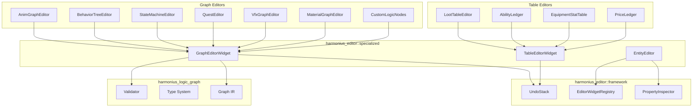

# Specialized Editors Design

## Requirements Trace

> **Canonical sources:** Features, requirements, and user stories are defined in
> [features/tools-editor/](../../features/tools-editor/),
> [requirements/tools-editor/](../../requirements/tools-editor/), and
> [user-stories/tools-editor/](../../user-stories/tools-editor/). The table below traces design
> elements to those definitions.

### Graph-Based Editors

| Feature | Requirement | Description |
|---------|-------------|-------------|
| F-15.4.6 | R-15.4.6 | Animation state machine editor with transition debugging |
| F-15.8.7 | R-15.8.7 | Animation logic graphs — blend trees, IK |
| F-15.13.1 | R-15.13.1 | Behavior tree editor for AI authoring |
| F-15.13.2 | R-15.13.2 | State machine editor for AI states and transitions |
| F-15.14.1 | R-15.14.1 | Quest editor for objectives and progression |
| F-15.5.1 | R-15.5.1 | Visual effect graph editor |
| F-15.3.1 | R-15.3.1 | Material graph editor |
| F-15.8.9 | R-15.8.9 | Custom logic graph node extensions |

### Table-Based Editors

| Feature | Requirement | Description |
|---------|-------------|-------------|
| F-15.15.1 | R-15.15.1 | Loot table editor with simulation preview |
| F-15.15.2 | R-15.15.2 | Ability ledger for combat stats |
| F-15.15.3 | R-15.15.3 | Equipment stat tables with comparison |
| F-15.15.4 | R-15.15.4 | Price ledger with inflation simulation |

### Entity Editor

| Feature | Requirement | Description |
|---------|-------------|-------------|
| F-15.1.4 | R-15.1.4 | Entity selection and hierarchy |
| F-15.1.8 | R-15.1.8 | Plugin-driven component inspectors |
| F-15.2.1 | R-15.2.1 | Prefab overrides display |

### Cross-Cutting Dependencies

| Dependency | Source | Consumed API |
|------------|--------|--------------|
| Logic graph runtime | F-15.8.1 | Graph IR, type system, validation |
| Plugin system | F-1.6.1--F-1.6.7 | EditorWidgetRegistry, EditorPluginApi |
| Widget framework | F-13.1 | All editor panel rendering |
| Reflection | F-1.3.1--F-1.3.10 | Component inspector auto-generation |
| CRDT sync | F-15.12.8 | Collaborative editing of graphs and tables |
| Undo/redo | F-15.1.3 | Command pattern for all edits |

## Overview

Specialized editors fall into three categories: graph-based, table-based, and the entity editor.
Graph-based and table-based editors share framework widgets that handle common concerns (layout,
interaction, undo integration, CRDT sync, plugin registration). Each specialized editor composes the
framework with domain-specific node types, edge rules, or column schemas.

Key principles:

- **Shared frameworks.** `GraphEditorWidget` and `TableEditorWidget` implement layout, zooming,
  selection, copy/paste, and undo integration once. Domain editors only define their data model.
- **Plugin-registered.** All specialized editors register through `EditorPluginApi` so third parties
  can add new graph or table editors.
- **CRDT-aware.** Graph and table edits produce CRDT operations for real-time collaborative editing.
- **No-code.** All editors are visual. Users never write textual code.

## Architecture

### Class Diagram

```mermaid
classDiagram
    class GraphEditorWidget {
        +GraphId graph_id
        +Vec~GraphNodeWidget~ nodes
        +Vec~GraphEdgeWidget~ edges
        +Vec2 pan_offset
        +f32 zoom_level
        +add_node(kind, position) NodeId
        +remove_node(id)
        +connect(src_pin, dst_pin) Result
        +disconnect(edge_id)
        +validate() Vec~ValidationError~
        +select_nodes(ids)
        +copy_selection() ClipboardData
        +paste(position) Vec~NodeId~
        +undo_integration() UndoStack
    }

    class GraphNodeWidget {
        +NodeId id
        +String title
        +Vec2 position
        +Vec~PinWidget~ inputs
        +Vec~PinWidget~ outputs
        +WidgetNode body
    }

    class GraphEdgeWidget {
        +EdgeId id
        +PinId source
        +PinId target
        +EdgeStyle style
    }

    class PinWidget {
        +PinId id
        +PinType pin_type
        +String label
        +bool connected
    }

    class TableEditorWidget {
        +TableId table_id
        +Vec~ColumnDef~ columns
        +Vec~RowData~ rows
        +SortState sort
        +FilterState filter
        +add_row() RowId
        +remove_row(id)
        +set_cell(row, col, value) Result
        +sort_by(column, direction)
        +filter_by(predicate)
        +copy_selection() ClipboardData
        +paste(row_offset)
        +undo_integration() UndoStack
    }

    class ColumnDef {
        +String name
        +ColumnType col_type
        +bool editable
        +bool sortable
        +Option~ColumnValidator~ validator
    }

    class ColumnType {
        <<enum>>
        String
        Integer
        Float
        Bool
        Enum(Vec~String~)
        AssetRef
    }

    class RowData {
        +RowId id
        +Vec~CellValue~ cells
    }

    class EntityEditor {
        +Entity entity
        +Vec~ComponentPanel~ component_panels
        +HierarchyTree hierarchy
        +PrefabOverrideDisplay overrides
        +add_component(type_id) Result
        +remove_component(type_id) Result
        +reparent(new_parent) Result
    }

    class ComponentPanel {
        +TypeId component_type
        +String display_name
        +WidgetNode widget
        +bool is_custom_editor
    }

    class HierarchyTree {
        +Entity root
        +Vec~Entity~ expanded
        +select(entity)
        +expand(entity)
        +collapse(entity)
        +drag_reparent(entity, new_parent)
    }

    class PrefabOverrideDisplay {
        +AssetId prefab
        +Vec~PropertyOverride~ overrides
        +revert_override(path) Result
        +revert_all() Result
        +apply_to_prefab() Result
    }

    class PropertyOverride {
        +PropertyPath path
        +DynamicValue prefab_value
        +DynamicValue instance_value
    }

    class AnimGraphEditor {
        +GraphEditorWidget graph
    }

    class BehaviorTreeEditor {
        +GraphEditorWidget graph
    }

    class StateMachineEditor {
        +GraphEditorWidget graph
    }

    class QuestEditor {
        +GraphEditorWidget graph
    }

    class VfxGraphEditor {
        +GraphEditorWidget graph
    }

    class MaterialGraphEditor {
        +GraphEditorWidget graph
    }

    class LootTableEditor {
        +TableEditorWidget table
        +SimulationPreview preview
    }

    class AbilityLedger {
        +TableEditorWidget table
    }

    class EquipmentStatTable {
        +TableEditorWidget table
        +ComparisonView comparison
    }

    class PriceLedger {
        +TableEditorWidget table
        +InflationSimulation sim
    }

    GraphEditorWidget *-- GraphNodeWidget
    GraphEditorWidget *-- GraphEdgeWidget
    GraphNodeWidget *-- PinWidget
    TableEditorWidget *-- ColumnDef
    TableEditorWidget *-- RowData
    ColumnDef --> ColumnType
    EntityEditor *-- ComponentPanel
    EntityEditor *-- HierarchyTree
    EntityEditor *-- PrefabOverrideDisplay
    PrefabOverrideDisplay *-- PropertyOverride

    AnimGraphEditor --> GraphEditorWidget
    BehaviorTreeEditor --> GraphEditorWidget
    StateMachineEditor --> GraphEditorWidget
    QuestEditor --> GraphEditorWidget
    VfxGraphEditor --> GraphEditorWidget
    MaterialGraphEditor --> GraphEditorWidget

    LootTableEditor --> TableEditorWidget
    AbilityLedger --> TableEditorWidget
    EquipmentStatTable --> TableEditorWidget
    PriceLedger --> TableEditorWidget
```



### Module Boundaries



### File Layout

```text
harmonius_editor/
├── specialized/
│   ├── graph_widget.rs       # GraphEditorWidget —
│   │                         # shared graph framework
│   ├── table_widget.rs       # TableEditorWidget —
│   │                         # shared table framework
│   ├── entity_editor.rs      # EntityEditor — component
│   │                         # list, hierarchy, prefabs
│   ├── graph/
│   │   ├── anim_graph.rs     # AnimGraphEditor — blend,
│   │   │                     # additive, IK, state
│   │   ├── behavior_tree.rs  # BehaviorTreeEditor —
│   │   │                     # sequence, selector, leaf
│   │   ├── state_machine.rs  # StateMachineEditor —
│   │   │                     # states, transitions
│   │   ├── quest.rs          # QuestEditor — objectives,
│   │   │                     # prerequisites
│   │   ├── vfx_graph.rs      # VfxGraphEditor — wraps
│   │   │                     # existing VFX system
│   │   ├── material_graph.rs # MaterialGraphEditor —
│   │   │                     # wraps material system
│   │   └── custom_nodes.rs   # CustomLogicNodes —
│   │                         # extension point
│   └── table/
│       ├── loot_table.rs     # LootTableEditor —
│       │                     # weights, simulation
│       ├── ability.rs        # AbilityLedger —
│       │                     # cooldown, cost, damage
│       ├── equipment.rs      # EquipmentStatTable —
│       │                     # comparison view
│       └── price.rs          # PriceLedger —
│                             # inflation simulation
```

## API Design

### Graph Editor Widget Framework

```rust
/// Shared framework for all graph-based editors.
/// Handles pan, zoom, selection, copy/paste, undo
/// integration, and CRDT operation generation.
pub struct GraphEditorWidget {
    pub graph_id: GraphId,
    nodes: Vec<GraphNodeWidget>,
    edges: Vec<GraphEdgeWidget>,
    pan_offset: Vec2,
    zoom_level: f32,
    selection: Vec<NodeId>,
    clipboard: Option<ClipboardData>,
}

/// Visual representation of a node in the graph
/// editor canvas.
pub struct GraphNodeWidget {
    pub id: NodeId,
    pub title: String,
    pub position: Vec2,
    pub inputs: Vec<PinWidget>,
    pub outputs: Vec<PinWidget>,
    pub body: WidgetNode,
    pub collapsed: bool,
}

/// Visual representation of a pin on a node.
pub struct PinWidget {
    pub id: PinId,
    pub pin_type: PinType,
    pub label: String,
    pub connected: bool,
}

/// Visual representation of an edge between pins.
pub struct GraphEdgeWidget {
    pub id: EdgeId,
    pub source: PinId,
    pub target: PinId,
    pub style: EdgeStyle,
}

/// Edge rendering style.
#[derive(Clone, Copy, Debug, PartialEq, Eq)]
pub enum EdgeStyle {
    /// Bezier curve (default for data flow).
    Bezier,
    /// Straight line (transitions).
    Straight,
    /// Right-angle orthogonal routing.
    Orthogonal,
}

impl GraphEditorWidget {
    pub fn new(graph_id: GraphId) -> Self;

    /// Add a node at the given canvas position.
    pub fn add_node(
        &mut self,
        kind: NodeKind,
        position: Vec2,
    ) -> NodeId;

    /// Remove a node and all its edges.
    pub fn remove_node(&mut self, id: NodeId);

    /// Connect two pins with type checking.
    pub fn connect(
        &mut self,
        src_pin: PinId,
        dst_pin: PinId,
    ) -> Result<EdgeId, PinTypeError>;

    /// Disconnect an edge.
    pub fn disconnect(&mut self, edge_id: EdgeId);

    /// Validate the entire graph.
    pub fn validate(
        &self,
    ) -> Vec<ValidationError>;

    /// Set node selection.
    pub fn select_nodes(&mut self, ids: &[NodeId]);

    /// Copy selected nodes to clipboard.
    pub fn copy_selection(&self) -> ClipboardData;

    /// Paste clipboard contents at position.
    pub fn paste(
        &mut self,
        position: Vec2,
    ) -> Vec<NodeId>;

    /// Set pan offset.
    pub fn set_pan(&mut self, offset: Vec2);

    /// Set zoom level.
    pub fn set_zoom(&mut self, zoom: f32);

    /// Frame all nodes in the viewport.
    pub fn frame_all(&mut self);

    /// Frame selected nodes in the viewport.
    pub fn frame_selection(&mut self);

    /// Generate CRDT operations for the last edit.
    pub fn pending_crdt_ops(
        &self,
    ) -> Vec<CrdtOp>;
}
```

### Table Editor Widget Framework

```rust
/// Shared framework for all table-based editors.
/// Handles sorting, filtering, cell editing, undo,
/// and CRDT operation generation.
pub struct TableEditorWidget {
    pub table_id: TableId,
    columns: Vec<ColumnDef>,
    rows: Vec<RowData>,
    sort: SortState,
    filter: FilterState,
    selection: Vec<RowId>,
}

/// Column definition for a table editor.
pub struct ColumnDef {
    pub name: String,
    pub col_type: ColumnType,
    pub editable: bool,
    pub sortable: bool,
    pub validator: Option<ColumnValidator>,
    pub width: f32,
}

/// Column data type.
#[derive(Clone, Debug, PartialEq, Eq)]
pub enum ColumnType {
    String,
    Integer,
    Float,
    Bool,
    Enum(Vec<String>),
    AssetRef,
}

/// A row of cell values.
pub struct RowData {
    pub id: RowId,
    pub cells: Vec<CellValue>,
}

/// A cell value in a table.
#[derive(Clone, Debug)]
pub enum CellValue {
    String(String),
    Integer(i64),
    Float(f64),
    Bool(bool),
    Enum(String),
    AssetRef(AssetId),
    Empty,
}

/// Current sort state.
pub struct SortState {
    pub column: Option<usize>,
    pub direction: SortDirection,
}

#[derive(Clone, Copy, Debug, PartialEq, Eq)]
pub enum SortDirection {
    Ascending,
    Descending,
}

/// Current filter state.
pub struct FilterState {
    pub text_filter: Option<String>,
    pub column_filters:
        HashMap<usize, ColumnFilter>,
}

/// Per-column filter.
#[derive(Clone, Debug)]
pub enum ColumnFilter {
    TextContains(String),
    Range { min: f64, max: f64 },
    Equals(CellValue),
    BoolValue(bool),
}

/// Validation function for column values.
pub struct ColumnValidator {
    pub validate_fn: fn(
        &CellValue,
    ) -> Result<(), String>,
}

impl TableEditorWidget {
    pub fn new(
        table_id: TableId,
        columns: Vec<ColumnDef>,
    ) -> Self;

    /// Add an empty row.
    pub fn add_row(&mut self) -> RowId;

    /// Remove a row by ID.
    pub fn remove_row(&mut self, id: RowId);

    /// Set a cell value with validation.
    pub fn set_cell(
        &mut self,
        row: RowId,
        col: usize,
        value: CellValue,
    ) -> Result<(), String>;

    /// Get a cell value.
    pub fn get_cell(
        &self,
        row: RowId,
        col: usize,
    ) -> Option<&CellValue>;

    /// Sort by a column.
    pub fn sort_by(
        &mut self,
        column: usize,
        direction: SortDirection,
    );

    /// Apply a filter.
    pub fn filter_by(
        &mut self,
        column: usize,
        filter: ColumnFilter,
    );

    /// Clear all filters.
    pub fn clear_filters(&mut self);

    /// Get the visible (filtered, sorted) rows.
    pub fn visible_rows(&self) -> &[RowData];

    /// Select rows.
    pub fn select_rows(
        &mut self,
        ids: &[RowId],
    );

    /// Copy selected rows.
    pub fn copy_selection(&self) -> ClipboardData;

    /// Paste rows at an offset.
    pub fn paste(
        &mut self,
        row_offset: usize,
    ) -> Vec<RowId>;

    /// Row count (unfiltered).
    pub fn row_count(&self) -> usize;

    /// Generate CRDT operations for the last edit.
    pub fn pending_crdt_ops(
        &self,
    ) -> Vec<CrdtOp>;
}
```

### Graph-Based Editors

**Animation Graph Editor** -- Nodes represent blend, additive, IK, and state machine operations.
Edges carry pose data flow. Wraps the animation logic graph (F-15.8.7) with a specialized node
palette and live preview.

```rust
/// Animation graph editor with domain-specific
/// node types for blend trees and IK chains.
pub struct AnimGraphEditor {
    graph: GraphEditorWidget,
    preview: AnimPreview,
}

/// Animation graph node types.
#[derive(Clone, Debug)]
pub enum AnimGraphNodeKind {
    BlendNode { blend_type: BlendType },
    AdditiveBlend,
    IkSolver { chain_length: u32 },
    StateMachineRef { asset: AssetId },
    ClipPlayer { clip: AssetId },
    Parameter { name: String },
    Output,
}

#[derive(Clone, Copy, Debug, PartialEq, Eq)]
pub enum BlendType {
    Linear,
    Crossfade,
    Layered,
}

impl AnimGraphEditor {
    pub fn new(graph_id: GraphId) -> Self;

    /// Add an animation-specific node.
    pub fn add_anim_node(
        &mut self,
        kind: AnimGraphNodeKind,
        position: Vec2,
    ) -> NodeId;

    /// Set the preview character mesh.
    pub fn set_preview_mesh(
        &mut self,
        mesh: AssetId,
    );

    /// Evaluate the graph at current parameter
    /// values for live preview.
    pub fn evaluate_preview(&self);
}
```

**Behavior Tree Editor** -- Tree-layout graph with sequence, selector, parallel, decorator, and leaf
nodes. Edges represent parent-child ordering. Debugging overlays highlight the active execution
path.

```rust
/// Behavior tree editor with tree-layout graph.
pub struct BehaviorTreeEditor {
    graph: GraphEditorWidget,
    debug_state: BtDebugState,
}

/// Behavior tree node types.
#[derive(Clone, Debug)]
pub enum BtNodeKind {
    Sequence,
    Selector,
    Parallel { policy: ParallelPolicy },
    Decorator { decorator_type: DecoratorType },
    Leaf { action: String },
    SubTree { asset: AssetId },
}

#[derive(Clone, Copy, Debug, PartialEq, Eq)]
pub enum ParallelPolicy {
    RequireAll,
    RequireOne,
}

#[derive(Clone, Debug)]
pub enum DecoratorType {
    Inverter,
    Repeater { count: u32 },
    UntilFail,
    UntilSuccess,
    Cooldown { seconds: f32 },
}

/// Debug state showing active BT execution.
pub struct BtDebugState {
    pub active_node: Option<NodeId>,
    pub node_results: HashMap<NodeId, BtResult>,
}

#[derive(Clone, Copy, Debug, PartialEq, Eq)]
pub enum BtResult {
    Success,
    Failure,
    Running,
}

impl BehaviorTreeEditor {
    pub fn new(graph_id: GraphId) -> Self;

    /// Add a behavior tree node.
    pub fn add_bt_node(
        &mut self,
        kind: BtNodeKind,
        parent: Option<NodeId>,
    ) -> NodeId;

    /// Attach debug overlay from a running agent.
    pub fn attach_debug(
        &mut self,
        entity: Entity,
    );

    /// Detach debug overlay.
    pub fn detach_debug(&mut self);
}
```

**State Machine Editor** -- Nodes represent states; edges represent transitions with conditions.
Active state and transition evaluation are highlighted during debugging.

```rust
/// State machine editor for AI and animation.
pub struct StateMachineGraphEditor {
    graph: GraphEditorWidget,
    debug_state: SmDebugState,
}

/// State machine debug overlay.
pub struct SmDebugState {
    pub active_state: Option<NodeId>,
    pub evaluating_transition: Option<EdgeId>,
}

impl StateMachineGraphEditor {
    pub fn new(graph_id: GraphId) -> Self;

    /// Add a state node.
    pub fn add_state(
        &mut self,
        name: String,
        position: Vec2,
    ) -> NodeId;

    /// Add a transition edge with conditions.
    pub fn add_transition(
        &mut self,
        from: NodeId,
        to: NodeId,
        conditions: Vec<TransitionCondition>,
    ) -> EdgeId;

    /// Set the default entry state.
    pub fn set_default_state(
        &mut self,
        id: NodeId,
    );

    /// Attach debug from a running entity.
    pub fn attach_debug(
        &mut self,
        entity: Entity,
    );
}
```

**Quest Editor** -- Nodes represent objectives and prerequisites; edges represent progression flow.
Supports branching paths, optional objectives, and completion tracking.

```rust
/// Quest editor for objectives and progression.
pub struct QuestEditor {
    graph: GraphEditorWidget,
}

/// Quest graph node types.
#[derive(Clone, Debug)]
pub enum QuestNodeKind {
    Objective {
        description: String,
        optional: bool,
    },
    Prerequisite {
        condition: String,
    },
    Branch {
        description: String,
    },
    QuestStart,
    QuestEnd {
        reward: String,
    },
}

impl QuestEditor {
    pub fn new(graph_id: GraphId) -> Self;

    /// Add a quest node.
    pub fn add_quest_node(
        &mut self,
        kind: QuestNodeKind,
        position: Vec2,
    ) -> NodeId;

    /// Validate quest graph: start reachable,
    /// all objectives reachable from start, at
    /// least one end node reachable.
    pub fn validate_quest(
        &self,
    ) -> Vec<QuestValidationError>;
}
```

**VFX Graph Editor and Material Graph Editor** -- These wrap existing subsystem editors (F-15.5.1,
F-15.3.1) with the shared `GraphEditorWidget` framework for consistent interaction patterns.

```rust
/// VFX graph editor wrapping the existing VFX
/// graph system with the shared graph framework.
pub struct VfxGraphEditor {
    graph: GraphEditorWidget,
}

/// Material graph editor wrapping the existing
/// material graph system.
pub struct MaterialGraphEditorWrapper {
    graph: GraphEditorWidget,
}
```

**Custom Logic Graph Nodes** -- Extension point for adding new node types to the logic graph via the
plugin system.

```rust
/// Registration for a custom logic graph node
/// type added by a plugin.
pub struct CustomNodeDescriptor {
    pub node_kind: String,
    pub display_name: String,
    pub category: String,
    pub inputs: Vec<PinDescriptor>,
    pub outputs: Vec<PinDescriptor>,
    pub body_widget: Option<
        fn(&dyn Reflect) -> WidgetNode,
    >,
}

/// Pin descriptor for custom nodes.
pub struct PinDescriptor {
    pub name: String,
    pub pin_type: PinType,
    pub default_value: Option<PinDefault>,
}
```

### Table-Based Editors

**Loot Table Editor** -- Columns for item, weight, min/max quantity, and conditions. Includes a
simulation preview that runs N draws and displays drop distribution.

```rust
/// Loot table editor with simulation preview.
pub struct LootTableEditor {
    table: TableEditorWidget,
    preview: SimulationPreview,
}

/// Simulation preview for loot tables.
pub struct SimulationPreview {
    pub draw_count: u32,
    pub results: Vec<SimulationResult>,
}

pub struct SimulationResult {
    pub item_name: String,
    pub drop_count: u32,
    pub drop_rate: f64,
    pub avg_quantity: f64,
}

impl LootTableEditor {
    pub fn new(table_id: TableId) -> Self;

    /// Run a simulation with the given number
    /// of draws.
    pub fn run_simulation(
        &mut self,
        draw_count: u32,
    );
}
```

**Ability Ledger** -- Columns for ability name, cooldown, cost, damage, range, and tags. Supports
tag-based filtering and stat comparison.

```rust
/// Ability ledger for combat stat authoring.
pub struct AbilityLedger {
    table: TableEditorWidget,
}

impl AbilityLedger {
    pub fn new(table_id: TableId) -> Self;

    /// Filter abilities by tag.
    pub fn filter_by_tag(
        &mut self,
        tag: &str,
    );

    /// Compare two abilities side by side.
    pub fn compare(
        &self,
        a: RowId,
        b: RowId,
    ) -> Vec<StatDelta>;
}

pub struct StatDelta {
    pub stat_name: String,
    pub value_a: f64,
    pub value_b: f64,
    pub difference: f64,
}
```

**Equipment Stat Tables** -- Columns for slot, item, stats, and set bonus. Includes a comparison
view that overlays two equipment sets.

```rust
/// Equipment stat table with comparison view.
pub struct EquipmentStatTable {
    table: TableEditorWidget,
    comparison: ComparisonView,
}

/// Side-by-side equipment comparison.
pub struct ComparisonView {
    pub set_a: Vec<RowId>,
    pub set_b: Vec<RowId>,
    pub stat_deltas: Vec<StatDelta>,
}

impl EquipmentStatTable {
    pub fn new(table_id: TableId) -> Self;

    /// Set the two equipment sets for comparison.
    pub fn set_comparison(
        &mut self,
        set_a: &[RowId],
        set_b: &[RowId],
    );

    /// Compute stat totals for a set.
    pub fn compute_totals(
        &self,
        set: &[RowId],
    ) -> HashMap<String, f64>;
}
```

**Price Ledger** -- Columns for item, currency, buy price, sell price. Includes an inflation
simulation that models price changes over time.

```rust
/// Price ledger with inflation simulation.
pub struct PriceLedger {
    table: TableEditorWidget,
    simulation: InflationSimulation,
}

/// Inflation simulation parameters and results.
pub struct InflationSimulation {
    pub inflation_rate: f64,
    pub time_periods: u32,
    pub results:
        Vec<InflationSimulationResult>,
}

pub struct InflationSimulationResult {
    pub item_name: String,
    pub original_buy: f64,
    pub original_sell: f64,
    pub projected_buy: f64,
    pub projected_sell: f64,
}

impl PriceLedger {
    pub fn new(table_id: TableId) -> Self;

    /// Run inflation simulation with given
    /// parameters.
    pub fn run_inflation_sim(
        &mut self,
        rate: f64,
        periods: u32,
    );
}
```

### Entity Editor

```rust
/// The entity editor provides component
/// inspection, hierarchy management, and prefab
/// override display.
pub struct EntityEditor {
    entity: Entity,
    component_panels: Vec<ComponentPanel>,
    hierarchy: HierarchyTree,
    overrides: Option<PrefabOverrideDisplay>,
}

/// A panel for a single component on the entity.
pub struct ComponentPanel {
    pub component_type: TypeId,
    pub display_name: String,
    pub widget: WidgetNode,
    pub is_custom_editor: bool,
}

/// Hierarchy tree view for entity parent/child
/// relationships.
pub struct HierarchyTree {
    pub root: Entity,
    expanded: Vec<Entity>,
}

/// Display of prefab property overrides on an
/// entity instance.
pub struct PrefabOverrideDisplay {
    pub prefab: AssetId,
    pub overrides: Vec<PropertyOverride>,
}

/// A single property override on a prefab
/// instance.
pub struct PropertyOverride {
    pub path: PropertyPath,
    pub prefab_value: DynamicValue,
    pub instance_value: DynamicValue,
}

impl EntityEditor {
    pub fn new(entity: Entity) -> Self;

    /// Add a component to the entity.
    pub fn add_component(
        &mut self,
        type_id: TypeId,
        world: &mut World,
        undo: &mut UndoStack,
    ) -> Result<(), CommandError>;

    /// Remove a component from the entity.
    pub fn remove_component(
        &mut self,
        type_id: TypeId,
        world: &mut World,
        undo: &mut UndoStack,
    ) -> Result<(), CommandError>;

    /// Reparent the entity in the hierarchy.
    pub fn reparent(
        &mut self,
        new_parent: Option<Entity>,
        world: &mut World,
        undo: &mut UndoStack,
    ) -> Result<(), CommandError>;

    /// Rebuild component panels from current
    /// entity state. Dispatches to custom editors
    /// via EditorWidgetRegistry.
    pub fn rebuild_panels(
        &mut self,
        world: &World,
        widget_registry: &EditorWidgetRegistry,
        type_registry: &TypeRegistry,
    );
}

impl HierarchyTree {
    pub fn new(root: Entity) -> Self;

    /// Select an entity in the tree.
    pub fn select(&mut self, entity: Entity);

    /// Expand a tree node.
    pub fn expand(&mut self, entity: Entity);

    /// Collapse a tree node.
    pub fn collapse(&mut self, entity: Entity);

    /// Drag an entity to reparent it.
    pub fn drag_reparent(
        &mut self,
        entity: Entity,
        new_parent: Entity,
    );

    /// Search the hierarchy by name.
    pub fn search(
        &self,
        query: &str,
        world: &World,
    ) -> Vec<Entity>;
}

impl PrefabOverrideDisplay {
    /// Revert a single property override.
    pub fn revert_override(
        &mut self,
        path: &PropertyPath,
        world: &mut World,
        undo: &mut UndoStack,
    ) -> Result<(), CommandError>;

    /// Revert all overrides on this instance.
    pub fn revert_all(
        &mut self,
        world: &mut World,
        undo: &mut UndoStack,
    ) -> Result<(), CommandError>;

    /// Apply instance overrides back to the
    /// source prefab asset.
    pub fn apply_to_prefab(
        &mut self,
        world: &mut World,
    ) -> Result<(), AssetError>;
}
```

### Error Types

```rust
pub enum QuestValidationError {
    NoStartNode,
    NoEndNode,
    UnreachableObjective { node: NodeId },
    NoPathToEnd { node: NodeId },
    CyclicDependency { cycle: Vec<NodeId> },
}
```

## Data Flow

### Graph Edit Flow

1. User adds, removes, or connects nodes in a graph editor.
2. The `GraphEditorWidget` validates the edit via the logic graph type system.
3. A corresponding `EditorCommand` is created and pushed to the `UndoStack`.
4. If collaboration is active, CRDT operations are generated via `pending_crdt_ops()` and pushed to
   the `CrdtClient`.
5. Remote users receive the CRDT ops and their graph editors update.

### Table Edit Flow

1. User edits a cell value in a table editor.
2. The `TableEditorWidget` validates via the column's `ColumnValidator`.
3. A `SetCellCommand` is pushed to the `UndoStack`.
4. CRDT `MapOp::Set` operations are generated for collaborative sync.

### Entity Inspector Dispatch

1. Entity is selected in the viewport or hierarchy tree.
2. `EntityEditor::rebuild_panels()` enumerates components via reflection.
3. For each component, `EditorWidgetRegistry::lookup(type_id)` checks for a custom editor widget
   registered by a plugin or engine subsystem.
4. Custom editors render their specialized UI; other components use auto-generated reflection-based
   widgets.
5. All edits produce `EditorCommand` instances through the undo stack.

### Plugin Registration Flow

All specialized editors register through `EditorPluginApi` at startup:

1. Engine subsystems call `api.register_editor_widget()` for animation, material, physics, and other
   component types.
2. Third-party plugins do the same for their custom component types.
3. The entity editor dispatches to whichever widget is registered for each type.
4. Graph and table editors register as panel types via `api.register_panel()`.

## Platform Considerations

All specialized editors use the engine's widget framework (F-13.1) and render identically on all
platforms. Platform-specific considerations:

| Component | Windows | macOS | Linux |
|-----------|---------|-------|-------|
| Graph canvas | GPU-accelerated via render graph | Same | Same |
| Table rendering | Virtual scrolling for 10k+ rows | Same | Same |
| Clipboard | Platform clipboard for copy/paste | Same | Same |
| Asset references | Platform file dialog for asset pick | Same | Same |

## Test Plan

Test cases are in the companion file
[specialized-editors-test-cases.md](specialized-editors-test-cases.md).

### Summary

| Category | Count | Coverage |
|----------|-------|----------|
| Unit tests | 38 | Graph widget, table widget, entity editor, all specialized editors |
| Integration tests | 10 | End-to-end editing, CRDT sync, plugin dispatch |
| Benchmarks | 6 | Graph with 500 nodes, table with 10k rows, inspector rebuild |

## Open Questions

1. **Graph layout algorithms.** Should the behavior tree editor use a fixed tree layout algorithm
   (Reingold-Tilford) or allow free-form positioning? Fixed layout is cleaner but prevents custom
   arrangement.

2. **Table editor pagination.** For tables with 100k+ rows, should the table editor use virtual
   scrolling only, or support explicit page navigation?

3. **Simulation accuracy.** The loot table simulation uses a pseudo-random number generator. Should
   it use the same RNG as the game runtime for accurate results, or a fast non-deterministic RNG for
   speed?

4. **Cross-editor references.** A quest node may reference a loot table. Should cross-editor
   references be clickable links that open the referenced editor?

5. **Prefab override diff display.** Should prefab overrides show a visual diff (red/green
   highlighting) or a side-by-side comparison panel?
