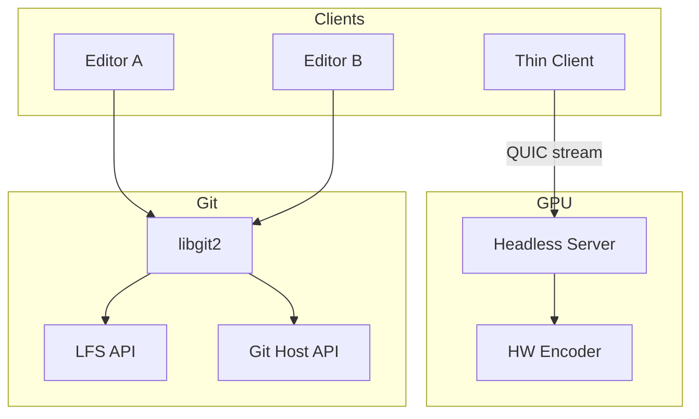
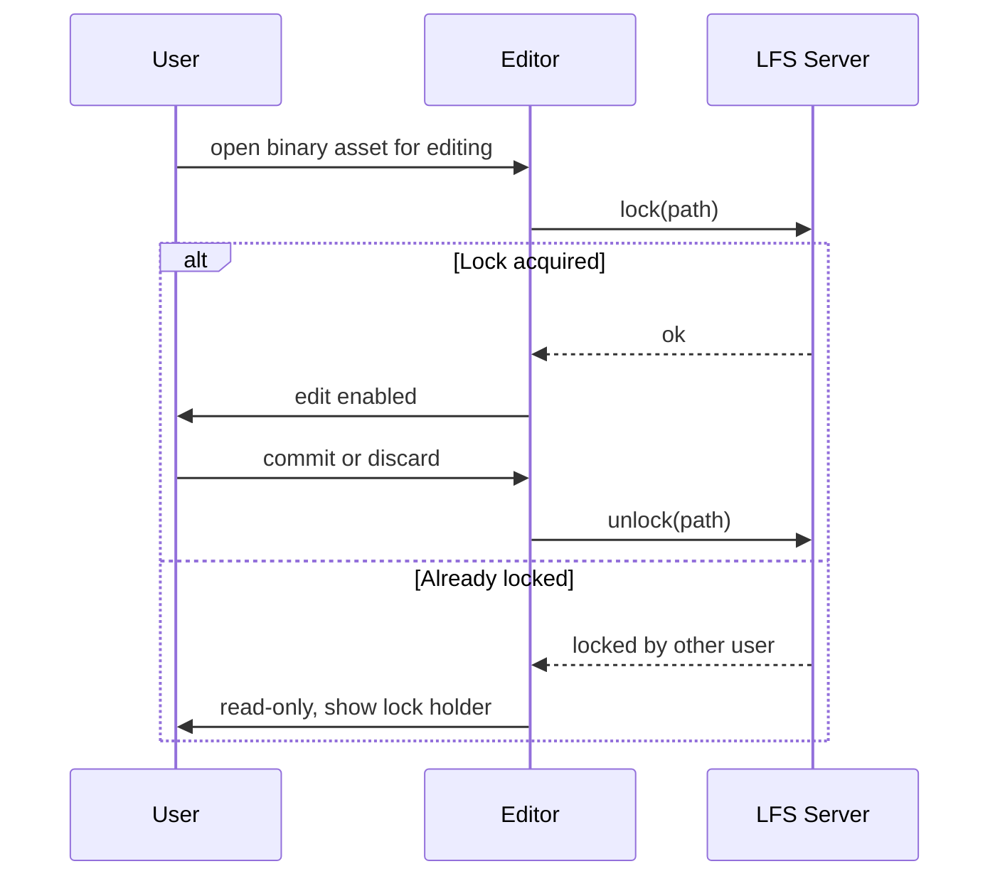
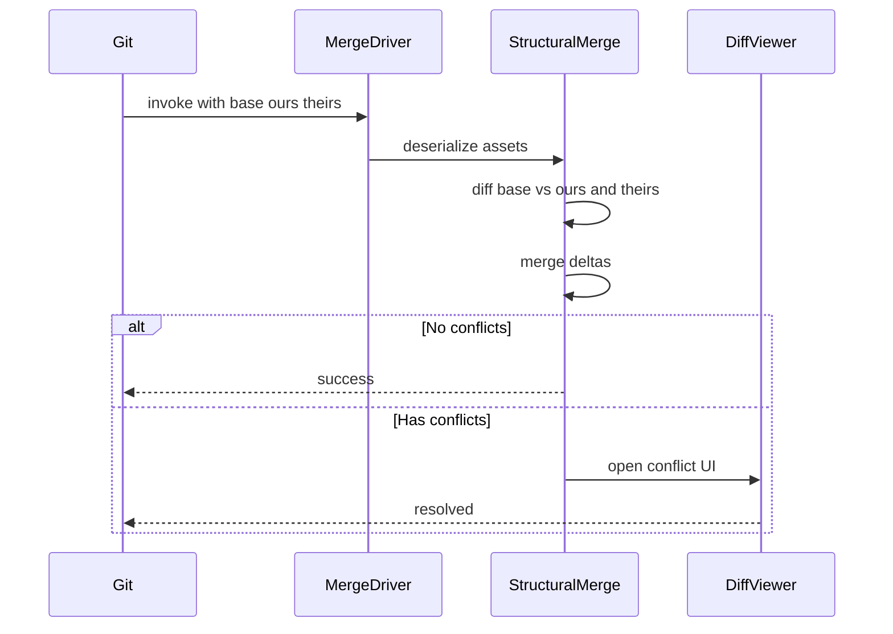
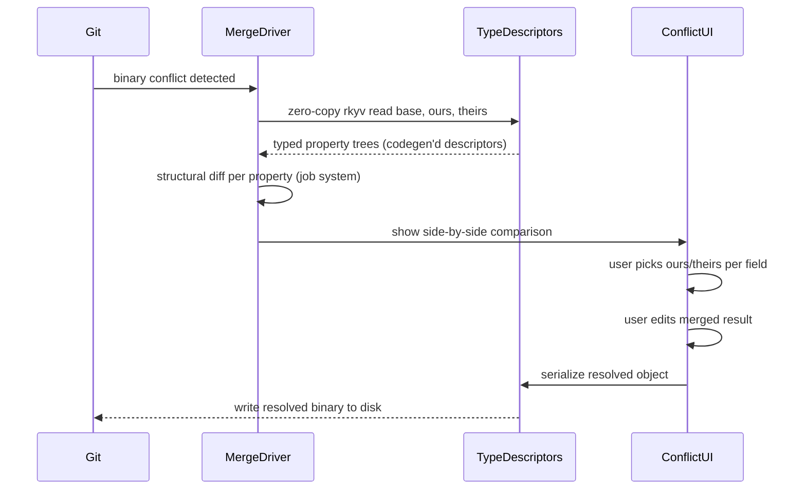
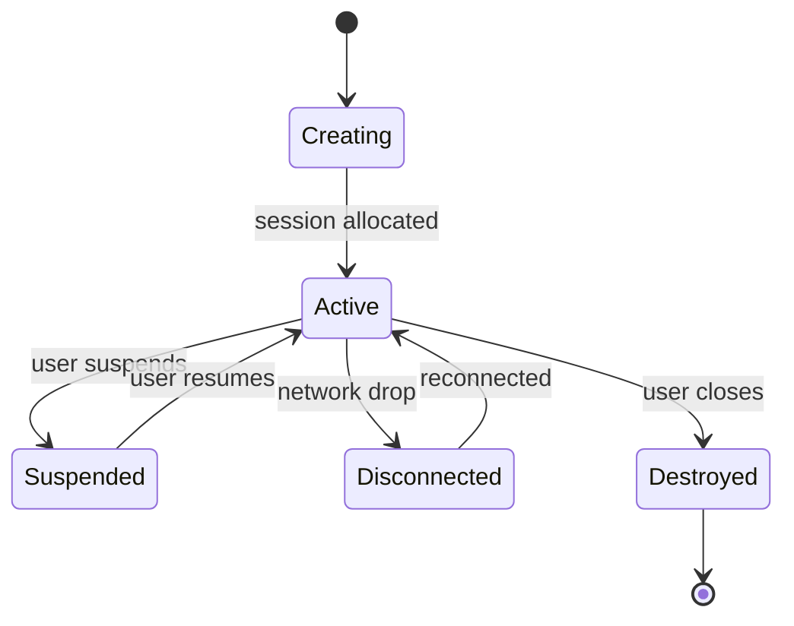
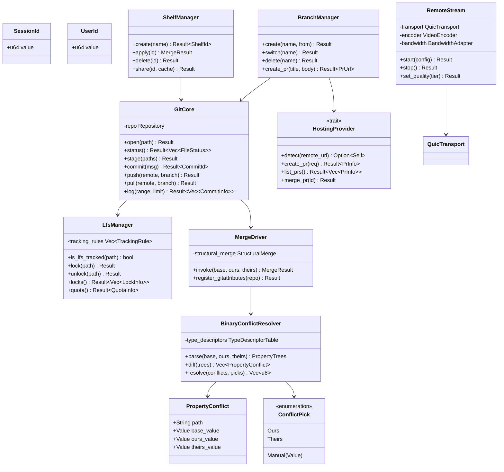

# Team Tools Design

## Requirements Trace

### Remote Editing (F-15.12)

| Feature    | Requirement |
|------------|-------------|
| F-15.12.1  | R-15.12.1   |
| F-15.12.2  | R-15.12.2   |
| F-15.12.4  | R-15.12.4   |
| F-15.12.5  | R-15.12.5   |
| F-15.12.6  | R-15.12.6   |
| F-15.12.12 | R-15.12.12  |
| F-15.12.13 | R-15.12.13  |
| F-15.12.14 | R-15.12.14  |

1. **F-15.12.1** -- Remote desktop rendering with H.264/H.265
2. **F-15.12.2** -- Custom remote editor protocol over QUIC
3. **F-15.12.4** -- Remote GPU server with multi-session
4. **F-15.12.5** -- Session handoff and persistence
5. **F-15.12.6** -- Bandwidth adaptation and quality tiers
6. **F-15.12.12** -- AI agent collaboration
7. **F-15.12.13** -- Asset and scene comments
8. **F-15.12.14** -- Pull request review in editor

### Version Control (F-15.10)

| Feature   | Requirement |
|-----------|-------------|
| F-15.10.1 | R-15.10.1   |
| F-15.10.2 | R-15.10.2   |
| F-15.10.3 | R-15.10.3   |
| F-15.10.4 | R-15.10.4   |
| F-15.10.5 | R-15.10.5   |
| F-15.10.6 | R-15.10.6   |
| F-15.10.7 | R-15.10.7   |
| F-15.10.8 | R-15.10.8   |

1. **F-15.10.1** -- Native Git integration via libgit2
2. **F-15.10.2** -- Git LFS management with auto-tracking
3. **F-15.10.3** -- Asset-aware three-way structural merge
4. **F-15.10.4** -- Branch-per-feature workflow
5. **F-15.10.5** -- LFS lock-based concurrency control
6. **F-15.10.6** -- Partial clone and sparse checkout
7. **F-15.10.7** -- Named shelves for work-in-progress
8. **F-15.10.8** -- Multi-provider Git hosting support

## Overview

Team tools enable multiple users to work on the same project. The design has two major subsystems:

1. **Remote editing** -- remote rendering via QUIC, session management, AI agent collaboration,
   asset comments, and pull request review in editor.
2. **Version control** -- embedded Git client via libgit2, Git LFS with lock-before-edit
   concurrency, structural merge, binary conflict resolution, branch workflow, partial clone,
   shelves, and multi-provider hosting.

LFS locks are the sole concurrency mechanism for binary assets. Users lock a file before editing and
unlock on commit or discard. The structural merge driver handles text-based asset formats (scenes,
prefabs) via three-way merge. For binary assets that conflict, a dedicated binary conflict
resolution UI reads base/ours/theirs zero-copy via rkyv with codegen'd type descriptors, shows a
structural diff, and lets the user resolve per-property.

CPU-bound operations (structural merge, binary diff, property tree construction) run on worker
threads via the custom job system (`scope()`, `par_iter` from crossbeam-deque). Network I/O (Git
push/pull, LFS lock/unlock, QUIC stream management) is submitted to the main thread's
platform-native I/O (IOCP/GCD/io_uring) via crossbeam-channel.

## Architecture

### System Architecture



### LFS Lock Workflow



### Three-Way Structural Merge



### Binary Conflict Resolution



### Session Lifecycle



### Core Data Structures



## API Design

### Git Core

```rust
#[derive(Clone, Copy, Debug, PartialEq, Eq, Hash)]
pub struct CommitId(pub [u8; 20]);

#[derive(Clone, Debug)]
pub struct FileStatus {
    pub path: PathBuf,
    pub index_status: StatusKind,
    pub worktree_status: StatusKind,
    pub is_lfs: bool,
}

pub struct GitCore { /* ... */ }

impl GitCore {
    /// Open a repository. Submits I/O to main thread via channel;
    /// returns when the operation completes on the next frame boundary.
    pub fn open(path: &Path) -> Result<Self, VcError>;
    pub fn status(&self) -> Result<Vec<FileStatus>, VcError>;
    pub fn stage(
        &self,
        paths: &[&Path],
    ) -> Result<(), VcError>;
    pub fn commit(
        &self,
        message: &str,
    ) -> Result<CommitId, VcError>;
    pub fn push(
        &self,
        remote: &str,
        branch: &str,
    ) -> Result<(), VcError>;
    pub fn pull(
        &self,
        remote: &str,
        branch: &str,
    ) -> Result<(), VcError>;
}
```

### LFS and Locking

```rust
pub struct LfsManager { /* ... */ }

impl LfsManager {
    pub fn is_lfs_tracked(
        &self,
        path: &Path,
    ) -> bool;

    /// Lock a file before editing. Submits LFS lock request to main
    /// thread I/O; returns error if already locked by another user.
    pub fn lock(
        &self,
        path: &Path,
    ) -> Result<(), VcError>;

    /// Unlock a file on commit or discard.
    pub fn unlock(
        &self,
        path: &Path,
    ) -> Result<(), VcError>;

    /// List all current locks with holder info.
    pub fn locks(&self) -> Result<Vec<LockInfo>, VcError>;

    pub fn quota(&self) -> Result<QuotaInfo, VcError>;
}

#[derive(Clone, Debug)]
pub struct LockInfo {
    pub path: PathBuf,
    pub owner: String,
    pub locked_at: u64,
}
```

### Merge and Binary Conflict Resolution

```rust
pub struct MergeDriver { /* ... */ }

impl MergeDriver {
    pub fn invoke(
        &self,
        base: &[u8],
        ours: &[u8],
        theirs: &[u8],
    ) -> MergeResult;

    pub fn register_gitattributes(
        &self,
        repo: &Repository,
    ) -> Result<(), VcError>;
}

pub struct BinaryConflictResolver { /* ... */ }

impl BinaryConflictResolver {
    /// Zero-copy rkyv read of base, ours, and theirs via codegen'd
    /// type descriptors from the middleman .dylib. No reflection.
    pub fn parse(
        &self,
        base: &[u8],
        ours: &[u8],
        theirs: &[u8],
    ) -> Result<PropertyTrees, MergeError>;

    /// Compute per-property structural diff across the three versions.
    /// CPU-bound; dispatched to worker threads via job system scope().
    pub fn diff(
        &self,
        trees: &PropertyTrees,
    ) -> Vec<PropertyConflict>;

    /// Apply user conflict picks and serialize the
    /// resolved object back to binary.
    pub fn resolve(
        &self,
        trees: &PropertyTrees,
        picks: &[ConflictPick],
    ) -> Result<Vec<u8>, MergeError>;
}

pub struct PropertyConflict {
    pub path: String,
    pub base_value: Value,
    pub ours_value: Value,
    pub theirs_value: Value,
}

pub enum ConflictPick {
    Ours,
    Theirs,
    Manual(Value),
}
```

### Remote Rendering

```rust
pub struct RemoteStream { /* ... */ }

impl RemoteStream {
    /// Submit QUIC stream start to main thread I/O; returns handle.
    pub fn start(
        &mut self,
        config: RemoteConfig,
    ) -> Result<(), RemoteError>;
    pub fn stop(&mut self) -> Result<(), RemoteError>;
    pub fn set_quality(
        &mut self,
        tier: QualityTier,
    ) -> Result<(), RemoteError>;
}
```

## Data Flow

### Version Control Workflow

1. User opens a binary asset for editing.
2. Editor calls `LfsManager::lock()` to acquire an LFS lock.
3. If locked by another user, asset opens read-only.
4. User edits, then stages via `GitCore::stage()`.
5. `LfsManager` auto-tracks large files by extension/size.
6. `GitCore::commit()` creates a commit via libgit2.
7. `LfsManager::unlock()` releases the lock on commit.
8. `GitCore::push()` uploads with platform credentials.
9. `BranchManager::create_pr()` opens PR on hosting provider.

### Binary Conflict Resolution

1. Git merge detects a binary conflict.
2. `MergeDriver` delegates to `BinaryConflictResolver`.
3. Resolver zero-copy reads base/ours/theirs via rkyv with codegen'd type descriptors.
4. Structural diff computes per-property changes (dispatched to job system workers).
5. Editor opens side-by-side conflict UI.
6. User picks ours or theirs per conflicting property, or manually edits the merged result.
7. Resolver serializes the resolved object back to binary.
8. Merge completes with the resolved file on disk.

### LFS Lock Concurrency

1. Editor broadcasts `lock(path)` to LFS server on edit.
2. Other editors querying the same path see lock holder.
3. Lock holder commits or discards to release the lock.
4. Waiting editors are notified when lock is released.

### Game Loop Phase and Frame-Boundary Handoff

Team-tools subsystems integrate with the editor game loop as follows:

1. **Pre-frame phase** -- VC polling, LFS lock refresh, and remote session management run before
   simulation each frame. Lock status (`Res<LfsLocks>`) updated once per frame.
2. **Git/LFS I/O handoff** -- main thread submits Git/LFS I/O requests via crossbeam-channel.
   Completions arrive as jobs and are processed at the next frame boundary. No blocking.
3. **Structural merge** -- dispatched to a worker thread via `scope()`. Result handed off via
   channel at the next frame boundary. Editor loop is paused (modal) during merge resolution.
4. **Remote rendering** -- encoded frames received on the main thread's QUIC completion path,
   dispatched to the render thread for display. Frame-boundary handoff keeps latency predictable.
5. **Modal operations** -- structural merge and binary conflict resolution pause the editor loop
   until the user completes resolution.

## Cross-Subsystem Integration

Team tools interact with the following subsystems:

| Subsystem | Direction | Data | Mechanism |
|-----------|-----------|------|-----------|
| Asset pipeline | bidirectional | LFS tracking by type | TrackingRule config |
| Editor core | produces | lock status, read-only flags | ECS resources |
| Level/world | bidirectional | scene merge (level-world.md RF-39) | MergeDriver |
| Level/world | bidirectional | LFS locking (level-world.md RF-40) | LfsManager |
| Content browser | produces | VCS status badges, lock icons | ECS query |
| UI framework | produces | conflict resolution UI, diff viewer | Widget API |
| Save system | consumes | scene file format for merge | rkyv archives |
| Profiler | produces | remote session bandwidth | NetBandwidthTracker |
| Build/deploy | bidirectional | build artifact versioning | Git tags |

## Platform Considerations

Team tools are editor-only. They apply to desktop platforms only: Windows, macOS, and Linux. Not
applicable to iOS, Android, or consoles.

| Platform | I/O | QUIC | Git | Credentials | Video encode |
|----------|-----|------|-----|-------------|--------------|
| Windows | IOCP (`windows-rs`) | MsQuic via `windows-rs` | libgit2 | Cred Manager | NVENC / AMF |
| macOS | GCD `dispatch_io` (`dispatch2`) | `Networking.framework` via `objc2` | libgit2 | Keychain | VideoToolbox |
| Linux | `io_uring` via `rustix` | `quinn-proto` | libgit2 | libsecret | VAAPI |

## Test Plan

Test cases are in [team-tools-test-cases.md](team-tools-test-cases.md).

| Category | Count |
|----------|-------|
| Unit tests | 26 |
| Integration tests | 10 |
| Benchmarks | 4 |

1. **Unit** -- Git status parsing, LFS tracking, LFS lock/unlock, lock query, structural merge,
   binary conflict parse/diff/resolve (ours, theirs, manual, mixed, nested, unknown type fallback),
   branch ops, shelf create/apply, hosting provider detect
2. **Integration** -- Remote rendering round-trip, Git commit-push-pull cycle, merge conflict
   resolution, binary conflict resolution end-to-end, side-by-side conflict UI per-property
   resolution, partial clone workflow, LFS lock contention, lock-edit-commit-unlock cycle
3. **Benchmarks** -- structural merge, binary conflict resolution, remote frame latency, Git status,
   LFS lock acquire, property diff (see targets below)

| Benchmark | Target |
|-----------|--------|
| Structural merge (10K entity scene) | < 500 ms |
| Binary conflict resolution (100 MB asset) | < 2 s |
| Remote frame latency (1080p stream) | < 16 ms |
| Git status (10K files) | < 200 ms |
| LFS lock acquire | < 100 ms |
| Property diff (1000 properties) | < 50 ms |

## Open Questions

1. **Structural merge coverage.** Which binary asset types support structural merge at launch vs.
   falling back to manual resolution?
2. **Remote rendering codec selection.** Should we support AV1 in addition to H.264/H.265 for better
   compression at low bitrates?
3. **Binary conflict resolution limits.** What is the maximum asset size that can be parsed into
   memory for per-property conflict resolution?

## Review feedback

### RF-1: Remove ReflectionRegistry — use codegen'd type descriptors

Replace `ReflectionRegistry` in `BinaryConflictResolver` with codegen'd type descriptors from the
middleman .dylib. `PropertyTrees` are built by walking rkyv archives with static type metadata.
Rename the `ReflectionSystem` diagram participant to `TypeDescriptors`.

### RF-2: Remove all async/await and Tokio

Remove `async fn` from every API method. Remove `&tokio::runtime::Handle` from `GitCore::open`.
Replace with synchronous request/handle pattern: submit I/O via crossbeam-channel to main thread,
platform-native I/O (IOCP/GCD/io_uring). Background Git/LFS work submitted to the custom job system.
Remove "Tokio" from the platform table.

### RF-3: Custom job system for background work

CPU-bound operations (structural merge, binary diff, property tree construction) run on worker
threads via the custom job system (`scope()`, `par_iter` from crossbeam-deque). Network I/O goes
through the main thread's platform-native I/O.

### RF-4: rkyv for binary assets

Binary assets are rkyv-serialized. `BinaryConflictResolver` uses rkyv zero-copy access to read
base/ours/theirs without full deserialization. `PropertyTrees` are built by walking the rkyv archive
with codegen'd type descriptors.

### RF-5: Benchmark numeric targets

| Benchmark | Target |
|-----------|--------|
| Structural merge (10K entity scene) | < 500 ms |
| Binary conflict resolution (100 MB asset) | < 2 s |
| Remote frame latency (1080p stream) | < 16 ms |
| Git status (10K files) | < 200 ms |
| LFS lock acquire | < 100 ms |
| Property diff (1000 properties) | < 50 ms |

### RF-6: Game loop phase

VC polling, LFS lock refresh, and remote session management run during the editor's pre-frame phase
(before simulation). Lock status updated once per frame. Structural merge and conflict resolution
are modal operations that pause the editor loop.

### RF-7: Cross-subsystem integration table

| Subsystem | Direction | Data | Mechanism |
|-----------|-----------|------|-----------|
| Asset pipeline | bidirectional | LFS tracking by type | TrackingRule config |
| Editor core | produces | lock status, read-only flags | ECS resources |
| Level/world | bidirectional | scene merge (RF-39) | MergeDriver |
| Level/world | bidirectional | LFS locking (RF-40) | LfsManager |
| Content browser | produces | VCS status badges, lock icons | ECS query |
| UI framework | produces | conflict resolution UI, diff viewer | Widget API |
| Save system | consumes | scene file format for merge | rkyv archives |
| Profiler | produces | remote session bandwidth | NetBandwidthTracker |
| Build/deploy | bidirectional | build artifact versioning | Git tags |

### RF-8: Justify dyn HostingProvider

`HostingProvider` uses `dyn` because hosting providers are loaded at editor startup (cold path) and
the set varies per project (GitHub/GitLab/Bitbucket/self-hosted). Acceptable per constraints for
editor-only cold paths. Document this justification.

### RF-9: ECS resources for VC state

Define ECS resources: `Res<VcStatus>` (current branch, dirty files, behind/ahead count),
`Res<LfsLocks>` (active locks with owner), and `Res<RemoteSession>` (connection state). Editor
systems query these for lock badges, read-only mode, and status indicators.

### RF-10: Codegen/middleman for type descriptors

Binary conflict resolution needs type descriptors to deserialize property trees. These are generated
by the codegen pipeline in the middleman .dylib — not from runtime reflection.

### RF-11: Platform considerations

Team tools are editor-only (desktop: Windows, macOS, Linux). State explicitly that they are not
applicable to iOS, Android, or consoles. Replace per-platform I/O column:

| Platform | I/O | QUIC |
|----------|-----|------|
| Windows | IOCP | MsQuic via windows-rs |
| macOS | GCD dispatch_io | Networking.framework via objc2 |
| Linux | io_uring via rustix | quinn-proto |

### RF-12: Per-platform QUIC

Replace uniform `quinn` with: Linux = quinn-proto, macOS = Networking.framework via objc2, Windows =
MsQuic via windows-rs.

### RF-13: Cross-reference level-world.md RF-39

Scene merging follows the entity/component-level resolution described in level-world.md RF-39.
`MergeDriver` and `StructuralMerge` must handle: entity-level, component-level, per-field
resolution, structural conflicts (delete-modify), prefab merge, and merge preview.

### RF-14: Cross-reference level-world.md RF-40

`LfsManager` must implement all RF-40 behaviors: lock scope variants (per-scene, per-cell, per-file,
per-row), offline mode with reconnect, force unlock for admins, lock request notifications,
auto-unlock on save, and lock badges in the content browser.

### RF-15: Algorithm reference URLs

Add URLs for: three-way merge (diff3 algorithm), structural diff for typed property trees, video
encoding (H.264/H.265 codec specifications).

### RF-16: Frame-boundary handoff

(1) Main thread submits Git/LFS I/O, completions arrive as jobs on the next frame. (2) Structural
merge runs on a worker thread, result handed off via channel at next frame boundary. (3) Remote
rendering frames received on main thread, dispatched to render thread.

### RF-17: Full Git workflow in the editor

The editor provides a complete Git UI so users never need an external Git client:

#### Staging and commits

1. **Changes panel** — lists all modified, added, and deleted files. Each file shows its status
   (modified, new, deleted, renamed, conflict). Files grouped by: staged, unstaged, untracked.
2. **Stage/unstage** — click to stage individual files, or "Stage All." Stage individual hunks by
   expanding the diff view and clicking per-hunk stage buttons. Drag files between staged and
   unstaged.
3. **Commit** — commit message editor with: subject line (50 char limit warning), body, co-author
   support. "Commit" button creates the commit. "Commit and Push" button commits then pushes.
4. **Amend** — "Amend Last Commit" checkbox to modify the previous commit (message and/or staged
   changes). Warning if the commit has already been pushed.

#### Diffing

5. **Inline diff** — click any changed file to see a side-by-side or inline diff. Text files show
   standard line diff. Binary assets show structural diff (per-property changes via rkyv + codegen'd
   type descriptors per RF-1, RF-4).
6. **Scene diff** — scene files show entity-level diff with viewport overlay (level-world.md RF-34):
   added entities green, modified yellow, deleted red.
7. **Diff against** — diff working directory vs HEAD, vs any commit, vs any branch, vs stash.
   Dropdown selector for diff base.

#### Branching

8. **Branch panel** — list all local and remote branches. Current branch highlighted. Create branch,
   rename branch, delete branch (with safety check: is it merged?).
9. **Switch branch** — checkout a different branch. If there are unsaved changes, prompt: stash,
   commit, or discard. LFS files are pulled automatically on branch switch.
10. **Branch visualization** — commit graph showing branch topology (like `git log --graph`).
    Rendered as a Mermaid-style graph in the editor panel. Color-coded by branch. Click any commit
    to see its diff.

#### Merging

11. **Merge** — merge a branch into the current branch. If fast-forward possible, do it silently. If
    not, create a merge commit.
12. **Merge conflicts** — on conflict, the editor enters merge resolution mode:
    - Text files: three-way diff (base/ours/theirs) with per-hunk accept buttons
    - Binary files: structural per-property resolution (RF-1, RF-4, level-world.md RF-39)
    - Scene files: entity-level resolution with viewport preview
    The user resolves all conflicts, then clicks "Complete Merge."
13. **Squash merge** — option to squash all commits from a branch into a single commit on merge.
    Useful for feature branches with many WIP commits.

#### Rebasing

14. **Rebase** — rebase current branch onto another branch. Interactive rebase UI: list of commits
    with drag to reorder, dropdown to pick (pick, squash, fixup, drop, edit) per commit. "Apply
    Rebase" executes. Conflict resolution same as merge.
15. **Rebase safety** — warn if rebasing published commits (pushed to remote). Require explicit
    confirmation for force-push after rebase.

#### Stashing

16. **Stash** — save current changes to a named stash. "Stash All" or "Stash Staged Only." Stash
    list panel shows all stashes with name, date, and file count.
17. **Stash apply/pop** — apply a stash (keep it) or pop (apply and delete). Conflict resolution if
    stash conflicts with current state.
18. **Stash diff** — click a stash to see its diff against the current state.

#### History

19. **History panel** — scrollable commit log with: hash, author, date, message, branch/tag labels.
    Search commits by message, author, or file path. Filter by branch, date range, or file.
20. **Commit detail** — click a commit to see: full message, changed files, diff per file, parent
    commit(s).
21. **Blame** — per-file blame view showing which commit last modified each line/property. Click a
    blame annotation to see the full commit.
22. **File history** — show all commits that modified a specific file. Visual diff between any two
    versions of the file.

#### Git LFS

23. **Automatic LFS tracking** — the editor auto-configures `.gitattributes` to track binary asset
    types via LFS: meshes (.mesh), textures (.texture), audio (.audio), animations (.anim), VFX
    (.vfx), fonts (.font), and any file > 1 MB. Text assets (scenes, logic graphs, data tables in
    text format) use regular Git.
24. **LFS lock enforcement** — when a user attempts to edit a LFS-tracked file, the editor acquires
    a lock before allowing the edit. If the lock is held by another user, the file opens read- only
    (level-world.md RF-40). Lock enforcement is mandatory — it cannot be bypassed.
25. **LFS storage indicator** — content browser shows LFS badge on LFS-tracked files. Status bar
    shows LFS storage usage (used / quota) for the remote.

#### Push, pull, and remote

26. **Push** — push current branch to remote. Progress bar. If rejected (remote has new commits),
    prompt to pull first.
27. **Pull** — pull + rebase (default) or pull + merge (configurable). Auto-resolves fast-forward.
    Conflict resolution for diverged.
28. **Fetch** — fetch remote refs without merging. Update the branch panel's remote tracking info.
29. **Remote management** — add/remove remotes. Configure push/pull URLs. Support SSH and HTTPS
    authentication.

#### GitHub integration and CI/CD

30. **GitHub push** — push to GitHub with automatic PR creation option. "Push and Create PR" opens a
    PR creation dialog: title, body, reviewers, labels.
31. **PR status** — show CI check status (GitHub Actions) inline in the branch panel. Green check /
    red X / yellow spinner per check.
32. **GitHub Actions for builds** — the engine ships a default GitHub Actions workflow template
    that:
    - Triggers on push to main or PR
    - Installs the Harmonius CLI build tool
    - Runs `harmonius build --platform <target>` for each configured platform
    - Runs `harmonius test` for all project tests
    - Runs `harmonius validate` for project validation rules
    - Uploads build artifacts as GitHub release assets
    - Notifies the editor of build status via webhook
33. **Build artifact download** — the editor can download build artifacts from GitHub Actions
    directly. "Download Latest Build" button in the build panel. Artifacts are platform-specific
    executables.
34. **Branch protection** — the editor respects GitHub branch protection rules. If main requires PR
    - review, direct push to main shows a warning and opens the PR flow instead.

### RF-18: Per-asset-type structural diff and merge

Every asset type must be diffable and mergeable at the structural level for full Git compatibility.
Git's byte-level diff is useless for binary files — the editor provides custom diff and merge
drivers registered via `.gitattributes`:

#### Diff and merge per asset type

| Asset type | Storage | Diff method | Merge method |
|-----------|---------|-------------|-------------|
| Scene | Text | Entity-level diff (RF-34) | Entity-level 3-way merge (RF-39) |
| Logic graph | Text | Node + edge diff (see below) | Node-level 3-way merge |
| Data table | Text | Row + cell diff | Row-level 3-way merge |
| Material | Text | Property tree diff | Property 3-way merge |
| Animation clip | Binary/LFS | Keyframe diff | LFS lock (no merge) |
| Mesh | Binary/LFS | Vertex count delta | LFS lock (no merge) |
| Texture | Binary/LFS | Visual side-by-side | LFS lock (no merge) |
| Audio | Binary/LFS | Waveform overlay | LFS lock (no merge) |
| VFX effect | Text | Node + param diff | Node-level 3-way merge |
| State machine | Text | State + transition diff | State-level 3-way merge |
| Prefab | Text | Component overlay diff | Component 3-way merge |
| Timeline | Text | Track + keyframe diff | Track-level 3-way merge |
| Terrain tile | Binary/LFS | Heightmap visual diff | LFS lock (no merge) |
| UI layout | Text | Widget tree diff | Widget-level 3-way merge |

**Rule:** Text-format assets (scenes, graphs, tables, materials) are Git-diffable and Git-mergeable
with custom drivers. Binary-format assets (meshes, textures, audio, terrain) use LFS with mandatory
locking — they cannot be merged, only locked for exclusive edit.

#### Logic graph diff and merge

1. **Diff model** — a logic graph is a set of nodes (keyed by NodeId) and edges (keyed by
   source+target pin). The diff compares two versions by node ID:
   - Added node: exists in new, not in base
   - Removed node: exists in base, not in new
   - Modified node: same ID, different property values (position, inline data, pin connections)
   - Added edge: new connection
   - Removed edge: connection deleted
2. **Diff visualization** — in the graph editor canvas, overlay colors: green nodes = added, yellow
   = modified, red = removed, gray ghost = removed (shown for reference). Edge colors match.
3. **Three-way merge** — base/ours/theirs graphs compared by node ID:
   - Both branches added different nodes → auto-merge (no conflict)
   - Both modified the same node differently → per-property conflict
   - One deleted a node the other modified → structural conflict
   - Both added an edge to the same pin → conflict (pin can only have one input connection)
4. **Merge resolution** — conflict resolution UI shows the graph with conflicting nodes highlighted.
   Per-node: accept ours, accept theirs, or manual edit. Per-edge: accept ours, accept theirs.

#### Scene serialization for Git compatibility

5. **Text scene format** — scenes serialize with one entity per text block, separated by blank
   lines. Each block contains the entity ID, parent reference, and all component values in a
   deterministic order (components sorted by type ID). This format ensures:
   - Git line-based diff works for non-overlapping entity edits
   - Git auto-merge succeeds when different entities are edited
   - Conflict markers bracket a single entity block
6. **Deterministic output** — scene serialization always produces the same byte output for the same
   scene state. Entities sorted by ID. Components sorted by type. Fields sorted by name.
   Floating-point values use a stable string representation. This prevents spurious diffs from
   non-deterministic serialization order.
7. **Reference stability** — entity IDs, asset handles, and component type IDs are stable across
   serialization round-trips. Renaming an asset updates all references in all scene files (via a
   global rename refactoring tool).

#### Custom Git diff/merge driver registration

8. **`.gitattributes` template** — the engine generates a `.gitattributes` file with custom diff and
   merge drivers for each asset type:

   ```text
   *.scene diff=harmonius-scene merge=harmonius-scene
   *.logicgraph diff=harmonius-graph merge=harmonius-graph
   *.datatable diff=harmonius-table merge=harmonius-table
   *.mesh filter=lfs diff=lfs merge=lfs -text
   *.texture filter=lfs diff=lfs merge=lfs -text
   ```

9. **Git config** — the engine registers its diff/merge drivers in the project's `.git/config`:

   ```text
   [diff "harmonius-scene"]
       command = harmonius diff-scene
   [merge "harmonius-scene"]
       driver = harmonius merge-scene %O %A %B %P
   ```

   The `harmonius` CLI provides `diff-scene`, `diff-graph`, `diff-table`, `merge-scene`,
   `merge-graph`, `merge-table` commands that perform structural diff/merge and output
   Git-compatible results.
10. **CLI diff output** — `harmonius diff-scene` outputs a human-readable structural diff for
    terminal use (e.g., in GitHub PR reviews). Also supports `--json` for machine-readable output
    consumed by the editor's diff viewer.

### RF-19: GitHub Actions CI/CD with per-platform runners

GitHub Actions workflows require different runner hosts depending on the build target — you cannot
cross-compile for all platforms from a single runner:

1. **Runner matrix:**

| Build target | Runner OS | Reason |
|-------------|-----------|--------|
| Windows (D3D12) | `windows-latest` | MSVC toolchain, D3D12 headers, DXC |
| macOS (Metal) | `macos-latest` | Xcode, Metal SDK, MSC, XcodeGen |
| Linux (Vulkan) | `ubuntu-latest` | Vulkan SDK, DXC, io_uring headers |
| iOS (Metal) | `macos-latest` | Xcode + iOS SDK, code signing |
| Android (Vulkan) | `ubuntu-latest` | Android NDK, Vulkan, cross-compile |
| Switch | Self-hosted | NDA SDK, not available on GitHub |
| Xbox | Self-hosted | GDK, not available on GitHub |
| PlayStation | Self-hosted | SDK, not available on GitHub |

2. **Workflow template** — the engine generates a `.github/workflows/` template with a matrix
   strategy:

   ```text
   strategy:
     matrix:
       include:
         - target: windows
           os: windows-latest
         - target: macos
           os: macos-latest
         - target: linux
           os: ubuntu-latest
         - target: ios
           os: macos-latest
         - target: android
           os: ubuntu-latest
   ```

   Console builds require self-hosted runners configured by the team with the proprietary SDKs
   installed.
3. **Build steps per platform:**
   - Install Rust stable toolchain (via `rustup`)
   - Install platform SDK (Vulkan SDK, Xcode select, Android NDK)
   - Install Harmonius CLI (`cargo install harmonius-cli`)
   - Pull LFS assets (`git lfs pull`)
   - Build: `harmonius build --platform <target> --release`
   - Test: `harmonius test`
   - Validate: `harmonius validate`
   - Package: platform-specific packaging (MSI, .app, APK, etc.)
   - Upload artifacts
4. **Caching** — cache Cargo target directory, LFS objects, and asset build cache between CI runs to
   reduce build time.
5. **Asset baking** — asset processing (texture compression, mesh LOD generation, shader
   compilation) runs in CI as part of the build. Platform-specific assets are baked on the matching
   runner OS (Metal shaders on macOS, DXIL on Windows, SPIR-V on Linux).
6. **Notifications** — build status posted as GitHub commit status checks. The editor's branch panel
   shows CI status badges (RF-17 item 31). Failed builds trigger notifications (editor-core.md RF-32
   item 4).
