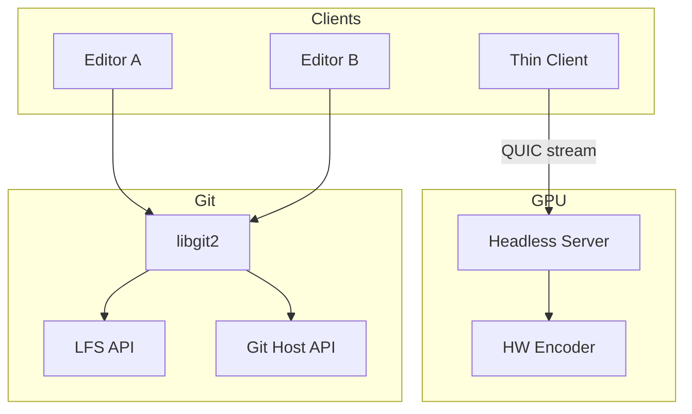
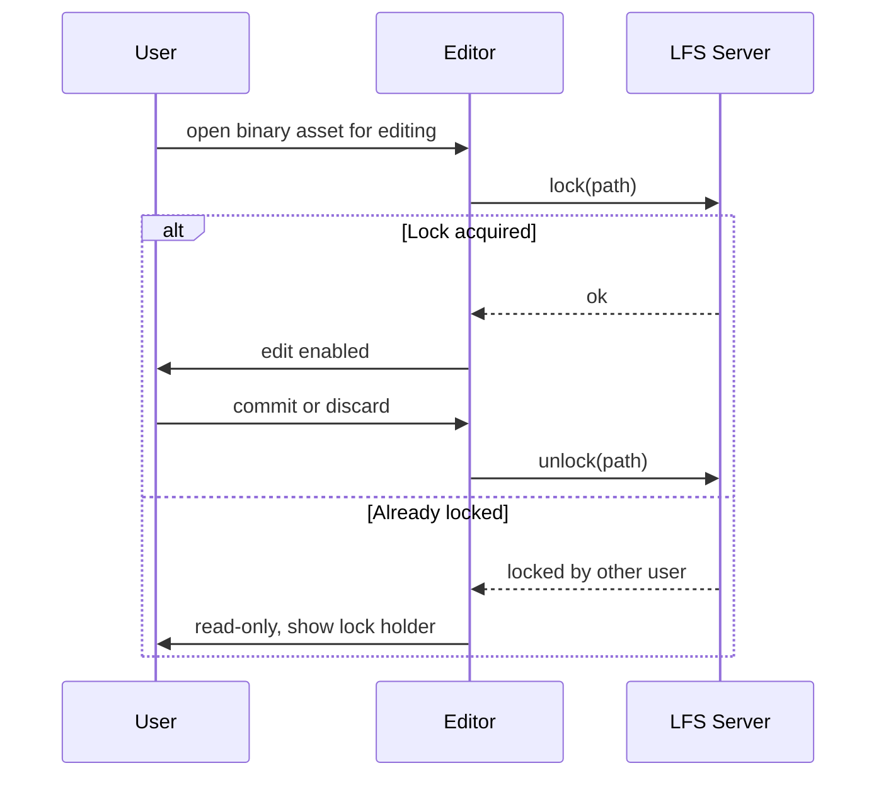
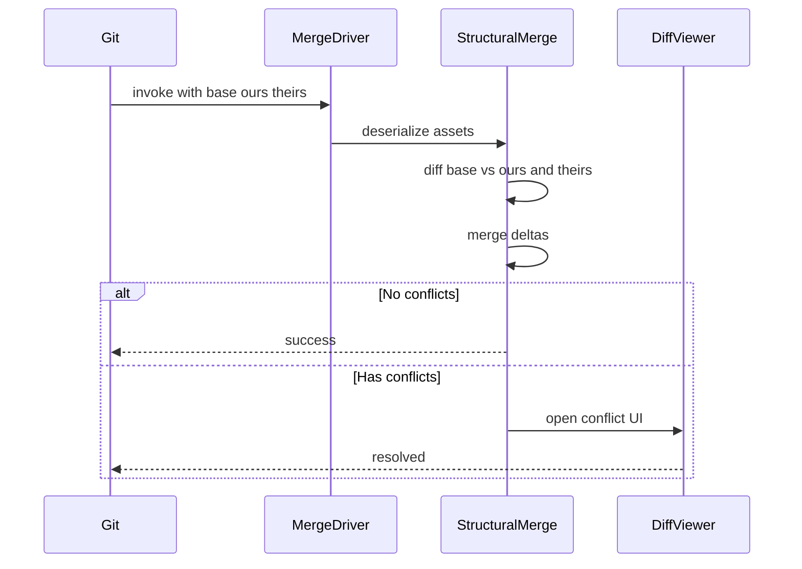
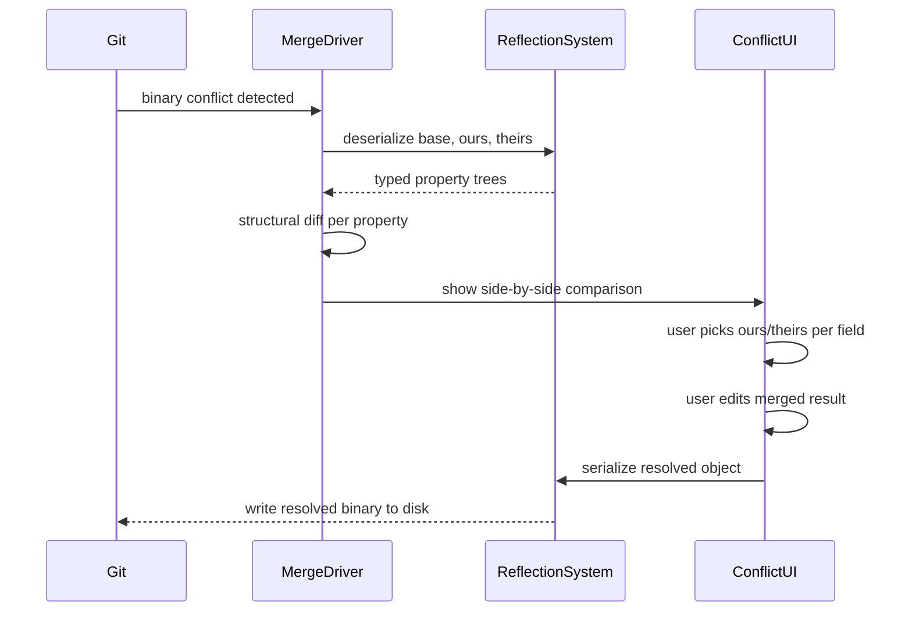
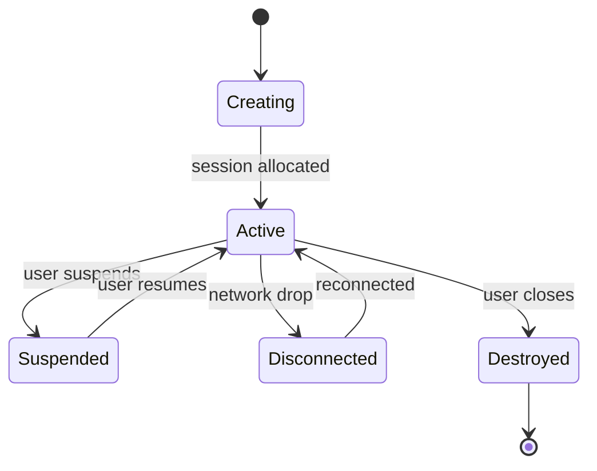
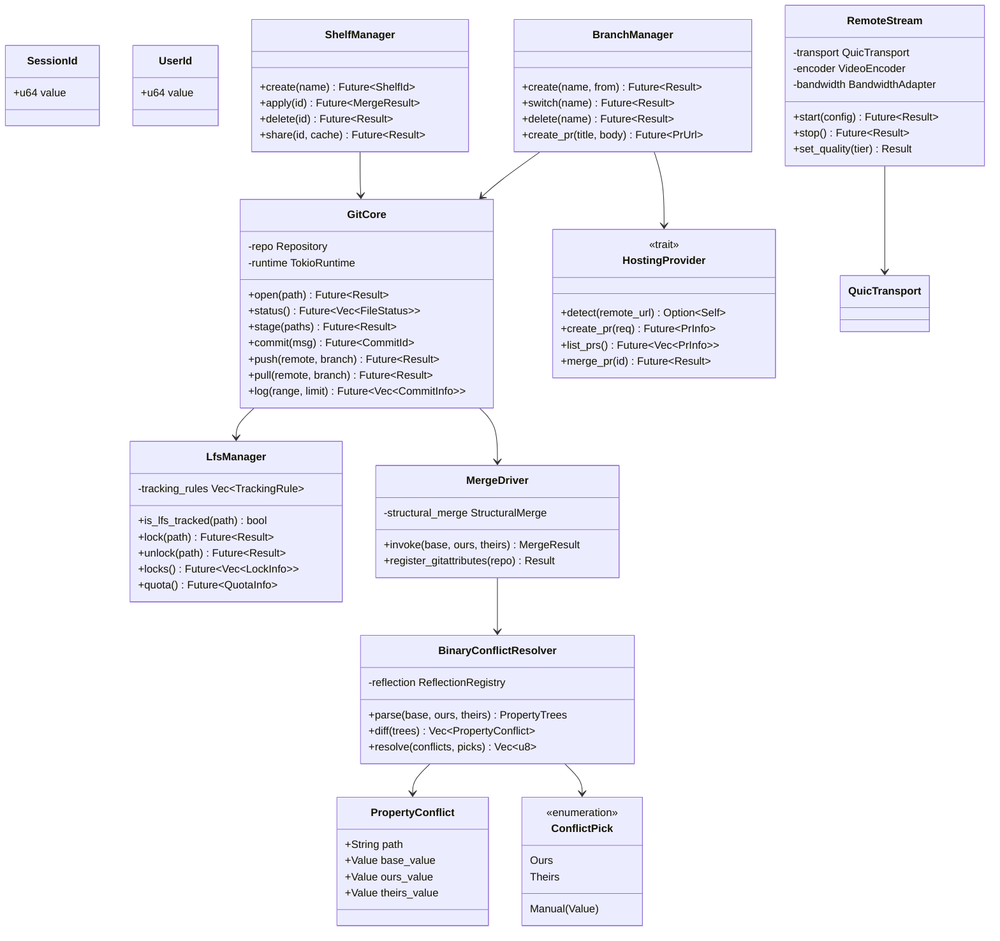

# Team Tools Design

## Requirements Trace

### Remote Editing (F-15.12)

| Feature    | Requirement |
|------------|-------------|
| F-15.12.1  | R-15.12.1   |
| F-15.12.2  | R-15.12.2   |
| F-15.12.4  | R-15.12.4   |
| F-15.12.5  | R-15.12.5   |
| F-15.12.6  | R-15.12.6   |
| F-15.12.12 | R-15.12.12  |
| F-15.12.13 | R-15.12.13  |
| F-15.12.14 | R-15.12.14  |

1. **F-15.12.1** -- Remote desktop rendering with H.264/H.265
2. **F-15.12.2** -- Custom remote editor protocol over QUIC
3. **F-15.12.4** -- Remote GPU server with multi-session
4. **F-15.12.5** -- Session handoff and persistence
5. **F-15.12.6** -- Bandwidth adaptation and quality tiers
6. **F-15.12.12** -- AI agent collaboration
7. **F-15.12.13** -- Asset and scene comments
8. **F-15.12.14** -- Pull request review in editor

### Version Control (F-15.10)

| Feature   | Requirement |
|-----------|-------------|
| F-15.10.1 | R-15.10.1   |
| F-15.10.2 | R-15.10.2   |
| F-15.10.3 | R-15.10.3   |
| F-15.10.4 | R-15.10.4   |
| F-15.10.5 | R-15.10.5   |
| F-15.10.6 | R-15.10.6   |
| F-15.10.7 | R-15.10.7   |
| F-15.10.8 | R-15.10.8   |

1. **F-15.10.1** -- Native Git integration via libgit2
2. **F-15.10.2** -- Git LFS management with auto-tracking
3. **F-15.10.3** -- Asset-aware three-way structural merge
4. **F-15.10.4** -- Branch-per-feature workflow
5. **F-15.10.5** -- LFS lock-based concurrency control
6. **F-15.10.6** -- Partial clone and sparse checkout
7. **F-15.10.7** -- Named shelves for work-in-progress
8. **F-15.10.8** -- Multi-provider Git hosting support

## Overview

Team tools enable multiple users to work on the same project. The design has two major subsystems:

1. **Remote editing** -- remote rendering via QUIC, session management, AI agent collaboration,
   asset comments, and pull request review in editor.
2. **Version control** -- embedded Git client via libgit2, Git LFS with lock-before-edit
   concurrency, structural merge, binary conflict resolution, branch workflow, partial clone,
   shelves, and multi-provider hosting.

LFS locks are the sole concurrency mechanism for binary assets. Users lock a file before editing and
unlock on commit or discard. The structural merge driver handles text-based asset formats (scenes,
prefabs) via three-way merge. For binary assets that conflict, a dedicated binary conflict
resolution UI parses base/ours/theirs into memory via the reflection/serialization system, shows a
structural diff, and lets the user resolve per-property.

## Architecture

### System Architecture



### LFS Lock Workflow



### Three-Way Structural Merge



### Binary Conflict Resolution



### Session Lifecycle



### Core Data Structures



## API Design

### Git Core

```rust
#[derive(Clone, Copy, Debug, PartialEq, Eq, Hash)]
pub struct CommitId(pub [u8; 20]);

#[derive(Clone, Debug)]
pub struct FileStatus {
    pub path: PathBuf,
    pub index_status: StatusKind,
    pub worktree_status: StatusKind,
    pub is_lfs: bool,
}

pub struct GitCore { /* ... */ }

impl GitCore {
    pub async fn open(
        path: &Path,
        runtime: &tokio::runtime::Handle,
    ) -> Result<Self, VcError>;
    pub async fn status(
        &self,
    ) -> Result<Vec<FileStatus>, VcError>;
    pub async fn stage(
        &self,
        paths: &[&Path],
    ) -> Result<(), VcError>;
    pub async fn commit(
        &self,
        message: &str,
    ) -> Result<CommitId, VcError>;
    pub async fn push(
        &self,
        remote: &str,
        branch: &str,
    ) -> Result<(), VcError>;
    pub async fn pull(
        &self,
        remote: &str,
        branch: &str,
    ) -> Result<(), VcError>;
}
```

### LFS and Locking

```rust
pub struct LfsManager { /* ... */ }

impl LfsManager {
    pub fn is_lfs_tracked(
        &self,
        path: &Path,
    ) -> bool;

    /// Lock a file before editing. Returns error if
    /// already locked by another user.
    pub async fn lock(
        &self,
        path: &Path,
    ) -> Result<(), VcError>;

    /// Unlock a file on commit or discard.
    pub async fn unlock(
        &self,
        path: &Path,
    ) -> Result<(), VcError>;

    /// List all current locks with holder info.
    pub async fn locks(
        &self,
    ) -> Result<Vec<LockInfo>, VcError>;

    pub async fn quota(
        &self,
    ) -> Result<QuotaInfo, VcError>;
}

#[derive(Clone, Debug)]
pub struct LockInfo {
    pub path: PathBuf,
    pub owner: String,
    pub locked_at: u64,
}
```

### Merge and Binary Conflict Resolution

```rust
pub struct MergeDriver { /* ... */ }

impl MergeDriver {
    pub fn invoke(
        &self,
        base: &[u8],
        ours: &[u8],
        theirs: &[u8],
    ) -> MergeResult;

    pub fn register_gitattributes(
        &self,
        repo: &Repository,
    ) -> Result<(), VcError>;
}

pub struct BinaryConflictResolver { /* ... */ }

impl BinaryConflictResolver {
    /// Deserialize base, ours, and theirs from binary
    /// into typed property trees via reflection.
    pub fn parse(
        &self,
        base: &[u8],
        ours: &[u8],
        theirs: &[u8],
    ) -> Result<PropertyTrees, MergeError>;

    /// Compute per-property structural diff across the
    /// three versions.
    pub fn diff(
        &self,
        trees: &PropertyTrees,
    ) -> Vec<PropertyConflict>;

    /// Apply user conflict picks and serialize the
    /// resolved object back to binary.
    pub fn resolve(
        &self,
        trees: &PropertyTrees,
        picks: &[ConflictPick],
    ) -> Result<Vec<u8>, MergeError>;
}

pub struct PropertyConflict {
    pub path: String,
    pub base_value: Value,
    pub ours_value: Value,
    pub theirs_value: Value,
}

pub enum ConflictPick {
    Ours,
    Theirs,
    Manual(Value),
}
```

### Remote Rendering

```rust
pub struct RemoteStream { /* ... */ }

impl RemoteStream {
    pub async fn start(
        &mut self,
        config: RemoteConfig,
    ) -> Result<(), RemoteError>;
    pub async fn stop(
        &mut self,
    ) -> Result<(), RemoteError>;
    pub fn set_quality(
        &mut self,
        tier: QualityTier,
    ) -> Result<(), RemoteError>;
}
```

## Data Flow

### Version Control Workflow

1. User opens a binary asset for editing.
2. Editor calls `LfsManager::lock()` to acquire an LFS lock.
3. If locked by another user, asset opens read-only.
4. User edits, then stages via `GitCore::stage()`.
5. `LfsManager` auto-tracks large files by extension/size.
6. `GitCore::commit()` creates a commit via libgit2.
7. `LfsManager::unlock()` releases the lock on commit.
8. `GitCore::push()` uploads with platform credentials.
9. `BranchManager::create_pr()` opens PR on hosting provider.

### Binary Conflict Resolution

1. Git merge detects a binary conflict.
2. `MergeDriver` delegates to `BinaryConflictResolver`.
3. Resolver deserializes base/ours/theirs via reflection.
4. Structural diff computes per-property changes.
5. Editor opens side-by-side conflict UI.
6. User picks ours or theirs per conflicting property, or manually edits the merged result.
7. Resolver serializes the resolved object back to binary.
8. Merge completes with the resolved file on disk.

### LFS Lock Concurrency

1. Editor broadcasts `lock(path)` to LFS server on edit.
2. Other editors querying the same path see lock holder.
3. Lock holder commits or discards to release the lock.
4. Waiting editors are notified when lock is released.

## Platform Considerations

| Component | Windows | macOS | Linux |
|-----------|---------|-------|-------|
| Async | Tokio | Tokio | Tokio |
| Git | libgit2 | libgit2 | libgit2 |
| Credentials | Cred Manager | Keychain | libsecret |
| Video encode | NVENC / AMF | VideoToolbox | VAAPI |
| QUIC | quinn | quinn | quinn |

## Test Plan

Test cases are in [team-tools-test-cases.md](team-tools-test-cases.md).

| Category | Count |
|----------|-------|
| Unit tests | 26 |
| Integration tests | 10 |
| Benchmarks | 4 |

1. **Unit** -- Git status parsing, LFS tracking, LFS lock/unlock, lock query, structural merge,
   binary conflict parse/diff/resolve (ours, theirs, manual, mixed, nested, unknown type fallback),
   branch ops, shelf create/apply, hosting provider detect
2. **Integration** -- Remote rendering round-trip, Git commit-push-pull cycle, merge conflict
   resolution, binary conflict resolution end-to-end, side-by-side conflict UI per-property
   resolution, partial clone workflow, LFS lock contention, lock-edit-commit-unlock cycle
3. **Benchmarks** -- Merge latency for large scenes, binary conflict resolution latency, remote
   rendering frame latency, Git clone time

## Open Questions

1. **Structural merge coverage.** Which binary asset types support structural merge at launch vs.
   falling back to manual resolution?
2. **Remote rendering codec selection.** Should we support AV1 in addition to H.264/H.265 for better
   compression at low bitrates?
3. **Binary conflict resolution limits.** What is the maximum asset size that can be parsed into
   memory for per-property conflict resolution?
