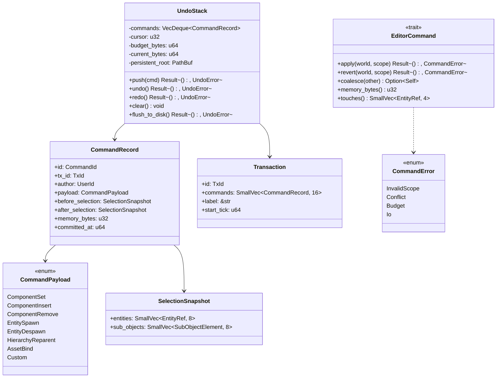
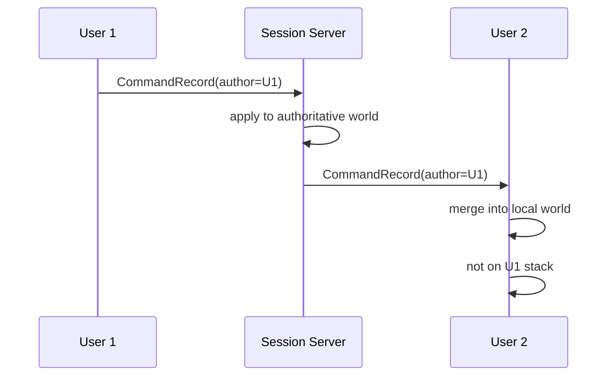

# Undo / Redo Design

## Requirements Trace

> **Canonical sources:** Features, requirements, and user stories live in
> [features/](../../features/), [requirements/](../../requirements/), and
> [user-stories/](../../user-stories/).

### Primary Requirements

| Feature    | Requirement | User Story   | Design Element                  |
|------------|-------------|--------------|---------------------------------|
| F-15.1.3.1 | R-15.1.3.1  | US-15.1.3.1  | `EditorCommand` trait           |
| F-15.1.3.2 | R-15.1.3.2  | US-15.1.3.2  | `UndoStack` structure           |
| F-15.1.3.3 | R-15.1.3.3  | US-15.1.3.3  | `Transaction` grouping          |
| F-15.1.3.4 | R-15.1.3.4  | US-15.1.3.4  | Memory budget (256 MiB)         |
| F-15.1.3.5 | R-15.1.3.5  | US-15.1.3.5  | Persistent history on disk      |
| F-15.1.3.6 | R-15.1.3.6  | US-15.1.3.6  | Latency target < 50 ms          |
| F-15.1.3.7 | R-15.1.3.7  | US-15.1.3.7  | Selection-coupled commands      |
| F-15.1.3.8 | R-15.1.3.8  | US-15.1.3.8  | Collaborative undo sync         |

1. **R-15.1.3.1** -- `EditorCommand` trait with `apply`, `revert`, `coalesce`, `memory_bytes`
2. **R-15.1.3.2** -- `UndoStack` is per-editor-world, stores commands in a `VecDeque`
3. **R-15.1.3.3** -- Transactions group several commands into one undo step
4. **R-15.1.3.4** -- Total in-memory history capped at 256 MiB, oldest evicted
5. **R-15.1.3.5** -- History is mirrored to disk every commit (rkyv)
6. **R-15.1.3.6** -- Apply / revert finishes in < 50 ms for typical commands
7. **R-15.1.3.7** -- A command records the selection before and after; undo restores both
8. **R-15.1.3.8** -- Collaborative sessions synchronize stack state via QUIC events

### Cross-Cutting Dependencies

| Dependency       | Source    | Consumed API                  |
|------------------|-----------|-------------------------------|
| Editor core      | F-15.1    | `EditorWorld`, `EventBridge`  |
| Selection model  | F-15.1.4  | `SelectionState`              |
| Serialization    | F-1.4.1   | rkyv persistence              |
| Networking       | F-11.3.1  | Collaborative sync channel    |
| Asset pipeline   | F-12.1    | Command-referenced assets     |
| Event system     | F-1.5.1   | Event bridge for game world   |

---

## Overview

All editor mutations are expressed as `EditorCommand` values pushed onto an `UndoStack`. This gives
the user unbounded undo, reliable redo, transaction grouping, and, in collaborative sessions,
per-user undo scopes that do not interfere.

### Design Principles

1. **Command pattern** -- no raw mutation of `EditorWorld`; every change goes through a command
2. **Revert from command data** -- commands capture both before and after states
3. **Coalescing** -- repeated small commands collapse (typing, slider drag)
4. **Bounded memory** -- 256 MiB cap with LRU eviction; old history spills to disk
5. **Persistent across sessions** -- project save restores the undo stack
6. **Collaborative** -- multi-user sessions synchronize stack state
7. **Latency target** -- < 50 ms per command apply/revert
8. **No HashMap on hot path** -- command index is a sorted `Vec`

---

## Architecture

### Class Diagram



### Stack Layout

```text
UndoStack
  commands: [C0, C1, C2, C3, C4]
  cursor:                    ^   (points to next undo)
  budget: 256 MiB
  persistent_root: .harmonius/undo/<session_id>/
```

Undo rewinds the cursor one step; redo forwards it. Pushing a new command discards everything after
the cursor.

---

## API Design

### Trait

```rust
pub trait EditorCommand: Sized + rkyv::Archive {
    fn apply(&self, world: &mut EditorWorld, scope: &CommandScope) -> Result<(), CommandError>;
    fn revert(&self, world: &mut EditorWorld, scope: &CommandScope) -> Result<(), CommandError>;
    fn coalesce(&mut self, other: Self) -> Option<Self>;
    fn memory_bytes(&self) -> u32;
    fn touches(&self) -> SmallVec<[EntityRef; 4]>;
    fn label(&self) -> &'static str;
}

pub enum CommandError {
    InvalidScope,
    Conflict,
    Budget,
    Io(IoErrorKind),
}
```

### Core Commands

```rust
pub enum CommandPayload {
    ComponentSet { entity: EntityRef, component: ComponentTypeId, before: Blob, after: Blob },
    ComponentInsert { entity: EntityRef, component: ComponentTypeId, value: Blob },
    ComponentRemove { entity: EntityRef, component: ComponentTypeId, removed: Blob },
    EntitySpawn { parent: Option<EntityRef>, archetype: ArchetypeId, values: Vec<Blob> },
    EntityDespawn { entity: EntityRef, snapshot: EntitySnapshot },
    HierarchyReparent {
        entity: EntityRef,
        old_parent: Option<EntityRef>,
        new_parent: Option<EntityRef>,
    },
    AssetBind { entity: EntityRef, handle: AssetId },
    Custom(Box<dyn ErasedCommand>),
}
```

`Custom` is the only place `dyn` appears; it carries commands authored by editor plugins. The core
commands stay static-dispatch.

### Undo Stack

```rust
pub struct UndoStack {
    commands: VecDeque<CommandRecord>,
    cursor: u32,
    budget_bytes: u64,
    current_bytes: u64,
    persistent_root: PathBuf,
}

impl UndoStack {
    pub fn push(&mut self, cmd: CommandRecord) -> Result<(), UndoError> {
        self.commands.truncate(self.cursor as usize);
        if self.can_coalesce(&cmd) {
            self.coalesce_into_last(cmd);
        } else {
            self.current_bytes += cmd.memory_bytes as u64;
            self.commands.push_back(cmd);
            self.cursor = self.commands.len() as u32;
            self.evict_if_over_budget()?;
        }
        self.spill_to_disk_if_needed()
    }

    pub fn undo(&mut self) -> Result<(), UndoError> { /* ... */ }
    pub fn redo(&mut self) -> Result<(), UndoError> { /* ... */ }
}
```

### Transaction

```rust
pub struct TransactionGuard<'a> {
    stack: &'a mut UndoStack,
    tx_id: TxId,
    label: &'static str,
}

impl UndoStack {
    pub fn begin_tx(&mut self, label: &'static str) -> TransactionGuard<'_> {
        TransactionGuard { stack: self, tx_id: TxId::new(), label }
    }
}
```

`TransactionGuard` rolls commands together; dropping the guard commits the transaction as one undo
step. Panics inside a transaction roll back all pushed commands.

---

## Memory Budget

| Policy         | Value                                         |
|----------------|-----------------------------------------------|
| In-memory cap  | 256 MiB (configurable per project)            |
| Eviction       | Oldest committed commands spilled to disk     |
| On disk format | rkyv, one file per command, indexed by offset |
| Disk cap       | 4 GiB; oldest files purged                    |

When in-memory exceeds cap, the tail of the deque is serialized to disk; a lightweight
`CommandStub { id, tx_id, disk_offset, memory_bytes }` replaces the full record.

---

## Persistent History

### Directory Layout

```text
.harmonius/undo/<session_id>/
  manifest.rkyv            (CommandStub[] + cursor)
  commands/
    000000.rkyv
    000001.rkyv
    ...
```

### Load / Save

On session start, the manifest is read. Commands are loaded lazily when a user undoes past the
in-memory tail. On session end, the full deque (including in-memory records) is flushed.

---

## Selection Coupling

Every command captures `before_selection` and `after_selection` snapshots. Undo restores
`before_selection`; redo restores `after_selection`. This keeps gizmos and property panels in sync
with history, so "undoing an edit" also "undoes the selection change".

---

## Collaborative Sync

In multi-user sessions, each user has a **per-user undo stack** but shares the editor world.
Commands flow through the collaboration channel:



Per-user undo rewinds only commands with `author == self.user_id`. Conflict detection uses the
`touches()` set: if two users undo commands that overlap, the later undo is rejected.

---

## Latency Targets

| Operation       | Target   |
|-----------------|----------|
| Apply command   | < 50 ms  |
| Revert command  | < 50 ms  |
| Coalesce        | < 5 ms   |
| Spill to disk   | < 20 ms  |
| Load from disk  | < 30 ms  |

The target budget assumes typical commands (< 10 entities, < 1 MiB payload). Commands over these
sizes log a warning but continue.

---

## Platform Considerations

| Platform | Disk Root                          |
|----------|------------------------------------|
| Windows  | `%APPDATA%/Harmonius/undo`         |
| macOS    | `~/Library/Application Support/Harmonius/undo` |
| Linux    | `${XDG_DATA_HOME}/harmonius/undo`  |

All I/O is routed through the main thread via `IoRequest` (per constraints.md async rule).

---

## Test Plan

See [undo-redo-test-cases.md](undo-redo-test-cases.md) for TC-15.1.3.x.y entries:

- Unit tests for command apply/revert round trip, coalesce, memory accounting
- Integration tests for persistent history, session restore, collaborative sync
- Benchmarks for latency targets

---

## Open Questions

1. Should `Custom` commands be persistable? If not, plugins lose their history across sessions.
2. How do we present collaborative conflicts in the UI (toast, modal, silent drop)?
3. Do transactions support rollback of partial failure (first command succeeded, second failed)?
4. Can undo cross hot-reload boundaries (after codegen rebuild)?
