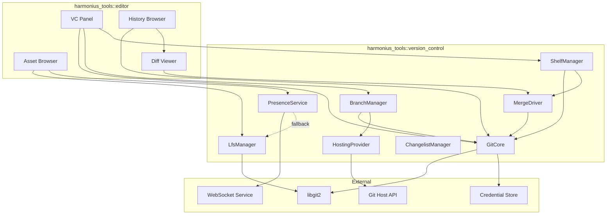
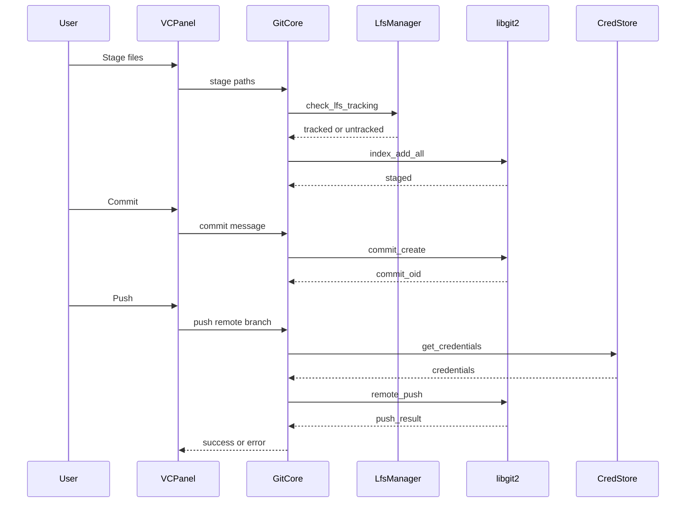
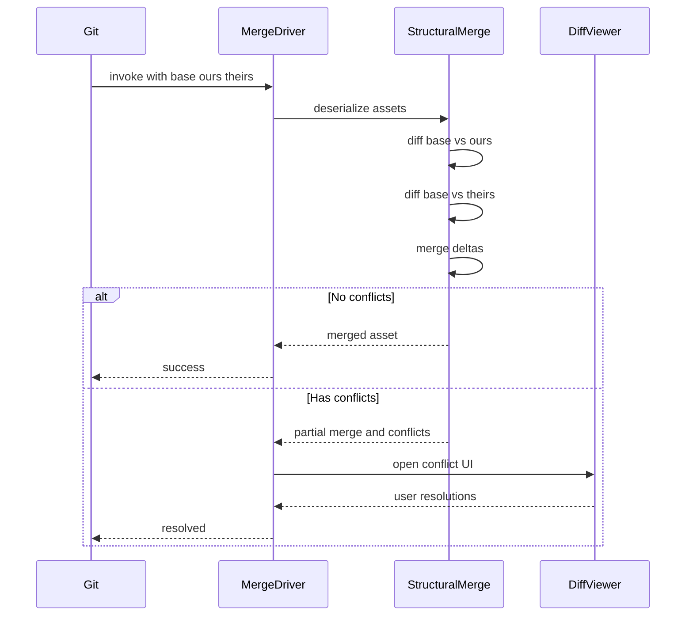
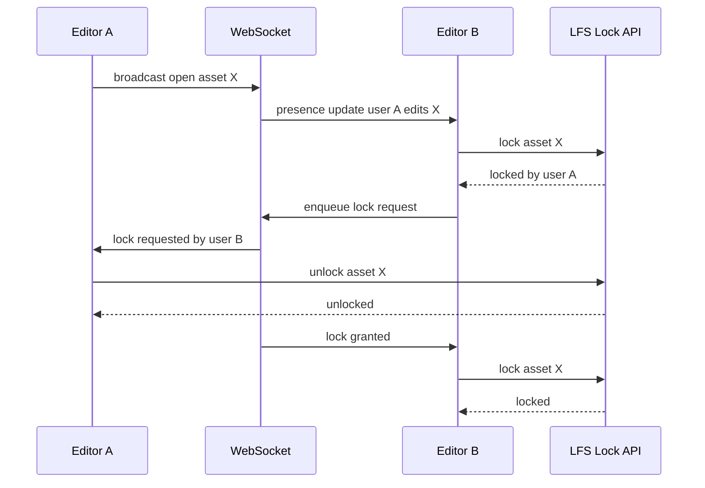
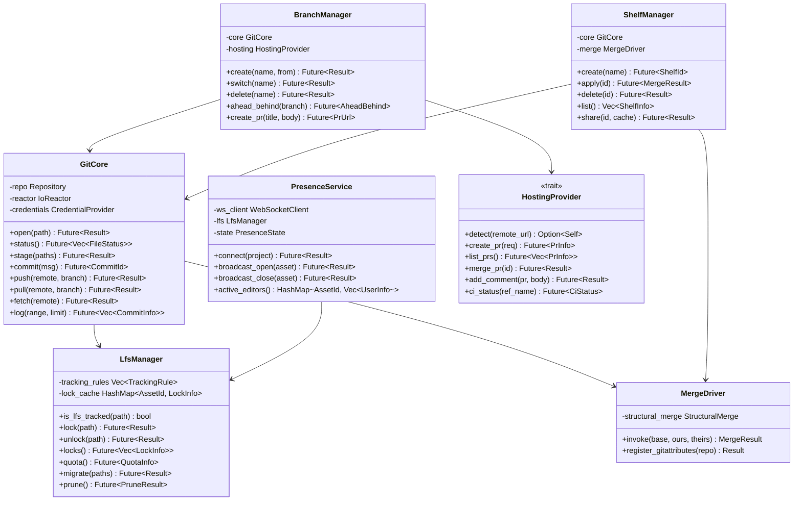

# Version Control Integration Design

## Requirements Trace

> **Canonical sources:** Features, requirements, and user stories are defined in
> [features/tools-editor/](../../features/tools-editor/),
> [requirements/tools-editor/](../../requirements/tools-editor/), and
> [user-stories/tools-editor/](../../user-stories/tools-editor/). The table below traces design
> elements to those definitions.

| Feature | Requirement | Description |
|---------|-------------|-------------|
| F-15.10.1 | R-15.10.1 | Native Git integration via libgit2 |
| F-15.10.2 | R-15.10.2 | Git LFS management with auto-tracking and locking |
| F-15.10.3 | R-15.10.3 | Asset-aware three-way structural merge driver |
| F-15.10.4 | R-15.10.4 | Branch-per-feature workflow with cache preservation |
| F-15.10.5 | R-15.10.5 | Collaborative presence and pessimistic locking |
| F-15.10.6 | R-15.10.6 | Partial clone and sparse checkout |
| F-15.10.7 | R-15.10.7 | Named shelves for work-in-progress |
| F-15.10.8 | R-15.10.8 | Multi-provider Git hosting support |

## Overview

The version control subsystem embeds a full Git client inside the Harmonius editor. All repository
operations — stage, commit, push, pull, branch, merge, rebase, stash — execute through libgit2 via
the `git2` Rust crate, eliminating shell-out overhead and ensuring identical behavior across
platforms.

Key capabilities:

1. **Git LFS** — automatic tracking by extension and size threshold, lock/unlock from the asset
   browser, bulk operations, and storage quota monitoring.
2. **Structural merge driver** — three-way semantic merge for binary assets (logic graphs, prefabs,
   materials, data tables) registered via `.gitattributes` with visual conflict resolution fallback.
3. **Branch workflow** — create, switch, and delete branches from the editor; asset cache
   preservation on switch; PR/MR creation against GitHub, GitLab, Bitbucket, and Azure DevOps.
4. **Presence** — real-time indicators of who edits what, pessimistic locking for non-mergeable
   assets, lock queuing with holder notification.
5. **Partial clone / sparse checkout** — blobless and treeless clone modes, role-based sparse
   patterns, on-demand fetch with placeholder thumbnails.
6. **Shelves** — named work-in-progress snapshots with structural diffs, shareable via the shared
   cache, merged structurally on application.
7. **Multi-provider** — auto-detect hosting provider from remote URL, in-editor PR
   creation/review/merge, API tokens in platform credential store.

All Git and network I/O is async. The subsystem never blocks the editor UI thread. Credential access
uses platform-native stores (Keychain on macOS, Credential Manager on Windows, libsecret on Linux).

## Architecture

### Module Boundaries



### File Layout

```text
harmonius_tools/
├── version_control/
│   ├── core.rs          # GitCore — repo open, status, stage,
│   │                    # commit, push, pull, fetch
│   ├── lfs.rs           # LfsManager — tracking rules, lock,
│   │                    # unlock, quota, bulk ops
│   ├── merge.rs         # MergeDriver — three-way structural
│   │                    # merge, conflict extraction
│   ├── branch.rs        # BranchManager — create, switch,
│   │                    # delete, ahead/behind, cache
│   │                    # preservation
│   ├── presence.rs      # PresenceService — WebSocket
│   │                    # broadcast, LFS lock fallback
│   ├── shelf.rs         # ShelfManager — create, apply,
│   │                    # delete, share via cache
│   ├── hosting.rs       # HostingProvider trait + impls
│   │                    # (GitHub, GitLab, Bitbucket,
│   │                    # Azure DevOps)
│   ├── changelist.rs    # ChangelistManager — group staged
│   │                    # files into named changelists
│   ├── credentials.rs   # Platform credential store
│   │                    # abstraction
│   ├── sparse.rs        # Partial clone, sparse checkout
│   │                    # config, on-demand fetch
│   └── diff.rs          # Structural diff engine for
│                        # asset-level diffs
└── editor/
    ├── vc_panel.rs      # Version control panel UI
    ├── history.rs       # Commit history browser + graph
    ├── diff_viewer.rs   # Visual diff / conflict resolution
    └── branch_graph.rs  # Branch topology visualization
```

### Commit Flow



### Three-Way Structural Merge



### Presence and Locking



### Core Data Structures



## API Design

### Git Core

```rust
/// Unique identifier for a Git commit.
#[derive(Clone, Debug, PartialEq, Eq, Hash)]
pub struct CommitId(pub [u8; 20]);

/// Status of a single file in the working tree.
#[derive(Clone, Debug)]
pub struct FileStatus {
    pub path: PathBuf,
    pub index_status: StatusKind,
    pub worktree_status: StatusKind,
    pub is_lfs: bool,
}

#[derive(Clone, Copy, Debug, PartialEq, Eq)]
pub enum StatusKind {
    Unmodified,
    Added,
    Modified,
    Deleted,
    Renamed,
    Copied,
    Untracked,
    Ignored,
    Conflicted,
}

/// Summary of a single commit.
#[derive(Clone, Debug)]
pub struct CommitInfo {
    pub id: CommitId,
    pub parent_ids: SmallVec<[CommitId; 2]>,
    pub author: Signature,
    pub committer: Signature,
    pub message: String,
    pub timestamp: i64,
}

/// Author or committer identity.
#[derive(Clone, Debug)]
pub struct Signature {
    pub name: String,
    pub email: String,
}

/// The core Git repository handle. All operations
/// are async and execute I/O through the IoReactor.
pub struct GitCore { /* ... */ }

impl GitCore {
    /// Open a repository at the given path.
    pub async fn open(
        path: &Path,
        reactor: &IoReactor,
    ) -> Result<Self, VcError>;

    /// Return status of all files in the working
    /// tree relative to HEAD.
    pub async fn status(
        &self,
    ) -> Result<Vec<FileStatus>, VcError>;

    /// Stage the given paths into the index.
    pub async fn stage(
        &self,
        paths: &[&Path],
    ) -> Result<(), VcError>;

    /// Unstage the given paths from the index.
    pub async fn unstage(
        &self,
        paths: &[&Path],
    ) -> Result<(), VcError>;

    /// Create a commit from the current index.
    pub async fn commit(
        &self,
        message: &str,
    ) -> Result<CommitId, VcError>;

    /// Push a branch to a remote.
    pub async fn push(
        &self,
        remote: &str,
        branch: &str,
    ) -> Result<(), VcError>;

    /// Pull (fetch + merge) from a remote.
    pub async fn pull(
        &self,
        remote: &str,
        branch: &str,
    ) -> Result<PullResult, VcError>;

    /// Fetch refs from a remote without merging.
    pub async fn fetch(
        &self,
        remote: &str,
    ) -> Result<(), VcError>;

    /// Return commit log for a ref range.
    pub async fn log(
        &self,
        range: &RefRange,
        limit: u32,
    ) -> Result<Vec<CommitInfo>, VcError>;

    /// Return the structural diff between two
    /// commits for a specific asset path.
    pub async fn diff_asset(
        &self,
        old: &CommitId,
        new: &CommitId,
        path: &Path,
    ) -> Result<StructuralDiff, VcError>;
}
```

### LFS Manager

```rust
/// Rule for automatic LFS tracking.
#[derive(Clone, Debug)]
pub struct TrackingRule {
    /// Glob pattern (e.g. "*.png", "*.fbx").
    pub pattern: String,
    /// Optional minimum file size in bytes.
    pub min_size: Option<u64>,
}

/// Information about an active LFS lock.
#[derive(Clone, Debug)]
pub struct LockInfo {
    pub path: PathBuf,
    pub owner: String,
    pub locked_at: i64,
    pub id: u64,
}

/// LFS storage quota information.
#[derive(Clone, Debug)]
pub struct QuotaInfo {
    pub used_bytes: u64,
    pub limit_bytes: u64,
    pub used_objects: u64,
}

/// Manages Git LFS tracking, locking, and storage.
pub struct LfsManager { /* ... */ }

impl LfsManager {
    pub fn new(
        core: &GitCore,
        rules: Vec<TrackingRule>,
    ) -> Self;

    /// Check whether a path matches LFS tracking
    /// rules.
    pub fn is_lfs_tracked(
        &self,
        path: &Path,
    ) -> bool;

    /// Lock a file for exclusive editing.
    pub async fn lock(
        &self,
        path: &Path,
    ) -> Result<LockInfo, VcError>;

    /// Unlock a previously locked file.
    pub async fn unlock(
        &self,
        path: &Path,
    ) -> Result<(), VcError>;

    /// List all active locks on the remote.
    pub async fn locks(
        &self,
    ) -> Result<Vec<LockInfo>, VcError>;

    /// Query the LFS storage quota.
    pub async fn quota(
        &self,
    ) -> Result<QuotaInfo, VcError>;

    /// Migrate paths to LFS tracking.
    pub async fn migrate(
        &self,
        paths: &[&Path],
    ) -> Result<(), VcError>;

    /// Prune unreferenced LFS objects.
    pub async fn prune(
        &self,
    ) -> Result<PruneResult, VcError>;
}
```

### Merge Driver

```rust
/// Result of a three-way structural merge.
#[derive(Debug)]
pub enum MergeResult {
    /// Merge succeeded with no conflicts.
    Clean { merged: Vec<u8> },
    /// Merge has unresolvable conflicts.
    Conflicted {
        partial: Vec<u8>,
        conflicts: Vec<MergeConflict>,
    },
}

/// A single merge conflict at a specific location
/// in the asset graph.
#[derive(Debug)]
pub struct MergeConflict {
    pub path: PropertyPath,
    pub ours: Option<PropertyValue>,
    pub theirs: Option<PropertyValue>,
    pub base: Option<PropertyValue>,
}

/// The asset-aware merge driver. Registered via
/// .gitattributes on project setup.
pub struct MergeDriver { /* ... */ }

impl MergeDriver {
    pub fn new() -> Self;

    /// Perform three-way structural merge.
    pub fn invoke(
        &self,
        base: &[u8],
        ours: &[u8],
        theirs: &[u8],
    ) -> Result<MergeResult, VcError>;

    /// Register the merge driver in .gitattributes
    /// and .git/config for the given repository.
    pub fn register(
        &self,
        repo_path: &Path,
    ) -> Result<(), VcError>;
}
```

### Branch Manager

```rust
/// Ahead/behind count relative to upstream.
#[derive(Clone, Copy, Debug)]
pub struct AheadBehind {
    pub ahead: u32,
    pub behind: u32,
}

/// Branch information.
#[derive(Clone, Debug)]
pub struct BranchInfo {
    pub name: String,
    pub upstream: Option<String>,
    pub head: CommitId,
    pub ahead_behind: Option<AheadBehind>,
    pub is_current: bool,
}

pub struct BranchManager { /* ... */ }

impl BranchManager {
    pub fn new(
        core: &GitCore,
        hosting: Box<dyn HostingProvider>,
    ) -> Self;

    /// Create a new branch from a base ref.
    pub async fn create(
        &self,
        name: &str,
        from: &str,
    ) -> Result<(), VcError>;

    /// Switch to an existing branch. Preserves
    /// compiled asset cache entries whose source
    /// content hash is unchanged.
    pub async fn switch(
        &self,
        name: &str,
    ) -> Result<SwitchResult, VcError>;

    /// Delete a branch (local and optionally
    /// remote).
    pub async fn delete(
        &self,
        name: &str,
        delete_remote: bool,
    ) -> Result<(), VcError>;

    /// List all local and remote branches.
    pub async fn list(
        &self,
    ) -> Result<Vec<BranchInfo>, VcError>;

    /// Create a pull/merge request on the hosting
    /// provider.
    pub async fn create_pr(
        &self,
        title: &str,
        body: &str,
        base: &str,
    ) -> Result<PrUrl, VcError>;
}
```

### Hosting Provider

```rust
/// Information about a pull/merge request.
#[derive(Clone, Debug)]
pub struct PrInfo {
    pub id: u64,
    pub title: String,
    pub state: PrState,
    pub author: String,
    pub url: String,
    pub ci_status: Option<CiStatus>,
}

#[derive(Clone, Copy, Debug, PartialEq, Eq)]
pub enum PrState {
    Open,
    Merged,
    Closed,
}

#[derive(Clone, Copy, Debug, PartialEq, Eq)]
pub enum CiStatus {
    Pending,
    Success,
    Failure,
    Cancelled,
}

/// Abstraction over Git hosting providers.
pub trait HostingProvider: Send + Sync {
    /// Detect the provider from a remote URL.
    /// Returns None if the URL does not match.
    fn detect(
        remote_url: &str,
    ) -> Option<Box<dyn HostingProvider>>
    where
        Self: Sized;

    /// Create a pull/merge request.
    fn create_pr(
        &self,
        title: &str,
        body: &str,
        head: &str,
        base: &str,
    ) -> impl Future<
        Output = Result<PrInfo, VcError>,
    > + Send;

    /// List pull requests.
    fn list_prs(
        &self,
        state: Option<PrState>,
    ) -> impl Future<
        Output = Result<Vec<PrInfo>, VcError>,
    > + Send;

    /// Merge a pull request.
    fn merge_pr(
        &self,
        id: u64,
    ) -> impl Future<
        Output = Result<(), VcError>,
    > + Send;

    /// Add a review comment.
    fn add_comment(
        &self,
        pr_id: u64,
        body: &str,
    ) -> impl Future<
        Output = Result<(), VcError>,
    > + Send;

    /// Query CI status for a ref.
    fn ci_status(
        &self,
        ref_name: &str,
    ) -> impl Future<
        Output = Result<CiStatus, VcError>,
    > + Send;
}
```

### Presence Service

```rust
/// Information about a connected user.
#[derive(Clone, Debug)]
pub struct UserPresence {
    pub user_id: String,
    pub display_name: String,
    pub avatar_color: [u8; 3],
    pub editing_assets: Vec<AssetId>,
}

/// Real-time presence service. Uses WebSocket for
/// live updates, falls back to polling LFS locks
/// when WebSocket is unavailable.
pub struct PresenceService { /* ... */ }

impl PresenceService {
    pub async fn connect(
        &mut self,
        project_id: &str,
    ) -> Result<(), VcError>;

    /// Broadcast that the local user opened an
    /// asset for editing.
    pub async fn broadcast_open(
        &self,
        asset: AssetId,
    ) -> Result<(), VcError>;

    /// Broadcast that the local user closed an
    /// asset.
    pub async fn broadcast_close(
        &self,
        asset: AssetId,
    ) -> Result<(), VcError>;

    /// Snapshot of all currently active editors
    /// grouped by asset.
    pub fn active_editors(
        &self,
    ) -> &HashMap<AssetId, Vec<UserPresence>>;

    /// Register a callback for presence changes.
    pub fn on_change<F>(&mut self, callback: F)
    where
        F: Fn(&PresenceEvent) + Send + 'static;
}
```

### Shelf Manager

```rust
/// A named shelf storing work-in-progress.
#[derive(Clone, Debug)]
pub struct ShelfInfo {
    pub id: ShelfId,
    pub name: String,
    pub created_at: i64,
    pub file_count: u32,
    pub description: Option<String>,
}

#[derive(
    Clone, Copy, Debug, PartialEq, Eq, Hash,
)]
pub struct ShelfId(pub u64);

pub struct ShelfManager { /* ... */ }

impl ShelfManager {
    pub fn new(
        core: &GitCore,
        merge: &MergeDriver,
    ) -> Self;

    /// Create a shelf from current modifications.
    pub async fn create(
        &self,
        name: &str,
        description: Option<&str>,
    ) -> Result<ShelfId, VcError>;

    /// Apply a shelf to the working tree using
    /// structural merge for overlapping edits.
    pub async fn apply(
        &self,
        id: ShelfId,
    ) -> Result<MergeResult, VcError>;

    /// Delete a shelf.
    pub async fn delete(
        &self,
        id: ShelfId,
    ) -> Result<(), VcError>;

    /// List all local shelves.
    pub fn list(&self) -> Vec<ShelfInfo>;

    /// Share a shelf via the shared asset cache.
    pub async fn share(
        &self,
        id: ShelfId,
        cache: &SharedCache,
    ) -> Result<(), VcError>;
}
```

### Error Types

```rust
pub enum VcError {
    /// Repository not found at path.
    RepoNotFound { path: PathBuf },
    /// Authentication failed.
    AuthFailed { remote: String },
    /// Network error during remote operation.
    Network { message: String },
    /// Merge conflict requiring user resolution.
    MergeConflict {
        conflicts: Vec<MergeConflict>,
    },
    /// LFS lock held by another user.
    LockHeld {
        path: PathBuf,
        owner: String,
    },
    /// LFS storage quota exceeded.
    QuotaExceeded { used: u64, limit: u64 },
    /// Branch already exists.
    BranchExists { name: String },
    /// Hosting provider API error.
    ProviderApi {
        status: u16,
        message: String,
    },
    /// Shelf not found.
    ShelfNotFound { id: ShelfId },
    /// I/O error from the platform backend.
    Io { source: IoError },
}
```

## Data Flow

### Stage-Commit-Push Lifecycle

1. User selects files in the VC panel and clicks "Stage."
2. `GitCore::stage` checks each path against `LfsManager` tracking rules. Paths matching LFS rules
   are staged via LFS pointer files; others are staged directly via libgit2.
3. User writes a commit message and clicks "Commit."
4. `GitCore::commit` creates a commit object via libgit2 referencing the current index tree.
5. User clicks "Push." `GitCore::push` retrieves credentials from the platform credential store,
   then pushes via libgit2's transport layer.
6. All operations run as async tasks on the thread pool. The UI shows progress and can be cancelled.

### Branch Switch with Cache Preservation

1. `BranchManager::switch` calls `GitCore::status` to detect unsaved changes. If present, the user
   is prompted to shelve or discard.
2. The branch manager snapshots the content hashes of all compiled assets in the local cache.
3. libgit2 performs the branch checkout.
4. After checkout, the manager compares source content hashes. Compiled cache entries whose source
   hash is unchanged survive. Changed entries are evicted and will be rebuilt or fetched from the
   shared cache.

### Presence Fallback

1. On startup, `PresenceService` attempts a WebSocket connection to the presence server.
2. If the connection succeeds, presence updates flow in real time via WebSocket messages.
3. If the connection fails or drops, the service falls back to polling `LfsManager::locks()` on a
   5-second interval. Active locks approximate editing presence.
4. When WebSocket reconnects, the polling fallback is disabled.

### Shelf Lifecycle

1. User creates a shelf via the VC panel. `ShelfManager` serializes all modified files and their
   structural diffs into `.harmonius/shelves/<id>/`.
2. The working tree is reverted to HEAD.
3. To apply a shelf, `ShelfManager` deserializes the shelved assets and uses `MergeDriver` to merge
   them with the current working tree state.
4. Shelves can be shared via the shared cache (F-15.11.1) for handoff scenarios.

## Platform Considerations

### Credential Storage

| Platform | API | Notes |
|----------|-----|-------|
| macOS | Security.framework / Keychain | SSH keys, API tokens, passphrases |
| Windows | Credential Manager | `CredRead` / `CredWrite` via `windows-sys` |
| Linux | libsecret (Secret Service API) | Falls back to `ssh-agent` if libsecret unavailable |

### TLS Stack for LFS Transfers

| Platform | TLS Backend | Notes |
|----------|-------------|-------|
| macOS | Secure Transport | Via `native-tls` crate |
| Windows | Schannel | Via `native-tls` crate |
| Linux | OpenSSL | Via `native-tls` crate or `rustls` |

### Hosting Provider APIs

| Provider | API | Authentication |
|----------|-----|----------------|
| GitHub | REST v3 + GraphQL v4 | OAuth2 / personal access token |
| GitLab | REST v4 | OAuth2 / personal access token |
| Bitbucket | REST 2.0 | App passwords / OAuth2 |
| Azure DevOps | REST 7.x | OAuth2 / PAT |
| Self-hosted | Configurable base URL | Token-based |

### Proposed Dependencies

| Crate | Purpose | Justification |
|-------|---------|---------------|
| `git2` | libgit2 Rust bindings | Direct repo access, no shell-out |
| `native-tls` | Platform TLS | Secure LFS transfers per-platform |
| `tungstenite` | WebSocket client | Non-async; manual I/O via IoReactor |
| `serde` | Serialization | Shelf and config serialization |
| `serde_json` | JSON | Hosting provider API payloads |
| `blake3` | Content hashing | Cache key computation for branch switch |

> **Runtime policy:** Uses `tungstenite` (non-async, no runtime dependency) with manual I/O
> integration via the `IoReactor`. The IoReactor drives the underlying TCP socket and feeds bytes to
> `tungstenite` for WebSocket frame encoding/decoding.

## Test Plan

### Unit Tests

| Test | Req | Description |
|------|-----|-------------|
| `test_stage_lfs_auto_tracking` | R-15.10.2 | Stage a .png file, verify LFS pointer created |
| `test_stage_non_lfs_file` | R-15.10.1 | Stage a .txt file, verify direct staging |
| `test_lfs_size_threshold` | R-15.10.2 | File above threshold is LFS-tracked |
| `test_structural_merge_clean` | R-15.10.3 | Three-way merge with non-overlapping edits succeeds |
| `test_structural_merge_conflict` | R-15.10.3 | Overlapping edits produce MergeConflict list |
| `test_merge_driver_registration` | R-15.10.3 | .gitattributes contains harmonius merge driver |
| `test_branch_create_and_switch` | R-15.10.4 | Create branch, switch to it, HEAD matches |
| `test_branch_switch_warns_dirty` | R-15.10.4 | Dirty working tree produces warning |
| `test_shelf_create_and_apply` | R-15.10.7 | Shelf round-trips modifications correctly |
| `test_shelf_structural_merge` | R-15.10.7 | Applying shelf merges with current changes |
| `test_provider_detect_github` | R-15.10.8 | GitHub remote URL detected as GitHub provider |
| `test_provider_detect_gitlab` | R-15.10.8 | GitLab remote URL detected as GitLab provider |
| `test_sparse_checkout_patterns` | R-15.10.6 | Role patterns produce correct sparse config |
| `test_changelist_grouping` | R-15.10.1 | Files assigned to named changelists |
| `test_credential_store_roundtrip` | R-15.10.1 | Store and retrieve credential per platform |

### Integration Tests

| Test | Req | Description |
|------|-----|-------------|
| `test_commit_push_pull` | R-15.10.1 | Full commit-push-pull cycle against local bare repo |
| `test_lfs_lock_unlock` | R-15.10.2 | Lock, verify lock list, unlock, verify cleared |
| `test_merge_driver_git_invoke` | R-15.10.3 | Git merge invokes custom driver, produces correct output |
| `test_branch_switch_cache_preserved` | R-15.10.4 | Unchanged assets retain cache entries after switch |
| `test_presence_websocket` | R-15.10.5 | Two instances see each other's presence via WebSocket |
| `test_presence_fallback_lfs` | R-15.10.5 | Presence falls back to LFS lock polling when WS is down |
| `test_partial_clone_size` | R-15.10.6 | Blobless clone is smaller than full clone |
| `test_on_demand_fetch` | R-15.10.6 | Missing blob fetched on demand without blocking |
| `test_shelf_share_via_cache` | R-15.10.7 | Shelf uploaded to shared cache, downloaded by another client |
| `test_pr_create_github` | R-15.10.8 | PR created via GitHub API with correct fields |

### Benchmarks

| Benchmark | Target | Source |
|-----------|--------|--------|
| Status of 100k files | < 500 ms | US-15.10.1.6 |
| Stage 1000 files | < 200 ms | US-15.10.1.1 |
| Commit creation | < 50 ms | US-15.10.1.1 |
| Branch switch (no rebuild) | < 2 s | US-15.10.4.2 |
| Structural merge (1 MB asset) | < 100 ms | US-15.10.3.2 |
| Presence broadcast latency | < 100 ms | US-15.10.5.1 |

## Open Questions

1. **libgit2 async wrapping** — libgit2 is synchronous. Options are `spawn_blocking` on the thread
   pool or a dedicated I/O thread. `spawn_blocking` is simpler but may contend with compute tasks.
2. **LFS transfer concurrency** — How many concurrent LFS uploads/downloads per push/pull? Needs
   tuning per network environment. Consider making configurable with sensible defaults (4-8
   concurrent transfers).
3. **Merge driver invocation model** — Git invokes the merge driver as an external process. Need to
   determine whether to use an in-process hook (patching libgit2) or a small CLI shim that
   communicates with the editor.
4. **Presence server deployment** — Lightweight WebSocket server could be part of the collaboration
   cloud service (F-15.12.7) or a standalone microservice. Shared deployment reduces operational
   burden.
5. **Sparse checkout UX** — How to present role-based checkout patterns to non-technical users?
   Consider a wizard with role presets (Artist, Designer, Programmer) plus custom patterns.
6. **Branch graph rendering** — Rendering a DAG with merge lines in the editor UI. Evaluate existing
   graph layout algorithms (Sugiyama, force-directed) or a custom topological renderer.
