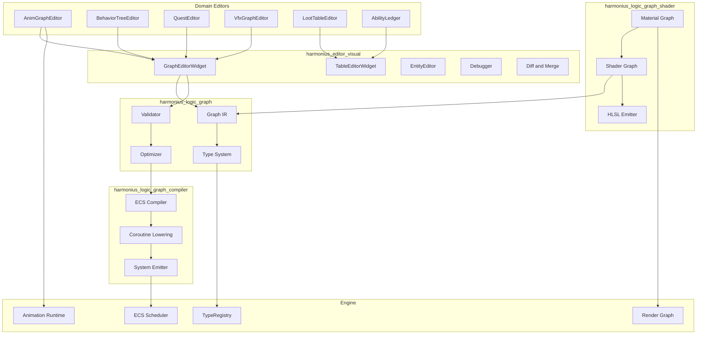
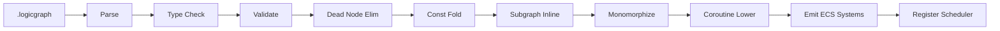
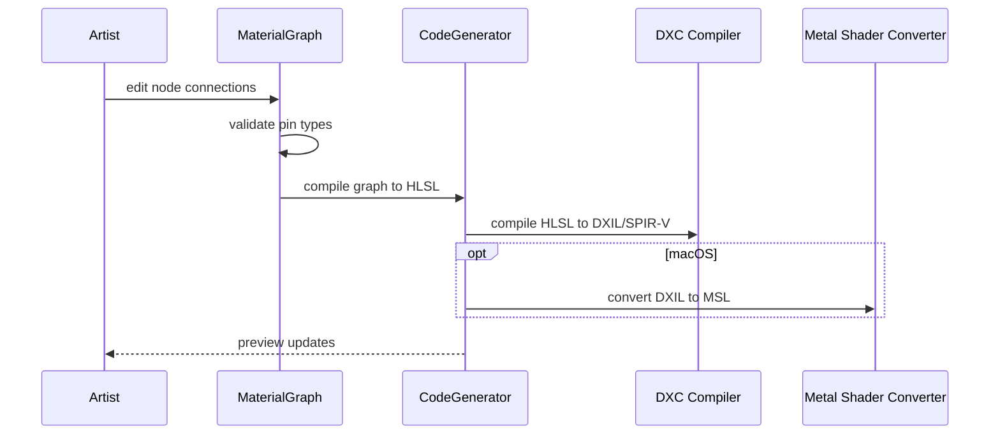

# Visual Editors Design

## Requirements Trace

### Logic Graph Runtime (F-15.8)

| Feature   | Requirement |
|-----------|-------------|
| F-15.8.1  | R-15.8.1    |
| F-15.8.2  | R-15.8.2    |
| F-15.8.3  | R-15.8.3    |
| F-15.8.4  | R-15.8.4    |
| F-15.8.5a | R-15.8.5a   |
| F-15.8.5b | R-15.8.5b   |
| F-15.8.5c | R-15.8.5c   |
| F-15.8.6  | R-15.8.6    |
| F-15.8.7  | R-15.8.7    |
| F-15.8.8  | R-15.8.8    |
| F-15.8.9  | R-15.8.9    |
| F-15.8.10 | R-15.8.10   |
| F-15.8.11 | R-15.8.11   |
| F-15.8.12 | R-15.8.12   |
| F-15.8.13 | R-15.8.13   |
| F-15.8.14 | R-15.8.14   |

1. **F-15.8.1** -- Universal logic graph runtime
2. **F-15.8.2** -- Static type system with bidirectional inference
3. **F-15.8.3** -- Strict validation before save/compile
4. **F-15.8.4** -- Gameplay graphs with coroutine execution
5. **F-15.8.5a** -- Shader graph core (vertex, fragment, compute)
6. **F-15.8.5b** -- Shader graph to HLSL via DXC + Metal Shader Converter
7. **F-15.8.5c** -- Material graph variant with PBR and live preview
8. **F-15.8.6** -- Render graph configuration
9. **F-15.8.7** -- Animation logic graphs
10. **F-15.8.8** -- Audio logic graphs
11. **F-15.8.9** -- Custom tool graphs
12. **F-15.8.10** -- Graph node library
13. **F-15.8.11** -- Graph debugging
14. **F-15.8.12** -- Graph compilation (dead node elim, const fold)
15. **F-15.8.13** -- Graph diffing and three-way merge
16. **F-15.8.14** -- Graph search and refactoring

### Material Editor (F-15.3)

| Feature  | Requirement |
|----------|-------------|
| F-15.3.1 | R-15.3.1    |
| F-15.3.2 | R-15.3.2    |
| F-15.3.3 | R-15.3.3    |
| F-15.3.4 | R-15.3.4    |
| F-15.3.5 | R-15.3.5    |
| F-15.3.6 | R-15.3.6    |

1. **F-15.3.1** -- Node-based material graph with type-safe pins
2. **F-15.3.2** -- Material functions and reusable subgraphs
3. **F-15.3.3** -- Live 3D material preview with split-view
4. **F-15.3.4** -- Shader parameter tweaking without recompilation
5. **F-15.3.5** -- Material instances sharing compiled shaders
6. **F-15.3.6** -- Material library with search and thumbnails

### Animation Editor (F-15.4)

| Feature  | Requirement |
|----------|-------------|
| F-15.4.1 | R-15.4.1    |
| F-15.4.2 | R-15.4.2    |
| F-15.4.3 | R-15.4.3    |
| F-15.4.4 | R-15.4.4    |
| F-15.4.5 | R-15.4.5    |
| F-15.4.6 | R-15.4.6    |
| F-15.4.7 | R-15.4.7    |

1. **F-15.4.1** -- Multi-track animation timeline with keyframes
2. **F-15.4.2** -- Curve editor with Bezier/Hermite tangents
3. **F-15.4.3** -- Skeleton viewer with bone selection
4. **F-15.4.4** -- Animation preview with debug overlays
5. **F-15.4.5** -- 1D/2D blend space editor
6. **F-15.4.6** -- State machine editor with transition debugging
7. **F-15.4.7** -- Retargeting setup with side-by-side preview

### Specialized Editors

| Feature   | Requirement |
|-----------|-------------|
| F-15.13.1 | R-15.13.1  |
| F-15.13.2 | R-15.13.2  |
| F-15.14.1 | R-15.14.1  |
| F-15.5.1  | R-15.5.1   |
| F-15.15.1 | R-15.15.1  |
| F-15.15.2 | R-15.15.2  |
| F-15.15.3 | R-15.15.3  |
| F-15.15.4 | R-15.15.4  |
| F-15.1.4  | R-15.1.4   |
| F-15.2.1  | R-15.2.1   |

1. **F-15.13.1** -- Behavior tree editor for AI authoring
2. **F-15.13.2** -- State machine editor for AI
3. **F-15.14.1** -- Quest editor for objectives
4. **F-15.5.1** -- Visual effect graph editor
5. **F-15.15.1** -- Loot table editor with simulation preview
6. **F-15.15.2** -- Ability ledger for combat stats
7. **F-15.15.3** -- Equipment stat tables with comparison
8. **F-15.15.4** -- Price ledger with inflation simulation
9. **F-15.1.4** -- Entity selection and hierarchy
10. **F-15.2.1** -- Entity template overrides display

## Overview

The visual editors provide the sole authoring surface for all engine logic, materials, animations,
and game data. Users never write textual code. Every behavior, shader, state machine, and data table
is authored through typed, visual graph or table editors.

### Core Principles

1. **No-code.** The graph editor is the only way to author logic.
2. **Compile, never interpret.** Gameplay graphs compile to native ECS systems at edit time. No
   runtime bytecode.
3. **ECS-primary (~90%).** Compiled graphs become systems querying components. A small fraction of
   runtime logic (shader compilation, asset I/O callbacks) may run outside the ECS schedule.
4. **Static dispatch.** All generic nodes are monomorphized.
5. **Shared frameworks.** `GraphEditorWidget` and `TableEditorWidget` implement layout, zoom,
   selection, and undo once.

### Keyboard-First Interaction Model

The logic graph editor prioritizes keyboard-driven workflows inspired by Game Maker's efficient node
authoring. Mouse interaction remains available but is not the primary input.

1. **Quick-add palette.** A hotkey (e.g. Tab) opens a floating search palette. The user types to
   filter node names, presses Enter to place the selected node at the cursor. If a pin is selected,
   the new node's first compatible pin auto-connects.
2. **Keyboard navigation.** Arrow keys move focus between nodes. Tab cycles through pins on the
   focused node. Enter follows a connection to the linked node.
3. **Sequential action lists.** Nodes can be arranged in a linear top-to-bottom reading order with
   implicit execution flow between consecutive nodes (like Game Maker event lists). This reduces
   wiring overhead for simple sequential logic.
4. **Bulk operations.** Shift+Arrow extends selection. Delete removes selected nodes. Ctrl+D
   duplicates the selection in place with offset.

### Macro Groups (Visual Grouping)

Macro nodes are visual grouping containers, not collapsed single nodes. A macro group draws a
colored boundary box around a set of child nodes.

- **Expanded:** child nodes are visible and editable inside the boundary. The group title and color
  are visible as a header.
- **Collapsed:** child nodes are hidden. The group renders as a single compact box showing only the
  title, input pins, and output pins.

```rust
/// A visual grouping container for logic graph
/// nodes. Surrounds child nodes with a titled,
/// colored boundary box.
pub struct MacroGroup {
    pub group_id: GroupId,
    pub name: String,
    pub color: Color,
    pub contained_nodes: Vec<NodeId>,
    pub collapsed: bool,
    pub position: Vec2,
    pub size: Vec2,
}
```

### Domain Coverage

| Domain | Compiles To | Runtime |
|--------|-------------|---------|
| Gameplay | ECS systems | ECS scheduler |
| Shader | HLSL source | DXC / Metal Shader Converter |
| Material | HLSL (PBR) | DXC / Metal Shader Converter |
| Animation | Controller data | Animation system |
| Audio | Audio graph desc | Audio engine |
| Render pipeline | Frame graph desc | Render graph executor |
| Tool | Command sequences | Editor runtime |

## Architecture

### Module Boundaries



### Compilation Pipeline



### Material Compilation



### Core Data Structures

```mermaid
classDiagram
    class GraphId {
        +Uuid value
    }
    class NodeId {
        +u32 value
    }
    class PinId {
        +u32 value
    }
    class GraphDomain {
        <<enum>>
        Gameplay
        Shader
        Material
        Animation
        Audio
        RenderPipeline
        Tool
    }
    class TickPhase {
        <<enum>>
        PreUpdate
        Update
        PostUpdate
        FixedUpdate
    }
    class PinDirection {
        <<enum>>
        Input
        Output
    }
    class VariableScope {
        <<enum>>
        Local
        Graph
        Entity
    }
    class YieldKind {
        <<enum>>
        NextFrame
        Delay
        UntilCondition
    }
    class ComponentAccessKind {
        <<enum>>
        Get
        Set
        Add
        Remove
        Has
    }
    class ShaderStage {
        <<enum>>
        Vertex
        Fragment
        Compute
    }
    class Severity {
        <<enum>>
        Error
        Warning
    }
    class DebugState {
        <<enum>>
        Running
        Paused
        Stepping
        Detached
    }
    class LogicGraph {
        +GraphId graph_id
        +GraphDomain domain
        +String name
        +Vec~Node~ nodes
        +Vec~Edge~ edges
        +Vec~Variable~ variables
    }
    class Node {
        +NodeId node_id
        +NodeKind kind
        +Vec~Pin~ pins
        +Vec2 position
    }
    class NodeKind {
        <<enum>>
        Event
        Tick
        FlowControl
        Pure
        EcsQuery
        ComponentAccess
        ResourceAccess
        EventSend
        SubgraphCall
        Yield
        VariableAccess
        DomainSpecific
    }
    class Pin {
        +PinId pin_id
        +PinDirection direction
        +PinType pin_type
        +String name
    }
    class PinType {
        <<enum>>
        Execution
        Data
        Generic
        Wildcard
    }
    class Edge {
        +NodeId source_node
        +PinId source_pin
        +NodeId target_node
        +PinId target_pin
    }
    class Variable {
        +VariableId var_id
        +String name
        +TypeId type_id
        +VariableScope scope
    }
    class SubgraphDef {
        +GraphId graph_id
        +String name
        +Vec~SubgraphPort~ inputs
        +Vec~SubgraphPort~ outputs
        +LogicGraph body
    }
    class TypeInferenceEngine {
        -HashMap bindings
        +infer(graph, registry) Result
        +update_edge(graph, edge, added) Result
    }
    class GraphValidator {
        +validate(graph, registry) ValidationResult
    }
    class NodeRegistry {
        -Vec~NodeCategory~ categories
        +search(query) Vec~NodeDefinition~
        +generate_from_type_registry(registry)
    }
    class EcsCompiler {
        +compile(graph, registry) Result~CompiledGraph~
    }
    class CompiledGraph {
        +GraphId graph_id
        +Vec~CompiledSystem~ systems
        +DebugInfo debug_info
    }
    class SystemTrigger {
        <<enum>>
        Tick
        Event
        OnAdd
        OnRemove
        OnChange
    }
    class GraphDebugger {
        -HashMap breakpoints
        -DebugState state
        +set_breakpoint(node_id, condition)
        +step()
        +read_pin_value(node, pin) Option
    }
    class GraphDiffer {
        +diff(base, head) GraphDiff
        +merge_three_way(base, ours, theirs) MergeResult
    }
    class HlslEmitter {
        +emit(graph, stage, registry) Result~HlslOutput~
    }
    class MaterialGraph {
        +AssetId id
        +Vec~MaterialNode~ nodes
        +Vec~MaterialEdge~ edges
        +compile() Result~HlslSource~
        +validate() Vec~ValidationError~
    }
    class MaterialInstance {
        +AssetId id
        +AssetId parent_material
        +HashMap~String, ParamValue~ overrides
    }
    class AnimClip {
        +AssetId id
        +f32 duration
        +Vec~AnimTrack~ tracks
    }
    class AnimTrack {
        +BoneId bone
        +AnimChannel channel
        +Vec~Keyframe~ keyframes
    }
    class Keyframe {
        +f32 time
        +f32 value
        +TangentMode tangent_mode
    }
    class TangentMode {
        <<enum>>
        Bezier
        Hermite
        Linear
        Stepped
        Auto
    }
    class AnimStateMachine {
        +AssetId id
        +Vec~AnimState~ states
        +Vec~AnimTransition~ transitions
    }
    class BlendSpace {
        +AssetId id
        +BlendSpaceDimension dimension
        +Vec~BlendSample~ samples
    }
    class GraphEditorWidget {
        +GraphId graph_id
        +Vec~GraphNodeWidget~ nodes
        +Vec~GraphEdgeWidget~ edges
        +f32 zoom_level
        +add_node(kind, position) NodeId
        +connect(src, dst) Result
        +validate() Vec~ValidationError~
        +copy_selection() ClipboardData
    }
    class TableEditorWidget {
        +TableId table_id
        +Vec~ColumnDef~ columns
        +Vec~RowData~ rows
        +add_row() RowId
        +set_cell(row, col, value) Result
        +sort_by(column, direction)
        +filter_by(predicate)
    }
    class ColumnType {
        <<enum>>
        String
        Integer
        Float
        Bool
        Enum(Vec~String~)
        AssetRef
    }
    class EntityEditor {
        +Entity entity
        +Vec~ComponentPanel~ component_panels
        +HierarchyTree hierarchy
        +TemplateOverrideDisplay overrides
    }

    class MacroGroup {
        +GroupId group_id
        +String name
        +Color color
        +Vec~NodeId~ contained_nodes
        +bool collapsed
        +Vec2 position
        +Vec2 size
    }

    LogicGraph *-- Node
    LogicGraph *-- Edge
    LogicGraph *-- Variable
    LogicGraph --> GraphDomain
    Node *-- Pin
    Node --> NodeKind
    Pin --> PinDirection
    Pin --> PinType
    Variable --> VariableScope
    EcsCompiler --> CompiledGraph
    CompiledGraph --> SystemTrigger
    GraphDebugger --> DebugState
    HlslEmitter --> ShaderStage
    SubgraphDef --> LogicGraph
    GraphValidator --> Severity
    MaterialGraph *-- MaterialNode
    MaterialInstance --> MaterialGraph : parent
    AnimClip *-- AnimTrack
    AnimTrack *-- Keyframe
    Keyframe --> TangentMode
    AnimStateMachine *-- AnimState
    GraphEditorWidget --> GraphId
    TableEditorWidget --> ColumnType
    EntityEditor --> TemplateOverrideDisplay
    LogicGraph *-- MacroGroup
    MacroGroup --> NodeId
```



## API Design

### Graph IR

```rust
#[derive(Clone, Copy, Debug, PartialEq, Eq, Hash)]
pub struct GraphId(pub Uuid);

#[derive(Clone, Copy, Debug, PartialEq, Eq, Hash)]
pub struct NodeId(pub(crate) u32);

#[derive(Clone, Copy, Debug, PartialEq, Eq, Hash, Reflect)]
pub enum GraphDomain {
    Gameplay,
    Shader,
    Material,
    Animation,
    Audio,
    RenderPipeline,
    Tool,
}

#[derive(Debug, Reflect)]
pub struct LogicGraph {
    pub graph_id: GraphId,
    pub domain: GraphDomain,
    pub name: String,
    pub nodes: Vec<Node>,
    pub edges: Vec<Edge>,
    pub variables: Vec<Variable>,
    pub subgraph_refs: Vec<SubgraphRef>,
}

#[derive(Debug, Reflect)]
pub struct Node {
    pub node_id: NodeId,
    pub kind: NodeKind,
    pub pins: Vec<Pin>,
    pub position: Vec2,
}

#[derive(Debug, Reflect)]
pub enum NodeKind {
    Event(EventNodeData),
    Tick(TickNodeData),
    FlowControl(FlowControlKind),
    Pure(PureNodeData),
    EcsQuery(QueryNodeData),
    ComponentAccess(ComponentAccessData),
    ResourceAccess(ResourceAccessData),
    EventSend(EventSendData),
    SubgraphCall(GraphId),
    Yield(YieldData),
    VariableAccess(VariableAccessData),
    DomainSpecific(DomainNodeData),
}

#[derive(Debug, Clone, PartialEq, Eq, Reflect)]
pub enum PinType {
    Execution,
    Data(TypeId),
    Generic(GenericParamId),
    Wildcard,
}
```

### Type Inference and Validation

```rust
pub struct TypeInferenceEngine {
    bindings: HashMap<GenericParamId, TypeId>,
}

impl TypeInferenceEngine {
    pub fn infer(
        &mut self,
        graph: &LogicGraph,
        registry: &TypeRegistry,
    ) -> Result<InferenceResult, Vec<TypeDiagnostic>>;

    pub fn update_edge(
        &mut self,
        graph: &LogicGraph,
        edge: &Edge,
        added: bool,
        registry: &TypeRegistry,
    ) -> Result<InferenceResult, Vec<TypeDiagnostic>>;
}

pub struct GraphValidator;

impl GraphValidator {
    pub fn validate(
        graph: &LogicGraph,
        registry: &TypeRegistry,
        node_registry: &NodeRegistry,
    ) -> ValidationResult;
}
```

### ECS Compiler

```rust
pub struct EcsCompiler;

impl EcsCompiler {
    pub fn compile(
        graph: &LogicGraph,
        registry: &TypeRegistry,
        node_registry: &NodeRegistry,
    ) -> Result<CompiledGraph, CompileError>;
}

pub struct CompiledGraph {
    pub graph_id: GraphId,
    pub systems: Vec<CompiledSystem>,
    pub coroutine_states: Vec<CoroutineStateDesc>,
    pub debug_info: DebugInfo,
}

#[derive(Debug, Clone, Reflect)]
pub enum SystemTrigger {
    Tick(TickPhase),
    Event(TypeId),
    OnAdd(TypeId),
    OnRemove(TypeId),
    OnChange(TypeId),
}
```

### Material Graph

```rust
pub struct MaterialGraph {
    pub id: AssetId,
    pub nodes: Vec<MaterialNode>,
    pub edges: Vec<MaterialEdge>,
}

impl MaterialGraph {
    pub fn add_node(
        &mut self,
        node_type: MaterialNodeType,
        position: Vec2,
    ) -> NodeId;
    pub fn connect(
        &mut self,
        from_node: NodeId,
        from_pin: PinId,
        to_node: NodeId,
        to_pin: PinId,
    ) -> Result<(), PinTypeError>;
    pub fn compile(
        &self,
    ) -> Result<HlslSource, CompileError>;
}

pub struct MaterialInstance {
    pub id: AssetId,
    pub parent_material: AssetId,
    overrides: HashMap<String, ParamValue>,
}

impl MaterialInstance {
    pub fn set_override(
        &mut self,
        name: String,
        value: ParamValue,
    );
    pub fn effective_value(
        &self,
        name: &str,
        parent: &MaterialGraph,
    ) -> Option<ParamValue>;
}
```

### Animation Timeline and State Machine

```rust
pub struct AnimClip {
    pub id: AssetId,
    pub duration: f32,
    pub sample_rate: f32,
    pub tracks: Vec<AnimTrack>,
}

pub struct AnimTimeline { /* ... */ }

impl AnimTimeline {
    pub fn load_clip(&mut self, clip: &AnimClip);
    pub fn set_time(&mut self, time: f32);
    pub fn play(&mut self);
    pub fn pause(&mut self);
    pub fn add_keyframe(
        &mut self,
        track: usize,
        value: f32,
    );
}

pub struct AnimStateMachine {
    pub id: AssetId,
    pub states: Vec<AnimState>,
    pub transitions: Vec<AnimTransition>,
    pub default_state: StateId,
}
```

### Graph and Table Editor Widgets

```rust
/// Shared framework for all graph-based editors.
pub struct GraphEditorWidget {
    pub graph_id: GraphId,
    nodes: Vec<GraphNodeWidget>,
    edges: Vec<GraphEdgeWidget>,
    pan_offset: Vec2,
    zoom_level: f32,
}

impl GraphEditorWidget {
    pub fn add_node(
        &mut self,
        kind: NodeKind,
        position: Vec2,
    ) -> NodeId;
    pub fn connect(
        &mut self,
        src_pin: PinId,
        dst_pin: PinId,
    ) -> Result<(), ConnectionError>;
    pub fn validate(
        &self,
    ) -> Vec<ValidationError>;
    pub fn copy_selection(
        &self,
    ) -> ClipboardData;
}

/// Shared framework for all table-based editors.
pub struct TableEditorWidget {
    pub table_id: TableId,
    columns: Vec<ColumnDef>,
    rows: Vec<RowData>,
}

impl TableEditorWidget {
    pub fn add_row(&mut self) -> RowId;
    pub fn set_cell(
        &mut self,
        row: RowId,
        col: usize,
        value: CellValue,
    ) -> Result<(), ValidationError>;
    pub fn sort_by(
        &mut self,
        column: usize,
        direction: SortDirection,
    );
}
```

## Data Flow

### Gameplay Graph Execution

1. `EcsCompiler` transforms validated graph into `CompiledGraph`.
2. Tick-driven systems register with the ECS scheduler.
3. Event-driven systems subscribe to typed event channels.
4. Multi-frame coroutines are lowered to state machine components.

### Pin Type Compatibility

| Source | Target | Valid? |
|--------|--------|--------|
| Execution | Execution | Yes |
| Data(T) | Data(T) | Yes |
| Data(T) | Data(U) | No (needs conversion) |
| Data(T) | Generic(G) | Yes (binds G := T) |
| Wildcard | Data(T) | Yes (resolves to T) |
| Execution | Data(T) | No |

## Platform Considerations

| Component | Windows | macOS | Linux |
|-----------|---------|-------|-------|
| Shader compile | DXC native | DXC + Metal Shader Converter | DXC native |
| Graph AOT | x86_64 native | ARM64 native | x86_64 native |
| Hot patch | Reload system fn | Reload system fn | Reload system fn |

## Test Plan

Test cases are in [visual-editors-test-cases.md](visual-editors-test-cases.md).

| Category | Count |
|----------|-------|
| Unit tests | 60 |
| Integration tests | 18 |
| Benchmarks | 10 |

1. **Unit** -- Graph IR CRUD, type inference, validation passes, optimizer passes, coroutine
   lowering, HLSL emission, material compile, animation timeline, curve editor, graph/table widget
   ops
2. **Integration** -- End-to-end compile-to-ECS, shader compilation pipeline, material hot-reload,
   animation state machine evaluation, graph diff/merge, specialized editor registration
3. **Benchmarks** -- Compile time for 500-node graph, type inference latency, HLSL generation
   throughput, material parameter update latency

## Open Questions

1. **Graph AOT native code format.** Should compiled gameplay graphs produce relocatable object
   files or shared libraries?
2. **Shader variant explosion.** How to manage combinatorial growth of shader permutations in
   complex material graphs?
3. **Cross-graph dependencies.** When graph A calls subgraph B, and B is edited, how is incremental
   recompilation of A triggered?
