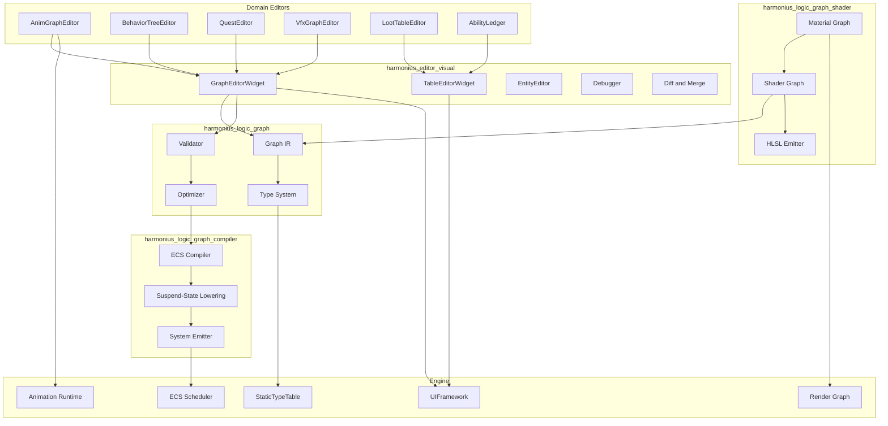
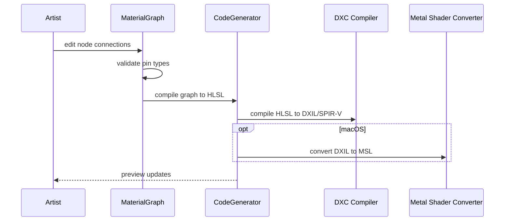

# Visual Editors Design

## Requirements Trace

### Logic Graph Runtime (F-15.8)

| Feature   | Requirement |
|-----------|-------------|
| F-15.8.1  | R-15.8.1    |
| F-15.8.2  | R-15.8.2    |
| F-15.8.3  | R-15.8.3    |
| F-15.8.4  | R-15.8.4    |
| F-15.8.5a | R-15.8.5a   |
| F-15.8.5b | R-15.8.5b   |
| F-15.8.5c | R-15.8.5c   |
| F-15.8.6  | R-15.8.6    |
| F-15.8.7  | R-15.8.7    |
| F-15.8.8  | R-15.8.8    |
| F-15.8.9  | R-15.8.9    |
| F-15.8.10 | R-15.8.10   |
| F-15.8.11 | R-15.8.11   |
| F-15.8.12 | R-15.8.12   |
| F-15.8.13 | R-15.8.13   |
| F-15.8.14 | R-15.8.14   |

1. **F-15.8.1** -- Universal logic graph runtime
2. **F-15.8.2** -- Static type system with bidirectional inference
3. **F-15.8.3** -- Strict validation before save/compile
4. **F-15.8.4** -- Gameplay graphs with yield lowering
5. **F-15.8.5a** -- Shader graph core (vertex, fragment, compute)
6. **F-15.8.5b** -- Shader graph to HLSL via DXC + Metal Shader Converter
7. **F-15.8.5c** -- Material graph variant with PBR and live preview
8. **F-15.8.6** -- Render graph configuration
9. **F-15.8.7** -- Animation logic graphs
10. **F-15.8.8** -- Audio logic graphs
11. **F-15.8.9** -- Custom tool graphs
12. **F-15.8.10** -- Graph node library
13. **F-15.8.11** -- Graph debugging
14. **F-15.8.12** -- Graph compilation (dead node elim, const fold)
15. **F-15.8.13** -- Graph diffing and three-way merge
16. **F-15.8.14** -- Graph search and refactoring

### Material Editor (F-15.3)

| Feature  | Requirement |
|----------|-------------|
| F-15.3.1 | R-15.3.1    |
| F-15.3.2 | R-15.3.2    |
| F-15.3.3 | R-15.3.3    |
| F-15.3.4 | R-15.3.4    |
| F-15.3.5 | R-15.3.5    |
| F-15.3.6 | R-15.3.6    |

1. **F-15.3.1** -- Node-based material graph with type-safe pins
2. **F-15.3.2** -- Material functions and reusable subgraphs
3. **F-15.3.3** -- Live 3D material preview with split-view
4. **F-15.3.4** -- Shader parameter tweaking without recompilation
5. **F-15.3.5** -- Material instances sharing compiled shaders
6. **F-15.3.6** -- Material library with search and thumbnails

### Animation Editor (F-15.4)

| Feature  | Requirement |
|----------|-------------|
| F-15.4.1 | R-15.4.1    |
| F-15.4.2 | R-15.4.2    |
| F-15.4.3 | R-15.4.3    |
| F-15.4.4 | R-15.4.4    |
| F-15.4.5 | R-15.4.5    |
| F-15.4.6 | R-15.4.6    |
| F-15.4.7 | R-15.4.7    |

1. **F-15.4.1** -- Multi-track animation timeline with keyframes
2. **F-15.4.2** -- Curve editor with Bezier/Hermite tangents
3. **F-15.4.3** -- Skeleton viewer with bone selection
4. **F-15.4.4** -- Animation preview with debug overlays
5. **F-15.4.5** -- 1D/2D blend space editor
6. **F-15.4.6** -- State machine editor with transition debugging
7. **F-15.4.7** -- Retargeting setup with side-by-side preview

### Specialized Editors

| Feature   | Requirement |
|-----------|-------------|
| F-15.13.1 | R-15.13.1  |
| F-15.13.2 | R-15.13.2  |
| F-15.14.1 | R-15.14.1  |
| F-15.5.1  | R-15.5.1   |
| F-15.15.1 | R-15.15.1  |
| F-15.15.2 | R-15.15.2  |
| F-15.15.3 | R-15.15.3  |
| F-15.15.4 | R-15.15.4  |
| F-15.1.4  | R-15.1.4   |
| F-15.2.1  | R-15.2.1   |

1. **F-15.13.1** -- Behavior tree editor for AI authoring
2. **F-15.13.2** -- State machine editor for AI
3. **F-15.14.1** -- Quest editor for objectives
4. **F-15.5.1** -- Visual effect graph editor
5. **F-15.15.1** -- Loot table editor with simulation preview
6. **F-15.15.2** -- Ability ledger for combat stats
7. **F-15.15.3** -- Equipment stat tables with comparison
8. **F-15.15.4** -- Price ledger with inflation simulation
9. **F-15.1.4** -- Entity selection and hierarchy
10. **F-15.2.1** -- Entity template overrides display

## Overview

> **Graph runtime clients.** Every visual editor in this document is a CLIENT of
> [../core-runtime/graph-runtime.md](../core-runtime/graph-runtime.md). Each editor domain
> parameterizes the generic runtime (e.g.
> `GraphRuntime<MaterialNode, MaterialEdge, MaterialProgram>` for the material editor); none of them
> redefine graph execution. Hot reload of compiled graphs follows
> [../core-runtime/hot-reload-protocol.md](../core-runtime/hot-reload-protocol.md).

The visual editors provide the sole authoring surface for all engine logic, materials, animations,
and game data. Users never write textual code. Every behavior, shader, state machine, and data table
is authored through typed, visual graph or table editors. Editor code is fully synchronous — no
`async`, no `await`, no `Future`.

### Core Principles

1. **No-code.** The graph editor is the only way to author logic.
2. **Compile, never interpret.** Gameplay graphs compile to native ECS systems at edit time. No
   runtime bytecode.
3. **ECS-primary (~90%).** Compiled graphs become systems querying components. A small fraction of
   runtime logic (shader compilation, asset I/O callbacks) may run outside the ECS schedule.
4. **Static dispatch.** All generic nodes are monomorphized.
5. **Shared frameworks.** `GraphEditorWidget` and `TableEditorWidget` implement layout, zoom,
   selection, and undo once.

### Keyboard-First Interaction Model

The logic graph editor prioritizes keyboard-driven workflows inspired by Game Maker's efficient node
authoring. Mouse interaction remains available but is not the primary input.

1. **Quick-add palette.** A hotkey (e.g. Tab) opens a floating search palette. The user types to
   filter node names, presses Enter to place the selected node at the cursor. If a pin is selected,
   the new node's first compatible pin auto-connects.
2. **Keyboard navigation.** Arrow keys move focus between nodes. Tab cycles through pins on the
   focused node. Enter follows a connection to the linked node.
3. **Sequential action lists.** Nodes can be arranged in a linear top-to-bottom reading order with
   implicit execution flow between consecutive nodes (like Game Maker event lists). This reduces
   wiring overhead for simple sequential logic.
4. **Bulk operations.** Shift+Arrow extends selection. Delete removes selected nodes. Ctrl+D
   duplicates the selection in place with offset.

### Macro Groups (Visual Grouping)

Macro nodes are visual grouping containers, not collapsed single nodes. A macro group draws a
colored boundary box around a set of child nodes.

- **Expanded:** child nodes are visible and editable inside the boundary. The group title and color
  are visible as a header.
- **Collapsed:** child nodes are hidden. The group renders as a single compact box showing only the
  title, input pins, and output pins.

```rust
/// A visual grouping container for logic graph
/// nodes. Surrounds child nodes with a titled,
/// colored boundary box.
pub struct MacroGroup {
    pub group_id: GroupId,
    pub name: String,
    pub color: Color,
    pub contained_nodes: Vec<NodeId>,
    pub collapsed: bool,
    pub position: Vec2,
    pub size: Vec2,
}
```

### Domain Coverage

| Domain | Compiles To | Runtime |
|--------|-------------|---------|
| Gameplay | ECS systems | ECS scheduler |
| Shader | HLSL source | DXC / Metal Shader Converter |
| Material | HLSL (PBR) | DXC / Metal Shader Converter |
| Animation | Controller data | Animation system |
| Audio | Audio graph desc | Audio engine |
| Render pipeline | Frame graph desc | Render graph executor |
| Tool | Command sequences | Editor runtime |

### 2D and 2.5D Support

All visual editors operate in 2D, 2.5D, and 3D modes. No separate editor surfaces for 2D games.

1. **2D animation timeline** — sprite sheet keyframes, flip-book sequences, 2D skeletal animation
   (Spine-style bones). Timeline editor switches to a 2D bone rig view for sprite-based characters.
2. **2D material nodes** — sprite shaders, 2D lighting (point/global), UV scroll, palette swap.
   Material editor preview switches to a 2D sprite quad when the 2D material flag is set.
3. **2D logic graph nodes** — tilemap queries, 2D physics (raycast, overlap), 2D spatial queries,
   `Camera2D` control. These nodes appear in the node palette when the graph targets a 2D scene.
4. **2D blend spaces** — 1D blend for directional sprites (idle/walk/run by speed), 2D blend for
   directional angle (8-direction sprites). Blend space editor shows a 2D grid or 1D ruler.

## Architecture

### Module Boundaries



### Cross-Subsystem Integration

| Subsystem | Direction | Data | Mechanism |
|-----------|-----------|------|-----------|
| Scripting runtime | produces | compiled system fns | Middleman `.dylib` |
| Render graph | produces | shader + pass registration | HLSL + codegen'd node |
| Animation runtime | produces | compiled clips, state machines | rkyv assets |
| Audio engine | produces | audio graph configuration | rkyv assets |
| Asset pipeline | bidirectional | import/export, hot-reload | `AssetDatabase` API |
| ECS scheduler | produces | system registration | Middleman `.dylib` |
| UI framework | consumes | editor widget primitives | Widget tree composition |
| Undo/redo system | bidirectional | edit commands | `EditorCommand` |
| Middleman `.dylib` | produces | codegen'd types + fns | Codegen pipeline |
| Data tables | bidirectional | table schema + row data | rkyv assets |
| Localization | bidirectional | string tables | `LocalizationManager` |
| Timelines | produces | keyframe data | rkyv assets |

### Runtime Design Cross-References

Each visual editor has a corresponding runtime design document:

| Editor | Runtime design |
|--------|----------------|
| Logic graph | `scripting.md` |
| Material | `rendering/render-styles.md` |
| Animation timeline | `timelines.md` |
| Animation state machine | `animation/state-machine.md` |
| VFX graph | `vfx/effects.md`, `vfx/particles.md` |
| Audio graph | `audio/spatial-audio.md` |
| Data tables | `data-systems/data-tables.md` |
| Localization | `ui/ui-framework.md` (localization section) |
| UI layout | `ui/ui-framework.md` |

### Compilation Pipeline

```mermaid
flowchart LR
    A[.logicgraph] --> B[Parse]
    B --> C[Type Check]
    C --> D[Validate]
    D --> E[Dead Node Elim]
    E --> F[Const Fold]
    F --> G[Subgraph Inline]
    G --> H[Monomorphize]
    H --> I[Suspend Lower]
    I --> J[Emit Rust Source .rs]
    J --> K[Compile via bundled rustc]
    K --> L[Link into middleman .dylib]
    L --> M[Hot-reload .dylib]
```



### Codegen Pipeline and Middleman .dylib

All compiled graph output flows through the codegen pipeline into the middleman .dylib:

1. **Visual graph → Rust source** — `EcsCompiler` emits `.rs` files (systems, suspend-state
   machines, query closures). Bundled `rustc` compiles them. Output is linked into the middleman
   `.dylib`.
2. **Material graph → HLSL source** — `HlslEmitter` emits `.hlsl` source. `dxc` CLI produces
   DXIL/SPIR-V. On Apple, `metal-shaderconverter` CLI produces MSL.
3. **Custom enum variants → codegen'd in middleman** — extensible enums (`GraphDomain`, `NodeKind`,
   `PinType`, `ColumnType`) have plugin-contributed variants generated into the middleman.
   Engine-fixed enums (`TickPhase`, `SystemTrigger`, `TangentMode`, `Severity`) live in the engine
   binary.
4. **Open question resolution** — compiled gameplay graphs produce Rust code in the middleman
   `.dylib`. No relocatable object files or bytecode VMs.

| Stage | Input | Output | Toolchain |
|-------|-------|--------|-----------|
| Graph compile | `.logicgraph` | `.rs` source | `EcsCompiler` |
| Rust compile | `.rs` source | `.dylib` | bundled `rustc` |
| Hot-reload | `.dylib` | live systems | `libloading` |
| Shader compile | `.hlsl` | DXIL/SPIR-V/MSL | `dxc`, `metal-shaderconverter` CLI |

### Enum Codegen Classification

Enums are classified by extensibility to determine where they are generated:

| Enum | Extensible? | Location |
|------|-------------|----------|
| `GraphDomain` | Yes (plugins add domains) | Middleman `.dylib` |
| `NodeKind` | Yes (plugins add nodes) | Middleman `.dylib` |
| `PinType` | Yes (user types) | Middleman `.dylib` |
| `ColumnType` | Yes (user types) | Middleman `.dylib` |
| `TickPhase` | No (engine-fixed) | Engine binary |
| `SystemTrigger` | No (engine-fixed) | Engine binary |
| `TangentMode` | No (engine-fixed) | Engine binary |
| `Severity` | No (engine-fixed) | Engine binary |

### Compilation Memory Management

The compilation pipeline (parse, type-check, optimize, emit) allocates heavily and transiently. To
avoid global allocator contention:

- IR nodes, type inference scratch space, and optimization working sets are allocated from
  per-thread arenas.
- Each arena is reset after its compilation pass completes.
- Only the final output (`CompiledGraph`, `.rs` source) is heap-allocated for persistence.

### Material Compilation



### Core Data Structures

```mermaid
classDiagram
    class GraphId {
        +Uuid value
    }
    class NodeId {
        +u32 value
    }
    class PinId {
        +u32 value
    }
    class GraphDomain {
        <<enum>>
        Gameplay
        Shader
        Material
        Animation
        Audio
        RenderPipeline
        Tool
    }
    class TickPhase {
        <<enum>>
        PreUpdate
        Update
        PostUpdate
        FixedUpdate
    }
    class PinDirection {
        <<enum>>
        Input
        Output
    }
    class VariableScope {
        <<enum>>
        Local
        Graph
        Entity
    }
    class YieldKind {
        <<enum>>
        NextFrame
        Delay
        UntilCondition
    }
    class ComponentAccessKind {
        <<enum>>
        Get
        Set
        Add
        Remove
        Has
    }
    class ShaderStage {
        <<enum>>
        Vertex
        Fragment
        Compute
    }
    class Severity {
        <<enum>>
        Error
        Warning
    }
    class DebugState {
        <<enum>>
        Running
        Paused
        Stepping
        Detached
    }
    class LogicGraph {
        +GraphId graph_id
        +GraphDomain domain
        +String name
        +Vec~Node~ nodes
        +Vec~Edge~ edges
        +Vec~Variable~ variables
    }
    class Node {
        +NodeId node_id
        +NodeKind kind
        +Vec~Pin~ pins
        +Vec2 position
    }
    class NodeKind {
        <<enum>>
        Event
        Tick
        FlowControl
        Pure
        EcsQuery
        ComponentAccess
        ResourceAccess
        EventSend
        SubgraphCall
        Yield
        VariableAccess
        DomainSpecific
    }
    class Pin {
        +PinId pin_id
        +PinDirection direction
        +PinType pin_type
        +String name
    }
    class PinType {
        <<enum>>
        Execution
        Data
        Generic
        Wildcard
    }
    class Edge {
        +NodeId source_node
        +PinId source_pin
        +NodeId target_node
        +PinId target_pin
    }
    class Variable {
        +VariableId var_id
        +String name
        +TypeId type_id
        +VariableScope scope
    }
    class SubgraphDef {
        +GraphId graph_id
        +String name
        +Vec~SubgraphPort~ inputs
        +Vec~SubgraphPort~ outputs
        +LogicGraph body
    }
    class TypeInferenceEngine {
        -HashMap bindings
        +infer(graph, registry) Result
        +update_edge(graph, edge, added) Result
    }
    class GraphValidator {
        +validate(graph, registry) ValidationResult
    }
    class NodeRegistry {
        -Vec~NodeCategory~ categories
        +search(query) Vec~NodeDefinition~
        +generate_from_type_registry(registry)
    }
    class EcsCompiler {
        +compile(graph, registry) Result~CompiledGraph~
    }
    class CompiledGraph {
        +GraphId graph_id
        +Vec~CompiledSystem~ systems
        +DebugInfo debug_info
    }
    class SystemTrigger {
        <<enum>>
        Tick
        Event
        OnAdd
        OnRemove
        OnChange
    }
    class GraphDebugger {
        -HashMap breakpoints
        -DebugState state
        +set_breakpoint(node_id, condition)
        +step()
        +read_pin_value(node, pin) Option
    }
    class GraphDiffer {
        +diff(base, head) GraphDiff
        +merge_three_way(base, ours, theirs) MergeResult
    }
    class HlslEmitter {
        +emit(graph, stage, registry) Result~HlslOutput~
    }
    class MaterialGraph {
        +AssetId id
        +Vec~MaterialNode~ nodes
        +Vec~MaterialEdge~ edges
        +compile() Result~HlslSource~
        +validate() Vec~ValidationError~
    }
    class MaterialInstance {
        +AssetId id
        +AssetId parent_material
        +HashMap~String, ParamValue~ overrides
    }
    class AnimClip {
        +AssetId id
        +f32 duration
        +Vec~AnimTrack~ tracks
    }
    class AnimTrack {
        +BoneId bone
        +AnimChannel channel
        +Vec~Keyframe~ keyframes
    }
    class Keyframe {
        +f32 time
        +f32 value
        +TangentMode tangent_mode
    }
    class TangentMode {
        <<enum>>
        Bezier
        Hermite
        Linear
        Stepped
        Auto
    }
    class AnimStateMachine {
        +AssetId id
        +Vec~AnimState~ states
        +Vec~AnimTransition~ transitions
    }
    class BlendSpace {
        +AssetId id
        +BlendSpaceDimension dimension
        +Vec~BlendSample~ samples
    }
    class GraphEditorWidget {
        +GraphId graph_id
        +Vec~GraphNodeWidget~ nodes
        +Vec~GraphEdgeWidget~ edges
        +f32 zoom_level
        +add_node(kind, position) NodeId
        +connect(src, dst) Result
        +validate() Vec~ValidationError~
        +copy_selection() ClipboardData
    }
    class TableEditorWidget {
        +TableId table_id
        +Vec~ColumnDef~ columns
        +Vec~RowData~ rows
        +add_row() RowId
        +set_cell(row, col, value) Result
        +sort_by(column, direction)
        +filter_by(predicate)
    }
    class ColumnType {
        <<enum>>
        String
        Integer
        Float
        Bool
        Enum(Vec~String~)
        AssetRef
    }
    class EntityEditor {
        +Entity entity
        +Vec~ComponentPanel~ component_panels
        +HierarchyTree hierarchy
        +TemplateOverrideDisplay overrides
    }

    class MacroGroup {
        +GroupId group_id
        +String name
        +Color color
        +Vec~NodeId~ contained_nodes
        +bool collapsed
        +Vec2 position
        +Vec2 size
    }

    LogicGraph *-- Node
    LogicGraph *-- Edge
    LogicGraph *-- Variable
    LogicGraph --> GraphDomain
    Node *-- Pin
    Node --> NodeKind
    Pin --> PinDirection
    Pin --> PinType
    Variable --> VariableScope
    EcsCompiler --> CompiledGraph
    CompiledGraph --> SystemTrigger
    GraphDebugger --> DebugState
    HlslEmitter --> ShaderStage
    SubgraphDef --> LogicGraph
    GraphValidator --> Severity
    MaterialGraph *-- MaterialNode
    MaterialInstance --> MaterialGraph : parent
    AnimClip *-- AnimTrack
    AnimTrack *-- Keyframe
    Keyframe --> TangentMode
    AnimStateMachine *-- AnimState
    GraphEditorWidget --> GraphId
    TableEditorWidget --> ColumnType
    EntityEditor --> TemplateOverrideDisplay
    LogicGraph *-- MacroGroup
    MacroGroup --> NodeId
```



## Logic Graph Editor

The logic graph editor is the primary authoring tool for all gameplay behavior, AI, and game
systems. It compiles directly to native ECS systems via the codegen pipeline.

### Node library

Nodes are organized into a categorized catalog. All built-in nodes appear grouped by subsystem.
Plugin nodes appear in a separate "Plugins" category.

| Category | Examples |
|----------|---------|
| Math | Add, Subtract, Multiply, Lerp, Clamp, Min, Max, Sin, Cos |
| ECS | Query, Get Component, Set Component, Add Component, Remove Component |
| Events | On Event, Send Event, Broadcast Event |
| Flow control | If, For Each, While, Sequence, Select, Switch |
| Data tables | Read Row, Write Row, Find Rows, Table Count |
| Physics | Raycast, Overlap Sphere, Apply Force, Set Velocity |
| Audio | Play Sound, Stop Sound, Set Volume, Set Pitch |
| UI | Show Widget, Hide Widget, Set Text, Set Image |
| AI | Blackboard Read, Blackboard Write, Move To, Look At |
| Networking | Replicate Component, Is Server, Is Client, Send RPC |

### Variable system

| Scope | Lifetime | Accessible From |
|-------|----------|----------------|
| Local | This graph execution | Nodes within this graph only |
| Graph | All instances of this graph | Any node in any instance |
| Entity | The entity's component lifetime | Any graph on the same entity |
| Blackboard | AI agent lifetime | AI graphs sharing this blackboard |

### Quick-add palette

`Ctrl+Space` or right-click on the canvas opens a floating search palette. Fuzzy matching on node
name and category. Most recently used nodes appear at the top. If a pin is selected, the palette
auto-filters to compatible nodes and auto-connects on placement.

### Incremental compilation

On each edit (node add, edge connect, value change), the compiler incrementally updates only the
affected subgraph. Full recompilation occurs only when structural changes affect the entry point.
Compilation runs on a worker thread; the editor remains responsive during compilation.

### Error reporting UX

- Type errors show red squiggly edges.
- Missing required connections show yellow warning icons on pins.
- Compilation errors appear in a panel below the canvas with click-to-navigate.
- Suggested fixes offered inline: auto-insert cast node, connect default value, add missing
  component access.

### Debugging workflow

1. Set breakpoints by clicking the gutter dot on any node.
2. Press Play in the editor — execution pauses at the breakpoint.
3. Inspect variable values in the Watch panel.
4. Step forward (next node), step over (skip subgraph), or continue.
5. Call stack shows the full graph execution path including subgraph calls.

### Undo/redo

Every graph edit produces an `EditorCommand`. Undo restores the previous graph state. The full undo
tree from `editor-core.md` applies to graph editing. Multi-step operations (e.g., "Extract to
Subgraph") produce a single compound `EditorCommand`.

### Copy/paste

Select nodes and edges, `Ctrl+C` to copy, `Ctrl+V` to paste into the same or a different graph.
Pasted nodes receive new IDs. Dangling connections (to nodes not in the paste set) are highlighted
and can be reconnected manually.

### Subgraph encapsulation

Select a set of nodes and choose "Extract to Subgraph." The editor creates a new `.logicgraph` asset
containing the selected nodes, replaces the selection with a single `SubgraphCall` node, and
auto-creates input/output pins from the boundary edges.

### Minimap

A small overview of the entire graph canvas is rendered in the bottom-right corner. Click or drag
within the minimap to navigate. The current viewport region is shown as a highlighted rectangle.

## Shared Graph Editor Framework

Most visual editors are graph-based. A shared `GraphEditorFramework` is factored out so all graph
editors build on a common foundation. It reuses directed graph primitives
(`data-systems/directed-graphs.md`) and adds visual editing capabilities.

### Core graph canvas widget

A pannable, zoomable infinite canvas rendered via the UI framework. Nodes are widget subtrees
positioned on the canvas. Edges are Bezier curves between pin positions. Minimap in corner. Grid
background with configurable snap.

### Node widget structure

Each node widget has:

1. Title bar — node name, icon, collapse toggle
2. Input pins — left side, typed, named, colored by type
3. Output pins — right side, typed, named, colored by type
4. Inline data inputs — property fields in the node body (sliders, text inputs, dropdowns, color
   pickers, asset pickers)
5. Preview thumbnail — optional per domain (material sphere, waveform, etc.)
6. Status indicators — error badge, breakpoint dot, execution highlight

### Edge interaction

1. Drag from output pin to input pin to create an edge.
2. Drag from input pin to disconnect and reconnect.
3. Right-click edge to delete or insert a node mid-edge.
4. Edge color matches the pin type color.
5. Animated flow indicator on edges during execution (debug mode).
6. Multi-edge selection and deletion.

### Pin type compatibility checking

The framework queries type compatibility when the user drags an edge. Incompatible pins dim and show
a prohibition indicator. Compatible pins highlight. The type system uses the codegen'd
`StaticTypeTable` from the middleman `.dylib` — no runtime `TypeRegistry`.

### Quick-add palette

Right-click canvas or `Ctrl+Space` opens a floating palette. Fuzzy search over node names and
categories. Auto-filters to nodes compatible with the dragged pin. Most recently used nodes at top.

### Selection model

- Click — select single node.
- `Shift+Click` — multi-select.
- Marquee drag — box-select.
- `Ctrl+A` — select all.
- Selected nodes show handles and can be dragged together.

### Drag and drop

1. Drag assets from the asset browser onto the canvas to create reference nodes.
2. Drag nodes between graphs (copy semantics).
3. Drag to reposition nodes freely on the canvas.

### Copy/paste

`Ctrl+C`/`Ctrl+V` copies selected nodes and edges. Paste creates duplicates with new IDs. Dangling
edges highlighted.

### Grouping

Select nodes, "Group" creates a visual container (macro node / comment box). Groups collapse to a
single node with exposed pins. Groups promote to subgraph assets for reuse.

### Undo/redo

Every operation produces an `EditorCommand`. Full undo tree support per `editor-core.md` RF-37.

### Algorithms integration

The framework uses directed graph primitives for:

- Topological sort — execution order preview
  ([Kahn's algorithm](https://en.wikipedia.org/wiki/Topological_sorting#Kahn's_algorithm))
- Cycle detection — error on cyclic data flow
- Reachability — dead node highlighting
- Dead pass elimination — grayed-out unused nodes

Cross-reference: `data-systems/directed-graphs.md`.

### Domain customization

Each graph editor domain provides:

- Node palette (which nodes are available)
- Pin types and colors
- Validation rules (domain-specific constraints)
- Compilation backend (Rust, HLSL, or both)
- Preview mode (inline preview per domain)
- Custom node widgets (domain-specific inline UI)

### Graph editors using this framework

| Editor | Domain | Compilation target |
|--------|--------|--------------------|
| Logic graph | Gameplay, AI, formulas | Rust → middleman `.dylib` |
| Material graph | Shading | HLSL → DXC + MSC |
| VFX graph | Particle compute | HLSL → compute shaders |
| Animation state machine | State transitions | Rust → middleman `.dylib` |
| Animation blend tree | Blend weights | Rust → middleman `.dylib` |
| Audio graph | Audio routing | Rust → middleman `.dylib` |
| Quest graph | Quest flow | Rust → middleman `.dylib` |
| Dialogue graph | Conversation flow | Rust → middleman `.dylib` |
| Story progress graph | Narrative branching | Rust → middleman `.dylib` |
| Character progression | Talent/skill trees | Rust → middleman `.dylib` |
| Technology tree | Research/unlock | Rust → middleman `.dylib` |
| Render graph (advanced) | Pass composition | Rust + HLSL |
| Custom user graphs | User-defined domains | Rust → middleman `.dylib` |

## API Design

### Graph IR

```rust
#[derive(Clone, Copy, Debug, PartialEq, Eq, Hash)]
pub struct GraphId(pub Uuid);

#[derive(Clone, Copy, Debug, PartialEq, Eq, Hash)]
pub struct NodeId(pub(crate) u32);

#[derive(Clone, Copy, Debug, PartialEq, Eq, Hash)]
pub enum GraphDomain {
    Gameplay,
    Shader,
    Material,
    Animation,
    Audio,
    RenderPipeline,
    Tool,
}

#[derive(Debug)]
pub struct LogicGraph {
    pub graph_id: GraphId,
    pub domain: GraphDomain,
    pub name: String,
    pub nodes: Vec<Node>,
    pub edges: Vec<Edge>,
    pub variables: Vec<Variable>,
    pub subgraph_refs: Vec<SubgraphRef>,
}

#[derive(Debug)]
pub struct Node {
    pub node_id: NodeId,
    pub kind: NodeKind,
    pub pins: SmallVec<[Pin; 8]>,
    pub position: Vec2,
}

#[derive(Debug)]
pub enum NodeKind {
    Event(EventNodeData),
    Tick(TickNodeData),
    FlowControl(FlowControlKind),
    Pure(PureNodeData),
    EcsQuery(QueryNodeData),
    ComponentAccess(ComponentAccessData),
    ResourceAccess(ResourceAccessData),
    EventSend(EventSendData),
    SubgraphCall(GraphId),
    Yield(YieldData),
    VariableAccess(VariableAccessData),
    DomainSpecific(DomainNodeData),
}

#[derive(Debug, Clone, PartialEq, Eq)]
pub enum PinType {
    Execution,
    Data(TypeId),
    Generic(GenericParamId),
    Wildcard,
}
```

### Type Inference and Validation

```rust
// bindings: editor-only cold path — HashMap acceptable here (not on hot sim path)
pub struct TypeInferenceEngine {
    bindings: HashMap<GenericParamId, TypeId>,
}

impl TypeInferenceEngine {
    pub fn infer(
        &mut self,
        graph: &LogicGraph,
        type_table: &'static StaticTypeTable,
    ) -> Result<InferenceResult, Vec<TypeDiagnostic>>;

    pub fn update_edge(
        &mut self,
        graph: &LogicGraph,
        edge: &Edge,
        added: bool,
        type_table: &'static StaticTypeTable,
    ) -> Result<InferenceResult, Vec<TypeDiagnostic>>;
}

pub struct GraphValidator;

impl GraphValidator {
    pub fn validate(
        graph: &LogicGraph,
        type_table: &'static StaticTypeTable,
        node_registry: &NodeRegistry,
    ) -> ValidationResult;
}
```

### ECS Compiler

```rust
pub struct EcsCompiler;

impl EcsCompiler {
    pub fn compile(
        graph: &LogicGraph,
        type_table: &'static StaticTypeTable,
        node_registry: &NodeRegistry,
    ) -> Result<CompiledGraph, CompileError>;
}

pub struct CompiledGraph {
    pub graph_id: GraphId,
    pub systems: Vec<CompiledSystem>,
    pub suspend_states: Vec<SuspendStateDesc>,
    pub debug_info: DebugInfo,
}

#[derive(Debug, Clone)]
pub enum SystemTrigger {
    Tick(TickPhase),
    Event(TypeId),
    OnAdd(TypeId),
    OnRemove(TypeId),
    OnChange(TypeId),
}
```

### Algorithm References

Non-trivial algorithms used in the compiler and editor, with authoritative sources:

| Algorithm | Used In | Reference |
|-----------|---------|-----------|
| Hindley-Milner type inference | `TypeInferenceEngine` | <https://en.wikipedia.org/wiki/Hindley%E2%80%93Milner_type_system> |
| SSA dead code elimination | Dead Node Elim pass | <https://en.wikipedia.org/wiki/Dead_code_elimination> |
| Constant folding | Const Fold pass | <https://en.wikipedia.org/wiki/Constant_folding> |
| De Casteljau Bezier evaluation | Curve editor tangents | <https://en.wikipedia.org/wiki/De_Casteljau%27s_algorithm> |
| Three-way merge (Khanna et al.) | `GraphDiffer::merge_three_way` | <https://dl.acm.org/doi/10.1145/359863.359871> |
| Kahn's topological sort | Graph compilation order | <https://en.wikipedia.org/wiki/Topological_sorting#Kahn's_algorithm> |

### Material Graph

`MaterialGraph::compile()` produces `HlslSource`. The HLSL is compiled via `dxc` CLI (DXIL for
Direct3D 12, SPIR-V for Vulkan) and `metal-shaderconverter` CLI (MSL for Metal). See the HLSL coding
standard skill for HLSL style rules and the `hlsl` skill for DXC invocation conventions.

```rust
pub struct MaterialGraph {
    pub id: AssetId,
    pub nodes: Vec<MaterialNode>,
    pub edges: Vec<MaterialEdge>,
}

impl MaterialGraph {
    pub fn add_node(
        &mut self,
        node_type: MaterialNodeType,
        position: Vec2,
    ) -> NodeId;
    pub fn connect(
        &mut self,
        from_node: NodeId,
        from_pin: PinId,
        to_node: NodeId,
        to_pin: PinId,
    ) -> Result<(), PinTypeError>;
    pub fn compile(
        &self,
    ) -> Result<HlslSource, CompileError>;
}

pub struct MaterialInstance {
    pub id: AssetId,
    pub parent_material: AssetId,
    // Sorted Vec for O(log n) lookup; avoids HashMap non-determinism on preview hot path
    overrides: Vec<(String, ParamValue)>,
}

impl MaterialInstance {
    pub fn set_override(
        &mut self,
        name: String,
        value: ParamValue,
    );
    pub fn effective_value(
        &self,
        name: &str,
        parent: &MaterialGraph,
    ) -> Option<ParamValue>;
}
```

### Animation Timeline and State Machine

```rust
pub struct AnimClip {
    pub id: AssetId,
    pub duration: f32,
    pub sample_rate: f32,
    pub tracks: SmallVec<[AnimTrack; 8]>,
}

pub struct AnimTimeline { /* ... */ }

impl AnimTimeline {
    pub fn load_clip(&mut self, clip: &AnimClip);
    pub fn set_time(&mut self, time: f32);
    pub fn play(&mut self);
    pub fn pause(&mut self);
    pub fn add_keyframe(
        &mut self,
        track: usize,
        value: f32,
    );
}

pub struct AnimStateMachine {
    pub id: AssetId,
    pub states: Vec<AnimState>,
    pub transitions: SmallVec<[AnimTransition; 4]>,
    pub default_state: StateId,
}
```

### Graph and Table Editor Widgets

`GraphEditorWidget`, `TableEditorWidget`, and all editor panels are composed entirely from the
engine's UI widget primitives (`ui-framework.md`). No custom rendering code in editor panels — all
layout, hit-testing, scrolling, and painting go through the UI framework widget tree.

```rust
/// Shared framework for all graph-based editors.
/// Composed from UI framework widget primitives (ui-framework.md).
pub struct GraphEditorWidget {
    pub graph_id: GraphId,
    nodes: Vec<GraphNodeWidget>,
    edges: Vec<GraphEdgeWidget>,
    pan_offset: Vec2,
    zoom_level: f32,
}

impl GraphEditorWidget {
    pub fn add_node(
        &mut self,
        kind: NodeKind,
        position: Vec2,
    ) -> NodeId;
    pub fn connect(
        &mut self,
        src_pin: PinId,
        dst_pin: PinId,
    ) -> Result<(), ConnectionError>;
    pub fn validate(
        &self,
    ) -> Vec<ValidationError>;
    pub fn copy_selection(
        &self,
    ) -> ClipboardData;
}

/// Shared framework for all table-based editors.
pub struct TableEditorWidget {
    pub table_id: TableId,
    columns: Vec<ColumnDef>,
    rows: Vec<RowData>,
}

impl TableEditorWidget {
    pub fn add_row(&mut self) -> RowId;
    pub fn set_cell(
        &mut self,
        row: RowId,
        col: usize,
        value: CellValue,
    ) -> Result<(), ValidationError>;
    pub fn sort_by(
        &mut self,
        column: usize,
        direction: SortDirection,
    );
}
```

## Additional Editors

### Terrain editor

Heightmap painting (raise, lower, smooth, flatten, noise), splatmap painting (texture layers), and
foliage scattering. Uses the grids/volumes system for heightmap data. Detailed design is in
`geometry/terrain.md`.

### Audio mixer and editor

Audio bus routing, effect chain editing (EQ, reverb, compression), and spatial audio source
configuration. Cross-reference: `audio/spatial-audio.md`.

### Data table editor

Structured data tables with typed columns, row inheritance (RF-22 in `data-systems/data-tables.md` —
prototype chain per row), and simulation preview for loot tables and ability stats. Cross-
reference: `data-systems/data-tables.md`.

### Localization editor

String table management: add/edit/delete keys, per-locale string entry, import/export CSV, plural
rules, and completion status per locale. Cross-reference: `ui/ui-framework.md` (localization
section, F-15.13.1–3).

### UI layout editor

WYSIWYG widget placement on a 2D canvas. Drag widgets from a palette, set properties in the
inspector, preview at multiple screen resolutions. Widgets are ECS entities (`ui/ui-framework.md`).

## Data Flow

### Gameplay graph execution

1. `EcsCompiler` transforms validated graph into `CompiledGraph`.
2. Tick-driven systems register with the ECS scheduler.
3. Event-driven systems subscribe to typed event channels.
4. Multi-frame yield lowering produces state machine components. The engine has no coroutine
   runtime; yields lower to plain synchronous match dispatch.

### Editor operations and game loop phases

Validation and incremental compilation run on worker threads triggered by editor edits. Compiled
results are committed at well-defined frame boundaries:

| Operation | Thread | Frame phase |
|-----------|--------|-------------|
| Validation (type check, lint) | Worker | Triggered by edit; job dispatch |
| Incremental graph compile | Worker | Triggered by edit; job dispatch |
| Commit compiled systems | Main | `PreUpdate` of next frame |
| Shader compile (DXC/MSC) | Worker | Triggered by save; job dispatch |
| Material preview update | Render | Sync with render extraction |
| `.dylib` hot-reload | Main | `PreUpdate` of next frame |

### Pin type compatibility

| Source | Target | Valid? |
|--------|--------|--------|
| Execution | Execution | Yes |
| Data(T) | Data(T) | Yes |
| Data(T) | Data(U) | No (needs conversion) |
| Data(T) | Generic(G) | Yes (binds G := T) |
| Wildcard | Data(T) | Yes (resolves to T) |
| Execution | Data(T) | No |

### Asset serialization

All visual editor assets use rkyv for binary storage and the engine's custom text format for
git-friendly source control. No serde, no RON.

| Asset file | Binary format | Text format |
|------------|---------------|-------------|
| `.logicgraph` | rkyv | Custom text (BSN-style) |
| `.material` | rkyv | Custom text |
| `.animclip` | rkyv | Custom text |
| `.statemachine` | rkyv | Custom text |
| `.blendspace` | rkyv | Custom text |

## Viewport

The viewport is the primary scene interaction surface.

### Transform manipulation

1. **Move** — translate on plane or axis. Gizmo with X/Y/Z axis handles, XY/XZ/YZ plane handles, and
   free-move center handle. Mouse drag or numeric input.
2. **Rotate** — rotate around X/Y/Z axes. Three rings plus free-rotation trackball. Angle snapping
   (15° default, configurable).
3. **Scale** — uniform or per-axis. Axis handles plus uniform center handle. Scale snapping.
4. **Keyboard transform** — type exact values: press G (grab/move), then "X 10 Enter" to move 10
   units on X. R (rotate) and S (scale) follow the same Blender-style pattern.
5. **Space modes** — World, Local, Parent, Custom pivot. Toggle with toolbar or hotkey.
6. **Multi-selection transform** — transform multiple entities simultaneously. Pivot: median point,
   active entity, world origin, or cursor position.

### Snapping

7. **Grid snap** — snap to configurable increments (0.25, 0.5, 1.0, custom). Grid adapts to zoom.
8. **Surface snap** — snap entity to the surface below (raycast down, optional normal alignment).
9. **Vertex snap** — snap entity pivot to nearest mesh vertex. Hold V and hover to preview targets.
10. **Edge snap** — snap to nearest edge midpoint or endpoint.
11. **Increment snap** — move in fixed increments relative to current position. Hold Ctrl.

### Alignment and distribution

12. **Align** — align selected entities by min/max/center on any axis. Reference: last selected
    entity or selection bounding box.
13. **Distribute** — evenly space selected entities along an axis (equal center or edge spacing).
14. **Match transform** — copy position/rotation/scale from one entity to another.

### Grid and reference

15. **Infinite 3D grid** — ground plane grid to horizon. Lines fade with distance. Major/minor grid
    lines with configurable spacing. Grid plane selectable: XZ (default), XY, YZ.
16. **Ruler/measurement** — click two points to show distance. Units configurable (meters, cm, game
    units).
17. **Axis indicator** — colored XYZ gizmo in viewport corner showing current camera orientation.

### Terrain and modeling

18. **Terrain painting** — paint heightmap (raise, lower, smooth, flatten, noise), splatmap (texture
    layers), foliage (scatter instances). Brush size, strength, falloff configurable.
19. **CSG modeling** — union, intersection, subtraction on primitives (box, sphere, cylinder,
    plane). Rapid prototyping / blockout. CSG meshes convert to static meshes for shipping.
20. **Vertex editing** — select and move vertices, edges, faces. Basic ops: extrude, inset, loop
    cut, bevel.

### MCP integration

21. **Screenshot for AI** — the MCP server (`editor-core.md` RF-33) captures viewport screenshots
    for AI analysis. AI can request specific camera angles, entity highlighting, or overlay modes.
22. **AI-driven placement** — MCP issues transform commands. Combined with screenshots, enables
    conversational level design ("move the tree 5 meters left" → translate → screenshot → verify).

### 2D viewport mode

23. **2D canvas** — orthographic top-down view for 2D scenes. Infinite grid becomes a 2D pixel grid.
    Transform gizmos operate in 2D (XY only). Z-order manipulation replaces Z movement.
24. **Tilemap painting** — paint tiles from a palette. Auto-tiling rules (Wang tiles, bitmasking)
    apply automatically. Eraser, fill, rectangle select tools.
25. **Sprite placement** — drag sprites from the asset browser onto the 2D canvas. Snap to pixel
    grid if pixel-perfect mode is enabled.

### Animation in viewport

26. **Animation preview** — play animations directly in viewport. Scrub timeline and see
    skeletal/property animations in real time. Playback controls in the viewport toolbar.
27. **Bone manipulation** — select and move individual bones to pose a character. Set keyframes at
    current pose. IK handles visible and draggable.
28. **Animation recording** — enter record mode; move entities or bones; each movement auto-creates
    a keyframe at the current timeline position.
29. **Blend space preview** — visualize blend space parameters as a 2D grid overlay. Move the blend
    point and see blended animation in real time.
30. **Root motion preview** — toggle root motion on/off. Root motion path drawn as a line in the
    viewport.

### Prefab editing and instancing

31. **Prefab definition** — select entities, "Create Prefab." Saves hierarchy + components as a
    prefab asset. Original entities become instances.
32. **Prefab instancing** — drag a prefab asset from the content browser onto the viewport to place
    an instance.
33. **Instance overrides** — modify any property on an instance without affecting the prefab asset.
    Overridden properties shown in bold in the inspector. "Revert to Prefab" or "Apply to Prefab."
34. **Nested prefabs** — a prefab can contain instances of other prefabs. Changes propagate.
    Overrides at each nesting level are independent.
35. **Prefab variants** — inherit all properties and override specific ones (prototype chain, like
    `data-tables.md` RF-22 row inheritance). Example: "EnemySoldierElite" variant of "EnemySoldier."
36. **Batch instancing** — scatter tool: paint prefab instances onto a surface with randomized
    position, rotation, scale. Transforms stored in a compact buffer for GPU instancing.
37. **Instance editing modes:**
    - **Open prefab** — double-click instance to enter prefab edit mode (affects asset + all
      instances).
    - **Edit in context** — edit while seeing the surrounding scene (grayed out).
    - **Instance only** — edit only this instance's overrides; does not affect the asset.
38. **Prefab serialization** — prefab assets use rkyv. Instance overrides stored as sparse delta
    (only changed properties) via the save system's component delta mechanism.

## Content Browser

The content browser is the central asset management panel. It integrates with every asset type and
opens the correct editor on double-click.

### Navigation and display

1. **Folder tree** — left panel shows the project directory tree. Folders are creatable, renamable,
   movable, and deletable with undo support.
2. **Asset grid** — right panel shows assets as thumbnails (icons for non-visual types). Toggle
   grid/list view. Configurable thumbnail size slider.
3. **Breadcrumb bar** — current path as clickable breadcrumbs. Click parent to navigate up.
4. **Search** — full-text search across asset names, types, tags, and metadata. Filters: type, tag,
   date modified, size. Results span all folders.
5. **Favorites** — star assets or folders for quick access. Favorites panel at the top of the folder
   tree.
6. **Recent** — recently opened/modified assets list.
7. **Collections** — virtual folders referencing assets from any location (like smart playlists).
   Organize assets by game feature, not directory structure.

### Asset type integration

Every asset type has a thumbnail generator, a preview mode, a double-click action (open in editor),
and a context menu.

| Asset type | Thumbnail | Preview | Opens in |
|------------|-----------|---------|----------|
| Scene | Viewport capture | 3D preview | Scene viewport |
| Prefab | Rendered preview | 3D preview | Prefab edit mode |
| Mesh | Rendered wireframe | 3D orbit preview | Mesh viewer |
| Texture | Image thumbnail | Full image + channels | Texture inspector |
| Material | Sphere preview | Sphere + param sliders | Material editor |
| Logic graph | Node layout mini | — | Logic graph editor |
| Animation clip | Skeleton pose | Playback on skeleton | Animation editor |
| State machine | State diagram mini | — | State machine editor |
| Blend space | Grid visualization | — | Blend space editor |
| VFX effect | Particle thumbnail | Particle preview | VFX editor |
| Audio clip | Waveform | Audio playback | Audio preview |
| Music cue | Stem layout | Playback | Music editor |
| Font | Sample text render | Sample text | Font inspector |
| Data table | Column headers | Table view | Data table editor |
| Tilemap | Rendered chunk | 2D preview | Tilemap editor |
| Timeline | Track layout mini | — | Timeline editor |
| Shader | Code icon | — | Shader source viewer |
| Localization | String count badge | — | Localization editor |
| UI layout | Widget tree mini | UI preview | UI editor |
| Terrain | Heightmap preview | 3D preview | Terrain editor |
| Quest graph | Graph layout mini | — | Quest graph editor |
| Dialogue tree | Tree layout mini | — | Dialogue editor |
| Spline asset | Curve preview | 3D preview | Spline editor |
| Script (codegen) | Code icon | — | Logic graph editor |
| Folder | Folder icon | — | Navigate into |

### Asset operations

8. **Create** — right-click → New → asset type submenu. Template assets pinnable to create menu.
9. **Rename** — F2 or slow double-click. Validates naming conventions. Updates all asset handle
   references automatically.
10. **Move** — drag between folders. Drag to/from OS file explorer. Updates all references.
11. **Duplicate** — `Ctrl+D` creates a copy with `_copy` suffix. Deep or shallow duplicate
    configurable.
12. **Delete** — Delete key with confirmation showing reference count. "Show References" lists all
    dependents. Deletion is undoable (trash folder; not permanent until emptied).
13. **Reimport** — right-click → Reimport. Re-runs the import pipeline with current import settings.
14. **Import settings** — right-click → Import Settings. Shows texture compression, mesh LOD, audio
    format, etc. Editable and re-importable.

### Drag and drop integration

15. **To viewport** — drag mesh/prefab/sprite onto 3D/2D viewport to place in scene. Preview ghost
    follows cursor.
16. **To inspector** — drag asset onto an asset property field to assign.
17. **To graph editor** — drag asset onto graph canvas to create an asset reference node.
18. **To data table** — drag asset onto an `AssetRef` cell to assign.
19. **From OS** — drag files from OS file explorer onto the content browser to trigger import.
20. **To OS** — drag assets from content browser to OS file explorer to export.

### Thumbnails

21. **Async generation** — thumbnails generated in the background by the asset pipeline (F-12.3.6).
    New/modified assets show a placeholder until ready.
22. **Thumbnail cache** — cached on disk in `.harmonius/thumbnails/`. Invalidated on content hash
    change.
23. **Custom thumbnails** — users can assign a custom thumbnail image to any asset.

### Version control integration

24. **Status indicators** — per-asset VCS badge: unmodified (none), modified (yellow dot), added
    (green plus), deleted (red minus), conflict (red exclamation), locked (lock icon).
25. **Lock/unlock** — right-click → Lock (Git LFS lock). Shows lock owner. Locked assets show lock
    badge with owner name.
26. **Diff** — right-click → Show Changes opens a structural diff view per `team-tools.md`.

## Unified Search

A single search system serves both the graph editor node palette and the content browser.

### Node search

1. **Unified node index** — all node types across all domains indexed in one structure: built-in
   nodes, plugin nodes, and user-defined nodes from middleman `.dylib` codegen. Index contains:
   name, category path, description, input/output pin types, tags.
2. **Quick-add search** — `Ctrl+Space` palette queries this index. Fuzzy matching on name and tags.
   Ranked by: (a) pin-type compatibility, (b) frequency of use (MRU), (c) fuzzy score.
3. **Custom node discovery** — new node types from plugins or codegen appear in the index
   automatically after middleman recompilation. No manual registration.
4. **Contextual filtering** — results narrowed by domain (logic graph shows gameplay/ECS nodes;
   material graph shows shader/math nodes). "Show All" toggle removes the domain filter.
5. **Node preview** — hover a result to see: description, input/output pins with types, a mini
   example graph, and a documentation link.

### Project-wide search

6. **Full-text index** — assets indexed by: name, type, path, tags, metadata fields (dimensions,
   vertex count, duration), component names on prefab entities, data table column values, logic
   graph node names, material parameter names. Built incrementally; updated on every save.
7. **Global search bar** — `Ctrl+Shift+F` opens a project-wide search overlay (VS Code command
   palette style). Results grouped by type with icons. Click to navigate and open the editor.
8. **Filter chips** — add type filters (`type:mesh`), tag filters (`tag:vegetation`), size filters
   (`size:>10MB`), date filters (`modified:today`). Chips are additive.
9. **Saved searches** — save frequent queries as named searches in the content browser sidebar.

### Semantic search via LLM

10. **Semantic indexing** — on project open (and incrementally on save), an LLM generates embeddings
    for each asset: name/path (text), thumbnail (vision), data table rows (text), logic graph
    description (text), material preview (vision). Stored in a project-local vector index. Uses the
    customer's own API key (cloud AI constraint — no data sent to Anthropic without opt-in).
11. **Natural language search** — search bar accepts natural language: "red brick wall texture",
    "enemy that shoots fireballs", "ability with 5 second cooldown". Query embedded and matched via
    cosine similarity. Results ranked by semantic relevance.
12. **Semantic recommendations** — when an asset is selected, the system suggests related assets:
    similar textures, materials using this texture, prefabs using this mesh, sounds for this scene.
13. **Find similar** — right-click any asset → "Find Similar." Uses the asset's embedding.
14. **AI-generated descriptions** — LLM generates a one-line description from asset content for
    assets without descriptions. Stored as metadata; user-editable.
15. **Offline fallback** — if no API key or no network, semantic search is disabled. Full-text
    search continues. The editor never requires internet for core functionality.
16. **Privacy** — embeddings generated locally or via the customer's own API key. No asset data sent
    to Anthropic or any third party without explicit opt-in.

## Marketplace Integration

The content browser integrates with the marketplace (`content-services.md` RF-19) so users browse,
preview, and install marketplace assets alongside project assets.

1. **Marketplace tab** — the content browser has a "Marketplace" tab alongside the project folder
   tree. Multiple marketplaces (official + private) appear as sub-tabs or a source selector.
2. **Unified search** — `Ctrl+Shift+F` searches both project assets and marketplace assets
   simultaneously. Marketplace results show a "Marketplace" badge and price. Click to view listing;
   "Install" to download.
3. **Preview before install** — marketplace assets show the same preview as project assets (3D orbit
   for meshes, material sphere, waveform for audio). Preview data is streamed from the marketplace
   server — the full package is not downloaded until the user clicks Install.
4. **Per-asset download** — users can browse a package's contents and install individual assets
   without downloading the entire package. Marketplace API supports partial download via QUIC byte
   ranges.
5. **Installed assets in project** — after installation, marketplace assets appear in
   `marketplace/<package_name>/` in the project folder tree. They are regular project assets —
   editable, diffable, version-controlled. Package origin tracked in asset metadata for updates.
6. **Update badges** — installed packages with available updates show an update badge. "Update"
   downloads the new version. A diff view shows what changed before the user confirms.
7. **License display** — each marketplace asset shows its license in the inspector. "License Report"
   (`content-services.md` RF-19 item 15) aggregates all marketplace asset licenses.
8. **Drag from marketplace** — drag a marketplace asset directly from the Marketplace tab onto the
   viewport or graph editor. The editor downloads and installs the asset on-the-fly, then completes
   the drag-drop placement.

## Platform Considerations

| Platform | Shader target | AOT target | Notes |
|----------|---------------|------------|-------|
| Windows | DXIL via `dxc` | x86_64 | Full editor + runtime |
| macOS | MSL via `metal-shaderconverter` | arm64/x86_64 | Full editor + runtime |
| Linux | SPIR-V via `dxc` | x86_64 | Full editor + runtime |
| iOS | MSL via `metal-shaderconverter` | arm64 | Runtime only; AOT compiled on desktop |
| Android | SPIR-V via `dxc` | arm64 | Runtime only; AOT compiled on desktop |
| Consoles | Platform SDK | Platform SDK | Cross-compiled from desktop editor |

Editor-only features (live preview, node debugging, incremental compilation) run on desktop only.
Compiled outputs (`.dylib` systems, DXIL/MSL shaders, rkyv assets) must be produced for all target
platforms from the desktop build pipeline.

## Test Plan

Test cases are in [visual-editors-test-cases.md](visual-editors-test-cases.md).

| Category | Count |
|----------|-------|
| Unit tests | 60 |
| Integration tests | 18 |
| Benchmarks | 10 |

1. **Unit** -- Graph IR CRUD, type inference, validation passes, optimizer passes, suspend-state
   lowering, HLSL emission, material compile, animation timeline, curve editor, graph/table widget
   ops. All test cases use explicit `TC-X.Y.Z.N` IDs with defined input/expected output — no prose
   test descriptions.
2. **Integration** -- End-to-end compile-to-ECS, shader compilation pipeline, material hot-reload,
   animation state machine evaluation, graph diff/merge, specialized editor registration
3. **Benchmarks** -- Compile time for 500-node graph, type inference latency, HLSL generation
   throughput, material parameter update latency. All benchmarks link to numeric targets below.

### Benchmark targets

| Benchmark | Target |
|-----------|--------|
| 500-node graph compile | < 200 ms |
| Type inference per edit | < 2 ms |
| HLSL generation | < 50 ms |
| Material param update | < 1 ms |
| Animation timeline scrub | < 16 ms |
| State machine validation | < 10 ms |
| Graph load (500 nodes) | < 20 ms |

## Open Questions

1. ~~**Graph AOT native code format.**~~ Resolved: compiled gameplay graphs produce Rust source
   compiled into the middleman `.dylib`. No relocatable object files.
2. **Shader variant explosion.** How to manage combinatorial growth of shader permutations in
   complex material graphs?
3. **Cross-graph dependencies.** When graph A calls subgraph B, and B is edited, how is incremental
   recompilation of A triggered?

## Review feedback

### RF-1: Remove all Reflect derives [APPLIED]

Remove `Reflect` from all 6 types. Replace `&TypeRegistry` params on `TypeInferenceEngine`,
`GraphValidator`, `EcsCompiler` with a codegen'd static type table from the middleman .dylib.

### RF-2: Codegen pipeline and middleman .dylib [APPLIED]

Add an "Architecture — codegen pipeline" subsection:

1. Visual graph -> codegen emits `.rs` source -> bundled rustc compiles -> middleman .dylib ->
   engine hot-reloads
2. Material graph -> codegen emits HLSL source -> DXC + MSC CLI
3. Custom enum variants -> codegen'd in middleman
4. Resolve open question #1: compiled graphs produce Rust code in the middleman .dylib, not
   relocatable object files

### RF-3: Explicit .rs generation in compilation pipeline [APPLIED]

Amend the compilation pipeline flowchart: "Emit ECS Systems" becomes "Emit Rust Source (.rs)" ->
"Compile via bundled rustc" -> "Link into middleman .dylib" -> "Hot-reload .dylib".

### RF-4: Classify enums for codegen [APPLIED]

| Enum | Extensible? | Codegen? |
|------|-------------|----------|
| GraphDomain | Yes (plugins add domains) | Middleman |
| NodeKind | Yes (plugins add nodes) | Middleman |
| PinType | Yes (user types) | Middleman |
| ColumnType | Yes (user types) | Middleman |
| TickPhase | No (engine-fixed) | Engine binary |
| SystemTrigger | No (engine-fixed) | Engine binary |
| TangentMode | No (engine-fixed) | Engine binary |
| Severity | No (engine-fixed) | Engine binary |

### RF-5: Benchmark numeric targets [APPLIED]

Add to companion test cases file:

| Benchmark | Target |
|-----------|--------|
| 500-node graph compile | < 200 ms |
| Type inference per edit | < 2 ms |
| HLSL generation | < 50 ms |
| Material param update | < 1 ms |
| Animation timeline scrub | < 16 ms |
| State machine validation | < 10 ms |
| Graph load (500 nodes) | < 20 ms |

### RF-6: Cross-subsystem integration table [APPLIED]

| Subsystem | Direction | Data | Mechanism |
|-----------|-----------|------|-----------|
| Scripting runtime | produces | compiled system fns | Middleman .dylib |
| Render graph | produces | shader + pass registration | HLSL + codegen'd node |
| Animation runtime | produces | compiled clips, state machines | rkyv assets |
| Audio engine | produces | audio graph configuration | rkyv assets |
| Asset pipeline | bidirectional | import/export, hot-reload | AssetDatabase API |
| ECS scheduler | produces | system registration | Middleman .dylib |
| UI framework | consumes | editor widget primitives | Widget tree composition |
| Undo/redo system | bidirectional | edit commands | EditorCommand |
| Middleman .dylib | produces | codegen'd types + fns | Codegen pipeline |
| Data tables | bidirectional | table schema + row data | rkyv assets |
| Localization | bidirectional | string tables | LocalizationManager |
| Timelines | produces | keyframe data | rkyv assets |

### RF-7: Algorithm reference URLs [APPLIED]

Add URLs for: Hindley-Milner type inference, SSA dead code elimination, constant folding, De
Casteljau Bezier evaluation, three-way merge (Khanna et al.), Kahn's topological sort for graph
compilation order.

### RF-8: Complete platform considerations [APPLIED]

| Platform | Shader target | AOT target | Notes |
|----------|--------------|------------|-------|
| Windows | DXIL via DXC | x86_64 | Full editor + runtime |
| macOS | MSL via MSC | arm64/x86_64 | Full editor + runtime |
| Linux | SPIR-V via DXC | x86_64 | Full editor + runtime |
| iOS | MSL via MSC | arm64 | Runtime only, AOT compile on desktop |
| Android | SPIR-V via DXC | arm64 | Runtime only, AOT compile on desktop |
| Consoles | Platform SDK | Platform SDK | Cross-compile from desktop editor |

Editor-only features (live preview, debugging) are desktop-only. Compiled outputs must target all
platforms.

### RF-9: 2D and 2.5D support [APPLIED]

Add a "2D and 2.5D" subsection:

1. **2D animation timeline** — sprite sheet keyframes, flip-book sequences, 2D skeletal animation
   (Spine-style bones per rendering/2d.md RF-28)
2. **2D material nodes** — sprite shaders, 2D lighting, UV scroll, palette swap. Material editor
   preview mode switches to 2D sprite quad
3. **2D logic graph nodes** — tilemap queries, 2D physics (raycast, overlap), 2D spatial queries,
   Camera2D control
4. **2D blend spaces** — 1D blend for directional sprites (idle/walk/run by speed), 2D blend for
   directional + angle

### RF-10: Expand logic graph editor depth [APPLIED]

The logic graph editor is the most important tool. Add subsections:

1. **Node library** — categorized catalog of all built-in nodes (math, ECS, events, flow control,
   data tables, physics, audio, UI, AI, networking). Plugin nodes appear in a separate category.
2. **Variable system** — local variables (scope = this graph), graph variables (scope = all
   instances of this graph), entity variables (scope = the entity's component), and blackboard
   variables (scope = shared AI blackboard).
3. **Quick-add palette** — Ctrl+Space / right-click opens a type-to- search palette. Fuzzy matching
   on node name and category. Most recently used nodes at top. Auto-connects to the dragged pin.
4. **Incremental compilation** — on each edit (node add, edge connect, value change), the compiler
   incrementally updates only the affected subgraph. Full recompilation only when structural changes
   affect the entry point. Compilation runs on a worker thread; the editor remains responsive.
5. **Error reporting UX** — type errors show red squiggly edges. Missing connections show yellow
   warning icons. Compilation errors show in a panel below the graph canvas with click-to-navigate.
   Suggested fixes offered inline (auto-insert cast, connect default).
6. **Debugging workflow** — set breakpoints on nodes (click gutter). Play in editor -> execution
   pauses at breakpoint -> inspect variable values -> step forward (next node) / step over (skip
   subgraph) / continue. Watch panel shows selected variables. Call stack shows the graph execution
   path.
7. **Undo/redo** — every graph edit produces an EditorCommand. Undo restores the previous graph
   state. The undo tree (editor-core.md RF-37) applies to graph editing.
8. **Copy/paste** — select nodes + edges, copy to clipboard, paste into same or different graph.
   Dangling connections highlighted.
9. **Subgraph encapsulation** — select nodes, "Extract to Subgraph." Creates a new graph asset with
   the selected nodes, replaces them with a single subgraph call node. Inputs/outputs auto-created.
10. **Minimap** — small overview of the entire graph in a corner of the canvas. Click to navigate.

### RF-11: Cross-reference runtime designs [APPLIED]

| Editor | Runtime design |
|--------|---------------|
| Logic graph | scripting.md |
| Material | rendering/render-styles.md |
| Animation timeline | timelines.md |
| Animation state machine | animation/state-machine.md |
| VFX graph | vfx/effects.md, vfx/particles.md |
| Audio | audio/spatial-audio.md |
| Data tables | data-systems/data-tables.md |
| Localization | (core-runtime localization, per ui-framework.md RF-31) |
| UI layout | ui/ui-framework.md |

### RF-12: SmallVec for small collections [APPLIED]

`Vec<Pin>` -> `SmallVec<[Pin; 8]>`. `Vec<AnimTrack>` blend samples -> `SmallVec`.
`Vec<AnimTransition>` per state -> `SmallVec<[AnimTransition; 4]>`.

### RF-13: Per-thread arenas for compilation [APPLIED]

The compilation pipeline (parse, type-check, optimize, emit) allocates heavily. Use per-thread
arenas for IR nodes, type inference scratch, and optimization working sets. Reset after each
compilation pass.

### RF-14: Clarify HashMap usage [APPLIED]

`TypeInferenceEngine` HashMap is editor-only cold path (acceptable). `MaterialInstance::overrides` —
if accessed per-frame during preview, replace with sorted Vec or index-based lookup.

### RF-15: rkyv serialization [APPLIED]

All visual editor assets (`.logicgraph`, `.material`, `.animclip`, `.statemachine`, `.blendspace`)
use rkyv for binary storage. The engine's custom text format for git-friendly source control. No
serde, no RON.

### RF-16: Complete test cases file [APPLIED]

Complete migration to explicit input/output format. Add missing unit tests and integration tests to
match design counts.

### RF-17: Game loop phase for editor operations [APPLIED]

Validation and incremental compilation run on worker threads triggered by editor edits. Compiled
results are committed at the next frame boundary (PreUpdate). Preview updates synchronize with the
render frame.

### RF-18: Frame-boundary handoff [APPLIED]

Compiled systems registered at next frame boundary. Shader compilation results committed at
PreUpdate. Material preview updates sync with render extraction.

### RF-19: HLSL pipeline cross-reference [APPLIED]

Material editor's `compile() -> HlslSource` feeds into DXC (DXIL for D3D12/Vulkan via SPIR-V) and
metal-shaderconverter (MSL for Metal) as CLI subprocesses. Cross-reference the HLSL coding standard
skill.

### RF-20: State engine UI framework dependency [APPLIED]

Explicitly state that `GraphEditorWidget`, `TableEditorWidget`, and all editor panels are composed
from the engine's UI widget primitives (ui-framework.md). Add dependency arrow in architecture
diagram.

### RF-21: Missing editor sections [APPLIED]

Add sections or cross-references for: terrain editor, audio mixer/editor, data table editor
(cross-ref data-tables.md RF-19), localization editor (cross-ref F-15.13.1-3), UI layout editor
(WYSIWYG widget placement).

### RF-22: Fix heading case [APPLIED]

"Gameplay Graph Execution" -> "Gameplay graph execution". "Pin Type Compatibility" -> "Pin type
compatibility".

### RF-23: Shared graph editor framework [APPLIED]

Most visual editors are graph-based. Factor out a shared `GraphEditorFramework` that all graph
editors build upon. This reuses the directed graph primitives (data-systems/directed-graphs.md) and
adds visual editing capabilities:

1. **Core graph canvas widget** — a pannable, zoomable infinite canvas rendered via the UI
   framework. Nodes are widget subtrees positioned on the canvas. Edges are bezier curves drawn
   between pin positions. Minimap in corner. Grid background with snap.
2. **Node widget** — configurable per domain. Each node has:
   - Title bar (node name, icon, collapse toggle)
   - Input pins (left side, typed, named, colored by type)
   - Output pins (right side, typed, named, colored by type)
   - Inline data inputs (property fields inside the node body: sliders, text inputs, dropdowns,
     color pickers, asset pickers)
   - Preview thumbnail (optional: material preview, waveform, etc.)
   - Status indicators (error badge, breakpoint dot, execution highlight)
3. **Edge interaction:**
   - Drag from output pin to input pin to create edge
   - Drag from input pin to disconnect and reconnect
   - Right-click edge to delete or insert node mid-edge
   - Edge color matches the pin type color
   - Animated flow indicator on edges during execution (debug mode)
   - Multi-edge selection and deletion
4. **Pin type compatibility** — the framework queries type compatibility when the user drags an
   edge. Incompatible pins dim or show a prohibition indicator. Compatible pins highlight. The type
   system uses the codegen'd type table from the middleman .dylib.
5. **Quick-add palette** — right-click canvas or Ctrl+Space to open. Fuzzy search over node names
   and categories. Auto-filters to nodes compatible with the dragged pin. Most recently used at top.
6. **Selection** — click to select node, Shift+click to multi-select, marquee drag to box-select,
   Ctrl+A to select all. Selected nodes show resize handles and can be dragged together.
7. **Drag and drop:**
   - Drag assets from asset browser onto canvas to create reference nodes (e.g., drag a mesh asset
     to create a "Load Mesh" node)
   - Drag nodes between graphs (copy semantics)
   - Drag to reposition nodes freely on the canvas
8. **Copy/paste** — Ctrl+C/V copies selected nodes + edges. Paste creates duplicates with new IDs.
   Dangling edges highlighted.
9. **Grouping** — select nodes, "Group" to create a visual container (macro node / comment box).
   Groups can be collapsed to a single node with exposed input/output pins. Groups can be promoted
   to subgraph assets for reuse.
10. **Undo/redo** — every operation produces an EditorCommand. Full undo tree support
    (editor-core.md RF-37).
11. **Algorithms integration** — the framework uses directed graph primitives for: topological sort
    (execution order preview), cycle detection (error on cyclic data flow), reachability (dead node
    highlighting), dead pass elimination (grayed-out unused nodes). Cross-reference
    directed-graphs.md.
12. **Domain customization** — each graph editor domain provides:
    - Node palette (which nodes are available)
    - Pin types and colors
    - Validation rules (domain-specific constraints)
    - Compilation backend (Rust or HLSL or both)
    - Preview mode (inline preview per domain)
    - Custom node widgets (domain-specific inline UI)

**Graph editors that use this framework:**

| Editor | Domain | Compilation target |
|--------|--------|-------------------|
| Logic graph | Gameplay, AI, formulas | Rust -> middleman .dylib |
| Material graph | Shading | HLSL -> DXC + MSC |
| VFX graph | Particle compute | HLSL -> compute shaders |
| Animation state machine | State transitions | Rust -> middleman .dylib |
| Animation blend tree | Blend weights | Rust -> middleman .dylib |
| Audio graph | Audio routing | Rust -> middleman .dylib |
| Quest graph | Quest flow | Rust -> middleman .dylib |
| Dialogue graph | Conversation flow | Rust -> middleman .dylib |
| Story progress graph | Narrative branching | Rust -> middleman .dylib |
| Character progression | Talent/skill trees | Rust -> middleman .dylib |
| Technology tree | Research/unlock | Rust -> middleman .dylib |
| Render graph (advanced) | Pass composition | Rust + HLSL |
| Custom user graphs | User-defined domains | Rust -> middleman .dylib |

### RF-24: Viewport capabilities [APPLIED]

The viewport is the primary scene interaction surface. It must support a comprehensive set of
manipulation and visualization tools:

#### Transform manipulation

1. **Move** — translate selected entities on a plane or axis. Gizmo with X/Y/Z axis handles +
   XY/XZ/YZ plane handles + free-move center handle. Mouse drag or numeric input.
2. **Rotate** — rotate around X/Y/Z axes. Gizmo with three rings + free rotation trackball. Angle
   snapping (15 deg default).
3. **Scale** — uniform or per-axis. Gizmo with axis handles + uniform center handle. Scale snapping.
4. **Keyboard input** — type exact values: press G (grab/move), then type "X 10 Enter" to move 10
   units on X. Same for R and S.
5. **Space modes** — World, Local, Parent, Custom pivot.
6. **Multi-selection transform** — transform multiple entities. Pivot: median point, active entity,
   world origin, or cursor position.

#### Snapping

7. **Grid snap** — configurable increments (0.25, 0.5, 1.0, custom).
8. **Surface snap** — snap to surface below (raycast + align normal).
9. **Vertex snap** — snap pivot to nearest vertex of another mesh.
10. **Edge snap** — snap to nearest edge midpoint or endpoint.
11. **Increment snap** — move in fixed increments relative to current.

#### Alignment and distribution

12. **Align** — align by min/max/center X/Y/Z.
13. **Distribute** — distribute evenly along an axis.
14. **Match transform** — copy position/rotation/scale from one entity.

#### Grid and reference

15. **Infinite 3D grid** — ground plane grid extending to horizon. Major/minor lines. Plane
    selectable: XZ, XY, YZ.
16. **Ruler/measurement** — click two points to show distance.
17. **Axis indicator** — colored XYZ gizmo in viewport corner.

#### Terrain and modeling

18. **Terrain painting** — paint heightmap, splatmap, foliage.
19. **CSG modeling** — union, intersection, subtraction on primitives.
20. **Vertex editing** — select/move vertices, edges, faces.

#### MCP integration

21. **Screenshot for AI** — MCP captures viewport for AI analysis.
22. **AI-driven placement** — MCP issues transform commands.

#### 2D viewport mode

23. **2D canvas** — orthographic top-down. 2D pixel grid. XY gizmos.
24. **Tilemap painting** — paint tiles, auto-tiling, eraser, fill.
25. **Sprite placement** — drag sprites, pixel-perfect snap.

#### Animation in viewport

26. **Animation preview** — play animations in viewport with scrub.
27. **Bone manipulation** — select/move bones, set keyframes.
28. **Animation recording** — record mode auto-creates keyframes.
29. **Blend space preview** — 2D grid overlay, move blend point.
30. **Root motion preview** — toggle root motion, show path line.

#### Prefab editing and instancing

31. **Prefab definition** — select entities, "Create Prefab."
32. **Prefab instancing** — drag prefab to viewport to place instance.
33. **Instance overrides** — modify properties without affecting prefab. Bold in inspector. "Revert
    to Prefab" / "Apply to Prefab."
34. **Nested prefabs** — prefab contains instances of other prefabs.
35. **Prefab variants** — variant inherits, overrides specific props.
36. **Batch instancing** — scatter tool paints instances with randomized transform. GPU instancing
    for rendering.
37. **Instance editing modes:**
    - Open prefab (isolate, edit asset)
    - Edit in context (see surrounding scene grayed)
    - Instance only (edit overrides only)
38. **Prefab serialization** — rkyv binary. Instance overrides as sparse delta.

### RF-25: Content browser [APPLIED]

The content browser is the central asset management panel.

#### Navigation and display

1. **Folder tree** — project directory tree. Create/rename/move/delete.
2. **Asset grid** — thumbnails or list view. Configurable size.
3. **Breadcrumb bar** — clickable path navigation.
4. **Search** — full-text across names, types, tags, metadata. Filters by type, tag, date, size.
5. **Favorites** — star assets/folders for quick access.
6. **Recent** — recently opened/modified assets.
7. **Collections** — virtual folders referencing assets from anywhere.

#### Asset type integration

Every asset type has: thumbnail, preview, double-click action, context menu.

| Asset type | Thumbnail | Preview | Opens in |
|-----------|-----------|---------|----------|
| Scene | Viewport capture | 3D preview | Scene viewport |
| Prefab | Rendered preview | 3D preview | Prefab edit mode |
| Mesh | Rendered wireframe | 3D orbit preview | Mesh viewer |
| Texture | Image thumbnail | Full image + channels | Texture inspector |
| Material | Sphere preview | Sphere + param sliders | Material editor |
| Logic graph | Node layout mini | — | Logic graph editor |
| Animation clip | Skeleton pose | Playback on skeleton | Animation editor |
| State machine | State diagram mini | — | State machine editor |
| Blend space | Grid visualization | — | Blend space editor |
| VFX effect | Particle thumbnail | Particle preview | VFX editor |
| Audio clip | Waveform | Audio playback | Audio preview |
| Music cue | Stem layout | Playback | Music editor |
| Font | Sample text render | Sample text | Font inspector |
| Data table | Column headers | Table view | Data table editor |
| Tilemap | Rendered chunk | 2D preview | Tilemap editor |
| Timeline | Track layout mini | — | Timeline editor |
| Shader | Code icon | — | Shader source viewer |
| Localization | String count badge | — | Localization editor |
| UI layout | Widget tree mini | UI preview | UI editor |
| Terrain | Heightmap preview | 3D preview | Terrain editor |
| Quest graph | Graph layout mini | — | Quest graph editor |
| Dialogue tree | Tree layout mini | — | Dialogue editor |
| Spline asset | Curve preview | 3D preview | Spline editor |
| Script (codegen) | Code icon | — | Logic graph editor |
| Folder | Folder icon | — | Navigate into |

#### Asset operations

8. **Create** — right-click -> New -> asset type submenu.
9. **Rename** — F2. Validates naming. Updates all references.
10. **Move** — drag between folders. Updates references.
11. **Duplicate** — Ctrl+D. Deep or shallow configurable.
12. **Delete** — with confirmation showing reference count. Undoable.
13. **Reimport** — re-run import pipeline with current settings.
14. **Import settings** — view/edit import configuration.

#### Drag and drop integration

15. **To viewport** — drag mesh/prefab onto viewport to place.
16. **To inspector** — drag asset onto property field to assign.
17. **To graph editor** — drag onto canvas to create reference node.
18. **To data table** — drag onto AssetRef cell.
19. **From OS** — drag files from file explorer to trigger import.
20. **To OS** — drag assets to file explorer to export.

#### Thumbnails

21. **Async thumbnail generation** — background, placeholder until ready.
22. **Thumbnail cache** — on disk, invalidated by content hash change.
23. **Custom thumbnails** — user-assigned override.

#### Version control integration

24. **Status indicators** — VCS badges (modified, added, deleted, conflict, locked).
25. **Lock/unlock** — Git LFS lock with owner display.
26. **Diff** — structural diff for binary assets.

### RF-26: Unified search index for nodes and assets [APPLIED]

A single search system serves both the graph editor node palette and the content browser.

#### Node search (graph editors)

1. **Unified node index** — all node types across all graph domains indexed: engine, plugin,
   user-defined. Contains name, category, description, pin types, tags.
2. **Quick-add search** — Ctrl+Space palette queries this index. Fuzzy matching. Ranked by pin
   compatibility, MRU, match score.
3. **Custom node discovery** — new nodes from middleman recompilation automatically appear in index.
4. **Contextual filtering** — narrows by domain. "Show All" toggle.
5. **Node preview** — hover shows tooltip: description, pins, mini example, documentation link.

#### Project-wide search (content browser)

6. **Full-text index** — all assets indexed by name, type, path, tags, metadata, component names,
   table values, graph node names, material params. Incremental on import/save.
7. **Global search bar** — Ctrl+Shift+F. Results grouped by type.
8. **Filter chips** — type, tag, size, date filters.
9. **Saved searches** — named queries in sidebar.

#### Semantic search via LLM

10. **Semantic indexing** — LLM generates embeddings per asset (text + vision). Local vector index.
    Customer's own API key.
11. **Natural language search** — "red brick wall texture", "enemy that shoots fireballs". Cosine
    similarity ranking.
12. **Semantic recommendations** — "similar textures", "materials using this texture", "prefabs
    using this mesh".
13. **"Find similar"** — right-click -> Find Similar. Embedding match.
14. **AI-generated descriptions** — one-line from asset content. Stored as metadata. Editable.
15. **Offline fallback** — no API key = semantic disabled, full-text works. No internet required for
    core functionality.
16. **Privacy** — embeddings via customer's API key. No data sent to third parties without opt-in.
    Engine is thin client.

### RF-27: Content browser marketplace integration [APPLIED]

The content browser integrates with the marketplace so users browse, preview, and install
marketplace assets alongside project assets:

1. **Marketplace tab** — alongside project folder tree. Multiple marketplaces (official + private)
   as sub-tabs.
2. **Unified search** — global search bar searches project AND marketplace simultaneously.
   Marketplace results show badge + price.
3. **Preview before install** — same preview as project assets. Data streamed from server, not full
   download.
4. **Per-asset download** — browse package contents, install individual assets without full package.
   Partial download via QUIC byte ranges.
5. **Installed assets in project** — appear under `marketplace/<package_name>/`. Regular project
   assets. Origin tracked in metadata.
6. **Update badges** — installed packages with updates show badge. Diff view before confirm.
7. **License display** — per-asset license in inspector. License Report aggregates all marketplace
   licenses.
8. **Drag from marketplace** — drag directly from marketplace tab onto viewport or graph editor.
   Downloads and installs on-the-fly.
