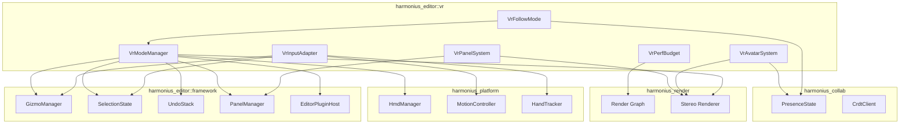
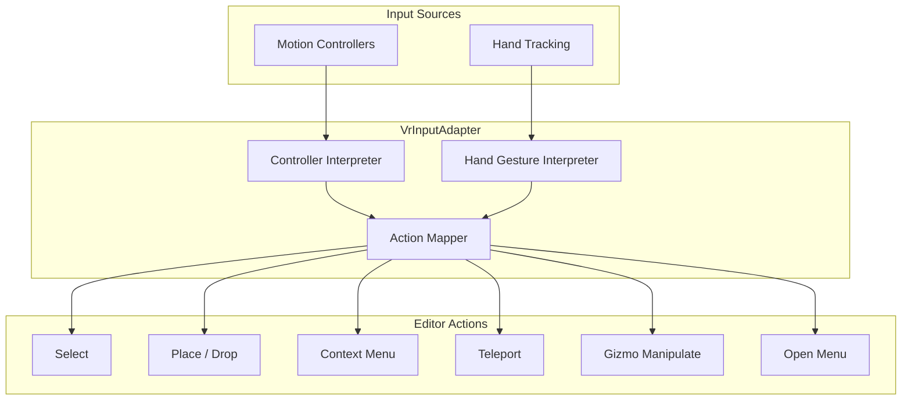
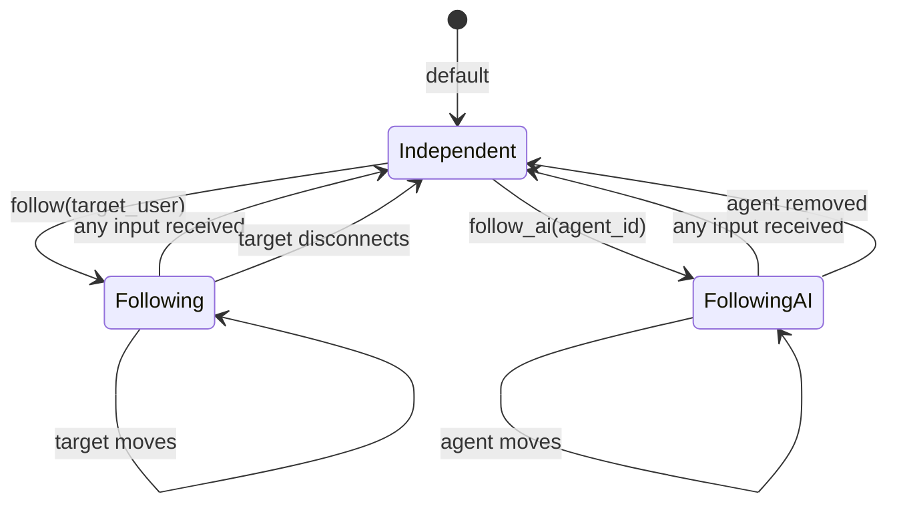
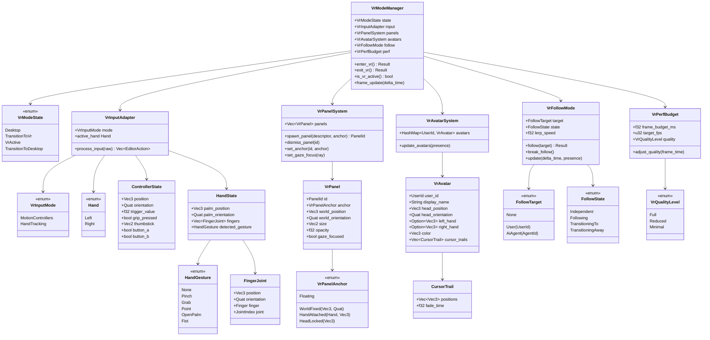

# VR Editor Mode Design

## Requirements Trace

> **Canonical sources:** Features, requirements, and user stories are defined in
> [features/tools-editor/](../../features/), [requirements/tools-editor/](../../requirements/), and
> [user-stories/tools-editor/](../../user-stories/). The table below traces design elements to those
> definitions.

| Feature   | Requirement | User Stories               |
|-----------|-------------|----------------------------|
| F-15.1.9  | R-15.1.9    | US-15.1.9.1--US-15.1.9.8   |
| F-15.16.1 | R-15.16.1   | US-15.16.1.1--US-15.16.1.4 |
| F-15.16.2 | R-15.16.2   | US-15.16.2.1--US-15.16.2.5 |
| F-15.16.3 | R-15.16.3   | US-15.16.3.1--US-15.16.3.3 |
| F-15.16.4 | R-15.16.4   | US-15.16.4.1--US-15.16.4.4 |
| F-15.16.5 | R-15.16.5   | US-15.16.5.1--US-15.16.5.3 |

1. **F-15.1.9** — VR editor mode with motion controller gizmos
2. **F-15.16.1** — Hand tracking input for VR editor
3. **F-15.16.2** — Floating panel UI in VR
4. **F-15.16.3** — VR collaboration with avatars
5. **F-15.16.4** — Follow mode for user/AI tracking
6. **F-15.16.5** — VR performance budget at 90 fps

### Cross-Cutting Dependencies

| Dependency | Source | Consumed API |
|------------|--------|--------------|
| Editor framework | F-15.1.1--F-15.1.8 | Panels, gizmos, undo, selection |
| Render graph | F-2.3.8 | Stereo viewport rendering |
| Collaboration | F-15.12.3 | Presence, cursors, avatars |
| Widget framework | F-13.1 | VR-adapted floating panels |
| Input system | F-14.2 | Motion controller and hand tracking |
| Platform windowing | F-14.1.1 | HMD display management |

### Non-Functional Requirements

| Requirement | Target | Source |
|-------------|--------|--------|
| Frame rate | >= 90 fps | US-15.16.5.1 |
| Motion-to-photon latency | < 20 ms | US-15.16.5.2 |
| UI panel render budget | < 2 ms per frame | US-15.16.5.3 |
| Follow mode switch latency | < 500 ms | US-15.16.4.3 |

## Overview

The VR editor mode is a rendering mode of the main editor, not a separate application. When
activated, the editor switches to stereo rendering on the HMD, replaces the desktop UI with floating
3D panels, and maps motion controller or hand tracking input to editor actions. The editor world,
undo stack, selection state, and plugin system remain identical; only the input adapter and
rendering path change.

Key principles:

- **Same editor, different view.** VR mode reuses the editor ECS world, undo system, and plugin
  registrations. No editor logic is duplicated.
- **90 fps minimum.** The VR render path has a strict performance budget. Editor UI complexity is
  reduced in VR mode.
- **Multiple input modalities.** Motion controllers and hand tracking are both supported with
  natural gesture mappings.
- **Collaborative.** Other users and AI agents appear as avatars with name tags. Follow mode lets a
  user track another participant's viewpoint.

## Architecture

### Module Boundaries



### VR Input Pipeline



### Follow Mode State Diagram



### Core Data Structures



### File Layout

```text
harmonius_editor/
├── vr/
│   ├── mode.rs           # VrModeManager — enter,
│   │                     # exit, frame update
│   ├── input.rs          # VrInputAdapter — controller
│   │                     # and hand tracking mapping
│   ├── controller.rs     # ControllerState, action
│   │                     # mapping tables
│   ├── hand_tracking.rs  # HandState, gesture
│   │                     # recognition
│   ├── panels.rs         # VrPanelSystem — floating
│   │                     # 3D panels, gaze focus
│   ├── avatars.rs        # VrAvatarSystem — remote
│   │                     # user visualization
│   ├── follow.rs         # VrFollowMode — camera
│   │                     # tracking of users/AI
│   └── perf.rs           # VrPerfBudget — quality
│                         # scaling, budget tracking
```

## API Design

### VR Mode Manager

```rust
/// Top-level VR mode controller. Manages the
/// transition between desktop and VR editing.
pub struct VrModeManager { /* ... */ }

/// Current VR mode state.
#[derive(
    Clone, Copy, Debug, PartialEq, Eq,
)]
pub enum VrModeState {
    /// Desktop editing mode (default).
    Desktop,
    /// Transitioning into VR.
    TransitionToVr,
    /// VR editing is active.
    VrActive,
    /// Transitioning back to desktop.
    TransitionToDesktop,
}

impl VrModeManager {
    pub fn new() -> Self;

    /// Enter VR mode. Initializes HMD, switches
    /// to stereo rendering, spawns VR panels.
    pub fn enter_vr(
        &mut self,
    ) -> Result<(), VrError>;

    /// Exit VR mode. Restores desktop rendering
    /// and desktop panel layout.
    pub fn exit_vr(
        &mut self,
    ) -> Result<(), VrError>;

    /// Whether VR mode is currently active.
    pub fn is_vr_active(&self) -> bool;

    /// Current mode state.
    pub fn state(&self) -> VrModeState;

    /// Per-frame update: process VR input, update
    /// panels, avatars, follow mode, check perf.
    pub fn frame_update(
        &mut self,
        delta_time: f32,
        editor_ctx: &mut EditorContext,
    );
}
```

### VR Input Adapter

```rust
/// Maps VR input devices to editor actions.
pub struct VrInputAdapter { /* ... */ }

/// Which input modality is active.
#[derive(
    Clone, Copy, Debug, PartialEq, Eq,
)]
pub enum VrInputMode {
    MotionControllers,
    HandTracking,
}

/// Controller button and axis state.
#[derive(Clone, Debug)]
pub struct ControllerState {
    pub position: Vec3,
    pub orientation: Quat,
    pub trigger_value: f32,
    pub grip_pressed: bool,
    pub thumbstick: Vec2,
    pub button_a: bool,
    pub button_b: bool,
}

/// Hand skeleton and gesture state.
#[derive(Clone, Debug)]
pub struct HandState {
    pub palm_position: Vec3,
    pub palm_orientation: Quat,
    pub fingers: Vec<FingerJoint>,
    pub detected_gesture: HandGesture,
}

/// Recognized hand gesture.
#[derive(
    Clone, Copy, Debug, PartialEq, Eq,
)]
pub enum HandGesture {
    None,
    Pinch,
    Grab,
    Point,
    OpenPalm,
    Fist,
}

/// A joint in the hand skeleton.
#[derive(Clone, Debug)]
pub struct FingerJoint {
    pub position: Vec3,
    pub orientation: Quat,
    pub finger: Finger,
    pub joint: JointIndex,
}

/// Which finger.
#[derive(
    Clone, Copy, Debug, PartialEq, Eq,
)]
pub enum Finger {
    Thumb,
    Index,
    Middle,
    Ring,
    Pinky,
}

impl VrInputAdapter {
    pub fn new() -> Self;

    /// Set the active input mode.
    pub fn set_mode(
        &mut self,
        mode: VrInputMode,
    );

    /// Get the active input mode.
    pub fn mode(&self) -> VrInputMode;

    /// Process raw VR input and return editor
    /// actions.
    pub fn process_input(
        &mut self,
        left: &ControllerState,
        right: &ControllerState,
    ) -> Vec<EditorAction>;

    /// Process hand tracking input and return
    /// editor actions.
    pub fn process_hands(
        &mut self,
        left: &HandState,
        right: &HandState,
    ) -> Vec<EditorAction>;

    /// Get the world-space ray from the dominant
    /// hand for selection and raycast.
    pub fn pointing_ray(&self) -> Ray;

    /// Whether the user is currently performing
    /// a grab gesture.
    pub fn is_grabbing(&self) -> bool;
}
```

### Input Mapping Tables

**Motion controller mapping:**

| Input | Editor Action |
|-------|---------------|
| Trigger press | Select entity under ray |
| Trigger hold + drag | Gizmo manipulate (translate/rotate/scale) |
| Grip press | Open context menu at controller position |
| Thumbstick push | Teleport to pointed location |
| Thumbstick left/right | Cycle gizmo tool (translate/rotate/scale) |
| Button A | Confirm action / place entity |
| Button B | Cancel / undo last action |
| Both grips + pull apart | Scale world (zoom) |
| Both grips + rotate | Rotate world |

**Hand tracking mapping:**

| Gesture | Editor Action |
|---------|---------------|
| Pinch (index + thumb) | Select entity under ray |
| Grab (close hand) | Move selected entity |
| Point (index finger) | Raycast for selection |
| Open palm (face up) | Open radial menu |
| Fist | Cancel current action |
| Pinch + drag | Gizmo manipulate |
| Two-hand pinch + pull | Scale world |
| Two-hand grab + rotate | Rotate world |

### VR Panel System

```rust
/// Manages floating 3D panels in VR space.
pub struct VrPanelSystem { /* ... */ }

/// A floating panel in VR.
pub struct VrPanel {
    pub id: PanelId,
    pub anchor: VrPanelAnchor,
    pub world_position: Vec3,
    pub world_orientation: Quat,
    pub size: Vec2,
    pub opacity: f32,
    pub gaze_focused: bool,
}

/// Anchor mode for VR panels.
#[derive(Clone, Debug)]
pub enum VrPanelAnchor {
    /// Fixed position in world space.
    WorldFixed(Vec3, Quat),
    /// Attached to a hand with local offset.
    HandAttached(Hand, Vec3),
    /// Locked relative to head position.
    HeadLocked(Vec3),
    /// Floating — user can grab and reposition.
    Floating,
}

/// Which hand.
#[derive(
    Clone, Copy, Debug, PartialEq, Eq,
)]
pub enum Hand {
    Left,
    Right,
}

impl VrPanelSystem {
    pub fn new() -> Self;

    /// Spawn a panel in VR space.
    pub fn spawn_panel(
        &mut self,
        descriptor: &PanelDescriptor,
        anchor: VrPanelAnchor,
    ) -> PanelId;

    /// Dismiss a VR panel.
    pub fn dismiss_panel(
        &mut self,
        id: PanelId,
    );

    /// Change a panel's anchor mode.
    pub fn set_anchor(
        &mut self,
        id: PanelId,
        anchor: VrPanelAnchor,
    );

    /// Update gaze focus based on head ray.
    pub fn set_gaze_focus(
        &mut self,
        head_ray: &Ray,
    );

    /// Get the currently gaze-focused panel.
    pub fn focused_panel(
        &self,
    ) -> Option<PanelId>;

    /// Show a radial menu at the given position.
    pub fn show_radial_menu(
        &mut self,
        position: Vec3,
        items: &[RadialMenuItem],
    );

    /// Dismiss the radial menu.
    pub fn dismiss_radial_menu(&mut self);

    /// Get all active VR panels.
    pub fn panels(&self) -> &[VrPanel];
}

/// Item in a VR radial menu.
pub struct RadialMenuItem {
    pub label: String,
    pub icon: Option<AssetHandle>,
    pub action: HotKeyAction,
}
```

### VR Avatar System

```rust
/// Renders remote users and AI agents as avatars
/// in VR space.
pub struct VrAvatarSystem { /* ... */ }

/// Visual representation of a remote participant.
pub struct VrAvatar {
    pub user_id: UserId,
    pub display_name: String,
    pub head_position: Vec3,
    pub head_orientation: Quat,
    pub left_hand: Option<Vec3>,
    pub right_hand: Option<Vec3>,
    pub color: Vec3,
    pub cursor_trails: Vec<CursorTrail>,
}

/// Fading trail showing a user's recent cursor
/// positions and selections.
pub struct CursorTrail {
    pub positions: Vec<Vec3>,
    pub fade_time: f32,
}

impl VrAvatarSystem {
    pub fn new() -> Self;

    /// Update avatar positions from presence data.
    pub fn update_avatars(
        &mut self,
        presence: &PresenceState,
    );

    /// Get all visible avatars.
    pub fn avatars(&self) -> &[VrAvatar];

    /// Set the trail duration in seconds.
    pub fn set_trail_duration(
        &mut self,
        seconds: f32,
    );

    /// Toggle name tag visibility.
    pub fn set_name_tags_visible(
        &mut self,
        visible: bool,
    );
}
```

### VR Follow Mode

```rust
/// Follow mode — camera automatically follows
/// another user's or AI agent's viewpoint.
pub struct VrFollowMode { /* ... */ }

/// The follow target.
#[derive(Clone, Debug, PartialEq, Eq)]
pub enum FollowTarget {
    /// Not following anyone.
    None,
    /// Following a human user.
    User(UserId),
    /// Following an AI agent.
    AiAgent(AgentId),
}

/// Follow mode transition state.
#[derive(
    Clone, Copy, Debug, PartialEq, Eq,
)]
pub enum FollowState {
    /// User controls their own viewpoint.
    Independent,
    /// Camera is tracking the target.
    Following,
    /// Smoothly transitioning to target view.
    TransitioningTo,
    /// Smoothly transitioning away from target.
    TransitioningAway,
}

impl VrFollowMode {
    pub fn new() -> Self;

    /// Start following a target. The camera
    /// smoothly interpolates to the target's
    /// viewpoint.
    pub fn follow(
        &mut self,
        target: FollowTarget,
    ) -> Result<(), VrError>;

    /// Break away from follow mode. Any input
    /// (controller or hand) triggers this.
    pub fn break_follow(&mut self);

    /// Whether currently following a target.
    pub fn is_following(&self) -> bool;

    /// Get the current follow target.
    pub fn target(&self) -> &FollowTarget;

    /// Get the current follow state.
    pub fn state(&self) -> FollowState;

    /// Set the camera interpolation speed.
    pub fn set_lerp_speed(&mut self, speed: f32);

    /// Per-frame update: interpolate camera
    /// toward target position.
    pub fn update(
        &mut self,
        delta_time: f32,
        presence: &PresenceState,
    );
}
```

### VR Performance Budget

```rust
/// Manages the VR rendering performance budget
/// to maintain 90 fps minimum.
pub struct VrPerfBudget { /* ... */ }

/// Quality level for VR rendering.
#[derive(
    Clone, Copy, Debug, PartialEq, Eq,
)]
pub enum VrQualityLevel {
    /// Full editor UI, all overlays.
    Full,
    /// Reduced UI refresh rate, simplified
    /// gizmos.
    Reduced,
    /// Minimal UI — only essential panels,
    /// no cursor trails.
    Minimal,
}

impl VrPerfBudget {
    pub fn new(target_fps: u32) -> Self;

    /// Per-frame budget in milliseconds.
    pub fn frame_budget_ms(&self) -> f32;

    /// Current quality level.
    pub fn quality(&self) -> VrQualityLevel;

    /// Adjust quality based on measured frame
    /// time. Automatically downgrades when
    /// frames exceed budget and upgrades when
    /// headroom is available.
    pub fn adjust_quality(
        &mut self,
        frame_time_ms: f32,
    );

    /// Force a specific quality level.
    pub fn set_quality(
        &mut self,
        level: VrQualityLevel,
    );

    /// Get recent frame time statistics.
    pub fn frame_stats(&self) -> VrFrameStats;
}

/// Frame time statistics for VR performance
/// monitoring.
pub struct VrFrameStats {
    pub avg_frame_ms: f32,
    pub p99_frame_ms: f32,
    pub dropped_frames: u32,
    pub quality_downgrades: u32,
}
```

### Error Types

```rust
#[derive(Debug)]
pub enum VrError {
    /// HMD not connected or not detected.
    HmdNotFound,
    /// HMD initialization failed.
    HmdInitFailed { reason: String },
    /// Follow target not found in presence.
    FollowTargetNotFound(FollowTarget),
    /// Cannot enter VR while already in VR.
    AlreadyInVr,
    /// Cannot exit VR while in desktop mode.
    NotInVr,
    /// Stereo rendering setup failed.
    StereoRenderFailed { reason: String },
}
```

## Data Flow

### VR Mode Entry

1. User activates VR mode from the editor menu or hotkey.
2. `VrModeManager::enter_vr()` initializes the HMD via `HmdManager`.
3. The render graph switches to stereo rendering with two viewports (one per eye).
4. Desktop panels are hidden. `VrPanelSystem` spawns floating 3D panel equivalents.
5. `VrInputAdapter` begins processing motion controller or hand tracking input.
6. The `VrPerfBudget` initializes with a 90 fps target.
7. `VrModeState` transitions from `Desktop` to `VrActive`.

### VR Input Processing

1. Each frame, the VR runtime provides raw input from controllers or hands.
2. `VrInputAdapter::process_input()` interprets raw values against the mapping tables.
3. Mapped `EditorAction` values are dispatched to the editor systems: `GizmoManager`,
   `SelectionState`, `UndoStack`.
4. The pointing ray from the dominant hand is used for spatial queries (selection, gizmo
   hit-testing, panel interaction).
5. Panel interaction: if the pointing ray hits a VR panel, the panel receives 2D input events
   (click, drag) projected onto its surface.

### Follow Mode Flow

1. User selects "Follow" from the radial menu and picks a target user or AI agent.
2. `VrFollowMode::follow()` sets the target and transitions to `TransitioningTo`.
3. Each frame, `update()` interpolates the VR camera toward the target's position from the
   `PresenceState`.
4. When the camera reaches the target, the state becomes `Following`.
5. Any VR input (controller move, hand gesture) triggers `break_follow()`, which transitions to
   `TransitioningAway` and then `Independent`.
6. If the target disconnects, follow mode automatically breaks.

### VR Collaboration

1. When collaboration is active, `VrAvatarSystem::update_avatars()` reads
   `PresenceState::remote_cursors()` each frame.
2. For each remote user, an avatar mesh is positioned at their head location.
3. If a remote user is also in VR mode, their hand positions are shown on the avatar.
4. Cursor trails render the recent selection/editing positions of each remote user.
5. Name tags float above each avatar, always facing the local user's head.

### VR Performance Scaling

1. `VrPerfBudget` measures frame time each frame.
2. If the average exceeds 11.1 ms (90 fps budget), quality downgrades:
   - `Full` to `Reduced`: panel refresh rate halved, cursor trails disabled.
   - `Reduced` to `Minimal`: non-essential panels hidden, gizmo LOD reduced.
3. If the average drops below 8 ms with headroom, quality upgrades.
4. The quality level is exposed to all VR systems so they can adjust their rendering complexity.

## Platform Considerations

| Component | Windows | macOS | Linux |
|-----------|---------|-------|-------|
| VR runtime | OpenXR (SteamVR, Oculus) | Not supported | OpenXR (SteamVR) |
| HMD init | `xrCreateInstance` | N/A | `xrCreateInstance` |
| Controller API | OpenXR action system | N/A | OpenXR action system |
| Hand tracking | OpenXR hand tracking ext | N/A | OpenXR hand tracking ext |
| Stereo rendering | Vulkan/D3D12 multiview | N/A | Vulkan multiview |
| HMD display | OpenXR swapchain | N/A | OpenXR swapchain |

VR mode is available on Windows and Linux via OpenXR. macOS does not support VR headsets natively
and the VR editor mode is disabled on that platform. The `enter_vr()` call returns
`VrError::HmdNotFound` on macOS.

## Test Plan

Test cases are in the companion file [vr-editor-test-cases.md](vr-editor-test-cases.md).

### Summary

| Category | Count | Coverage |
|----------|-------|----------|
| Unit tests | 20 | Input mapping, follow mode, panel anchoring, perf budget |
| Integration tests | 8 | VR mode lifecycle, collaboration, input-to-action, rendering |
| Benchmarks | 4 | Frame time, input latency, avatar rendering, panel budget |

## Open Questions

1. **macOS VR support.** Apple Vision Pro uses a different runtime than OpenXR. Should the VR editor
   support visionOS as a future platform, and if so, should it use ARKit instead of OpenXR?

2. **Haptic feedback.** Should gizmo manipulations provide haptic feedback through the controllers?
   If so, what haptic patterns map to translate, rotate, and scale?

3. **VR UI scaling.** Floating panels need a readable text size in VR. What is the minimum panel
   size (in meters) to ensure legibility at arm's length?

4. **Seated vs. standing.** Should the editor support both seated and room-scale VR modes? Seated
   mode would use thumbstick-only locomotion; room-scale would add physical walking.

5. **Hand tracking latency.** Gesture recognition introduces latency. What is the acceptable gesture
   recognition delay before the user perceives lag? Should there be a prediction model for gestures?

6. **Follow mode smoothing.** The lerp speed for follow mode affects comfort. Too fast causes motion
   sickness; too slow feels sluggish. Should the speed adapt to the target's velocity?
