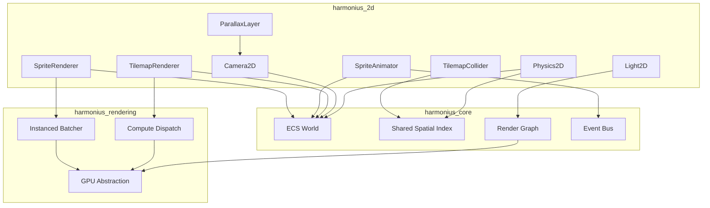
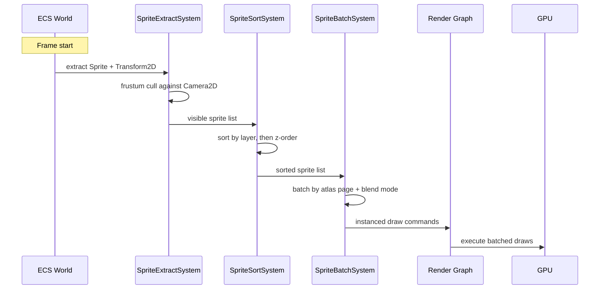
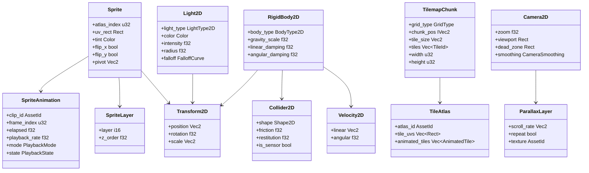
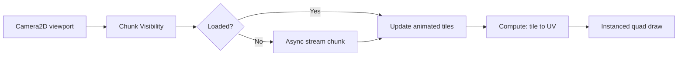
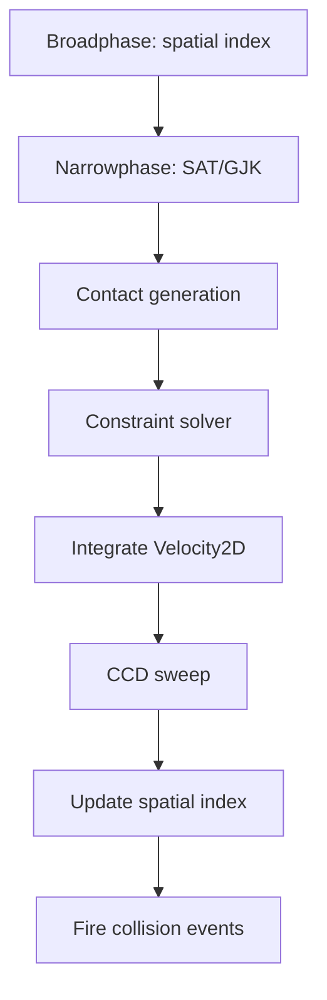

# 2D Game Support Design

## Requirements Trace

> **Canonical sources:** Features, requirements, and user stories are defined in
> [features/ui-2d/](../../features/ui-2d/), [requirements/ui-2d/](../../requirements/ui-2d/), and
> [user-stories/ui-2d/](../../user-stories/ui-2d/). The table below traces design elements to those
> definitions.

| Feature | Requirement | User Story | Description |
|---------|-------------|------------|-------------|
| F-10.5.1 | R-10.5.1 | US-10.5.1 | Sprite rendering and sprite sheets |
| F-10.5.2 | R-10.5.2 | US-10.5.2, US-10.5.3 | Frame-based sprite animation |
| F-10.5.6 | R-10.5.6 | US-10.5.8, US-10.5.9 | Tilemap rendering (orthogonal) |
| F-10.5.7 | R-10.5.7 | US-10.5.10, US-10.5.11 | Isometric and hex tilemaps |
| F-10.5.9 | R-10.5.9 | US-10.5.13, US-10.5.14 | 2D camera and parallax |
| F-10.5.10 | R-10.5.10 | US-10.5.15, US-10.5.16 | 2D rigid body physics |
| F-10.5.11 | R-10.5.11 | US-10.5.17 | 2D collision shapes and tilemap colliders |
| F-10.5.12 | R-10.5.12 | US-10.5.18 | 2D joints and constraints |
| F-10.5.13 | R-10.5.13 | US-10.5.19 | 2D spatial queries |
| F-10.5.14 | R-10.5.14 | US-10.5.20, US-10.5.21 | 2D dynamic lighting |
| F-10.5.15 | R-10.5.15 | US-10.5.22 | 2D particle effects |

## Overview

The 2D game support subsystem provides a complete 2D rendering, physics, and gameplay framework
built entirely on ECS. All 2D data lives as components on entities. All 2D logic runs as systems in
the ECS schedule.

Core subsystems:

1. **Sprite rendering** -- instanced textured quads, atlas batching, z-order sorting, layer
   composition
2. **Tilemap rendering** -- chunked grids, compute dispatch, orthogonal/isometric/hex layouts
3. **2D physics** -- rigid bodies, collision shapes, joints, spatial queries, deterministic
   simulation
4. **2D camera** -- orthographic projection, parallax scrolling, pixel-perfect snapping,
   split-screen
5. **Sprite animation** -- frame sequences, playback modes, animation events
6. **2D lighting** -- point/spot lights, shadow casting, normal maps, emissive sprites, light map
   compositing

Every subsystem integrates with the shared spatial index for culling, collision, and queries. The
render path feeds into the engine's render graph via instanced draw commands.

## Architecture

### Module Boundaries



```text
harmonius_2d/
├── sprite/
│   ├── components.rs    # Sprite, SpriteLayer,
│   │                    # SpriteAnimation
│   ├── atlas.rs         # SpriteAtlas, SpriteSheet
│   ├── extract.rs       # SpriteExtractSystem
│   ├── sort.rs          # SpriteSortSystem
│   └── batch.rs         # SpriteBatchSystem
├── tilemap/
│   ├── components.rs    # TilemapChunk, TileAtlas,
│   │                    # TilemapLayer
│   ├── grid.rs          # GridType, coordinate
│   │                    # conversion
│   ├── render.rs        # TilemapRenderSystem
│   ├── collider.rs      # TilemapColliderSystem
│   └── stream.rs        # TilemapStreamSystem
├── physics/
│   ├── components.rs    # RigidBody2D, Velocity2D,
│   │                    # Collider2D, Mass2D
│   ├── shapes.rs        # Shape2D variants
│   ├── broadphase.rs    # Spatial index query
│   ├── narrowphase.rs   # SAT, GJK contact gen
│   ├── solver.rs        # Constraint solver
│   ├── joints.rs        # Joint2D variants
│   ├── ccd.rs           # Continuous collision
│   └── query.rs         # Ray/shape/overlap queries
├── camera/
│   ├── components.rs    # Camera2D, ParallaxLayer
│   ├── follow.rs        # CameraFollowSystem
│   └── shake.rs         # CameraShakeSystem
└── lighting/
    ├── components.rs    # Light2D, ShadowCaster2D
    ├── shadow.rs        # ShadowMapSystem
    └── lightmap.rs      # LightMapCompositeSystem
```

### Sprite Rendering Pipeline



### ECS Component Relationships



### Tilemap Chunk Rendering Flow



### 2D Physics Step



### 2D Light Map Composition


## API Design

### Core Types

```rust
/// 2D position, rotation, and scale. Separate from
/// 3D Transform for cache efficiency and to avoid
/// unused Z data in 2D-only games.
#[derive(Clone, Copy, Debug, Reflect)]
pub struct Transform2D {
    pub position: Vec2,
    pub rotation: f32,
    pub scale: Vec2,
}

impl Default for Transform2D {
    fn default() -> Self {
        Self {
            position: Vec2::ZERO,
            rotation: 0.0,
            scale: Vec2::ONE,
        }
    }
}

/// Axis-aligned rectangle.
#[derive(Clone, Copy, Debug, Reflect)]
pub struct Rect {
    pub min: Vec2,
    pub max: Vec2,
}

impl Rect {
    pub fn new(
        x: f32, y: f32, w: f32, h: f32,
    ) -> Self;
    pub fn width(&self) -> f32;
    pub fn height(&self) -> f32;
    pub fn center(&self) -> Vec2;
    pub fn contains(&self, point: Vec2) -> bool;
    pub fn intersects(&self, other: &Rect) -> bool;
}
```

### Sprite Components

```rust
/// A 2D sprite rendered as a textured quad.
/// Attach to an entity alongside Transform2D
/// and SpriteLayer.
#[derive(Clone, Debug, Reflect)]
pub struct Sprite {
    /// Index into the bound sprite atlas.
    pub atlas_index: u32,
    /// UV rectangle within the atlas page.
    pub uv_rect: Rect,
    /// Multiplicative tint color.
    pub tint: Color,
    /// Horizontal flip.
    pub flip_x: bool,
    /// Vertical flip.
    pub flip_y: bool,
    /// Pivot point in normalized coordinates
    /// (0,0 = bottom-left, 0.5,0.5 = center).
    pub pivot: Vec2,
}

/// Determines draw order. Sprites are sorted by
/// layer first (lower draws first), then by
/// z_order within each layer.
#[derive(Clone, Copy, Debug, Reflect)]
pub struct SpriteLayer {
    /// Coarse sorting layer (-32768..32767).
    pub layer: i16,
    /// Fine z-order within the layer.
    pub z_order: f32,
}

/// Blend mode for sprite rendering.
#[derive(Clone, Copy, Debug, PartialEq, Eq, Reflect)]
pub enum BlendMode {
    Alpha,
    Additive,
    Multiply,
    Screen,
    Premultiplied,
}
```

### Sprite Atlas

```rust
/// A packed texture atlas containing multiple
/// sprite frames. Referenced by Sprite components
/// via atlas_index.
#[derive(Clone, Debug, Reflect)]
pub struct SpriteAtlas {
    /// GPU texture handle for this atlas page.
    pub texture: AssetId,
    /// Per-frame UV rects, pivot points, and
    /// trim rects.
    pub frames: Vec<SpriteFrame>,
    /// Atlas pixel dimensions.
    pub width: u32,
    pub height: u32,
}

/// Metadata for a single frame in a sprite atlas.
#[derive(Clone, Copy, Debug, Reflect)]
pub struct SpriteFrame {
    /// UV rect within the atlas texture.
    pub uv_rect: Rect,
    /// Pivot in normalized coordinates.
    pub pivot: Vec2,
    /// Original source size before trimming.
    pub source_size: Vec2,
    /// Offset from trim to original position.
    pub trim_offset: Vec2,
}

/// A sprite sheet defines named animation clips
/// as frame ranges within an atlas.
#[derive(Clone, Debug, Reflect)]
pub struct SpriteSheet {
    pub atlas: AssetId,
    pub clips: Vec<SpriteClip>,
}

/// A named animation clip referencing a range of
/// frames in the parent atlas.
#[derive(Clone, Debug, Reflect)]
pub struct SpriteClip {
    pub name: String,
    pub start_frame: u32,
    pub end_frame: u32,
    pub frame_duration_ms: u32,
    pub events: Vec<AnimationEvent>,
}

/// An event that fires at a specific frame during
/// animation playback.
#[derive(Clone, Debug, Reflect)]
pub struct AnimationEvent {
    pub frame: u32,
    pub event_id: EventId,
}
```

### Sprite Animation

```rust
/// Playback direction and looping behavior.
#[derive(Clone, Copy, Debug, PartialEq, Eq, Reflect)]
pub enum PlaybackMode {
    Loop,
    PingPong,
    OneShot,
    Reverse,
}

/// Current playback state.
#[derive(Clone, Copy, Debug, PartialEq, Eq, Reflect)]
pub enum PlaybackState {
    Playing,
    Paused,
    Finished,
}

/// Animates a Sprite by cycling through frames
/// of a SpriteClip. Attach to the same entity
/// as a Sprite component.
#[derive(Clone, Debug, Reflect)]
pub struct SpriteAnimation {
    /// Active clip asset.
    pub clip_id: AssetId,
    /// Current frame index within the clip.
    pub frame_index: u32,
    /// Accumulated time since last frame advance.
    pub elapsed: f32,
    /// Playback speed multiplier (1.0 = normal).
    pub playback_rate: f32,
    /// Looping / direction mode.
    pub mode: PlaybackMode,
    /// Current state.
    pub state: PlaybackState,
}

impl SpriteAnimation {
    pub fn new(clip_id: AssetId) -> Self;
    pub fn play(&mut self);
    pub fn pause(&mut self);
    pub fn reset(&mut self);
    pub fn set_mode(&mut self, mode: PlaybackMode);
    pub fn set_playback_rate(&mut self, rate: f32);
}
```

### Tilemap Components

```rust
/// Grid layout type for a tilemap.
#[derive(Clone, Copy, Debug, PartialEq, Eq, Reflect)]
pub enum GridType {
    /// Standard rectangular grid.
    Orthogonal,
    /// Diamond-shaped isometric grid.
    IsometricDiamond,
    /// Staggered isometric grid.
    IsometricStaggered,
    /// Hexagonal grid with flat-top orientation.
    HexFlatTop,
    /// Hexagonal grid with pointy-top orientation.
    HexPointyTop,
}

/// A unique tile identifier within a tileset.
/// TileId(0) is reserved for empty/air.
#[derive(
    Clone, Copy, Debug, PartialEq, Eq, Hash, Reflect,
)]
pub struct TileId(pub u32);

/// Per-tile rendering and physics flags.
#[derive(Clone, Copy, Debug, Reflect)]
pub struct TileFlags {
    pub flip_x: bool,
    pub flip_y: bool,
    pub rotate_cw: bool,
    pub collision: bool,
    pub one_way: bool,
}

/// A fixed-size chunk of tiles. Chunks are the
/// unit of streaming, culling, and compute
/// dispatch.
#[derive(Clone, Debug, Reflect)]
pub struct TilemapChunk {
    pub grid_type: GridType,
    /// Chunk position in chunk coordinates.
    pub chunk_pos: IVec2,
    /// Pixel size of each tile.
    pub tile_size: Vec2,
    /// Width of the chunk in tiles.
    pub width: u32,
    /// Height of the chunk in tiles.
    pub height: u32,
    /// Flat array of tile IDs (row-major).
    pub tiles: Vec<TileId>,
    /// Per-tile flags (parallel to tiles).
    pub flags: Vec<TileFlags>,
}

impl TilemapChunk {
    pub fn new(
        grid_type: GridType,
        chunk_pos: IVec2,
        tile_size: Vec2,
        width: u32,
        height: u32,
    ) -> Self;

    /// Get tile at local (x, y) within chunk.
    pub fn get_tile(
        &self, x: u32, y: u32,
    ) -> Option<TileId>;

    /// Set tile at local (x, y) within chunk.
    pub fn set_tile(
        &mut self, x: u32, y: u32, tile: TileId,
    );

    /// Convert world position to tile coordinate.
    pub fn world_to_tile(
        &self, world_pos: Vec2,
    ) -> IVec2;

    /// Convert tile coordinate to world position.
    pub fn tile_to_world(
        &self, tile_pos: IVec2,
    ) -> Vec2;
}

/// Tile atlas mapping tile IDs to UV rects
/// and animation data.
#[derive(Clone, Debug, Reflect)]
pub struct TileAtlas {
    pub atlas_id: AssetId,
    pub tile_uvs: Vec<Rect>,
    pub animated_tiles: Vec<AnimatedTile>,
    pub auto_tile_rules: Vec<AutoTileRule>,
}

/// An animated tile cycles through a sequence
/// of UV rects at a fixed rate.
#[derive(Clone, Debug, Reflect)]
pub struct AnimatedTile {
    pub tile_id: TileId,
    pub frames: Vec<Rect>,
    pub frame_duration_ms: u32,
}

/// Auto-tiling rule for terrain transitions.
/// A bitmask of neighbor states maps to a
/// specific UV rect.
#[derive(Clone, Debug, Reflect)]
pub struct AutoTileRule {
    pub tile_id: TileId,
    pub neighbor_mask: u8,
    pub uv_rect: Rect,
}

/// Layer index for multi-layer tilemaps.
/// Ground, decoration, collision overlay, etc.
#[derive(Clone, Copy, Debug, Reflect)]
pub struct TilemapLayer {
    pub layer_index: u8,
    pub z_order: f32,
    pub visible: bool,
}
```

### Tilemap Coordinate Conversion

```rust
/// Convert screen position to tile coordinate
/// for each grid type.
pub fn screen_to_tile(
    grid_type: GridType,
    screen_pos: Vec2,
    tile_size: Vec2,
    camera: &Camera2D,
) -> IVec2 {
    let world_pos = camera.screen_to_world(
        screen_pos,
    );
    match grid_type {
        GridType::Orthogonal => {
            IVec2::new(
                (world_pos.x / tile_size.x)
                    .floor() as i32,
                (world_pos.y / tile_size.y)
                    .floor() as i32,
            )
        }
        GridType::IsometricDiamond => {
            let half_w = tile_size.x * 0.5;
            let half_h = tile_size.y * 0.5;
            IVec2::new(
                ((world_pos.x / half_w
                    + world_pos.y / half_h)
                    * 0.5)
                    .floor() as i32,
                ((world_pos.y / half_h
                    - world_pos.x / half_w)
                    * 0.5)
                    .floor() as i32,
            )
        }
        GridType::IsometricStaggered => {
            // Staggered: even rows offset by
            // half tile width
            let row = (world_pos.y / tile_size.y)
                .floor() as i32;
            let offset = if row % 2 != 0 {
                tile_size.x * 0.5
            } else {
                0.0
            };
            let col = ((world_pos.x - offset)
                / tile_size.x)
                .floor() as i32;
            IVec2::new(col, row)
        }
        GridType::HexFlatTop => {
            hex_round_flat_top(
                world_pos, tile_size,
            )
        }
        GridType::HexPointyTop => {
            hex_round_pointy_top(
                world_pos, tile_size,
            )
        }
    }
}
```

### 2D Camera

```rust
/// Camera smoothing strategy.
#[derive(Clone, Copy, Debug, Reflect)]
pub enum CameraSmoothing {
    /// No smoothing, snap to target.
    None,
    /// Lerp toward target each frame.
    Lerp { speed: f32 },
    /// Look-ahead based on target velocity.
    LookAhead { distance: f32, speed: f32 },
    /// Snap to nearest grid cell.
    SnapToGrid { cell_size: Vec2 },
}

/// Orthographic 2D camera component.
#[derive(Clone, Debug, Reflect)]
pub struct Camera2D {
    /// Zoom level (1.0 = native resolution).
    pub zoom: f32,
    /// World-space viewport bounds.
    pub viewport: Rect,
    /// Dead zone: target moves freely within
    /// this rect without camera motion.
    pub dead_zone: Rect,
    /// Soft edge push zone width.
    pub soft_edge: f32,
    /// Smoothing strategy.
    pub smoothing: CameraSmoothing,
    /// Enable pixel-perfect snapping.
    pub pixel_perfect: bool,
    /// Pixels per world unit.
    pub pixels_per_unit: f32,
    /// Camera shake intensity (decays per frame).
    pub shake_intensity: f32,
    /// Camera shake decay rate per second.
    pub shake_decay: f32,
}

impl Camera2D {
    pub fn new(
        viewport_width: f32,
        viewport_height: f32,
    ) -> Self;

    /// Convert screen coordinates to world space.
    pub fn screen_to_world(
        &self, screen_pos: Vec2,
    ) -> Vec2;

    /// Convert world coordinates to screen space.
    pub fn world_to_screen(
        &self, world_pos: Vec2,
    ) -> Vec2;

    /// Apply camera shake with initial intensity.
    pub fn shake(&mut self, intensity: f32);

    /// Snap position to pixel grid when
    /// pixel_perfect is enabled.
    pub fn snap_to_pixel(
        &self, position: Vec2,
    ) -> Vec2 {
        if !self.pixel_perfect {
            return position;
        }
        let ppu = self.pixels_per_unit;
        Vec2::new(
            (position.x * ppu).round() / ppu,
            (position.y * ppu).round() / ppu,
        )
    }
}

/// A parallax background layer that scrolls
/// relative to the Camera2D.
#[derive(Clone, Debug, Reflect)]
pub struct ParallaxLayer {
    /// Scroll rate relative to camera movement.
    /// (0.0 = fixed, 1.0 = moves with camera,
    /// 0.5 = half speed for background depth).
    pub scroll_rate: Vec2,
    /// Whether the layer texture tiles/repeats.
    pub repeat: bool,
    /// Background texture.
    pub texture: AssetId,
    /// Z-order for compositing with sprites.
    pub z_order: f32,
}

/// Split-screen viewport assignment for
/// local co-op.
#[derive(Clone, Copy, Debug, Reflect)]
pub struct SplitScreenViewport {
    /// Normalized rect within the window
    /// (0,0 = top-left, 1,1 = full window).
    pub normalized_rect: Rect,
    /// Which Camera2D entity this viewport uses.
    pub camera_entity: Entity,
}
```

### 2D Physics Components

```rust
/// 2D rigid body type.
#[derive(Clone, Copy, Debug, PartialEq, Eq, Reflect)]
pub enum BodyType2D {
    /// Affected by forces, gravity, collisions.
    Dynamic,
    /// Moved by code only, not by physics solver.
    Kinematic,
    /// Immovable. Infinite mass.
    Static,
}

/// 2D rigid body component. Attach alongside
/// Transform2D and Velocity2D.
#[derive(Clone, Debug, Reflect)]
pub struct RigidBody2D {
    pub body_type: BodyType2D,
    /// Gravity multiplier (0 = no gravity).
    pub gravity_scale: f32,
    /// Linear velocity damping per second.
    pub linear_damping: f32,
    /// Angular velocity damping per second.
    pub angular_damping: f32,
    /// Lock rotation (no angular velocity).
    pub fixed_rotation: bool,
    /// Enable continuous collision detection
    /// for fast-moving bodies.
    pub ccd_enabled: bool,
}

/// 2D velocity component.
#[derive(Clone, Copy, Debug, Reflect)]
pub struct Velocity2D {
    pub linear: Vec2,
    pub angular: f32,
}

/// 2D mass properties.
#[derive(Clone, Copy, Debug, Reflect)]
pub struct Mass2D {
    pub mass: f32,
    pub inverse_mass: f32,
    pub inertia: f32,
    pub inverse_inertia: f32,
    pub center_of_mass: Vec2,
}

/// 2D collider shape variants.
#[derive(Clone, Debug, Reflect)]
pub enum Shape2D {
    Circle { radius: f32 },
    Box { half_extents: Vec2 },
    Capsule { half_height: f32, radius: f32 },
    ConvexPolygon { vertices: Vec<Vec2> },
    EdgeChain { vertices: Vec<Vec2> },
    Composite { shapes: Vec<Shape2D> },
}

/// 2D collider component. Defines the collision
/// shape and material properties.
#[derive(Clone, Debug, Reflect)]
pub struct Collider2D {
    pub shape: Shape2D,
    /// Coulomb friction coefficient.
    pub friction: f32,
    /// Coefficient of restitution (bounciness).
    pub restitution: f32,
    /// Sensor colliders detect overlap but
    /// do not generate contact forces.
    pub is_sensor: bool,
    /// Collision layer mask (which layers
    /// this collider belongs to).
    pub layer: u32,
    /// Collision mask (which layers this
    /// collider interacts with).
    pub mask: u32,
    /// One-way platform: pass through from
    /// below, solid from above.
    pub one_way: bool,
    /// Surface velocity for conveyor belts.
    pub surface_velocity: Vec2,
}
```

### 2D Joints

```rust
/// 2D joint types connecting two RigidBody2D
/// entities.
#[derive(Clone, Debug, Reflect)]
pub enum Joint2D {
    /// Hinge joint — rotation around a point.
    Revolute {
        anchor_a: Vec2,
        anchor_b: Vec2,
        motor: Option<JointMotor>,
        limits: Option<AngleLimits>,
    },
    /// Slider joint — translation along an axis.
    Prismatic {
        anchor_a: Vec2,
        anchor_b: Vec2,
        axis: Vec2,
        motor: Option<JointMotor>,
        limits: Option<LinearLimits>,
    },
    /// Fixed distance between two points.
    Distance {
        anchor_a: Vec2,
        anchor_b: Vec2,
        length: f32,
        stiffness: f32,
        damping: f32,
    },
    /// Spring with rest length.
    Spring {
        anchor_a: Vec2,
        anchor_b: Vec2,
        rest_length: f32,
        stiffness: f32,
        damping: f32,
    },
    /// Inextensible rope with max length.
    Rope {
        anchor_a: Vec2,
        anchor_b: Vec2,
        max_length: f32,
    },
    /// Rigid weld — no relative motion.
    Weld {
        anchor_a: Vec2,
        anchor_b: Vec2,
    },
    /// Wheel — revolute + prismatic for
    /// vehicle suspension.
    Wheel {
        anchor_a: Vec2,
        anchor_b: Vec2,
        axis: Vec2,
        suspension: SpringParams,
        motor: Option<JointMotor>,
    },
    /// Mouse drag — attract body to a world
    /// target point.
    Mouse {
        target: Vec2,
        max_force: f32,
        stiffness: f32,
        damping: f32,
    },
}

/// Joint motor parameters.
#[derive(Clone, Copy, Debug, Reflect)]
pub struct JointMotor {
    pub target_speed: f32,
    pub max_torque: f32,
}

/// Angular limits for revolute joints.
#[derive(Clone, Copy, Debug, Reflect)]
pub struct AngleLimits {
    pub min_angle: f32,
    pub max_angle: f32,
}

/// Linear limits for prismatic joints.
#[derive(Clone, Copy, Debug, Reflect)]
pub struct LinearLimits {
    pub min_translation: f32,
    pub max_translation: f32,
}

/// Spring stiffness and damping parameters.
#[derive(Clone, Copy, Debug, Reflect)]
pub struct SpringParams {
    pub stiffness: f32,
    pub damping: f32,
}

/// Joint constraint connecting two entities.
#[derive(Clone, Debug, Reflect)]
pub struct JointConstraint2D {
    pub entity_a: Entity,
    pub entity_b: Entity,
    pub joint: Joint2D,
    /// Force threshold at which the joint
    /// breaks. None = unbreakable.
    pub break_force: Option<f32>,
}
```

### 2D Spatial Queries

```rust
/// Result of a 2D ray cast.
#[derive(Clone, Copy, Debug)]
pub struct RayCastHit2D {
    pub entity: Entity,
    pub point: Vec2,
    pub normal: Vec2,
    pub distance: f32,
}

/// Result of a 2D shape cast.
#[derive(Clone, Copy, Debug)]
pub struct ShapeCastHit2D {
    pub entity: Entity,
    pub point: Vec2,
    pub normal: Vec2,
    pub distance: f32,
}

/// Result of a 2D overlap test.
#[derive(Clone, Copy, Debug)]
pub struct OverlapHit2D {
    pub entity: Entity,
}

/// 2D spatial query interface. Operates on the
/// shared spatial index filtered to 2D colliders.
pub struct SpatialQuery2D<'w> {
    spatial_index: &'w SpatialIndex,
}

impl<'w> SpatialQuery2D<'w> {
    /// Cast a ray and return the closest hit.
    pub fn ray_cast(
        &self,
        origin: Vec2,
        direction: Vec2,
        max_distance: f32,
        layer_mask: u32,
    ) -> Option<RayCastHit2D>;

    /// Cast a ray and return all hits, sorted
    /// by distance.
    pub fn ray_cast_all(
        &self,
        origin: Vec2,
        direction: Vec2,
        max_distance: f32,
        layer_mask: u32,
    ) -> Vec<RayCastHit2D>;

    /// Cast a shape along a direction.
    pub fn shape_cast(
        &self,
        shape: &Shape2D,
        origin: Vec2,
        direction: Vec2,
        max_distance: f32,
        layer_mask: u32,
    ) -> Option<ShapeCastHit2D>;

    /// Test which entities overlap a shape at
    /// a given position.
    pub fn overlap(
        &self,
        shape: &Shape2D,
        position: Vec2,
        layer_mask: u32,
    ) -> Vec<OverlapHit2D>;

    /// Batch ray cast for AI/area-of-effect.
    pub fn ray_cast_batch(
        &self,
        rays: &[(Vec2, Vec2, f32)],
        layer_mask: u32,
    ) -> Vec<Option<RayCastHit2D>>;
}
```

### 2D Lighting

```rust
/// Type of 2D light source.
#[derive(Clone, Copy, Debug, PartialEq, Eq, Reflect)]
pub enum LightType2D {
    Point,
    Spot { inner_angle: f32, outer_angle: f32 },
    Ambient,
}

/// Light falloff curve.
#[derive(Clone, Copy, Debug, Reflect)]
/// Falloff curves use the shared `FalloffCurve` type
/// (see
/// [shared-primitives.md](../core-runtime/shared-primitives.md)).
pub enum FalloffCurve {
    Linear,
    Quadratic,
    InverseSquare,
    Custom { exponent: f32 },
}

/// 2D dynamic light component. Attach alongside
/// Transform2D.
#[derive(Clone, Debug, Reflect)]
pub struct Light2D {
    pub light_type: LightType2D,
    pub color: Color,
    pub intensity: f32,
    pub radius: f32,
    pub falloff: FalloffCurve,
    /// Whether this light casts shadows from
    /// 2D occluders.
    pub cast_shadows: bool,
    /// Shadow softness (0 = hard, 1 = very soft).
    pub shadow_softness: f32,
}

/// Marks a sprite as a 2D shadow caster.
/// Shadows are cast from the sprite's edges.
#[derive(Clone, Debug, Reflect)]
pub struct ShadowCaster2D {
    /// Custom occluder shape. If None, the
    /// sprite bounding box is used.
    pub occluder: Option<Vec<Vec2>>,
    /// Self-shadow: whether the caster also
    /// receives its own shadow.
    pub self_shadow: bool,
}

/// Marks a sprite as having a normal map for
/// pseudo-3D lighting response.
#[derive(Clone, Debug, Reflect)]
pub struct NormalMap2D {
    pub normal_texture: AssetId,
}

/// Marks a sprite as emissive — it glows
/// independently of external lights.
#[derive(Clone, Debug, Reflect)]
pub struct Emissive2D {
    pub color: Color,
    pub intensity: f32,
}
```

### Collision Events

```rust
/// Fired when two colliders begin overlapping.
#[derive(Clone, Copy, Debug)]
pub struct CollisionStart2D {
    pub entity_a: Entity,
    pub entity_b: Entity,
    pub contact_point: Vec2,
    pub contact_normal: Vec2,
}

/// Fired when two colliders stop overlapping.
#[derive(Clone, Copy, Debug)]
pub struct CollisionEnd2D {
    pub entity_a: Entity,
    pub entity_b: Entity,
}

/// Fired each frame while two sensors overlap.
#[derive(Clone, Copy, Debug)]
pub struct SensorOverlap2D {
    pub sensor_entity: Entity,
    pub other_entity: Entity,
}
```

## Data Flow

### Frame Lifecycle

The 2D subsystem runs these ECS systems each frame in dependency order:

1. **SpriteAnimationSystem** -- advance frame timers, update Sprite UV rects, fire animation events
2. **CameraFollowSystem** -- update Camera2D position from target entity with smoothing and dead
   zone
3. **CameraShakeSystem** -- apply and decay shake
4. **Physics2DStep** (fixed timestep schedule):
   - Broadphase spatial index query
   - Narrowphase contact generation (SAT/GJK)
   - Constraint solver (sequential impulse)
   - Velocity integration + Transform2D update
   - CCD sweep for fast bodies
   - Spatial index update
   - Collision event dispatch
5. **TilemapStreamSystem** -- load/unload chunks based on Camera2D viewport
6. **TilemapColliderSystem** -- generate edge chain colliders for newly loaded chunks
7. **SpriteExtractSystem** -- frustum cull sprites against Camera2D viewport
8. **SpriteSortSystem** -- sort visible sprites by layer and z-order
9. **SpriteBatchSystem** -- group by atlas page and blend mode, emit instanced draw commands
10. **LightMapSystem** -- gather Light2D + shadow casters, render shadow maps, composite light map
11. **ParallaxSystem** -- compute parallax layer offsets from Camera2D delta
12. **FinalCompositeSystem** -- combine sprite output, light map, parallax layers, emissives

### Tilemap Collider Generation

When a `TilemapChunk` loads, the `TilemapColliderSystem` generates optimized edge chain colliders:

1. Scan all tiles with `collision = true`
2. Build a binary grid of solid vs empty tiles
3. March edges using contour tracing
4. Merge colinear edges into minimal segments
5. Create `Collider2D::EdgeChain` entities with per-tile friction, bounciness, and one-way flags
6. Insert colliders into the shared spatial index

This reduces collider count from thousands of per-tile boxes to dozens of merged edge segments.

### Instanced Sprite Batch Format

Each instanced draw call uploads a buffer of `SpriteInstance` structs:

```rust
/// GPU-side per-sprite instance data.
/// Packed to 48 bytes for cache alignment.
#[repr(C)]
#[derive(Clone, Copy, Debug)]
pub struct SpriteInstance {
    /// Column-major 2x3 affine transform.
    pub transform: [f32; 6],
    /// UV rect (min_x, min_y, max_x, max_y).
    pub uv_rect: [f32; 4],
    /// RGBA tint color.
    pub tint: [f32; 4],
}
```

## Platform Considerations

### Mobile Scaling Tiers

| Resource | Mobile | Desktop |
|----------|--------|---------|
| Max visible tile layers | 3 | 8 |
| Tile atlas page size | 1024x1024 | 4096x4096 |
| Max dynamic 2D lights | 8 | 32 |
| Light map resolution | Half res | Full res |
| Max active rigid bodies | 200 | 500+ |
| Max particles per emitter | 256 | 1024 |
| Max on-screen particles | 2,000 | 10,000 |
| Max simultaneous 3D layers | 2 | 4+ |

### Pixel-Perfect Rendering

When `Camera2D::pixel_perfect` is enabled:

- Camera position snaps to the pixel grid
- Sprite positions snap to the pixel grid
- Zoom is locked to integer multiples or exact fractions (1x, 2x, 0.5x)
- Texture sampling uses `NEAREST` filter
- Sub-pixel motion stored for smooth movement while rendering snaps to whole pixels

### Deterministic Physics

For server-authoritative and rollback netcode:

- Fixed-point arithmetic option via `i64`-backed `Fixed` type
- Identical iteration order across platforms
- No floating-point associativity dependence
- Deterministic broadphase ordering via stable sort on entity ID
- Serializable physics state for rollback save/restore

## Test Plan

### Unit Tests

| Test | Req | Description |
|------|-----|-------------|
| `test_sprite_batch_by_atlas` | R-10.5.1 | 10K sprites, 4 atlas pages -- batch count = atlas-page/blend-mode combos |
| `test_sprite_z_order_sort` | R-10.5.1 | Sprites sorted by layer then z_order within each batch |
| `test_anim_loop_mode` | R-10.5.2 | Loop mode wraps frame index at clip end |
| `test_anim_pingpong` | R-10.5.2 | Ping-pong reverses direction at clip boundaries |
| `test_anim_oneshot` | R-10.5.2 | One-shot stops at last frame, state = Finished |
| `test_anim_event_fire` | R-10.5.2 | Animation event fires at correct frame |
| `test_tilemap_ortho_coord` | R-10.5.6 | Orthogonal screen-to-tile round-trip |
| `test_tilemap_iso_diamond` | R-10.5.7 | Isometric diamond coordinate conversion |
| `test_tilemap_hex_coord` | R-10.5.7 | Hex pointy-top coordinate conversion |
| `test_tilemap_auto_tile` | R-10.5.6 | Auto-tile neighbor mask selects correct UV |
| `test_tilemap_collider_merge` | R-10.5.11 | 100x100 tilemap edge merge reduces colliders by 90%+ |
| `test_camera_deadzone` | R-10.5.9 | Target inside dead zone does not move camera |
| `test_camera_pixel_snap` | R-10.5.9 | Pixel-perfect snap rounds to grid |
| `test_parallax_scroll_rate` | R-10.5.9 | Layer at 0.5 scroll rate moves at half camera delta |
| `test_rigidbody_gravity` | R-10.5.10 | Dynamic body accelerates under gravity |
| `test_ccd_tunnel_prevention` | R-10.5.10 | Fast projectile does not tunnel through thin wall |
| `test_one_way_platform` | R-10.5.10 | Body passes up, collides down |
| `test_deterministic_sim` | R-10.5.10 | 1000 steps, fixed seed, bit-identical across runs |
| `test_joint_revolute_limits` | R-10.5.12 | Revolute joint respects angle limits |
| `test_joint_break_force` | R-10.5.12 | Joint breaks when force exceeds threshold |
| `test_ray_cast_2d` | R-10.5.13 | Ray hits nearest collider, correct point/normal |
| `test_overlap_2d` | R-10.5.13 | Circle overlap returns all intersecting entities |
| `test_light_shadow_cast` | R-10.5.14 | Point light shadow matches occluder silhouette |
| `test_normal_map_response` | R-10.5.14 | Normal-mapped sprite changes shading with light dir |
| `test_emissive_no_light` | R-10.5.14 | Emissive sprite visible with zero ambient light |

### Integration Tests

| Test | Req | Description |
|------|-----|-------------|
| `test_tilemap_stream_culling` | R-10.5.6 | Only viewport-visible chunks dispatched |
| `test_10k_sprites_60fps` | R-10.5.1 | 10K sprites render at 60 fps on desktop |
| `test_physics_collision_events` | R-10.5.10 | CollisionStart2D / End2D fire correctly |
| `test_split_screen_render` | R-10.5.9 | Two Camera2D viewports render independently |
| `test_mobile_light_cap` | R-10.5.14 | Mobile path caps at 8 lights, half-res map |
| `test_iso_depth_sorting` | R-10.5.7 | Overlapping isometric tiles sort correctly |

### Benchmarks

| Benchmark | Target | Source |
|-----------|--------|--------|
| Sprite batch throughput | 10K sprites < 2 ms | US-10.5.1 |
| Tilemap chunk dispatch | 1M tiles < 4 ms | US-10.5.9 |
| Physics step (200 bodies) | < 2 ms mobile | US-10.5.15 |
| Ray cast (1000 rays) | < 0.5 ms | US-10.5.19 |
| Light map composite (8 lights) | < 1 ms mobile | US-10.5.21 |

### 2D Particle Effects

2D particle effects should cross-reference the GPU particle system (see
[particles.md](../vfx/particles.md)) for consistent emission, simulation, and rendering.

## Open Questions

1. **Sprite batch size limit** -- Maximum sprites per instanced draw call before splitting.
   GPU-dependent; likely 4096-16384 instances per batch.
2. **Tilemap chunk dimensions** -- Fixed 16x16 or 32x32 tiles per chunk? Larger chunks reduce draw
   call count but increase streaming granularity.
3. **Physics solver iterations** -- Default iteration count for the sequential impulse solver (4-8
   typical). Configurable per-scene.
4. **Fixed-point precision** -- 32.32 or 16.16 for deterministic physics? 32.32 offers better range
   but doubles memory for position data.
5. **Light map resolution** -- Configurable per camera or global? Half-res on mobile is the floor;
   quarter-res may be needed for low-end devices.
6. **Parallax layer count limit** -- Unbounded or capped? Each layer is one draw call. 8-12 layers
   typical for side-scrollers.
