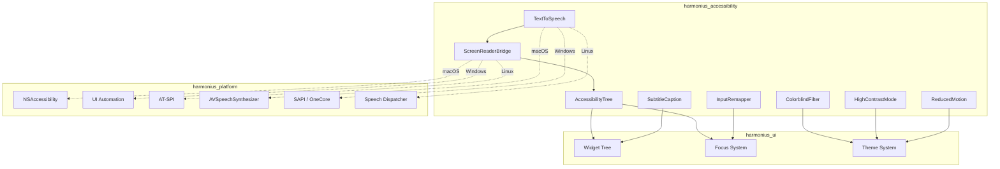
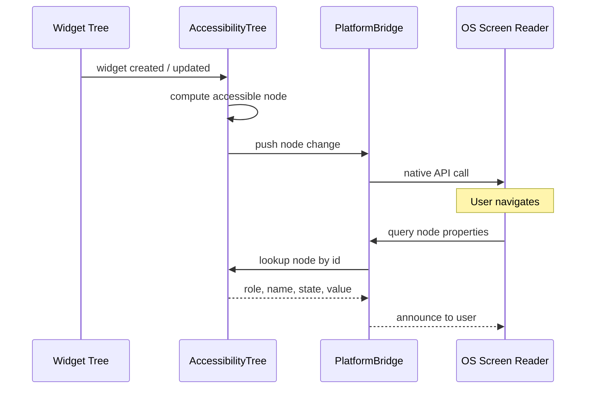
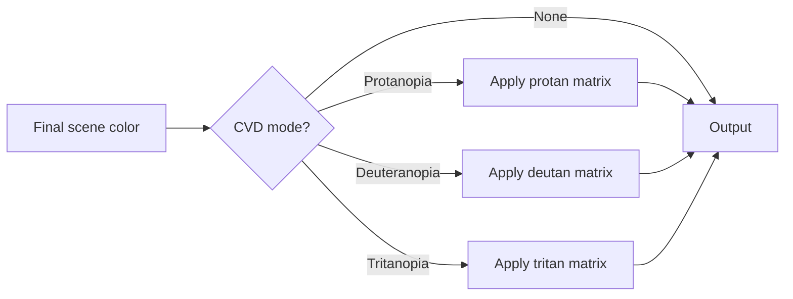
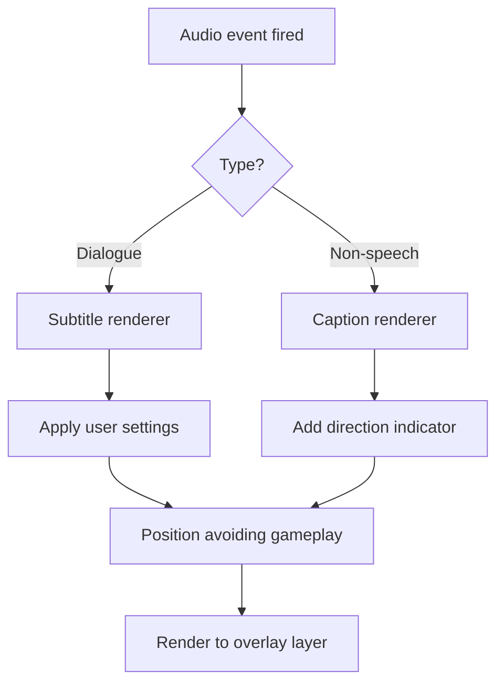
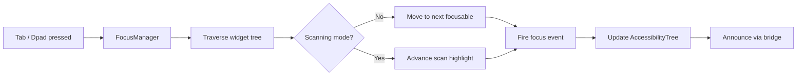

# Accessibility Design

## Requirements Trace

> **Canonical sources:** Features, requirements, and user stories are defined in
> [features/ui-2d/](../../features/ui-2d/), [requirements/ui-2d/](../../requirements/ui-2d/), and
> [user-stories/ui-2d/](../../user-stories/ui-2d/). The table below traces design elements to those
> definitions.

| Feature  | Requirement | User Story                         |
|----------|-------------|------------------------------------|
| F-10.6.1 | R-10.6.1    | US-10.6.1, US-10.6.2, US-10.6.3    |
| F-10.6.2 | R-10.6.2    | US-10.6.4, US-10.6.5, US-10.6.6    |
| F-10.6.3 | R-10.6.3    | US-10.6.7, US-10.6.8, US-10.6.9    |
| F-10.6.4 | R-10.6.4    | US-10.6.10, US-10.6.11, US-10.6.12 |
| F-10.6.5 | R-10.6.5    | US-10.6.13, US-10.6.14, US-10.6.15 |
| F-10.6.6 | R-10.6.6    | US-10.6.16, US-10.6.17, US-10.6.18 |
| F-10.6.7 | R-10.6.7    | US-10.6.19, US-10.6.20, US-10.6.21 |

1. **F-10.6.1** — Screen reader support
2. **F-10.6.2** — Subtitle and caption system
3. **F-10.6.3** — Colorblind modes
4. **F-10.6.4** — High contrast and scalable UI
5. **F-10.6.5** — Input remapping for accessibility
6. **F-10.6.6** — Text-to-speech for chat
7. **F-10.6.7** — WCAG 2.1 compliance

## Overview

The accessibility subsystem ensures the engine is usable by players with visual, auditory, motor,
and cognitive disabilities. Every accessibility feature is implemented as ECS components and
systems, integrated with the widget tree and theme system.

Core subsystems:

1. **Screen reader bridge** -- exposes widget tree to platform accessibility APIs (NSAccessibility,
   UI Automation, AT-SPI) with ARIA-like roles and live region announcements
2. **Colorblind filters** -- post-process color remapping for protanopia, deuteranopia, tritanopia,
   plus non-color alternative visual cues
3. **WCAG compliance** -- automated contrast checking, focus indicators, keyboard operability,
   timing adjustability
4. **Keyboard/controller navigation** -- full UI traversal without mouse, focus management, scanning
   mode for switch devices
5. **Text-to-speech** -- platform TTS integration for chat, notifications, and UI announcements
6. **Subtitle/caption system** -- configurable subtitles for dialogue, closed captions for
   non-speech audio with directional indicators
7. **Input remapping** -- complete rebinding, one-handed layouts, hold-to-toggle, per-character
   profiles
8. **High contrast mode** -- stark color pairs, increased borders, no decorative transparency
9. **Reduced motion** -- disables or slows animations for vestibular sensitivity

## Architecture

### Module Boundaries



```text
harmonius_accessibility/
├── tree/
│   ├── node.rs         # AccessibleNode, Role,
│   │                   # State, Property
│   ├── tree.rs         # AccessibilityTree,
│   │                   # diff/patch
│   └── live_region.rs  # LiveRegion announcements
├── bridge/
│   ├── mod.rs          # PlatformBridge trait
│   ├── windows.rs      # UI Automation bridge
│   ├── macos.rs        # NSAccessibility bridge
│   └── linux.rs        # AT-SPI bridge
├── visual/
│   ├── colorblind.rs   # ColorblindFilter, CVD
│   │                   # matrices
│   ├── contrast.rs     # ContrastChecker, WCAG
│   │                   # ratios
│   ├── high_contrast.rs # HighContrastMode theme
│   └── focus.rs        # FocusIndicator rendering
├── audio/
│   ├── tts.rs          # TextToSpeech, platform
│   │                   # dispatch
│   ├── subtitles.rs    # SubtitleRenderer
│   └── captions.rs     # CaptionSystem, direction
│                       # indicators
├── input/
│   ├── remapper.rs     # InputRemapper, profiles
│   ├── scanning.rs     # ScanningNavigation for
│   │                   # switch devices
│   └── hold_toggle.rs  # HoldToToggle conversion
└── motion/
    └── reduced.rs      # ReducedMotion settings
```

### Screen Reader Data Flow



### Colorblind Filter Pipeline



### Subtitle Layout Flow



### Focus Navigation Order



### Core Data Structures

```mermaid
classDiagram
    class AccessibleRole {
        <<enumeration>>
        Button
        Checkbox
        Slider
        TextInput
        Dialog
        ProgressBar
        None
    }

    class AccessibleState {
        <<enumeration>>
        Checked
        Unchecked
        Expanded
        Collapsed
        Selected
        Disabled
    }

    class LiveRegionMode {
        <<enumeration>>
        Polite
        Assertive
        Off
    }

    class AccessibleProperties {
        +label String
        +description Option~String~
        +value Option~String~
        +value_min Option~f32~
        +value_max Option~f32~
        +live Option~LiveRegionMode~
    }

    class AccessibleNode {
        +entity Entity
        +role AccessibleRole
        +states Vec~AccessibleState~
        +properties AccessibleProperties
        +children Vec~Entity~
        +parent Option~Entity~
    }

    class AccessibilityTree {
        -nodes HashMap
        -root Entity
        -dirty Vec~Entity~
        +sync(widget_tree)
        +get(entity) Option~AccessibleNode~
        +set_states(entity, states)
        +announce(entity, message, mode)
        +drain_dirty() Vec~AccessibleNode~
        +set_focus(entity)
    }

    class ScreenReaderBridge {
        +push_changes(nodes)
        +notify_focus_change(entity)
        +announce(message, mode)
        +is_screen_reader_active() bool
    }

    class ColorVisionDeficiency {
        <<enumeration>>
        None
        Protanopia
        Deuteranopia
        Tritanopia
    }

    class ColorblindFilter {
        +mode ColorVisionDeficiency
        +severity f32
        +correction bool
        +color_matrix() mat3
    }

    class ContrastChecker {
        +relative_luminance(color) f32
        +contrast_ratio(fg, bg) f32
        +check(fg, bg) ContrastResult
    }

    class ContrastResult {
        +ratio f32
        +passes_aa_normal bool
        +passes_aa_large bool
        +passes_aaa_normal bool
    }

    class HighContrastSettings {
        +enabled bool
        +foreground Color
        +background Color
        +border Color
        +focus Color
        +border_width f32
        +remove_decorative bool
    }

    class UiScaleSettings {
        +user_scale f32
        +system_dpi_scale f32
        +effective_scale f32
    }

    class FocusDirection {
        <<enumeration>>
        Next
        Previous
        Up
        Down
        Left
        Right
    }

    class FocusManager {
        -current_focus Option~Entity~
        -scanning_mode bool
        +navigate(direction, tree) Option~Entity~
        +set_focus(entity)
        +enable_scanning(interval_ms)
    }

    class InputSource {
        <<enumeration>>
        Key
        MouseButton
        GamepadButton
        GamepadAxis
    }

    class InputRemapper {
        -profiles Vec~InputProfile~
        +load_profile(id) Result
        +rebind(action, source)
        +set_hold_toggle(action, enabled)
    }

    class TextToSpeech {
        +speak(text, config)
        +stop()
        +is_speaking() bool
        +available_voices() Vec~String~
    }

    class ChatChannel {
        <<enumeration>>
        Party
        Guild
        Whisper
        Global
        System
        Combat
    }

    class SubtitlePosition {
        <<enumeration>>
        BottomCenter
        TopCenter
        BottomLeft
        Custom
    }

    class SubtitleRenderer {
        -settings SubtitleSettings
        +show_subtitle(entry)
        +show_caption(entry)
        +update(dt)
    }

    class CaptionDirection {
        <<enumeration>>
        Left
        Right
        Above
        Below
        Behind
        Front
    }

    class CaptionPriority {
        <<enumeration>>
        Critical
        Normal
        Low
    }

    class ReducedMotionSettings {
        +enabled bool
        +animation_scale f32
        +disable_parallax bool
        +disable_camera_shake bool
    }

    class AccessibilitySettings {
        +colorblind ColorblindFilter
        +high_contrast HighContrastSettings
        +ui_scale UiScaleSettings
        +subtitles SubtitleSettings
        +reduced_motion ReducedMotionSettings
    }

    AccessibleNode --> AccessibleRole
    AccessibleNode --> AccessibleState
    AccessibleNode --> AccessibleProperties
    AccessibleProperties --> LiveRegionMode
    AccessibilityTree *-- AccessibleNode
    ScreenReaderBridge --> AccessibilityTree
    ColorblindFilter --> ColorVisionDeficiency
    ContrastChecker ..> ContrastResult
    FocusManager --> FocusDirection
    InputRemapper --> InputSource
    TextToSpeech --> ChatChannel
    SubtitleRenderer --> SubtitlePosition
    AccessibilitySettings --> ColorblindFilter
    AccessibilitySettings --> HighContrastSettings
    AccessibilitySettings --> UiScaleSettings
    AccessibilitySettings --> ReducedMotionSettings
```



## API Design

### Accessibility Node

```rust
/// Accessible role for a widget, modeled after
/// WAI-ARIA roles. Determines how the screen
/// reader announces the element.
#[derive(Clone, Copy, Debug, PartialEq, Eq, Reflect)]
pub enum AccessibleRole {
    Button,
    Checkbox,
    Radio,
    Slider,
    TextInput,
    ListItem,
    Menu,
    MenuItem,
    Tab,
    TabPanel,
    Dialog,
    Alert,
    Tooltip,
    ProgressBar,
    ScrollBar,
    Tree,
    TreeItem,
    Grid,
    GridCell,
    Image,
    Label,
    Group,
    Separator,
    /// Non-interactive container. Not announced.
    None,
}

/// Accessible states that convey widget condition
/// to assistive technology.
#[derive(Clone, Copy, Debug, PartialEq, Eq, Reflect)]
pub enum AccessibleState {
    Checked,
    Unchecked,
    Indeterminate,
    Expanded,
    Collapsed,
    Selected,
    Disabled,
    ReadOnly,
    Required,
    Invalid,
    Pressed,
    Busy,
}

/// Properties attached to an accessible node.
#[derive(Clone, Debug, Reflect)]
pub struct AccessibleProperties {
    /// Human-readable label (required for all
    /// interactive elements).
    pub label: String,
    /// Extended description for complex widgets.
    pub description: Option<String>,
    /// Current value for sliders, progress bars.
    pub value: Option<String>,
    /// Numeric range for sliders.
    pub value_min: Option<f32>,
    pub value_max: Option<f32>,
    pub value_now: Option<f32>,
    /// Keyboard shortcut hint text.
    pub shortcut: Option<String>,
    /// Live region politeness for dynamic updates.
    pub live: Option<LiveRegionMode>,
}

/// How urgently a live region change should be
/// announced.
#[derive(Clone, Copy, Debug, PartialEq, Eq, Reflect)]
pub enum LiveRegionMode {
    /// Announce only when the user is idle.
    Polite,
    /// Interrupt current speech immediately.
    Assertive,
    /// Do not announce (log only).
    Off,
}

/// A node in the accessibility tree.
/// One AccessibleNode per interactive or
/// semantically meaningful widget.
#[derive(Clone, Debug, Reflect)]
pub struct AccessibleNode {
    /// Unique ID matching the widget entity.
    pub entity: Entity,
    pub role: AccessibleRole,
    pub states: Vec<AccessibleState>,
    pub properties: AccessibleProperties,
    /// Ordered child node IDs for tree traversal.
    pub children: Vec<Entity>,
    /// Parent node ID.
    pub parent: Option<Entity>,
}
```

### Accessibility Tree

```rust
/// The accessibility tree mirrors the widget tree
/// but contains only semantically relevant nodes.
/// Updated each frame by diffing against the
/// widget tree.
pub struct AccessibilityTree {
    nodes: HashMap<Entity, AccessibleNode>,
    root: Entity,
    /// Dirty nodes needing platform push.
    dirty: Vec<Entity>,
}

impl AccessibilityTree {
    pub fn new(root: Entity) -> Self;

    /// Sync the accessibility tree with the current
    /// widget tree state. Computes a minimal diff
    /// and marks changed nodes dirty.
    pub fn sync(&mut self, widget_tree: &WidgetTree);

    /// Get a node by entity.
    pub fn get(
        &self, entity: Entity,
    ) -> Option<&AccessibleNode>;

    /// Update a node's states (e.g., checked ->
    /// unchecked). Marks dirty.
    pub fn set_states(
        &mut self,
        entity: Entity,
        states: Vec<AccessibleState>,
    );

    /// Announce a live region change.
    pub fn announce(
        &mut self,
        entity: Entity,
        message: &str,
        mode: LiveRegionMode,
    );

    /// Drain dirty nodes for platform push.
    pub fn drain_dirty(
        &mut self,
    ) -> Vec<AccessibleNode>;

    /// Focus changed — notify the tree so the
    /// bridge can announce the new focus.
    pub fn set_focus(&mut self, entity: Entity);
}
```

### Platform Bridge

```rust
/// Platform-specific accessibility bridge.
/// Each platform implements this trait to
/// communicate with the native screen reader.
/// Selected at compile time via cfg attributes
/// -- no dynamic dispatch.
pub struct ScreenReaderBridge {
    // Platform-specific internals
}

impl ScreenReaderBridge {
    pub fn new() -> Self;

    /// Push a batch of changed nodes to the
    /// platform accessibility API.
    pub fn push_changes(
        &mut self,
        nodes: &[AccessibleNode],
    );

    /// Notify the platform that focus moved.
    pub fn notify_focus_change(
        &mut self, entity: Entity,
    );

    /// Announce a live region message.
    pub fn announce(
        &mut self,
        message: &str,
        mode: LiveRegionMode,
    );

    /// Query whether a screen reader is active.
    pub fn is_screen_reader_active(&self) -> bool;
}

// Platform-specific implementations selected
// via cfg:
//
// #[cfg(target_os = "macos")]
//   -> NSAccessibility via Swift wrappers / C ABI
//
// #[cfg(target_os = "windows")]
//   -> UI Automation via windows-sys
//
// #[cfg(target_os = "linux")]
//   -> AT-SPI via D-Bus / zbus crate
```

### Colorblind Filter

```rust
/// Color vision deficiency type.
#[derive(Clone, Copy, Debug, PartialEq, Eq, Reflect)]
pub enum ColorVisionDeficiency {
    None,
    /// Red-blind (~1% of males).
    Protanopia,
    /// Green-blind (~6% of males).
    Deuteranopia,
    /// Blue-blind (~0.01% of population).
    Tritanopia,
}

/// Colorblind simulation/correction filter.
/// Applied as a post-process pass.
#[derive(Clone, Debug, Reflect)]
pub struct ColorblindFilter {
    pub mode: ColorVisionDeficiency,
    /// Severity from 0.0 (none) to 1.0 (full).
    pub severity: f32,
    /// Whether to show correction (enhance
    /// differences) or simulation (show how
    /// CVD users see the scene).
    pub correction: bool,
}

impl ColorblindFilter {
    /// Get the 3x3 color transformation matrix
    /// for the current CVD mode and severity.
    pub fn color_matrix(&self) -> [[f32; 3]; 3] {
        match self.mode {
            ColorVisionDeficiency::None => {
                IDENTITY_MATRIX
            }
            ColorVisionDeficiency::Protanopia => {
                lerp_matrix(
                    &IDENTITY_MATRIX,
                    &PROTAN_MATRIX,
                    self.severity,
                )
            }
            ColorVisionDeficiency::Deuteranopia => {
                lerp_matrix(
                    &IDENTITY_MATRIX,
                    &DEUTAN_MATRIX,
                    self.severity,
                )
            }
            ColorVisionDeficiency::Tritanopia => {
                lerp_matrix(
                    &IDENTITY_MATRIX,
                    &TRITAN_MATRIX,
                    self.severity,
                )
            }
        }
    }
}

/// Constant CVD simulation matrices based on
/// Brettel, Vienot, and Mollon (1997).
const PROTAN_MATRIX: [[f32; 3]; 3] = [
    [0.152286, 1.052583, -0.204868],
    [0.114503, 0.786281,  0.099216],
    [-0.003882, -0.048116, 1.051998],
];

const DEUTAN_MATRIX: [[f32; 3]; 3] = [
    [0.367322, 0.860646, -0.227968],
    [0.280085, 0.672501,  0.047413],
    [-0.011820, 0.042940,  0.968881],
];

const TRITAN_MATRIX: [[f32; 3]; 3] = [
    [1.255528, -0.076749, -0.178779],
    [-0.078411, 0.930809,  0.147602],
    [0.004733, 0.691367,  0.303900],
];

/// Alternative visual cue for a color-coded
/// gameplay element. Provides non-color
/// differentiation.
#[derive(Clone, Debug, Reflect)]
pub struct AlternativeCue {
    /// Pattern overlay texture.
    pub pattern: Option<AssetId>,
    /// Shape icon to display alongside color.
    pub shape_icon: Option<AssetId>,
    /// Text label as fallback.
    pub label: Option<String>,
}
```

### WCAG Contrast Checking

```rust
/// WCAG 2.1 contrast ratio requirements.
#[derive(Clone, Copy, Debug, PartialEq, Eq, Reflect)]
pub enum WcagLevel {
    /// 4.5:1 normal text, 3:1 large text.
    AA,
    /// 7:1 normal text, 4.5:1 large text.
    AAA,
}

/// Result of a contrast check.
#[derive(Clone, Copy, Debug)]
pub struct ContrastResult {
    pub ratio: f32,
    pub passes_aa_normal: bool,
    pub passes_aa_large: bool,
    pub passes_aaa_normal: bool,
    pub passes_aaa_large: bool,
}

/// Contrast checking utilities per WCAG 2.1.
pub struct ContrastChecker;

impl ContrastChecker {
    /// Compute relative luminance of a color
    /// per WCAG 2.1 definition.
    pub fn relative_luminance(
        color: Color,
    ) -> f32 {
        let r = linearize(color.r);
        let g = linearize(color.g);
        let b = linearize(color.b);
        0.2126 * r + 0.7152 * g + 0.0722 * b
    }

    /// Compute contrast ratio between two colors.
    /// Returns a value >= 1.0 (1:1 = identical).
    pub fn contrast_ratio(
        fg: Color, bg: Color,
    ) -> f32 {
        let l1 = Self::relative_luminance(fg);
        let l2 = Self::relative_luminance(bg);
        let lighter = l1.max(l2);
        let darker = l1.min(l2);
        (lighter + 0.05) / (darker + 0.05)
    }

    /// Check a color pair against WCAG levels.
    pub fn check(
        fg: Color, bg: Color,
    ) -> ContrastResult {
        let ratio = Self::contrast_ratio(fg, bg);
        ContrastResult {
            ratio,
            passes_aa_normal: ratio >= 4.5,
            passes_aa_large: ratio >= 3.0,
            passes_aaa_normal: ratio >= 7.0,
            passes_aaa_large: ratio >= 4.5,
        }
    }
}

/// Linearize an sRGB channel value for
/// luminance calculation.
fn linearize(c: f32) -> f32 {
    if c <= 0.04045 {
        c / 12.92
    } else {
        ((c + 0.055) / 1.055).powf(2.4)
    }
}
```

### High Contrast Mode

```rust
/// High-contrast theme overrides. When active,
/// replaces the normal theme with stark
/// foreground/background pairs.
#[derive(Clone, Debug, Reflect)]
pub struct HighContrastSettings {
    pub enabled: bool,
    /// Foreground text color.
    pub foreground: Color,
    /// Background color.
    pub background: Color,
    /// Border color for interactive elements.
    pub border: Color,
    /// Focus indicator color.
    pub focus: Color,
    /// Minimum border width in logical pixels.
    pub border_width: f32,
    /// Remove decorative transparency and
    /// gradients.
    pub remove_decorative: bool,
}

impl Default for HighContrastSettings {
    fn default() -> Self {
        Self {
            enabled: false,
            foreground: Color::WHITE,
            background: Color::BLACK,
            border: Color::from_rgb(
                0.0, 1.0, 1.0,
            ),
            focus: Color::from_rgb(
                1.0, 1.0, 0.0,
            ),
            border_width: 3.0,
            remove_decorative: true,
        }
    }
}

/// UI scale settings. Integrates with platform
/// DPI and text scale preferences.
#[derive(Clone, Debug, Reflect)]
pub struct UiScaleSettings {
    /// User-configured scale factor (0.8..2.5).
    pub user_scale: f32,
    /// System DPI scale detected from platform.
    pub system_dpi_scale: f32,
    /// Effective scale = user_scale * system_dpi.
    pub effective_scale: f32,
}

impl UiScaleSettings {
    pub fn new() -> Self;

    /// Detect system DPI scale from platform APIs.
    pub fn detect_system_scale() -> f32;

    /// Set user scale. Clamped to 0.8..2.5.
    pub fn set_user_scale(&mut self, scale: f32);

    /// Recompute effective scale.
    pub fn update(&mut self) {
        self.effective_scale =
            self.user_scale * self.system_dpi_scale;
    }
}
```

### Focus and Keyboard Navigation

```rust
/// Focus navigation direction.
#[derive(Clone, Copy, Debug, PartialEq, Eq)]
pub enum FocusDirection {
    Next,
    Previous,
    Up,
    Down,
    Left,
    Right,
}

/// Focus indicator style for the currently
/// focused widget.
#[derive(Clone, Debug, Reflect)]
pub struct FocusIndicator {
    pub color: Color,
    pub width: f32,
    pub offset: f32,
    pub corner_radius: f32,
    /// Animation pulse (0 = static, 1 = strong).
    pub pulse_intensity: f32,
}

/// Manages focus traversal through the widget
/// tree. Supports tab order, directional
/// navigation, and switch-device scanning.
pub struct FocusManager {
    current_focus: Option<Entity>,
    focus_order: Vec<Entity>,
    scanning_mode: bool,
    scan_index: usize,
    scan_timer: f32,
}

impl FocusManager {
    pub fn new() -> Self;

    /// Move focus in the given direction.
    pub fn navigate(
        &mut self,
        direction: FocusDirection,
        tree: &AccessibilityTree,
    ) -> Option<Entity>;

    /// Set focus to a specific entity.
    pub fn set_focus(&mut self, entity: Entity);

    /// Get currently focused entity.
    pub fn current_focus(&self) -> Option<Entity>;

    /// Enable scanning mode for switch devices.
    /// Focus auto-advances at scan_interval.
    pub fn enable_scanning(
        &mut self, scan_interval_ms: u32,
    );

    /// Disable scanning mode.
    pub fn disable_scanning(&mut self);

    /// Advance scan to next element (called by
    /// switch device input).
    pub fn scan_advance(&mut self);

    /// Activate the currently scanned element.
    pub fn scan_activate(&mut self) -> Option<Entity>;

    /// Rebuild focus order from the widget tree.
    pub fn rebuild_order(
        &mut self, tree: &AccessibilityTree,
    );
}
```

### Input Remapping

```rust
/// An input binding profile that can be saved
/// and loaded per character.
#[derive(Clone, Debug, Reflect)]
pub struct InputProfile {
    pub name: String,
    /// Character ID this profile is bound to.
    /// None = global default.
    pub character_id: Option<u64>,
    pub bindings: Vec<InputBinding>,
    /// Hold-to-toggle conversions.
    pub hold_toggles: Vec<HoldToggle>,
}

/// A single input binding mapping a physical
/// input to an action.
#[derive(Clone, Debug, Reflect)]
pub struct InputBinding {
    pub action: ActionId,
    pub primary: InputSource,
    pub secondary: Option<InputSource>,
}

/// Physical input source.
#[derive(Clone, Debug, Reflect)]
pub enum InputSource {
    Key(KeyCode),
    MouseButton(MouseButton),
    GamepadButton(GamepadButton),
    GamepadAxis {
        axis: GamepadAxis,
        direction: AxisDirection,
    },
}

/// Converts a sustained hold input into a
/// toggle (press once to activate, press again
/// to deactivate).
#[derive(Clone, Debug, Reflect)]
pub struct HoldToggle {
    pub action: ActionId,
    pub enabled: bool,
}

/// Manages multiple input profiles with
/// per-character storage.
/// **Note:** `InputRemapper` should compose with the
/// engine's core input binding system (see
/// [devices-actions.md](../input/devices-actions.md))
/// rather than implementing a parallel remapping
/// layer. Accessibility remapping inserts overrides
/// into the existing action mapping pipeline.
pub struct InputRemapper {
    profiles: Vec<InputProfile>,
    active_profile: usize,
}

impl InputRemapper {
    pub fn new() -> Self;

    /// Load a profile by character ID.
    pub fn load_profile(
        &mut self, character_id: u64,
    ) -> Result<(), RemapError>;

    /// Save the active profile.
    pub fn save_profile(
        &self,
    ) -> Result<(), RemapError>;

    /// Rebind an action to a new input source.
    pub fn rebind(
        &mut self,
        action: ActionId,
        source: InputSource,
        is_secondary: bool,
    );

    /// Enable hold-to-toggle for an action.
    pub fn set_hold_toggle(
        &mut self,
        action: ActionId,
        enabled: bool,
    );

    /// Get the active profile.
    pub fn active_profile(
        &self,
    ) -> &InputProfile;

    /// List all available profiles.
    pub fn list_profiles(
        &self,
    ) -> &[InputProfile];
}
```

**Note:** Text-to-speech uses a shared platform TTS service (see also
[ai-governance.md](../tools/ai-governance.md)). A single `TextToSpeech` abstraction should serve
both accessibility and AI assistant use cases.

### Text-to-Speech

```rust
/// TTS voice configuration.
#[derive(Clone, Debug, Reflect)]
pub struct TtsVoiceConfig {
    /// Platform voice identifier.
    pub voice_id: String,
    /// Speech rate multiplier (0.5..3.0).
    pub rate: f32,
    /// Volume (0.0..1.0).
    pub volume: f32,
    /// Pitch adjustment (-1.0..1.0).
    pub pitch: f32,
}

/// Per-channel TTS settings.
#[derive(Clone, Debug, Reflect)]
pub struct TtsChannelConfig {
    pub channel: ChatChannel,
    pub enabled: bool,
    pub voice: TtsVoiceConfig,
}

/// Chat channel for TTS filtering.
#[derive(Clone, Copy, Debug, PartialEq, Eq, Reflect)]
pub enum ChatChannel {
    Party,
    Guild,
    Whisper,
    Global,
    System,
    Combat,
}

/// Text-to-speech engine wrapping platform APIs.
/// Selected at compile time via cfg.
pub struct TextToSpeech {
    // Platform-specific TTS backend
}

impl TextToSpeech {
    pub fn new() -> Self;

    /// Speak a message using the configured voice.
    pub fn speak(
        &self,
        text: &str,
        config: &TtsVoiceConfig,
    );

    /// Speak a message with channel routing.
    pub fn speak_channel(
        &self,
        text: &str,
        channel: ChatChannel,
        channel_configs: &[TtsChannelConfig],
    );

    /// Stop current speech immediately.
    pub fn stop(&self);

    /// Check if speech is currently playing.
    pub fn is_speaking(&self) -> bool;

    /// List available platform voices.
    pub fn available_voices(
        &self,
    ) -> Vec<String>;
}

// Platform backends:
//
// #[cfg(target_os = "macos")]
//   -> AVSpeechSynthesizer via Swift / C ABI
//
// #[cfg(target_os = "windows")]
//   -> SAPI / OneCore via windows-sys
//
// #[cfg(target_os = "linux")]
//   -> Speech Dispatcher via C FFI / bindgen
```

### Subtitle and Caption System

```rust
/// Subtitle display configuration. All
/// properties are player-configurable.
#[derive(Clone, Debug, Reflect)]
pub struct SubtitleSettings {
    pub enabled: bool,
    /// Font size in logical pixels.
    pub font_size: f32,
    /// Text color.
    pub text_color: Color,
    /// Background panel color and opacity.
    pub background_color: Color,
    pub background_opacity: f32,
    /// Show speaker name before dialogue.
    pub show_speaker: bool,
    /// Maximum lines visible at once.
    pub max_lines: u32,
    /// Display duration multiplier.
    pub speed: f32,
    /// Screen position.
    pub position: SubtitlePosition,
}

/// Where subtitles appear on screen.
#[derive(Clone, Copy, Debug, PartialEq, Eq, Reflect)]
pub enum SubtitlePosition {
    BottomCenter,
    TopCenter,
    BottomLeft,
    Custom { x: f32, y: f32 },
}

/// A subtitle entry to display.
#[derive(Clone, Debug, Reflect)]
pub struct SubtitleEntry {
    /// Speaker name for identification.
    pub speaker: Option<String>,
    /// Subtitle text content.
    pub text: String,
    /// Start time relative to audio clip.
    pub start_time: f32,
    /// End time relative to audio clip.
    pub end_time: f32,
}

/// Closed caption for non-speech audio.
#[derive(Clone, Debug, Reflect)]
pub struct CaptionEntry {
    /// Description of the sound.
    pub text: String,
    /// Direction the sound originates from,
    /// relative to the listener.
    pub direction: Option<CaptionDirection>,
    /// Display start time.
    pub start_time: f32,
    /// Display end time.
    pub end_time: f32,
    /// Importance level (filters low-priority
    /// ambient sounds).
    pub priority: CaptionPriority,
}

/// Directional indicator for closed captions.
#[derive(Clone, Copy, Debug, PartialEq, Eq, Reflect)]
pub enum CaptionDirection {
    Left,
    Right,
    Above,
    Below,
    Behind,
    Front,
}

/// Caption importance level for filtering.
#[derive(Clone, Copy, Debug, PartialEq, Eq, Reflect)]
pub enum CaptionPriority {
    /// Always shown (explosions, alerts).
    Critical,
    /// Shown by default (footsteps, doors).
    Normal,
    /// Optional (ambient wind, birds).
    Low,
}

/// The subtitle renderer manages display timing,
/// formatting, and safe-area positioning.
pub struct SubtitleRenderer {
    settings: SubtitleSettings,
    active_subtitles: Vec<SubtitleEntry>,
    active_captions: Vec<CaptionEntry>,
}

impl SubtitleRenderer {
    pub fn new(settings: SubtitleSettings) -> Self;

    /// Queue a subtitle for display.
    pub fn show_subtitle(
        &mut self, entry: SubtitleEntry,
    );

    /// Queue a closed caption for display.
    pub fn show_caption(
        &mut self, entry: CaptionEntry,
    );

    /// Update timing — remove expired entries,
    /// advance display. Called each frame.
    pub fn update(&mut self, dt: f32);

    /// Get entries currently visible for
    /// rendering.
    pub fn visible_subtitles(
        &self,
    ) -> &[SubtitleEntry];

    pub fn visible_captions(
        &self,
    ) -> &[CaptionEntry];

    /// Update settings (user changed preferences).
    pub fn set_settings(
        &mut self, settings: SubtitleSettings,
    );
}
```

### Reduced Motion

```rust
/// Reduced motion settings for vestibular
/// sensitivity.
#[derive(Clone, Debug, Reflect)]
pub struct ReducedMotionSettings {
    pub enabled: bool,
    /// Animation speed multiplier when enabled
    /// (0.0 = no animation, 0.5 = half speed).
    pub animation_scale: f32,
    /// Disable parallax scrolling effects.
    pub disable_parallax: bool,
    /// Disable camera shake.
    pub disable_camera_shake: bool,
    /// Disable screen effects (flash, bloom
    /// pulse, screen shake).
    pub disable_screen_effects: bool,
}

impl Default for ReducedMotionSettings {
    fn default() -> Self {
        Self {
            enabled: false,
            animation_scale: 0.0,
            disable_parallax: true,
            disable_camera_shake: true,
            disable_screen_effects: true,
        }
    }
}

impl ReducedMotionSettings {
    /// Detect system reduced-motion preference.
    /// macOS: NSWorkspace
    ///   .accessibilityDisplayShouldReduceMotion
    /// Windows: SPI_GETCLIENTAREAANIMATION
    /// Linux: gtk-enable-animations / prefers-
    ///   reduced-motion media query
    pub fn detect_system_preference() -> bool;
}
```

### Accessibility Settings Resource

```rust
/// Top-level accessibility settings. Stored as
/// an ECS resource. All settings are configurable
/// through the visual settings editor (no code).
#[derive(Clone, Debug, Reflect)]
pub struct AccessibilitySettings {
    pub colorblind: ColorblindFilter,
    pub high_contrast: HighContrastSettings,
    pub ui_scale: UiScaleSettings,
    pub subtitles: SubtitleSettings,
    pub reduced_motion: ReducedMotionSettings,
    pub tts_channels: Vec<TtsChannelConfig>,
    pub scanning_interval_ms: u32,
    pub focus_indicator: FocusIndicator,
}

impl AccessibilitySettings {
    /// Load from serialized user preferences.
    pub fn load(
        path: &str,
    ) -> Result<Self, AccessibilityError>;

    /// Save to serialized user preferences.
    pub fn save(
        &self, path: &str,
    ) -> Result<(), AccessibilityError>;

    /// Apply OS-level accessibility preferences
    /// (DPI, reduced motion, high contrast).
    pub fn apply_system_preferences(
        &mut self,
    );
}
```

## Data Flow

### Frame Lifecycle

The accessibility subsystem runs these ECS systems each frame:

1. **AccessibilityTreeSyncSystem** -- diff widget tree against accessibility tree, mark dirty nodes
2. **FocusNavigationSystem** -- process tab/dpad input, advance scanning timer, update focus
3. **ScreenReaderPushSystem** -- drain dirty nodes, push to platform bridge, announce live regions
4. **SubtitleUpdateSystem** -- advance subtitle/ caption timers, expire old entries
5. **SubtitleRenderSystem** -- render visible subtitles and captions to overlay layer
6. **ColorblindFilterSystem** -- apply CVD color matrix as post-process pass (if enabled)
7. **HighContrastSystem** -- apply theme overrides when high contrast is active
8. **ReducedMotionSystem** -- suppress or slow animations and effects when enabled

### Accessibility Tree Sync

On each frame, the sync system:

1. Walk the widget tree depth-first
2. For each widget with an `AccessibleRole`:
   - If new: create `AccessibleNode`, mark dirty
   - If changed (label, state, value): update node, mark dirty
   - If removed: remove node, mark dirty
3. Rebuild child/parent relationships
4. Dirty nodes are drained by the bridge push system

### High Contrast Theme Application

When `HighContrastSettings.enabled` is true:

1. The `HighContrastSystem` overrides the active theme resource with high-contrast values
2. All widgets re-resolve their colors from the overridden theme
3. Border widths increase to `border_width`
4. Decorative transparency and gradients are replaced with solid fills
5. Focus indicators use the high-contrast `focus` color

### Platform DPI Integration

| Platform | API | Access Method |
|----------|-----|---------------|
| Windows | `GetDpiForWindow` | windows-sys |
| macOS | `NSWindow.backingScaleFactor` | Swift / C ABI |
| Linux (X11) | `Xft.dpi` resource | xcb / bindgen |
| Linux (Wayland) | `wl_output.scale` | wayland-client / bindgen |

## Platform Considerations

### Screen Reader APIs

| Platform | API             | Access                  |
|----------|-----------------|-------------------------|
| macOS    | NSAccessibility | Swift wrappers / C ABI |
| Windows  | UI Automation   | windows-sys             |
| Linux    | AT-SPI          | D-Bus via zbus crate    |

1. **macOS** — VoiceOver; uses NSAccessibilityElement protocol
2. **Windows** — Narrator, JAWS, NVDA; COM-based provider model
3. **Linux** — Orca; AT-SPI2 over D-Bus IPC

### TTS APIs

| Platform | API | Access | Notes |
|----------|-----|--------|-------|
| macOS | AVSpeechSynthesizer | Swift wrappers / C ABI | AVFoundation; async speech callbacks |
| Windows | SAPI / OneCore | windows-sys | COM-based; OneCore for modern voices |
| Linux | Speech Dispatcher | C FFI / bindgen | spd_say / spd_set_voice |

### DPI and System Preferences

| Platform | DPI API                       |
|----------|-------------------------------|
| Windows  | `GetDpiForWindow`             |
| macOS    | `backingScaleFactor`          |
| Linux    | `Xft.dpi` / `wl_output.scale` |

1. **Windows** — `SystemParametersInfoW(SPI_GETHIGHCONTRAST)`
   - **Reduced Motion:** `SystemParametersInfoW(SPI_GETCLIENTAREAANIMATION)`
2. **macOS** — `accessibilityDisplayShouldIncreaseContrast`
   - **Reduced Motion:** `accessibilityDisplayShouldReduceMotion`
3. **Linux** — GTK high-contrast theme detection
   - **Reduced Motion:** `prefers-reduced-motion` via portal

### Proposed Dependencies

| Crate | Purpose | Justification |
|-------|---------|---------------|
| `zbus` | D-Bus IPC for AT-SPI on Linux | Pure Rust async D-Bus client |
| `windows-sys` | UI Automation, SAPI COM | Zero-cost Win32 FFI |
| `bindgen` | macOS NSAccessibility, AVSpeechSynthesizer | Consumes Swift @_cdecl C ABI |

## Test Plan

### Unit Tests

| Test                                 | Req      |
|--------------------------------------|----------|
| `test_accessible_node_creation`      | R-10.6.1 |
| `test_tree_sync_add_remove`          | R-10.6.1 |
| `test_live_region_announce`          | R-10.6.1 |
| `test_focus_tab_order`               | R-10.6.1 |
| `test_subtitle_timing`               | R-10.6.2 |
| `test_caption_direction`             | R-10.6.2 |
| `test_subtitle_settings`             | R-10.6.2 |
| `test_protan_matrix`                 | R-10.6.3 |
| `test_deutan_matrix`                 | R-10.6.3 |
| `test_tritan_matrix`                 | R-10.6.3 |
| `test_alternative_cues`              | R-10.6.3 |
| `test_contrast_ratio_aa`             | R-10.6.7 |
| `test_contrast_ratio_fail`           | R-10.6.7 |
| `test_high_contrast_borders`         | R-10.6.4 |
| `test_high_contrast_no_transparency` | R-10.6.4 |
| `test_ui_scale_80`                   | R-10.6.4 |
| `test_ui_scale_250`                  | R-10.6.4 |
| `test_rebind_all_actions`            | R-10.6.5 |
| `test_hold_toggle`                   | R-10.6.5 |
| `test_scanning_navigation`           | R-10.6.5 |
| `test_per_character_profile`         | R-10.6.5 |
| `test_tts_channel_filter`            | R-10.6.6 |
| `test_tts_volume_control`            | R-10.6.6 |
| `test_reduced_motion_no_shake`       | R-10.6.7 |
| `test_focus_indicator_visible`       | R-10.6.7 |

1. **`test_accessible_node_creation`** — Widget with role/label produces correct AccessibleNode
2. **`test_tree_sync_add_remove`** — Adding/removing widgets updates accessibility tree
3. **`test_live_region_announce`** — Live region change marked dirty with correct mode
4. **`test_focus_tab_order`** — Tab advances focus through all interactive widgets in order
5. **`test_subtitle_timing`** — Subtitle appears at start_time, disappears at end_time
6. **`test_caption_direction`** — Caption includes correct directional indicator
7. **`test_subtitle_settings`** — Changing font_size/color/position updates display
8. **`test_protan_matrix`** — Protanopia matrix transforms red to distinguishable hue
9. **`test_deutan_matrix`** — Deuteranopia matrix transforms green correctly
10. **`test_tritan_matrix`** — Tritanopia matrix transforms blue correctly
11. **`test_alternative_cues`** — Color-coded element has non-color cue attached
12. **`test_contrast_ratio_aa`** — White-on-black = 21:1, passes AA and AAA
13. **`test_contrast_ratio_fail`** — Light-gray-on-white < 4.5:1, fails AA normal
14. **`test_high_contrast_borders`** — High contrast mode increases border width to 3px
15. **`test_high_contrast_no_transparency`** — Decorative transparency removed in high contrast
16. **`test_ui_scale_80`** — All widgets scale correctly at 80%
17. **`test_ui_scale_250`** — All widgets scale correctly at 250% with no overflow
18. **`test_rebind_all_actions`** — Every action rebindable to a different key
19. **`test_hold_toggle`** — Hold-to-toggle activates on press, deactivates on next press
20. **`test_scanning_navigation`** — Scanning visits every interactive element
21. **`test_per_character_profile`** — Two character profiles load correct bindings
22. **`test_tts_channel_filter`** — TTS enabled on party only speaks party messages
23. **`test_tts_volume_control`** — Per-channel volume adjusts TTS output
24. **`test_reduced_motion_no_shake`** — Camera shake disabled when reduced motion active
25. **`test_focus_indicator_visible`** — Focus indicator renders on every focused widget

### Integration Tests

| Test                         | Req      |
|------------------------------|----------|
| `test_voiceover_macos`       | R-10.6.1 |
| `test_narrator_windows`      | R-10.6.1 |
| `test_orca_linux`            | R-10.6.1 |
| `test_subtitle_audio_sync`   | R-10.6.2 |
| `test_colorblind_preview`    | R-10.6.3 |
| `test_dpi_detection`         | R-10.6.4 |
| `test_switch_device_full_ui` | R-10.6.5 |
| `test_tts_platform_voices`   | R-10.6.6 |
| `test_wcag_all_screens`      | R-10.6.7 |

1. **`test_voiceover_macos`** — VoiceOver announces all widget types correctly on macOS
2. **`test_narrator_windows`** — Narrator announces all widget types correctly on Windows
3. **`test_orca_linux`** — Orca announces all widget types correctly on Linux
4. **`test_subtitle_audio_sync`** — Subtitles sync within 100ms of audio playback
5. **`test_colorblind_preview`** — CVD mode toggles in settings with real-time preview
6. **`test_dpi_detection`** — Engine reads correct DPI from each platform
7. **`test_switch_device_full_ui`** — Single-button scanning reaches every UI element
8. **`test_tts_platform_voices`** — TTS uses native voices on each platform
9. **`test_wcag_all_screens`** — All menu/settings screens pass WCAG AA audit

### Benchmarks

| Benchmark | Target | Source |
|-----------|--------|--------|
| Accessibility tree sync | < 0.5 ms for 200 widgets | US-10.6.2 |
| Platform bridge push | < 1 ms for 50 dirty nodes | US-10.6.2 |
| Contrast ratio check (1000 pairs) | < 0.1 ms | US-10.6.20 |
| Colorblind post-process pass | < 0.3 ms at 1080p | US-10.6.7 |
| TTS latency (message to speech) | < 200 ms | US-10.6.16 |

## Design Q & A

**Q1. What is the biggest constraint limiting this design?**

The platform-native API requirement (NSAccessibility, UI Automation, AT-SPI) forces three separate
bridge implementations with divergent data models and event semantics. Lifting this constraint would
allow a single cross-platform accessibility protocol, drastically reducing implementation and
testing effort. However, screen readers only work through native APIs, so abstracting away the
platform would break real assistive technology. The cost is high -- each bridge must map the widget
tree to a platform- specific accessibility tree -- but there is no alternative that preserves actual
screen reader compatibility.

**Q2. How can this design be improved?**

The colorblind filter (F-10.6.3) applies only as a post-process pass, meaning the preview in
settings shows the effect but game-specific UI elements (item rarity borders, team color indicators)
must have manually authored alternative cues. There is no automated system to flag widgets that rely
on color alone. Adding a WCAG colorblind linting pass to the theme system would catch violations at
edit time instead of requiring manual QA (US-10.6.9). The TTS system (R-10.6.6) also lacks message
queuing priorities, so rapid chat in MMO cities could overflow the speech buffer.

**Q3. Is there a better approach?**

An alternative is to embed an accessibility runtime like IAccessible2 or ARIA and let a
web-view-based overlay handle all accessibility. This is how Electron apps work. We rejected this
because it would require embedding a browser runtime, violating the no-frameworks constraint, and
would add significant memory and latency overhead. The native bridge approach is more work but
produces lower latency and tighter integration with the widget tree's ECS-backed data model.

**Q4. Does this design solve all customer problems?**

The design covers vision, hearing, and motor disabilities but does not address cognitive
accessibility. Features like simplified UI modes, reading level indicators, or step-by-step tutorial
overlays are absent. Adding a CognitiveAccessibility component with configurable complexity levels
would benefit players with learning disabilities. The design also lacks haptic-only feedback paths
for deafblind players, which could be addressed by mapping UI events to haptic patterns via F-6.4.1.

**Q5. Is this design cohesive with the overall engine?**

The accessibility system integrates tightly with the widget framework (F-10.1.1) through the
AccessibilityNode component that mirrors the widget tree. It uses the same cascading style system
for high-contrast themes and the same data binding system for TTS channel configuration. One gap is
that the 3D world-space UI panels (F-10.1.10) do not yet have a clear accessibility path -- screen
readers cannot navigate diegetic UI. Extending the accessibility bridge to flatten world-space
panels into the screen-space accessibility tree would improve cohesion.

## Open Questions

1. **AT-SPI D-Bus transport** -- Should the AT-SPI bridge use `zbus` (pure Rust, async) or the C
   `libatspi` library via bindgen? `zbus` avoids a C dependency but requires D-Bus protocol
   handling.
2. **Screen reader detection** -- How to detect whether a screen reader is active at launch? Windows
   has `SystemParametersInfoW(SPI_GETSCREENREADER)`. macOS has `NSWorkspace.isVoiceOverEnabled`.
   Linux requires querying the AT-SPI bus.
3. **STT integration** -- Speech-to-text for outgoing chat depends on platform availability. macOS
   has `SFSpeechRecognizer`, Windows has `Windows.Media.SpeechRecognition`. Linux has no standard
   STT API -- may need an optional dependency on Whisper or Vosk.
4. **Colorblind filter scope** -- Should the CVD post-process apply to the full scene (including 3D)
   or only to UI elements? Full-scene is simpler but more expensive; UI-only misses
   gameplay-critical world colors.
5. **WCAG automated audit tooling** -- Should the engine include a built-in contrast audit tool in
   the editor, or rely on external audit scripts? Built-in provides faster feedback for designers.
6. **Caption localization** -- Non-speech audio descriptions ("footsteps", "explosion") need
   localization. Should captions use the same localization pipeline as UI text, or a separate
   caption-specific string table?
