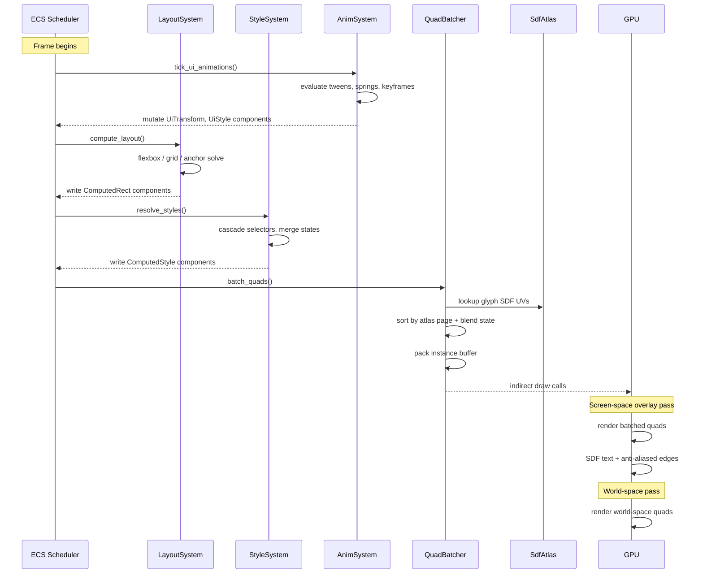
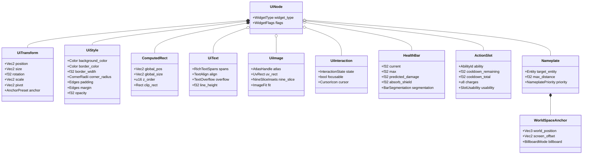
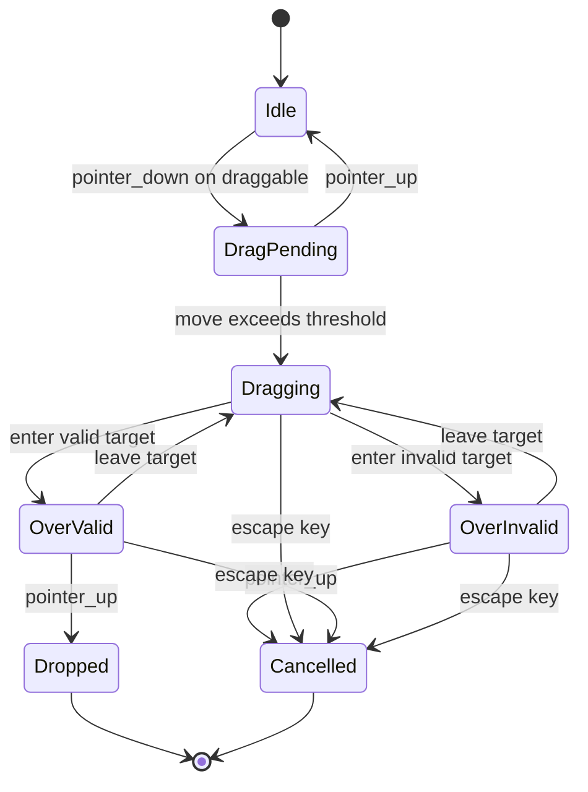
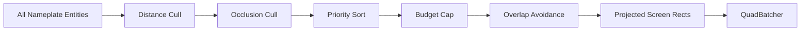
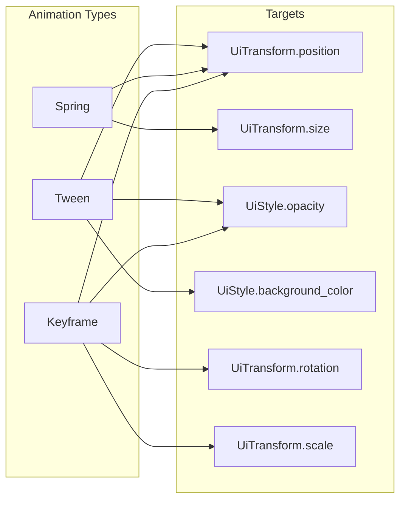
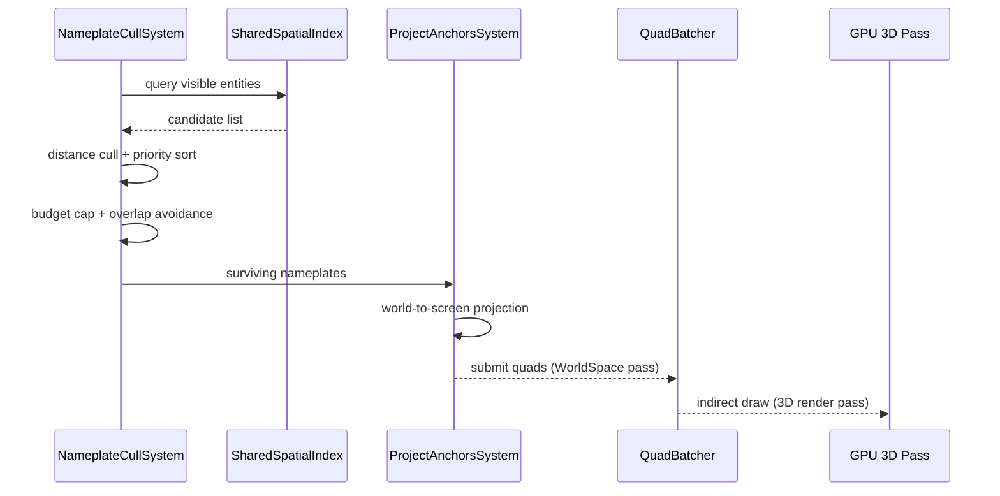
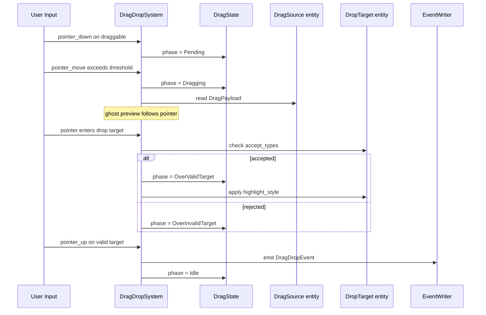
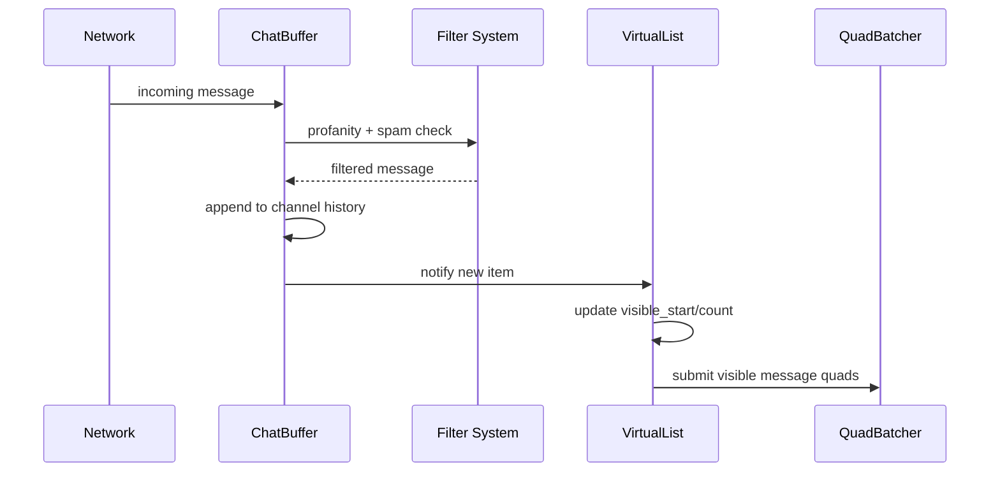

# HUD, Common Widgets & UI Rendering Design

## Requirements Trace

> **Canonical sources:** Features, requirements, and user stories are defined in
> [features/ui-2d/](../../features/ui-2d/), [requirements/ui-2d/](../../requirements/ui-2d/), and
> [user-stories/ui-2d/](../../user-stories/ui-2d/). The table below traces design elements to those
> definitions.

### Common Widgets (F-10.2 / R-10.2)

| Feature | Requirement | Description |
|---------|-------------|-------------|
| F-10.2.1 | R-10.2.1 | Rich text with inline formatting, icons, hyperlinks, HarfBuzz shaping, BiDi |
| F-10.2.2 | R-10.2.2 | Text input with IME, clipboard, undo/redo, zero dropped characters |
| F-10.2.3 | R-10.2.3 | Buttons, sliders, toggles, checkboxes, radio buttons, spin boxes |
| F-10.2.4 | R-10.2.4 | Dropdown / combo box with search filtering and dynamic options |
| F-10.2.5 | R-10.2.5 | Virtualized scroll views with inertial scrolling, variable-height items |
| F-10.2.6 | R-10.2.6 | Tooltips, context menus, modal dialogs with z-ordering and stacking |
| F-10.2.7 | R-10.2.7 | Drag and drop with ghost preview, drop target highlight, stack splitting |
| F-10.2.8 | R-10.2.8 | Progress bars (linear, circular, segmented), loading spinners |

### HUD & Game UI (F-10.3 / R-10.3)

| Feature | Requirement | Description |
|---------|-------------|-------------|
| F-10.3.1 | R-10.3.1 | Health / resource / cast bars, 40+ raid bars at 60 fps |
| F-10.3.2 | R-10.3.2 | Buff / debuff icons with radial sweep and priority filtering |
| F-10.3.3 | R-10.3.3 | Action bars with frame-accurate cooldown indicators |
| F-10.3.4 | R-10.3.4 | Nameplates anchored to 3D world positions, 200+ at 60 fps |
| F-10.3.5 | R-10.3.5 | Floating combat text with trajectories and cumulative merging |
| F-10.3.6 | R-10.3.6 | Minimap and world map with real-time markers |
| F-10.3.7 | R-10.3.7 | Quest tracker with waypoints and compass indicators |
| F-10.3.8 | R-10.3.8 | Chat system, multi-channel, 200+ msg/s throughput |
| F-10.3.9 | R-10.3.9 | Inventory grid with drag-drop, sort, filter, stack split |
| F-10.3.10 | R-10.3.10 | Compass bar with tracked objective markers |
| F-10.3.11 | R-10.3.11 | Off-screen objective indicators |
| F-10.3.12 | R-10.3.12 | Procedural minimap generation from world data |
| F-10.3.13 | R-10.3.13 | World map generation with tiled image pyramids |
| F-10.3.14 | R-10.3.14 | Artist-authored map overlays and post-processing |
| F-10.3.15 | R-10.3.15 | Data-driven map markers with quest integration |

### UI Rendering (F-10.4 / R-10.4)

| Feature | Requirement | Description |
|---------|-------------|-------------|
| F-10.4.1 | R-10.4.1 | Batched quad rendering via indirect dispatch |
| F-10.4.2 | R-10.4.2 | MSDF text rendering, 5000+ glyphs/frame |
| F-10.4.3 | R-10.4.3 | GPU-accelerated vector path rendering |
| F-10.4.4 | R-10.4.4 | UI atlas packing with nine-slice rendering |
| F-10.4.5 | R-10.4.5 | Render-to-texture for 3D-in-UI previews |
| F-10.4.6 | R-10.4.6 | World-space and diegetic UI in 3D render pass |
| F-10.4.7 | R-10.4.7 | SDF anti-aliased edges and stencil clipping |

## Overview

This document defines the design for the Harmonius engine's common widget library, HUD/game UI
systems, and GPU-accelerated UI rendering pipeline. All three subsystems are 100% ECS-based: widgets
are entities with component bundles, widget logic runs as systems, and rendering is a batched GPU
pipeline driven by component queries.

The design has three layers:

1. **Rendering** -- batched quad submission, MSDF text, vector paths, nine-slice, atlas management,
   anti-aliased clipping.
2. **Widgets** -- reusable interactive controls (buttons, sliders, dropdowns, scroll views,
   tooltips, drag-and-drop, progress bars, text input, rich text).
3. **HUD** -- game-specific composite widgets built from the widget layer (health bars, action bars,
   nameplates, floating combat text, minimap, compass, chat, inventory grids).

All widgets are authored in the visual editor (no-code). The rendering pipeline batches same-atlas,
same-blend-state quads into indirect draw calls, targeting fewer than 50 draws for a full HUD.
World-space UI (nameplates, diegetic screens) shares the same quad pipeline but injects into the 3D
render pass.

### Crate Structure

```text
harmonius_ui/
├── rendering/
│   ├── batcher.rs       # QuadBatcher, instance buffer
│   ├── sdf_atlas.rs     # MSDF glyph atlas, font cache
│   ├── nine_slice.rs    # NineSliceSolver
│   ├── vector_path.rs   # VectorPathRenderer, compute
│   ├── atlas.rs         # UiAtlas, incremental repack
│   ├── clip.rs          # Stencil / clip rect stack
│   └── rtt.rs           # RenderToTexture for 3D-in-UI
├── widgets/
│   ├── button.rs        # Button, Toggle, Checkbox, Radio
│   ├── slider.rs        # Slider, SpinBox
│   ├── dropdown.rs      # Dropdown, ComboBox
│   ├── scroll_view.rs   # ScrollView, VirtualList
│   ├── overlay.rs       # Tooltip, ContextMenu, Modal
│   ├── drag_drop.rs     # DragDropManager, DragState
│   ├── progress.rs      # ProgressBar, Spinner
│   ├── text_input.rs    # TextInput, RichTextDisplay
│   ├── tab_bar.rs       # TabBar, TreeView
│   └── color_picker.rs  # ColorPicker
├── hud/
│   ├── health_bar.rs    # HealthBar, ResourceBar, CastBar
│   ├── action_bar.rs    # ActionBar, CooldownIndicator
│   ├── buff_icons.rs    # BuffDebuffGrid
│   ├── nameplate.rs     # NameplateSystem, WorldAnchor
│   ├── combat_text.rs   # FloatingCombatText
│   ├── minimap.rs       # MinimapWidget, MinimapGen
│   ├── world_map.rs     # WorldMap, TiledPyramid
│   ├── compass.rs       # CompassBar, OffScreenArrow
│   ├── quest_tracker.rs # QuestTracker
│   ├── chat.rs          # ChatSystem, ChatChannel
│   └── inventory.rs     # InventoryGrid, ContainerView
└── animation/
    ├── tween.rs         # TweenDriver, easing functions
    ├── spring.rs        # SpringSolver
    └── keyframe.rs      # KeyframePlayer
```

## Architecture

### Module Boundaries

```mermaid
graph TD
    subgraph "harmonius_ui::rendering"
        QB[QuadBatcher]
        SA[SdfAtlas]
        NS[NineSliceSolver]
        VP[VectorPathRenderer]
        AC[AntiAliasClip]
        RT[RenderToTexture]
    end

    subgraph "harmonius_ui::widgets"
        BT[Button / Toggle / Slider]
        DD[Dropdown / ComboBox]
        SV[ScrollView / VirtualList]
        OV[Overlay / Tooltip / Modal]
        DnD[DragDropManager]
        PB[ProgressBar / Spinner]
        TX[TextInput / RichText]
        TB[TabBar / TreeView]
        CP[ColorPicker]
    end

    subgraph "harmonius_ui::hud"
        HB[HealthBar / ResourceBar]
        AB[ActionBar / Cooldown]
        BI[BuffDebuffIcons]
        NP[NameplateSystem]
        FCT[FloatingCombatText]
        MM[MinimapWidget]
        QT[QuestTracker]
        CMB[CompassBar]
        CH[ChatSystem]
        IG[InventoryGrid]
    end

    subgraph "harmonius_ui::animation"
        TW[TweenDriver]
        SP[SpringSolver]
        KF[KeyframePlayer]
    end

    subgraph "harmonius_ui::core — F-10.1"
        WT[WidgetTree]
        LY[Layout]
        STY[StyleResolver]
        DBind[DataBinding]
    end

    HB --> QB
    AB --> QB
    NP --> QB
    FCT --> SA
    MM --> RT
    BI --> QB

    BT --> WT
    DD --> WT
    SV --> WT
    OV --> WT
    PB --> WT
    TX --> WT

    QB --> SA
    QB --> NS
    QB --> VP
    QB --> AC

    TW --> WT
    SP --> WT
    KF --> WT
```



### Frame Pipeline



### ECS Component Hierarchy

Every UI element is an entity with a `UiNode` marker plus optional component bundles. The widget
type is determined entirely by which components are attached -- no inheritance, no trait objects.



### Drag-and-Drop State Machine



### Nameplate Culling Pipeline

Nameplates scale to 200+ entities by running a multi-stage culling pipeline each frame.



1. **Distance cull** -- discard entities beyond `max_distance` (configurable per priority tier).
2. **Occlusion cull** -- query shared spatial index; discard entities behind terrain/walls.
3. **Priority sort** -- rank by `NameplatePriority` (party > enemy > NPC > ambient).
4. **Budget cap** -- keep top N (200 desktop, 50 mobile).
5. **Overlap avoidance** -- nudge overlapping screen rects using a greedy sweep-line algorithm.
6. **Projection** -- world-to-screen each surviving nameplate, write `ComputedRect`.

### UI Animation Architecture



## API Design

### Core Components

```rust
/// Marker component for all UI entities.
#[derive(Component, Reflect)]
pub struct UiNode {
    pub widget_type: WidgetType,
    pub flags: WidgetFlags,
}

/// Discriminates widget kind for system queries.
#[derive(
    Clone, Copy, Debug, PartialEq, Eq, Hash,
    Reflect,
)]
pub enum WidgetType {
    Panel,
    Text,
    Image,
    Button,
    Toggle,
    Checkbox,
    RadioButton,
    Slider,
    SpinBox,
    Dropdown,
    ScrollView,
    VirtualList,
    Tooltip,
    ContextMenu,
    Modal,
    ProgressBar,
    Spinner,
    TextInput,
    TabBar,
    TreeView,
    ColorPicker,
    HealthBar,
    ActionSlot,
    BuffIcon,
    Nameplate,
    CombatText,
    Minimap,
    Compass,
    ChatWindow,
    InventoryGrid,
}

bitflags::bitflags! {
    #[derive(Clone, Copy, Debug, Reflect)]
    pub struct WidgetFlags: u32 {
        const VISIBLE       = 1 << 0;
        const ENABLED       = 1 << 1;
        const FOCUSABLE     = 1 << 2;
        const CLIP_CHILDREN = 1 << 3;
        const WORLD_SPACE   = 1 << 4;
        const BILLBOARD     = 1 << 5;
    }
}

/// Local transform relative to parent.
#[derive(Component, Clone, Debug, Reflect)]
pub struct UiTransform {
    pub position: Vec2,
    pub size: Vec2,
    pub rotation: f32,
    pub scale: Vec2,
    pub pivot: Vec2,
    pub anchor: AnchorPreset,
}

#[derive(
    Clone, Copy, Debug, PartialEq, Eq, Reflect,
)]
pub enum AnchorPreset {
    TopLeft,
    TopCenter,
    TopRight,
    MiddleLeft,
    Center,
    MiddleRight,
    BottomLeft,
    BottomCenter,
    BottomRight,
    StretchHorizontal,
    StretchVertical,
    StretchAll,
}

/// Visual style properties, cascaded from themes.
#[derive(Component, Clone, Debug, Reflect)]
pub struct UiStyle {
    pub background_color: Color,
    pub border_color: Color,
    pub border_width: f32,
    pub corner_radius: CornerRadii,
    pub padding: Edges,
    pub margin: Edges,
    pub opacity: f32,
    pub shadow: Option<BoxShadow>,
}

/// Per-corner radius for rounded rectangles.
#[derive(
    Clone, Copy, Debug, Default, Reflect,
)]
pub struct CornerRadii {
    pub top_left: f32,
    pub top_right: f32,
    pub bottom_left: f32,
    pub bottom_right: f32,
}

/// Edge insets (top, right, bottom, left).
#[derive(
    Clone, Copy, Debug, Default, Reflect,
)]
pub struct Edges {
    pub top: f32,
    pub right: f32,
    pub bottom: f32,
    pub left: f32,
}

/// Drop shadow for panels and popups.
#[derive(Clone, Copy, Debug, Reflect)]
pub struct BoxShadow {
    pub offset: Vec2,
    pub blur_radius: f32,
    pub spread: f32,
    pub color: Color,
}

/// Computed absolute rect after layout solve.
/// Written by LayoutSystem, read by QuadBatcher.
#[derive(Component, Clone, Debug, Reflect)]
pub struct ComputedRect {
    pub global_pos: Vec2,
    pub global_size: Vec2,
    pub z_order: u16,
    pub clip_rect: Rect,
}
```

### Interaction Components

```rust
/// Tracks pointer/focus interaction state.
#[derive(Component, Clone, Debug, Reflect)]
pub struct UiInteraction {
    pub state: InteractionState,
    pub focusable: bool,
    pub cursor: CursorIcon,
}

#[derive(
    Clone, Copy, Debug, PartialEq, Eq, Reflect,
)]
pub enum InteractionState {
    None,
    Hovered,
    Pressed,
    Focused,
    Disabled,
}

#[derive(
    Clone, Copy, Debug, PartialEq, Eq, Reflect,
)]
pub enum CursorIcon {
    Default,
    Pointer,
    Text,
    Grab,
    Grabbing,
    NotAllowed,
    ResizeNS,
    ResizeEW,
    Crosshair,
}
```

### Rich Text and Text Input

```rust
/// Displays rich text with inline formatting.
#[derive(Component, Clone, Debug, Reflect)]
pub struct UiText {
    pub spans: Vec<RichTextSpan>,
    pub align: TextAlign,
    pub overflow: TextOverflow,
    pub line_height: f32,
}

/// A run of text sharing the same style.
#[derive(Clone, Debug, Reflect)]
pub struct RichTextSpan {
    pub content: RichContent,
    pub font_face: FontFaceId,
    pub font_size: f32,
    pub color: Color,
    pub style: FontStyle,
    pub weight: FontWeight,
    pub decoration: TextDecoration,
}

#[derive(Clone, Debug, Reflect)]
pub enum RichContent {
    /// Plain text run.
    Text(String),
    /// Inline icon from atlas.
    Icon(AtlasHandle, UvRect),
    /// Clickable hyperlink.
    Link { text: String, target: String },
}

#[derive(
    Clone, Copy, Debug, PartialEq, Eq, Reflect,
)]
pub enum TextAlign {
    Left,
    Center,
    Right,
    Justify,
}

#[derive(
    Clone, Copy, Debug, PartialEq, Eq, Reflect,
)]
pub enum TextOverflow {
    Clip,
    Ellipsis,
    Wrap,
}

bitflags::bitflags! {
    #[derive(Clone, Copy, Debug, Reflect)]
    pub struct FontStyle: u8 {
        const NORMAL  = 0;
        const ITALIC  = 1 << 0;
        const BOLD    = 1 << 1;
    }
}

#[derive(
    Clone, Copy, Debug, PartialEq, Eq, Reflect,
)]
pub enum FontWeight {
    Thin,
    Light,
    Regular,
    Medium,
    SemiBold,
    Bold,
    ExtraBold,
    Black,
}

bitflags::bitflags! {
    #[derive(Clone, Copy, Debug, Reflect)]
    pub struct TextDecoration: u8 {
        const NONE          = 0;
        const UNDERLINE     = 1 << 0;
        const STRIKETHROUGH = 1 << 1;
    }
}

/// Single-line or multi-line editable text.
#[derive(Component, Clone, Debug, Reflect)]
pub struct TextInput {
    pub buffer: String,
    pub cursor_pos: usize,
    pub selection: Option<TextSelection>,
    pub multiline: bool,
    pub max_length: Option<usize>,
    pub placeholder: String,
    pub ime_composing: bool,
}

#[derive(
    Clone, Copy, Debug, PartialEq, Eq, Reflect,
)]
pub struct TextSelection {
    pub start: usize,
    pub end: usize,
}
```

### Image and Atlas

```rust
/// Displays a texture region, optionally
/// nine-sliced.
#[derive(Component, Clone, Debug, Reflect)]
pub struct UiImage {
    pub atlas: AtlasHandle,
    pub uv_rect: UvRect,
    pub nine_slice: Option<NineSliceInsets>,
    pub fit: ImageFit,
    pub tint: Color,
}

/// Nine-slice border insets in pixels.
#[derive(Clone, Copy, Debug, Reflect)]
pub struct NineSliceInsets {
    pub top: f32,
    pub right: f32,
    pub bottom: f32,
    pub left: f32,
}

#[derive(
    Clone, Copy, Debug, PartialEq, Eq, Reflect,
)]
pub enum ImageFit {
    /// Stretch to fill the widget.
    Fill,
    /// Scale uniformly to fit inside.
    Contain,
    /// Scale uniformly to cover; clip overflow.
    Cover,
    /// No scaling; center the image.
    None,
}

/// UV rectangle within an atlas page.
#[derive(Clone, Copy, Debug, Reflect)]
pub struct UvRect {
    pub min: Vec2,
    pub max: Vec2,
}

/// Handle to a runtime-managed atlas page.
#[derive(
    Clone, Copy, Debug, PartialEq, Eq, Hash,
    Reflect,
)]
pub struct AtlasHandle(pub u32);
```

### Common Widget Components

```rust
// ── Button / Toggle ─────────────────────────

/// Push button or toggle button.
#[derive(Component, Clone, Debug, Reflect)]
pub struct Button {
    pub label: Option<String>,
    pub icon: Option<UiImage>,
    pub toggle_state: Option<bool>,
}

// ── Slider ──────────────────────────────────

#[derive(Component, Clone, Debug, Reflect)]
pub struct Slider {
    pub value: f32,
    pub min: f32,
    pub max: f32,
    pub step: Option<f32>,
    pub orientation: Orientation,
}

#[derive(
    Clone, Copy, Debug, PartialEq, Eq, Reflect,
)]
pub enum Orientation {
    Horizontal,
    Vertical,
}

// ── Dropdown ────────────────────────────────

#[derive(Component, Clone, Debug, Reflect)]
pub struct Dropdown {
    pub options: Vec<DropdownOption>,
    pub selected_index: Option<usize>,
    pub search_filter: String,
    pub is_open: bool,
}

#[derive(Clone, Debug, Reflect)]
pub struct DropdownOption {
    pub label: String,
    pub icon: Option<UiImage>,
    pub group: Option<String>,
    pub enabled: bool,
}

// ── Scroll View / Virtual List ──────────────

/// Scrollable container with inertial physics.
#[derive(Component, Clone, Debug, Reflect)]
pub struct ScrollView {
    pub scroll_offset: Vec2,
    pub scroll_velocity: Vec2,
    pub overscroll: OverscrollMode,
    pub show_scrollbars: ScrollbarVisibility,
}

#[derive(
    Clone, Copy, Debug, PartialEq, Eq, Reflect,
)]
pub enum OverscrollMode {
    None,
    /// Elastic bounce-back.
    Elastic,
    /// Glow at edge.
    Glow,
}

#[derive(
    Clone, Copy, Debug, PartialEq, Eq, Reflect,
)]
pub enum ScrollbarVisibility {
    Always,
    WhenScrolling,
    Never,
}

/// Virtualized list rendering only visible rows.
#[derive(Component, Clone, Debug, Reflect)]
pub struct VirtualList {
    pub total_item_count: u32,
    /// Index of first visible item.
    pub visible_start: u32,
    /// Number of items currently rendered.
    pub visible_count: u32,
    /// Extra items above/below for smooth scroll.
    pub buffer_count: u32,
    pub item_height_mode: ItemHeightMode,
}

#[derive(
    Clone, Copy, Debug, PartialEq, Reflect,
)]
pub enum ItemHeightMode {
    /// All items same height.
    Fixed(f32),
    /// Heights stored per-item in a lookup.
    Variable,
}

// ── Overlay / Tooltip / Modal ───────────────

/// Overlay layer for popups above the widget tree.
#[derive(Component, Clone, Debug, Reflect)]
pub struct Overlay {
    pub kind: OverlayKind,
    pub dismiss_on_outside_click: bool,
    pub dismiss_on_escape: bool,
    pub z_layer: u16,
}

#[derive(
    Clone, Copy, Debug, PartialEq, Eq, Reflect,
)]
pub enum OverlayKind {
    Tooltip,
    ContextMenu,
    Modal,
    Popup,
}

// ── Progress Bar ────────────────────────────

#[derive(Component, Clone, Debug, Reflect)]
pub struct ProgressBar {
    pub value: f32,
    pub max: f32,
    pub shape: ProgressShape,
    pub fill_color: Color,
    pub fill_gradient: Option<Gradient>,
    pub label_format: ProgressLabel,
    pub segments: Option<u32>,
    pub indeterminate: bool,
}

#[derive(
    Clone, Copy, Debug, PartialEq, Eq, Reflect,
)]
pub enum ProgressShape {
    Linear,
    Circular,
}

#[derive(
    Clone, Copy, Debug, PartialEq, Eq, Reflect,
)]
pub enum ProgressLabel {
    None,
    Percent,
    ValueSlashMax,
    Custom,
}

// ── Tab Bar ─────────────────────────────────

#[derive(Component, Clone, Debug, Reflect)]
pub struct TabBar {
    pub tabs: Vec<TabDef>,
    pub active_index: usize,
}

#[derive(Clone, Debug, Reflect)]
pub struct TabDef {
    pub label: String,
    pub icon: Option<UiImage>,
    pub closeable: bool,
}

// ── Tree View ───────────────────────────────

#[derive(Component, Clone, Debug, Reflect)]
pub struct TreeView {
    pub root_items: Vec<TreeNodeId>,
    pub expanded: HashSet<TreeNodeId>,
    pub selected: Option<TreeNodeId>,
}

#[derive(
    Clone, Copy, Debug, PartialEq, Eq, Hash,
    Reflect,
)]
pub struct TreeNodeId(pub u32);

// ── Color Picker ────────────────────────────

#[derive(Component, Clone, Debug, Reflect)]
pub struct ColorPicker {
    pub color: Color,
    pub mode: ColorPickerMode,
    pub show_alpha: bool,
    pub show_hex_input: bool,
}

#[derive(
    Clone, Copy, Debug, PartialEq, Eq, Reflect,
)]
pub enum ColorPickerMode {
    HueSaturationValue,
    HueSaturationLightness,
    RedGreenBlue,
}
```

### Drag and Drop

```rust
/// Marks an entity as a drag source.
#[derive(Component, Clone, Debug, Reflect)]
pub struct DragSource {
    /// Opaque payload identifier.
    pub payload: DragPayload,
    /// Ghost preview image.
    pub preview_image: Option<UiImage>,
    pub allow_split: bool,
}

/// Marks an entity as a drop target.
#[derive(Component, Clone, Debug, Reflect)]
pub struct DropTarget {
    /// Which payload types this target accepts.
    pub accept_types: Vec<DragPayloadType>,
    pub highlight_style: Option<UiStyle>,
}

/// Opaque drag payload carrying an item or ref.
#[derive(Clone, Debug, Reflect)]
pub struct DragPayload {
    pub payload_type: DragPayloadType,
    /// Serialized payload data.
    pub data: Vec<u8>,
    /// Stack count (for split operations).
    pub stack_count: Option<u32>,
}

#[derive(
    Clone, Copy, Debug, PartialEq, Eq, Hash,
    Reflect,
)]
pub enum DragPayloadType {
    InventoryItem,
    ActionBarAbility,
    EquipmentSlot,
    MailAttachment,
    TradeItem,
    Custom(u32),
}

/// Singleton resource tracking active drag.
#[derive(Clone, Debug, Reflect)]
pub struct DragState {
    pub phase: DragPhase,
    pub source_entity: Option<Entity>,
    pub payload: Option<DragPayload>,
    pub pointer_pos: Vec2,
    pub start_pos: Vec2,
    pub hovered_target: Option<Entity>,
    pub split_modifier_held: bool,
}

#[derive(
    Clone, Copy, Debug, PartialEq, Eq, Reflect,
)]
pub enum DragPhase {
    Idle,
    Pending,
    Dragging,
    OverValidTarget,
    OverInvalidTarget,
}

/// Event fired on successful drop.
#[derive(Clone, Debug, Reflect)]
pub struct DragDropEvent {
    pub source: Entity,
    pub target: Entity,
    pub payload: DragPayload,
    /// If split was requested, the split count.
    pub split_count: Option<u32>,
}
```

### HUD Components

```rust
// ── Health / Resource / Cast Bars ───────────

/// Health, mana, energy, or custom resource bar.
#[derive(Component, Clone, Debug, Reflect)]
pub struct HealthBar {
    pub current: f32,
    pub max: f32,
    pub predicted_damage: f32,
    pub absorb_shield: f32,
    pub resource_type: ResourceType,
    pub segmentation: BarSegmentation,
    pub fill_direction: FillDirection,
}

#[derive(
    Clone, Copy, Debug, PartialEq, Eq, Reflect,
)]
pub enum ResourceType {
    Health,
    Mana,
    Energy,
    Rage,
    Custom(u16),
}

#[derive(
    Clone, Copy, Debug, PartialEq, Eq, Reflect,
)]
pub enum BarSegmentation {
    Continuous,
    Segmented(u32),
}

#[derive(
    Clone, Copy, Debug, PartialEq, Eq, Reflect,
)]
pub enum FillDirection {
    LeftToRight,
    RightToLeft,
    BottomToTop,
    TopToBottom,
}

/// Cast bar with interrupt indicator.
#[derive(Component, Clone, Debug, Reflect)]
pub struct CastBar {
    pub elapsed: f32,
    pub duration: f32,
    pub spell_name: String,
    pub interruptible: bool,
    pub channel: bool,
}

// ── Action Bar / Cooldowns ──────────────────

#[derive(Component, Clone, Debug, Reflect)]
pub struct ActionBar {
    pub slots: Vec<Entity>,
    pub rows: u32,
    pub columns: u32,
    pub page: u32,
}

#[derive(Component, Clone, Debug, Reflect)]
pub struct ActionSlot {
    pub ability: Option<AbilityId>,
    pub cooldown_remaining: f32,
    pub cooldown_total: f32,
    pub charges: u8,
    pub max_charges: u8,
    pub usability: SlotUsability,
    pub keybind_label: String,
}

#[derive(
    Clone, Copy, Debug, PartialEq, Eq, Hash,
    Reflect,
)]
pub struct AbilityId(pub u32);

#[derive(
    Clone, Copy, Debug, PartialEq, Eq, Reflect,
)]
pub enum SlotUsability {
    Ready,
    OnCooldown,
    OutOfRange,
    InsufficientResource,
    Disabled,
}

// ── Buff / Debuff Icons ─────────────────────

#[derive(Component, Clone, Debug, Reflect)]
pub struct BuffDebuffGrid {
    pub icons: Vec<Entity>,
    pub max_visible: u32,
    pub grouping: BuffGrouping,
}

#[derive(Component, Clone, Debug, Reflect)]
pub struct BuffIcon {
    pub effect_id: u32,
    pub remaining: f32,
    pub duration: f32,
    pub stacks: u32,
    pub category: BuffCategory,
    pub dispellable: bool,
    pub icon: UiImage,
}

#[derive(
    Clone, Copy, Debug, PartialEq, Eq, Reflect,
)]
pub enum BuffCategory {
    PlayerBuff,
    RaidBuff,
    Debuff,
    Dispellable,
}

#[derive(
    Clone, Copy, Debug, PartialEq, Eq, Reflect,
)]
pub enum BuffGrouping {
    ByCategory,
    ByDuration,
    BySource,
}

// ── Nameplates ──────────────────────────────

#[derive(Component, Clone, Debug, Reflect)]
pub struct Nameplate {
    pub target_entity: Entity,
    pub max_distance: f32,
    pub priority: NameplatePriority,
    pub show_health: bool,
    pub show_cast_bar: bool,
    pub show_guild: bool,
}

#[derive(
    Clone, Copy, Debug, PartialEq, Eq,
    PartialOrd, Ord, Reflect,
)]
pub enum NameplatePriority {
    Ambient = 0,
    Npc = 1,
    Enemy = 2,
    PartyMember = 3,
    Self_ = 4,
}

/// Anchors a UI entity to a 3D world position.
#[derive(Component, Clone, Debug, Reflect)]
pub struct WorldSpaceAnchor {
    pub world_position: Vec3,
    pub screen_offset: Vec2,
    pub billboard: BillboardMode,
    pub depth_test: bool,
}

#[derive(
    Clone, Copy, Debug, PartialEq, Eq, Reflect,
)]
pub enum BillboardMode {
    /// Always face the camera.
    FaceCamera,
    /// Fixed orientation in world space.
    Fixed,
    /// Face camera on Y axis only.
    AxisAligned,
}

// ── Floating Combat Text ────────────────────

#[derive(Component, Clone, Debug, Reflect)]
pub struct FloatingCombatText {
    pub value: f32,
    pub text_type: CombatTextType,
    pub trajectory: CombatTextTrajectory,
    pub spawn_world_pos: Vec3,
    pub elapsed: f32,
    pub lifetime: f32,
    pub merge_key: Option<u64>,
}

#[derive(
    Clone, Copy, Debug, PartialEq, Eq, Reflect,
)]
pub enum CombatTextType {
    PhysicalDamage,
    FireDamage,
    FrostDamage,
    NatureDamage,
    ArcaneDamage,
    HolyDamage,
    ShadowDamage,
    Healing,
    Experience,
    Custom(u16),
}

#[derive(
    Clone, Copy, Debug, PartialEq, Eq, Reflect,
)]
pub enum CombatTextTrajectory {
    RiseAndFade,
    Arcing,
    Sticky,
}

// ── Minimap ─────────────────────────────────

#[derive(Component, Clone, Debug, Reflect)]
pub struct MinimapWidget {
    pub shape: MinimapShape,
    pub zoom: f32,
    pub rotation_locked: bool,
    pub texture: Option<AtlasHandle>,
    pub marker_entities: Vec<Entity>,
}

#[derive(
    Clone, Copy, Debug, PartialEq, Eq, Reflect,
)]
pub enum MinimapShape {
    Circular,
    Rectangular,
}

#[derive(Component, Clone, Debug, Reflect)]
pub struct MapMarker {
    pub category: MarkerCategory,
    pub icon: UiImage,
    pub color: Color,
    pub label: Option<String>,
    pub world_pos: Vec3,
    pub visibility: MarkerVisibility,
}

#[derive(
    Clone, Copy, Debug, PartialEq, Eq, Reflect,
)]
pub enum MarkerCategory {
    QuestObjective,
    Npc,
    Resource,
    PartyMember,
    Enemy,
    Waypoint,
    PointOfInterest,
    DynamicEvent,
}

#[derive(
    Clone, Copy, Debug, PartialEq, Eq, Reflect,
)]
pub enum MarkerVisibility {
    Always,
    WhenTracked,
    ZoomRange { min: u8, max: u8 },
    Hidden,
}

// ── Compass Bar ─────────────────────────────

#[derive(Component, Clone, Debug, Reflect)]
pub struct CompassBar {
    pub style: CompassStyle,
    pub player_heading: f32,
    pub markers: Vec<Entity>,
    pub fade_distance: f32,
}

#[derive(
    Clone, Copy, Debug, PartialEq, Eq, Reflect,
)]
pub enum CompassStyle {
    FullStrip,
    Arc,
    MinimalDot,
}

#[derive(Component, Clone, Debug, Reflect)]
pub struct OffScreenIndicator {
    pub target_world_pos: Vec3,
    pub icon: UiImage,
    pub color: Color,
    pub show_distance: bool,
    pub priority: u8,
}

// ── Chat System ─────────────────────────────

#[derive(Component, Clone, Debug, Reflect)]
pub struct ChatWindow {
    pub channels: Vec<ChatChannelId>,
    pub active_tab: ChatChannelId,
    pub max_history: u32,
}

#[derive(
    Clone, Copy, Debug, PartialEq, Eq, Hash,
    Reflect,
)]
pub struct ChatChannelId(pub u16);

#[derive(Clone, Debug, Reflect)]
pub struct ChatMessage {
    pub channel: ChatChannelId,
    pub sender: String,
    pub content: Vec<RichTextSpan>,
    pub timestamp: u64,
}

/// Well-known channel types.
#[derive(
    Clone, Copy, Debug, PartialEq, Eq, Reflect,
)]
pub enum ChatChannelType {
    Say,
    Party,
    Guild,
    Raid,
    Whisper,
    Trade,
    General,
    Custom,
}

// ── Inventory Grid ──────────────────────────

#[derive(Component, Clone, Debug, Reflect)]
pub struct InventoryGrid {
    pub columns: u32,
    pub rows: u32,
    pub slot_entities: Vec<Entity>,
    pub container_type: ContainerType,
    pub sort_mode: InventorySortMode,
    pub search_filter: String,
}

#[derive(
    Clone, Copy, Debug, PartialEq, Eq, Reflect,
)]
pub enum ContainerType {
    PlayerBag,
    Bank,
    GuildBank,
    Vendor,
    Loot,
    Trade,
    MailAttachment,
}

#[derive(
    Clone, Copy, Debug, PartialEq, Eq, Reflect,
)]
pub enum InventorySortMode {
    Manual,
    ByName,
    ByType,
    ByRarity,
    ByLevel,
}
```

### UI Animation

```rust
/// Drives property animation on a UI entity.
#[derive(Component, Clone, Debug, Reflect)]
pub struct UiAnimation {
    pub tracks: Vec<AnimationTrack>,
    pub state: AnimPlaybackState,
    pub loop_mode: LoopMode,
    pub speed: f32,
}

#[derive(Clone, Debug, Reflect)]
pub struct AnimationTrack {
    pub target_property: AnimProperty,
    pub driver: AnimDriver,
}

/// Which component field to animate.
#[derive(
    Clone, Copy, Debug, PartialEq, Eq, Reflect,
)]
pub enum AnimProperty {
    PositionX,
    PositionY,
    SizeX,
    SizeY,
    Rotation,
    ScaleX,
    ScaleY,
    Opacity,
    BackgroundColorR,
    BackgroundColorG,
    BackgroundColorB,
    BackgroundColorA,
    BorderWidth,
}

/// Animation interpolation strategy.
#[derive(Clone, Debug, Reflect)]
pub enum AnimDriver {
    Tween(TweenDef),
    Spring(SpringDef),
    Keyframe(KeyframeDef),
}

#[derive(Clone, Debug, Reflect)]
pub struct TweenDef {
    pub from: f32,
    pub to: f32,
    pub duration: f32,
    pub easing: EasingFunction,
    pub delay: f32,
}

#[derive(
    Clone, Copy, Debug, PartialEq, Eq, Reflect,
)]
pub enum EasingFunction {
    Linear,
    EaseIn,
    EaseOut,
    EaseInOut,
    CubicBezier,
    Bounce,
    BackIn,
    BackOut,
    ElasticIn,
    ElasticOut,
}

#[derive(Clone, Debug, Reflect)]
pub struct SpringDef {
    pub target: f32,
    pub stiffness: f32,
    pub damping: f32,
    pub mass: f32,
    /// Current velocity (updated each tick).
    pub velocity: f32,
}

#[derive(Clone, Debug, Reflect)]
pub struct KeyframeDef {
    pub keyframes: Vec<Keyframe>,
}

#[derive(Clone, Debug, Reflect)]
pub struct Keyframe {
    pub time: f32,
    pub value: f32,
    pub easing: EasingFunction,
}

#[derive(
    Clone, Copy, Debug, PartialEq, Eq, Reflect,
)]
pub enum AnimPlaybackState {
    Playing,
    Paused,
    Finished,
}

#[derive(
    Clone, Copy, Debug, PartialEq, Eq, Reflect,
)]
pub enum LoopMode {
    Once,
    Loop,
    PingPong,
}
```

### UI Rendering Pipeline

```rust
/// Per-quad instance data packed into a GPU buffer.
/// One instance per visible UI element per frame.
#[repr(C)]
#[derive(Clone, Copy, Debug)]
pub struct QuadInstance {
    /// Screen-space position (top-left).
    pub position: [f32; 2],
    /// Screen-space size (width, height).
    pub size: [f32; 2],
    /// UV rect in atlas (min_u, min_v, max_u, max_v).
    pub uv_rect: [f32; 4],
    /// RGBA tint color.
    pub tint: [f32; 4],
    /// Per-corner radius (TL, TR, BL, BR).
    pub corner_radius: [f32; 4],
    /// Clip rect (min_x, min_y, max_x, max_y).
    pub clip_rect: [f32; 4],
    /// Rotation angle in radians.
    pub rotation: f32,
    /// Atlas page index.
    pub atlas_page: u32,
    /// Flags: MSDF text, nine-slice, etc.
    pub flags: u32,
    /// Padding for alignment.
    pub _pad: u32,
}

/// Batches quads by atlas page and blend state
/// into indirect draw calls.
pub struct QuadBatcher {
    /// Per-frame instance buffer.
    instance_buffer: GpuBuffer,
    /// Indirect draw argument buffer.
    indirect_buffer: GpuBuffer,
    /// Sorted batch descriptors.
    batches: Vec<BatchDescriptor>,
}

#[derive(Clone, Debug)]
pub struct BatchDescriptor {
    pub atlas_page: u32,
    pub blend_state: BlendState,
    pub instance_offset: u32,
    pub instance_count: u32,
    pub render_pass: UiRenderPass,
}

#[derive(
    Clone, Copy, Debug, PartialEq, Eq, Hash,
)]
pub enum BlendState {
    AlphaBlend,
    Additive,
    Premultiplied,
}

#[derive(
    Clone, Copy, Debug, PartialEq, Eq, Hash,
)]
pub enum UiRenderPass {
    /// Screen-space overlay (2D HUD).
    ScreenSpace,
    /// World-space (nameplates, diegetic).
    WorldSpace,
}

impl QuadBatcher {
    pub fn new(
        max_quads: u32,
    ) -> Self;

    /// Clear all batches for the new frame.
    pub fn begin_frame(&mut self);

    /// Submit a quad for batching. The batcher
    /// sorts and merges at flush time.
    pub fn submit(
        &mut self,
        instance: QuadInstance,
        blend: BlendState,
        pass: UiRenderPass,
    );

    /// Sort submissions, build batches, upload
    /// instance buffer to GPU. Returns the
    /// batch list for the renderer to dispatch.
    pub fn flush(
        &mut self,
    ) -> &[BatchDescriptor];
}
```

### MSDF Text Rendering

```rust
/// Runtime MSDF glyph atlas manager.
pub struct SdfAtlas {
    /// Atlas pages (GPU textures).
    pages: Vec<GpuTexture>,
    /// Per-font-face glyph cache.
    font_caches: HashMap<FontFaceId, GlyphCache>,
    /// Page size (2048 mobile, 4096 desktop).
    page_size: u32,
}

#[derive(
    Clone, Copy, Debug, PartialEq, Eq, Hash,
)]
pub struct FontFaceId(pub u32);

/// Cached glyph layout info for one font face.
pub struct GlyphCache {
    /// Map from glyph index to atlas location.
    entries: HashMap<GlyphId, GlyphEntry>,
    /// Line metrics for this face at base size.
    metrics: FontMetrics,
}

#[derive(Clone, Copy, Debug)]
pub struct GlyphEntry {
    pub atlas_page: u32,
    pub uv_rect: UvRect,
    pub bearing: Vec2,
    pub advance: f32,
    pub sdf_range: f32,
}

#[derive(Clone, Copy, Debug)]
pub struct FontMetrics {
    pub ascent: f32,
    pub descent: f32,
    pub line_gap: f32,
    pub units_per_em: f32,
}

impl SdfAtlas {
    pub fn new(page_size: u32) -> Self;

    /// Look up or rasterize a glyph on demand.
    /// Returns the atlas entry for the glyph.
    pub fn get_glyph(
        &mut self,
        font: FontFaceId,
        glyph: GlyphId,
    ) -> &GlyphEntry;

    /// Shape a rich text run into positioned
    /// glyphs. Uses HarfBuzz-compatible shaping
    /// internally for complex scripts and BiDi.
    pub fn shape_text(
        &mut self,
        spans: &[RichTextSpan],
        max_width: f32,
        align: TextAlign,
    ) -> ShapedTextLayout;

    /// Incrementally repack atlas pages when
    /// new glyphs are added.
    pub fn repack_if_needed(&mut self);
}

/// Result of text shaping: positioned glyphs
/// ready for quad submission.
pub struct ShapedTextLayout {
    pub glyphs: Vec<PositionedGlyph>,
    pub line_breaks: Vec<u32>,
    pub total_height: f32,
}

pub struct PositionedGlyph {
    pub entry: GlyphEntry,
    pub position: Vec2,
    pub font_size: f32,
    pub color: Color,
    pub style_flags: FontStyle,
}
```

### Vector Path Rendering

```rust
/// GPU-accelerated vector path renderer.
pub struct VectorPathRenderer {
    /// Compute pipeline for path tessellation.
    tessellation_pipeline: ComputePipeline,
}

/// A 2D vector path for GPU rendering.
#[derive(Clone, Debug)]
pub struct VectorPath {
    pub commands: Vec<PathCommand>,
    pub fill: Option<PathFill>,
    pub stroke: Option<PathStroke>,
}

#[derive(Clone, Copy, Debug)]
pub enum PathCommand {
    MoveTo(Vec2),
    LineTo(Vec2),
    QuadTo { control: Vec2, end: Vec2 },
    CubicTo {
        c1: Vec2,
        c2: Vec2,
        end: Vec2,
    },
    ArcTo {
        radius: Vec2,
        rotation: f32,
        large_arc: bool,
        sweep: bool,
        end: Vec2,
    },
    Close,
}

#[derive(Clone, Debug)]
pub struct PathFill {
    pub color: Color,
    pub gradient: Option<Gradient>,
}

#[derive(Clone, Debug)]
pub struct PathStroke {
    pub color: Color,
    pub width: f32,
    pub cap: LineCap,
    pub join: LineJoin,
}

#[derive(Clone, Copy, Debug, PartialEq, Eq)]
pub enum LineCap {
    Butt,
    Round,
    Square,
}

#[derive(Clone, Copy, Debug, PartialEq, Eq)]
pub enum LineJoin {
    Miter,
    Round,
    Bevel,
}

#[derive(Clone, Debug)]
pub struct Gradient {
    pub kind: GradientKind,
    pub stops: Vec<GradientStop>,
}

#[derive(Clone, Copy, Debug, PartialEq, Eq)]
pub enum GradientKind {
    Linear { angle: u16 },
    Radial,
    Conical { center: [i16; 2] },
}

#[derive(Clone, Copy, Debug)]
pub struct GradientStop {
    pub position: f32,
    pub color: Color,
}

impl VectorPathRenderer {
    pub fn new(device: &GpuDevice) -> Self;

    /// Tessellate a path on the GPU and return
    /// quads for the batcher.
    pub fn render_path(
        &self,
        path: &VectorPath,
        transform: &UiTransform,
        clip: &Rect,
    ) -> Vec<QuadInstance>;

    /// Render a radial cooldown sweep (0.0..1.0).
    pub fn render_radial_sweep(
        &self,
        center: Vec2,
        radius: f32,
        fraction: f32,
        color: Color,
    ) -> Vec<QuadInstance>;
}
```

### Atlas Management

```rust
/// Runtime-managed UI texture atlas.
pub struct UiAtlas {
    pages: Vec<AtlasPage>,
    /// Pending entries awaiting next repack.
    pending: Vec<PendingEntry>,
    page_size: u32,
}

pub struct AtlasPage {
    pub texture: GpuTexture,
    pub allocator: RectAllocator,
    pub free_area: u32,
}

impl UiAtlas {
    pub fn new(page_size: u32) -> Self;

    /// Allocate a region for a new texture.
    /// Returns the atlas handle and UV rect.
    pub fn allocate(
        &mut self,
        width: u32,
        height: u32,
        data: &[u8],
    ) -> Result<(AtlasHandle, UvRect), AtlasError>;

    /// Incrementally repack to defragment.
    /// Budget-limited to avoid frame stalls.
    pub fn incremental_repack(
        &mut self,
        max_ms: f32,
    );

    /// Release a region.
    pub fn deallocate(
        &mut self,
        handle: AtlasHandle,
    );
}

pub enum AtlasError {
    OutOfSpace,
    TextureTooLarge {
        width: u32,
        height: u32,
        max: u32,
    },
}
```

### Render-to-Texture for 3D-in-UI

```rust
/// Offscreen 3D render for UI preview panels.
#[derive(Component, Clone, Debug, Reflect)]
pub struct RenderToTexturePanel {
    pub scene_entity: Entity,
    pub camera_orbit: Vec3,
    pub camera_distance: f32,
    pub camera_fov: f32,
    pub resolution_scale: f32,
    pub play_animation: bool,
}

pub struct RttRenderer {
    render_targets: Vec<RttTarget>,
}

pub struct RttTarget {
    pub texture: GpuTexture,
    pub width: u32,
    pub height: u32,
}

impl RttRenderer {
    pub fn new(max_targets: u32) -> Self;

    /// Render a 3D scene to an offscreen target.
    pub fn render(
        &mut self,
        panel: &RenderToTexturePanel,
        scene: &Scene,
    ) -> AtlasHandle;

    pub fn active_count(&self) -> u32;
}
```

### ECS System Signatures

```rust
/// Tick all UI animations (tweens, springs,
/// keyframes). Runs before layout.
pub fn tick_ui_animations_system(
    dt: Res<DeltaTime>,
    mut query: Query<(
        &mut UiAnimation,
        &mut UiTransform,
        &mut UiStyle,
    )>,
);

/// Compute layout for all UI nodes.
pub fn compute_layout_system(
    roots: Query<Entity, (
        With<UiNode>,
        Without<Parent>,
    )>,
    tree: Query<(&UiNode, &UiTransform, &Children)>,
    mut rects: Query<&mut ComputedRect>,
);

/// Resolve cascading styles into computed values.
pub fn resolve_styles_system(
    themes: Res<ThemeRegistry>,
    query: Query<(
        &UiNode,
        &UiStyle,
        &UiInteraction,
        &mut ComputedStyle,
    )>,
);

/// Batch all visible quads for GPU submission.
pub fn batch_quads_system(
    mut batcher: ResMut<QuadBatcher>,
    atlas: Res<SdfAtlas>,
    screen_query: Query<(
        &ComputedRect,
        &UiStyle,
        Option<&UiImage>,
        Option<&UiText>,
    ), Without<WorldSpaceAnchor>>,
    world_query: Query<(
        &ComputedRect,
        &UiStyle,
        &WorldSpaceAnchor,
        Option<&UiImage>,
        Option<&UiText>,
    )>,
);

/// Project world-space anchors to screen rects.
pub fn project_world_anchors_system(
    camera: Res<ActiveCamera>,
    mut query: Query<(
        &WorldSpaceAnchor,
        &mut ComputedRect,
    )>,
);

/// Cull, sort, and position nameplates.
pub fn nameplate_cull_system(
    camera: Res<ActiveCamera>,
    spatial_index: Res<SharedSpatialIndex>,
    config: Res<NameplateConfig>,
    nameplates: Query<(
        Entity,
        &Nameplate,
        &WorldSpaceAnchor,
    )>,
    mut rects: Query<&mut ComputedRect>,
);

/// Process drag-and-drop input each frame.
pub fn drag_drop_system(
    input: Res<PointerInput>,
    mut state: ResMut<DragState>,
    sources: Query<(&DragSource, &ComputedRect)>,
    targets: Query<(&DropTarget, &ComputedRect)>,
    mut events: EventWriter<DragDropEvent>,
);

/// Tick floating combat text animations.
pub fn floating_combat_text_system(
    dt: Res<DeltaTime>,
    camera: Res<ActiveCamera>,
    mut query: Query<(
        Entity,
        &mut FloatingCombatText,
        &mut WorldSpaceAnchor,
        &mut UiStyle,
    )>,
    mut commands: Commands,
);

/// Update minimap marker positions.
pub fn minimap_marker_system(
    minimap: Query<&MinimapWidget>,
    markers: Query<(&MapMarker, &mut ComputedRect)>,
    camera: Res<ActiveCamera>,
);

/// Tick action bar cooldowns each frame.
pub fn action_bar_cooldown_system(
    dt: Res<DeltaTime>,
    mut slots: Query<&mut ActionSlot>,
);

/// Update compass marker bearings.
pub fn compass_system(
    camera: Res<ActiveCamera>,
    mut compass: Query<&mut CompassBar>,
    markers: Query<&MapMarker>,
);
```

## Data Flow

### Quad Batching Pipeline

The batcher is the heart of UI rendering. Each frame:

1. **Begin** -- `batcher.begin_frame()` clears the previous frame's submissions.
2. **Submit** -- `batch_quads_system` iterates all entities with `ComputedRect` and emits one
   `QuadInstance` per visible element. Text emits one quad per glyph. Nine-slice emits up to 9
   quads.
3. **Sort** -- submissions are sorted by `(render_pass, atlas_page, blend_state, z_order)`.
4. **Merge** -- consecutive quads sharing the same sort key are merged into a single
   `BatchDescriptor`.
5. **Upload** -- the instance buffer is uploaded to the GPU as a single contiguous allocation.
6. **Dispatch** -- one indirect draw call per batch.

### Sort Key Layout

| Bits | Field | Purpose |
|------|-------|---------|
| 63 | render_pass | Screen-space (0) vs world-space (1) |
| 62..48 | atlas_page | Group by texture to minimize binds |
| 47..46 | blend_state | Group by pipeline state |
| 45..30 | z_order | Back-to-front within a group |
| 29..0 | submission_order | Stable sort tiebreaker |

### World-Space UI Flow



### Drag-and-Drop Flow



### Chat Message Flow



### Combat Text Lifecycle

1. **Spawn** -- game logic creates an entity with `FloatingCombatText` + `WorldSpaceAnchor` +
   `UiText` + `UiStyle`.
2. **Merge** -- if an existing entity with the same `merge_key` exists within a time window, the
   values are summed and the text is updated.
3. **Animate** -- `floating_combat_text_system` applies the trajectory (rise-and-fade, arcing,
   sticky) and fades opacity over `lifetime`.
4. **Despawn** -- when `elapsed >= lifetime`, the entity is despawned and returns to the pool.

### Minimap Render Pipeline

1. **Generate** -- `MinimapGenSystem` renders a top-down orthographic view of terrain, biomes,
   roads, and buildings to a texture via `RenderToTexture`. Updated when chunks stream in.
2. **Overlay** -- `minimap_marker_system` projects marker world positions onto the minimap texture
   coordinates.
3. **Display** -- the `MinimapWidget` entity has a `UiImage` referencing the generated texture. The
   `QuadBatcher` renders it as a normal UI quad with marker icons layered on top.

## Platform Considerations

### Atlas Page Sizes

| Platform | Page Size | Max Pages | Notes |
|----------|-----------|-----------|-------|
| Mobile | 2048x2048 | 4 | Fewer binds on bandwidth-limited GPUs |
| Desktop | 4096x4096 | 8 | Larger pages reduce atlas count |
| Console | 4096x4096 | 8 | Same as desktop |

### Widget Budgets

| Platform | Active Widgets | Nameplates | 3D Previews | Minimap Res |
|----------|---------------|------------|-------------|-------------|
| Mobile | 200 | 50 | 1 (quarter res) | 256x256 |
| Desktop | 500 | 200 | 4 (half res) | 512x512 |
| Console | 500 | 200 | 2 (half res) | 512x512 |

### IME Integration

| Platform | API | Notes |
|----------|-----|-------|
| Windows | IMM32 / TSF | Via `windows-sys` crate |
| macOS | Text Services Manager | Via Swift wrappers through cxx.rs |
| Linux | IBus / Fcitx | Via C FFI / bindgen |

### Text Shaping

HarfBuzz-compatible shaping is bundled (not OS-provided) to guarantee identical rendering across
platforms. The `rustybuzz` crate provides pure-Rust HarfBuzz-compatible shaping.

### Proposed Dependencies

| Crate | Purpose | Justification |
|-------|---------|---------------|
| `rustybuzz` | HarfBuzz-compatible text shaping | Pure Rust, no C dependency, cross-platform identical output |
| `unicode-bidi` | Unicode BiDi algorithm | Handles mixed LTR/RTL text ordering |
| `msdfgen` | MSDF glyph atlas generation (build time) | Asset pipeline tool for SDF font atlas creation |
| `rect_packer` | Rectangle bin packing for atlas | Efficient atlas allocation with incremental updates |
| `bitflags` | Bitflag types for WidgetFlags, FontStyle | Standard Rust bitflags crate |

## Test Plan

### Unit Tests

| Test | Req | Description |
|------|-----|-------------|
| `test_rich_text_inline_formatting` | R-10.2.1 | Render bold, italic, color, icon, hyperlink spans; verify correct glyph runs and styling per span. |
| `test_bidi_arabic_english_mix` | R-10.2.1 | Render Arabic + English mixed string; verify visual ordering matches Unicode BiDi reference. |
| `test_text_input_clipboard_ops` | R-10.2.2 | Type, select, copy, cut, paste, undo, redo in single-line and multi-line; verify buffer after each op. |
| `test_ime_composition_cjk` | R-10.2.2 | Simulate CJK IME composition events; verify committed text is correct. |
| `test_text_input_1000_keys` | R-10.2.2 | Enqueue 1,000 key events in one frame; verify zero dropped characters. |
| `test_slider_no_jitter` | R-10.2.3 | Drag slider at 120 Hz input; verify value delta below threshold each frame. |
| `test_dropdown_filter_500` | R-10.2.4 | Open dropdown with 500 options, type filter; verify visible list matches substring. |
| `test_dropdown_dynamic_update` | R-10.2.4 | Mutate option list while open; verify display updates without crash or stale entries. |
| `test_virtual_list_10k` | R-10.2.5 | Populate 10,000 variable-height items; verify instantiated count never exceeds visible + buffer. |
| `test_overlay_z_stacking` | R-10.2.6 | Open modal, then context menu, then tooltip; verify z-order: tooltip > menu > modal. |
| `test_overlay_dismiss` | R-10.2.6 | Verify outside click dismisses topmost overlay only. Escape dismisses top-to-bottom. |
| `test_drag_drop_cross_panel` | R-10.2.7 | Drag from inventory to mail attachment; verify item transfers and ghost preview follows pointer. |
| `test_drag_split_stack` | R-10.2.7 | Drag with modifier held; verify split dialog appears with correct stack count. |
| `test_progress_bar_fill` | R-10.2.8 | Set 0%, 50%, 100%; verify fill width matches expected proportion. |
| `test_health_bar_overlays` | R-10.3.1 | Set predicted damage and absorb shield; verify overlay widths are correct within the bar. |
| `test_buff_grid_35_effects` | R-10.3.2 | Apply 35 effects; verify all displayed grouped by category with correct durations. |
| `test_cooldown_frame_accuracy` | R-10.3.3 | Start 5s cooldown at known tick; verify sweep reaches zero within 1 frame of expiry tick. |
| `test_nameplate_overlap` | R-10.3.4 | Place 10 nameplates at same screen position; verify no two overlap > 10% area after avoidance. |
| `test_combat_text_merge` | R-10.3.5 | Emit 60 damage events at same position in one frame; verify merge into cumulative totals. |
| `test_minimap_markers` | R-10.3.6 | Place 20 moving entities; verify minimap icons match projected world positions within 1 px. |
| `test_compass_bearing` | R-10.3.10 | Track 5 objectives at known bearings; rotate player; verify marker positions on compass strip. |
| `test_offscreen_indicator` | R-10.3.11 | Track objective behind player; verify edge arrow appears. Turn toward it; verify smooth transition. |
| `test_chat_200_msg_per_sec` | R-10.3.8 | Enqueue 250 msg/s for 10s; verify all appear in correct channels, no drops, frame < 16.67 ms. |
| `test_inventory_sort_filter` | R-10.3.9 | Sort by rarity, filter by search term; verify correct ordering and filtered results. |

### Integration Tests

| Test | Req | Description |
|------|-----|-------------|
| `test_quad_batching_500` | R-10.4.1 | Render 500 widgets across 4 atlas pages, 2 blend states; verify draw calls = distinct (page, blend) combos. |
| `test_msdf_text_scales` | R-10.4.2 | Render 5,000 glyphs at 100%, 200%, 300% scale; verify sharp edges via image comparison. |
| `test_vector_radial_sweep` | R-10.4.3 | Render cooldown sweep at 100% and 300%; verify no aliasing vs CPU reference within 1/255 tolerance. |
| `test_nine_slice_stretch` | R-10.4.4 | Render nine-slice panel at 3 sizes; verify corners undistorted via pixel comparison. |
| `test_atlas_incremental` | R-10.4.4 | Stream 20 textures during gameplay; verify no frame exceeds 2 ms repack cost. |
| `test_3d_preview_dual` | R-10.4.5 | Open two side-by-side 3D previews; verify geometry, lighting, animation; GPU cost < 1 ms combined. |
| `test_world_space_depth` | R-10.4.6 | Place diegetic screen in 3D scene; verify occlusion by opaque geometry via GPU capture. |
| `test_sdf_aa_all_scales` | R-10.4.7 | Render rounded rect at 100%-300%; verify smooth AA, no staircasing, no adjacent blurring. |
| `test_stencil_clip_nested` | R-10.4.7 | Nest two scroll views; verify children clipped to correct parent bounds at both levels. |
| `test_raid_frame_40_bars` | R-10.3.1 | Render 40 health + 40 mana + cast bars animating simultaneously; verify frame < 16.67 ms for 300 frames. |
| `test_nameplate_200` | R-10.3.4 | Spawn 250 entities with nameplates; verify frame < 16.67 ms, overlap < 10%, occluded not drawn. |
| `test_combat_text_burst_60` | R-10.3.5 | Emit 60 damage events in one frame; verify all displayed/merged, no illegible overlap, frame < 16.67 ms. |
| `test_map_marker_consistency` | R-10.3.15 | Track quest; verify markers on minimap, compass, and world map simultaneously. Untrack; verify removal. |

### Benchmarks

| Benchmark | Target | Source |
|-----------|--------|--------|
| Quad batch 500 widgets | < 50 draw calls | US-10.4.2 |
| Full HUD GPU time | < 2 ms | US-10.4.2 |
| MSDF 5,000 glyphs | < 4 ms text pass | R-10.4.2 |
| Layout solve 500 nodes | < 1 ms | R-10.1.4 |
| Virtual list 10k scroll | < 4 ms per frame | R-10.2.5 |
| Atlas incremental repack | < 2 ms per frame | R-10.4.4 |
| Nameplate cull 250 entities | < 0.5 ms | R-10.3.4 |
| Combat text 60 events | < 0.3 ms | R-10.3.5 |
| Chat 250 msg/s throughput | frame < 16.67 ms | R-10.3.8 |

### Shared Progress Widget Pattern

**Note:** Many HUD widgets (health bars, cast bars, cooldown indicators, XP bars) share a common
`ProgressWidget` pattern: a fill bar with direction, color ramp, and optional label. Consider
implementing a generic `ProgressWidget` component that these specialized widgets compose.

## Open Questions

1. **Text shaping crate** -- `rustybuzz` vs bundling a C HarfBuzz build via cxx.rs. `rustybuzz` is
   pure Rust but lags upstream HarfBuzz by a few releases. Need to verify complex script coverage
   (Khmer, Myanmar, Tibetan) against HarfBuzz reference.
2. **Atlas packing algorithm** -- Shelf packing vs Skyline vs MaxRects. Shelf is simplest and
   fastest for incremental inserts; MaxRects achieves higher density but is more expensive to
   repack. Need benchmarks with real UI texture distributions.
3. **Vector path GPU pipeline** -- Coverage mask vs SDF. Coverage masks are cheaper for simple
   shapes but require re-tessellation on resize. SDF is resolution-independent but costs more for
   complex paths. May need both paths with a complexity threshold to switch.
4. **Nameplate overlap avoidance** -- Greedy sweep-line vs force-directed relaxation. Sweep-line is
   O(n log n) and deterministic; force-directed produces better layouts but is iterative and may
   jitter across frames. Need to evaluate visual quality vs CPU cost.
5. **Widget pooling granularity** -- Pool per `WidgetType` vs a single heterogeneous pool. Per- type
   pools avoid component mismatch overhead but increase memory for rarely-used widget types.
6. **Chat message batching** -- Render chat messages into a persistent texture (scroll bitmap) vs
   re-submitting visible message quads each frame. Persistent texture reduces per-frame quad count
   but complicates rich text updates and selection highlighting.
7. **3D-in-UI resolution scaling** -- Fixed half/quarter res vs adaptive resolution based on GPU
   headroom. Adaptive prevents preview panels from consuming budget needed by the main scene, but
   adds complexity and potential visual flickering.
