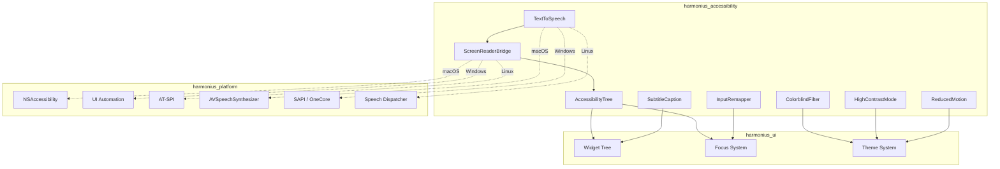
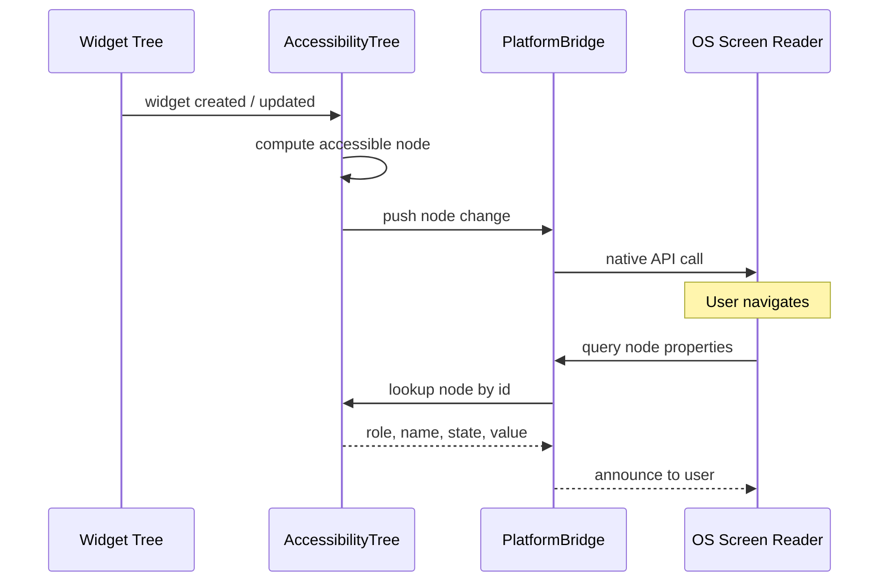
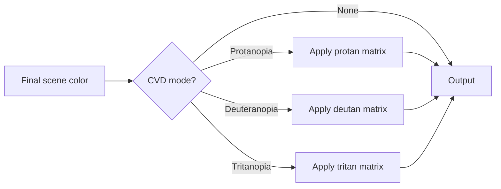
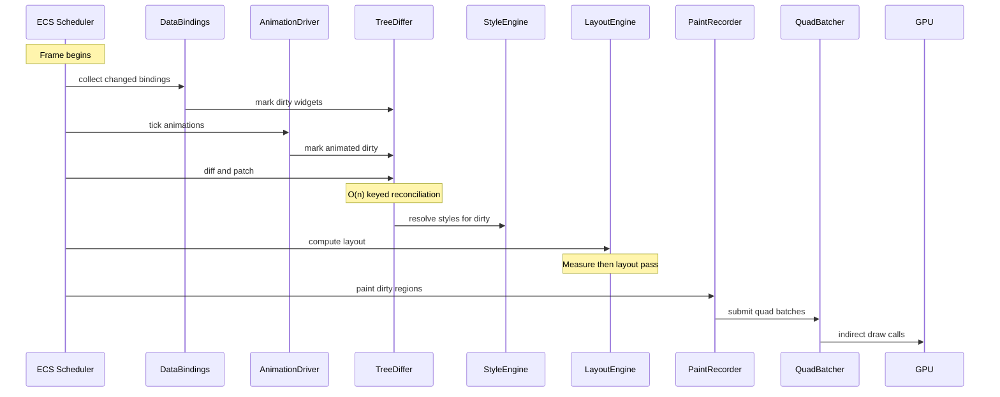
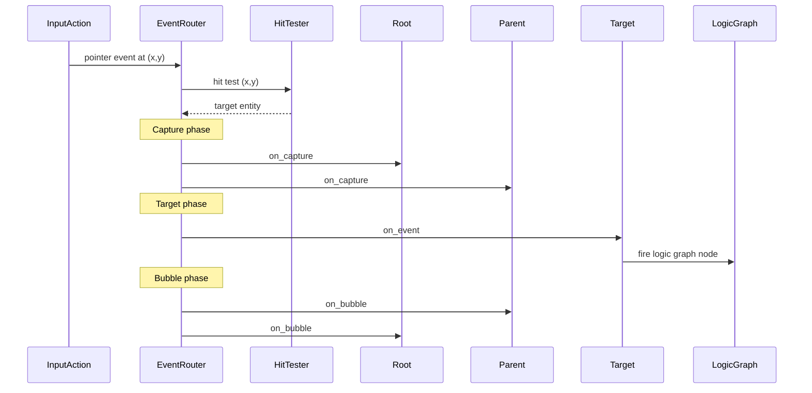
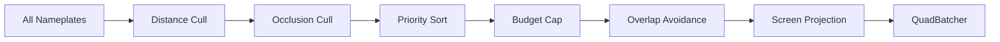
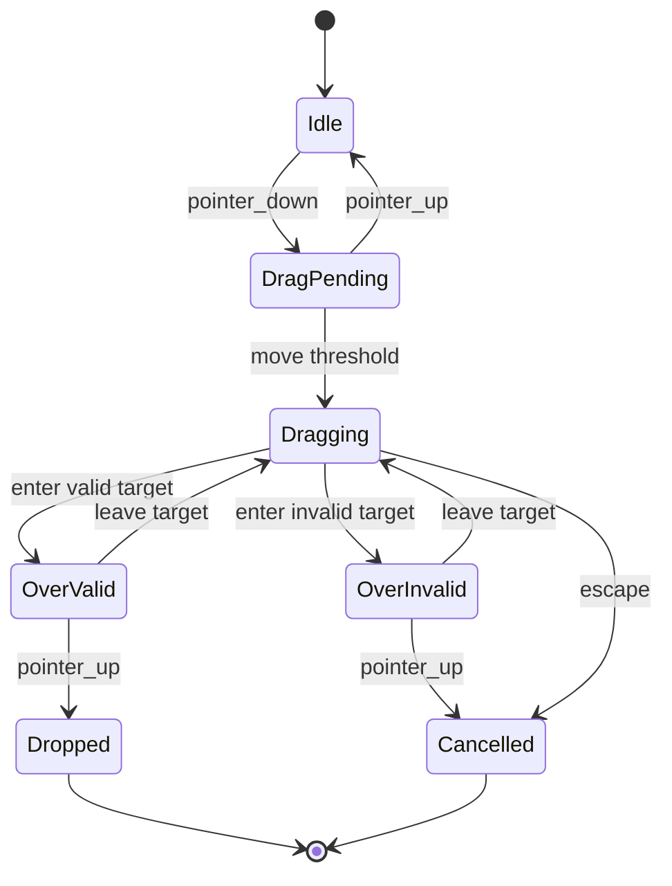
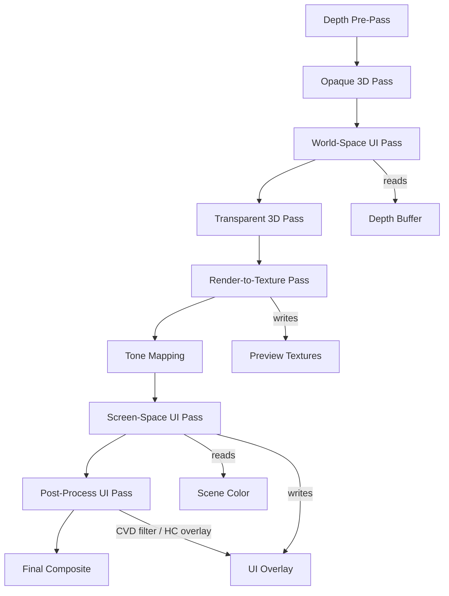

# UI Framework Design

## Requirements Trace

> **Canonical sources:** Features, requirements, and user stories are defined in
> [features/](../../features/), [requirements/](../../requirements/), and
> [user-stories/](../../user-stories/). The table below traces design elements to those definitions.

### Widget Framework (F-10.1 / R-10.1)

| Feature   | Requirement | User Stories                     |
|-----------|-------------|----------------------------------|
| F-10.1.1  | R-10.1.1    | US-10.1.1, US-10.1.2, US-10.1.3 |
| F-10.1.2  | R-10.1.2    | US-10.1.1                        |
| F-10.1.3  | R-10.1.3    | US-10.1.4, US-10.1.5             |
| F-10.1.4  | R-10.1.4    | US-10.1.6, US-10.1.8             |
| F-10.1.5  | R-10.1.5    | US-10.1.7, US-10.1.8             |
| F-10.1.6  | R-10.1.6    | US-10.1.9, US-10.1.10            |
| F-10.1.7  | R-10.1.7    | US-10.1.11, US-10.1.12           |
| F-10.1.8  | R-10.1.8    | US-10.1.13, US-10.1.14           |
| F-10.1.9  | R-10.1.9    | US-10.1.15, US-10.1.16           |
| F-10.1.10 | R-10.1.10   | US-10.1.17                       |
| F-10.1.11 | R-10.1.11   | US-10.1.18, US-10.1.19           |
| F-10.1.12 | R-10.1.12   | US-10.1.2, US-10.1.3             |
| F-10.1.13 | R-10.1.13   | US-10.1.20, US-10.1.21           |
| F-10.1.14 | R-10.1.14   | US-10.1.22, US-10.1.23           |

1. **F-10.1.1** — Declarative retained widget tree with minimal diff updates
2. **F-10.1.2** — Binary UI asset format with templates and slots
3. **F-10.1.3** — Widget pooling and recycling for virtualized lists
4. **F-10.1.4** — Flexbox and CSS grid layout algorithms
5. **F-10.1.5** — Anchor and constraint-based layout
6. **F-10.1.6** — Cascading styles with runtime theme swapping
7. **F-10.1.7** — Reactive one-way, two-way, and computed data binding
8. **F-10.1.8** — Focus traversal, tab order, directional nav, focus trapping
9. **F-10.1.9** — Localization hooks with RTL mirroring
10. **F-10.1.10** — World-space 3D UI panels with ray-cast input
11. **F-10.1.11** — VR input modes: laser, touch, gaze, hand tracking
12. **F-10.1.12** — O(n) keyed reconciliation tree diffing
13. **F-10.1.13** — Widget property animations with easing and interruption
14. **F-10.1.14** — Audio feedback per widget interaction

### Common Widgets (F-10.2 / R-10.2)

| Feature  | Requirement |
|----------|-------------|
| F-10.2.1 | R-10.2.1    |
| F-10.2.2 | R-10.2.2    |
| F-10.2.3 | R-10.2.3    |
| F-10.2.4 | R-10.2.4    |
| F-10.2.5 | R-10.2.5    |
| F-10.2.6 | R-10.2.6    |
| F-10.2.7 | R-10.2.7    |
| F-10.2.8 | R-10.2.8    |

1. **F-10.2.1** — Rich text with inline formatting, icons, hyperlinks, HarfBuzz shaping, BiDi
2. **F-10.2.2** — Text input with IME, clipboard, undo/redo, zero dropped characters
3. **F-10.2.3** — Buttons, sliders, toggles, checkboxes, radio buttons, spin boxes
4. **F-10.2.4** — Dropdown / combo box with search filtering and dynamic options
5. **F-10.2.5** — Virtualized scroll views with inertial scrolling, variable-height items
6. **F-10.2.6** — Tooltips, context menus, modal dialogs with z-ordering and stacking
7. **F-10.2.7** — Drag and drop with ghost preview, drop target highlight, stack splitting
8. **F-10.2.8** — Progress bars (linear, circular, segmented), loading spinners

### HUD & Game UI (F-10.3 / R-10.3)

| Feature   | Requirement |
|-----------|-------------|
| F-10.3.1  | R-10.3.1    |
| F-10.3.2  | R-10.3.2    |
| F-10.3.3  | R-10.3.3    |
| F-10.3.4  | R-10.3.4    |
| F-10.3.5  | R-10.3.5    |
| F-10.3.6  | R-10.3.6    |
| F-10.3.7  | R-10.3.7    |
| F-10.3.8  | R-10.3.8    |
| F-10.3.9  | R-10.3.9    |
| F-10.3.10 | R-10.3.10   |
| F-10.3.11 | R-10.3.11   |
| F-10.3.12 | R-10.3.12   |
| F-10.3.13 | R-10.3.13   |
| F-10.3.14 | R-10.3.14   |
| F-10.3.15 | R-10.3.15   |

1. **F-10.3.1** — Health / resource / cast bars, 40+ raid bars at 60 fps
2. **F-10.3.2** — Buff / debuff icons with radial sweep and priority filtering
3. **F-10.3.3** — Action bars with frame-accurate cooldown indicators
4. **F-10.3.4** — Nameplates anchored to 3D world positions, 200+ at 60 fps
5. **F-10.3.5** — Floating combat text with trajectories and cumulative merging
6. **F-10.3.6** — Minimap and world map with real-time markers
7. **F-10.3.7** — Quest tracker with waypoints and compass indicators
8. **F-10.3.8** — Chat system, multi-channel, 200+ msg/s throughput
9. **F-10.3.9** — Inventory grid with drag-drop, sort, filter, stack split
10. **F-10.3.10** — Compass bar with tracked objective markers
11. **F-10.3.11** — Off-screen objective indicators
12. **F-10.3.12** — Procedural minimap generation from world data
13. **F-10.3.13** — World map generation with tiled image pyramids
14. **F-10.3.14** — Artist-authored map overlays and post-processing
15. **F-10.3.15** — Data-driven map markers with quest integration

### UI Rendering (F-10.4 / R-10.4)

| Feature  | Requirement |
|----------|-------------|
| F-10.4.1 | R-10.4.1    |
| F-10.4.2 | R-10.4.2    |
| F-10.4.3 | R-10.4.3    |
| F-10.4.4 | R-10.4.4    |
| F-10.4.5 | R-10.4.5    |
| F-10.4.6 | R-10.4.6    |
| F-10.4.7 | R-10.4.7    |

1. **F-10.4.1** — Batched quad rendering via indirect dispatch
2. **F-10.4.2** — MSDF text rendering, 5000+ glyphs/frame
3. **F-10.4.3** — GPU-accelerated vector path rendering
4. **F-10.4.4** — UI atlas packing with nine-slice rendering
5. **F-10.4.5** — Render-to-texture for 3D-in-UI previews
6. **F-10.4.6** — World-space and diegetic UI in 3D render pass
7. **F-10.4.7** — SDF anti-aliased edges and stencil clipping

### Cross-Cutting Dependencies

| Dependency | Source | Consumed API |
|------------|--------|-------------|
| Entity lifecycle | F-1.1.11 | Generational `Entity` handles |
| ChildOf relationship | F-1.1.14 | Widget tree hierarchy |
| Command buffers | F-1.1.32 | Deferred structural changes |
| Change detection | F-1.1.22 | `Changed<T>` for data binding |
| Parallel iteration | F-1.1.20 | Chunk-level parallel query |
| System scheduling | F-1.1.25 | Phase ordering |
| Codegen/middleman .dylib | F-1.6.1 | Type descriptors, enum variants |
| Localization | core-runtime | `LocalizedStringId`, `StringTable` |
| Input actions | F-6.2 | Pointer, keyboard, gamepad |
| Audio mixer bus | F-5.1.3 | UI audio feedback channel |
| Logic graph | F-15.8.4 | Event handler wiring |

### Accessibility (F-10.6 / R-10.6)

| Feature  | Requirement | User Story                       |
|----------|-------------|----------------------------------|
| F-10.6.1 | R-10.6.1    | US-10.6.1, US-10.6.2, US-10.6.3 |
| F-10.6.2 | R-10.6.2    | US-10.6.4, US-10.6.5, US-10.6.6 |
| F-10.6.3 | R-10.6.3    | US-10.6.7, US-10.6.8, US-10.6.9 |
| F-10.6.4 | R-10.6.4    | US-10.6.10..US-10.6.12           |
| F-10.6.5 | R-10.6.5    | US-10.6.13..US-10.6.15           |
| F-10.6.6 | R-10.6.6    | US-10.6.16..US-10.6.18           |
| F-10.6.7 | R-10.6.7    | US-10.6.19..US-10.6.21           |

1. **F-10.6.1** — Screen reader support
2. **F-10.6.2** — Subtitle and caption system
3. **F-10.6.3** — Colorblind modes
4. **F-10.6.4** — High contrast and scalable UI
5. **F-10.6.5** — Input remapping for accessibility
6. **F-10.6.6** — Text-to-speech for chat
7. **F-10.6.7** — WCAG 2.1 compliance

## Overview

The UI framework is the foundational layer of the Harmonius UI system. It manages a retained tree of
widget entities, a library of reusable interactive widgets, a GPU-accelerated rendering pipeline,
and game-specific HUD composites.

The design follows four principles:

1. **ECS-primary (~90%)-based.** Every widget is an entity. Every property is a component. Every
   pipeline stage is a system.
2. **Declarative + retained.** Artists author widget trees in the visual editor. The runtime
   maintains a retained tree and applies minimal diffs when bound data changes.
3. **No-code.** All event handlers wire to logic graph nodes. All styling, layout, and animation are
   configured through visual editors.
4. **Static dispatch.** Layout algorithms, style resolution, and event routing use enum dispatch
   over concrete types.
5. **Codegen-driven extensibility.** Custom widget types defined in the visual editor are codegen'd
   into the middleman `.dylib` as new `WidgetKind` variants with statically dispatched layout,
   paint, and event handlers. There is no runtime widget registration and no
   `Box<dyn CustomWidget>`.

Three layers compose the system:

1. **Rendering** -- batched quad submission, MSDF text, vector paths, nine-slice, atlas management,
   anti-aliased clipping.
2. **Widgets** -- reusable interactive controls (buttons, sliders, dropdowns, scroll views,
   tooltips, drag-and-drop, progress bars, text input, rich text).
3. **HUD** -- game-specific composites built from the widget layer (health bars, action bars,
   nameplates, floating combat text, minimap, compass, chat, inventory grids).
4. **Accessibility** -- assistive technology integration for players with visual, auditory, motor,
   and cognitive disabilities. All features are ECS components and systems integrated with the
   widget tree and theme system.

Accessibility subsystems:

1. **Screen reader bridge** -- platform accessibility APIs (NSAccessibility, UI Automation, AT-SPI)
   with ARIA-like roles and live region announcements
2. **Colorblind filters** -- post-process CVD remapping plus non-color alternative visual cues
3. **WCAG compliance** -- automated contrast checking, focus indicators, keyboard operability
4. **Keyboard/controller navigation** -- full UI traversal without mouse, scanning mode for switch
   devices
5. **Text-to-speech** -- platform TTS for chat, notifications, and UI announcements
6. **Subtitle/caption system** -- configurable subtitles with directional indicators for non-speech
   audio
7. **Input remapping** -- complete rebinding, hold-to-toggle, per-character profiles
8. **High contrast / reduced motion** -- stark color pairs, animation suppression

### Performance Targets

| Metric | Target |
|--------|--------|
| Full HUD render | < 2 ms GPU, < 50 draws |
| Tree diff (500 widgets, 10%) | < 1 ms |
| Layout pass (500 widgets) | < 0.5 ms |
| Style resolution (500 widgets) | < 0.3 ms |
| Steady-state scroll allocs | Zero |
| Data binding propagation | Same-frame |

## Architecture

### Module Boundaries

```mermaid
graph TD
    subgraph "harmonius_ui::core — F-10.1"
        WT[WidgetTree]
        LY[Layout]
        STY[StyleResolver]
        DBind[DataBinding]
        FO[FocusManager]
        EV[EventRouter]
        AN[AnimationDriver]
        AU[AudioFeedback]
    end

    subgraph "harmonius_ui::widgets — F-10.2"
        BT[Button / Toggle / Slider]
        DD[Dropdown / ComboBox]
        SV[ScrollView / VirtualList]
        OV[Overlay / Tooltip / Modal]
        DnD[DragDropManager]
        PB[ProgressBar / Spinner]
        TX[TextInput / RichText]
        TB[TabBar / TreeView]
        CP[ColorPicker]
    end

    subgraph "harmonius_ui::hud — F-10.3"
        HB[HealthBar / ResourceBar]
        AB[ActionBar / Cooldown]
        BI[BuffDebuffIcons]
        NP[NameplateSystem]
        FCT[FloatingCombatText]
        MM[MinimapWidget]
        QT[QuestTracker]
        CMB[CompassBar]
        CH[ChatSystem]
        IG[InventoryGrid]
    end

    subgraph "harmonius_ui::rendering — F-10.4"
        QB[QuadBatcher]
        SA[SdfAtlas]
        NS[NineSliceSolver]
        VP[VectorPathRenderer]
        AC[AntiAliasClip]
        RT[RenderToTexture]
    end

    subgraph "harmonius_ui::animation"
        TW[TweenDriver]
        SP[SpringSolver]
        KF[KeyframePlayer]
    end

    BT --> WT
    DD --> WT
    SV --> WT
    OV --> WT
    PB --> WT
    TX --> WT

    HB --> QB
    AB --> QB
    NP --> QB
    FCT --> SA
    MM --> RT
    BI --> QB

    QB --> SA
    QB --> NS
    QB --> VP
    QB --> AC

    TW --> WT
    SP --> WT
    KF --> WT
```



### Accessibility module boundaries



### Crate Structure

```text
harmonius_ui/
├── widget/
│   ├── tree.rs          # WidgetTree root, traversal
│   ├── node.rs          # WidgetNode, WidgetKind
│   ├── pool.rs          # WidgetPool, free list
│   ├── differ.rs        # TreeDiffer, keyed recon
│   ├── event.rs         # EventRouter, hit test
│   ├── focus.rs         # FocusManager, tab order
│   ├── binding.rs       # DataBinding, one/two-way
│   ├── animation.rs     # AnimationDriver
│   ├── audio.rs         # AudioFeedback
│   └── asset.rs         # UIAssetLoader, binary fmt
├── layout/
│   ├── engine.rs        # LayoutEngine, measure/lay
│   ├── flex.rs          # FlexLayout algorithm
│   ├── grid.rs          # GridLayout algorithm
│   ├── anchor.rs        # AnchorLayout
│   └── constraint.rs    # ConstraintSolver
├── style/
│   ├── engine.rs        # StyleEngine, cascade
│   ├── theme.rs         # ThemeRegistry
│   ├── sheet.rs         # StyleSheet, rule storage
│   ├── selector.rs      # SelectorMatcher
│   └── cache.rs         # StyleCache
├── widgets/
│   ├── button.rs        # Button, Toggle, etc.
│   ├── slider.rs        # Slider, SpinBox
│   ├── dropdown.rs      # Dropdown, ComboBox
│   ├── scroll_view.rs   # ScrollView, VirtualList
│   ├── overlay.rs       # Tooltip, ContextMenu
│   ├── drag_drop.rs     # DragDropManager
│   ├── progress.rs      # ProgressBar, Spinner
│   ├── text_input.rs    # TextInput, RichText
│   ├── tab_bar.rs       # TabBar, TreeView
│   └── color_picker.rs  # ColorPicker
├── hud/
│   ├── health_bar.rs    # HealthBar, ResourceBar
│   ├── action_bar.rs    # ActionBar, Cooldown
│   ├── buff_icons.rs    # BuffDebuffGrid
│   ├── nameplate.rs     # NameplateSystem
│   ├── combat_text.rs   # FloatingCombatText
│   ├── minimap.rs       # MinimapWidget
│   ├── world_map.rs     # WorldMap, TiledPyramid
│   ├── compass.rs       # CompassBar
│   ├── quest_tracker.rs # QuestTracker
│   ├── chat.rs          # ChatSystem
│   └── inventory.rs     # InventoryGrid
├── rendering/
│   ├── batcher.rs       # QuadBatcher
│   ├── sdf_atlas.rs     # MSDF glyph atlas
│   ├── nine_slice.rs    # NineSliceSolver
│   ├── vector_path.rs   # VectorPathRenderer
│   ├── atlas.rs         # UiAtlas, repack
│   ├── clip.rs          # Stencil / clip stack
│   └── rtt.rs           # RenderToTexture
├── animation/
│   ├── tween.rs         # TweenDriver, easing
│   ├── spring.rs        # SpringSolver
│   └── keyframe.rs      # KeyframePlayer
└── systems.rs           # ECS system registration
```

### Core Data Structures

```mermaid
classDiagram
    class WidgetNode {
        +Entity entity
        +WidgetKind kind
        +WidgetKey key
        +DirtyFlags dirty
    }

    class WidgetKind {
        <<enum>>
        Panel
        Label
        Button
        TextInput
        Slider
        Checkbox
        Toggle
        ScrollView
        ListView
        Image
        ProgressBar
        ComboBox
        Custom(CustomWidgetId)
    }

    class WidgetKey {
        <<enum>>
        Index(u32)
        Named(StringId)
    }

    class LayoutComponent {
        +LayoutMode mode
        +Size min_size
        +Size max_size
        +Size preferred_size
        +Edges margin
        +Edges padding
    }

    class LayoutMode {
        <<enum>>
        Flex(FlexParams)
        Grid(GridParams)
        Anchor(AnchorParams)
        Constraint(ConstraintParams)
    }

    class ComputedLayout {
        +Vec2 position
        +Vec2 size
        +Rect clip_rect
        +Vec2 global_position
    }

    class StyleComponent {
        +Option~StringId~ id
        +SmallVec~StyleClassId 4~ classes
        +Option~StyleProperties~ inline_style
    }

    class ComputedStyle {
        +Color background_color
        +Color text_color
        +FontId font
        +f32 font_size
        +f32 opacity
        +Corners border_radius
        +Edges border_width
        +Color border_color
        +Option~Shadow~ shadow
        +CursorStyle cursor
        +Visibility visibility
        +Overflow overflow
    }

    class InteractionState {
        +bool hovered
        +bool pressed
        +bool focused
        +bool disabled
    }

    class DataBindingComponent {
        +SmallVec~Binding 2~ bindings
        +SmallVec~ComputedBinding 1~ computed
    }

    class AnimationComponent {
        +SmallVec~ActiveAnimation 2~ active
        +SmallVec~TransitionAnimation 4~ transitions
    }

    class AudioSlots {
        +Option~AudioAssetId~ click
        +Option~AudioAssetId~ hover_enter
        +Option~AudioAssetId~ hover_exit
        +Option~AudioAssetId~ focus_gain
        +Option~AudioAssetId~ focus_loss
    }

    class UiNode {
        +WidgetType widget_type
        +WidgetFlags flags
    }

    class UiTransform {
        +Vec2 position
        +Vec2 size
        +f32 rotation
        +Vec2 scale
        +Vec2 pivot
        +AnchorPreset anchor
    }

    class ComputedRect {
        +Vec2 global_pos
        +Vec2 global_size
        +u16 z_order
        +Rect clip_rect
    }

    class HealthBar {
        +f32 current
        +f32 max
        +f32 predicted_damage
        +f32 absorb_shield
        +BarSegmentation segmentation
    }

    class ActionSlot {
        +AbilityId ability
        +f32 cooldown_remaining
        +f32 cooldown_total
        +u8 charges
        +SlotUsability usability
    }

    class Nameplate {
        +Entity target_entity
        +f32 max_distance
        +NameplatePriority priority
    }

    class WorldSpaceAnchor {
        +Vec3 world_position
        +Vec2 screen_offset
        +BillboardMode billboard
    }

    class DragState {
        +DragPhase phase
        +Option~Entity~ source_entity
        +Option~DragPayload~ payload
        +Vec2 pointer_pos
    }

    class QuadInstance {
        +f32[2] position
        +f32[2] size
        +f32[4] uv_rect
        +f32[4] tint
        +f32[4] corner_radius
        +f32[4] clip_rect
        +u32 atlas_page
        +u32 flags
    }

    WidgetNode *-- WidgetKind
    WidgetNode *-- WidgetKey
    WidgetNode --> LayoutComponent
    WidgetNode --> StyleComponent
    WidgetNode --> ComputedLayout
    WidgetNode --> ComputedStyle
    WidgetNode --> InteractionState
    WidgetNode --> DataBindingComponent
    WidgetNode --> AnimationComponent
    WidgetNode --> AudioSlots
    LayoutComponent *-- LayoutMode
    UiNode *-- UiTransform
    UiNode *-- ComputedRect
    UiNode o-- HealthBar
    UiNode o-- ActionSlot
    UiNode o-- Nameplate
    Nameplate *-- WorldSpaceAnchor

    class AccessibleNode {
        +Entity entity
        +AccessibleRole role
        +Vec~AccessibleState~ states
        +AccessibleProperties properties
        +Vec~Entity~ children
    }

    class AccessibleRole {
        <<enum>>
        Button
        Checkbox
        Slider
        TextInput
        Dialog
        ProgressBar
        None
    }

    class AccessibilityTree {
        -Vec~AccessibleNode~ nodes
        -Entity root
        -Vec~Entity~ dirty
        +sync(widget_tree)
        +announce(entity, msg, mode)
    }

    class ColorblindFilter {
        +ColorVisionDeficiency mode
        +f32 severity
        +bool correction
        +color_matrix() mat3
    }

    class ColorVisionDeficiency {
        <<enum>>
        None
        Protanopia
        Deuteranopia
        Tritanopia
    }

    class HighContrastSettings {
        +bool enabled
        +Color foreground
        +Color background
        +Color border
        +f32 border_width
    }

    class UiScaleSettings {
        +f32 user_scale
        +f32 system_dpi_scale
        +f32 effective_scale
    }

    class ReducedMotionSettings {
        +bool enabled
        +f32 animation_scale
        +bool disable_parallax
        +bool disable_camera_shake
    }

    class SubtitleSettings {
        +bool enabled
        +f32 font_size
        +Color text_color
        +SubtitlePosition position
    }

    class AccessibilitySettings {
        +ColorblindFilter colorblind
        +HighContrastSettings high_contrast
        +UiScaleSettings ui_scale
        +SubtitleSettings subtitles
        +ReducedMotionSettings reduced_motion
    }

    AccessibleNode --> AccessibleRole
    AccessibilityTree *-- AccessibleNode
    ColorblindFilter --> ColorVisionDeficiency
    AccessibilitySettings --> ColorblindFilter
    AccessibilitySettings --> HighContrastSettings
    AccessibilitySettings --> UiScaleSettings
    AccessibilitySettings --> ReducedMotionSettings
```



### Screen reader data flow



### Colorblind filter pipeline



### Frame Update Pipeline



### Event Routing



### Nameplate Culling Pipeline



### Drag-and-Drop State Machine



### Render Graph Integration

UI rendering participates in the engine render graph as explicit named passes. Ordering relative to
the 3D pipeline:



1. **World-Space UI Pass** — during main 3D pass, after opaque, with depth testing. Reads: depth
   buffer. Writes: world-space panel quads (nameplates, anchored panels, diegetic UI).
2. **Render-to-Texture Pass** — before screen-space UI. Renders 3D preview scenes into textures for
   minimap, model preview, and portal widgets.
3. **Screen-Space UI Pass** — after tone mapping, before final composite. Reads: scene color.
   Writes: all HUD and editor UI quads.
4. **Vector Path Pass** — sub-pass inside screen-space UI. Generates SDF distance fields or
   tessellated geometry for vector shapes.
5. **Post-Process UI Pass** — colorblind CVD filter and high-contrast overlay applied last.

## API Design

API types are split across widget identity, layout, styling, data binding, event routing, focus
management, animation, audio feedback, HUD components, UI rendering, and asset format sections. No
types derive `Reflect` — all type metadata is generated statically by the codegen pipeline into the
middleman `.dylib` (zero-reflection constraint, constraints.md).

See the Widget Identity, Common Widget Components, and HUD Components sections below for the full
API pseudocode. The consolidated API is summarized below.

### Widget Identity

```rust
pub type WidgetId = Entity;

// WidgetKey and WidgetKind are codegen'd into the middleman .dylib.
// CustomWidgetId variants are emitted by the visual editor codegen pipeline.
#[derive(Clone, Debug, PartialEq, Eq, Hash)]
pub enum WidgetKey {
    Index(u32),
    Named(StringId),
}

/// `WidgetKind::Custom` variants are codegen'd enum entries in the middleman .dylib.
/// There is no runtime registration; the editor generates a new variant per custom widget type.
#[derive(Clone, Copy, Debug, PartialEq, Eq, Hash)]
pub enum WidgetKind {
    Panel, Label, Button, TextInput, Slider,
    Checkbox, Toggle, ScrollView, ListView,
    Image, ProgressBar, ComboBox,
    Custom(CustomWidgetId), // codegen'd variant
}

#[derive(Component)]
pub struct WidgetNode {
    pub kind: WidgetKind,
    pub key: WidgetKey,
    pub dirty: DirtyFlags,
}

bitflags::bitflags! {
    #[derive(Clone, Copy, Debug)]
    pub struct DirtyFlags: u16 {
        const STYLE     = 0b0000_0001;
        const LAYOUT    = 0b0000_0010;
        const PAINT     = 0b0000_0100;
        const BINDING   = 0b0000_1000;
        const CHILDREN  = 0b0001_0000;
        const ANIMATION = 0b0010_0000;
        const ALL       = 0b0011_1111;
    }
}
```

### Layout System

```rust
#[derive(Clone, Debug)]
pub enum LayoutMode {
    Flex(FlexParams),
    Grid(GridParams),
    Anchor(AnchorParams),
    Constraint(ConstraintParams),
}

#[derive(Component, Clone, Debug)]
pub struct LayoutComponent {
    pub mode: LayoutMode,
    pub min_size: Size,
    pub max_size: Size,
    pub preferred_size: Size,
    pub margin: Edges,
    pub padding: Edges,
    pub flex_grow: f32,
    pub flex_shrink: f32,
    pub flex_basis: SizeValue,
    pub grid_column: Option<GridPlacement>,
    pub grid_row: Option<GridPlacement>,
}

#[derive(Component, Clone, Copy, Debug)]
pub struct ComputedLayout {
    pub position: Vec2,
    pub size: Vec2,
    pub clip_rect: Rect,
    pub global_position: Vec2,
}
```

### Styling System

```rust
#[derive(Component, Clone, Debug)]
pub struct StyleComponent {
    pub id: Option<StringId>,
    pub classes: SmallVec<[StyleClassId; 4]>,
    pub inline_style: Option<StyleProperties>,
}

#[derive(Component, Clone, Debug, Default)]
pub struct ComputedStyle {
    pub background_color: Color,
    pub text_color: Color,
    pub font: FontId,
    pub font_size: f32,
    pub opacity: f32,
    pub border_radius: Corners,
    pub border_width: Edges,
    pub border_color: Color,
    pub shadow: Option<Shadow>,
    pub cursor: CursorStyle,
    pub visibility: Visibility,
    pub overflow: Overflow,
}

#[derive(Clone, Debug)]
pub struct Theme {
    pub name: StringId,
    pub sheets: Vec<StyleSheet>,
}

pub struct ThemeRegistry {
    themes: Vec<Theme>,
    active_theme: usize,
}
```

### Data Binding

```rust
#[derive(Clone, Copy, Debug)]
pub enum BindingDirection { OneWay, TwoWay }

#[derive(Clone, Debug)]
pub struct Binding {
    pub direction: BindingDirection,
    pub source_entity: Entity,
    pub source_path: ComponentPath, // static path, no runtime reflection
    pub target_property: WidgetProperty,
    pub transform: Option<BindingTransform>,
}

#[derive(Component, Clone, Debug)]
pub struct DataBindingComponent {
    pub bindings: SmallVec<[Binding; 2]>,
    pub computed: SmallVec<[ComputedBinding; 1]>,
}
```

### Common Widget Components

```rust
#[derive(Component, Clone, Debug)]
pub struct Button {
    pub label: Option<LocalizedStringId>,
    pub icon: Option<UiImage>,
    pub toggle_state: Option<bool>,
}

#[derive(Component, Clone, Debug)]
pub struct Slider {
    pub value: f32,
    pub min: f32,
    pub max: f32,
    pub step: Option<f32>,
    pub orientation: Orientation,
}

#[derive(Component, Clone, Debug)]
pub struct ScrollView {
    pub scroll_offset: Vec2,
    pub scroll_velocity: Vec2,
    pub overscroll: OverscrollMode,
    pub show_scrollbars: ScrollbarVisibility,
}

#[derive(Component, Clone, Debug)]
pub struct VirtualList {
    pub total_item_count: u32,
    pub visible_start: u32,
    pub visible_count: u32,
    pub buffer_count: u32,
    pub item_height_mode: ItemHeightMode,
}
```

### HUD Components

```rust
#[derive(Component, Clone, Debug)]
pub struct HealthBar {
    pub current: f32,
    pub max: f32,
    pub predicted_damage: f32,
    pub absorb_shield: f32,
    pub resource_type: ResourceType,
    pub segmentation: BarSegmentation,
    pub fill_direction: FillDirection,
}

#[derive(Component, Clone, Debug)]
pub struct ActionSlot {
    pub ability: Option<AbilityId>,
    pub cooldown_remaining: f32,
    pub cooldown_total: f32,
    pub charges: u8,
    pub max_charges: u8,
    pub usability: SlotUsability,
    pub keybind_label: LocalizedStringId,
}

#[derive(Component, Clone, Debug)]
pub struct Nameplate {
    pub target_entity: Entity,
    pub max_distance: f32,
    pub priority: NameplatePriority,
    pub show_health: bool,
    pub show_cast_bar: bool,
    pub show_guild: bool,
}

#[derive(Component, Clone, Debug)]
pub struct WorldSpaceAnchor {
    pub world_position: Vec3,
    pub screen_offset: Vec2,
    pub billboard: BillboardMode,
    pub depth_test: bool,
}

#[derive(Component, Clone, Debug)]
pub struct FloatingCombatText {
    pub value: f32,
    pub text_type: CombatTextType,
    pub trajectory: CombatTextTrajectory,
    pub spawn_world_pos: Vec3,
    pub elapsed: f32,
    pub lifetime: f32,
    pub merge_key: Option<u64>,
}
```

### UI Rendering

```rust
#[repr(C)]
#[derive(Clone, Copy, Debug)]
pub struct QuadInstance {
    pub position: [f32; 2],
    pub size: [f32; 2],
    pub uv_rect: [f32; 4],
    pub tint: [f32; 4],
    pub corner_radius: [f32; 4],
    pub clip_rect: [f32; 4],
    pub rotation: f32,
    pub atlas_page: u32,
    pub flags: u32,
    pub _pad: u32,
}

/// Both buffers are ring-buffered with `FRAMES_IN_FLIGHT` copies to avoid CPU/GPU stalls.
/// The CPU writes frame N into slot `frame_index % FRAMES_IN_FLIGHT` while the GPU reads frame N-1.
pub struct QuadBatcher {
    instance_buffers: [GpuBuffer; FRAMES_IN_FLIGHT], // ring-buffered
    indirect_buffers: [GpuBuffer; FRAMES_IN_FLIGHT], // ring-buffered
    frame_index: u64,
    batches: Vec<BatchDescriptor>,
}

#[derive(Clone, Debug)]
pub struct BatchDescriptor {
    pub atlas_page: u32,
    pub blend_state: BlendState,
    pub instance_offset: u32,
    pub instance_count: u32,
    pub render_pass: UiRenderPass,
}
```

### Accessibility types

```rust
/// `AccessibleRole` is codegen'd into the middleman .dylib. Editor-defined roles add new variants.
#[derive(Clone, Copy, Debug, PartialEq, Eq)]
pub enum AccessibleRole {
    Button, Checkbox, Radio, Slider, TextInput,
    ListItem, Menu, MenuItem, Tab, Dialog,
    Alert, Tooltip, ProgressBar, ScrollBar,
    Tree, Grid, Image, Label, Group, None,
    // codegen'd variants appended here
}

#[derive(Clone, Copy, Debug, PartialEq, Eq)]
pub enum AccessibleState {
    Checked, Unchecked, Indeterminate, Expanded,
    Collapsed, Selected, Disabled, ReadOnly,
    Required, Invalid, Pressed, Busy,
}

#[derive(Clone, Debug)]
pub struct AccessibleProperties {
    pub label: LocalizedStringId,
    pub description: Option<LocalizedStringId>,
    pub value: Option<LocalizedStringId>,
    pub value_min: Option<f32>,
    pub value_max: Option<f32>,
    pub value_now: Option<f32>,
    pub shortcut: Option<LocalizedStringId>,
    pub live: Option<LiveRegionMode>,
}

#[derive(Clone, Debug)]
pub struct AccessibleNode {
    pub entity: Entity,
    pub role: AccessibleRole,
    pub states: Vec<AccessibleState>,
    pub properties: AccessibleProperties,
    pub children: Vec<Entity>,
    pub parent: Option<Entity>,
}

/// `AccessibilityTree` stores nodes in a sorted `Vec` indexed by `Entity` generation index.
/// Lookup is O(log n) via binary search on the sorted entity key.
/// Avoids `HashMap` on the every-frame sync hot path (RF-4).
pub struct AccessibilityTree {
    nodes: Vec<(Entity, AccessibleNode)>, // sorted by Entity index
    root: Entity,
    dirty: Vec<Entity>,
}
```

### Colorblind and contrast

```rust
#[derive(Clone, Copy, Debug, PartialEq, Eq)]
pub enum ColorVisionDeficiency {
    None, Protanopia, Deuteranopia, Tritanopia,
}

#[derive(Clone, Debug)]
pub struct ColorblindFilter {
    pub mode: ColorVisionDeficiency,
    pub severity: f32,
    pub correction: bool,
}

pub struct ContrastChecker;

impl ContrastChecker {
    pub fn relative_luminance(color: Color) -> f32;
    pub fn contrast_ratio(fg: Color, bg: Color) -> f32;
    pub fn check(fg: Color, bg: Color) -> ContrastResult;
}

#[derive(Clone, Debug)]
pub struct HighContrastSettings {
    pub enabled: bool,
    pub foreground: Color,
    pub background: Color,
    pub border: Color,
    pub focus: Color,
    pub border_width: f32,
    pub remove_decorative: bool,
}

#[derive(Clone, Debug)]
pub struct ReducedMotionSettings {
    pub enabled: bool,
    pub animation_scale: f32,
    pub disable_parallax: bool,
    pub disable_camera_shake: bool,
    pub disable_screen_effects: bool,
}
```

### Subtitles and TTS

```rust
#[derive(Clone, Debug)]
pub struct SubtitleSettings {
    pub enabled: bool,
    pub font_size: f32,
    pub text_color: Color,
    pub background_color: Color,
    pub show_speaker: bool,
    pub max_lines: u32,
    pub position: SubtitlePosition,
}

#[derive(Clone, Debug)]
pub struct SubtitleEntry {
    pub speaker: Option<String>,
    pub text: String,
    pub start_time: f32,
    pub end_time: f32,
}

#[derive(Clone, Debug)]
pub struct CaptionEntry {
    pub text: String,
    pub direction: Option<CaptionDirection>,
    pub start_time: f32,
    pub end_time: f32,
    pub priority: CaptionPriority,
}

pub struct TextToSpeech {
    // Platform-specific backend
}

impl TextToSpeech {
    pub fn speak(&self, text: &str, config: &TtsVoiceConfig);
    pub fn stop(&self);
    pub fn is_speaking(&self) -> bool;
    pub fn available_voices(&self) -> Vec<String>;
}
```

### Input remapping

```rust
#[derive(Clone, Debug)]
pub struct InputProfile {
    pub name: LocalizedStringId,
    pub character_id: Option<u64>,
    pub bindings: Vec<InputBinding>,
    pub hold_toggles: Vec<HoldToggle>,
}

pub struct InputRemapper {
    profiles: Vec<InputProfile>,
    active_profile: usize,
}

impl InputRemapper {
    pub fn load_profile(&mut self, id: u64) -> Result<()>;
    pub fn rebind(
        &mut self, action: ActionId,
        source: InputSource, secondary: bool,
    );
    pub fn set_hold_toggle(
        &mut self, action: ActionId, enabled: bool,
    );
}
```

### UI Asset Format

The binary UI asset format uses rkyv for zero-copy mmap access. All asset files are mmap'd and read
without deserialization. All asset references use the engine's `Handle<T>` pattern:

```rust
/// Archived (rkyv) root type for `.ui` binary asset files.
pub struct UiAsset {
    pub templates: Vec<UiTemplate>,
    pub styles: Vec<StyleSheet>,
}

/// All asset references use typed handles — no raw paths at runtime.
pub struct UiTemplate {
    pub name: StringId,
    pub root: WidgetNode,
    pub fonts: Vec<Handle<FontAsset>>,
    pub atlases: Vec<Handle<UiAtlas>>,
    pub themes: Vec<Handle<ThemeAsset>>,
    pub audio: Vec<Handle<AudioAsset>>,
}
```

The content pipeline compiles `.ui` text files (editor output) to `.ui.bin` rkyv archives. At
runtime `UIAssetLoader` mmap's the archive and hands out `Handle<UiAsset>` to consumers.

### UI Templates

`UiTemplate` assets support named slot entities as child insertion points (F-10.1.2):

```rust
pub struct UiTemplate {
    pub name: StringId,
    pub slots: Vec<SlotDef>,   // named insertion points
    pub root: WidgetNode,
    pub fonts: Vec<Handle<FontAsset>>,
    pub atlases: Vec<Handle<UiAtlas>>,
    pub themes: Vec<Handle<ThemeAsset>>,
    pub audio: Vec<Handle<AudioAsset>>,
}

pub struct SlotDef {
    pub name: StringId,
    pub entity: Entity,
    pub bindings: Vec<TemplateBinding>, // outer → inner property map
}
```

1. `UiTemplate` is instantiated via `WidgetPool` — recycled entities are reused, no heap alloc.
2. `TemplateBinding` maps outer-scope entity properties to inner widget bindings at slot boundaries.
3. Templates nest: a slot can contain another template instance with its own slot passthrough.
4. The editor authors templates as `.ui` layouts with designated slot entities. The content pipeline
   bakes them to `.ui.bin`.

### Video Playback

`VideoPlayer` widget wraps platform-native hardware video decoders (F-10.1 area):

```rust
#[derive(Component, Clone, Debug)]
pub struct VideoPlayer {
    pub source: Handle<VideoAsset>,
    pub state: VideoPlaybackState,
    pub looping: bool,
    pub volume: f32,
    pub output_texture: Handle<GpuTexture>,
}

#[derive(Clone, Copy, Debug, PartialEq, Eq)]
pub enum VideoPlaybackState { Stopped, Playing, Paused, Buffering }
```

- Decode via: VideoToolbox (Apple, `objc2`), Media Foundation (Windows, `windows-rs`), VA-API/V4L2
  (Linux).
- Decoded frames are written into `output_texture`, sampled by `QuadBatcher` or 3D materials.
- Audio routes through the audio mixer UI bus.
- `VideoPlayer` is a render graph texture source node injected before the screen-space UI pass.

### Embedded Web Browser

`WebView` widget renders off-screen via platform-native WebView APIs:

```rust
#[derive(Component, Clone, Debug)]
pub struct WebView {
    pub url: String,
    pub output_texture: Handle<GpuTexture>,
    pub size: Vec2,
    pub interactive: bool,
}
```

| Platform | API | Access |
|----------|-----|--------|
| macOS / iOS | `WKWebView` | `objc2` |
| Windows | `WebView2` | `windows-rs` |
| Linux | `WebKitGTK` | via `gtk-rs` or subprocess |
| Console / VR | HTML-to-widget converter | minimal HTTP fetch |

`WebView` renders to off-screen texture composited by `QuadBatcher` or projected into world-space
panels. Input is forwarded from `EventRouter` to the native WebView. No CEF — no bundled browser
engine.

### Touch Gesture System

`GestureRecognizer` processes raw touch events into semantic gestures. Each recognizer is a state
machine attached to a widget entity via `GestureComponent`:

```rust
#[derive(Component, Clone, Debug)]
pub struct GestureComponent {
    pub recognizers: SmallVec<[GestureRecognizerKind; 2]>,
    pub simultaneous_mask: u32, // bitmask of compatible recognizer IDs
}

#[derive(Clone, Copy, Debug)]
pub enum GestureRecognizerKind {
    Tap { max_duration_ms: u32 },
    DoubleTap { max_interval_ms: u32 },
    LongPress { min_duration_ms: u32 },
    PinchZoom,
    Swipe { direction_mask: u8 },
    Pan,
    EdgeSwipe { edge: ScreenEdge }, // iOS/Android system gestures
}
```

Conflict resolution: priority ordering + `simultaneous_mask`. A recognizer with higher priority
cancels lower-priority ones on the same widget (mirrors iOS `UIGestureRecognizer` semantics). The
gesture system disambiguates viewport pan/pinch from docked-panel scroll via a
`GestureOwner::Viewport` vs `GestureOwner::Widget` flag set on touch-down.

### Subpixel Text Rendering

Two text rendering modes (selected per text element in the theme):

```rust
#[derive(Clone, Copy, Debug, PartialEq, Eq)]
pub enum TextRenderMode {
    /// Default. Game UI, world-space text, high-DPI, OLED, mobile, VR.
    Msdf,
    /// Editor UI and desktop UI at low DPI. Requires known subpixel layout.
    SubpixelRasterized { layout: SubpixelLayout },
}

#[derive(Clone, Copy, Debug, PartialEq, Eq)]
pub enum SubpixelLayout { Rgb, Bgr, Vrgb, Vbgr }
```

`SubpixelRasterized` uses FreeType subpixel rendering into a separate glyph cache atlas. Disabled on
OLED, mobile, VR (no subpixel grid). `TextRenderMode` is resolved per text element at style
resolution time.

### Font Manager

`FontManager` is a resource managing runtime font loading and MSDF atlas generation:

```rust
pub struct FontManager {
    families: Vec<FontFamily>,
    atlas: DynamicMsdfAtlas, // LRU eviction — supports CJK 20K+ glyphs
    system_fonts: Vec<SystemFontEntry>, // populated from platform APIs
}

pub struct FontFamily {
    pub name: StringId,
    pub primary: Handle<FontAsset>,
    pub fallbacks: SmallVec<[Handle<FontAsset>; 4]>, // CJK, emoji, symbols
    pub variable_axes: Vec<VariableFontAxis>,
}
```

1. Loads font files via `Handle<FontAsset>` — rkyv zero-copy.
2. Fallback chains per family: primary → CJK → emoji → symbols.
3. MSDF glyphs generated on demand into `DynamicMsdfAtlas` (LRU eviction for CJK).
4. System fonts queried via platform APIs: `CTFontManagerCopy` (Apple, `objc2`), `DirectWrite`
   (Windows, `windows-rs`), `fontconfig` (Linux).
5. Variable font axes: weight, width, italic interpolation.

### Cursor Manager

`CursorManager` system reads `CursorStyle` from hovered widget's `ComputedStyle` and drives the OS
cursor:

```rust
pub struct CursorManager {
    pub lock_state: CursorLockState,
    pub virtual_cursor_pos: Option<Vec2>, // gamepad-driven when no mouse
}

#[derive(Clone, Copy, Debug, PartialEq, Eq)]
pub enum CursorLockState {
    Free,           // normal UI mode
    Confined,       // locked to window bounds
    Hidden,         // gamepad-only navigation
    LockedCenter,   // FPS game mode
}
```

1. Reads `CursorStyle` from hovered `ComputedStyle`, sets OS cursor via platform APIs.
2. Manages `CursorLockState` transitions between game and UI modes.
3. Provides `virtual_cursor_pos` driven by gamepad stick when no mouse is present.
4. Hides cursor during gamepad-only navigation.

### Gamepad Navigation

`FocusManager` spatial navigation algorithm for gamepad/dpad input:

```rust
pub struct GamepadNavConfig {
    pub confirm: GamepadButton,   // A / Cross
    pub cancel: GamepadButton,    // B / Circle
    pub tab_next: GamepadButton,  // RB / R1
    pub tab_prev: GamepadButton,  // LB / L1
    pub cone_half_angle_deg: f32, // directional cone for nearest-neighbor
}
```

1. **Spatial focus algorithm** — 2D nearest-neighbor with directional cone from current focus rect.
   Filters candidates within `cone_half_angle_deg` of the input direction, picks nearest center.
2. **Button mapping** — A/Cross = confirm, B/Circle = back/cancel, bumpers = tab switch.
3. **Radial menu widget** — `RadialMenu` widget for gamepad-optimized item selection. Items laid out
   in a circle; stick direction selects the nearest arc segment.
4. **Haptic feedback** — fires a short haptic pulse via the input system's rumble API on each focus
   change.

### Animation Efficiency

Efficiency measures for large widget counts:

1. **Off-screen skip** — widgets with `Visibility::Hidden` skip animation ticks entirely.
2. **Distance-based throttle** — world-space panels reduce animation tick rate by distance from
   camera (configurable LOD thresholds).
3. **GPU-driven simple animations** — opacity, color, UV offset, and corner-radius animations are
   encoded as per-instance uniform interpolation parameters in the quad shader. No CPU roundtrip per
   frame.
4. **SIMD curve batching** — identical tween curves across multiple widgets are batched for SIMD
   evaluation in the `AnimationDriver`.

### System Theme Detection

```rust
pub struct SystemThemeDetector;

impl SystemThemeDetector {
    /// Returns `Appearance::Dark` or `Appearance::Light` from OS preference.
    /// macOS: `NSApp.effectiveAppearance`
    /// Windows: `AppsUseLightTheme` registry key
    /// Linux: `org.freedesktop.portal.Settings` color-scheme portal
    pub fn detect(platform: &Platform) -> Appearance;
}

#[derive(Clone, Copy, Debug, PartialEq, Eq)]
pub enum Appearance { Light, Dark }
```

`ThemeRegistry` subscribes to `SystemThemeChangedEvent` and swaps the active theme automatically.
Per-widget overrides via `ThemeOverride` component prevent swap on specific subtrees.

### Audio Slots (Extended)

`AudioSlots` extended with additional event triggers (F-10.1.14):

```rust
#[derive(Component, Clone, Debug)]
pub struct AudioSlots {
    pub click: Option<Handle<AudioAsset>>,
    pub hover_enter: Option<Handle<AudioAsset>>,
    pub hover_exit: Option<Handle<AudioAsset>>,
    pub focus_gain: Option<Handle<AudioAsset>>,
    pub focus_loss: Option<Handle<AudioAsset>>,
    pub scroll_tick: Option<Handle<AudioAsset>>,   // per list item
    pub keystroke: Option<Handle<AudioAsset>>,
    pub panel_open: Option<Handle<AudioAsset>>,
    pub panel_close: Option<Handle<AudioAsset>>,
    pub tab_switch: Option<Handle<AudioAsset>>,
    pub ambient_loop: Option<Handle<AudioAsset>>,  // menu ambient
    pub spatial_falloff: Option<SpatialAudioConfig>, // world-space panels
}
```

World-space panels use `spatial_falloff` to position their audio at the `WorldSpaceAnchor` 3D
position via the audio mixer's spatial bus.

### Localization Integration

Localization is a core-runtime concern (see `docs/design/core-runtime/localization.md`). The UI
framework is a consumer of the localization service:

- All user-visible string fields use `LocalizedStringId` (a `u32` key into `StringTable`).
- `text_resolve_system` runs before paint, resolves all `LocalizedStringId` values using the active
  `StringTable` resource.
- Language switch = swap active `StringTable` + mark all text widgets dirty for re-resolve.
- RTL layout: `TextDirection` from the active `Locale` resource is read by the layout engine to
  reverse flex direction and swap margin/padding edges.
- Font fallback: `FontManager` uses per-locale fallback chains (Latin, CJK, Arabic, Devanagari).
- Text expansion: the editor shows worst-case expansion previews (1.4× German, 1.8× Finnish).
- CJK vertical text mode supported for traditional Japanese/Chinese UI elements.

The full localization design (string tables, Fluent format, plural rules, time zones, locale
detection, asset bundling, no-code workflow) lives in `docs/design/core-runtime/localization.md`.

### UI Hot Reload

`HotReloadManager` (F-1.6.5) drives all UI hot reload. No manual rebuild step:

1. **UI asset hot reload** — file watcher detects changed `.ui` source files, re-imports via asset
   pipeline, atomically swaps widget tree preserving scroll, focus, animation, and data bindings.
2. **Style hot reload** — changed theme/style assets trigger style re-resolution on affected widgets
   without rebuilding the tree.
3. **String table hot reload** — changed `.ftl` files trigger re-resolve of all `LocalizedStringId`
   values for instant translator preview.
4. **Logic graph hot reload** — changed event handler graphs (F-12.4.4) are swapped via rkyv
   serialization of handler state.
5. **Middleman `.dylib` reload** — when custom widget types change, the codegen pipeline rebuilds
   the middleman `.dylib`. `HotReloadManager` handles the swap.

The editor shows a brief "reloading" indicator but never interrupts the designer's workflow.

### UI Debugging and Inspector

All tools are editor panels built with the same widget framework:

1. **Widget inspector** — click any widget: shows entity ID, component values, computed layout rect,
   computed style, data binding sources, animation state. Mirrors browser DevTools element
   inspector.
2. **Layout overlay** — wireframe showing widget bounds, padding, margin, flex/grid lines, anchors.
3. **Event log** — real-time log of UI events (pointer, focus, keyboard) with source entity, type,
   and propagation path (capture → target → bubble).
4. **Performance overlay** — per-frame timing for layout, style resolution, tree diff, paint, and
   GPU draw calls. Highlights widgets exceeding per-frame budget.
5. **Binding debugger** — data binding connections as arrows between source and target entities.
   Highlights stale or broken bindings.
6. **Accessibility preview** — accessibility tree structure, screen reader output simulation, and
   focus traversal order visualization.

### World-Space UI as Gameplay Indicator Host

`WorldSpaceAnchor` + `Nameplate` (F-10.1.10) is the rendering host for all icon/text 3D gameplay
indicators. Gameplay systems spawn entities; the UI framework renders them:

| Indicator | Driver | Notes |
|-----------|--------|-------|
| Quest markers | Quest graph traversal state | Billboard icon above NPC |
| Interaction prompts | Proximity + input context | "Press E to open" |
| Nameplates | F-10.3.4 | 200+ at 60 fps, already designed |
| Floating combat text | Combat events | F-10.3.5, already designed |
| Distance labels | Quest/objective marker | Range below marker icon |
| Status icons | Attributes/effects system | Buff/debuff above entity head |

Pure VFX indicators (sparkles, waypoint beams, AoE decals) are owned by the VFX system
(`vfx/effects.md`). Boundary: text or icon billboard = world-space UI; particles, beams, decals =
VFX.

### App UI (Desktop and Mobile)

For the editor and standalone tools, the widget framework supports app-level chrome:

| Feature | Platform | API |
|---------|----------|-----|
| Native menu bar | macOS | `NSMenu` via `objc2` |
| Native menu bar | Windows | `HMENU` via `windows-rs` |
| System file dialogs | All | Delegated to OS (no reimplementation) |
| Window chrome | macOS/Windows | Custom titlebar widgets |
| Mobile app lifecycle | iOS/Android | Background/foreground events via channel |
| Split view | iPad | `UISplitViewController` forwarded to layout |
| Window snapping | Windows | `WM_NCHITTEST` / Snap Layout API |

The editor uses the same widget framework with app-level chrome widgets layered on top.

## Data Flow

### Full Frame Pipeline

```rust
// --- PreUpdate: Route input events ---
event_routing_system(world);

// --- Game logic modifies ECS state ---

// --- PostUpdate: Widget framework pipeline ---
// 1. Binding collection
binding_collection_system(world);
// 2. Animation tick
animation_tick_system(world, dt);
// 3. Tree diff
tree_diff_system(world);
// 4. Style resolution
style_resolution_system(world);
// 5. Layout
layout_system(world);
// 6. Paint
paint_system(world);
// 7. Audio feedback
audio_feedback_system(world);
```

### Hot-Path Arena Allocation

The layout engine, style resolver, tree differ, and paint recorder are hot-path systems that may
allocate temporary working memory each frame. All such allocations use per-thread arenas that are
reset at each frame boundary:

- **`LayoutArena`** — scratch space for computed size/position during measure/layout passes.
- **`StyleArena`** — resolved property lists during cascade evaluation.
- **`DiffArena`** — patch op lists during tree reconciliation.
- **`PaintArena`** — draw command lists before quad submission.

Arenas are pre-allocated at startup (configurable size per platform budget). Zero heap allocation
during steady-state frame processing. Reset is a single pointer store per arena per frame boundary.

### Frame-Boundary Handoff to Render Thread

After `paint_system` completes, the filled ring-buffer slot is submitted to the render thread via
crossbeam-channel:

```rust
// Worker thread (game loop):
let slot = quad_batcher.finish_frame(); // returns ring slot index
render_tx.send(RenderCommand::SubmitUi { slot })?;

// Render thread:
match render_rx.recv() {
    RenderCommand::SubmitUi { slot } => gpu_submit_ui(slot),
}
```

The render thread never writes to the instance buffer — it only reads the slot the worker finished.

### Quad Batching Pipeline

1. **Begin** -- clear previous frame slot, reset `PaintArena`.
2. **Submit** -- iterate entities with `ComputedRect`, emit `QuadInstance` per visible element.
3. **Sort** -- CPU radix sort by `(render_pass, atlas_page, blend_state, z_order)`. At the 200-500
   widget budget this is faster than GPU sort (see Sort Key Layout below). Switch threshold ~2000
   widgets, at which point GPU radix sort would be considered.
4. **Merge** -- consecutive same-key quads into one batch.
5. **Upload** -- write to current ring-buffer slot.
6. **Handoff** -- send slot index to render thread via channel.

### Sort Key Layout

| Bits | Field | Purpose |
|------|-------|---------|
| 63 | render_pass | Screen (0) vs world (1) |
| 62..48 | atlas_page | Minimize texture binds |
| 47..46 | blend_state | Pipeline state groups |
| 45..30 | z_order | Back-to-front |
| 29..0 | submission_order | Stable tiebreaker |

### Widget Recycling (Virtualized List)

1. Items scrolling out are removed via `PatchOp::Remove`.
2. `WidgetPool::release` resets components, adds to free list.
3. Items scrolling in trigger `PatchOp::Insert`.
4. `WidgetPool::acquire` pulls a recycled entity.
5. Zero heap allocations during steady-state scroll (R-10.1.3).

### Accessibility frame lifecycle

1. **AccessibilityTreeSyncSystem** -- diff widget tree, mark dirty nodes
2. **FocusNavigationSystem** -- process tab/dpad input, scanning timer, focus update
3. **ScreenReaderPushSystem** -- drain dirty nodes, push to platform bridge
4. **SubtitleUpdateSystem** -- advance timers, expire entries
5. **SubtitleRenderSystem** -- render to overlay layer
6. **ColorblindFilterSystem** -- apply CVD matrix as post-process (if enabled)
7. **HighContrastSystem** -- apply theme overrides
8. **ReducedMotionSystem** -- suppress or slow animations

## Platform Considerations

### 2D Camera and Pixel-Perfect Mode

For 2D and 2.5D games the UI framework integrates with the 2D camera viewport:

- HUD elements can be anchored to the 2D camera's viewport bounds rather than the screen, so HUD
  stays correct during camera scroll, zoom, or rotation.
- **Pixel-perfect mode** snaps all widget positions and sizes to integer pixels. Enabled per widget
  via `PixelPerfect` component or globally via a render pass flag.
- `Transform2D`-anchored HUD elements (e.g., entity health bars in a side-scroller) use
  `WorldSpaceAnchor` with a 2D world position projected through the 2D camera matrix.
- The `QuadBatcher` screen-space pass automatically resolves 2D and 3D UI into the correct render
  graph pass.

### Codegen-Extensible Enums

`WidgetKind` and `AccessibleRole` are plugin-extensible enums codegen'd into the middleman `.dylib`:

- When a designer creates a new custom widget type in the visual editor, a new `WidgetKind` variant
  is emitted into the middleman `.dylib` along with its statically dispatched layout, paint, and
  event handler fns.
- When a designer defines a new accessible role for a custom widget, a new `AccessibleRole` variant
  is emitted similarly.
- The engine binary never references these variants directly — it dispatches via the `.dylib` vtable
  stub. Recompiling the middleman adds variants without recompiling the engine.

### Widget Budgets

| Platform | Active | Nameplates | 3D Previews |
|----------|--------|------------|-------------|
| Mobile | 200 | 50 | 1 (quarter) |
| Desktop | 500 | 200 | 4 (half) |
| Console | 500 | 200 | 2 (half) |
| VR | 300 | 100 | 2 (half) |

### Atlas Page Sizes

| Platform | Page Size | Max Pages |
|----------|-----------|-----------|
| Mobile | 2048x2048 | 4 |
| Desktop | 4096x4096 | 8 |
| Console | 4096x4096 | 8 |

### IME Integration

| Platform | API | Access |
|----------|-----|--------|
| Windows | IMM32 / TSF | `windows-rs` |
| macOS | Text Services Framework | `objc2` |
| Linux | IBus / Fcitx5 | Rust crate |
| iOS | `UITextInputMode`, `UITextInteraction` | `objc2` |
| Android | `InputMethodManager` | JNI via `jni` crate |
| Console | On-screen keyboard overlay | Platform SDK |
| Switch | Touch keyboard (undocked), on-screen (docked) | Platform SDK |

"Mobile" covers iOS and Android. "Console" covers PS5 (system keyboard API), Xbox (GDK), and
Nintendo Switch. The Switch touch screen is active when undocked; docked mode uses on-screen
keyboard via the system overlay.

### Text Shaping

HarfBuzz-compatible shaping bundled via `rustybuzz` for cross-platform identical output. MSDF
atlases are generated at asset build time.

### VR Platform Support

| Feature | OpenXR API |
|---------|-----------|
| Laser pointer | `XrPointerInput` |
| Direct touch | `XrHandTrackingEXT` |
| Gaze-and-dwell | `XrEyeTrackerEXT` |
| Hand tracking | `XrHandTrackingEXT` |

### Screen reader APIs

| Platform | API | Access |
|----------|-----|--------|
| macOS | NSAccessibility | objc2 |
| Windows | UI Automation | windows-rs |
| Linux | AT-SPI | D-Bus via zbus |

### TTS APIs

| Platform | API | Access |
|----------|-----|--------|
| macOS | AVSpeechSynthesizer | objc2 |
| Windows | SAPI / OneCore | windows-rs |
| Linux | Speech Dispatcher | Rust crate |

### DPI and system preferences

| Platform | DPI API | HC / RM Detection |
|----------|---------|-------------------|
| Windows | `GetDpiForWindow` | `SystemParametersInfoW` |
| macOS | `backingScaleFactor` | `NSWorkspace` |
| Linux | `Xft.dpi` / `wl_output.scale` | GTK / portal |

### HLSL Shader Pipeline

All UI shaders are authored in HLSL and compiled via the standard DXC + Metal Shader Converter CLI
pipeline (constraints.md). No embedded shader compilation at runtime.

| Shader | File | Notes |
|--------|------|-------|
| Quad rendering | `ui_quad.hlsl` | Instanced quads, atlas UV, tint |
| MSDF text | `ui_msdf.hlsl` | Signed-distance field glyph rendering |
| SDF clip | `ui_sdf_clip.hlsl` | Stencil-based anti-aliased clipping |
| CVD post-process | `ui_cvd.hlsl` | Colorblind deficiency color matrix |
| Vector path | `ui_vector.hlsl` | SDF distance field vector shapes |

All shaders are compiled offline by the content pipeline. Hot-reload invokes `dxc` and
`metal-shaderconverter` as subprocesses (constraints.md Shader Pipeline).

### Algorithm References

| Algorithm | Reference |
|-----------|-----------|
| O(n) keyed reconciliation | React reconciliation — <https://legacy.reactjs.org/docs/reconciliation.html> |
| Cassowary constraint solver | Badros & Borning 2001 — <https://constraints.cs.washington.edu/cassowary/> |
| MSDF text rendering | Chlumsky 2015 — <https://github.com/Chlumsky/msdfgen> |
| HarfBuzz text shaping | <https://harfbuzz.github.io/> |
| CVD color matrices | Machado et al. 2009 — <https://doi.org/10.1109/TVCG.2009.113> |
| Unicode BiDi | Unicode Annex #9 — <https://www.unicode.org/reports/tr9/> |
| Fluent message format | Project Fluent — <https://projectfluent.org/> |

### Proposed Dependencies

| Crate | Purpose |
|-------|---------|
| `rustybuzz` | HarfBuzz-compatible shaping |
| `unicode-bidi` | Unicode BiDi algorithm |
| `msdfgen` | MSDF atlas generation (build) |
| `rect_packer` | Rectangle bin packing |
| `bitflags` | Bitflag types |
| `zbus` | D-Bus for AT-SPI on Linux |
| `windows-rs` | UI Automation, SAPI |
| `objc2` | NSAccessibility, AVSpeech |
| `rkyv` | Zero-copy binary asset serialization |
| `icu4x` | CLDR plural rules, locale formatting |
| `jiff` | Time zone handling, IANA tz database |
| `smallvec` | Stack-allocated small vectors |

## Test Plan

Tests are defined in the companion file [ui-framework-test-cases.md](ui-framework-test-cases.md).

### Unit Tests

| Test | Req |
|------|-----|
| `test_tree_diff_insert` | R-10.1.1 |
| `test_tree_diff_remove` | R-10.1.1 |
| `test_tree_diff_reorder_keyed` | R-10.1.12 |
| `test_pool_acquire_release` | R-10.1.3 |
| `test_pool_zero_alloc_scroll` | R-10.1.3 |
| `test_flex_row_gap` | R-10.1.4 |
| `test_grid_2x3` | R-10.1.4 |
| `test_anchor_bottom_right` | R-10.1.5 |
| `test_constraint_equal_widths` | R-10.1.5 |
| `test_style_cascade_specificity` | R-10.1.6 |
| `test_style_theme_swap` | R-10.1.6 |
| `test_binding_one_way` | R-10.1.7 |
| `test_binding_two_way` | R-10.1.7 |
| `test_binding_same_frame` | R-10.1.7 |
| `test_focus_tab_order` | R-10.1.8 |
| `test_focus_trap_modal` | R-10.1.8 |
| `test_locale_rtl_mirror` | R-10.1.9 |
| `test_animation_interrupt` | R-10.1.13 |
| `test_audio_click` | R-10.1.14 |
| `test_event_hit_test` | R-10.1.1 |
| `test_event_bubble` | R-10.1.1 |
| `test_rich_text_inline_formatting` | R-10.2.1 |
| `test_text_input_clipboard_ops` | R-10.2.2 |
| `test_slider_no_jitter` | R-10.2.3 |
| `test_dropdown_filter_500` | R-10.2.4 |
| `test_virtual_list_10k` | R-10.2.5 |
| `test_overlay_z_stacking` | R-10.2.6 |
| `test_drag_drop_cross_panel` | R-10.2.7 |
| `test_progress_bar_fill` | R-10.2.8 |
| `test_health_bar_overlays` | R-10.3.1 |
| `test_cooldown_frame_accuracy` | R-10.3.3 |
| `test_nameplate_overlap` | R-10.3.4 |
| `test_combat_text_merge` | R-10.3.5 |
| `test_minimap_markers` | R-10.3.6 |
| `test_compass_bearing` | R-10.3.10 |
| `test_chat_200_msg_per_sec` | R-10.3.8 |
| `test_inventory_sort_filter` | R-10.3.9 |

### Unit tests — accessibility

| Test | Req |
|------|-----|
| `test_accessible_node_creation` | R-10.6.1 |
| `test_tree_sync_add_remove` | R-10.6.1 |
| `test_live_region_announce` | R-10.6.1 |
| `test_focus_tab_order` | R-10.6.1 |
| `test_subtitle_timing` | R-10.6.2 |
| `test_caption_direction` | R-10.6.2 |
| `test_protan_matrix` | R-10.6.3 |
| `test_deutan_matrix` | R-10.6.3 |
| `test_tritan_matrix` | R-10.6.3 |
| `test_contrast_ratio_aa` | R-10.6.7 |
| `test_high_contrast_borders` | R-10.6.4 |
| `test_ui_scale_80` | R-10.6.4 |
| `test_ui_scale_250` | R-10.6.4 |
| `test_rebind_all_actions` | R-10.6.5 |
| `test_hold_toggle` | R-10.6.5 |
| `test_scanning_navigation` | R-10.6.5 |
| `test_tts_channel_filter` | R-10.6.6 |
| `test_reduced_motion_no_shake` | R-10.6.7 |
| `test_focus_indicator_visible` | R-10.6.7 |

### Integration Tests

| Test | Req |
|------|-----|
| `test_asset_round_trip` | R-10.1.2 |
| `test_full_hud_layout` | R-10.1.4 |
| `test_world_space_panel_input` | R-10.1.10 |
| `test_vr_laser_input` | R-10.1.11 |
| `test_quad_batching_500` | R-10.4.1 |
| `test_msdf_text_scales` | R-10.4.2 |
| `test_raid_frame_40_bars` | R-10.3.1 |
| `test_nameplate_200` | R-10.3.4 |
| `test_voiceover_macos` | R-10.6.1 |
| `test_subtitle_audio_sync` | R-10.6.2 |
| `test_colorblind_preview` | R-10.6.3 |
| `test_switch_device_full_ui` | R-10.6.5 |
| `test_wcag_all_screens` | R-10.6.7 |

### Benchmarks

| Benchmark | Target | Source |
|-----------|--------|--------|
| Tree diff (500, 10%) | < 1 ms | R-10.1.12 |
| Layout (500 widgets) | < 0.5 ms | R-10.1.4 |
| Style (500 widgets) | < 0.3 ms | R-10.1.6 |
| Paint (full HUD) | < 2 ms GPU | US-10.4.2 |
| Quad batch 500 | < 50 draws | US-10.4.2 |
| MSDF 5K glyphs | < 4 ms | R-10.4.2 |
| Virtual list 10k | < 4 ms/frame | R-10.2.5 |
| Nameplate cull 250 | < 0.5 ms | R-10.3.4 |
| 2D particles 1024 | < 1 ms | F-10.5.15 |
| 2D multi-light 32 lights | < 2 ms | F-10.5.14 |
| Accessibility tree sync | < 0.5 ms | US-10.6.2 |
| Platform bridge push | < 1 ms | US-10.6.2 |
| Colorblind pass | < 0.3 ms 1080p | US-10.6.7 |
| TTS latency | < 200 ms | US-10.6.16 |

## Design Q & A

**Q1. What is the biggest constraint?**

The static dispatch constraint makes widget composition less polymorphic. Every type must be known
at compile time via enum dispatch. We accept this because it eliminates vtable indirection in the
hot layout and render paths, critical for the 500-widget mobile budget and 60 fps target.

**Q2. How can this design be improved?**

The tree diff falls back to O(n^2) for unkeyed children. Auto-generating keys from item data
identity for data-bound lists would guarantee O(n) without burdening designers. The nameplate system
could share a WorldToScreenCache with other world-anchored UI to eliminate redundant projection
math. The colorblind filter lacks automated WCAG linting at edit time to catch widgets relying on
color alone.

**Q3. Is there a better approach?**

Immediate-mode UI would eliminate the retained tree and diff entirely. We chose retained-mode
because the engine targets complex UIs with hundreds of persistent widgets, data bindings, and
animations. Retained with minimal diffing amortizes state evaluation across frames, only updating
what changed. For accessibility: embedding a browser-based ARIA runtime was rejected to avoid the
no-frameworks constraint violation and memory overhead.

**Q4. Does this design solve all customer problems?**

VR input modes cover laser, touch, gaze, and hand tracking but lack seated VR comfort mode with
adaptive re-centering. The inventory grid also lacks item comparison tooltips for RPG stat deltas.
The compass and off-screen indicators cover navigation but lack 3D waypoint beams for distant
objectives. Accessibility lacks cognitive accessibility features (simplified UI modes) and
haptic-only feedback for deafblind players.

**Q5. Is this design cohesive?**

The framework integrates cleanly with core-runtime through ECS-backed data binding, the render graph
for batched drawing, and the event bus for input dispatch. One tension is that widget animations run
their own timer system rather than using the engine animation subsystem. Sharing curve evaluation
and easing infrastructure would improve cohesion. One gap: 3D world-space UI panels lack a clear
accessibility path for screen reader navigation.

## Open Questions

1. **Constraint solver** -- Cassowary vs custom incremental solver. Simpler fixed-iteration may
   suffice.
2. **Style cache invalidation** -- Full clear on theme swap vs incremental invalidation by changed
   rule selectors.
3. **Tree diff batching** -- Immediate command buffers vs batched single flush for structural
   changes.
4. **Computed binding language** -- Stack-machine expressions vs richer conditionals pushed to logic
   graph.
5. **Custom widget dispatch** -- Resolved: custom widgets are codegen'd enum variants in the
   middleman `.dylib`. No `Box<dyn CustomWidget>`. See Overview principle 5.
6. **World-space panel render target sharing** -- Single large target with atlas sub-regions vs
   per-panel targets.
7. **Chat deduplication** -- Current throttling does not catch copy-paste spam. Message
   fingerprinting needed.
8. **AT-SPI transport** -- `zbus` (pure Rust) vs `libatspi` (C) for D-Bus on Linux.
9. **Screen reader detection** -- Platform-specific APIs for detecting active screen readers at
   launch.
10. **STT integration** -- Speech-to-text depends on platform availability (SFSpeechRecognizer,
    Windows Speech, Vosk).
11. **Colorblind filter scope** -- Full scene vs UI-only.
12. **Caption localization** -- Shared pipeline vs separate caption string table.

## Review feedback

### RF-1: Remove all Reflect derives [APPLIED]

All 27 types derive `Reflect`, violating the zero-reflection constraint. Remove all `Reflect`
derives and replace with codegen'd type descriptors emitted by the middleman .dylib pipeline. Remove
the Reflection cross-cutting dependency row (F-1.3.1).

### RF-2: Remove Reflect derives in accessibility types [APPLIED]

The accessibility types (merged from former ui-specialized.md) derive `Reflect` on 25+ types. Same
fix — replace with codegen'd type metadata in the middleman .dylib.

### RF-3: Create companion test cases file [APPLIED]

The Test Plan references `ui-framework-test-cases.md` but the file does not exist. Create it with
all test cases using the `TC-X.Y.Z.N` format.

### RF-4: Replace HashMap in AccessibilityTree [APPLIED]

`AccessibilityTree` uses `HashMap<Entity, AccessibleNode>` on a hot path (every-frame sync). Replace
with a sorted `Vec`, `BTreeMap`, or generational arena indexed by `Entity` to satisfy the
deterministic-hot-path constraint.

### RF-5: Codegen for custom widgets via middleman .dylib [APPLIED]

Neither document mentions codegen or the middleman .dylib for custom widget registration.
`WidgetKind::Custom(CustomWidgetId)` exists but has no codegen story. Document that custom widget
types created in the visual editor are codegen'd into the middleman .dylib. `CustomWidgetId` should
be a codegen'd enum variant, not a runtime-registered opaque ID.

### RF-6: Resolve Box dyn CustomWidget in favor of codegen [APPLIED]

Open Question 5 lists `Box<dyn CustomWidget>` as an unresolved dynamic dispatch point. Resolve it:
custom widgets are codegen'd enum variants in the middleman .dylib. The editor defines widget
structure (child slots, properties, layout defaults, event bindings). Middleman recompilation
produces a new `WidgetKind` variant with statically dispatched layout/paint/event handlers. Remove
`Box<dyn CustomWidget>` entirely.

### RF-7: Ring-buffer QuadBatcher GPU resources [APPLIED]

`QuadBatcher` has `instance_buffer` and `indirect_buffer` that are not ring-buffered. Specify that
both are ring-buffered (N copies for N frames-in-flight) to avoid GPU/CPU synchronization stalls.

### RF-8: UI rendering as explicit render graph nodes [APPLIED]

The frame pipeline goes from `paint_system` to `QuadBatcher` to GPU without showing the UI pass as a
render graph node. Add explicit render graph pass documentation:

1. **Screen-space UI pass** — after tone mapping, before final composite. Reads: scene color.
   Writes: UI overlay quads.
2. **World-space UI pass** — during main 3D pass, after opaque, with depth testing. Reads: depth
   buffer. Writes: world-space panel quads.
3. **Render-to-texture pass** — before UI pass. Renders 3D preview scenes into textures for
   minimap/preview widgets.
4. **Vector path pass** — generates SDF distance fields or tessellated geometry for vector graphics.
5. **Post-process UI pass** — colorblind filter, high contrast overlay.

Include a render graph integration diagram with ordering, inputs, and outputs relative to the 3D
pipeline stages.

### RF-9: Per-thread arenas for hot-path allocations [APPLIED]

The layout engine, style resolver, tree differ, and paint recorder are all hot paths with no arena
allocation mentioned. Document that these allocate from per-thread arenas during frame processing,
reset at frame boundaries.

### RF-10: rkyv serialization and Handle pattern for UI assets [APPLIED]

F-10.1.2 mentions binary UI asset format but never specifies rkyv or the Handle pattern. Specify
that the binary UI asset format uses rkyv for zero-copy mmap access. All asset references (fonts,
atlases, themes, audio clips) use the engine's `Handle<T>` pattern.

### RF-11: Add algorithm reference URLs [APPLIED]

No algorithm citations exist. Add direct URLs for: O(n) keyed reconciliation (React reconciliation
paper), Cassowary constraint solver, SAT/GJK contact generation, MSDF text rendering (Chlumsky's
paper), HarfBuzz text shaping, CVD color matrices (Machado et al.), sequential impulse solver (Erin
Catto GDC).

### RF-12: Complete platform considerations for IME and mobile [APPLIED]

The IME table covers only Windows, macOS, Linux. Add iOS (`UITextInputMode`, `UITextInteraction`),
Android (`InputMethodManager`), and console on-screen keyboards. Clarify which platforms "Mobile"
and "Console" cover. Add Switch-specific considerations (touch screen when undocked).

### RF-13: HLSL shader pipeline for UI shaders [APPLIED]

Neither document mentions HLSL, DXC, or Metal Shader Converter. All UI shaders (quad rendering, MSDF
text, SDF clipping, CVD post-process, vector path) are authored in HLSL and compiled via the
standard DXC + MSC CLI pipeline. Add a brief note.

### RF-14: Codegen for plugin-extensible enums [APPLIED]

`WidgetKind` and `AccessibleRole` are user-extensible enums not marked for middleman codegen.
Document that both are codegen'd into the middleman .dylib when users create new widget types or
accessibility roles in the visual editor.

### RF-15: 2D camera/viewport integration for pixel-perfect UI [APPLIED]

The framework document does not address 2D-specific UI needs (sprite-based HUD, pixel-perfect UI
alignment, 2D camera viewport integration). Add a brief note about 2D camera integration for HUD
elements and pixel-perfect rendering mode.

### RF-16: Frame-boundary handoff to render thread [APPLIED]

The data flow does not specify how `QuadBatcher` output is transferred to the render thread.
Document the handoff: after `paint_system` completes, the batched GPU buffer is submitted to the
render thread via channel for GPU submission.

### RF-17: Document CPU sort threshold for GPU sort [APPLIED]

The CPU-side sort in the quad batching pipeline is acceptable for widget budgets (200-500 widgets).
Document this threshold and note when GPU radix sort would be considered.

### RF-18: Add missing benchmarks for 2D particles and multi-light [APPLIED]

`ui-specialized.md` lacks benchmarks for 2D particle effects (F-10.5.15) and multi- light 2D scenes
(F-10.5.14). Add targets: e.g., 1024 particles < 1 ms, 32 lights < 2 ms.

### RF-19: Video playback subsystem [APPLIED]

No video rendering exists in the design. Add a `VideoPlayer` widget and `VideoTexture` component.
Decode via platform-native hardware decoders (VideoToolbox on Apple, Media Foundation on Windows,
VA-API/V4L2 on Linux). Decoded frames write into a GPU texture sampled by the QuadBatcher or 3D
material. Video audio routes through the audio mixer. Video playback is a render graph input
(texture source). Covers cutscenes, tutorials, video chat portraits, and background video loops.

### RF-20: Embedded web browser integration [APPLIED]

No WebView or web rendering exists. Design a `WebView` widget backed by platform- native WebView
APIs: `WKWebView` (macOS/iOS via objc2), `WebView2` (Windows via windows-rs), `WebKitGTK` (Linux).
Renders to off-screen texture composited by the QuadBatcher or projected into 3D world-space panels.
Input forwarded from EventRouter to WebView. Avoids shipping a full browser engine (no CEF). On
console/VR, fall back to minimal HTTP fetch + HTML-to-widget converter.

### RF-21: Touch gesture recognition system [APPLIED]

No gesture recognizer exists beyond `ScrollView` inertial scrolling. Add a `GestureRecognizer`
system processing raw touch events into semantic gestures:

1. **Tap / double-tap / long press** — configurable thresholds
2. **Pinch-to-zoom** — map, inventory, image viewer
3. **Swipe** — page navigation, dismiss, card swiping
4. **Multi-touch** tracking and conflict resolution
5. **OS gesture integration** — iOS edge swipe, Android back gesture
6. **Gesture priority** — scroll vs swipe vs pinch disambiguation

Each recognizer runs as a state machine. Attached to widget entities via `GestureComponent`.
Conflict resolution uses priority + simultaneous recognition flags (like iOS `UIGestureRecognizer`).

### RF-22: Subpixel text rendering for desktop/editor [APPLIED]

MSDF does not support subpixel antialiasing (LCD subpixel rendering). Support two text rendering
modes:

1. **MSDF** — default for game UI, world-space text, high-DPI displays
2. **Subpixel rasterized** — for editor UI and desktop app UI at low DPI. Rasterize glyphs with
   FreeType subpixel rendering into glyph cache atlas. Requires knowing display subpixel layout
   (RGB, BGR, VRGB). Disable on OLED, mobile, VR.

Rendering mode selectable per-text-element in the theme.

### RF-23: Font loading, fallback chains, and system fonts [APPLIED]

The design mentions `rustybuzz` for shaping and `msdfgen` for atlas generation at build time but
does not address runtime font management. Design a `FontManager` resource:

1. Loads font files from assets via `Handle<FontAsset>`
2. Maintains fallback chains per font family (primary, CJK, emoji, symbols)
3. Generates MSDF glyphs on-demand into a dynamic atlas (LRU eviction for CJK — 20K+ glyphs cannot
   be pre-baked)
4. Queries system fonts via platform APIs (`CTFontManagerCopy` on Apple, `DirectWrite` on Windows)
   for editor UI
5. Supports variable font axes (weight, width, italic interpolation)

### RF-24: Desktop and mobile app UI considerations [APPLIED]

The design assumes game UI context. Add an "App UI" section for the editor and standalone tools:
native menu bar integration (`NSMenu` via objc2, `HMENU` via windows-rs), system file dialogs
(delegated to OS), window chrome customization, mobile app lifecycle (background/foreground), split
view on iPad, window snapping on Windows. The editor uses the same widget framework with app-level
chrome widgets.

### RF-25: Cursor management system [APPLIED]

`ComputedStyle` has `cursor: CursorStyle` but no system reads it. Add a `CursorManager` system that:

1. Reads `CursorStyle` from hovered widget's `ComputedStyle`
2. Sets OS cursor via platform APIs
3. Manages lock/unlock state transitions between game and UI modes
4. Provides a virtual cursor driven by gamepad stick input when no mouse is present
5. Handles cursor confinement to window bounds
6. Hides cursor during gamepad-only navigation

### RF-26: Gamepad UI navigation specification [APPLIED]

`FocusManager` mentions directional nav with no detail. Add:

1. Spatial focus navigation algorithm (2D nearest-neighbor with directional cone)
2. Button-to-action mapping table (A=confirm, B=back, bumpers=tab switch)
3. Radial/wheel menu widget for gamepad-optimized selection
4. Haptic pulse on focus change via the input system's rumble API

### RF-27: Animation efficiency for complex UIs [APPLIED]

The animation system lacks efficiency measures for large widget counts. Add:

1. Off-screen widgets skip animation ticks via visibility flag
2. World-space panels reduce animation tick rate by distance
3. Simple property animations (opacity, color, UV offset) are GPU-driven via per-instance uniform
   interpolation in the quad shader — no CPU roundtrip
4. Animation batching — group identical tween curves for SIMD evaluation

### RF-28: Dark/light mode and system theme detection [APPLIED]

`ThemeRegistry` supports theme swapping but has no system appearance detection. Add a
`SystemThemeDetector` system querying OS preferences: macOS `effectiveAppearance`, Windows
`AppsUseLightTheme` registry key, Linux portal `color-scheme`. Fires a theme change event.
`ThemeRegistry` responds by swapping to the matching theme. Support per-widget theme override via
`ThemeOverride` component.

### RF-29: UI template composability [APPLIED]

F-10.1.2 mentions binary UI asset format with templates and slots but never explains how they work.
Add a "UI Templates" section:

1. `UiTemplate` asset with named `Slot` entities as child insertion points
2. Template instantiation via `WidgetPool` (reuse recycled entities)
3. Data binding forwarding through slot boundaries via `TemplateBinding` mapping outer entity
   properties to inner widget bindings
4. Nested template composition with slot passthrough
5. Editor authoring workflow for creating and editing templates

### RF-30: Expanded audio feedback [APPLIED]

`AudioSlots` covers click/hover/focus but is missing: scroll tick sounds per list item, keystroke
audio feedback, panel open/close transition sounds, tab switch sounds, ambient menu sounds, and
spatial audio for world-space panels (positioned at `WorldSpaceAnchor`). Extend `AudioSlots` with
additional event triggers.

### RF-31: Localization is a core-runtime concern, not UI [APPLIED]

Localization is misplaced as a UI feature (F-10.1.9). It is consumed by at least 8 subsystems: UI
widgets, dialogue (F-13.6.4), cinematics (F-13.5.5), gameplay databases (F-13.7.10), chat moderation
(R-8.9.10), input (R-6.1.1), audio (voice-over per locale), and the editor itself. A localization
editor already exists in the feature set (F-15.13.1-3) but has no corresponding design document.

**A dedicated localization design document must be created in `docs/design/core-runtime/` (or a new
`localization/` domain).** It should cover all items listed in RF-32 through RF-40 below as
engine-wide concerns, not UI-specific ones. The UI framework then becomes a consumer of the
localization service, not its owner.

### RF-32: Replace all hardcoded strings with LocalizedStringId [APPLIED]

All user-visible `String` fields in widget components (`Button.label`, `SubtitleEntry.text`,
`ActionSlot.keybind_label`, `AccessibleProperties.label`, etc.) must be replaced with
`LocalizedStringId` — a key into a string table. This is a structural API change affecting every
widget type and every subsystem that displays text.

The localization service resolves keys at render time:

- `LocalizedStringId(StringId)` replaces all user-facing `String` fields
- `text_resolve_system` runs before paint, resolves all string IDs using the active `StringTable`
  resource
- Language switch = swap active `StringTable` + mark all text widgets dirty
- Dialogue nodes, subtitle entries, item names, quest descriptions, chat messages, error messages,
  and editor labels all use the same `LocalizedStringId`

This must be fixed in the API design phase before implementation — retrofitting after implementation
is extremely costly.

### RF-33: String table loading and file format [APPLIED]

No design exists for how localized strings are stored on disk, loaded, or looked up at runtime. The
localization design must specify:

1. **Source format** — one `.ftl` (Fluent) file per locale per namespace (e.g., `ui.en-US.ftl`,
   `quests.ja-JP.ftl`). Fluent supports plurals, gendered forms, interpolation, and select
   expressions natively.
2. **Binary compilation** — content pipeline compiles `.ftl` to rkyv `StringTable` assets.
   `StringTable` is a flat `Vec<StringEntry>` indexed by `StringId` (u32). Zero-copy mmap at
   runtime.
3. **Runtime loading** — `LocalizationManager` resource loads `Handle<StringTable>` for the active
   locale. Multiple namespaces loaded additively (UI, gameplay, dialogue, editor).
4. **Lookup** — `LocalizationManager::resolve(id, params) -> &str`. O(1) index lookup. Parameters
   passed as `SmallVec<[(&str, FormatValue); 4]>`.
5. **Fallback** — missing key falls back to base locale (typically en-US) with a dev-mode warning
   logged. Never show raw string IDs to players.

### RF-34: Locale detection and locale-aware formatting [APPLIED]

No concept of user locale exists. The localization design must define a `Locale` resource detected
from OS at startup:

- `CFLocaleCopyCurrent` on Apple (objc2)
- `GetUserDefaultLocaleName` on Windows (windows-rs)
- `LANG` / `LC_ALL` environment on Linux
- System locale query on iOS, Android, Switch, VR

The `Locale` resource provides:

- `language: LanguageTag` — BCP 47 (e.g., "en-US", "ja-JP")
- `direction: TextDirection` — LTR or RTL derived from language
- `number_format: NumberFormat` — decimal/grouping separators
- `date_format: DateFormat` — component ordering and separators
- `currency: CurrencyFormat` — symbol position, decimal places
- `measurement: MeasurementSystem` — metric or imperial
- `collation: CollationOrder` — locale-aware string sorting

Pure formatting functions: `format_number(value, locale)`, `format_date(timestamp, locale, style)`,
`format_currency(amount, currency, locale)`. Use `icu4x` (pure Rust, no C deps) with CLDR data baked
into assets.

### RF-35: Time zone handling [APPLIED]

No time zone support exists anywhere in the engine. Games need time zones for:

- Chat message timestamps displayed in local time
- Daily login reward reset times
- Event start/end times ("raid opens at 8 PM server time")
- Leaderboard season boundaries
- Save file timestamps
- NPC schedule systems (F-13.19.4a) referencing real-world time

The localization design must define:

1. **Internal time** — all timestamps stored as UTC `i64` (Unix epoch seconds or milliseconds).
   Never store local time.
2. **Time zone database** — bundle IANA tz database (tzdata). Use `jiff` crate (pure Rust, successor
   to `chrono-tz`).
3. **Display conversion** — `format_datetime(utc_timestamp, timezone, locale, style)` converts UTC
   to local time with locale-aware formatting.
4. **Time zone detection** — query OS for user's time zone via platform APIs (`CFTimeZoneCopySystem`
   on Apple, `GetDynamicTimeZoneInformation` on Windows, `/etc/localtime` on Linux). Store as
   `TimeZone` field on the `Locale` resource.
5. **Server time** — backend services (matchmaking, leaderboards, daily rewards) operate in UTC.
   Client displays converted to local time.

### RF-36: Plural rules and message interpolation [APPLIED]

F-10.1.9 mentions localization hooks but no message formatting system exists. This is an engine-wide
need — dialogue, quest text, item descriptions, tooltips, and combat text all need formatted
messages. The localization design must adopt Fluent-style message syntax:

```text
quest-items-remaining =
    { $count ->
        [one] {$count} item remaining
       *[other] {$count} items remaining
    }
```

- **Pluralization** — CLDR plural rules per locale (English: 2 forms; Arabic: 6; Japanese: 1). Use
  `icu_plurals` from `icu4x`.
- **Interpolation** — variable substitution from data bindings
- **Gendered forms** — select variant based on grammatical gender parameter
- **Ordinals** — locale-dependent suffixes ("1st", "2nd", "3rd")

The `text_resolve_system` evaluates templates with runtime parameters. All consumers (UI, dialogue,
subtitles, gameplay databases) call the same resolve API.

### RF-37: Localization asset bundling and streaming [APPLIED]

The localization design must define how string tables are packaged and distributed:

1. **Per-locale asset bundles** — each locale's string tables are a separate asset bundle. Players
   download only their language. Additional languages downloadable on demand.
2. **Locale-specific assets** — voice-over, locale-specific textures (signs, menus), and fonts are
   tagged with locale in the asset database. The asset pipeline builds per-locale bundles.
   `Handle<T>` resolves to the locale-appropriate variant automatically.
3. **Streaming** — string tables for the current locale are loaded at startup. Switching locale at
   runtime triggers async load of new string tables + locale assets, then atomic swap + full UI
   re-layout.
4. **Size budget** — string tables are small (typically < 1 MB per locale). Voice-over is the size
   driver (potentially GB per locale). Font files for CJK are 5-20 MB. Budget these in the platform
   considerations.

### RF-38: Locale-aware layout adjustments [APPLIED]

RTL mirroring (F-10.1.9) is listed but the design lacks detail:

1. `TextDirection` component read by layout engine to reverse flex direction and swap margin/padding
   edges
2. Text expansion budgets in the editor — widgets display worst-case expansion preview (1.4x for
   German, 1.8x for Finnish)
3. Per-locale font fallback chains in `FontManager` (Latin, CJK, Arabic, Devanagari)
4. Per-locale layout overrides in UI templates when mirroring alone is insufficient
5. CJK vertical text mode for traditional Japanese/Chinese UI elements

### RF-39: No-code localization workflow [APPLIED]

Since this is a no-code engine, the localization workflow must be entirely visual (aligns with
F-15.13.1-3 localization editor features):

1. All text in the editor is entered via string key — raw strings are never embedded in UI layouts.
   The editor auto-generates a string key when the designer types text into a widget property.
2. "Localization Panel" lists all string keys, base text, and per-locale translations
3. Locale switcher in editor toolbar for instant preview
4. Pseudo-localization mode (F-15.13.2) exposes hardcoded text and layout assumptions
5. Export/import for external translation tools (XLIFF round-trip per F-15.13.3)
6. Translation coverage report per locale showing untranslated strings
7. In-context editing — translators click a widget to jump to its string entry

### RF-40: UI hot reload for plugin development [APPLIED]

F-12.4.5 lists "UI hot reload preserving scroll/focus/animation" but the UI framework design has no
hot reload mechanism. For no-code plugin development (editor tools, custom widgets), designers need:

1. **UI asset hot reload** — file watcher detects changed `.ui` binary assets, re-imports via asset
   pipeline, atomically swaps widget tree. Preserves scroll position, focus state, animation
   progress, and data binding connections.
2. **Style hot reload** — changed theme/style assets trigger style re-resolution on all affected
   widgets without rebuilding the tree.
3. **String table hot reload** — changed `.ftl` files trigger re-resolve of all `LocalizedStringId`
   values for instant translator preview.
4. **Logic graph hot reload** — changed event handler graphs (F-12.4.4) are swapped without
   restarting. State preservation via rkyv serialization.
5. **Middleman .dylib reload** — when custom widget types change, the codegen pipeline rebuilds the
   middleman .dylib. `HotReloadManager` (F-1.6.5) handles the swap.

All hot reload is automatic on file save. No manual rebuild step. The editor shows a brief
"reloading" indicator but never interrupts the designer's workflow.

### RF-41: UI debugging and inspector tools [APPLIED]

No UI debugging tools exist in the design. The editor needs:

1. **Widget inspector** — click any widget to see its entity ID, component values, computed layout
   rect, computed style, data binding sources, and animation state. Similar to browser DevTools
   element inspector.
2. **Layout overlay** — toggle wireframe overlay showing widget bounds, padding, margin, flex/grid
   lines, and anchor points.
3. **Event log** — real-time log of UI events (pointer, focus, keyboard) with source entity, event
   type, and propagation path (capture → target → bubble).
4. **Performance overlay** — per-frame timing for layout, style resolution, tree diff, paint, and
   GPU draw calls. Highlight widgets exceeding budget.
5. **Binding debugger** — shows data binding connections as arrows between source and target
   entities. Highlights stale or broken bindings.
6. **Accessibility preview** — shows the accessibility tree structure, screen reader output
   simulation, and focus traversal order visualization.

All tools are editor panels using the same widget framework. No separate debugging application.

### RF-42: World-space UI as host for 3D gameplay indicators [APPLIED]

The `WorldSpaceAnchor` + `Nameplate` system (F-10.1.10) is the rendering host for icon/text-based 3D
gameplay indicators. Gameplay systems spawn these entities; the UI framework renders them:

- **Quest markers** — `WorldSpaceAnchor` entity with billboard icon (! /? / shield) above NPC.
  Driven by quest graph traversal state (directed-graphs.md RF-20).
- **Interaction prompts** — "Press E to open" text anchored to interactable object. Driven by
  proximity + input context.
- **Nameplates** — already designed (F-10.3.4). 200+ at 60 fps.
- **Floating combat text** — already designed (F-10.3.5). Driven by combat events.
- **Distance labels** — range indicator below quest/objective markers.
- **Status icons** — buff/debuff icons above entity heads. Driven by attributes/effects system
  (attributes-effects.md RF-16).

Pure VFX indicators (loot sparkles, waypoint beams, AoE ground decals) are NOT world-space UI — they
are effect graph instances owned by the VFX system (vfx/effects.md RF-26). The boundary: if it's
text or an icon billboard, it's world-space UI. If it's particles, beams, or decals, it's VFX.

### RF-43: Touch navigation for editor viewport [APPLIED]

The UI framework's gesture system (RF-21) must support the editor viewport touch navigation on
Android/iPad (level-world.md RF-37): one-finger pan, two-finger pinch zoom, two-finger rotate orbit,
three-finger fly, double-tap select, long-press context menu. The gesture recognizer must
disambiguate viewport gestures from UI widget gestures (e.g., scrolling a docked panel vs panning
the viewport).
