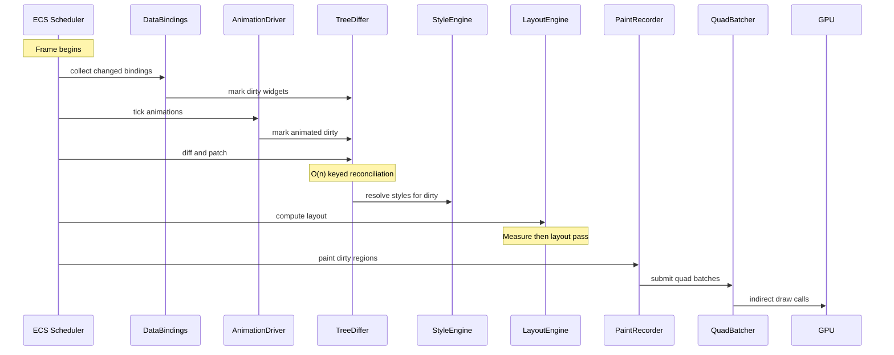
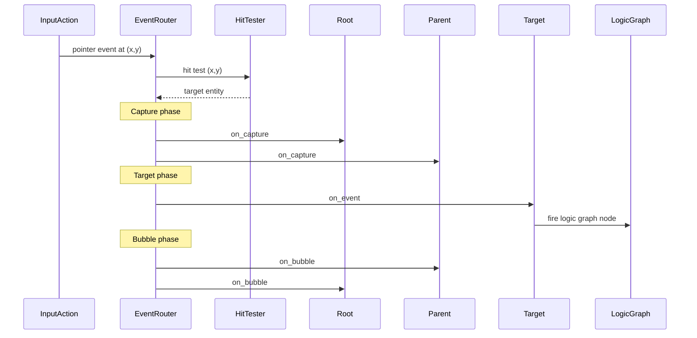
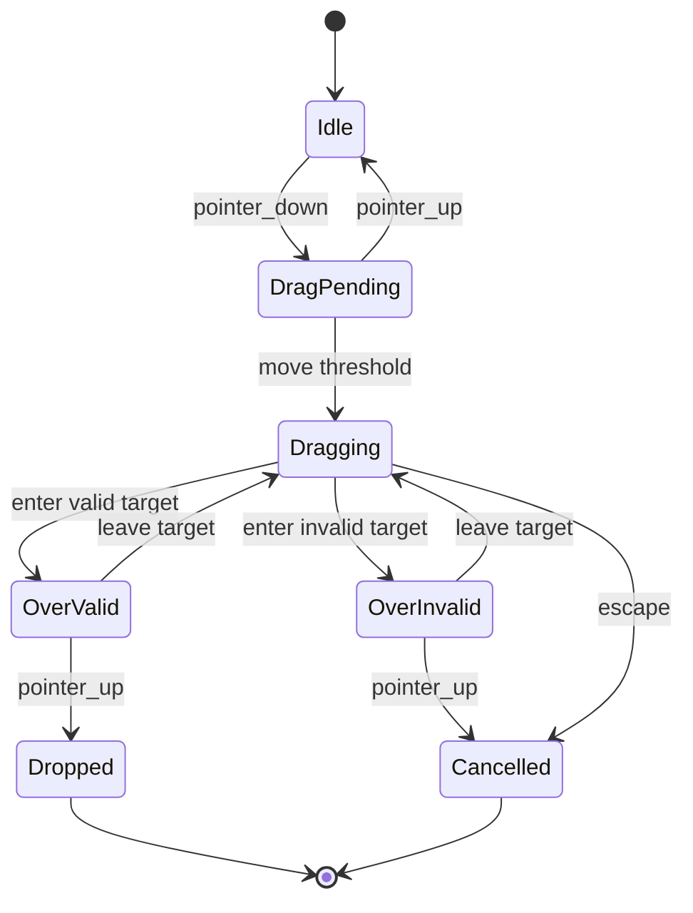

# UI Framework Design

## Requirements Trace

> **Canonical sources:** Features, requirements, and user stories are defined in
> [features/](../../features/), [requirements/](../../requirements/), and
> [user-stories/](../../user-stories/). The table below traces design elements to those definitions.

### Widget Framework (F-10.1 / R-10.1)

| Feature   | Requirement | User Stories                     |
|-----------|-------------|----------------------------------|
| F-10.1.1  | R-10.1.1    | US-10.1.1, US-10.1.2, US-10.1.3 |
| F-10.1.2  | R-10.1.2    | US-10.1.1                        |
| F-10.1.3  | R-10.1.3    | US-10.1.4, US-10.1.5             |
| F-10.1.4  | R-10.1.4    | US-10.1.6, US-10.1.8             |
| F-10.1.5  | R-10.1.5    | US-10.1.7, US-10.1.8             |
| F-10.1.6  | R-10.1.6    | US-10.1.9, US-10.1.10            |
| F-10.1.7  | R-10.1.7    | US-10.1.11, US-10.1.12           |
| F-10.1.8  | R-10.1.8    | US-10.1.13, US-10.1.14           |
| F-10.1.9  | R-10.1.9    | US-10.1.15, US-10.1.16           |
| F-10.1.10 | R-10.1.10   | US-10.1.17                       |
| F-10.1.11 | R-10.1.11   | US-10.1.18, US-10.1.19           |
| F-10.1.12 | R-10.1.12   | US-10.1.2, US-10.1.3             |
| F-10.1.13 | R-10.1.13   | US-10.1.20, US-10.1.21           |
| F-10.1.14 | R-10.1.14   | US-10.1.22, US-10.1.23           |

1. **F-10.1.1** — Declarative retained widget tree with minimal diff updates
2. **F-10.1.2** — Binary UI asset format with templates and slots
3. **F-10.1.3** — Widget pooling and recycling for virtualized lists
4. **F-10.1.4** — Flexbox and CSS grid layout algorithms
5. **F-10.1.5** — Anchor and constraint-based layout
6. **F-10.1.6** — Cascading styles with runtime theme swapping
7. **F-10.1.7** — Reactive one-way, two-way, and computed data binding
8. **F-10.1.8** — Focus traversal, tab order, directional nav, focus trapping
9. **F-10.1.9** — Localization hooks with RTL mirroring
10. **F-10.1.10** — World-space 3D UI panels with ray-cast input
11. **F-10.1.11** — VR input modes: laser, touch, gaze, hand tracking
12. **F-10.1.12** — O(n) keyed reconciliation tree diffing
13. **F-10.1.13** — Widget property animations with easing and interruption
14. **F-10.1.14** — Audio feedback per widget interaction

### Common Widgets (F-10.2 / R-10.2)

| Feature  | Requirement |
|----------|-------------|
| F-10.2.1 | R-10.2.1    |
| F-10.2.2 | R-10.2.2    |
| F-10.2.3 | R-10.2.3    |
| F-10.2.4 | R-10.2.4    |
| F-10.2.5 | R-10.2.5    |
| F-10.2.6 | R-10.2.6    |
| F-10.2.7 | R-10.2.7    |
| F-10.2.8 | R-10.2.8    |

1. **F-10.2.1** — Rich text with inline formatting, icons, hyperlinks, HarfBuzz shaping, BiDi
2. **F-10.2.2** — Text input with IME, clipboard, undo/redo, zero dropped characters
3. **F-10.2.3** — Buttons, sliders, toggles, checkboxes, radio buttons, spin boxes
4. **F-10.2.4** — Dropdown / combo box with search filtering and dynamic options
5. **F-10.2.5** — Virtualized scroll views with inertial scrolling, variable-height items
6. **F-10.2.6** — Tooltips, context menus, modal dialogs with z-ordering and stacking
7. **F-10.2.7** — Drag and drop with ghost preview, drop target highlight, stack splitting
8. **F-10.2.8** — Progress bars (linear, circular, segmented), loading spinners

### HUD & Game UI (F-10.3 / R-10.3)

| Feature   | Requirement |
|-----------|-------------|
| F-10.3.1  | R-10.3.1    |
| F-10.3.2  | R-10.3.2    |
| F-10.3.3  | R-10.3.3    |
| F-10.3.4  | R-10.3.4    |
| F-10.3.5  | R-10.3.5    |
| F-10.3.6  | R-10.3.6    |
| F-10.3.7  | R-10.3.7    |
| F-10.3.8  | R-10.3.8    |
| F-10.3.9  | R-10.3.9    |
| F-10.3.10 | R-10.3.10   |
| F-10.3.11 | R-10.3.11   |
| F-10.3.12 | R-10.3.12   |
| F-10.3.13 | R-10.3.13   |
| F-10.3.14 | R-10.3.14   |
| F-10.3.15 | R-10.3.15   |

1. **F-10.3.1** — Health / resource / cast bars, 40+ raid bars at 60 fps
2. **F-10.3.2** — Buff / debuff icons with radial sweep and priority filtering
3. **F-10.3.3** — Action bars with frame-accurate cooldown indicators
4. **F-10.3.4** — Nameplates anchored to 3D world positions, 200+ at 60 fps
5. **F-10.3.5** — Floating combat text with trajectories and cumulative merging
6. **F-10.3.6** — Minimap and world map with real-time markers
7. **F-10.3.7** — Quest tracker with waypoints and compass indicators
8. **F-10.3.8** — Chat system, multi-channel, 200+ msg/s throughput
9. **F-10.3.9** — Inventory grid with drag-drop, sort, filter, stack split
10. **F-10.3.10** — Compass bar with tracked objective markers
11. **F-10.3.11** — Off-screen objective indicators
12. **F-10.3.12** — Procedural minimap generation from world data
13. **F-10.3.13** — World map generation with tiled image pyramids
14. **F-10.3.14** — Artist-authored map overlays and post-processing
15. **F-10.3.15** — Data-driven map markers with quest integration

### UI Rendering (F-10.4 / R-10.4)

| Feature  | Requirement |
|----------|-------------|
| F-10.4.1 | R-10.4.1    |
| F-10.4.2 | R-10.4.2    |
| F-10.4.3 | R-10.4.3    |
| F-10.4.4 | R-10.4.4    |
| F-10.4.5 | R-10.4.5    |
| F-10.4.6 | R-10.4.6    |
| F-10.4.7 | R-10.4.7    |

1. **F-10.4.1** — Batched quad rendering via indirect dispatch
2. **F-10.4.2** — MSDF text rendering, 5000+ glyphs/frame
3. **F-10.4.3** — GPU-accelerated vector path rendering
4. **F-10.4.4** — UI atlas packing with nine-slice rendering
5. **F-10.4.5** — Render-to-texture for 3D-in-UI previews
6. **F-10.4.6** — World-space and diegetic UI in 3D render pass
7. **F-10.4.7** — SDF anti-aliased edges and stencil clipping

### Cross-Cutting Dependencies

| Dependency | Source | Consumed API |
|------------|--------|-------------|
| Entity lifecycle | F-1.1.11 | Generational `Entity` handles |
| ChildOf relationship | F-1.1.14 | Widget tree hierarchy |
| Command buffers | F-1.1.32 | Deferred structural changes |
| Change detection | F-1.1.22 | `Changed<T>` for data binding |
| Parallel iteration | F-1.1.20 | Chunk-level parallel query |
| System scheduling | F-1.1.25 | Phase ordering |
| Reflection | F-1.3.1 | `Reflect` derive for assets |
| Input actions | F-6.2 | Pointer, keyboard, gamepad |
| Audio mixer bus | F-5.1.3 | UI audio feedback channel |
| Logic graph | F-15.8.4 | Event handler wiring |

## Overview

The UI framework is the foundational layer of the Harmonius UI system. It manages a retained tree of
widget entities, a library of reusable interactive widgets, a GPU-accelerated rendering pipeline,
and game-specific HUD composites.

The design follows four principles:

1. **ECS-primary (~90%)-based.** Every widget is an entity. Every property is a component. Every pipeline
   stage is a system.
2. **Declarative + retained.** Artists author widget trees in the visual editor. The runtime
   maintains a retained tree and applies minimal diffs when bound data changes.
3. **No-code.** All event handlers wire to logic graph nodes. All styling, layout, and animation are
   configured through visual editors.
4. **Static dispatch.** Layout algorithms, style resolution, and event routing use enum dispatch
   over concrete types.

Three layers compose the system:

1. **Rendering** -- batched quad submission, MSDF text, vector paths, nine-slice, atlas management,
   anti-aliased clipping.
2. **Widgets** -- reusable interactive controls (buttons, sliders, dropdowns, scroll views,
   tooltips, drag-and-drop, progress bars, text input, rich text).
3. **HUD** -- game-specific composites built from the widget layer (health bars, action bars,
   nameplates, floating combat text, minimap, compass, chat, inventory grids).

### Performance Targets

| Metric | Target |
|--------|--------|
| Full HUD render | < 2 ms GPU, < 50 draws |
| Tree diff (500 widgets, 10%) | < 1 ms |
| Layout pass (500 widgets) | < 0.5 ms |
| Style resolution (500 widgets) | < 0.3 ms |
| Steady-state scroll allocs | Zero |
| Data binding propagation | Same-frame |

## Architecture

### Module Boundaries

```mermaid
graph TD
    subgraph "harmonius_ui::core — F-10.1"
        WT[WidgetTree]
        LY[Layout]
        STY[StyleResolver]
        DBind[DataBinding]
        FO[FocusManager]
        EV[EventRouter]
        AN[AnimationDriver]
        AU[AudioFeedback]
    end

    subgraph "harmonius_ui::widgets — F-10.2"
        BT[Button / Toggle / Slider]
        DD[Dropdown / ComboBox]
        SV[ScrollView / VirtualList]
        OV[Overlay / Tooltip / Modal]
        DnD[DragDropManager]
        PB[ProgressBar / Spinner]
        TX[TextInput / RichText]
        TB[TabBar / TreeView]
        CP[ColorPicker]
    end

    subgraph "harmonius_ui::hud — F-10.3"
        HB[HealthBar / ResourceBar]
        AB[ActionBar / Cooldown]
        BI[BuffDebuffIcons]
        NP[NameplateSystem]
        FCT[FloatingCombatText]
        MM[MinimapWidget]
        QT[QuestTracker]
        CMB[CompassBar]
        CH[ChatSystem]
        IG[InventoryGrid]
    end

    subgraph "harmonius_ui::rendering — F-10.4"
        QB[QuadBatcher]
        SA[SdfAtlas]
        NS[NineSliceSolver]
        VP[VectorPathRenderer]
        AC[AntiAliasClip]
        RT[RenderToTexture]
    end

    subgraph "harmonius_ui::animation"
        TW[TweenDriver]
        SP[SpringSolver]
        KF[KeyframePlayer]
    end

    BT --> WT
    DD --> WT
    SV --> WT
    OV --> WT
    PB --> WT
    TX --> WT

    HB --> QB
    AB --> QB
    NP --> QB
    FCT --> SA
    MM --> RT
    BI --> QB

    QB --> SA
    QB --> NS
    QB --> VP
    QB --> AC

    TW --> WT
    SP --> WT
    KF --> WT
```



### Crate Structure

```text
harmonius_ui/
├── widget/
│   ├── tree.rs          # WidgetTree root, traversal
│   ├── node.rs          # WidgetNode, WidgetKind
│   ├── pool.rs          # WidgetPool, free list
│   ├── differ.rs        # TreeDiffer, keyed recon
│   ├── event.rs         # EventRouter, hit test
│   ├── focus.rs         # FocusManager, tab order
│   ├── binding.rs       # DataBinding, one/two-way
│   ├── animation.rs     # AnimationDriver
│   ├── audio.rs         # AudioFeedback
│   └── asset.rs         # UIAssetLoader, binary fmt
├── layout/
│   ├── engine.rs        # LayoutEngine, measure/lay
│   ├── flex.rs          # FlexLayout algorithm
│   ├── grid.rs          # GridLayout algorithm
│   ├── anchor.rs        # AnchorLayout
│   └── constraint.rs    # ConstraintSolver
├── style/
│   ├── engine.rs        # StyleEngine, cascade
│   ├── theme.rs         # ThemeRegistry
│   ├── sheet.rs         # StyleSheet, rule storage
│   ├── selector.rs      # SelectorMatcher
│   └── cache.rs         # StyleCache
├── widgets/
│   ├── button.rs        # Button, Toggle, etc.
│   ├── slider.rs        # Slider, SpinBox
│   ├── dropdown.rs      # Dropdown, ComboBox
│   ├── scroll_view.rs   # ScrollView, VirtualList
│   ├── overlay.rs       # Tooltip, ContextMenu
│   ├── drag_drop.rs     # DragDropManager
│   ├── progress.rs      # ProgressBar, Spinner
│   ├── text_input.rs    # TextInput, RichText
│   ├── tab_bar.rs       # TabBar, TreeView
│   └── color_picker.rs  # ColorPicker
├── hud/
│   ├── health_bar.rs    # HealthBar, ResourceBar
│   ├── action_bar.rs    # ActionBar, Cooldown
│   ├── buff_icons.rs    # BuffDebuffGrid
│   ├── nameplate.rs     # NameplateSystem
│   ├── combat_text.rs   # FloatingCombatText
│   ├── minimap.rs       # MinimapWidget
│   ├── world_map.rs     # WorldMap, TiledPyramid
│   ├── compass.rs       # CompassBar
│   ├── quest_tracker.rs # QuestTracker
│   ├── chat.rs          # ChatSystem
│   └── inventory.rs     # InventoryGrid
├── rendering/
│   ├── batcher.rs       # QuadBatcher
│   ├── sdf_atlas.rs     # MSDF glyph atlas
│   ├── nine_slice.rs    # NineSliceSolver
│   ├── vector_path.rs   # VectorPathRenderer
│   ├── atlas.rs         # UiAtlas, repack
│   ├── clip.rs          # Stencil / clip stack
│   └── rtt.rs           # RenderToTexture
├── animation/
│   ├── tween.rs         # TweenDriver, easing
│   ├── spring.rs        # SpringSolver
│   └── keyframe.rs      # KeyframePlayer
└── systems.rs           # ECS system registration
```

### Core Data Structures

```mermaid
classDiagram
    class WidgetNode {
        +Entity entity
        +WidgetKind kind
        +WidgetKey key
        +DirtyFlags dirty
    }

    class WidgetKind {
        <<enum>>
        Panel
        Label
        Button
        TextInput
        Slider
        Checkbox
        Toggle
        ScrollView
        ListView
        Image
        ProgressBar
        ComboBox
        Custom(CustomWidgetId)
    }

    class WidgetKey {
        <<enum>>
        Index(u32)
        Named(StringId)
    }

    class LayoutComponent {
        +LayoutMode mode
        +Size min_size
        +Size max_size
        +Size preferred_size
        +Edges margin
        +Edges padding
    }

    class LayoutMode {
        <<enum>>
        Flex(FlexParams)
        Grid(GridParams)
        Anchor(AnchorParams)
        Constraint(ConstraintParams)
    }

    class ComputedLayout {
        +Vec2 position
        +Vec2 size
        +Rect clip_rect
        +Vec2 global_position
    }

    class StyleComponent {
        +Option~StringId~ id
        +SmallVec~StyleClassId 4~ classes
        +Option~StyleProperties~ inline_style
    }

    class ComputedStyle {
        +Color background_color
        +Color text_color
        +FontId font
        +f32 font_size
        +f32 opacity
        +Corners border_radius
        +Edges border_width
        +Color border_color
        +Option~Shadow~ shadow
        +CursorStyle cursor
        +Visibility visibility
        +Overflow overflow
    }

    class InteractionState {
        +bool hovered
        +bool pressed
        +bool focused
        +bool disabled
    }

    class DataBindingComponent {
        +SmallVec~Binding 2~ bindings
        +SmallVec~ComputedBinding 1~ computed
    }

    class AnimationComponent {
        +SmallVec~ActiveAnimation 2~ active
        +SmallVec~TransitionAnimation 4~ transitions
    }

    class AudioSlots {
        +Option~AudioAssetId~ click
        +Option~AudioAssetId~ hover_enter
        +Option~AudioAssetId~ hover_exit
        +Option~AudioAssetId~ focus_gain
        +Option~AudioAssetId~ focus_loss
    }

    class UiNode {
        +WidgetType widget_type
        +WidgetFlags flags
    }

    class UiTransform {
        +Vec2 position
        +Vec2 size
        +f32 rotation
        +Vec2 scale
        +Vec2 pivot
        +AnchorPreset anchor
    }

    class ComputedRect {
        +Vec2 global_pos
        +Vec2 global_size
        +u16 z_order
        +Rect clip_rect
    }

    class HealthBar {
        +f32 current
        +f32 max
        +f32 predicted_damage
        +f32 absorb_shield
        +BarSegmentation segmentation
    }

    class ActionSlot {
        +AbilityId ability
        +f32 cooldown_remaining
        +f32 cooldown_total
        +u8 charges
        +SlotUsability usability
    }

    class Nameplate {
        +Entity target_entity
        +f32 max_distance
        +NameplatePriority priority
    }

    class WorldSpaceAnchor {
        +Vec3 world_position
        +Vec2 screen_offset
        +BillboardMode billboard
    }

    class DragState {
        +DragPhase phase
        +Option~Entity~ source_entity
        +Option~DragPayload~ payload
        +Vec2 pointer_pos
    }

    class QuadInstance {
        +f32[2] position
        +f32[2] size
        +f32[4] uv_rect
        +f32[4] tint
        +f32[4] corner_radius
        +f32[4] clip_rect
        +u32 atlas_page
        +u32 flags
    }

    WidgetNode *-- WidgetKind
    WidgetNode *-- WidgetKey
    WidgetNode --> LayoutComponent
    WidgetNode --> StyleComponent
    WidgetNode --> ComputedLayout
    WidgetNode --> ComputedStyle
    WidgetNode --> InteractionState
    WidgetNode --> DataBindingComponent
    WidgetNode --> AnimationComponent
    WidgetNode --> AudioSlots
    LayoutComponent *-- LayoutMode
    UiNode *-- UiTransform
    UiNode *-- ComputedRect
    UiNode o-- HealthBar
    UiNode o-- ActionSlot
    UiNode o-- Nameplate
    Nameplate *-- WorldSpaceAnchor
```



### Frame Update Pipeline



### Event Routing



### Nameplate Culling Pipeline


### Drag-and-Drop State Machine



## API Design

API types are split across widget identity, layout, styling, data binding, event routing, focus
management, animation, audio feedback, HUD components, UI rendering, and asset format sections. All
types derive `Reflect`.

See [widget-framework.md](widget-framework.md) and [hud-widgets.md](hud-widgets.md) for the full API
pseudocode. The consolidated API is summarized below.

### Widget Identity

```rust
pub type WidgetId = Entity;

#[derive(Clone, Debug, PartialEq, Eq, Hash, Reflect)]
pub enum WidgetKey {
    Index(u32),
    Named(StringId),
}

#[derive(Clone, Copy, Debug, PartialEq, Eq, Hash, Reflect)]
pub enum WidgetKind {
    Panel, Label, Button, TextInput, Slider,
    Checkbox, Toggle, ScrollView, ListView,
    Image, ProgressBar, ComboBox,
    Custom(CustomWidgetId),
}

#[derive(Component, Reflect)]
pub struct WidgetNode {
    pub kind: WidgetKind,
    pub key: WidgetKey,
    pub dirty: DirtyFlags,
}

bitflags::bitflags! {
    #[derive(Clone, Copy, Debug, Reflect)]
    pub struct DirtyFlags: u16 {
        const STYLE     = 0b0000_0001;
        const LAYOUT    = 0b0000_0010;
        const PAINT     = 0b0000_0100;
        const BINDING   = 0b0000_1000;
        const CHILDREN  = 0b0001_0000;
        const ANIMATION = 0b0010_0000;
        const ALL       = 0b0011_1111;
    }
}
```

### Layout System

```rust
#[derive(Clone, Debug, Reflect)]
pub enum LayoutMode {
    Flex(FlexParams),
    Grid(GridParams),
    Anchor(AnchorParams),
    Constraint(ConstraintParams),
}

#[derive(Component, Clone, Debug, Reflect)]
pub struct LayoutComponent {
    pub mode: LayoutMode,
    pub min_size: Size,
    pub max_size: Size,
    pub preferred_size: Size,
    pub margin: Edges,
    pub padding: Edges,
    pub flex_grow: f32,
    pub flex_shrink: f32,
    pub flex_basis: SizeValue,
    pub grid_column: Option<GridPlacement>,
    pub grid_row: Option<GridPlacement>,
}

#[derive(Component, Clone, Copy, Debug, Reflect)]
pub struct ComputedLayout {
    pub position: Vec2,
    pub size: Vec2,
    pub clip_rect: Rect,
    pub global_position: Vec2,
}
```

### Styling System

```rust
#[derive(Component, Clone, Debug, Reflect)]
pub struct StyleComponent {
    pub id: Option<StringId>,
    pub classes: SmallVec<[StyleClassId; 4]>,
    pub inline_style: Option<StyleProperties>,
}

#[derive(Component, Clone, Debug, Default, Reflect)]
pub struct ComputedStyle {
    pub background_color: Color,
    pub text_color: Color,
    pub font: FontId,
    pub font_size: f32,
    pub opacity: f32,
    pub border_radius: Corners,
    pub border_width: Edges,
    pub border_color: Color,
    pub shadow: Option<Shadow>,
    pub cursor: CursorStyle,
    pub visibility: Visibility,
    pub overflow: Overflow,
}

#[derive(Clone, Debug, Reflect)]
pub struct Theme {
    pub name: StringId,
    pub sheets: Vec<StyleSheet>,
}

pub struct ThemeRegistry {
    themes: Vec<Theme>,
    active_theme: usize,
}
```

### Data Binding

```rust
#[derive(Clone, Copy, Debug, Reflect)]
pub enum BindingDirection { OneWay, TwoWay }

#[derive(Clone, Debug, Reflect)]
pub struct Binding {
    pub direction: BindingDirection,
    pub source_entity: Entity,
    pub source_path: ReflectPath,
    pub target_property: WidgetProperty,
    pub transform: Option<BindingTransform>,
}

#[derive(Component, Clone, Debug, Reflect)]
pub struct DataBindingComponent {
    pub bindings: SmallVec<[Binding; 2]>,
    pub computed: SmallVec<[ComputedBinding; 1]>,
}
```

### Common Widget Components

```rust
#[derive(Component, Clone, Debug, Reflect)]
pub struct Button {
    pub label: Option<String>,
    pub icon: Option<UiImage>,
    pub toggle_state: Option<bool>,
}

#[derive(Component, Clone, Debug, Reflect)]
pub struct Slider {
    pub value: f32,
    pub min: f32,
    pub max: f32,
    pub step: Option<f32>,
    pub orientation: Orientation,
}

#[derive(Component, Clone, Debug, Reflect)]
pub struct ScrollView {
    pub scroll_offset: Vec2,
    pub scroll_velocity: Vec2,
    pub overscroll: OverscrollMode,
    pub show_scrollbars: ScrollbarVisibility,
}

#[derive(Component, Clone, Debug, Reflect)]
pub struct VirtualList {
    pub total_item_count: u32,
    pub visible_start: u32,
    pub visible_count: u32,
    pub buffer_count: u32,
    pub item_height_mode: ItemHeightMode,
}
```

### HUD Components

```rust
#[derive(Component, Clone, Debug, Reflect)]
pub struct HealthBar {
    pub current: f32,
    pub max: f32,
    pub predicted_damage: f32,
    pub absorb_shield: f32,
    pub resource_type: ResourceType,
    pub segmentation: BarSegmentation,
    pub fill_direction: FillDirection,
}

#[derive(Component, Clone, Debug, Reflect)]
pub struct ActionSlot {
    pub ability: Option<AbilityId>,
    pub cooldown_remaining: f32,
    pub cooldown_total: f32,
    pub charges: u8,
    pub max_charges: u8,
    pub usability: SlotUsability,
    pub keybind_label: String,
}

#[derive(Component, Clone, Debug, Reflect)]
pub struct Nameplate {
    pub target_entity: Entity,
    pub max_distance: f32,
    pub priority: NameplatePriority,
    pub show_health: bool,
    pub show_cast_bar: bool,
    pub show_guild: bool,
}

#[derive(Component, Clone, Debug, Reflect)]
pub struct WorldSpaceAnchor {
    pub world_position: Vec3,
    pub screen_offset: Vec2,
    pub billboard: BillboardMode,
    pub depth_test: bool,
}

#[derive(Component, Clone, Debug, Reflect)]
pub struct FloatingCombatText {
    pub value: f32,
    pub text_type: CombatTextType,
    pub trajectory: CombatTextTrajectory,
    pub spawn_world_pos: Vec3,
    pub elapsed: f32,
    pub lifetime: f32,
    pub merge_key: Option<u64>,
}
```

### UI Rendering

```rust
#[repr(C)]
#[derive(Clone, Copy, Debug)]
pub struct QuadInstance {
    pub position: [f32; 2],
    pub size: [f32; 2],
    pub uv_rect: [f32; 4],
    pub tint: [f32; 4],
    pub corner_radius: [f32; 4],
    pub clip_rect: [f32; 4],
    pub rotation: f32,
    pub atlas_page: u32,
    pub flags: u32,
    pub _pad: u32,
}

pub struct QuadBatcher {
    instance_buffer: GpuBuffer,
    indirect_buffer: GpuBuffer,
    batches: Vec<BatchDescriptor>,
}

#[derive(Clone, Debug)]
pub struct BatchDescriptor {
    pub atlas_page: u32,
    pub blend_state: BlendState,
    pub instance_offset: u32,
    pub instance_count: u32,
    pub render_pass: UiRenderPass,
}
```

## Data Flow

### Full Frame Pipeline

```rust
// --- PreUpdate: Route input events ---
event_routing_system(world);

// --- Game logic modifies ECS state ---

// --- PostUpdate: Widget framework pipeline ---
// 1. Binding collection
binding_collection_system(world);
// 2. Animation tick
animation_tick_system(world, dt);
// 3. Tree diff
tree_diff_system(world);
// 4. Style resolution
style_resolution_system(world);
// 5. Layout
layout_system(world);
// 6. Paint
paint_system(world);
// 7. Audio feedback
audio_feedback_system(world);
```

### Quad Batching Pipeline

1. **Begin** -- clear previous frame submissions.
2. **Submit** -- iterate entities with `ComputedRect`, emit `QuadInstance` per visible element.
3. **Sort** -- by `(render_pass, atlas_page, blend_state, z_order)`.
4. **Merge** -- consecutive same-key quads into one batch.
5. **Upload** -- single contiguous GPU buffer.
6. **Dispatch** -- one indirect draw call per batch.

### Sort Key Layout

| Bits | Field | Purpose |
|------|-------|---------|
| 63 | render_pass | Screen (0) vs world (1) |
| 62..48 | atlas_page | Minimize texture binds |
| 47..46 | blend_state | Pipeline state groups |
| 45..30 | z_order | Back-to-front |
| 29..0 | submission_order | Stable tiebreaker |

### Widget Recycling (Virtualized List)

1. Items scrolling out are removed via `PatchOp::Remove`.
2. `WidgetPool::release` resets components, adds to free list.
3. Items scrolling in trigger `PatchOp::Insert`.
4. `WidgetPool::acquire` pulls a recycled entity.
5. Zero heap allocations during steady-state scroll (R-10.1.3).

## Platform Considerations

### Widget Budgets

| Platform | Active | Nameplates | 3D Previews |
|----------|--------|------------|-------------|
| Mobile | 200 | 50 | 1 (quarter) |
| Desktop | 500 | 200 | 4 (half) |
| Console | 500 | 200 | 2 (half) |
| VR | 300 | 100 | 2 (half) |

### Atlas Page Sizes

| Platform | Page Size | Max Pages |
|----------|-----------|-----------|
| Mobile | 2048x2048 | 4 |
| Desktop | 4096x4096 | 8 |
| Console | 4096x4096 | 8 |

### IME Integration

| Platform | API | Access |
|----------|-----|--------|
| Windows | IMM32 / TSF | windows-rs |
| macOS | Text Services | swift-bridge |
| Linux | IBus / Fcitx | Rust crate |

### Text Shaping

HarfBuzz-compatible shaping bundled via `rustybuzz` for cross-platform identical output. MSDF
atlases are generated at asset build time.

### VR Platform Support

| Feature | OpenXR API |
|---------|-----------|
| Laser pointer | `XrPointerInput` |
| Direct touch | `XrHandTrackingEXT` |
| Gaze-and-dwell | `XrEyeTrackerEXT` |
| Hand tracking | `XrHandTrackingEXT` |

### Proposed Dependencies

| Crate | Purpose |
|-------|---------|
| `rustybuzz` | HarfBuzz-compatible shaping |
| `unicode-bidi` | Unicode BiDi algorithm |
| `msdfgen` | MSDF atlas generation (build) |
| `rect_packer` | Rectangle bin packing |
| `bitflags` | Bitflag types |

## Test Plan

Tests are defined in the companion file [ui-framework-test-cases.md](ui-framework-test-cases.md).

### Unit Tests

| Test | Req |
|------|-----|
| `test_tree_diff_insert` | R-10.1.1 |
| `test_tree_diff_remove` | R-10.1.1 |
| `test_tree_diff_reorder_keyed` | R-10.1.12 |
| `test_pool_acquire_release` | R-10.1.3 |
| `test_pool_zero_alloc_scroll` | R-10.1.3 |
| `test_flex_row_gap` | R-10.1.4 |
| `test_grid_2x3` | R-10.1.4 |
| `test_anchor_bottom_right` | R-10.1.5 |
| `test_constraint_equal_widths` | R-10.1.5 |
| `test_style_cascade_specificity` | R-10.1.6 |
| `test_style_theme_swap` | R-10.1.6 |
| `test_binding_one_way` | R-10.1.7 |
| `test_binding_two_way` | R-10.1.7 |
| `test_binding_same_frame` | R-10.1.7 |
| `test_focus_tab_order` | R-10.1.8 |
| `test_focus_trap_modal` | R-10.1.8 |
| `test_locale_rtl_mirror` | R-10.1.9 |
| `test_animation_interrupt` | R-10.1.13 |
| `test_audio_click` | R-10.1.14 |
| `test_event_hit_test` | R-10.1.1 |
| `test_event_bubble` | R-10.1.1 |
| `test_rich_text_inline_formatting` | R-10.2.1 |
| `test_text_input_clipboard_ops` | R-10.2.2 |
| `test_slider_no_jitter` | R-10.2.3 |
| `test_dropdown_filter_500` | R-10.2.4 |
| `test_virtual_list_10k` | R-10.2.5 |
| `test_overlay_z_stacking` | R-10.2.6 |
| `test_drag_drop_cross_panel` | R-10.2.7 |
| `test_progress_bar_fill` | R-10.2.8 |
| `test_health_bar_overlays` | R-10.3.1 |
| `test_cooldown_frame_accuracy` | R-10.3.3 |
| `test_nameplate_overlap` | R-10.3.4 |
| `test_combat_text_merge` | R-10.3.5 |
| `test_minimap_markers` | R-10.3.6 |
| `test_compass_bearing` | R-10.3.10 |
| `test_chat_200_msg_per_sec` | R-10.3.8 |
| `test_inventory_sort_filter` | R-10.3.9 |

### Integration Tests

| Test | Req |
|------|-----|
| `test_asset_round_trip` | R-10.1.2 |
| `test_full_hud_layout` | R-10.1.4 |
| `test_world_space_panel_input` | R-10.1.10 |
| `test_vr_laser_input` | R-10.1.11 |
| `test_quad_batching_500` | R-10.4.1 |
| `test_msdf_text_scales` | R-10.4.2 |
| `test_raid_frame_40_bars` | R-10.3.1 |
| `test_nameplate_200` | R-10.3.4 |

### Benchmarks

| Benchmark | Target | Source |
|-----------|--------|--------|
| Tree diff (500, 10%) | < 1 ms | R-10.1.12 |
| Layout (500 widgets) | < 0.5 ms | R-10.1.4 |
| Style (500 widgets) | < 0.3 ms | R-10.1.6 |
| Paint (full HUD) | < 2 ms GPU | US-10.4.2 |
| Quad batch 500 | < 50 draws | US-10.4.2 |
| MSDF 5K glyphs | < 4 ms | R-10.4.2 |
| Virtual list 10k | < 4 ms/frame | R-10.2.5 |
| Nameplate cull 250 | < 0.5 ms | R-10.3.4 |

## Design Q & A

**Q1. What is the biggest constraint?**

The static dispatch constraint makes widget composition less polymorphic. Every type must be known
at compile time via enum dispatch. We accept this because it eliminates vtable indirection in the
hot layout and render paths, critical for the 500-widget mobile budget and 60 fps target.

**Q2. How can this design be improved?**

The tree diff falls back to O(n^2) for unkeyed children. Auto-generating keys from item data
identity for data-bound lists would guarantee O(n) without burdening designers. The nameplate system
could share a WorldToScreenCache with other world-anchored UI to eliminate redundant projection
math.

**Q3. Is there a better approach?**

Immediate-mode UI would eliminate the retained tree and diff entirely. We chose retained-mode
because the engine targets complex UIs with hundreds of persistent widgets, data bindings, and
animations. Retained with minimal diffing amortizes state evaluation across frames, only updating
what changed.

**Q4. Does this design solve all customer problems?**

VR input modes cover laser, touch, gaze, and hand tracking but lack seated VR comfort mode with
adaptive re-centering. The inventory grid also lacks item comparison tooltips for RPG stat deltas.
The compass and off-screen indicators cover navigation but lack 3D waypoint beams for distant
objectives.

**Q5. Is this design cohesive?**

The framework integrates cleanly with core-runtime through ECS-backed data binding, the render graph
for batched drawing, and the event bus for input dispatch. One tension is that widget animations run
their own timer system rather than using the engine animation subsystem. Sharing curve evaluation
and easing infrastructure would improve cohesion.

## Open Questions

1. **Constraint solver** -- Cassowary vs custom incremental solver. Simpler fixed-iteration may
   suffice.
2. **Style cache invalidation** -- Full clear on theme swap vs incremental invalidation by changed
   rule selectors.
3. **Tree diff batching** -- Immediate command buffers vs batched single flush for structural
   changes.
4. **Computed binding language** -- Stack-machine expressions vs richer conditionals pushed to logic
   graph.
5. **Custom widget trait object** -- `Box<dyn CustomWidget>` is the one dynamic dispatch point.
   Alternatives: enum registration or code generation.
6. **World-space panel render target sharing** -- Single large target with atlas sub-regions vs
   per-panel targets.
7. **Chat deduplication** -- Current throttling does not catch copy-paste spam. Message
   fingerprinting needed.
