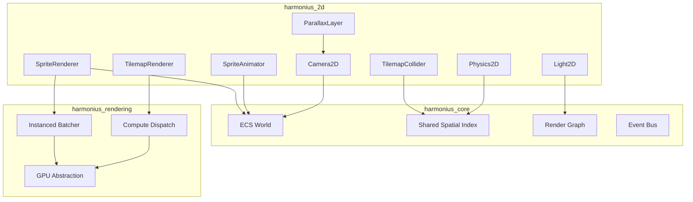
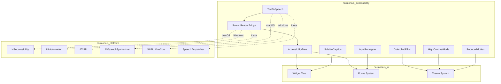
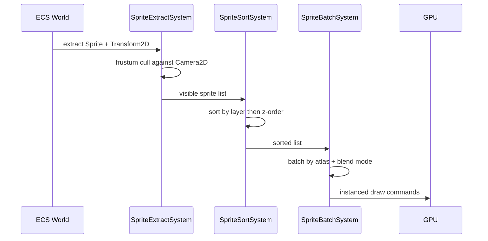
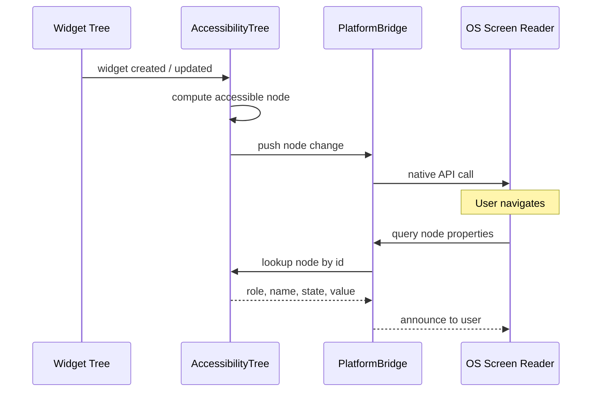
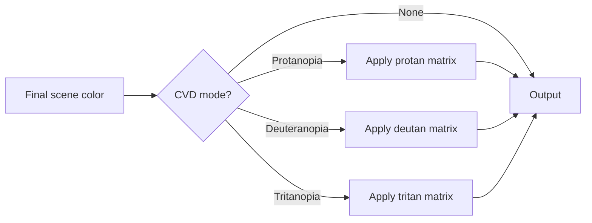

# UI Specialized: 2D Games & Accessibility Design

## Requirements Trace

> **Canonical sources:** Features, requirements, and user stories are defined in
> [features/](../../features/), [requirements/](../../requirements/), and
> [user-stories/](../../user-stories/). The table below traces design elements to those definitions.

### 2D Game Support (F-10.5 / R-10.5)

| Feature   | Requirement | User Story             |
|-----------|-------------|------------------------|
| F-10.5.1  | R-10.5.1    | US-10.5.1              |
| F-10.5.2  | R-10.5.2    | US-10.5.2, US-10.5.3   |
| F-10.5.6  | R-10.5.6    | US-10.5.8, US-10.5.9   |
| F-10.5.7  | R-10.5.7    | US-10.5.10, US-10.5.11 |
| F-10.5.9  | R-10.5.9    | US-10.5.13, US-10.5.14 |
| F-10.5.10 | R-10.5.10   | US-10.5.15, US-10.5.16 |
| F-10.5.11 | R-10.5.11   | US-10.5.17             |
| F-10.5.12 | R-10.5.12   | US-10.5.18             |
| F-10.5.13 | R-10.5.13   | US-10.5.19             |
| F-10.5.14 | R-10.5.14   | US-10.5.20, US-10.5.21 |
| F-10.5.15 | R-10.5.15   | US-10.5.22             |

1. **F-10.5.1** — Sprite rendering and sprite sheets
2. **F-10.5.2** — Frame-based sprite animation
3. **F-10.5.6** — Tilemap rendering (orthogonal)
4. **F-10.5.7** — Isometric and hex tilemaps
5. **F-10.5.9** — 2D camera and parallax
6. **F-10.5.10** — 2D rigid body physics
7. **F-10.5.11** — 2D collision shapes and tilemap colliders
8. **F-10.5.12** — 2D joints and constraints
9. **F-10.5.13** — 2D spatial queries
10. **F-10.5.14** — 2D dynamic lighting
11. **F-10.5.15** — 2D particle effects

### Accessibility (F-10.6 / R-10.6)

| Feature  | Requirement | User Story                      |
|----------|-------------|---------------------------------|
| F-10.6.1 | R-10.6.1    | US-10.6.1, US-10.6.2, US-10.6.3 |
| F-10.6.2 | R-10.6.2    | US-10.6.4, US-10.6.5, US-10.6.6 |
| F-10.6.3 | R-10.6.3    | US-10.6.7, US-10.6.8, US-10.6.9 |
| F-10.6.4 | R-10.6.4    | US-10.6.10..US-10.6.12           |
| F-10.6.5 | R-10.6.5    | US-10.6.13..US-10.6.15           |
| F-10.6.6 | R-10.6.6    | US-10.6.16..US-10.6.18           |
| F-10.6.7 | R-10.6.7    | US-10.6.19..US-10.6.21           |

1. **F-10.6.1** — Screen reader support
2. **F-10.6.2** — Subtitle and caption system
3. **F-10.6.3** — Colorblind modes
4. **F-10.6.4** — High contrast and scalable UI
5. **F-10.6.5** — Input remapping for accessibility
6. **F-10.6.6** — Text-to-speech for chat
7. **F-10.6.7** — WCAG 2.1 compliance

## Overview

This document combines the 2D game support subsystem with the accessibility subsystem. Both extend
the core UI framework with specialized rendering, physics, and assistive technology integration.

### 2D Game Support

A complete 2D rendering, physics, and gameplay framework built entirely on ECS. All 2D data lives as
components; all logic runs as systems.

Core subsystems:

1. **Sprite rendering** -- instanced textured quads, atlas batching, z-order sorting, layer
   composition
2. **Tilemap rendering** -- chunked grids, compute dispatch, orthogonal/isometric/hex layouts
3. **2D physics** -- rigid bodies, collision shapes, joints, spatial queries, deterministic
   simulation
4. **2D camera** -- orthographic projection, parallax, pixel- perfect snapping, split-screen
5. **Sprite animation** -- frame sequences, playback modes, animation events
6. **2D lighting** -- point/spot lights, shadow casting, normal maps, emissive sprites

### Accessibility

Ensures the engine is usable by players with visual, auditory, motor, and cognitive disabilities.
Every feature is ECS components and systems, integrated with the widget tree and theme system.

Core subsystems:

1. **Screen reader bridge** -- platform accessibility APIs (NSAccessibility, UI Automation, AT-SPI)
   with ARIA-like roles and live region announcements
2. **Colorblind filters** -- post-process CVD remapping plus non-color alternative visual cues
3. **WCAG compliance** -- automated contrast checking, focus indicators, keyboard operability
4. **Keyboard/controller navigation** -- full UI traversal without mouse, scanning mode for switch
   devices
5. **Text-to-speech** -- platform TTS for chat, notifications, and UI announcements
6. **Subtitle/caption system** -- configurable subtitles with directional indicators for non-speech
   audio
7. **Input remapping** -- complete rebinding, hold-to-toggle, per-character profiles
8. **High contrast / reduced motion** -- stark color pairs, animation suppression

## Architecture

### 2D Module Boundaries



### Accessibility Module Boundaries



### Core Data Structures

```mermaid
classDiagram
    class Sprite {
        +u32 atlas_index
        +Rect uv_rect
        +Color tint
        +bool flip_x
        +bool flip_y
        +Vec2 pivot
    }

    class Transform2D {
        +Vec2 position
        +f32 rotation
        +Vec2 scale
    }

    class SpriteLayer {
        +i16 layer
        +f32 z_order
    }

    class SpriteAnimation {
        +AssetId clip_id
        +u32 frame_index
        +f32 elapsed
        +f32 playback_rate
        +PlaybackMode mode
        +PlaybackState state
    }

    class TilemapChunk {
        +GridType grid_type
        +IVec2 chunk_pos
        +Vec2 tile_size
        +Vec~TileId~ tiles
        +u32 width
        +u32 height
    }

    class Camera2D {
        +f32 zoom
        +Rect viewport
        +Rect dead_zone
        +CameraSmoothing smoothing
        +bool pixel_perfect
    }

    class RigidBody2D {
        +BodyType2D body_type
        +f32 gravity_scale
        +f32 linear_damping
        +f32 angular_damping
    }

    class Collider2D {
        +Shape2D shape
        +f32 friction
        +f32 restitution
        +bool is_sensor
    }

    class Light2D {
        +LightType2D light_type
        +Color color
        +f32 intensity
        +f32 radius
        +FalloffCurve falloff
    }

    class AccessibleNode {
        +Entity entity
        +AccessibleRole role
        +Vec~AccessibleState~ states
        +AccessibleProperties properties
        +Vec~Entity~ children
    }

    class AccessibleRole {
        <<enum>>
        Button
        Checkbox
        Slider
        TextInput
        Dialog
        ProgressBar
        None
    }

    class AccessibilityTree {
        -HashMap nodes
        -Entity root
        -Vec~Entity~ dirty
        +sync(widget_tree)
        +announce(entity, msg, mode)
    }

    class ColorblindFilter {
        +ColorVisionDeficiency mode
        +f32 severity
        +bool correction
        +color_matrix() mat3
    }

    class ColorVisionDeficiency {
        <<enum>>
        None
        Protanopia
        Deuteranopia
        Tritanopia
    }

    class HighContrastSettings {
        +bool enabled
        +Color foreground
        +Color background
        +Color border
        +f32 border_width
    }

    class UiScaleSettings {
        +f32 user_scale
        +f32 system_dpi_scale
        +f32 effective_scale
    }

    class ReducedMotionSettings {
        +bool enabled
        +f32 animation_scale
        +bool disable_parallax
        +bool disable_camera_shake
    }

    class SubtitleSettings {
        +bool enabled
        +f32 font_size
        +Color text_color
        +SubtitlePosition position
    }

    class AccessibilitySettings {
        +ColorblindFilter colorblind
        +HighContrastSettings high_contrast
        +UiScaleSettings ui_scale
        +SubtitleSettings subtitles
        +ReducedMotionSettings reduced_motion
    }

    Sprite --> Transform2D
    Sprite --> SpriteLayer
    Sprite --> SpriteAnimation
    TilemapChunk --> GridType
    RigidBody2D --> Collider2D
    Light2D --> Transform2D
    AccessibleNode --> AccessibleRole
    AccessibilityTree *-- AccessibleNode
    ColorblindFilter --> ColorVisionDeficiency
    AccessibilitySettings --> ColorblindFilter
    AccessibilitySettings --> HighContrastSettings
    AccessibilitySettings --> UiScaleSettings
    AccessibilitySettings --> ReducedMotionSettings
```



### Sprite Rendering Pipeline



### Screen Reader Data Flow



### Colorblind Filter Pipeline



## API Design

### 2D Core Types

```rust
#[derive(Clone, Copy, Debug, Reflect)]
pub struct Transform2D {
    pub position: Vec2,
    pub rotation: f32,
    pub scale: Vec2,
}

#[derive(Clone, Debug, Reflect)]
pub struct Sprite {
    pub atlas_index: u32,
    pub uv_rect: Rect,
    pub tint: Color,
    pub flip_x: bool,
    pub flip_y: bool,
    pub pivot: Vec2,
}

#[derive(Clone, Copy, Debug, Reflect)]
pub struct SpriteLayer {
    pub layer: i16,
    pub z_order: f32,
}

#[derive(Clone, Copy, Debug, PartialEq, Eq, Reflect)]
pub enum GridType {
    Orthogonal,
    IsometricDiamond,
    IsometricStaggered,
    HexFlatTop,
    HexPointyTop,
}

#[derive(Clone, Debug, Reflect)]
pub struct TilemapChunk {
    pub grid_type: GridType,
    pub chunk_pos: IVec2,
    pub tile_size: Vec2,
    pub width: u32,
    pub height: u32,
    pub tiles: Vec<TileId>,
    pub flags: Vec<TileFlags>,
}
```

### 2D Physics

```rust
#[derive(Clone, Copy, Debug, PartialEq, Eq, Reflect)]
pub enum BodyType2D { Dynamic, Kinematic, Static }

#[derive(Clone, Debug, Reflect)]
pub struct RigidBody2D {
    pub body_type: BodyType2D,
    pub gravity_scale: f32,
    pub linear_damping: f32,
    pub angular_damping: f32,
    pub fixed_rotation: bool,
    pub ccd_enabled: bool,
}

#[derive(Clone, Debug, Reflect)]
pub enum Shape2D {
    Circle { radius: f32 },
    Box { half_extents: Vec2 },
    Capsule { half_height: f32, radius: f32 },
    ConvexPolygon { vertices: Vec<Vec2> },
    EdgeChain { vertices: Vec<Vec2> },
    Composite { shapes: Vec<Shape2D> },
}

#[derive(Clone, Debug, Reflect)]
pub struct Collider2D {
    pub shape: Shape2D,
    pub friction: f32,
    pub restitution: f32,
    pub is_sensor: bool,
    pub layer: u32,
    pub mask: u32,
    pub one_way: bool,
}

#[derive(Clone, Debug, Reflect)]
pub enum Joint2D {
    Revolute { anchor_a: Vec2, anchor_b: Vec2,
        motor: Option<JointMotor>,
        limits: Option<AngleLimits> },
    Prismatic { anchor_a: Vec2, anchor_b: Vec2,
        axis: Vec2 },
    Distance { anchor_a: Vec2, anchor_b: Vec2,
        length: f32, stiffness: f32 },
    Spring { anchor_a: Vec2, anchor_b: Vec2,
        rest_length: f32, stiffness: f32 },
    Rope { anchor_a: Vec2, anchor_b: Vec2,
        max_length: f32 },
    Weld { anchor_a: Vec2, anchor_b: Vec2 },
    Mouse { target: Vec2, max_force: f32 },
}
```

### 2D Lighting

```rust
#[derive(Clone, Copy, Debug, PartialEq, Eq, Reflect)]
pub enum LightType2D { Point, Spot, Ambient }

#[derive(Clone, Debug, Reflect)]
pub struct Light2D {
    pub light_type: LightType2D,
    pub color: Color,
    pub intensity: f32,
    pub radius: f32,
    pub falloff: FalloffCurve,
    pub cast_shadows: bool,
    pub shadow_softness: f32,
}

#[derive(Clone, Debug, Reflect)]
pub struct ShadowCaster2D {
    pub occluder: Option<Vec<Vec2>>,
    pub self_shadow: bool,
}
```

### Accessibility Types

```rust
#[derive(Clone, Copy, Debug, PartialEq, Eq, Reflect)]
pub enum AccessibleRole {
    Button, Checkbox, Radio, Slider, TextInput,
    ListItem, Menu, MenuItem, Tab, Dialog,
    Alert, Tooltip, ProgressBar, ScrollBar,
    Tree, Grid, Image, Label, Group, None,
}

#[derive(Clone, Copy, Debug, PartialEq, Eq, Reflect)]
pub enum AccessibleState {
    Checked, Unchecked, Indeterminate, Expanded,
    Collapsed, Selected, Disabled, ReadOnly,
    Required, Invalid, Pressed, Busy,
}

#[derive(Clone, Debug, Reflect)]
pub struct AccessibleProperties {
    pub label: String,
    pub description: Option<String>,
    pub value: Option<String>,
    pub value_min: Option<f32>,
    pub value_max: Option<f32>,
    pub value_now: Option<f32>,
    pub shortcut: Option<String>,
    pub live: Option<LiveRegionMode>,
}

#[derive(Clone, Debug, Reflect)]
pub struct AccessibleNode {
    pub entity: Entity,
    pub role: AccessibleRole,
    pub states: Vec<AccessibleState>,
    pub properties: AccessibleProperties,
    pub children: Vec<Entity>,
    pub parent: Option<Entity>,
}

pub struct AccessibilityTree {
    nodes: HashMap<Entity, AccessibleNode>,
    root: Entity,
    dirty: Vec<Entity>,
}
```

### Colorblind and Contrast

```rust
#[derive(Clone, Copy, Debug, PartialEq, Eq, Reflect)]
pub enum ColorVisionDeficiency {
    None, Protanopia, Deuteranopia, Tritanopia,
}

#[derive(Clone, Debug, Reflect)]
pub struct ColorblindFilter {
    pub mode: ColorVisionDeficiency,
    pub severity: f32,
    pub correction: bool,
}

pub struct ContrastChecker;

impl ContrastChecker {
    pub fn relative_luminance(color: Color) -> f32;
    pub fn contrast_ratio(fg: Color, bg: Color) -> f32;
    pub fn check(fg: Color, bg: Color) -> ContrastResult;
}

#[derive(Clone, Debug, Reflect)]
pub struct HighContrastSettings {
    pub enabled: bool,
    pub foreground: Color,
    pub background: Color,
    pub border: Color,
    pub focus: Color,
    pub border_width: f32,
    pub remove_decorative: bool,
}

#[derive(Clone, Debug, Reflect)]
pub struct ReducedMotionSettings {
    pub enabled: bool,
    pub animation_scale: f32,
    pub disable_parallax: bool,
    pub disable_camera_shake: bool,
    pub disable_screen_effects: bool,
}
```

### Subtitles and TTS

```rust
#[derive(Clone, Debug, Reflect)]
pub struct SubtitleSettings {
    pub enabled: bool,
    pub font_size: f32,
    pub text_color: Color,
    pub background_color: Color,
    pub show_speaker: bool,
    pub max_lines: u32,
    pub position: SubtitlePosition,
}

#[derive(Clone, Debug, Reflect)]
pub struct SubtitleEntry {
    pub speaker: Option<String>,
    pub text: String,
    pub start_time: f32,
    pub end_time: f32,
}

#[derive(Clone, Debug, Reflect)]
pub struct CaptionEntry {
    pub text: String,
    pub direction: Option<CaptionDirection>,
    pub start_time: f32,
    pub end_time: f32,
    pub priority: CaptionPriority,
}

pub struct TextToSpeech {
    // Platform-specific backend
}

impl TextToSpeech {
    pub fn speak(&self, text: &str, config: &TtsVoiceConfig);
    pub fn stop(&self);
    pub fn is_speaking(&self) -> bool;
    pub fn available_voices(&self) -> Vec<String>;
}
```

### Input Remapping

```rust
#[derive(Clone, Debug, Reflect)]
pub struct InputProfile {
    pub name: String,
    pub character_id: Option<u64>,
    pub bindings: Vec<InputBinding>,
    pub hold_toggles: Vec<HoldToggle>,
}

pub struct InputRemapper {
    profiles: Vec<InputProfile>,
    active_profile: usize,
}

impl InputRemapper {
    pub fn load_profile(&mut self, id: u64) -> Result<()>;
    pub fn rebind(&mut self, action: ActionId,
        source: InputSource, secondary: bool);
    pub fn set_hold_toggle(&mut self,
        action: ActionId, enabled: bool);
}
```

## Data Flow

### 2D Frame Lifecycle

1. **SpriteAnimationSystem** -- advance frame timers, update UV rects, fire animation events
2. **CameraFollowSystem** -- update Camera2D position with smoothing and dead zone
3. **Physics2DStep** (fixed timestep):
   - Broadphase spatial index query
   - Narrowphase SAT/GJK contact generation
   - Constraint solver (sequential impulse)
   - Velocity integration + Transform2D update
   - CCD sweep, spatial index update
   - Collision event dispatch
4. **TilemapStreamSystem** -- load/unload chunks by viewport
5. **SpriteExtractSystem** -- frustum cull
6. **SpriteSortSystem** -- sort by layer and z-order
7. **SpriteBatchSystem** -- batch by atlas + blend mode
8. **LightMapSystem** -- shadow maps, light map composite
9. **ParallaxSystem** -- compute layer offsets
10. **FinalCompositeSystem** -- combine all layers

### Accessibility Frame Lifecycle

1. **AccessibilityTreeSyncSystem** -- diff widget tree, mark dirty nodes
2. **FocusNavigationSystem** -- process tab/dpad input, scanning timer, focus update
3. **ScreenReaderPushSystem** -- drain dirty nodes, push to platform bridge
4. **SubtitleUpdateSystem** -- advance timers, expire entries
5. **SubtitleRenderSystem** -- render to overlay layer
6. **ColorblindFilterSystem** -- apply CVD matrix as post-process (if enabled)
7. **HighContrastSystem** -- apply theme overrides
8. **ReducedMotionSystem** -- suppress or slow animations

## Platform Considerations

### 2D Scaling Tiers

| Resource | Mobile | Desktop |
|----------|--------|---------|
| Max tile layers | 3 | 8 |
| Tile atlas page | 1024x1024 | 4096x4096 |
| Max 2D lights | 8 | 32 |
| Light map | Half res | Full res |
| Max rigid bodies | 200 | 500+ |
| Max particles/emitter | 256 | 1024 |

### Screen Reader APIs

| Platform | API | Access |
|----------|-----|--------|
| macOS | NSAccessibility | swift-bridge |
| Windows | UI Automation | windows-rs |
| Linux | AT-SPI | D-Bus via zbus |

### TTS APIs

| Platform | API | Access |
|----------|-----|--------|
| macOS | AVSpeechSynthesizer | swift-bridge |
| Windows | SAPI / OneCore | windows-rs |
| Linux | Speech Dispatcher | Rust crate |

### DPI and System Preferences

| Platform | DPI API | HC / RM Detection |
|----------|---------|-------------------|
| Windows | `GetDpiForWindow` | `SystemParametersInfoW` |
| macOS | `backingScaleFactor` | `NSWorkspace` |
| Linux | `Xft.dpi` / `wl_output.scale` | GTK / portal |

### Proposed Dependencies

| Crate | Purpose |
|-------|---------|
| `zbus` | D-Bus for AT-SPI on Linux |
| `windows-rs` | UI Automation, SAPI |
| `swift-bridge` | NSAccessibility, AVSpeech |

## Test Plan

Tests are defined in the companion file
[ui-specialized-test-cases.md](ui-specialized-test-cases.md).

### Unit Tests — 2D

| Test | Req |
|------|-----|
| `test_sprite_batch_by_atlas` | R-10.5.1 |
| `test_sprite_z_order_sort` | R-10.5.1 |
| `test_anim_loop_mode` | R-10.5.2 |
| `test_anim_event_fire` | R-10.5.2 |
| `test_tilemap_ortho_coord` | R-10.5.6 |
| `test_tilemap_iso_diamond` | R-10.5.7 |
| `test_tilemap_hex_coord` | R-10.5.7 |
| `test_tilemap_collider_merge` | R-10.5.11 |
| `test_camera_deadzone` | R-10.5.9 |
| `test_camera_pixel_snap` | R-10.5.9 |
| `test_parallax_scroll_rate` | R-10.5.9 |
| `test_rigidbody_gravity` | R-10.5.10 |
| `test_ccd_tunnel_prevention` | R-10.5.10 |
| `test_one_way_platform` | R-10.5.10 |
| `test_deterministic_sim` | R-10.5.10 |
| `test_joint_revolute_limits` | R-10.5.12 |
| `test_ray_cast_2d` | R-10.5.13 |
| `test_light_shadow_cast` | R-10.5.14 |
| `test_normal_map_response` | R-10.5.14 |

### Unit Tests — Accessibility

| Test | Req |
|------|-----|
| `test_accessible_node_creation` | R-10.6.1 |
| `test_tree_sync_add_remove` | R-10.6.1 |
| `test_live_region_announce` | R-10.6.1 |
| `test_focus_tab_order` | R-10.6.1 |
| `test_subtitle_timing` | R-10.6.2 |
| `test_caption_direction` | R-10.6.2 |
| `test_protan_matrix` | R-10.6.3 |
| `test_deutan_matrix` | R-10.6.3 |
| `test_tritan_matrix` | R-10.6.3 |
| `test_contrast_ratio_aa` | R-10.6.7 |
| `test_high_contrast_borders` | R-10.6.4 |
| `test_ui_scale_80` | R-10.6.4 |
| `test_ui_scale_250` | R-10.6.4 |
| `test_rebind_all_actions` | R-10.6.5 |
| `test_hold_toggle` | R-10.6.5 |
| `test_scanning_navigation` | R-10.6.5 |
| `test_tts_channel_filter` | R-10.6.6 |
| `test_reduced_motion_no_shake` | R-10.6.7 |
| `test_focus_indicator_visible` | R-10.6.7 |

### Integration Tests

| Test | Req |
|------|-----|
| `test_tilemap_stream_culling` | R-10.5.6 |
| `test_10k_sprites_60fps` | R-10.5.1 |
| `test_physics_collision_events` | R-10.5.10 |
| `test_voiceover_macos` | R-10.6.1 |
| `test_subtitle_audio_sync` | R-10.6.2 |
| `test_colorblind_preview` | R-10.6.3 |
| `test_switch_device_full_ui` | R-10.6.5 |
| `test_wcag_all_screens` | R-10.6.7 |

### Benchmarks

| Benchmark | Target | Source |
|-----------|--------|--------|
| Sprite batch 10K | < 2 ms | US-10.5.1 |
| Tilemap chunk 1M tiles | < 4 ms | US-10.5.9 |
| Physics 200 bodies | < 2 ms mobile | US-10.5.15 |
| Accessibility tree sync | < 0.5 ms | US-10.6.2 |
| Platform bridge push | < 1 ms | US-10.6.2 |
| Colorblind pass | < 0.3 ms 1080p | US-10.6.7 |
| TTS latency | < 200 ms | US-10.6.16 |

## Design Q & A

**Q1. What is the biggest constraint?**

For 2D: the ECS-primary (~90%) constraint prevents a tuned standalone physics solver. We accept it because ECS
ensures all 2D data is queryable by all subsystems without sync barriers. For accessibility: the
platform-native API requirement forces three separate bridge implementations with divergent data
models.

**Q2. How can this design be improved?**

2D tilemap collider generation lacks incremental update for single-tile edits. Adding incremental
contour patching would improve destructible terrain performance. The colorblind filter lacks
automated WCAG linting at edit time to catch widgets relying on color alone.

**Q3. Is there a better approach?**

For 2D: a unified 2D/3D physics backend (3D constrained to a plane) would eliminate code
duplication. We chose separate 2D types for cache efficiency. For accessibility: embedding a
browser-based ARIA runtime was rejected to avoid the no-frameworks constraint violation and memory
overhead.

**Q4. Does this design solve all customer problems?**

2D: missing pathfinding API for top-down and RTS games, and rope/cloth simulation for puzzle
platformers. Accessibility: lacks cognitive accessibility features (simplified UI modes) and
haptic-only feedback for deafblind players.

**Q5. Is this design cohesive?**

The 2D subsystem reuses the render graph and shared spatial index. The accessibility system
integrates with the widget framework via AccessibilityNode mirroring. One gap: 3D world- space UI
panels lack a clear accessibility path for screen reader navigation.

## Open Questions

### 2D

1. **Sprite batch size limit** -- Maximum instances per draw call (GPU-dependent, likely
   4096-16384).
2. **Tilemap chunk dimensions** -- 16x16 vs 32x32 tiles per chunk.
3. **Physics solver iterations** -- Default 4-8, configurable.
4. **Fixed-point precision** -- 32.32 vs 16.16 for deterministic physics.

### Accessibility

1. **AT-SPI transport** -- `zbus` (pure Rust) vs `libatspi` (C) for D-Bus on Linux.
2. **Screen reader detection** -- Platform-specific APIs for detecting active screen readers at
   launch.
3. **STT integration** -- Speech-to-text depends on platform availability (SFSpeechRecognizer,
   Windows Speech, Vosk).
4. **Colorblind filter scope** -- Full scene vs UI-only.
5. **Caption localization** -- Shared pipeline vs separate caption string table.
