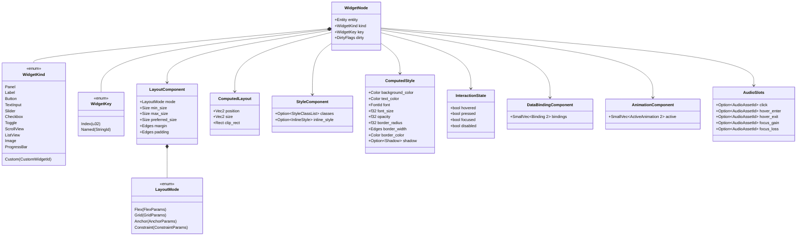
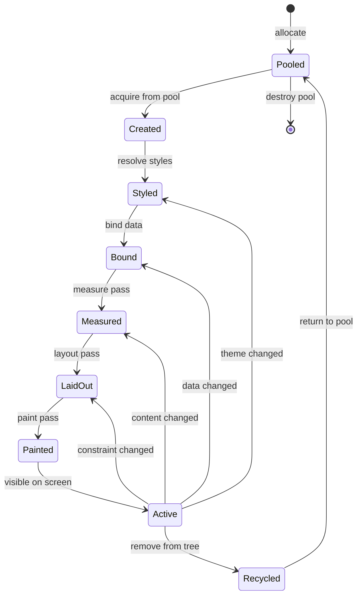
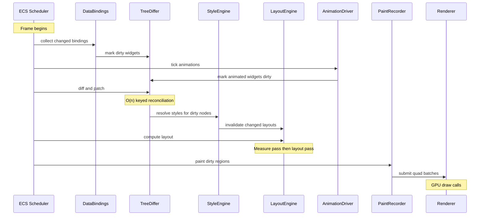
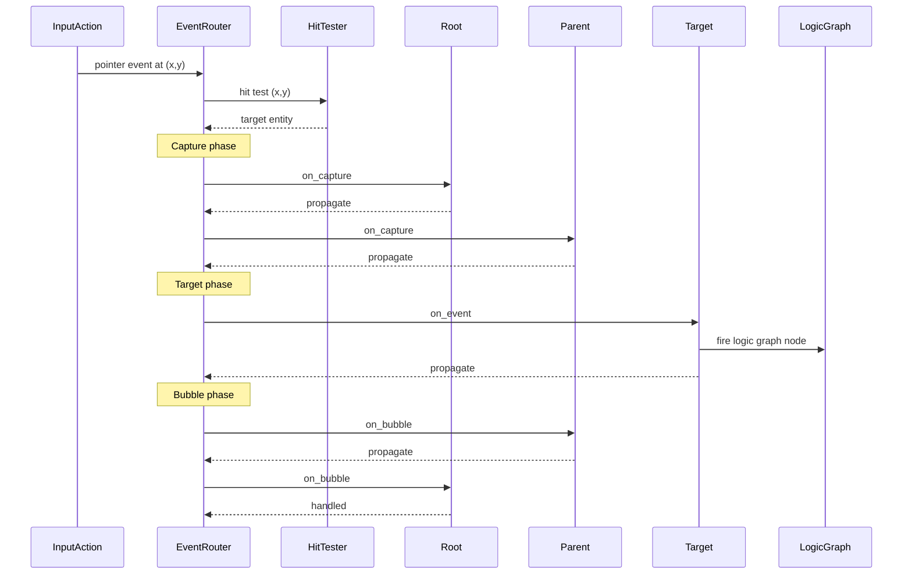
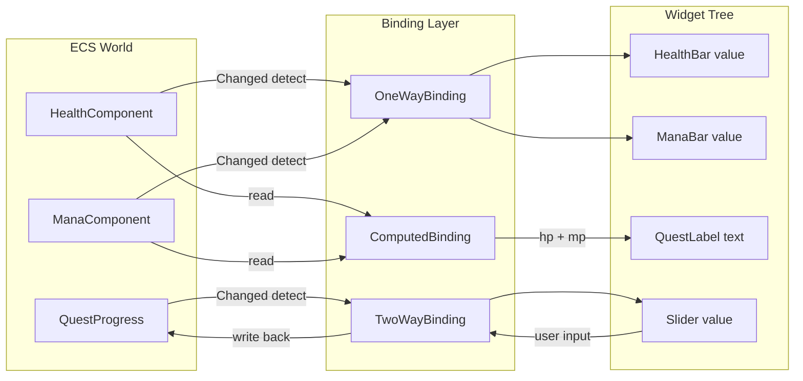
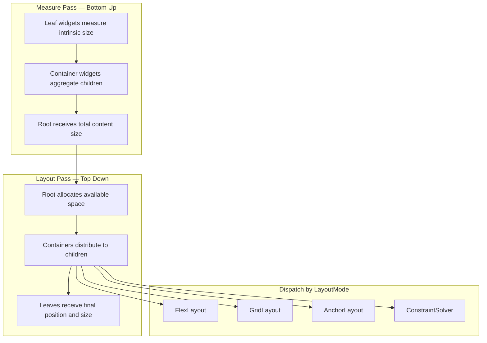
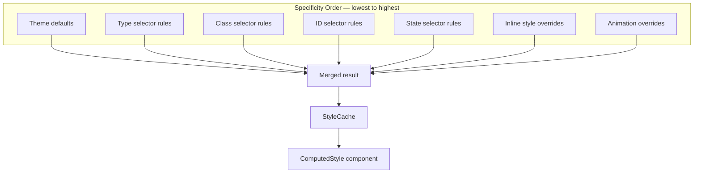

# Widget Framework Design

## Requirements Trace

> **Canonical sources:** Features, requirements, and user
> stories are defined in [features/ui-2d/](../../features/ui-2d/),
> [requirements/ui-2d/](../../requirements/ui-2d/), and
> [user-stories/ui-2d/](../../user-stories/ui-2d/). The table
> below traces design elements to those definitions.

| Feature | Requirement | User Stories | Description |
|---------|-------------|--------------|-------------|
| F-10.1.1 | R-10.1.1 | US-10.1.1, US-10.1.2, US-10.1.3 | Declarative retained widget tree with minimal diff updates |
| F-10.1.2 | R-10.1.2 | US-10.1.1 | Binary UI asset format with templates and slots |
| F-10.1.3 | R-10.1.3 | US-10.1.4, US-10.1.5 | Widget pooling and recycling for virtualized lists |
| F-10.1.4 | R-10.1.4 | US-10.1.6, US-10.1.8 | Flexbox and CSS grid layout algorithms |
| F-10.1.5 | R-10.1.5 | US-10.1.7, US-10.1.8 | Anchor and constraint-based layout |
| F-10.1.6 | R-10.1.6 | US-10.1.9, US-10.1.10 | Cascading styles with runtime theme swapping |
| F-10.1.7 | R-10.1.7 | US-10.1.11, US-10.1.12 | Reactive one-way, two-way, and computed data binding |
| F-10.1.8 | R-10.1.8 | US-10.1.13, US-10.1.14 | Focus traversal, tab order, directional nav, focus trapping |
| F-10.1.9 | R-10.1.9 | US-10.1.15, US-10.1.16 | Localization hooks with RTL mirroring |
| F-10.1.10 | R-10.1.10 | US-10.1.17 | World-space 3D UI panels with ray-cast input |
| F-10.1.11 | R-10.1.11 | US-10.1.18, US-10.1.19 | VR input modes: laser, touch, gaze, hand tracking |
| F-10.1.12 | R-10.1.12 | US-10.1.2, US-10.1.3 | O(n) keyed reconciliation tree diffing |
| F-10.1.13 | R-10.1.13 | US-10.1.20, US-10.1.21 | Widget property animations with easing and interruption |
| F-10.1.14 | R-10.1.14 | US-10.1.22, US-10.1.23 | Audio feedback per widget interaction |

### Cross-Cutting Dependencies

| Dependency | Source | Consumed API |
|------------|--------|-------------|
| Entity lifecycle | F-1.1.11 | Generational `Entity` handles |
| ChildOf relationship | F-1.1.14, F-1.1.16 | Parent-child hierarchy for widget tree |
| Command buffers | F-1.1.32 | Deferred structural changes |
| Change detection | F-1.1.22 | Tick-based `Changed<T>` queries for data binding |
| Parallel iteration | F-1.1.20 | Chunk-level parallel query |
| System scheduling | F-1.1.25, F-1.1.26 | `PreUpdate` / `PostUpdate` phase ordering |
| Reflection | F-1.3.1 | `Reflect` derive for UI asset serialization |
| Batched quad renderer | F-10.4.1 | Quad submission for paint output |
| SDF text renderer | F-10.4.2 | Text glyph rendering |
| Atlas manager | F-10.4.4 | Nine-slice and icon atlas lookup |
| Input actions | F-6.2 | Pointer, keyboard, gamepad events |
| Audio mixer bus | F-5.1.3 | UI audio feedback channel |
| Logic graph | F-15.8.4 | Event handler wiring (no-code) |

## Overview

The widget framework is the foundational layer of the
Harmonius UI system. It manages a retained tree of
widget entities, each represented as an ECS entity with
component-driven state. All UI is authored declaratively
in the visual editor and compiled into binary assets.

The design follows four principles:

1. **100% ECS-based.** Every widget is an entity.
   Every property is a component. Every pipeline
   stage is a system. No parallel data stores.
2. **Declarative + retained.** Artists author
   widget trees in the visual editor. The runtime
   maintains a retained tree and applies minimal
   diffs when bound data changes.
3. **No-code.** All event handlers wire to logic
   graph nodes. All styling, layout, and animation
   are configured through visual editors. Users
   never write code.
4. **Static dispatch.** Layout algorithms, style
   resolution, and event routing use enum dispatch
   over concrete types, not trait objects.

### Performance Targets

| Metric | Target |
|--------|--------|
| Full HUD render | < 2 ms GPU, < 50 draw calls |
| Tree diff (500 widgets, 10% changed) | < 1 ms |
| Layout pass (500 widgets) | < 0.5 ms |
| Style resolution (500 widgets) | < 0.3 ms |
| Steady-state scroll allocations | Zero |
| Data binding propagation | Same-frame |

## Architecture

### Module Boundaries

```mermaid
graph TD
    subgraph "harmonius_ui::widget"
        WT[WidgetTree]
        WN[WidgetNode]
        WP[WidgetPool]
        DF[TreeDiffer]
        LY[LayoutEngine]
        ST[StyleEngine]
        DB[DataBindings]
        FO[FocusManager]
        AN[AnimationDriver]
        AU[AudioFeedback]
        EV[EventRouter]
        AS[UIAssetLoader]
    end

    subgraph "harmonius_ui::layout"
        FX[FlexLayout]
        GR[GridLayout]
        AC[AnchorLayout]
        CN[ConstraintSolver]
    end

    subgraph "harmonius_ui::style"
        TH[ThemeRegistry]
        SS[StyleSheet]
        SE[SelectorMatcher]
        SC[StyleCache]
    end

    subgraph "harmonius_core::ecs"
        W[World]
        Q[Query]
        CD[ChangeDetection]
        CMD[CommandBuffer]
        SYS[SystemScheduler]
    end

    subgraph "harmonius_ui::rendering"
        BQ[BatchedQuadRenderer]
        TX[TextRenderer]
        AT[AtlasManager]
    end

    subgraph "harmonius_core::input"
        IA[InputActions]
    end

    WT --> WN
    WT --> WP
    WT --> DF
    WT --> LY
    WT --> ST
    WT --> DB
    WT --> FO
    WT --> AN
    WT --> EV

    LY --> FX
    LY --> GR
    LY --> AC
    LY --> CN

    ST --> TH
    ST --> SS
    ST --> SE
    ST --> SC

    DB --> W
    DB --> Q
    DB --> CD
    EV --> IA
    WT --> CMD
    WT --> SYS

    WT -.-> BQ
    WT -.-> TX
    WT -.-> AT
    AU -.->|"F-5.1.3"| AUD[AudioMixerBus]
```



```
harmonius_ui/
├── widget/
│   ├── tree.rs          # WidgetTree root, tree
│   │                    # traversal, subtree ops
│   ├── node.rs          # WidgetNode, WidgetKind
│   │                    # enum, per-node ECS
│   │                    # components
│   ├── pool.rs          # WidgetPool, free list,
│   │                    # recycle/acquire
│   ├── differ.rs        # TreeDiffer, keyed
│   │                    # reconciliation, patch
│   │                    # ops
│   ├── event.rs         # EventRouter, hit test,
│   │                    # bubble/capture
│   ├── focus.rs         # FocusManager, tab order,
│   │                    # directional nav, focus
│   │                    # groups
│   ├── binding.rs       # DataBinding, one-way,
│   │                    # two-way, computed
│   ├── animation.rs     # AnimationDriver,
│   │                    # keyframes, easing,
│   │                    # transitions
│   ├── audio.rs         # AudioFeedback, sound
│   │                    # slots, theme overrides
│   └── asset.rs         # UIAssetLoader, binary
│                        # format, templates
├── layout/
│   ├── engine.rs        # LayoutEngine, measure
│   │                    # + layout passes
│   ├── flex.rs          # FlexLayout algorithm
│   ├── grid.rs          # GridLayout algorithm
│   ├── anchor.rs        # AnchorLayout, edge
│   │                    # offsets
│   └── constraint.rs    # ConstraintSolver,
│                        # relational expressions
├── style/
│   ├── engine.rs        # StyleEngine, cascade
│   │                    # resolution
│   ├── theme.rs         # ThemeRegistry, runtime
│   │                    # swap
│   ├── sheet.rs         # StyleSheet, rule
│   │                    # storage
│   ├── selector.rs      # SelectorMatcher, type/
│   │                    # ID/class/state
│   └── cache.rs         # StyleCache, resolved
│                        # property cache
└── systems.rs           # ECS system registration
                         # and scheduling
```

### Widget Tree as ECS Entities

Every widget in the tree is an ECS entity. The
hierarchy uses the engine's built-in `ChildOf`
relationship (F-1.1.16). Widget-specific data is
stored as components on each entity.



### Widget Lifecycle



### Frame Update Pipeline

Each frame, the widget framework runs as a
sequence of ECS systems in the `PostUpdate`
schedule phase. The pipeline is:

1. **Binding collection** -- gather ECS component
   changes and mark dependent widgets dirty.
2. **Animation tick** -- advance active animations
   and mark animated properties dirty.
3. **Tree diff** -- reconcile declared vs retained
   tree, apply minimal patches.
4. **Style resolution** -- cascade styles for dirty
   nodes, check for layout-affecting changes.
5. **Layout** -- measure (bottom-up) then place
   (top-down) for invalidated subtrees.
6. **Paint** -- emit draw commands for dirty
   regions to the batched quad renderer.



### Event Routing

Events flow through three phases: capture
(root-to-target), target, and bubble
(target-to-root). Hit testing determines the
target widget from pointer coordinates.



### Data Binding Flow

Bindings connect ECS components to widget
properties. The binding system uses change
detection to avoid polling.



### Layout Algorithm Pipeline



### Style Cascade Resolution



## API Design

### Widget Identity and Kinds

```rust
/// Generational handle to a widget entity.
/// Wraps the ECS Entity directly.
pub type WidgetId = Entity;

/// Stable key for reconciliation. Keyed widgets
/// are matched by key during tree diffing;
/// unkeyed widgets are matched by position.
#[derive(Clone, Debug, PartialEq, Eq, Hash)]
pub enum WidgetKey {
    /// Positional key (default). Matched by
    /// child index.
    Index(u32),
    /// Named key. Matched by string identity.
    /// Used for list items to enable O(n)
    /// reconciliation.
    Named(StringId),
}

/// Discriminant for built-in widget types.
/// Custom widgets register through the plugin
/// system and receive a CustomWidgetId.
#[derive(
    Clone, Copy, Debug, PartialEq, Eq, Hash,
    Reflect,
)]
pub enum WidgetKind {
    /// Container panel with background.
    Panel,
    /// Static text label.
    Label,
    /// Clickable button with label/icon.
    Button,
    /// Single-line or multi-line text input.
    TextInput,
    /// Horizontal or vertical slider.
    Slider,
    /// Boolean checkbox.
    Checkbox,
    /// Boolean toggle switch.
    Toggle,
    /// Scrollable container.
    ScrollView,
    /// Virtualized list with pooling.
    ListView,
    /// Image display.
    Image,
    /// Determinate or indeterminate progress.
    ProgressBar,
    /// Dropdown/combo box.
    ComboBox,
    /// User-registered custom widget.
    Custom(CustomWidgetId),
}

/// Opaque ID for user-registered custom widgets.
#[derive(
    Clone, Copy, Debug, PartialEq, Eq, Hash,
)]
pub struct CustomWidgetId(pub u32);
```

### Widget Node Components

```rust
/// Core widget identity component. Present on
/// every widget entity.
#[derive(Component, Reflect)]
pub struct WidgetNode {
    pub kind: WidgetKind,
    pub key: WidgetKey,
    pub dirty: DirtyFlags,
}

bitflags::bitflags! {
    /// Granular dirty flags to skip unchanged
    /// pipeline stages.
    #[derive(
        Clone, Copy, Debug, PartialEq, Eq,
        Reflect,
    )]
    pub struct DirtyFlags: u16 {
        const STYLE     = 0b0000_0001;
        const LAYOUT    = 0b0000_0010;
        const PAINT     = 0b0000_0100;
        const BINDING   = 0b0000_1000;
        const CHILDREN  = 0b0001_0000;
        const ANIMATION = 0b0010_0000;
        const ALL       = 0b0011_1111;
    }
}

/// Interaction state tracked per widget.
/// Updated by the EventRouter system.
#[derive(
    Component, Clone, Copy, Debug, Default,
    Reflect,
)]
pub struct InteractionState {
    pub hovered: bool,
    pub pressed: bool,
    pub focused: bool,
    pub disabled: bool,
}
```

### Layout System

```rust
/// Layout mode selector. Each variant carries
/// the parameters for its algorithm.
#[derive(Clone, Debug, Reflect)]
pub enum LayoutMode {
    Flex(FlexParams),
    Grid(GridParams),
    Anchor(AnchorParams),
    Constraint(ConstraintParams),
}

/// Flexbox layout parameters (CSS Flexbox
/// subset).
#[derive(Clone, Debug, Reflect)]
pub struct FlexParams {
    pub direction: FlexDirection,
    pub wrap: FlexWrap,
    pub justify_content: JustifyContent,
    pub align_items: AlignItems,
    pub align_content: AlignContent,
    pub gap: f32,
}

#[derive(Clone, Copy, Debug, Reflect)]
pub enum FlexDirection {
    Row,
    RowReverse,
    Column,
    ColumnReverse,
}

#[derive(Clone, Copy, Debug, Reflect)]
pub enum FlexWrap {
    NoWrap,
    Wrap,
    WrapReverse,
}

#[derive(Clone, Copy, Debug, Reflect)]
pub enum JustifyContent {
    Start,
    End,
    Center,
    SpaceBetween,
    SpaceAround,
    SpaceEvenly,
}

#[derive(Clone, Copy, Debug, Reflect)]
pub enum AlignItems {
    Start,
    End,
    Center,
    Stretch,
    Baseline,
}

#[derive(Clone, Copy, Debug, Reflect)]
pub enum AlignContent {
    Start,
    End,
    Center,
    Stretch,
    SpaceBetween,
    SpaceAround,
}

/// CSS Grid layout parameters.
#[derive(Clone, Debug, Reflect)]
pub struct GridParams {
    pub columns: Vec<TrackSize>,
    pub rows: Vec<TrackSize>,
    pub column_gap: f32,
    pub row_gap: f32,
    pub auto_flow: GridAutoFlow,
}

/// Track sizing for grid columns/rows.
#[derive(Clone, Copy, Debug, Reflect)]
pub enum TrackSize {
    /// Fixed pixel size.
    Px(f32),
    /// Fractional unit (like CSS `fr`).
    Fr(f32),
    /// Size to content.
    Auto,
    /// Clamp between min and max.
    MinMax { min: f32, max: f32 },
}

#[derive(Clone, Copy, Debug, Reflect)]
pub enum GridAutoFlow {
    Row,
    Column,
    RowDense,
    ColumnDense,
}

/// Anchor-based layout: position relative to
/// parent edges or screen edges.
#[derive(Clone, Debug, Reflect)]
pub struct AnchorParams {
    pub anchors: Anchors,
    pub offsets: Edges,
}

/// Normalized anchor points (0.0 = left/top,
/// 1.0 = right/bottom).
#[derive(Clone, Copy, Debug, Reflect)]
pub struct Anchors {
    pub left: f32,
    pub right: f32,
    pub top: f32,
    pub bottom: f32,
}

/// Constraint-based layout: relational
/// expressions between widget properties.
#[derive(Clone, Debug, Reflect)]
pub struct ConstraintParams {
    pub constraints: Vec<LayoutConstraint>,
}

/// A single layout constraint expressing a
/// relationship between two widget properties.
#[derive(Clone, Debug, Reflect)]
pub struct LayoutConstraint {
    pub target_attr: LayoutAttr,
    pub source_widget: Option<WidgetId>,
    pub source_attr: LayoutAttr,
    pub multiplier: f32,
    pub constant: f32,
    pub priority: ConstraintPriority,
}

#[derive(Clone, Copy, Debug, Reflect)]
pub enum LayoutAttr {
    Left,
    Right,
    Top,
    Bottom,
    Width,
    Height,
    CenterX,
    CenterY,
}

#[derive(Clone, Copy, Debug, Reflect)]
pub enum ConstraintPriority {
    Required,
    High,
    Medium,
    Low,
}

/// Per-widget layout input. Present on every
/// widget entity.
#[derive(Component, Clone, Debug, Reflect)]
pub struct LayoutComponent {
    pub mode: LayoutMode,
    pub min_size: Size,
    pub max_size: Size,
    pub preferred_size: Size,
    pub margin: Edges,
    pub padding: Edges,
    /// Flex item properties (when inside a
    /// flex container).
    pub flex_grow: f32,
    pub flex_shrink: f32,
    pub flex_basis: SizeValue,
    /// Grid item placement (when inside a
    /// grid container).
    pub grid_column: Option<GridPlacement>,
    pub grid_row: Option<GridPlacement>,
}

#[derive(Clone, Copy, Debug, Reflect)]
pub struct Size {
    pub width: SizeValue,
    pub height: SizeValue,
}

#[derive(Clone, Copy, Debug, Reflect)]
pub enum SizeValue {
    Auto,
    Px(f32),
    Percent(f32),
}

#[derive(Clone, Copy, Debug, Reflect)]
pub struct Edges {
    pub left: f32,
    pub right: f32,
    pub top: f32,
    pub bottom: f32,
}

#[derive(Clone, Copy, Debug, Reflect)]
pub struct GridPlacement {
    pub start: i16,
    pub span: u16,
}

/// Computed layout output. Written by the
/// LayoutEngine, read by the paint system.
#[derive(Component, Clone, Copy, Debug, Reflect)]
pub struct ComputedLayout {
    /// Position relative to parent.
    pub position: Vec2,
    /// Final allocated size.
    pub size: Vec2,
    /// Clip rectangle in screen space.
    pub clip_rect: Rect,
    /// Absolute screen-space position (cached
    /// for hit testing).
    pub global_position: Vec2,
}

/// Layout engine. Dispatches to the correct
/// algorithm based on each container's
/// LayoutMode.
pub struct LayoutEngine;

impl LayoutEngine {
    /// Run the full layout pipeline on dirty
    /// subtrees. Two passes:
    /// 1. Measure (bottom-up): compute intrinsic
    ///    sizes from leaves to root.
    /// 2. Layout (top-down): distribute space
    ///    from root to leaves.
    pub fn compute_layout(
        &self,
        world: &mut World,
        viewport: Vec2,
    );

    /// Invalidate layout for a subtree rooted
    /// at the given widget. Called when style or
    /// content changes affect geometry.
    pub fn invalidate(
        &self,
        world: &mut World,
        root: WidgetId,
    );
}
```

### Styling System

```rust
/// Unique identifier for a style class.
#[derive(
    Clone, Copy, Debug, PartialEq, Eq, Hash,
    Reflect,
)]
pub struct StyleClassId(pub StringId);

/// Per-widget style input component.
#[derive(Component, Clone, Debug, Reflect)]
pub struct StyleComponent {
    /// Optional widget ID for #id selectors.
    pub id: Option<StringId>,
    /// Style classes applied to this widget.
    pub classes: SmallVec<[StyleClassId; 4]>,
    /// Inline style overrides (highest
    /// specificity below animation).
    pub inline_style: Option<StyleProperties>,
}

/// Resolved visual properties. Written by the
/// StyleEngine, read by the paint system.
#[derive(
    Component, Clone, Debug, Default, Reflect,
)]
pub struct ComputedStyle {
    pub background_color: Color,
    pub text_color: Color,
    pub font: FontId,
    pub font_size: f32,
    pub opacity: f32,
    pub border_radius: Corners,
    pub border_width: Edges,
    pub border_color: Color,
    pub shadow: Option<Shadow>,
    pub cursor: CursorStyle,
    pub visibility: Visibility,
    pub overflow: Overflow,
    pub transform_origin: Vec2,
}

#[derive(Clone, Copy, Debug, Default, Reflect)]
pub struct Corners {
    pub top_left: f32,
    pub top_right: f32,
    pub bottom_left: f32,
    pub bottom_right: f32,
}

#[derive(Clone, Copy, Debug, Default, Reflect)]
pub struct Shadow {
    pub offset: Vec2,
    pub blur: f32,
    pub spread: f32,
    pub color: Color,
}

#[derive(Clone, Copy, Debug, Default, Reflect)]
pub enum CursorStyle {
    #[default]
    Default,
    Pointer,
    Text,
    Grab,
    Grabbing,
    NotAllowed,
    Resize(ResizeDirection),
}

#[derive(Clone, Copy, Debug, Reflect)]
pub enum ResizeDirection {
    Horizontal,
    Vertical,
    Both,
}

#[derive(Clone, Copy, Debug, Default, Reflect)]
pub enum Visibility {
    #[default]
    Visible,
    Hidden,
    Collapsed,
}

#[derive(Clone, Copy, Debug, Default, Reflect)]
pub enum Overflow {
    #[default]
    Visible,
    Hidden,
    Scroll,
}

/// All animatable style properties in a single
/// bag. Used for inline overrides, style rules,
/// and theme definitions.
#[derive(Clone, Debug, Default, Reflect)]
pub struct StyleProperties {
    pub background_color: Option<Color>,
    pub text_color: Option<Color>,
    pub font: Option<FontId>,
    pub font_size: Option<f32>,
    pub opacity: Option<f32>,
    pub border_radius: Option<Corners>,
    pub border_width: Option<Edges>,
    pub border_color: Option<Color>,
    pub shadow: Option<Shadow>,
    pub cursor: Option<CursorStyle>,
    pub visibility: Option<Visibility>,
    pub overflow: Option<Overflow>,
}

/// A selector matching widgets by type, ID,
/// class, and interaction state.
#[derive(Clone, Debug, Reflect)]
pub struct Selector {
    pub widget_type: Option<WidgetKind>,
    pub id: Option<StringId>,
    pub classes: SmallVec<[StyleClassId; 2]>,
    pub state: Option<SelectorState>,
}

#[derive(
    Clone, Copy, Debug, Reflect,
)]
pub enum SelectorState {
    Hovered,
    Pressed,
    Focused,
    Disabled,
}

/// A style rule: a selector paired with
/// properties to apply when matched.
#[derive(Clone, Debug, Reflect)]
pub struct StyleRule {
    pub selector: Selector,
    pub properties: StyleProperties,
    pub specificity: u32,
}

/// A style sheet: an ordered collection of
/// rules.
#[derive(Clone, Debug, Reflect)]
pub struct StyleSheet {
    pub rules: Vec<StyleRule>,
}

/// A theme: a named collection of style sheets
/// that can be swapped at runtime.
#[derive(Clone, Debug, Reflect)]
pub struct Theme {
    pub name: StringId,
    pub sheets: Vec<StyleSheet>,
}

/// Registry of all loaded themes. Supports
/// runtime theme swapping (R-10.1.6).
pub struct ThemeRegistry {
    themes: Vec<Theme>,
    active_theme: usize,
}

impl ThemeRegistry {
    pub fn new() -> Self;

    /// Register a theme loaded from asset.
    pub fn register(&mut self, theme: Theme);

    /// Get the currently active theme.
    pub fn active(&self) -> &Theme;

    /// Switch to a different theme by name.
    /// Returns true if the theme was found and
    /// activated. All widgets are marked dirty
    /// for style re-resolution.
    pub fn set_active(
        &mut self,
        name: StringId,
    ) -> bool;
}

/// Style resolution engine. Cascades rules by
/// specificity and produces ComputedStyle.
pub struct StyleEngine;

impl StyleEngine {
    /// Resolve styles for all dirty widgets.
    /// Cascade order (lowest to highest):
    /// 1. Theme defaults
    /// 2. Type selector matches
    /// 3. Class selector matches
    /// 4. ID selector matches
    /// 5. State selector matches
    /// 6. Inline style overrides
    /// 7. Active animation overrides
    pub fn resolve(
        &self,
        world: &mut World,
        theme: &Theme,
    );
}

/// Cache of resolved styles keyed by the
/// combination of (WidgetKind, classes, state).
/// Avoids redundant cascade computation for
/// widgets sharing the same selector matches.
pub struct StyleCache {
    entries: HashMap<StyleCacheKey, ComputedStyle>,
}

impl StyleCache {
    pub fn new() -> Self;
    pub fn get(
        &self,
        key: &StyleCacheKey,
    ) -> Option<&ComputedStyle>;
    pub fn insert(
        &mut self,
        key: StyleCacheKey,
        style: ComputedStyle,
    );
    /// Invalidate all entries. Called on theme
    /// swap.
    pub fn clear(&mut self);
}
```

### Data Binding

```rust
/// Direction of data flow.
#[derive(Clone, Copy, Debug, Reflect)]
pub enum BindingDirection {
    /// Model to view only.
    OneWay,
    /// Model to view and view to model.
    TwoWay,
}

/// A single data binding connecting an ECS
/// component field to a widget property.
#[derive(Clone, Debug, Reflect)]
pub struct Binding {
    pub direction: BindingDirection,
    /// The ECS entity whose component is the
    /// data source.
    pub source_entity: Entity,
    /// Reflection path into the source
    /// component (e.g., "health.current").
    pub source_path: ReflectPath,
    /// Which widget property to bind to.
    pub target_property: WidgetProperty,
    /// Optional value transform expression
    /// (e.g., format as percentage).
    pub transform: Option<BindingTransform>,
}

/// Identifies which widget property a binding
/// targets.
#[derive(Clone, Debug, Reflect)]
pub enum WidgetProperty {
    Text,
    Value,
    Progress,
    Enabled,
    Visible,
    Color,
    ImageAsset,
    Custom(StringId),
}

/// A computed binding that derives a value from
/// multiple sources.
#[derive(Clone, Debug, Reflect)]
pub struct ComputedBinding {
    /// Source bindings whose values are inputs.
    pub sources: SmallVec<[BindingSource; 4]>,
    /// Expression graph that computes the
    /// output from the source values.
    pub expression: BindingExpression,
    /// Target widget property.
    pub target_property: WidgetProperty,
}

#[derive(Clone, Debug, Reflect)]
pub struct BindingSource {
    pub entity: Entity,
    pub path: ReflectPath,
}

/// Expression node for computed bindings.
/// Evaluated as a stack machine.
#[derive(Clone, Debug, Reflect)]
pub enum BindingExpression {
    /// Push a source value onto the stack.
    Source(u8),
    /// Push a literal constant.
    Constant(f64),
    /// Arithmetic and comparison ops.
    Add,
    Sub,
    Mul,
    Div,
    Mod,
    Min,
    Max,
    Clamp,
    /// Format as string.
    Format(StringId),
    /// Sequence of sub-expressions.
    Sequence(Vec<BindingExpression>),
}

/// Value transform applied to a bound value
/// before it reaches the widget.
#[derive(Clone, Debug, Reflect)]
pub enum BindingTransform {
    /// Multiply by constant.
    Scale(f64),
    /// Clamp to range.
    Clamp { min: f64, max: f64 },
    /// Format as string with pattern.
    Format(StringId),
    /// Map through a lookup table.
    Lookup(Vec<(f64, f64)>),
    /// Chain multiple transforms.
    Chain(Vec<BindingTransform>),
}

/// Per-widget binding component.
#[derive(Component, Clone, Debug, Reflect)]
pub struct DataBindingComponent {
    pub bindings: SmallVec<[Binding; 2]>,
    pub computed: SmallVec<[ComputedBinding; 1]>,
}

/// Binding system. Runs each frame to detect
/// changed source values and propagate them
/// to widget properties.
pub struct BindingSystem;

impl BindingSystem {
    /// Collect all bindings whose source
    /// components have changed this tick
    /// (via ECS change detection). Mark the
    /// owning widgets dirty. For two-way
    /// bindings, also write widget property
    /// changes back to the source component.
    pub fn collect_changes(
        &self,
        world: &mut World,
    );
}
```

### Widget Tree and Diffing

```rust
/// Root container for all UI widget trees.
/// Multiple roots are supported (one per
/// screen-space canvas, plus one per
/// world-space panel).
pub struct WidgetTree;

impl WidgetTree {
    /// Spawn a new root canvas entity.
    pub fn create_root(
        world: &mut World,
        viewport: Vec2,
    ) -> WidgetId;

    /// Load a UI asset and instantiate its
    /// widget tree under the given parent.
    pub fn instantiate(
        world: &mut World,
        parent: WidgetId,
        asset: &UIAsset,
    );

    /// Remove a widget and all its descendants.
    /// Widgets are returned to the pool.
    pub fn remove_subtree(
        world: &mut World,
        root: WidgetId,
        pool: &mut WidgetPool,
    );

    /// Iterate depth-first over a subtree.
    /// Allocation-free iterator using the ECS
    /// Children component.
    pub fn iter_dfs(
        world: &World,
        root: WidgetId,
    ) -> DfsIterator;

    /// Iterate breadth-first over a subtree.
    pub fn iter_bfs(
        world: &World,
        root: WidgetId,
    ) -> BfsIterator;
}

/// The tree differ. Compares a declared widget
/// description (from asset + bindings) against
/// the current retained tree and produces the
/// minimal set of patch operations.
pub struct TreeDiffer;

/// Patch operations emitted by the differ.
#[derive(Clone, Debug)]
pub enum PatchOp {
    /// Insert a new widget as child of parent
    /// at the given index.
    Insert {
        parent: WidgetId,
        index: u32,
        kind: WidgetKind,
        key: WidgetKey,
    },
    /// Remove a widget and recycle it to pool.
    Remove {
        widget: WidgetId,
    },
    /// Update properties on an existing widget
    /// in place.
    UpdateProperties {
        widget: WidgetId,
        properties: StyleProperties,
    },
    /// Update the text content of a label or
    /// text input.
    UpdateText {
        widget: WidgetId,
        text: StringId,
    },
    /// Move a child to a different index
    /// without destroy/recreate.
    Reorder {
        widget: WidgetId,
        new_index: u32,
    },
    /// Replace the data binding on a widget.
    RebindData {
        widget: WidgetId,
        binding: DataBindingComponent,
    },
}

impl TreeDiffer {
    /// Compare the declared tree against the
    /// retained tree and emit minimal patches.
    ///
    /// Algorithm:
    /// - Keyed children: O(n) two-pointer scan.
    ///   Build a map of old keys, walk new keys,
    ///   match by key, detect inserts/removes/
    ///   moves.
    /// - Unkeyed children: matched by index.
    /// - Property changes: compared field by
    ///   field, only changed fields patched.
    pub fn diff(
        &self,
        world: &World,
        parent: WidgetId,
        declared: &[DeclaredWidget],
    ) -> Vec<PatchOp>;

    /// Apply a batch of patches to the retained
    /// tree. Uses command buffers for structural
    /// changes (insert/remove) and direct
    /// component mutation for property updates.
    pub fn apply_patches(
        &self,
        world: &mut World,
        pool: &mut WidgetPool,
        patches: &[PatchOp],
    );
}

/// A widget description from the declared tree
/// (loaded from UI asset).
#[derive(Clone, Debug, Reflect)]
pub struct DeclaredWidget {
    pub kind: WidgetKind,
    pub key: WidgetKey,
    pub properties: StyleProperties,
    pub layout: LayoutComponent,
    pub bindings: Option<DataBindingComponent>,
    pub children: Vec<DeclaredWidget>,
    pub text: Option<StringId>,
    pub event_handlers: SmallVec<
        [LogicGraphNodeRef; 2]
    >,
}
```

### Widget Pool

```rust
/// Pool of recycled widget entities to avoid
/// allocation churn (R-10.1.3). Widgets removed
/// from the tree are returned here instead of
/// despawned. When a new widget is needed, the
/// pool provides a recycled entity that is
/// reset and rebound.
pub struct WidgetPool {
    free_lists: HashMap<WidgetKind, Vec<WidgetId>>,
    active_count: u32,
    budget: u32,
}

impl WidgetPool {
    /// Create a pool with a platform-specific
    /// active widget budget.
    /// - Desktop: 500
    /// - Mobile: 200
    pub fn new(budget: u32) -> Self;

    /// Acquire a widget entity from the pool.
    /// If the pool is empty for this kind, a
    /// new entity is spawned. Returns None if
    /// the active budget is exhausted.
    pub fn acquire(
        &mut self,
        world: &mut World,
        kind: WidgetKind,
    ) -> Option<WidgetId>;

    /// Return a widget entity to the pool.
    /// Its components are reset to defaults.
    pub fn release(
        &mut self,
        world: &mut World,
        widget: WidgetId,
        kind: WidgetKind,
    );

    pub fn active_count(&self) -> u32;
    pub fn budget(&self) -> u32;
}
```

### Event Router

```rust
/// UI event types routed through the widget
/// tree.
#[derive(Clone, Debug)]
pub enum UIEvent {
    /// Pointer moved to position.
    PointerMove { position: Vec2 },
    /// Pointer button pressed.
    PointerDown {
        position: Vec2,
        button: PointerButton,
    },
    /// Pointer button released.
    PointerUp {
        position: Vec2,
        button: PointerButton,
    },
    /// Scroll wheel or trackpad scroll.
    Scroll { delta: Vec2 },
    /// Keyboard key pressed.
    KeyDown { key: KeyCode },
    /// Keyboard key released.
    KeyUp { key: KeyCode },
    /// Text input from IME or keyboard.
    TextInput { text: String },
    /// Gamepad directional navigation.
    Navigate { direction: NavDirection },
    /// Focus request (tab, shift-tab).
    FocusNext,
    FocusPrev,
}

#[derive(Clone, Copy, Debug)]
pub enum PointerButton {
    Primary,
    Secondary,
    Middle,
}

#[derive(Clone, Copy, Debug)]
pub enum NavDirection {
    Up,
    Down,
    Left,
    Right,
}

/// Event propagation control returned by
/// handlers.
#[derive(Clone, Copy, Debug, PartialEq, Eq)]
pub enum Propagation {
    /// Continue propagation to the next widget.
    Continue,
    /// Stop propagation; event is consumed.
    Stop,
}

/// Event routing phases.
#[derive(Clone, Copy, Debug)]
pub enum EventPhase {
    Capture,
    Target,
    Bubble,
}

/// Event router. Handles hit testing, capture,
/// target, and bubble phases.
pub struct EventRouter;

impl EventRouter {
    /// Route an input event through the widget
    /// tree.
    ///
    /// 1. Hit test to find the target widget.
    /// 2. Capture phase: walk root to target,
    ///    calling on_capture handlers.
    /// 3. Target phase: call on_event handler.
    /// 4. Bubble phase: walk target to root,
    ///    calling on_bubble handlers.
    ///
    /// Any handler may return Stop to halt
    /// propagation.
    pub fn route(
        &self,
        world: &mut World,
        event: &UIEvent,
    );

    /// Hit test: find the deepest visible,
    /// interactive widget at the given screen
    /// position. Traverses the tree front-to-
    /// back (reverse child order, depth-first).
    pub fn hit_test(
        &self,
        world: &World,
        position: Vec2,
    ) -> Option<WidgetId>;
}
```

### Focus Management

```rust
/// Focus group identifier. Widgets in the same
/// group are navigable among each other. Modal
/// dialogs create their own focus group to trap
/// focus.
#[derive(
    Clone, Copy, Debug, PartialEq, Eq, Hash,
    Reflect,
)]
pub struct FocusGroupId(pub u32);

/// Per-widget focus configuration component.
#[derive(Component, Clone, Debug, Reflect)]
pub struct Focusable {
    /// Tab order index within the focus group.
    /// Lower values receive focus first.
    pub tab_index: i32,
    /// Which focus group this widget belongs to.
    pub group: FocusGroupId,
    /// If true, this widget receives focus on
    /// directional navigation but not tab.
    pub directional_only: bool,
}

/// Focus group configuration component.
/// Attached to the root widget of a focus group.
#[derive(Component, Clone, Debug, Reflect)]
pub struct FocusGroup {
    pub id: FocusGroupId,
    /// If true, focus wraps around at group
    /// boundaries.
    pub wrap: bool,
    /// If true, focus cannot leave this group
    /// (modal trap).
    pub trap: bool,
}

/// Singleton resource tracking the current
/// focus state.
#[derive(Clone, Debug, Reflect)]
pub struct FocusState {
    /// Currently focused widget, if any.
    pub focused: Option<WidgetId>,
    /// Active focus group.
    pub active_group: FocusGroupId,
    /// Stack of previous focus targets for
    /// modal push/pop restoration.
    pub focus_stack: Vec<(
        WidgetId,
        FocusGroupId,
    )>,
}

/// Focus manager system. Handles tab order,
/// directional navigation, and focus group
/// transitions.
pub struct FocusManager;

impl FocusManager {
    /// Move focus to the next focusable widget
    /// in tab order within the active group.
    pub fn focus_next(
        &self,
        world: &mut World,
        state: &mut FocusState,
    );

    /// Move focus to the previous focusable
    /// widget in tab order.
    pub fn focus_prev(
        &self,
        world: &mut World,
        state: &mut FocusState,
    );

    /// Move focus in a spatial direction (D-pad
    /// or arrow keys). Finds the nearest
    /// focusable widget in the given direction
    /// from the current focus.
    pub fn focus_directional(
        &self,
        world: &World,
        state: &mut FocusState,
        direction: NavDirection,
    );

    /// Push a new focus group (e.g., opening a
    /// modal dialog). Saves the current focus
    /// on the stack and moves focus into the
    /// new group.
    pub fn push_group(
        &self,
        world: &World,
        state: &mut FocusState,
        group: FocusGroupId,
    );

    /// Pop the current focus group (e.g.,
    /// closing a modal). Restores the previous
    /// focus from the stack.
    pub fn pop_group(
        &self,
        state: &mut FocusState,
    );

    /// Set focus to a specific widget.
    pub fn set_focus(
        &self,
        world: &mut World,
        state: &mut FocusState,
        widget: WidgetId,
    );

    /// Clear focus. No widget is focused.
    pub fn clear_focus(
        &self,
        world: &mut World,
        state: &mut FocusState,
    );
}
```

### Widget Animation

```rust
/// Easing function for animation curves.
#[derive(Clone, Debug, Reflect)]
pub enum Easing {
    Linear,
    EaseIn,
    EaseOut,
    EaseInOut,
    CubicBezier {
        x1: f32,
        y1: f32,
        x2: f32,
        y2: f32,
    },
    Spring {
        stiffness: f32,
        damping: f32,
        mass: f32,
    },
    Bounce,
}

/// Which widget property an animation targets.
#[derive(Clone, Debug, Reflect)]
pub enum AnimatableProperty {
    PositionX,
    PositionY,
    Width,
    Height,
    Opacity,
    Rotation,
    ScaleX,
    ScaleY,
    BackgroundColor,
    TextColor,
    BorderColor,
}

/// A single keyframe in an animation.
#[derive(Clone, Debug, Reflect)]
pub struct Keyframe {
    /// Time offset in seconds from animation
    /// start.
    pub time: f32,
    /// Target value at this keyframe.
    pub value: AnimationValue,
    /// Easing function to interpolate from the
    /// previous keyframe to this one.
    pub easing: Easing,
}

/// Typed animation value.
#[derive(Clone, Debug, Reflect)]
pub enum AnimationValue {
    Float(f32),
    Color(Color),
}

/// A named animation defined as an asset in
/// the visual editor.
#[derive(Clone, Debug, Reflect)]
pub struct WidgetAnimation {
    pub name: StringId,
    pub property: AnimatableProperty,
    pub keyframes: Vec<Keyframe>,
    pub duration: f32,
    pub loop_mode: LoopMode,
    pub fill_mode: FillMode,
}

#[derive(Clone, Copy, Debug, Reflect)]
pub enum LoopMode {
    /// Play once and stop.
    Once,
    /// Loop indefinitely.
    Loop,
    /// Play forward then reverse, repeat.
    PingPong,
    /// Loop a fixed number of times.
    Count(u32),
}

#[derive(Clone, Copy, Debug, Reflect)]
pub enum FillMode {
    /// Reset to initial value after animation.
    None,
    /// Hold the final keyframe value.
    Forwards,
    /// Apply the first keyframe before start.
    Backwards,
    /// Both forwards and backwards.
    Both,
}

/// A state transition animation triggered by
/// interaction state changes.
#[derive(Clone, Debug, Reflect)]
pub struct TransitionAnimation {
    pub property: AnimatableProperty,
    pub duration: f32,
    pub easing: Easing,
    pub delay: f32,
}

/// Per-widget running animation state.
#[derive(Clone, Debug)]
pub struct ActiveAnimation {
    pub animation: WidgetAnimation,
    pub elapsed: f32,
    pub playback_rate: f32,
    /// For interruptible animations: the value
    /// at the moment of interruption, used as
    /// the new start value for blending.
    pub interrupt_start: Option<AnimationValue>,
}

/// Per-widget animation component.
#[derive(Component, Clone, Debug, Reflect)]
pub struct AnimationComponent {
    pub active: SmallVec<[ActiveAnimation; 2]>,
    pub transitions: SmallVec<
        [TransitionAnimation; 4]
    >,
}

/// Staggered animation config for list items.
#[derive(Clone, Debug, Reflect)]
pub struct StaggerConfig {
    pub animation: WidgetAnimation,
    pub delay_per_item: f32,
    pub max_concurrent: u32,
}

/// Animation driver system. Ticks all active
/// animations each frame, evaluates curves,
/// and writes animated values to widget
/// properties.
pub struct AnimationDriver;

impl AnimationDriver {
    /// Advance all active animations by dt.
    /// Evaluate keyframe curves with easing.
    /// For interruptible animations, blend from
    /// the interrupt start value. Mark animated
    /// widgets dirty.
    pub fn tick(
        &self,
        world: &mut World,
        dt: f32,
    );

    /// Trigger a named animation on a widget.
    /// If an animation is already running on
    /// the same property, it is interrupted
    /// and the new animation blends from the
    /// current value.
    pub fn play(
        &self,
        world: &mut World,
        widget: WidgetId,
        animation: &WidgetAnimation,
    );

    /// Stop all animations on a widget.
    pub fn stop_all(
        &self,
        world: &mut World,
        widget: WidgetId,
    );

    /// Trigger a staggered animation across
    /// a list of widgets.
    pub fn play_staggered(
        &self,
        world: &mut World,
        widgets: &[WidgetId],
        config: &StaggerConfig,
    );
}
```

### Audio Feedback

```rust
/// Sound slots for a widget. Each slot
/// references an audio asset played when the
/// corresponding interaction occurs.
#[derive(Component, Clone, Debug, Reflect)]
pub struct AudioSlots {
    pub click: Option<AudioAssetId>,
    pub hover_enter: Option<AudioAssetId>,
    pub hover_exit: Option<AudioAssetId>,
    pub focus_gain: Option<AudioAssetId>,
    pub focus_loss: Option<AudioAssetId>,
    pub scroll: Option<AudioAssetId>,
    pub drag_start: Option<AudioAssetId>,
    pub drag_end: Option<AudioAssetId>,
    pub toggle_on: Option<AudioAssetId>,
    pub toggle_off: Option<AudioAssetId>,
    pub slider_change: Option<AudioAssetId>,
    pub notification: Option<AudioAssetId>,
}

/// Global UI audio configuration resource.
#[derive(Clone, Debug, Reflect)]
pub struct UIAudioConfig {
    /// Master enable for all UI sounds.
    pub enabled: bool,
    /// Per-slot enable overrides.
    pub slot_enabled: HashMap<
        AudioSlotKind,
        bool,
    >,
    /// If true, replace disabled audio with
    /// haptic feedback where supported.
    pub haptic_fallback: bool,
}

#[derive(
    Clone, Copy, Debug, PartialEq, Eq, Hash,
    Reflect,
)]
pub enum AudioSlotKind {
    Click,
    HoverEnter,
    HoverExit,
    FocusGain,
    FocusLoss,
    Scroll,
    DragStart,
    DragEnd,
    ToggleOn,
    ToggleOff,
    SliderChange,
    Notification,
}

/// Audio feedback system. Listens for
/// interaction state changes and plays the
/// configured sound through the UI mixer bus.
pub struct AudioFeedbackSystem;

impl AudioFeedbackSystem {
    /// Called by the EventRouter after
    /// interaction state changes. Looks up the
    /// appropriate sound slot, checks the audio
    /// config, and dispatches to the UI mixer
    /// bus (F-5.1.3).
    pub fn on_interaction(
        &self,
        world: &World,
        widget: WidgetId,
        slot: AudioSlotKind,
        config: &UIAudioConfig,
    );
}
```

### UI Asset Format

```rust
/// A loaded UI asset containing a declared
/// widget tree with all bindings, styles,
/// layout, and event handler references.
#[derive(Clone, Debug, Reflect)]
pub struct UIAsset {
    /// Root declared widget and its subtree.
    pub root: DeclaredWidget,
    /// Style sheets embedded in this asset.
    pub local_styles: Vec<StyleSheet>,
    /// Named animation assets referenced by
    /// this UI.
    pub animations: Vec<WidgetAnimation>,
}

/// Template definition. A reusable widget
/// subtree with named slots where consumers
/// inject children.
#[derive(Clone, Debug, Reflect)]
pub struct UITemplate {
    pub name: StringId,
    pub root: DeclaredWidget,
    /// Named slot definitions. Each slot has
    /// a name and a default child list.
    pub slots: Vec<TemplateSlot>,
}

#[derive(Clone, Debug, Reflect)]
pub struct TemplateSlot {
    pub name: StringId,
    pub default_children: Vec<DeclaredWidget>,
}

/// Template instantiation in a declared tree.
/// References a template by name and provides
/// children for each slot.
#[derive(Clone, Debug, Reflect)]
pub struct TemplateInstance {
    pub template_name: StringId,
    pub slot_content: HashMap<
        StringId,
        Vec<DeclaredWidget>,
    >,
    pub bindings: Option<DataBindingComponent>,
}

/// Reference to a logic graph node used as an
/// event handler (no-code, F-15.8.4).
#[derive(Clone, Debug, Reflect)]
pub struct LogicGraphNodeRef {
    pub graph_asset: AssetId,
    pub node_id: u32,
    pub event_type: UIEventType,
}

#[derive(
    Clone, Copy, Debug, PartialEq, Eq, Reflect,
)]
pub enum UIEventType {
    Click,
    DoubleClick,
    PointerDown,
    PointerUp,
    HoverEnter,
    HoverExit,
    FocusGain,
    FocusLoss,
    ValueChanged,
    Submit,
    Cancel,
    DragStart,
    DragEnd,
    Drop,
}

/// Asset loader for UI binary assets.
pub struct UIAssetLoader;

impl UIAssetLoader {
    /// Load a UI asset from binary data.
    /// Resolves template references and
    /// validates bindings against the
    /// reflection registry.
    pub async fn load(
        &self,
        data: &[u8],
    ) -> Result<UIAsset, UIAssetError>;

    /// Save a UI asset to binary format.
    /// Used by the visual editor for
    /// round-trip editing.
    pub fn save(
        &self,
        asset: &UIAsset,
    ) -> Result<Vec<u8>, UIAssetError>;
}

pub enum UIAssetError {
    InvalidFormat,
    VersionMismatch {
        expected: u32,
        found: u32,
    },
    MissingTemplate {
        name: StringId,
    },
    InvalidBinding {
        path: String,
        reason: String,
    },
    IoError(IoError),
}
```

### Localization

```rust
/// Per-widget localization component. Maps
/// localizable properties to string table keys.
#[derive(Component, Clone, Debug, Reflect)]
pub struct LocalizationComponent {
    pub text_key: Option<LocaleKey>,
    pub tooltip_key: Option<LocaleKey>,
    pub image_key: Option<LocaleKey>,
}

#[derive(
    Clone, Debug, PartialEq, Eq, Hash, Reflect,
)]
pub struct LocaleKey(pub StringId);

/// Layout direction for the current locale.
#[derive(
    Clone, Copy, Debug, PartialEq, Eq, Reflect,
)]
pub enum LayoutDirection {
    LeftToRight,
    RightToLeft,
}

/// Locale configuration resource.
#[derive(Clone, Debug, Reflect)]
pub struct LocaleConfig {
    pub current_locale: StringId,
    pub direction: LayoutDirection,
}

impl LocaleConfig {
    /// Switch locale at runtime. Triggers
    /// re-layout of all widgets with
    /// localization components. Mirrors layout
    /// direction for RTL locales.
    pub fn set_locale(
        &mut self,
        locale: StringId,
        direction: LayoutDirection,
    );
}
```

### World-Space UI Panels

```rust
/// Component marking a widget tree root as a
/// world-space panel rendered on a textured
/// quad in the 3D scene.
#[derive(Component, Clone, Debug, Reflect)]
pub struct WorldSpacePanel {
    /// Physical size of the panel in world
    /// units (meters).
    pub physical_size: Vec2,
    /// Render target resolution in pixels.
    pub resolution: UVec2,
    /// If true, panel faces the camera
    /// (billboard mode).
    pub billboard: bool,
    /// Curvature for VR readability (0.0 =
    /// flat, 1.0 = full cylinder curve).
    pub curvature: f32,
}

/// VR-specific interaction configuration for
/// world-space panels.
#[derive(Component, Clone, Debug, Reflect)]
pub struct VRInteractionConfig {
    pub input_mode: VRInputMode,
    /// Distance at which text auto-scales for
    /// readability.
    pub text_scale_distance: f32,
    /// Min/max panel distance from viewer for
    /// comfort clamping.
    pub comfort_distance: (f32, f32),
}

#[derive(Clone, Copy, Debug, Reflect)]
pub enum VRInputMode {
    LaserPointer,
    DirectTouch,
    GazeAndDwell { dwell_seconds: f32 },
    HandTracking,
}
```

### Custom Widget Registration

```rust
/// Trait implemented by custom widgets registered
/// through the plugin system.
///
/// Custom widgets define their own measure,
/// layout, and paint behavior while integrating
/// with the framework's styling, binding, and
/// event systems.
pub trait CustomWidget: Send + Sync + 'static {
    /// Return the unique kind ID for this widget.
    fn kind(&self) -> CustomWidgetId;

    /// Measure the intrinsic size of this widget
    /// given available space constraints.
    fn measure(
        &self,
        world: &World,
        entity: Entity,
        available: Vec2,
    ) -> Vec2;

    /// Paint this widget into the given paint
    /// context. Called only when the widget is
    /// dirty.
    fn paint(
        &self,
        world: &World,
        entity: Entity,
        layout: &ComputedLayout,
        style: &ComputedStyle,
        ctx: &mut PaintContext,
    );

    /// Handle an event during the target phase.
    /// Return Stop to consume the event.
    fn on_event(
        &self,
        world: &mut World,
        entity: Entity,
        event: &UIEvent,
    ) -> Propagation;
}

/// Registry for custom widget implementations.
pub struct CustomWidgetRegistry {
    widgets: Vec<Box<dyn CustomWidget>>,
}

impl CustomWidgetRegistry {
    pub fn new() -> Self;

    pub fn register(
        &mut self,
        widget: impl CustomWidget,
    ) -> CustomWidgetId;

    pub fn get(
        &self,
        id: CustomWidgetId,
    ) -> Option<&dyn CustomWidget>;
}
```

### Paint Context

```rust
/// Paint context provided to widgets during the
/// paint phase. Accumulates draw commands that
/// are batched and submitted to the renderer.
pub struct PaintContext<'a> {
    renderer: &'a mut BatchedQuadRenderer,
    atlas: &'a AtlasManager,
    text: &'a mut TextRenderer,
    clip_stack: Vec<Rect>,
}

impl<'a> PaintContext<'a> {
    /// Draw a filled rectangle with optional
    /// corner radius.
    pub fn draw_rect(
        &mut self,
        rect: Rect,
        color: Color,
        border_radius: Corners,
    );

    /// Draw a rectangle border.
    pub fn draw_border(
        &mut self,
        rect: Rect,
        width: Edges,
        color: Color,
        radius: Corners,
    );

    /// Draw an image from the atlas.
    pub fn draw_image(
        &mut self,
        rect: Rect,
        atlas_entry: AtlasEntryId,
        tint: Color,
    );

    /// Draw a nine-slice panel background.
    pub fn draw_nine_slice(
        &mut self,
        rect: Rect,
        atlas_entry: AtlasEntryId,
        borders: Edges,
        tint: Color,
    );

    /// Draw text at the given position.
    pub fn draw_text(
        &mut self,
        position: Vec2,
        text: &str,
        font: FontId,
        size: f32,
        color: Color,
    );

    /// Draw a shadow behind a rectangle.
    pub fn draw_shadow(
        &mut self,
        rect: Rect,
        shadow: &Shadow,
        border_radius: Corners,
    );

    /// Push a clip rectangle. All subsequent
    /// draws are clipped to this rect.
    pub fn push_clip(&mut self, rect: Rect);

    /// Pop the current clip rectangle.
    pub fn pop_clip(&mut self);
}
```

### ECS System Registration

```rust
/// All widget framework systems and their
/// scheduling. Runs in the PostUpdate phase
/// after game logic systems have modified
/// ECS state.
pub fn register_widget_systems(
    scheduler: &mut SystemScheduler,
) {
    // Phase 1: Collect binding changes
    scheduler.add_system(
        binding_collection_system,
        SystemPhase::PostUpdate,
    );

    // Phase 2: Tick animations
    scheduler.add_system_after(
        animation_tick_system,
        binding_collection_system,
    );

    // Phase 3: Tree diff and patch
    scheduler.add_system_after(
        tree_diff_system,
        animation_tick_system,
    );

    // Phase 4: Style resolution
    scheduler.add_system_after(
        style_resolution_system,
        tree_diff_system,
    );

    // Phase 5: Layout computation
    scheduler.add_system_after(
        layout_system,
        style_resolution_system,
    );

    // Phase 6: Paint and submit draw commands
    scheduler.add_system_after(
        paint_system,
        layout_system,
    );

    // Parallel: Focus management (reads input,
    // writes FocusState)
    scheduler.add_system(
        focus_system,
        SystemPhase::PostUpdate,
    );

    // Parallel: Audio feedback (reads
    // InteractionState changes)
    scheduler.add_system_after(
        audio_feedback_system,
        paint_system,
    );

    // Event routing runs in PreUpdate so game
    // systems can react to UI events.
    scheduler.add_system(
        event_routing_system,
        SystemPhase::PreUpdate,
    );
}
```

### Error Types

```rust
pub enum WidgetError {
    /// Widget pool budget exhausted.
    BudgetExhausted {
        budget: u32,
        active: u32,
    },
    /// Widget entity not found in the world.
    EntityNotFound {
        widget: WidgetId,
    },
    /// Invalid parent-child relationship.
    InvalidHierarchy {
        parent: WidgetId,
        child: WidgetId,
        reason: &'static str,
    },
    /// Circular constraint dependency.
    CircularConstraint {
        widgets: Vec<WidgetId>,
    },
}

pub enum StyleError {
    /// Theme not found in registry.
    ThemeNotFound { name: StringId },
    /// Invalid selector syntax in style sheet.
    InvalidSelector { rule_index: u32 },
    /// Font referenced by style not loaded.
    FontNotLoaded { font: FontId },
}

pub enum BindingError {
    /// Source entity does not exist.
    SourceNotFound { entity: Entity },
    /// Reflection path does not resolve.
    InvalidPath {
        entity: Entity,
        path: String,
    },
    /// Type mismatch between source and target.
    TypeMismatch {
        expected: &'static str,
        found: &'static str,
    },
}
```

## Data Flow

### Full Frame Pipeline

The widget framework executes in the ECS system
schedule. Here is the complete data flow from
input to pixels.

```rust
// Simplified frame flow

// --- PreUpdate: Route input events ---
event_routing_system(world);
// Fires logic graph nodes, updates
// InteractionState components

// --- Game logic systems modify ECS state ---
// (health changes, quest updates, etc.)

// --- PostUpdate: Widget framework pipeline ---

// 1. Binding collection
// Query Changed<T> for all bound components.
// For each changed component, look up widgets
// bound to it and set DirtyFlags::BINDING.
binding_collection_system(world);

// 2. Animation tick
// Advance elapsed time on all ActiveAnimations.
// Evaluate keyframe curves. Write animated
// values to style properties. Set
// DirtyFlags::ANIMATION on affected widgets.
animation_tick_system(world, dt);

// 3. Tree diff
// For each dirty root, compare declared tree
// (from UI asset + bindings) against the
// retained tree. Emit PatchOps. Apply patches
// via command buffers. Set DirtyFlags::CHILDREN
// on structurally changed subtrees.
tree_diff_system(world);

// 4. Style resolution
// For widgets with STYLE or CHILDREN dirty:
// cascade theme rules, class rules, state
// rules, inline overrides, animation overrides.
// Write ComputedStyle. If layout-affecting
// properties changed, set DirtyFlags::LAYOUT.
style_resolution_system(world);

// 5. Layout
// For widgets with LAYOUT dirty:
// - Measure pass (bottom-up): each widget
//   computes intrinsic size from content,
//   children, and constraints.
// - Layout pass (top-down): each container
//   distributes available space to children
//   using its LayoutMode algorithm.
// Write ComputedLayout. Set DirtyFlags::PAINT
// on all widgets whose position or size changed.
layout_system(world);

// 6. Paint
// For widgets with PAINT dirty:
// Traverse front-to-back, emit draw commands
// to PaintContext. PaintContext batches quads
// by texture atlas page and submits to the
// renderer.
paint_system(world);

// 7. Audio feedback
// For widgets whose InteractionState changed:
// look up AudioSlots, check UIAudioConfig,
// dispatch to UI mixer bus.
audio_feedback_system(world);
```

### Binding Propagation (Same-Frame)

1. Game system writes to a health component.
2. ECS marks the component as `Changed`.
3. `binding_collection_system` detects the
   change via `Changed<Health>` query.
4. Looks up the `DataBindingComponent` on the
   bound widget. Reads the new value through
   reflection.
5. Applies the binding transform (if any).
6. Writes the transformed value to the widget
   property (e.g., progress bar `value`).
7. Sets `DirtyFlags::BINDING` on the widget.
8. The style, layout, and paint systems process
   the dirty widget in the same frame.

Result: UI updates in the same frame as the
underlying data change (US-10.1.12).

### Two-Way Binding (User Input)

1. User drags a slider widget.
2. `EventRouter` routes the pointer event to the
   slider.
3. Slider updates its `value` property locally.
4. `binding_collection_system` detects the widget
   property change for two-way bindings.
5. Writes the new value back to the source ECS
   component through reflection.
6. Game systems see the updated component.

### Widget Recycling (Virtualized List)

1. User scrolls a 10,000-item list.
2. Items scrolling out of view are detached from
   the tree via `PatchOp::Remove`.
3. `WidgetPool::release` resets the entity
   components and adds it to the free list.
4. Items scrolling into view trigger
   `PatchOp::Insert`.
5. `WidgetPool::acquire` pulls a recycled entity
   from the free list.
6. The differ rebinds the recycled entity to the
   new item data.
7. Zero heap allocations during steady-state
   scrolling (R-10.1.3).

## Platform Considerations

### Input Mapping

| Platform | Pointer Source | Focus Navigation | IME |
|----------|---------------|-----------------|-----|
| Windows | Mouse, touch | Tab, arrow keys, Xbox gamepad D-pad | IMM32 / TSF |
| macOS | Mouse, trackpad | Tab, arrow keys, controller D-pad | TSM |
| Linux | Mouse, touch | Tab, arrow keys, controller D-pad | IBus / Fcitx |
| iOS | Touch | Swipe gestures, external keyboard | Native iOS IME |
| Android | Touch | Swipe gestures, external keyboard | Native Android IME |
| VR | Controller ray, hand tracking, gaze | Laser pointer, D-pad on controller | Virtual keyboard |

### Active Widget Budget

| Platform Tier | Active Widget Budget | Pool Pre-allocation |
|---------------|---------------------|---------------------|
| Mobile | 200 | 50 per kind |
| Desktop | 500 | 100 per kind |
| VR | 300 | 75 per kind |

### Atlas Page Size

| Platform Tier | Atlas Page Size | Max Pages |
|---------------|----------------|-----------|
| Mobile | 2048 x 2048 | 4 |
| Desktop | 4096 x 4096 | 8 |

### Text Rendering

Text shaping uses a bundled HarfBuzz-compatible
library (not OS-provided shapers) to ensure
consistent rendering across platforms. MSDF
atlases are generated at asset build time.
Subpixel positioning avoids reliance on
platform-specific subpixel layout (RGB vs BGR).

### VR Platform Support

| Feature | OpenXR API |
|---------|-----------|
| Laser pointer | `XrPointerInput` action binding |
| Direct touch | `XrHandTrackingEXT` finger tip positions |
| Gaze-and-dwell | `XrEyeTrackerEXT` gaze direction |
| Hand tracking pinch | `XrHandTrackingEXT` pinch gesture |
| Comfort clamping | Application-side distance check |

## Test Plan

### Unit Tests

| Test | Req | Description |
|------|-----|-------------|
| `test_tree_diff_insert` | R-10.1.1 | Add a widget to declared tree, verify Insert patch emitted |
| `test_tree_diff_remove` | R-10.1.1 | Remove a widget from declared tree, verify Remove patch emitted |
| `test_tree_diff_update` | R-10.1.1 | Change a property, verify UpdateProperties patch with only changed fields |
| `test_tree_diff_reorder_keyed` | R-10.1.12 | Reorder keyed list, verify Reorder patches without Remove/Insert |
| `test_tree_diff_unchanged_skip` | R-10.1.12 | 500-widget tree with 0 changes, verify zero patches emitted |
| `test_pool_acquire_release` | R-10.1.3 | Acquire widget, release it, acquire again, verify same entity reused |
| `test_pool_budget_enforced` | R-10.1.3 | Exhaust budget, verify acquire returns None |
| `test_pool_zero_alloc_scroll` | R-10.1.3 | Scroll 1000-item list for 10s, assert zero allocations after initial fill |
| `test_flex_row_gap` | R-10.1.4 | Flex row with 3 children and gap=10, verify positions |
| `test_flex_wrap` | R-10.1.4 | Flex row with wrap, verify children wrap to next line |
| `test_flex_justify_space_between` | R-10.1.4 | 3 items in flex row, verify space-between spacing |
| `test_grid_2x3` | R-10.1.4 | 2-column 3-row grid, verify all cell positions and sizes |
| `test_grid_minmax_track` | R-10.1.4 | Grid with MinMax track, verify clamping |
| `test_anchor_bottom_right` | R-10.1.5 | Anchor to bottom-right at 3 resolutions, verify constant offset |
| `test_anchor_percentage` | R-10.1.5 | Anchor with percentage offset, verify proportional positioning |
| `test_constraint_equal_widths` | R-10.1.5 | Two widgets with equal-width constraint, verify both match |
| `test_constraint_circular_detect` | R-10.1.5 | Circular constraint, verify error returned |
| `test_style_cascade_specificity` | R-10.1.6 | Type, class, ID, state, inline rules all present, verify cascade order |
| `test_style_theme_swap` | R-10.1.6 | Swap theme, verify all widgets reflect new theme within one frame |
| `test_style_state_selector` | R-10.1.6 | Hover a button, verify hovered style applied |
| `test_style_cache_hit` | R-10.1.6 | Two buttons with same classes, verify cache provides same result |
| `test_binding_one_way` | R-10.1.7 | Change source component, verify widget property updates |
| `test_binding_two_way` | R-10.1.7 | Change widget value, verify source component updates |
| `test_binding_computed` | R-10.1.7 | Two source values, computed binding, verify derived value |
| `test_binding_same_frame` | R-10.1.7 | Change source, verify widget updated in same frame |
| `test_focus_tab_order` | R-10.1.8 | 5 focusable widgets, tab through, verify order matches tab_index |
| `test_focus_directional` | R-10.1.8 | 3x3 grid, D-pad navigation, verify spatial movement |
| `test_focus_trap_modal` | R-10.1.8 | Open modal, tab, verify focus stays within modal |
| `test_focus_stack_push_pop` | R-10.1.8 | Push modal group, pop it, verify focus restores |
| `test_locale_switch_text` | R-10.1.9 | Switch locale, verify text updates from string table |
| `test_locale_rtl_mirror` | R-10.1.9 | Switch to RTL locale, verify layout direction mirrors |
| `test_animation_linear` | R-10.1.13 | Linear animation 0 to 1 over 1s, verify value at 0.5s |
| `test_animation_ease_in_out` | R-10.1.13 | Ease-in-out curve, verify correct interpolation |
| `test_animation_interrupt` | R-10.1.13 | Interrupt mid-flight, verify smooth blend to new target |
| `test_animation_loop` | R-10.1.13 | Loop animation, verify it repeats after duration |
| `test_animation_staggered` | R-10.1.13 | 5-item stagger, verify each starts with correct delay |
| `test_audio_click` | R-10.1.14 | Click button, verify audio dispatched to UI mixer bus |
| `test_audio_disabled` | R-10.1.14 | Disable UI sounds globally, click button, verify no audio |
| `test_audio_per_slot_disable` | R-10.1.14 | Disable hover sounds only, hover, verify no audio; click, verify audio |
| `test_event_hit_test` | R-10.1.1 | Nested widgets, hit test at child position, verify correct target |
| `test_event_bubble` | R-10.1.1 | Click child, verify parent receives bubble event |
| `test_event_capture_stop` | R-10.1.1 | Parent stops propagation in capture, verify child does not receive event |
| `test_event_logic_graph_fire` | R-10.1.1 | Click button with logic graph handler, verify node fires |

### Integration Tests

| Test | Req | Description |
|------|-----|-------------|
| `test_asset_round_trip` | R-10.1.2 | Save UI asset, load it, verify tree matches original |
| `test_template_slot_injection` | R-10.1.2 | Instantiate template with slot content, verify children in correct positions |
| `test_full_hud_layout` | R-10.1.4, R-10.1.5 | Load full HUD asset (health, mana, minimap, action bar), verify layout at 1080p and 4K |
| `test_world_space_panel_input` | R-10.1.10 | Render world-space panel, ray-cast click on button, verify handler fires |
| `test_vr_laser_input` | R-10.1.11 | Simulate VR laser pointer, verify button activation |
| `test_vr_gaze_dwell` | R-10.1.11 | Simulate gaze on button for dwell duration, verify activation |
| `test_full_pipeline_500_widgets` | R-10.1.1 | Load 500-widget tree, change 10% of bindings, verify full pipeline completes under 2ms |
| `test_multi_theme_concurrent` | R-10.1.6 | Two canvases with different themes, verify independent style resolution |

### Benchmarks

| Benchmark | Target | Source |
|-----------|--------|--------|
| Tree diff (500 widgets, 10% changed) | < 1 ms | R-10.1.12 |
| Layout pass (500 widgets) | < 0.5 ms | R-10.1.4 |
| Style resolution (500 widgets) | < 0.3 ms | R-10.1.6 |
| Paint (full HUD) | < 2 ms GPU, < 50 draws | US-10.1.24 |
| Binding propagation (100 bindings) | < 0.1 ms | R-10.1.7 |
| Pool acquire + release cycle | < 100 ns | R-10.1.3 |
| Hit test (500 widgets, 10 deep) | < 50 us | R-10.1.1 |
| Animation tick (50 active) | < 0.1 ms | R-10.1.13 |
| Focus directional search | < 50 us | R-10.1.8 |
| Asset load (complex UI) | < 5 ms | R-10.1.2 |

## Open Questions

1. **Constraint solver algorithm** -- Cassowary
   (Kiwi-solver) vs custom incremental solver.
   Cassowary is proven but may be over-engineered
   for UI constraints. A simpler fixed-iteration
   solver may suffice and avoid the dependency.

2. **Style cache invalidation granularity** --
   Full cache clear on theme swap is simple but
   expensive for large UIs. Incremental
   invalidation keyed by changed rule selectors
   would be more efficient but adds complexity.

3. **Tree diff batching** -- Should patches be
   applied immediately via command buffers or
   batched and applied in a single flush? Batching
   reduces command buffer overhead but increases
   latency for structural changes.

4. **Computed binding expression language** --
   The stack-machine `BindingExpression` enum is
   minimal. Should we support a richer expression
   language (conditionals, string interpolation)
   or keep it simple and push complex logic to
   the logic graph system?

5. **Custom widget trait object** -- The
   `CustomWidgetRegistry` uses `Box<dyn
   CustomWidget>`, which is dynamic dispatch.
   This is the one place where dynamic dispatch
   is used. Alternatives: enum-based registration
   with a fixed set of slots, or code generation.

6. **World-space panel render target sharing** --
   Multiple world-space panels could share a
   single large render target with atlas-style
   sub-regions, reducing render target switches.
   Complexity vs performance trade-off needs
   benchmarking.

7. **Accessibility integration** -- This design
   covers focus management and audio feedback
   but does not yet define the screen reader
   bridge or ARIA-like semantic annotations.
   These belong in the accessibility feature
   (F-10.6) and will be designed separately.
