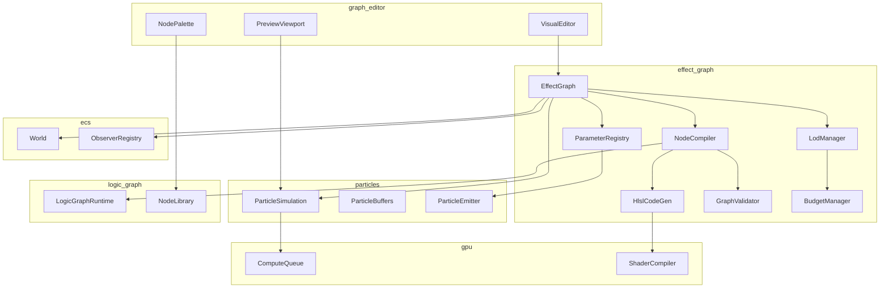
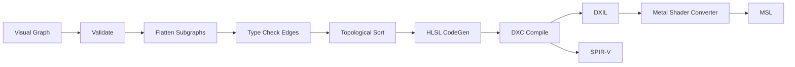
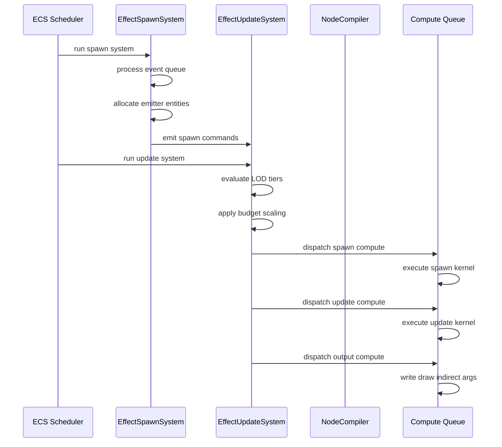
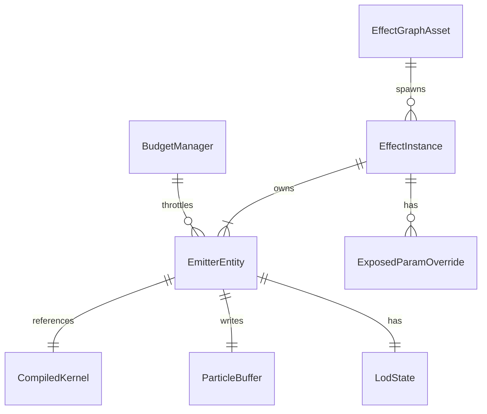

# VFX Effect Graph Design

## Requirements Trace

> **Canonical sources:** Features, requirements, and user stories are defined in
> [features/vfx/](../../features/vfx/), [requirements/vfx/](../../requirements/vfx/), and
> [user-stories/vfx/](../../user-stories/vfx/). The table below traces design elements to those
> definitions.

| Feature   | Requirement |
|-----------|-------------|
| F-11.6.1  | R-11.6.1    |
| F-11.6.2  | R-11.6.2    |
| F-11.6.3  | R-11.6.3    |
| F-11.6.4  | R-11.6.4    |
| F-11.6.5  | R-11.6.5    |
| F-11.1.1  | R-11.1.1    |
| F-15.8.1  | R-15.8.1    |
| F-15.8.5b | R-15.8.5b   |

1. **F-11.6.1** — Node-based effect graph editor with GPU compile and real-time preview
2. **F-11.6.2** — Custom effect graph nodes via logic graph system
3. **F-11.6.3** — Typed parameter slots with per-instance override and data binding
4. **F-11.6.4** — Event-driven VFX spawning from ECS observers
5. **F-11.6.5** — Distance-based LOD and global VFX performance budget
6. **F-11.1.1** — GPU compute shader particle simulation (integration target)
7. **F-15.8.1** — Universal logic graph runtime (node execution model)
8. **F-15.8.5b** — Shader graph to HLSL compilation pipeline

## Overview

The Effect Graph is the sole VFX authoring surface in Harmonius. Designers compose spawn, update,
and output behaviors as nodes in a visual graph. The graph compiler translates this visual
representation into HLSL compute shaders that execute entirely on the GPU.

The system is built on four pillars:

1. **Visual authoring.** No-code node graph with typed pins and edges. Context nodes (spawn,
   initialize, update, output) define the particle lifecycle. Attribute, operator, and output nodes
   compose simulation and rendering behavior.
2. **GPU compilation.** The graph compiler produces HLSL compute shaders. DXC compiles HLSL to DXIL
   and SPIR-V. Metal Shader Converter translates DXIL to MSL. One compile per unique graph variant.
3. **100% ECS integration.** Effect instances, emitters, particle buffers, parameters, LOD state,
   and budget tracking are all ECS components. All logic runs as ECS systems.
4. **Event-driven spawning.** ECS observers trigger VFX from gameplay events (collisions, animation
   notifies, ability activations) with context data.

### Design Principles

- **Static dispatch.** All node types are enum variants. No trait objects, no vtables on the hot
  path.
- **Graph-to-shader compilation.** The visual graph compiles to a single fused compute dispatch per
  emitter per lifecycle stage. No per-node dispatch.
- **Typed edges.** Every connection carries a static type. Type errors are caught at edit time.
- **Platform-aware compilation.** Mobile graphs are compiled with reduced node count limits (32 vs
  128). Custom per-particle nodes are restricted to per-emitter on mobile.
- **Deterministic execution.** Identical graphs with identical inputs produce identical particle
  state across frames and platforms.

## Architecture

### Module Boundaries



### Directory Layout

```text
harmonius_vfx/
├── effect_graph/
│   ├── graph.rs          # EffectGraph, EffectNode,
│   │                     # TypedEdge
│   ├── nodes/
│   │   ├── context.rs    # Spawn, Initialize, Update,
│   │   │                 # Output context nodes
│   │   ├── attribute.rs  # Position, Velocity, Color,
│   │   │                 # Size, Lifetime, etc.
│   │   ├── operator.rs   # Math, Noise, Sample,
│   │   │                 # Compare, Branch
│   │   └── output.rs     # Sprite, Mesh, Ribbon,
│   │                     # Light output nodes
│   ├── compiler/
│   │   ├── validate.rs   # GraphValidator, type check,
│   │   │                 # cycle detect
│   │   ├── flatten.rs    # Subgraph inlining, dead
│   │   │                 # node elimination
│   │   ├── sort.rs       # Topological sort of nodes
│   │   ├── codegen.rs    # HlslCodeGen, HLSL emission
│   │   └── compile.rs    # DXC invocation, shader
│   │                     # cache
│   ├── parameter.rs      # ExposedParam, ParamValue,
│   │                     # DataBindingRef
│   ├── event_spawn.rs    # VfxSpawnEvent, observer
│   │                     # integration
│   ├── lod.rs            # LodManager, LodTier,
│   │                     # distance thresholds
│   ├── budget.rs         # BudgetManager, priority,
│   │                     # scaling
│   └── systems.rs        # ECS systems: spawn, update,
│                         # budget, LOD
├── particles/
│   ├── simulation.rs     # GPU particle simulation
│   ├── buffers.rs        # ParticleBuffer, free-list
│   └── emitter.rs        # ParticleEmitter component
└── editor/
    ├── graph_editor.rs   # Visual node editor UI
    ├── preview.rs        # Real-time preview viewport
    ├── palette.rs        # Node palette, search
    └── inspector.rs      # Parameter inspector panel
```

### Graph Compilation Pipeline



The compilation pipeline proceeds in six phases:

1. **Validate.** Check graph connectivity, required context nodes, pin connections, and platform
   node count limits.
2. **Flatten.** Inline custom subgraph nodes. Eliminate dead nodes not reachable from any output.
3. **Type check.** Verify all edge data types match between source and target pins. Insert implicit
   conversion nodes where safe (e.g., float to vec4 splat).
4. **Topological sort.** Order nodes by data dependency to produce a linear evaluation sequence per
   context stage.
5. **HLSL codegen.** Emit one compute shader per context stage (spawn, initialize, update, output).
   Each node's sorted evaluation becomes sequential HLSL statements within a single kernel function.
6. **Platform compile.** DXC compiles HLSL to DXIL and SPIR-V. Metal Shader Converter translates
   DXIL to MSL. Compiled shaders are cached by graph content hash.

### Frame Execution Sequence



### ECS Entity Relationships



### Core Data Structures

```mermaid
classDiagram
    class EffectGraph {
        +nodes Vec~EffectNode~
        +edges Vec~TypedEdge~
        +exposed_params Vec~ExposedParam~
    }

    class EffectNode {
        +id NodeId
        +kind NodeKind
        +inputs Vec~Pin~
        +outputs Vec~Pin~
    }

    class NodeKind {
        <<enumeration>>
        Context
        Attribute
        Operator
        Output
        Custom
    }

    class ContextNodeType {
        <<enumeration>>
        Spawn
        Initialize
        Update
        Output
    }

    class Pin {
        +id PinId
        +name StringId
        +data_type PinDataType
        +direction PinDirection
    }

    class PinDataType {
        <<enumeration>>
        Float
        Vec2
        Vec3
        Vec4
        Int
        Bool
        Color
        Curve
        Gradient
        Texture
    }

    class TypedEdge {
        +from_node NodeId
        +from_pin PinId
        +to_node NodeId
        +to_pin PinId
        +data_type PinDataType
    }

    class ExposedParam {
        +name StringId
        +data_type PinDataType
        +default_value ParamValue
    }

    class ParamValue {
        <<enumeration>>
        Float
        Vec2
        Vec3
        Vec4
        Int
        Bool
        Color
        CurveAsset
        GradientAsset
        TextureAsset
    }

    class GraphValidator {
        +validate(graph, platform) Result
    }

    class GraphValidationError {
        <<enumeration>>
        MissingContext
        TypeMismatch
        CycleDetected
        DisconnectedPin
        NodeCountExceeded
    }

    class CompiledEffect {
        +spawn_kernel CompiledKernel
        +init_kernel CompiledKernel
        +update_kernel CompiledKernel
        +output_kernel CompiledKernel
        +attribute_layout AttributeLayout
        +content_hash u64
    }

    class CompiledKernel {
        +stage ContextNodeType
        +bytecode Vec~u8~
        +thread_group_size u32
    }

    class OutputMode {
        <<enumeration>>
        Sprite
        Mesh
        Ribbon
        Light
    }

    class HlslCodeGen {
        +generate(stage, nodes, edges) Result~String~
    }

    class CodeGenError {
        <<enumeration>>
        UnsupportedNode
        InstructionLimitExceeded
    }

    class EffectGraphCompiler {
        +compile(validated, cache, platform) Result
    }

    class EffectPriority {
        <<enumeration>>
        Low
        Medium
        High
        Critical
    }

    class EffectInstanceComponent {
        +compiled AssetId
        +param_overrides Vec~ParamOverride~
        +priority EffectPriority
    }

    class EmitterComponent {
        +spawn_kernel CompiledKernel
        +update_kernel CompiledKernel
        +alive_count u32
    }

    class EmitterLodComponent {
        +current_tier LodTier
        +distance_to_camera f32
    }

    class LodTier {
        <<enumeration>>
        Full
        Reduced
        Impostor
        Culled
    }

    class VfxBudgetResource {
        +max_total_particles u32
        +max_gpu_compute_ms f32
        +current_total_particles u32
    }

    class VfxSpawnEvent {
        +effect AssetId
        +position Vec3
        +normal Vec3
        +velocity Vec3
    }

    EffectGraph *-- EffectNode
    EffectGraph *-- TypedEdge
    EffectGraph *-- ExposedParam
    EffectNode --> NodeKind
    EffectNode *-- Pin
    Pin --> PinDataType
    TypedEdge --> PinDataType
    ExposedParam --> ParamValue
    GraphValidator ..> GraphValidationError
    EffectGraphCompiler ..> CompiledEffect
    CompiledEffect *-- CompiledKernel
    CompiledEffect --> OutputMode
    CompiledKernel --> ContextNodeType
    HlslCodeGen ..> CodeGenError
    EffectInstanceComponent --> EffectPriority
    EmitterComponent --> CompiledKernel
    EmitterLodComponent --> LodTier
    VfxSpawnEvent --> EffectPriority
```



## API Design

### Node Type System

```rust
/// Unique identifier for a node within a graph.
#[derive(Clone, Copy, Debug, PartialEq, Eq, Hash)]
pub struct NodeId(pub u32);

/// Unique identifier for a pin on a node.
#[derive(Clone, Copy, Debug, PartialEq, Eq, Hash)]
pub struct PinId(pub u32);

/// Data types carried by graph edges.
#[derive(Clone, Copy, Debug, PartialEq, Eq)]
pub enum PinDataType {
    Bool,
    Float,
    Vec2,
    Vec3,
    Vec4,
    Int,
    UInt,
    Color,
    /// Handle to a sampled texture.
    Texture,
    /// Handle to a float curve asset.
    Curve,
    /// Handle to a color gradient asset.
    Gradient,
    /// Particle attribute reference.
    Attribute,
}

/// Direction of a pin (input or output).
#[derive(Clone, Copy, Debug, PartialEq, Eq)]
pub enum PinDirection {
    Input,
    Output,
}

/// A typed pin on a node.
pub struct Pin {
    pub id: PinId,
    pub name: StringId,
    pub direction: PinDirection,
    pub data_type: PinDataType,
    /// Constant value when unconnected.
    pub default_value: Option<ParamValue>,
}
```

### Node Kinds

```rust
/// The kind of an effect graph node.
pub enum NodeKind {
    Context(ContextNode),
    Attribute(AttributeNode),
    Operator(OperatorNode),
    Output(OutputNode),
    Custom(CustomNodeRef),
}

/// Context nodes define particle lifecycle stages.
/// Exactly one of each required context type must
/// exist per graph.
pub enum ContextNode {
    /// Defines emission shape, rate, burst patterns.
    Spawn(SpawnConfig),
    /// Runs once per particle at birth.
    Initialize(InitConfig),
    /// Runs every frame per living particle.
    Update(UpdateConfig),
    /// Selects render mode and material.
    OutputStage(OutputStageConfig),
}

/// Spawn configuration for the Spawn context.
pub struct SpawnConfig {
    pub shape: SpawnShape,
    pub rate: SpawnRate,
    pub max_particles: u32,
}

/// Emission shapes.
pub enum SpawnShape {
    Point,
    Sphere { radius: f32 },
    Box { half_extents: Vec3 },
    Cone { angle: f32, radius: f32 },
    MeshSurface { mesh: AssetId },
    SkinnedMesh { mesh: AssetId },
}

/// Emission rate modes.
pub enum SpawnRate {
    /// Constant particles per second.
    Constant(f32),
    /// Emit in bursts at intervals.
    Burst {
        count: u32,
        interval: f32,
        cycles: Option<u32>,
    },
    /// Driven by external event triggers.
    EventDriven,
}

/// Attribute nodes read or write per-particle
/// data.
pub enum AttributeNode {
    Position,
    Velocity,
    Color,
    Size,
    Lifetime,
    Age,
    Rotation,
    AngularVelocity,
    Mass,
    /// User-defined float attribute.
    CustomFloat(StringId),
    /// User-defined vec3 attribute.
    CustomVec3(StringId),
    /// User-defined vec4 attribute.
    CustomVec4(StringId),
}

/// Operator nodes perform computation.
pub enum OperatorNode {
    /// Binary math: add, sub, mul, div, mod, pow.
    MathBinary(MathBinaryOp),
    /// Unary math: abs, negate, sqrt, sin, cos,
    /// floor, ceil, fract, saturate.
    MathUnary(MathUnaryOp),
    /// Noise generation: Perlin, simplex, curl,
    /// Worley.
    Noise(NoiseConfig),
    /// Sample a texture at UV coordinates.
    SampleTexture(TextureRef),
    /// Evaluate a float curve at a parameter.
    SampleCurve(CurveRef),
    /// Evaluate a color gradient at a parameter.
    SampleGradient(GradientRef),
    /// Comparison: less, greater, equal, etc.
    Compare(CompareOp),
    /// Conditional branch (bool to two outputs).
    Branch,
    /// Random value in range (seeded per-particle).
    Random(RandomConfig),
    /// Lerp between two values by alpha.
    Lerp,
    /// Remap a value from one range to another.
    Remap,
    /// Dot product.
    Dot,
    /// Cross product.
    Cross,
    /// Normalize vector.
    Normalize,
    /// Vector length / magnitude.
    Length,
}

/// Binary math operations.
pub enum MathBinaryOp {
    Add,
    Subtract,
    Multiply,
    Divide,
    Modulo,
    Power,
    Min,
    Max,
}

/// Unary math operations.
pub enum MathUnaryOp {
    Abs,
    Negate,
    Sqrt,
    Sin,
    Cos,
    Tan,
    Floor,
    Ceil,
    Fract,
    Saturate,
    Exp,
    Log,
}

/// Noise generation configuration.
pub struct NoiseConfig {
    pub noise_type: NoiseType,
    pub frequency: f32,
    pub octaves: u32,
    pub lacunarity: f32,
    pub persistence: f32,
}

pub enum NoiseType {
    Perlin,
    Simplex,
    Curl,
    Worley,
}

/// Comparison operators.
pub enum CompareOp {
    Less,
    LessEqual,
    Greater,
    GreaterEqual,
    Equal,
    NotEqual,
}

/// Random value configuration.
pub struct RandomConfig {
    pub distribution: RandomDistribution,
}

pub enum RandomDistribution {
    Uniform,
    Normal { std_dev: f32 },
}

/// Output nodes determine rendering mode.
pub enum OutputNode {
    /// Camera-facing sprite billboards.
    Sprite(SpriteOutputConfig),
    /// GPU-instanced mesh particles.
    Mesh(MeshOutputConfig),
    /// Spline-based ribbon trails.
    Ribbon(RibbonOutputConfig),
    /// Dynamic point lights from particles.
    Light(LightOutputConfig),
}

/// Sprite output configuration.
pub struct SpriteOutputConfig {
    pub blend_mode: BlendMode,
    pub atlas: Option<AssetId>,
    pub flipbook_fps: Option<f32>,
    pub soft_depth_fade: bool,
    pub sort_mode: SortMode,
}

pub enum BlendMode {
    Additive,
    Alpha,
    Premultiplied,
}

pub enum SortMode {
    None,
    BackToFront,
    OldestFirst,
}

/// Mesh output configuration.
pub struct MeshOutputConfig {
    pub mesh: AssetId,
    pub material: AssetId,
    pub lod_distances: Vec<f32>,
}

/// Ribbon output configuration.
pub struct RibbonOutputConfig {
    pub width_curve: CurveRef,
    pub texture_mode: RibbonTextureMode,
    pub segments_per_particle: u32,
}

pub enum RibbonTextureMode {
    Stretch,
    Tile { tile_length: f32 },
}

/// Light output configuration.
pub struct LightOutputConfig {
    pub intensity_scale: f32,
    pub attenuation_radius: f32,
    pub max_lights_per_emitter: u32,
}

/// Reference to a custom node defined via the
/// logic graph system (F-15.8.4).
pub struct CustomNodeRef {
    pub asset_id: AssetId,
    pub execution_scope: CustomNodeScope,
}

/// Scope at which a custom node executes.
pub enum CustomNodeScope {
    /// Runs once per particle (GPU). Desktop only.
    PerParticle,
    /// Runs once per emitter (CPU). All platforms.
    PerEmitter,
}
```

### Effect Graph Structure

```rust
/// A complete visual effect graph asset.
pub struct EffectGraph {
    pub asset_id: AssetId,
    pub nodes: Vec<EffectNode>,
    pub edges: Vec<TypedEdge>,
    pub parameters: Vec<ExposedParam>,
    pub platform_tier: PlatformTier,
}

/// A node in the effect graph.
pub struct EffectNode {
    pub id: NodeId,
    pub kind: NodeKind,
    pub inputs: Vec<Pin>,
    pub outputs: Vec<Pin>,
    /// Editor-only: position in the graph canvas.
    pub editor_position: Vec2,
}

/// A typed, directed edge between two pins.
pub struct TypedEdge {
    pub source_node: NodeId,
    pub source_pin: PinId,
    pub target_node: NodeId,
    pub target_pin: PinId,
    pub data_type: PinDataType,
}

/// Platform complexity tier for node count limits.
#[derive(Clone, Copy, Debug, PartialEq, Eq)]
pub enum PlatformTier {
    /// Up to 128 nodes per graph.
    Desktop,
    /// Up to 32 nodes per graph. Per-particle custom
    /// nodes disallowed.
    Mobile,
}
```

**Note:** This `PlatformTier` enum defines only `Desktop` and `Mobile` variants. The canonical
`PlatformTier` (see [shared-primitives.md](../core-runtime/shared-primitives.md)) defines four
tiers: `Mobile, Switch, Desktop, HighEnd`. During implementation, use the full canonical enum to
ensure consistent budget scaling.

```rust
/// An exposed parameter on the effect graph.
pub struct ExposedParam {
    pub name: StringId,
    pub data_type: PinDataType,
    pub default_value: ParamValue,
    /// Optional reactive binding to game state.
    pub binding: Option<DataBindingRef>,
}

/// Concrete parameter values.
pub enum ParamValue {
    Bool(bool),
    Float(f32),
    Vec2(Vec2),
    Vec3(Vec3),
    Vec4(Vec4),
    Int(i32),
    UInt(u32),
    Color(Vec4),
    Texture(AssetId),
    Curve(AssetId),
    Gradient(AssetId),
}

/// Reference to a reactive data binding (F-10.1.7).
pub struct DataBindingRef {
    pub source_path: StringId,
}
```

### Graph Validator

```rust
/// Errors produced by graph validation.
pub enum GraphValidationError {
    /// A required context node is missing.
    MissingContext {
        missing: ContextNodeType,
    },
    /// Duplicate context node of the same type.
    DuplicateContext {
        node_id: NodeId,
        context_type: ContextNodeType,
    },
    /// Edge type mismatch between pins.
    TypeMismatch {
        edge_index: usize,
        source_type: PinDataType,
        target_type: PinDataType,
    },
    /// An input pin has no connection and no default.
    DisconnectedInput {
        node_id: NodeId,
        pin_id: PinId,
    },
    /// Cycle detected in dataflow subgraph.
    CycleDetected {
        cycle: Vec<NodeId>,
    },
    /// Node count exceeds platform tier limit.
    NodeCountExceeded {
        count: u32,
        limit: u32,
        tier: PlatformTier,
    },
    /// Per-particle custom node used on mobile.
    MobilePerParticleCustomNode {
        node_id: NodeId,
    },
}

pub enum ContextNodeType {
    Spawn,
    Initialize,
    Update,
    Output,
}

/// Validates an effect graph for correctness and
/// platform constraints.
pub struct GraphValidator;

impl GraphValidator {
    /// Run all validation passes on the graph.
    pub fn validate(
        graph: &EffectGraph,
    ) -> Result<ValidatedGraph, Vec<GraphValidationError>>;
}

/// A graph that has passed all validation checks.
/// Cannot be constructed directly -- only through
/// GraphValidator::validate.
pub struct ValidatedGraph {
    graph: EffectGraph,
}
```

### Graph Compiler

```rust
/// Compiled output of an effect graph.
pub struct CompiledEffect {
    /// Content hash of the source graph for caching.
    pub source_hash: u64,
    /// Compute shader for the spawn stage.
    pub spawn_kernel: CompiledKernel,
    /// Compute shader for the initialize stage.
    pub init_kernel: CompiledKernel,
    /// Compute shader for the update stage.
    pub update_kernel: CompiledKernel,
    /// Compute shader for the output stage.
    pub output_kernel: CompiledKernel,
    /// Particle attribute layout (SoA buffer
    /// descriptors).
    pub attribute_layout: AttributeLayout,
    /// Output mode configuration.
    pub output_mode: OutputMode,
}

/// A compiled GPU compute kernel.
pub struct CompiledKernel {
    /// Platform-native shader bytecode.
    pub bytecode: Vec<u8>,
    /// Thread group size for dispatch.
    pub thread_group_size: u32,
    /// Constant buffer layout for parameters.
    pub param_layout: ParamBufferLayout,
}

/// Output rendering mode after compilation.
pub enum OutputMode {
    Sprite(SpriteOutputConfig),
    Mesh(MeshOutputConfig),
    Ribbon(RibbonOutputConfig),
    Light(LightOutputConfig),
}

/// Layout of per-particle attributes in GPU
/// buffers. SoA layout: one buffer per attribute.
pub struct AttributeLayout {
    pub attributes: Vec<AttributeDesc>,
    pub stride_per_attribute: Vec<u32>,
    pub max_particles: u32,
}

pub struct AttributeDesc {
    pub name: StringId,
    pub data_type: PinDataType,
    pub offset: u32,
}

/// Layout of the constant buffer that receives
/// exposed parameters each frame.
pub struct ParamBufferLayout {
    pub entries: Vec<ParamBufferEntry>,
    pub total_size: u32,
}

pub struct ParamBufferEntry {
    pub name: StringId,
    pub data_type: PinDataType,
    pub offset: u32,
}

/// HLSL code generator. Transforms a validated,
/// topologically sorted graph into HLSL compute
/// shader source code.
pub struct HlslCodeGen;

impl HlslCodeGen {
    /// Generate HLSL for one lifecycle stage.
    pub fn generate(
        stage: ContextNodeType,
        sorted_nodes: &[EffectNode],
        edges: &[TypedEdge],
        attribute_layout: &AttributeLayout,
        param_layout: &ParamBufferLayout,
    ) -> Result<String, CodeGenError>;
}

pub enum CodeGenError {
    /// Unsupported node type for this stage.
    UnsupportedNode {
        node_id: NodeId,
        stage: ContextNodeType,
    },
    /// Generated HLSL exceeds instruction limit.
    InstructionLimitExceeded {
        count: u32,
        limit: u32,
    },
}

/// Top-level compiler entry point.
pub struct EffectGraphCompiler;

impl EffectGraphCompiler {
    /// Compile a validated graph to GPU compute
    /// kernels. Checks the shader cache first.
    pub async fn compile(
        validated: &ValidatedGraph,
        cache: &ShaderCache,
        platform: PlatformTier,
    ) -> Result<CompiledEffect, CompileError>;
}

pub enum CompileError {
    Validation(Vec<GraphValidationError>),
    CodeGen(CodeGenError),
    /// DXC or Metal Shader Converter error.
    ShaderCompilation {
        stage: ContextNodeType,
        message: String,
    },
}
```

### ECS Components

```rust
/// Component: an instance of a spawned effect in
/// the world. Attached to the root entity of the
/// effect.
pub struct EffectInstanceComponent {
    /// The compiled effect asset.
    pub compiled: AssetId,
    /// Per-instance parameter overrides.
    pub param_overrides: Vec<ParamOverride>,
    /// Effect priority for budget management.
    pub priority: EffectPriority,
    /// Remaining effect lifetime (None = infinite).
    pub remaining_lifetime: Option<f32>,
}

pub struct ParamOverride {
    pub name: StringId,
    pub value: ParamValue,
}

/// Priority levels for VFX budget allocation.
#[derive(
    Clone, Copy, Debug, PartialEq, Eq,
    PartialOrd, Ord,
)]
pub enum EffectPriority {
    /// Ambient environmental VFX (dust, fog).
    Low = 0,
    /// Gameplay-relevant but not critical.
    Medium = 1,
    /// Player abilities, critical feedback.
    High = 2,
    /// Hero/cinematic effects, never culled.
    Critical = 3,
}

/// Component: a single emitter within an effect
/// instance. Child entity of the effect root via
/// ChildOf relationship.
pub struct EmitterComponent {
    /// Which lifecycle stage kernels to dispatch.
    pub spawn_kernel: CompiledKernel,
    pub init_kernel: CompiledKernel,
    pub update_kernel: CompiledKernel,
    pub output_kernel: CompiledKernel,
    /// GPU particle buffer for this emitter.
    pub particle_buffer: ParticleBufferHandle,
    /// Current alive particle count (GPU readback,
    /// one frame latency).
    pub alive_count: u32,
    /// Current spawn rate after LOD/budget scaling.
    pub effective_spawn_rate: f32,
}

/// Component: LOD state for an emitter.
pub struct EmitterLodComponent {
    pub current_tier: LodTier,
    pub distance_to_camera: f32,
    pub screen_coverage: f32,
}

/// LOD tiers with increasing simplification.
#[derive(
    Clone, Copy, Debug, PartialEq, Eq,
    PartialOrd, Ord,
)]
pub enum LodTier {
    /// Full simulation and rendering.
    Full = 0,
    /// Reduced spawn rate.
    Reduced = 1,
    /// Billboard impostor (sprites only).
    Impostor = 2,
    /// Completely culled.
    Culled = 3,
}

/// Resource: global VFX performance budget.
pub struct VfxBudgetResource {
    pub max_total_particles: u32,
    pub max_gpu_compute_ms: f32,
    pub current_total_particles: u32,
    pub current_gpu_compute_ms: f32,
}
```

### Event-Driven Spawning

```rust
/// Event dispatched to spawn a VFX instance.
/// Observers on gameplay events (collisions,
/// animation notifies, etc.) emit this event.
pub struct VfxSpawnEvent {
    /// The effect graph asset to spawn.
    pub effect: AssetId,
    /// World-space spawn position.
    pub position: Vec3,
    /// Surface normal at spawn point.
    pub normal: Vec3,
    /// Velocity of the source (projectile, etc.).
    pub velocity: Vec3,
    /// Surface material for material-dependent VFX.
    pub surface_material: Option<StringId>,
    /// Entity to attach the effect to, or None for
    /// world-space spawn.
    pub attach_to: Option<Entity>,
    /// Priority override. Defaults to the effect
    /// graph's default priority.
    pub priority: Option<EffectPriority>,
    /// Parameter overrides for this spawn.
    pub param_overrides: Vec<ParamOverride>,
}

/// System that processes VfxSpawnEvents and creates
/// effect instance entities.
pub struct EffectSpawnSystem;

impl EffectSpawnSystem {
    /// Reads VfxSpawnEvent from the event channel.
    /// For each event:
    /// 1. Look up the CompiledEffect asset.
    /// 2. Create a root entity with
    ///    EffectInstanceComponent.
    /// 3. Create child emitter entities with
    ///    EmitterComponent and EmitterLodComponent.
    /// 4. Allocate ParticleBuffer from the GPU
    ///    buffer pool.
    /// 5. If attach_to is Some, add ChildOf
    ///    relationship to the target entity.
    pub fn run(
        events: EventReader<VfxSpawnEvent>,
        commands: &mut CommandBuffer,
        assets: &AssetDatabase,
    );
}
```

### LOD and Budget Systems

```rust
/// Configuration for LOD distance thresholds.
pub struct LodConfig {
    /// Distance at which spawn rate is reduced.
    pub reduced_distance: f32,
    /// Distance at which impostor mode activates.
    pub impostor_distance: f32,
    /// Distance at which effect is culled.
    pub cull_distance: f32,
    /// Hysteresis factor to prevent tier popping.
    pub hysteresis: f32,
}

/// System: updates EmitterLodComponent based on
/// camera distance and screen coverage.
pub struct LodUpdateSystem;

impl LodUpdateSystem {
    /// For each emitter:
    /// 1. Compute distance to active camera.
    /// 2. Compute screen-space coverage from the
    ///    shared BVH (F-1.9.1).
    /// 3. Select LOD tier with hysteresis.
    /// 4. Write tier to EmitterLodComponent.
    pub fn run(
        emitters: Query<(
            &mut EmitterLodComponent,
            &GlobalTransform,
        )>,
        camera: &ActiveCamera,
        config: &LodConfig,
    );
}

/// Budget limits per platform tier.
pub struct BudgetConfig {
    pub max_particles: u32,
    pub max_gpu_compute_ms: f32,
}

/// Default budget limits by platform.
///
/// | Platform | Max Particles | Max GPU ms |
/// |----------|--------------|------------|
/// | Mobile   | 10,000       | 1.0        |
/// | Switch   | 50,000       | 2.0        |
/// | Console  | 200,000      | 4.0        |
/// | Desktop  | 500,000      | 6.0        |

/// System: enforces global VFX performance budget.
pub struct BudgetEnforcementSystem;

impl BudgetEnforcementSystem {
    /// 1. Sum alive particle counts across all
    ///    emitters.
    /// 2. Read GPU compute time from last frame's
    ///    timestamp queries.
    /// 3. If over budget, sort emitters by priority
    ///    (ascending).
    /// 4. Scale down lowest-priority emitters first
    ///    (reduce spawn rate, advance LOD tier).
    /// 5. Critical-priority effects are never
    ///    scaled.
    /// 6. Update VfxBudgetResource with current
    ///    totals.
    pub fn run(
        emitters: Query<(
            &mut EmitterComponent,
            &mut EmitterLodComponent,
            &EffectInstanceComponent,
        )>,
        budget: &mut VfxBudgetResource,
        config: &BudgetConfig,
    );
}
```

### Editor Preview

```rust
/// Editor-only: real-time VFX preview viewport.
pub struct EffectPreview {
    /// Isolated ECS world for preview simulation.
    preview_world: World,
    /// Preview timeline state.
    timeline: PreviewTimeline,
    /// Per-emitter performance statistics.
    stats: Vec<EmitterStats>,
}

pub struct PreviewTimeline {
    pub current_time: f32,
    pub duration: f32,
    pub is_playing: bool,
    pub is_looping: bool,
    pub playback_speed: f32,
}

pub struct EmitterStats {
    pub emitter_name: StringId,
    pub alive_particles: u32,
    pub gpu_time_us: f32,
    pub spawn_rate: f32,
}

impl EffectPreview {
    /// Create a preview for the given effect graph.
    pub fn new(graph: &EffectGraph) -> Self;

    /// Step the preview simulation by dt seconds.
    pub fn step(&mut self, dt: f32);

    /// Scrub to a specific time. Resets simulation
    /// and fast-forwards to the target time.
    pub fn scrub_to(&mut self, time: f32);

    /// Toggle play/pause.
    pub fn toggle_playback(&mut self);

    /// Get current per-emitter statistics.
    pub fn stats(&self) -> &[EmitterStats];
}
```

## Data Flow

### Effect Graph Lifecycle

The lifecycle of an effect graph from authoring to runtime execution proceeds through these stages.

1. **Author.** The effects artist opens the visual graph editor, drags nodes from the palette, and
   connects typed pins. The editor validates in real-time, highlighting type mismatches and
   disconnected pins.

2. **Preview.** The artist opens the preview viewport. The graph compiles on save and the preview
   world simulates the effect with scrubbing, looping, and live per-emitter stats.

3. **Compile.** On asset save or build, the graph compiler runs the full pipeline: validate,
   flatten, type check, topological sort, HLSL codegen, DXC compile. Results are cached by content
   hash.

4. **Load.** At runtime, the asset system loads the `CompiledEffect` binary. No graph interpretation
   occurs at runtime -- only pre-compiled GPU kernels.

5. **Spawn.** A gameplay event (collision, animation notify, ability activation) emits a
   `VfxSpawnEvent`. The `EffectSpawnSystem` creates ECS entities with `EffectInstanceComponent`,
   `EmitterComponent`, and `EmitterLodComponent`.

6. **Simulate.** Each frame, the `EffectUpdateSystem` dispatches compute shaders per emitter:
   - Spawn kernel: emit new particles
   - Update kernel: evaluate forces, noise, curves
   - Output kernel: write draw-indirect arguments

7. **Render.** The rendering system reads draw-indirect buffers and issues draw calls (sprites,
   meshes, ribbons) with zero CPU per-particle overhead.

8. **Budget.** The `BudgetEnforcementSystem` monitors total particle counts and GPU compute time.
   When budget is exceeded, low-priority effects are scaled down or culled.

9. **Destroy.** When an effect's lifetime expires or the owning entity is despawned, the emitter
   entities are destroyed and GPU buffers returned to the pool.

### HLSL Codegen Example

A simple update graph with gravity and color-over-life compiles to a single fused kernel:

```hlsl
// Generated by HlslCodeGen -- do not edit.
// Graph hash: 0xA3F7B2C1D4E5

RWStructuredBuffer<float3> positions : register(u0);
RWStructuredBuffer<float3> velocities : register(u1);
RWStructuredBuffer<float4> colors : register(u2);
RWStructuredBuffer<float>  ages : register(u3);
RWStructuredBuffer<float>  lifetimes : register(u4);

cbuffer Params : register(b0) {
    float  deltaTime;
    float3 gravity;
    // Exposed parameters
    float  colorIntensity;
};

Texture2D<float4> gradientTex : register(t0);
SamplerState      gradientSampler : register(s0);

[numthreads(256, 1, 1)]
void UpdateMain(uint3 id : SV_DispatchThreadID) {
    uint i = id.x;
    if (ages[i] >= lifetimes[i]) return;

    // Node 3: Gravity force (Operator::MathBinary)
    velocities[i] += gravity * deltaTime;

    // Node 4: Integrate position (Attribute::Position)
    positions[i] += velocities[i] * deltaTime;

    // Node 5: Age ratio (Operator::MathBinary)
    float ageRatio = ages[i] / lifetimes[i];

    // Node 6: Sample gradient (Operator::SampleGradient)
    float4 gradColor = gradientTex.SampleLevel(
        gradientSampler, float2(ageRatio, 0.0), 0
    );

    // Node 7: Scale by intensity (Operator::MathBinary)
    colors[i] = gradColor * colorIntensity;

    // Node 8: Advance age (Attribute::Age)
    ages[i] += deltaTime;
}
```

### Parameter Binding Flow

```text
Game State (ECS Component)
    |
    v
DataBindingRef (reactive)
    |
    v
ExposedParam on EffectInstance
    |
    v
ParamOverride written to constant buffer
    |
    v
cbuffer Params in HLSL kernel
```

Parameters flow from game state through reactive data bindings into the per-instance constant buffer
uploaded to the GPU each frame. Changes propagate within one frame.

## Platform Considerations

### Shader Pipeline Per Platform

| Platform | HLSL Source | DXC Output | Final Format |
|----------|------------|------------|--------------|
| Windows (D3D12) | HLSL | DXIL | DXIL |
| Windows (Vulkan) | HLSL | SPIR-V | SPIR-V |
| Linux (Vulkan) | HLSL | SPIR-V | SPIR-V |
| macOS (Metal) | HLSL | DXIL | MSL (via Metal Shader Converter) |
| iOS (Metal) | HLSL | DXIL | MSL (via Metal Shader Converter) |

All shader compilation uses DXC (C++ via cxx.rs) and Metal Shader Converter (C++ via cxx.rs). HLSL
is the sole shader intermediate language.

### Platform Compute Capabilities

| Platform | Compute Queue | Thread Group Max | Shared Memory |
|----------|--------------|-----------------|---------------|
| Desktop D3D12 | Async compute | 1024 threads | 32 KiB |
| Desktop Vulkan | Async compute | 1024 threads | 32 KiB |
| Metal (macOS) | Async compute | 1024 threads | 32 KiB |
| Metal (iOS) | Graphics queue | 512 threads | 16 KiB |
| Mobile Vulkan | Graphics queue | 256 threads | 16 KiB |

Effects compiled for mobile use smaller thread group sizes (256 vs desktop 1024) and simpler kernels
(fewer node evaluations per thread).

### Node Count Limits

| Platform Tier | Max Nodes | Custom Node Scope | Notes |
|---------------|----------|-------------------|-------|
| Desktop | 128 | Per-particle and per-emitter | Full feature set |
| Mobile | 32 | Per-emitter only | No per-particle custom nodes |

### Budget Defaults

| Platform | Max Particles | Max GPU Compute (ms) |
|----------|--------------|---------------------|
| Mobile | 10,000 | 1.0 |
| Switch | 50,000 | 2.0 |
| Console | 200,000 | 4.0 |
| Desktop | 500,000 | 6.0 |

### Async I/O for Asset Loading

Effect graph assets (compiled kernels + metadata) are loaded via the platform async I/O system:

- **Windows:** IOCP
- **macOS:** GCD / Dispatch IO (C++ wrappers via cxx.rs)
- **Linux:** io_uring

Loading is non-blocking. The `IoReactor` poll point wakes the loading future when the OS completes
the read. Effect instances are not spawned until their compiled kernels are resident.

## Test Plan

### Unit Tests

| Test                               | Req      |
|------------------------------------|----------|
| `test_validate_complete_graph`     | R-11.6.1 |
| `test_validate_missing_context`    | R-11.6.1 |
| `test_validate_type_mismatch`      | R-11.6.1 |
| `test_validate_cycle_detection`    | R-11.6.1 |
| `test_validate_mobile_node_limit`  | R-11.6.1 |
| `test_validate_mobile_custom_node` | R-11.6.2 |
| `test_codegen_gravity_update`      | R-11.6.1 |
| `test_codegen_noise_operator`      | R-11.6.1 |
| `test_codegen_sample_curve`        | R-11.6.1 |
| `test_codegen_branch`              | R-11.6.1 |
| `test_topological_sort`            | R-11.6.1 |
| `test_dead_node_elimination`       | R-11.6.1 |
| `test_param_default_value`         | R-11.6.3 |
| `test_param_override`              | R-11.6.3 |
| `test_lod_tier_selection`          | R-11.6.5 |
| `test_lod_hysteresis`              | R-11.6.5 |
| `test_budget_priority_ordering`    | R-11.6.5 |
| `test_budget_critical_immune`      | R-11.6.5 |
| `test_spawn_shape_coverage`        | R-11.1.1 |

1. **`test_validate_complete_graph`** — Graph with all four context nodes passes validation.
2. **`test_validate_missing_context`** — Graph missing a Spawn node returns MissingContext error.
3. **`test_validate_type_mismatch`** — Edge connecting Float output to Vec3 input returns
   TypeMismatch.
4. **`test_validate_cycle_detection`** — Cyclic dataflow edges return CycleDetected with the cycle
   path.
5. **`test_validate_mobile_node_limit`** — Mobile graph with 33 nodes returns NodeCountExceeded.
6. **`test_validate_mobile_custom_node`** — Per-particle custom node on Mobile returns
   MobilePerParticleCustomNode.
7. **`test_codegen_gravity_update`** — Gravity + position integration graph produces valid HLSL with
   correct buffer bindings.
8. **`test_codegen_noise_operator`** — Noise node generates correct HLSL noise function call.
9. **`test_codegen_sample_curve`** — SampleCurve node emits texture sample with correct UV mapping.
10. **`test_codegen_branch`** — Branch node emits HLSL conditional with both paths.
11. **`test_topological_sort`** — Nodes are sorted so every node evaluates after its dependencies.
12. **`test_dead_node_elimination`** — Disconnected nodes are removed during flatten pass.
13. **`test_param_default_value`** — Unconnected parameter pins use their default value in codegen.
14. **`test_param_override`** — Per-instance ParamOverride writes to the correct cbuffer offset.
15. **`test_lod_tier_selection`** — Emitter at each distance selects the correct LOD tier.
16. **`test_lod_hysteresis`** — Emitter oscillating near threshold does not flicker between tiers.
17. **`test_budget_priority_ordering`** — Budget system scales Low-priority before Medium before
    High.
18. **`test_budget_critical_immune`** — Critical-priority effects are never scaled or culled.
19. **`test_spawn_shape_coverage`** — Each SpawnShape variant produces particles within the expected
    volume.

### Integration Tests

| Test                             | Req      |
|----------------------------------|----------|
| `test_compile_and_dispatch`      | R-11.6.1 |
| `test_event_spawn_collision`     | R-11.6.4 |
| `test_event_spawn_anim_notify`   | R-11.6.4 |
| `test_event_spawn_attach`        | R-11.6.4 |
| `test_param_data_binding`        | R-11.6.3 |
| `test_param_sequencer_animate`   | R-11.6.3 |
| `test_custom_node_per_emitter`   | R-11.6.2 |
| `test_custom_node_in_palette`    | R-11.6.2 |
| `test_preview_scrub`             | R-11.6.1 |
| `test_preview_stats`             | R-11.6.1 |
| `test_budget_dynamic_resolution` | R-11.6.5 |
| `test_mobile_event_throttle`     | R-11.6.4 |
| `test_shader_cache_hit`          | R-11.6.1 |
| `test_output_sprite_render`      | R-11.1.3 |
| `test_output_mesh_render`        | R-11.1.3 |
| `test_output_ribbon_render`      | R-11.1.3 |

1. **`test_compile_and_dispatch`** — Compile a graph end-to-end, dispatch compute kernels, verify
   particle buffer contains expected state.
2. **`test_event_spawn_collision`** — Trigger physics collision observer, assert VfxSpawnEvent
   creates effect instance at contact point with correct normal.
3. **`test_event_spawn_anim_notify`** — Trigger animation notify observer, assert VFX spawns at bone
   position with correct velocity.
4. **`test_event_spawn_attach`** — Spawn effect with attach_to, verify effect follows parent entity
   transform.
5. **`test_param_data_binding`** — Bind parameter to ECS component value, change value, assert
   effect updates within one frame.
6. **`test_param_sequencer_animate`** — Animate parameter via sequencer keyframes, assert
   interpolation across time.
7. **`test_custom_node_per_emitter`** — Author custom node via logic graph, compile and run in
   effect graph, verify output matches expected values.
8. **`test_custom_node_in_palette`** — Package custom node as library asset, verify it appears in
   the editor node palette.
9. **`test_preview_scrub`** — Open preview, scrub to t=2.0, verify particle state matches t=2.0
   simulation.
10. **`test_preview_stats`** — Open preview, verify per-emitter stats (alive count, GPU time) are
    non-zero and plausible.
11. **`test_budget_dynamic_resolution`** — Exceed VFX budget, verify dynamic resolution system is
    notified.
12. **`test_mobile_event_throttle`** — On mobile, spawn low-priority events under budget pressure,
    verify they are skipped.
13. **`test_shader_cache_hit`** — Compile same graph twice, verify second compile reads from cache
    without invoking DXC.
14. **`test_output_sprite_render`** — Compile sprite output graph, verify draw-indirect args produce
    correct billboard draws.
15. **`test_output_mesh_render`** — Compile mesh output graph, verify GPU instancing with
    per-particle transforms.
16. **`test_output_ribbon_render`** — Compile ribbon output graph, verify spline geometry connects
    sequential particles.

### Benchmarks

| Benchmark | Target | Source |
|-----------|--------|--------|
| Graph validation (128 nodes) | < 1 ms | R-11.6.1 |
| HLSL codegen (128 nodes) | < 10 ms | R-11.6.1 |
| Full compile (validate + codegen + DXC) | < 500 ms | R-11.6.1 |
| Shader cache lookup | < 100 us | R-11.6.1 |
| Spawn system (100 events) | < 500 us | R-11.6.4 |
| LOD update (1000 emitters) | < 200 us | R-11.6.5 |
| Budget enforcement (1000 emitters) | < 100 us | R-11.6.5 |
| GPU spawn kernel (10K particles) | < 0.1 ms | R-11.1.1 |
| GPU update kernel (100K particles) | < 0.5 ms | R-11.1.1 |
| GPU update kernel (500K particles) | < 2.0 ms | R-11.1.1 |

### Shader Compilation Targets

| Target | Compiler | Output | Notes |
|--------|----------|--------|-------|
| D3D12 | DXC | DXIL | Direct compilation from HLSL. |
| Vulkan | DXC | SPIR-V | HLSL -> SPIR-V via DXC. |
| Metal | DXC + MSC | metallib | HLSL -> DXIL -> MSL via Metal Shader Converter. |

The effect graph compiler shares the `GraphCompiler` framework (see
[shared-primitives.md](../core-runtime/shared-primitives.md)) with the material graph and shader
graph for consistent compilation infrastructure.

## Design Q & A

**Q1. What is the biggest constraint limiting this design?**

The HLSL-only shader IL constraint means the effect graph compiler must produce HLSL compute
shaders, then rely on DXC for DXIL/SPIR-V and Metal Shader Converter for MSL. This two-stage
compilation adds warm-up latency (up to 500 ms per graph) and limits the compiler to HLSL's compute
model. Lifting this constraint would allow direct SPIR-V or AIR emission, cutting compile time in
half and enabling platform-specific optimizations. We keep the constraint because a single shader IL
reduces the compiler's complexity from N backends to one, and DXC/MSC are already required for the
material and shader graph pipelines (F-15.8.5b).

**Q2. How can this design be improved?**

The graph compiler fuses all modules into a single compute dispatch per emitter (F-11.6.1), but this
means changing one node recompiles the entire shader. An incremental compilation strategy that
caches compiled subgraph fragments and re-links only changed portions would dramatically reduce
iteration time in the editor. The event-driven spawning system (R-11.6.4) also lacks a cooldown or
debounce mechanism -- rapid collision events in physics-heavy scenes could spawn hundreds of VFX per
frame, overwhelming the budget manager before it can react.

**Q3. Is there a better approach?**

An alternative is a CPU-interpreted virtual machine that evaluates graph nodes per-particle, similar
to UE4's Cascade. This avoids shader compilation entirely and supports hot reload instantly. We
chose GPU compilation because CPU evaluation cannot scale to the million-particle counts required by
F-11.1.1, and the engine's GPU-first particle architecture demands compute shaders. The trade-off is
longer iteration cycles in the editor, mitigated by pre-compilation on save and a placeholder effect
during first-time compilation.

**Q4. Does this design solve all customer problems?**

The effect graph covers spawn, update, and output but lacks a dedicated audio integration node. VFX
artists (US-11.6.1.1) frequently need to synchronize particle bursts with sound effects, but the
current design requires separate audio event wiring through the logic graph. Adding an AudioEmit
node to the effect graph that triggers sounds at spawn/death events with spatialized positioning
would streamline the audio-visual authoring workflow and reduce cross-system wiring for common use
cases like explosions and impacts.

**Q5. Is this design cohesive with the overall engine?**

The effect graph shares the GraphCompiler framework with the material and shader graphs (F-15.8.5b),
ensuring consistent compilation infrastructure across all visual authoring surfaces. The parameter
system (F-11.6.3) reuses the widget framework's reactive data binding (F-10.1.7), which is a strong
cohesion point. One inconsistency is that the LOD system (R-11.6.5) uses its own distance-based tier
logic rather than the shared spatial index's LOD infrastructure. Unifying VFX LOD with the
engine-wide LOD system would reduce duplication and ensure consistent quality scaling across
rendering, physics, and VFX.

## Open Questions

1. **Shader variant explosion.** Each unique graph topology produces a unique shader. How
   aggressively should we canonicalize equivalent subgraphs to reduce variant count? A
   content-hash-based cache covers identical graphs, but semantically equivalent graphs with
   different node ordering would produce separate shaders.

2. **Warm-up latency.** DXC compilation is expensive (up to 500 ms for complex graphs). Should the
   editor pre-compile all known platform variants on save, or compile on-demand with a loading
   placeholder effect? Pre-compilation increases save time but eliminates runtime stalls.

3. **GPU readback for particle counts.** Budget enforcement needs alive particle counts from the
   GPU. A one-frame-latency readback via a staging buffer is the current plan. Is one frame of
   latency acceptable, or should the budget system use a CPU-side estimate based on spawn rate and
   lifetime?

4. **Sub-emitter graph composition.** Sub-emitters (F-11.1.5) spawn child effects from particle
   events. Should sub-emitter references be edges within the same graph, or separate graph assets
   linked by asset reference? Intra-graph edges enable tighter optimization but increase graph
   complexity.

5. **Debug visualization.** Should the runtime support a debug overlay showing per-emitter bounding
   volumes, LOD tiers, and particle counts in the game viewport? This aids effects artists working
   in play mode but requires additional GPU draw calls.

6. **Deterministic random seeds.** The Random operator node needs per-particle seeds. Should seeds
   be derived from particle index + frame number (fully deterministic, reproducible in preview
   scrubbing) or from a global PRNG state (less predictable but avoids visible patterns)?

7. **Custom node compilation target.** Per-particle custom nodes authored in the logic graph
   currently compile to HLSL inline functions. If the logic graph uses a bytecode VM, how is
   per-particle execution on the GPU achieved? The current assumption is that per-particle custom
   nodes must compile to HLSL, not bytecode. This needs alignment with the logic graph AOT
   compilation path (F-15.8.12).
