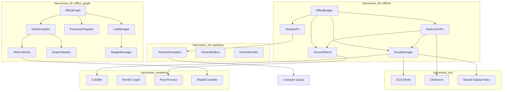
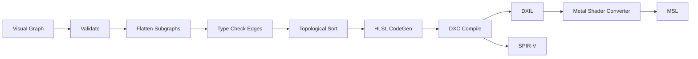
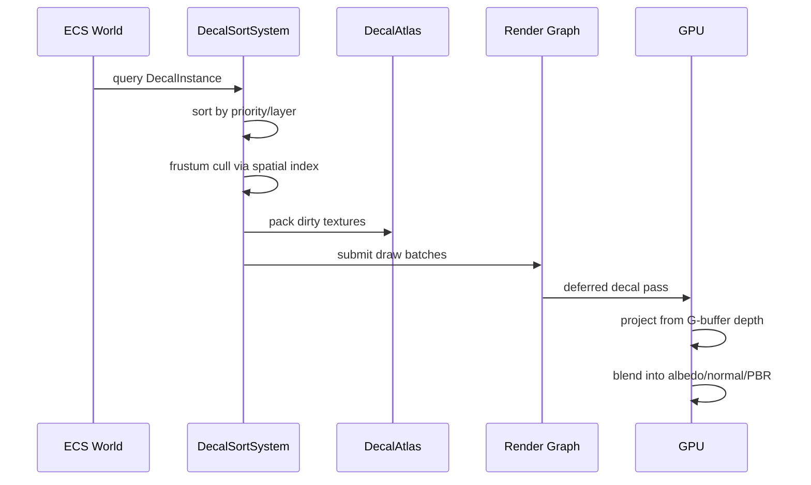
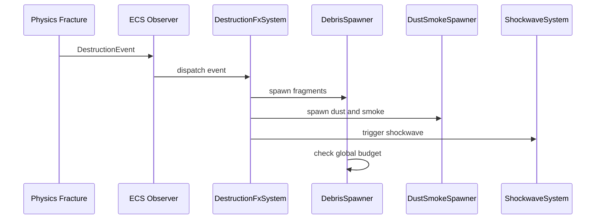
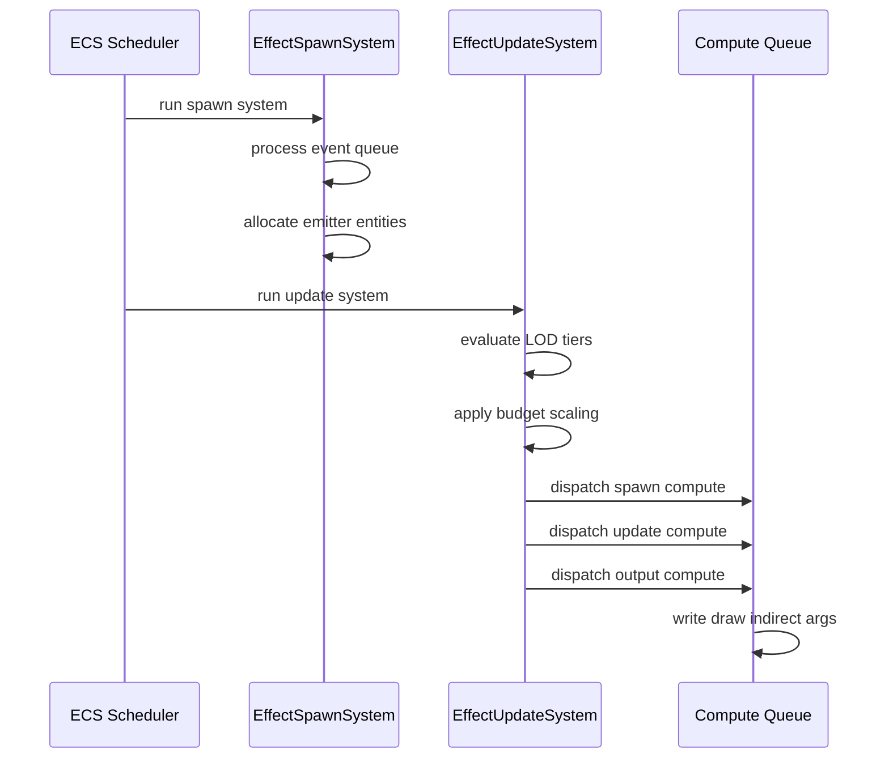

# VFX Effects & Effect Graph Design

## Requirements Trace

> **Canonical sources:** Features, requirements, and user stories are defined in
> [features/](../../features/), [requirements/](../../requirements/), and
> [user-stories/](../../user-stories/). The table below traces design elements to those definitions.

### Decals (11.2)

| Feature  | Requirement | User Story                         |
|----------|-------------|------------------------------------|
| F-11.2.1 | R-11.2.1    | US-11.2.1.1..US-11.2.1.3           |
| F-11.2.2 | R-11.2.2    | US-11.2.2.1, US-11.2.2.2           |
| F-11.2.3 | R-11.2.3    | US-11.2.3.1, US-11.2.3.2           |
| F-11.2.4 | R-11.2.4    | US-11.2.4.1..US-11.2.4.3           |
| F-11.2.5 | R-11.2.5    | US-11.2.5.1, US-11.2.5.2           |
| F-11.2.6 | R-11.2.6    | US-11.2.6.1..US-11.2.6.3           |

1. **F-11.2.1** — Deferred and projected decals with per-channel G-buffer modification
2. **F-11.2.2** — Mesh decals with tangent-space normals
3. **F-11.2.3** — Runtime decal atlas with LRU eviction
4. **F-11.2.4** — Priority layering, blend modes, lifecycle
5. **F-11.2.5** — Procedural blood and damage decals
6. **F-11.2.6** — Surface-aware footprints and tire tracks

### Screen Effects (11.3)

| Feature  | Requirement | User Story                         |
|----------|-------------|------------------------------------|
| F-11.3.1 | R-11.3.1    | US-11.3.1.1..US-11.3.1.3           |
| F-11.3.2 | R-11.3.2    | US-11.3.2.1, US-11.3.2.2           |
| F-11.3.3 | R-11.3.3    | US-11.3.3.1..US-11.3.3.3           |
| F-11.3.4 | R-11.3.4    | US-11.3.4.1, US-11.3.4.2           |
| F-11.3.5 | R-11.3.5    | US-11.3.5.1, US-11.3.5.2           |
| F-11.3.6 | R-11.3.6    | US-11.3.6.1..US-11.3.6.3           |

1. **F-11.3.1** — Perlin-noise camera shake with additive layering
2. **F-11.3.2** — Per-object and camera motion blur
3. **F-11.3.3** — Screen-space lens flare with templates
4. **F-11.3.4** — Chromatic aberration, film grain, vignette
5. **F-11.3.5** — Heat haze and screen-space refraction
6. **F-11.3.6** — Damage overlays and screen flash

### Weather and Environmental FX (11.4)

| Feature  | Requirement | User Story                         |
|----------|-------------|------------------------------------|
| F-11.4.1 | R-11.4.1    | US-11.4.1.1..US-11.4.1.3           |
| F-11.4.2 | R-11.4.2    | US-11.4.2.1..US-11.4.2.3           |
| F-11.4.3 | R-11.4.3    | US-11.4.3.1..US-11.4.3.3           |
| F-11.4.4 | R-11.4.4    | US-11.4.4.1, US-11.4.4.2           |
| F-11.4.5 | R-11.4.5    | US-11.4.5.1..US-11.4.5.3           |
| F-11.4.6 | R-11.4.6    | US-11.4.6.1..US-11.4.6.3           |
| F-11.4.7 | R-11.4.7    | US-11.4.7.1..US-11.4.7.3           |

1. **F-11.4.1** — Multi-layered rain with screen droplets
2. **F-11.4.2** — Dynamic puddles and wet surfaces
3. **F-11.4.3** — Vertex-displacement snow with deformation
4. **F-11.4.4** — Localized volumetric fog volumes
5. **F-11.4.5** — Procedural branching lightning
6. **F-11.4.6** — Wind-driven debris and dust storms
7. **F-11.4.7** — Underwater caustics, depth fog, god rays

### Destruction VFX (11.5)

| Feature  | Requirement | User Story                         |
|----------|-------------|------------------------------------|
| F-11.5.1 | R-11.5.1    | US-11.5.1.1..US-11.5.1.3           |
| F-11.5.2 | R-11.5.2    | US-11.5.2.1, US-11.5.2.2           |
| F-11.5.3 | R-11.5.3    | US-11.5.3.1..US-11.5.3.3           |
| F-11.5.4 | R-11.5.4    | US-11.5.4.1..US-11.5.4.3           |
| F-11.5.5 | R-11.5.5    | US-11.5.5.1, US-11.5.5.2           |
| F-11.5.6 | R-11.5.6    | US-11.5.6.1, US-11.5.6.2           |
| F-11.5.7 | R-11.5.7    | US-11.5.7.1..US-11.5.7.3           |

1. **F-11.5.1** — Event-driven debris spawning with budget
2. **F-11.5.2** — Material-colored dust clouds and smoke
3. **F-11.5.3** — Sparks with bounce and drifting embers
4. **F-11.5.4** — Animated crack decals from stress
5. **F-11.5.5** — Persistent scorch marks on G-buffer
6. **F-11.5.6** — Expanding shockwave distortion
7. **F-11.5.7** — Surface-spreading fire propagation

### Effect Graph (11.6)

| Feature   | Requirement |
|-----------|-------------|
| F-11.6.1  | R-11.6.1    |
| F-11.6.2  | R-11.6.2    |
| F-11.6.3  | R-11.6.3    |
| F-11.6.4  | R-11.6.4    |
| F-11.6.5  | R-11.6.5    |
| F-11.1.1  | R-11.1.1    |
| F-15.8.1  | R-15.8.1    |
| F-15.8.5b | R-15.8.5b   |

1. **F-11.6.1** — Node-based effect graph editor with GPU compile and real-time preview
2. **F-11.6.2** — Custom effect graph nodes via logic graph
3. **F-11.6.3** — Typed parameter slots with per-instance override and data binding
4. **F-11.6.4** — Event-driven VFX spawning from observers
5. **F-11.6.5** — Distance-based LOD and VFX budget
6. **F-11.1.1** — GPU compute shader particle simulation
7. **F-15.8.1** — Universal logic graph runtime
8. **F-15.8.5b** — Shader graph to HLSL compilation

## Overview

This document combines runtime VFX effects (decals, screen effects, weather, destruction) with the
VFX authoring graph compiler. Together they form the complete non-particle VFX pipeline.

### Runtime Effects

Four visual effect subsystems -- decals, screen effects, weather, and destruction VFX -- as pure ECS
systems on component data. A shared `EffectBudget` resource coordinates resource limits across all
subsystems.

### Effect Graph

The sole VFX authoring surface. Designers compose spawn, update, and output behaviors as nodes in a
visual graph. The compiler translates this into HLSL compute shaders that execute entirely on the
GPU.

Key design principles:

1. **ECS-native.** Every effect instance, emitter, parameter, and budget is an ECS component or
   resource.
2. **GPU-first.** Particle simulation, decal projection, distortion accumulation, weather
   heightfields run as GPU compute dispatches.
3. **Budget-aware.** Global budgets cap decal pools, debris fragments, particle counts per platform
   tier.
4. **Event-driven.** Destruction VFX spawn via ECS observers. Weather transitions via `WeatherState`
   changes.
5. **Graph-to-shader.** Visual graph compiles to fused HLSL compute per emitter lifecycle stage.
6. **Static dispatch.** All node types are enum variants.

## Architecture

### Module Boundaries



### Graph Compilation Pipeline



### Core Data Structures

```mermaid
classDiagram
    class EffectBudget {
        +PlatformTier tier
        +u32 decal_pool_max
        +u32 debris_budget_max
        +u32 overlay_max
        +try_alloc_decal() bool
        +try_alloc_debris(count) u32
    }

    class DecalInstance {
        +u8 priority
        +LayerMask layers
        +BlendMode blend_mode
    }

    class DecalProjection {
        +ProjectionKind kind
        +Vec3 half_extents
        +Vec3 fade_axis
        +f32 angle_threshold
    }

    class DecalMaterial {
        +AtlasRegion atlas_region
        +ChannelMask channels
        +Color tint
    }

    class DecalLifecycle {
        +f32 fade_in_secs
        +f32 sustain_secs
        +f32 dissolve_secs
        +f32 elapsed
        +LifecyclePhase phase
    }

    class ShakeSource {
        +f32 frequency
        +f32 amplitude
        +f32 decay_rate
        +Vec3 directional_bias
    }

    class ScreenOverlay {
        +OverlayKind kind
        +AssetId texture
        +Color tint
        +f32 intensity
        +OverlayLifecycle lifecycle
    }

    class WeatherState {
        +WeatherKind kind
        +f32 intensity
        +Vec3 wind_direction
        +f32 wind_speed
    }

    class DestructionEvent {
        +Entity source
        +Vec3 impact_point
        +Vec3 impact_normal
        +f32 force
        +SurfaceMaterial material
    }

    class ShockwaveInstance {
        +Vec3 origin
        +f32 current_radius
        +f32 max_radius
        +f32 speed
        +f32 distortion_strength
    }

    class FirePropagation {
        +GpuTexture propagation_map
        +f32 spread_rate
        +f32 wind_influence
        +u32 max_light_sources
    }

    class EffectGraph {
        +Vec~EffectNode~ nodes
        +Vec~TypedEdge~ edges
        +Vec~ExposedParam~ params
    }

    class EffectNode {
        +NodeId id
        +NodeKind kind
        +Vec~Pin~ inputs
        +Vec~Pin~ outputs
    }

    class NodeKind {
        <<enum>>
        Context
        Attribute
        Operator
        Output
        Custom
    }

    class TypedEdge {
        +NodeId from_node
        +PinId from_pin
        +NodeId to_node
        +PinId to_pin
        +PinDataType data_type
    }

    class PinDataType {
        <<enum>>
        Float
        Vec2
        Vec3
        Vec4
        Int
        Bool
        Color
        Curve
        Gradient
        Texture
    }

    class CompiledEffect {
        +CompiledKernel spawn_kernel
        +CompiledKernel init_kernel
        +CompiledKernel update_kernel
        +CompiledKernel output_kernel
        +AttributeLayout attribute_layout
        +u64 content_hash
    }

    class EffectInstanceComponent {
        +AssetId compiled
        +Vec~ParamOverride~ param_overrides
        +EffectPriority priority
    }

    class EmitterLodComponent {
        +LodTier current_tier
        +f32 distance_to_camera
    }

    class LodTier {
        <<enum>>
        Full
        Reduced
        Impostor
        Culled
    }

    class VfxSpawnEvent {
        +AssetId effect
        +Vec3 position
        +Vec3 normal
        +Vec3 velocity
    }

    DecalInstance *-- DecalProjection
    DecalInstance *-- DecalMaterial
    DecalInstance *-- DecalLifecycle
    EffectGraph *-- EffectNode
    EffectGraph *-- TypedEdge
    EffectNode --> NodeKind
    EffectNode *-- Pin
    TypedEdge --> PinDataType
    CompiledEffect *-- CompiledKernel
    EffectInstanceComponent --> EffectPriority
    EmitterLodComponent --> LodTier
    DestructionEvent --> ShockwaveInstance
    DestructionEvent --> FirePropagation
    WeatherState --> WeatherKind
```



### Decal Rendering Pipeline



### Destruction VFX Event Flow



### Effect Graph Frame Execution



## API Design

### Shared Types

```rust
#[derive(Clone, Copy, Debug, PartialEq, Eq, Hash, Reflect)]
pub enum SurfaceMaterial {
    Stone, Metal, Wood, Dirt, Sand,
    Snow, Water, Glass, Concrete, Vegetation,
}

#[derive(Clone, Copy, Debug, PartialEq, Eq, Reflect)]
pub struct ChannelMask {
    pub albedo: bool,
    pub normal: bool,
    pub roughness: bool,
    pub metallic: bool,
}

#[derive(Clone, Copy, Debug, PartialEq, Eq, Reflect)]
pub enum BlendMode { Alpha, Multiply, Additive }
```

### Effect Budget

```rust
pub struct EffectBudget {
    tier: PlatformTier,
    decal_pool_max: u32,
    decal_pool_active: u32,
    debris_budget_max: u32,
    debris_budget_active: u32,
    overlay_max: u32,
    shockwave_max: u32,
    fire_light_max: u32,
}

impl EffectBudget {
    pub fn new(tier: PlatformTier) -> Self;
    pub fn try_alloc_decal(&mut self) -> bool;
    pub fn try_alloc_debris(
        &mut self, count: u32,
    ) -> u32;
    pub fn try_alloc_overlay(&mut self) -> bool;
    pub fn try_alloc_shockwave(&mut self) -> bool;
    pub fn release_decal(&mut self);
    pub fn release_debris(&mut self, count: u32);
}
```

Budget defaults per platform:

| Resource | Mobile | Switch | Console | Desktop |
|----------|--------|--------|---------|---------|
| Decal pool | 64 | 128 | 256 | 256 |
| Debris | 32 | 64 | 128 | 256 |
| Overlays | 2 | 3 | 4 | 4 |
| Shockwaves | 1 | 2 | 4 | 4 |
| Fire lights | 2 | 4 | 8 | 16 |

### Decal Components

```rust
#[derive(Clone, Copy, Debug, PartialEq, Eq, Reflect)]
pub enum ProjectionKind { Deferred, Triplanar, Mesh }

#[derive(Clone, Copy, Debug, PartialEq, Eq, Reflect)]
pub enum LifecyclePhase {
    FadeIn, Sustain, Dissolve, Expired,
}

#[derive(Clone, Debug, Reflect)]
pub struct DecalProjection {
    pub kind: ProjectionKind,
    pub half_extents: Vec3,
    pub fade_axis: Vec3,
    pub angle_threshold: f32,
}

#[derive(Clone, Debug, Reflect)]
pub struct DecalMaterial {
    pub atlas_region: AtlasRegion,
    pub channels: ChannelMask,
    pub tint: Color,
}

#[derive(Clone, Debug, Reflect)]
pub struct DecalLifecycle {
    pub fade_in_secs: f32,
    pub sustain_secs: f32,
    pub dissolve_secs: f32,
    pub elapsed: f32,
    pub phase: LifecyclePhase,
}

#[derive(Clone, Debug, Reflect)]
pub struct DecalInstance {
    pub priority: u8,
    pub layers: LayerMask,
    pub blend_mode: BlendMode,
}
```

### Screen Effect Components

```rust
#[derive(Clone, Debug, Reflect)]
pub struct ShakeSource {
    pub frequency: f32,
    pub amplitude: f32,
    pub decay_rate: f32,
    pub directional_bias: Vec3,
    pub rotational: bool,
    pub elapsed: f32,
}

#[derive(Clone, Copy, Debug, PartialEq, Eq, Reflect)]
pub enum OverlayKind {
    BloodSpatter, DamageFlash, Frost,
    CrackedGlass, Corruption, HealFlash, Custom,
}

#[derive(Clone, Debug, Reflect)]
pub struct ScreenOverlay {
    pub kind: OverlayKind,
    pub texture: AssetId,
    pub tint: Color,
    pub intensity: f32,
    pub direction: Option<f32>,
    pub lifecycle: OverlayLifecycle,
}

#[derive(Clone, Debug, Reflect)]
pub struct DistortionSource {
    pub kind: DistortionKind,
    pub world_origin: Vec3,
    pub radius: f32,
    pub strength: f32,
    pub speed: f32,
    pub elapsed: f32,
}

#[derive(Clone, Debug, Reflect)]
pub struct LensFlareTemplate {
    pub elements: Vec<FlareElement>,
    pub occlusion_radius: f32,
    pub temporal_smooth: f32,
}
```

### Weather Components

```rust
#[derive(Clone, Copy, Debug, PartialEq, Eq, Reflect)]
pub enum WeatherKind {
    Clear, Rain, Snow, Fog, DustStorm, Thunderstorm,
}

#[derive(Clone, Debug, Reflect)]
pub struct WeatherState {
    pub kind: WeatherKind,
    pub intensity: f32,
    pub wind_direction: Vec3,
    pub wind_speed: f32,
    pub transition_progress: f32,
}

#[derive(Clone, Debug, Reflect)]
pub struct RainConfig {
    pub particle_density: u32,
    pub streak_length: f32,
    pub screen_droplets: bool,
    pub ripple_intensity: f32,
}

#[derive(Clone, Debug, Reflect)]
pub struct SnowLayer {
    pub height_texture: GpuTexture,
    pub accumulation_rate: f32,
    pub max_depth: f32,
    pub deformation_fade: f32,
}

#[derive(Clone, Debug, Reflect)]
pub struct FogVolume {
    pub shape: FogShape,
    pub density: f32,
    pub color: Color,
    pub height_falloff: f32,
    pub animation_scroll: Vec3,
}

#[derive(Clone, Debug, Reflect)]
pub struct LightningBolt {
    pub branch_depth: u32,
    pub branch_angle_range: f32,
    pub light_intensity: f32,
    pub decay_rate: f32,
    pub origin: Vec3,
    pub strike_point: Vec3,
}
```

### Destruction Components

```rust
#[derive(Clone, Debug, Reflect)]
pub struct DestructionEvent {
    pub source: Entity,
    pub impact_point: Vec3,
    pub impact_normal: Vec3,
    pub force: f32,
    pub material: SurfaceMaterial,
    pub impact_velocity: Vec3,
}

#[derive(Clone, Debug, Reflect)]
pub struct DebrisTable {
    pub entries: Vec<DebrisEntry>,
    pub max_fragments: u32,
}

#[derive(Clone, Debug, Reflect)]
pub struct CrackOverlay {
    pub crack_atlas: AssetId,
    pub growth_speed: f32,
    pub branch_density: f32,
    pub accumulated_damage: f32,
    pub current_radius: f32,
}

#[derive(Clone, Debug, Reflect)]
pub struct ShockwaveInstance {
    pub origin: Vec3,
    pub current_radius: f32,
    pub max_radius: f32,
    pub speed: f32,
    pub distortion_strength: f32,
    pub shake_intensity: f32,
}

#[derive(Clone, Debug, Reflect)]
pub struct FirePropagation {
    pub propagation_map: GpuTexture,
    pub spread_rate: f32,
    pub wind_influence: f32,
    pub max_light_sources: u32,
}
```

### Effect Graph Types

```rust
pub struct NodeId(pub u32);
pub struct PinId(pub u32);

#[derive(Clone, Copy, Debug, PartialEq, Eq)]
pub enum PinDataType {
    Bool, Float, Vec2, Vec3, Vec4, Int, UInt,
    Color, Texture, Curve, Gradient, Attribute,
}

pub enum NodeKind {
    Context(ContextNode),
    Attribute(AttributeNode),
    Operator(OperatorNode),
    Output(OutputNode),
    Custom(CustomNodeRef),
}

pub enum ContextNode {
    Spawn(SpawnConfig),
    Initialize(InitConfig),
    Update(UpdateConfig),
    OutputStage(OutputStageConfig),
}

pub enum SpawnShape {
    Point,
    Sphere { radius: f32 },
    Box { half_extents: Vec3 },
    Cone { angle: f32, radius: f32 },
    MeshSurface { mesh: AssetId },
}

pub enum OperatorNode {
    MathBinary(MathBinaryOp),
    MathUnary(MathUnaryOp),
    Noise(NoiseConfig),
    SampleTexture(TextureRef),
    SampleCurve(CurveRef),
    SampleGradient(GradientRef),
    Compare(CompareOp),
    Branch,
    Random(RandomConfig),
    Lerp, Remap, Dot, Cross, Normalize, Length,
}

pub enum OutputNode {
    Sprite(SpriteOutputConfig),
    Mesh(MeshOutputConfig),
    Ribbon(RibbonOutputConfig),
    Light(LightOutputConfig),
}
```

### Graph Compiler

```rust
pub struct CompiledEffect {
    pub source_hash: u64,
    pub spawn_kernel: CompiledKernel,
    pub init_kernel: CompiledKernel,
    pub update_kernel: CompiledKernel,
    pub output_kernel: CompiledKernel,
    pub attribute_layout: AttributeLayout,
    pub output_mode: OutputMode,
}

pub struct CompiledKernel {
    pub bytecode: Vec<u8>,
    pub thread_group_size: u32,
    pub param_layout: ParamBufferLayout,
}

pub struct EffectGraphCompiler;

impl EffectGraphCompiler {
    pub async fn compile(
        validated: &ValidatedGraph,
        cache: &ShaderCache,
        platform: PlatformTier,
    ) -> Result<CompiledEffect, CompileError>;
}

pub struct HlslCodeGen;

impl HlslCodeGen {
    pub fn generate(
        stage: ContextNodeType,
        sorted_nodes: &[EffectNode],
        edges: &[TypedEdge],
        attribute_layout: &AttributeLayout,
        param_layout: &ParamBufferLayout,
    ) -> Result<String, CodeGenError>;
}
```

### LOD and Budget

```rust
#[derive(Clone, Copy, Debug, PartialEq, Eq, PartialOrd, Ord)]
pub enum LodTier { Full, Reduced, Impostor, Culled }

#[derive(Clone, Copy, Debug, PartialEq, Eq, PartialOrd, Ord)]
pub enum EffectPriority { Low, Medium, High, Critical }

pub struct VfxBudgetResource {
    pub max_total_particles: u32,
    pub max_gpu_compute_ms: f32,
    pub current_total_particles: u32,
    pub current_gpu_compute_ms: f32,
}
```

VFX particle budget defaults:

| Platform | Max Particles | Max GPU (ms) |
|----------|--------------|-------------|
| Mobile | 10,000 | 1.0 |
| Switch | 50,000 | 2.0 |
| Console | 200,000 | 4.0 |
| Desktop | 500,000 | 6.0 |

## Data Flow

### Decal Frame Lifecycle

1. `decal_lifecycle_system` advances timers, despawns expired.
2. `decal_pool_reclaim_system` reclaims oldest low-priority when pool exceeds 90%.
3. `decal_render_system` frustum-culls, sorts, packs atlas, submits indirect draws.
4. GPU deferred pass rasterizes OBBs, projects from depth, blends into G-buffer channels.

### Screen Effects Frame Lifecycle

1. `shake_system` sums Perlin noise from all sources, applies accessibility attenuation, writes
   `CameraShakeOffset`.
2. `overlay_system` advances lifecycles, despawns expired, submits composite draws.
3. `distortion_system` projects sources to screen, writes half-res distortion buffer.
4. `lens_flare_system` performs occlusion test, submits flare element billboards.
5. Post-process executes: motion blur, distortion, lens flare, CA + grain, overlays, vignette.

### Weather Frame Lifecycle

1. `rain_system` spawns GPU streaks, drives screen droplets.
2. `puddle_system` updates heightfield via compute.
3. `wet_surface_system` lerps roughness/albedo by wetness.
4. `snow_system` updates height texture, stamps deformation.
5. `fog_volume_system` injects density into froxel grid.
6. `lightning_system` generates L-system geometry, emits light.
7. `wind_debris_system` spawns particles, injects scattering.
8. `underwater_system` applies caustics, depth fog, god rays.

### Destruction Event Lifecycle

1. Physics fracture emits `DestructionEvent`.
2. Observer spawns debris (budget-capped), dust, sparks, shockwave.
3. `crack_growth_system` advances crack overlays.
4. `shockwave_system` expands rings, applies distortion.
5. `fire_spread_system` propagates burn state via compute.
6. `scorch_mark_system` fades marks over time.

### Effect Graph Lifecycle

1. **Author** -- effects artist connects typed nodes.
2. **Preview** -- graph compiles on save, preview simulates.
3. **Compile** -- validate, flatten, type check, sort, HLSL codegen, DXC compile. Cached by content
   hash.
4. **Load** -- runtime loads `CompiledEffect` binary.
5. **Spawn** -- `VfxSpawnEvent` creates ECS entities.
6. **Simulate** -- per-frame compute dispatches.
7. **Render** -- draw-indirect with zero CPU overhead.
8. **Budget** -- `BudgetEnforcementSystem` scales down low priority effects when over budget.
9. **Destroy** -- lifetime expires, buffers returned to pool.

## Platform Considerations

### Decals

| Feature | Mobile | Desktop |
|---------|--------|---------|
| Projection | Deferred | Deferred |
| Triplanar | No | Yes |
| Mesh decals | No | Yes |
| Atlas page | 1024 | 2048 |
| Pool size | 64 | 256 |

### Screen Effects

| Feature | Mobile | Desktop |
|---------|--------|---------|
| Motion blur | Disabled | Full |
| Lens flare | 2 ghosts | 6 ghosts |
| CA / grain | Disabled | Enabled |
| Distortion | Quarter-res | Half-res |
| Max overlays | 2 | 4 |

### Weather

| Feature | Mobile | Desktop |
|---------|--------|---------|
| Rain layers | 1 | 3 |
| Puddles | Pre-placed | Dynamic |
| Snow | Texture blend | Vertex disp |
| Fog volumes | Height fog | Froxel |
| Lightning depth | 2 | 4 |
| God rays | Disabled | Full |

### Shader Pipeline

| Platform | Source | DXC Output | Final |
|----------|--------|------------|-------|
| D3D12 | HLSL | DXIL | DXIL |
| Vulkan | HLSL | SPIR-V | SPIR-V |
| Metal | HLSL | DXIL | MSL |

### Node Count Limits

| Tier | Max Nodes | Custom Scope |
|------|----------|-------------|
| Desktop | 128 | Per-particle + emitter |
| Mobile | 32 | Per-emitter only |

## Test Plan

Tests are defined in the companion file [effects-test-cases.md](effects-test-cases.md).

### Unit Tests — Runtime Effects

| Test | Req |
|------|-----|
| `test_decal_lifecycle_phases` | R-11.2.4 |
| `test_decal_priority_sorting` | R-11.2.4 |
| `test_decal_pool_reclaim` | R-11.2.4 |
| `test_atlas_pack_and_lookup` | R-11.2.3 |
| `test_atlas_lru_eviction` | R-11.2.3 |
| `test_shake_decay` | R-11.3.1 |
| `test_shake_additive_clamping` | R-11.3.1 |
| `test_shake_reduced_motion` | R-11.3.1 |
| `test_overlay_lifecycle` | R-11.3.6 |
| `test_weather_state_transition` | R-11.4.1 |
| `test_puddle_accumulate_drain` | R-11.4.2 |
| `test_wet_surface_material` | R-11.4.2 |
| `test_snow_deformation_fade` | R-11.4.3 |
| `test_lightning_branch_depth` | R-11.4.5 |
| `test_debris_budget_cap` | R-11.5.1 |
| `test_dust_color_by_material` | R-11.5.2 |
| `test_crack_growth_rate` | R-11.5.4 |
| `test_shockwave_expansion` | R-11.5.6 |
| `test_fire_material_blocking` | R-11.5.7 |
| `test_budget_per_platform` | All |

### Unit Tests — Effect Graph

| Test | Req |
|------|-----|
| `test_validate_complete_graph` | R-11.6.1 |
| `test_validate_missing_context` | R-11.6.1 |
| `test_validate_type_mismatch` | R-11.6.1 |
| `test_validate_cycle_detection` | R-11.6.1 |
| `test_validate_mobile_node_limit` | R-11.6.1 |
| `test_codegen_gravity_update` | R-11.6.1 |
| `test_codegen_noise_operator` | R-11.6.1 |
| `test_topological_sort` | R-11.6.1 |
| `test_dead_node_elimination` | R-11.6.1 |
| `test_param_override` | R-11.6.3 |
| `test_lod_tier_selection` | R-11.6.5 |
| `test_lod_hysteresis` | R-11.6.5 |
| `test_budget_priority_ordering` | R-11.6.5 |
| `test_budget_critical_immune` | R-11.6.5 |
| `test_spawn_shape_coverage` | R-11.1.1 |

### Integration Tests

| Test | Req |
|------|-----|
| `test_decal_gbuffer_blend` | R-11.2.1 |
| `test_rain_full_pipeline` | R-11.4.1 |
| `test_debris_full_pipeline` | R-11.5.1 |
| `test_compile_and_dispatch` | R-11.6.1 |
| `test_event_spawn_collision` | R-11.6.4 |
| `test_param_data_binding` | R-11.6.3 |
| `test_preview_scrub` | R-11.6.1 |
| `test_shader_cache_hit` | R-11.6.1 |
| `test_output_sprite_render` | R-11.1.3 |

### Benchmarks

| Benchmark | Target | Source |
|-----------|--------|--------|
| 256 deferred decals | < 1 ms GPU | US-11.2.3.1 |
| Shake 20 sources | < 50 us CPU | US-11.3.1.2 |
| Rain 100K particles | < 1 ms GPU | US-11.4.1.1 |
| Debris spawn 256 | < 200 us CPU | US-11.5.1.1 |
| Fire propagation 256x256 | < 0.5 ms GPU | US-11.5.7.1 |
| Graph validate 128 nodes | < 1 ms | R-11.6.1 |
| HLSL codegen 128 nodes | < 10 ms | R-11.6.1 |
| Full compile | < 500 ms | R-11.6.1 |
| GPU update 100K particles | < 0.5 ms | R-11.1.1 |
| GPU update 500K particles | < 2.0 ms | R-11.1.1 |

## Design Q & A

**Q1. What is the biggest constraint?**

For runtime effects: deferred rendering dependency for projected decals means forward-rendered
platforms must fall back to mesh decals. For the effect graph: HLSL-only shader IL means two-stage
compilation (DXC + MSC), adding warm-up latency. We keep the constraint because a single IL reduces
compiler complexity.

**Q2. How can this design be improved?**

The weather system treats each weather type independently. A unified parametric blend would enable
smooth transitions (rain to sleet to snow). The effect graph fuses all nodes into one dispatch --
incremental compilation caching subgraph fragments would dramatically reduce iteration time.
Event-driven spawning lacks debounce for rapid collision events.

**Q3. Is there a better approach?**

For screen effects: a post-process graph where designers compose effects as nodes. We chose
hardcoded passes because screen effects are few, performance-critical, and rarely combined in novel
ways. For the effect graph: a CPU-interpreted VM avoids compilation but cannot scale to
million-particle counts required by F-11.1.1.

**Q4. Does this design solve all customer problems?**

Missing volumetric light shafts for indoor environments. Weather lacks thunder spatialization. The
effect graph lacks an AudioEmit node for synchronizing particle bursts with sounds -- currently
requires separate logic graph wiring.

**Q5. Is this design cohesive?**

Runtime effects integrate with the particle system, render graph, and spatial index. The effect
graph shares the GraphCompiler framework with material and shader graphs. One divergence: weather
surface effects modify materials directly rather than through the material graph pipeline. VFX LOD
uses its own distance logic rather than the shared spatial index LOD infrastructure.

## Open Questions

### Runtime Effects

1. **Decal atlas format** -- BC7 compressed or RGBA8?
2. **Screen droplet fidelity** -- Full fluid sim or baked droplet paths?
3. **Snow height resolution** -- Memory vs detail tradeoff for large open worlds.
4. **Fire propagation rules** -- 4-neighbor vs 8-neighbor cellular automaton.
5. **Debris physics** -- Full rigid-body or simplified ballistic trajectories?

### Effect Graph

1. **Shader variant explosion** -- How aggressively to canonicalize equivalent subgraphs?
2. **Warm-up latency** -- Pre-compile all variants on save or compile on-demand with placeholder?
3. **GPU readback for counts** -- One-frame latency acceptable or use CPU-side estimates?
4. **Sub-emitter composition** -- Intra-graph edges or separate linked assets?
5. **Custom node compilation** -- Per-particle custom nodes must compile to HLSL, not bytecode.
   Needs alignment with logic graph AOT path (F-15.8.12).
