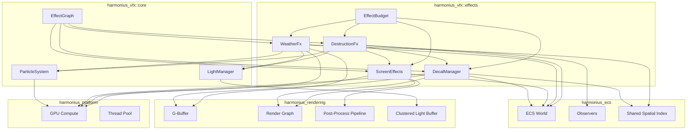
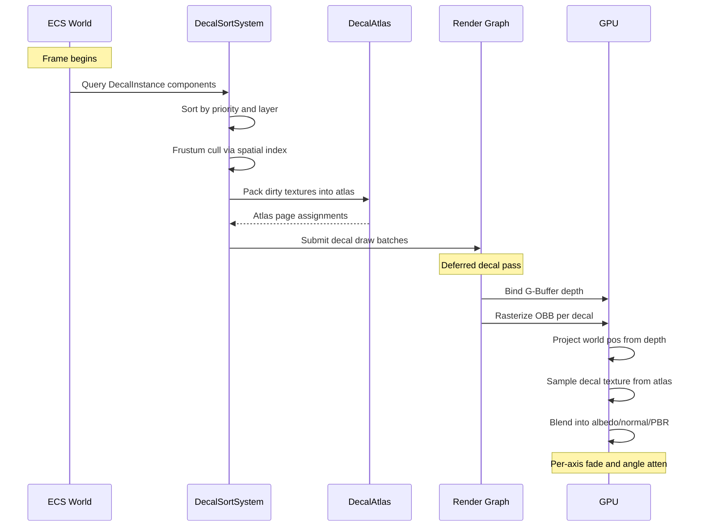
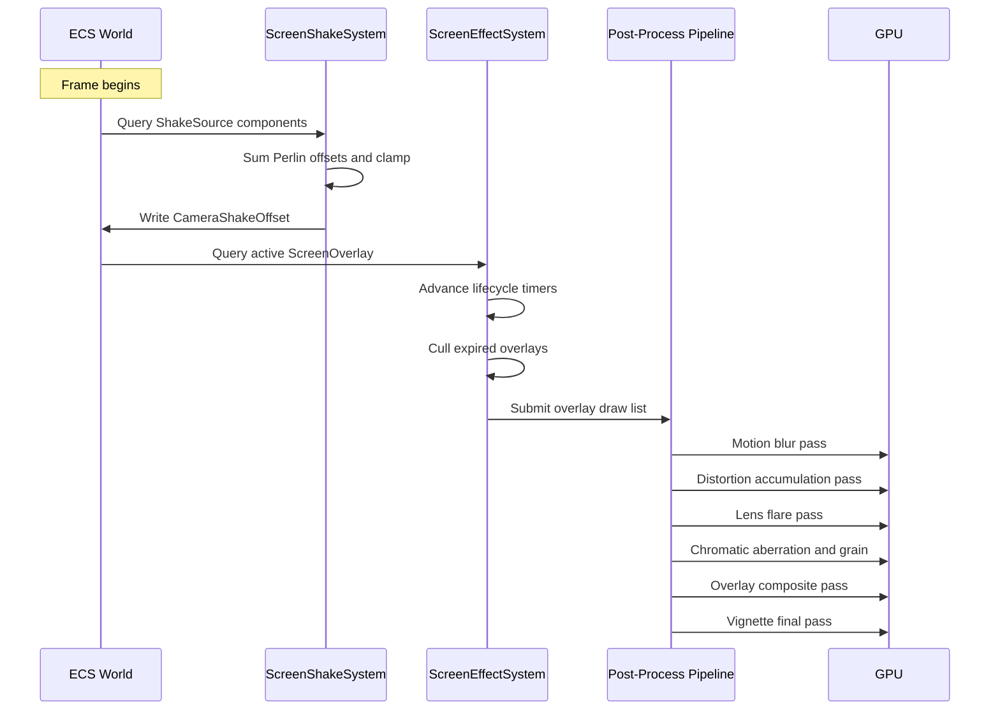
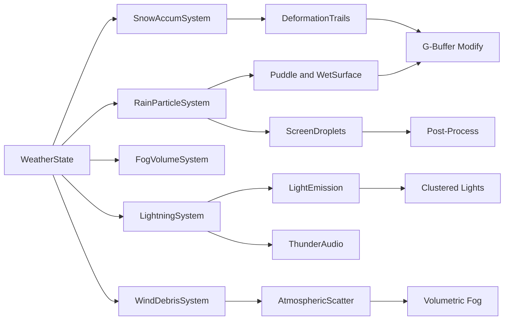
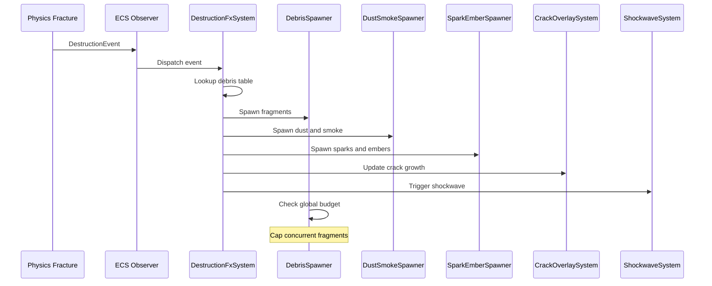
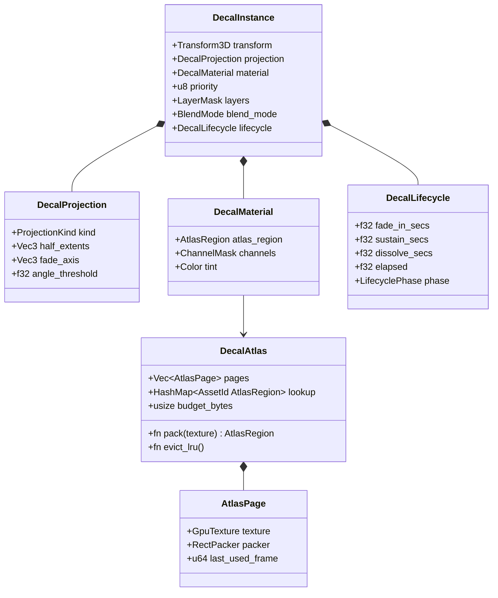
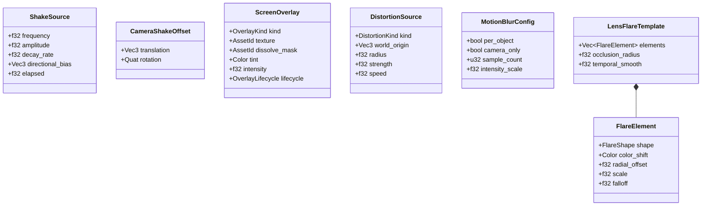
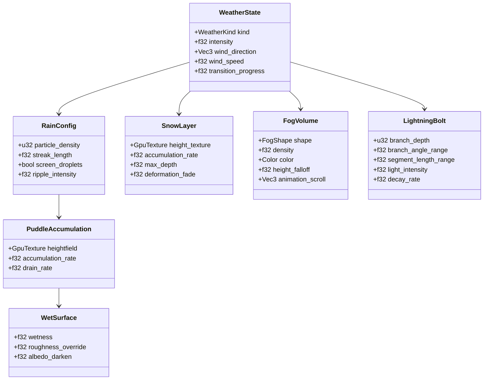
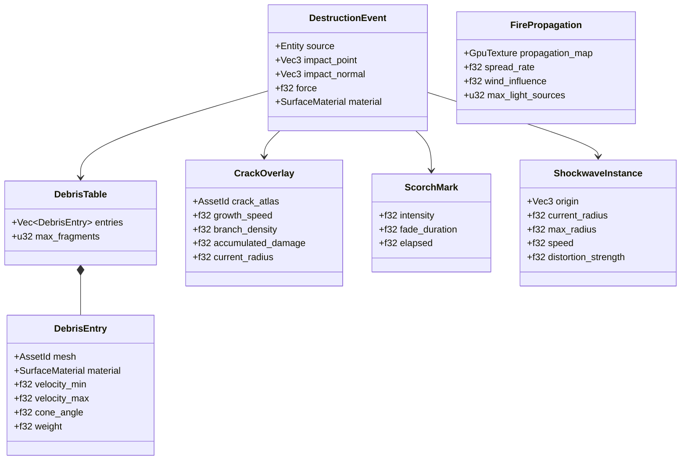

# VFX Effects Design

## Requirements Trace

> **Canonical sources:** Features, requirements, and user stories are defined in
> [features/vfx/](../../features/vfx/), [requirements/vfx/](../../requirements/vfx/), and
> [user-stories/vfx/](../../user-stories/vfx/). The table below traces design elements to those
> definitions.

### Decals (11.2)

| Feature | Requirement | User Story | Description |
|---------|-------------|------------|-------------|
| F-11.2.1 | R-11.2.1 | US-11.2.1.1, US-11.2.1.2, US-11.2.1.3 | Deferred and projected decals with per-channel G-buffer modification |
| F-11.2.2 | R-11.2.2 | US-11.2.2.1, US-11.2.2.2 | Mesh decals with tangent-space normals for persistent markings |
| F-11.2.3 | R-11.2.3 | US-11.2.3.1, US-11.2.3.2 | Runtime decal atlas packing with LRU eviction |
| F-11.2.4 | R-11.2.4 | US-11.2.4.1, US-11.2.4.2, US-11.2.4.3 | Priority layering, blend modes, timed lifecycle |
| F-11.2.5 | R-11.2.5 | US-11.2.5.1, US-11.2.5.2 | Procedural blood and damage decals from hit events |
| F-11.2.6 | R-11.2.6 | US-11.2.6.1, US-11.2.6.2, US-11.2.6.3 | Surface-aware footprints and tire tracks |

### Screen Effects (11.3)

| Feature | Requirement | User Story | Description |
|---------|-------------|------------|-------------|
| F-11.3.1 | R-11.3.1 | US-11.3.1.1, US-11.3.1.2, US-11.3.1.3 | Perlin-noise camera shake with additive layering |
| F-11.3.2 | R-11.3.2 | US-11.3.2.1, US-11.3.2.2 | Per-object and camera motion blur from velocity buffers |
| F-11.3.3 | R-11.3.3 | US-11.3.3.1, US-11.3.3.2, US-11.3.3.3 | Screen-space lens flare with authored templates |
| F-11.3.4 | R-11.3.4 | US-11.3.4.1, US-11.3.4.2 | Chromatic aberration, film grain, and vignette |
| F-11.3.5 | R-11.3.5 | US-11.3.5.1, US-11.3.5.2 | Heat haze and screen-space refraction distortion |
| F-11.3.6 | R-11.3.6 | US-11.3.6.1, US-11.3.6.2, US-11.3.6.3 | Damage overlays and screen flash compositing |

### Weather and Environmental FX (11.4)

| Feature | Requirement | User Story | Description |
|---------|-------------|------------|-------------|
| F-11.4.1 | R-11.4.1 | US-11.4.1.1, US-11.4.1.2, US-11.4.1.3 | Multi-layered rain with screen droplets |
| F-11.4.2 | R-11.4.2 | US-11.4.2.1, US-11.4.2.2, US-11.4.2.3 | Dynamic puddles and material-driven wet surfaces |
| F-11.4.3 | R-11.4.3 | US-11.4.3.1, US-11.4.3.2, US-11.4.3.3 | Vertex-displacement snow with deformation trails |
| F-11.4.4 | R-11.4.4 | US-11.4.4.1, US-11.4.4.2 | Localized volumetric fog volumes |
| F-11.4.5 | R-11.4.5 | US-11.4.5.1, US-11.4.5.2, US-11.4.5.3 | Procedural branching lightning with light emission |
| F-11.4.6 | R-11.4.6 | US-11.4.6.1, US-11.4.6.2, US-11.4.6.3 | Wind-driven debris and dust storm visibility |
| F-11.4.7 | R-11.4.7 | US-11.4.7.1, US-11.4.7.2, US-11.4.7.3 | Underwater caustics, depth fog, and god rays |

### Destruction VFX (11.5)

| Feature | Requirement | User Story | Description |
|---------|-------------|------------|-------------|
| F-11.5.1 | R-11.5.1 | US-11.5.1.1, US-11.5.1.2, US-11.5.1.3 | Event-driven debris spawning with global budget |
| F-11.5.2 | R-11.5.2 | US-11.5.2.1, US-11.5.2.2 | Material-colored dust clouds and wind-driven smoke |
| F-11.5.3 | R-11.5.3 | US-11.5.3.1, US-11.5.3.2, US-11.5.3.3 | Sparks with bounce collision and drifting embers |
| F-11.5.4 | R-11.5.4 | US-11.5.4.1, US-11.5.4.2, US-11.5.4.3 | Animated crack decals from stress propagation |
| F-11.5.5 | R-11.5.5 | US-11.5.5.1, US-11.5.5.2 | Persistent scorch marks modifying G-buffer channels |
| F-11.5.6 | R-11.5.6 | US-11.5.6.1, US-11.5.6.2 | Expanding spherical shockwave distortion |
| F-11.5.7 | R-11.5.7 | US-11.5.7.1, US-11.5.7.2, US-11.5.7.3 | Surface-spreading fire propagation visuals |

## Overview

The VFX Effects module implements four visual effect subsystems -- decals, screen effects, weather,
and destruction VFX -- as pure ECS systems operating on component data. All simulation data lives as
components; all logic runs as systems. No separate VFX world exists.

Each subsystem registers systems that query their respective components, perform simulation on the
CPU or GPU compute, and submit draw commands through the render graph. A shared `EffectBudget`
resource coordinates resource limits across all four subsystems to maintain frame time targets.

Key design principles:

1. **ECS-native.** Every decal, overlay, weather emitter, and destruction effect is an entity with
   components. Systems read and write components only.
2. **GPU-first.** Particle simulation, decal projection, distortion accumulation, and weather
   heightfields run as GPU compute dispatches where applicable.
3. **Budget-aware.** Global budgets cap decal pools, debris fragments, particle counts, and overlay
   counts per platform tier.
4. **Event-driven.** Destruction VFX spawn via ECS observers reacting to physics fracture events.
   Weather transitions are driven by `WeatherState` component changes.
5. **Platform-scaled.** Each subsystem defines mobile, Switch, console, and desktop quality tiers
   with automatic feature fallbacks.

## Architecture

### Module Boundaries



### File Layout

```text
harmonius_vfx/
├── effects/
│   ├── decals/
│   │   ├── components.rs    # DecalInstance,
│   │   │                    # DecalProjection,
│   │   │                    # DecalMaterial,
│   │   │                    # DecalLifecycle
│   │   ├── atlas.rs         # DecalAtlas, AtlasPage,
│   │   │                    # RectPacker, LRU eviction
│   │   ├── systems.rs       # DecalSortSystem,
│   │   │                    # DecalLifecycleSystem,
│   │   │                    # DecalRenderSystem
│   │   └── shaders/
│   │       ├── decal_project.hlsl
│   │       └── decal_blend.hlsl
│   ├── screen/
│   │   ├── components.rs    # ShakeSource,
│   │   │                    # CameraShakeOffset,
│   │   │                    # ScreenOverlay,
│   │   │                    # DistortionSource
│   │   ├── systems.rs       # ShakeSystem,
│   │   │                    # OverlaySystem,
│   │   │                    # DistortionSystem
│   │   └── shaders/
│   │       ├── motion_blur.hlsl
│   │       ├── lens_flare.hlsl
│   │       ├── chromatic_aberration.hlsl
│   │       ├── distortion_accum.hlsl
│   │       └── overlay_composite.hlsl
│   ├── weather/
│   │   ├── components.rs    # WeatherState,
│   │   │                    # RainConfig,
│   │   │                    # PuddleAccumulation,
│   │   │                    # WetSurface, SnowLayer,
│   │   │                    # FogVolume,
│   │   │                    # LightningBolt
│   │   ├── systems.rs       # RainSystem,
│   │   │                    # PuddleSystem,
│   │   │                    # SnowSystem,
│   │   │                    # FogVolumeSystem,
│   │   │                    # LightningSystem,
│   │   │                    # WindDebrisSystem,
│   │   │                    # UnderwaterSystem
│   │   └── shaders/
│   │       ├── rain_streak.hlsl
│   │       ├── screen_droplet.hlsl
│   │       ├── puddle_accumulate.hlsl
│   │       ├── wet_surface.hlsl
│   │       ├── snow_displace.hlsl
│   │       ├── snow_deform.hlsl
│   │       ├── fog_volume_inject.hlsl
│   │       ├── lightning_bolt.hlsl
│   │       ├── caustic_project.hlsl
│   │       └── underwater_fog.hlsl
│   ├── destruction/
│   │   ├── components.rs    # DestructionEvent,
│   │   │                    # DebrisTable,
│   │   │                    # CrackOverlay,
│   │   │                    # ScorchMark,
│   │   │                    # FirePropagation,
│   │   │                    # ShockwaveInstance
│   │   ├── systems.rs       # DebrisSpawnSystem,
│   │   │                    # DustSmokeSystem,
│   │   │                    # SparkEmberSystem,
│   │   │                    # CrackGrowthSystem,
│   │   │                    # ShockwaveSystem,
│   │   │                    # FireSpreadSystem
│   │   └── shaders/
│   │       ├── crack_grow.hlsl
│   │       ├── fire_propagate.hlsl
│   │       └── shockwave_distort.hlsl
│   └── budget.rs            # EffectBudget,
│                             # PlatformTier
```

### Decal Rendering Pipeline



### Screen Effects Pipeline



### Weather FX Data Flow



### Destruction VFX Event Flow



### Decal Data Model



### Screen Effects Data Model



### Weather Data Model



### Destruction Data Model



## API Design

### Shared Types

```rust
/// Surface material identifier used by decals,
/// weather, and destruction to select appropriate
/// visual responses.
#[derive(
    Clone, Copy, Debug, PartialEq, Eq, Hash,
    Reflect,
)]
pub enum SurfaceMaterial {
    Stone,
    Metal,
    Wood,
    Dirt,
    Sand,
    Snow,
    Water,
    Glass,
    Concrete,
    Vegetation,
}

/// Bitmask selecting which G-buffer channels a
/// decal modifies.
#[derive(
    Clone, Copy, Debug, PartialEq, Eq, Reflect,
)]
pub struct ChannelMask {
    pub albedo: bool,
    pub normal: bool,
    pub roughness: bool,
    pub metallic: bool,
}

impl ChannelMask {
    pub const ALL: Self = Self {
        albedo: true,
        normal: true,
        roughness: true,
        metallic: true,
    };

    pub const ALBEDO_ONLY: Self = Self {
        albedo: true,
        normal: false,
        roughness: false,
        metallic: false,
    };
}

/// Platform quality tier controlling budgets,
/// feature sets, and resolution scales.
#[derive(
    Clone, Copy, Debug, PartialEq, Eq, Reflect,
)]
pub enum PlatformTier {
    Mobile,
    Switch,
    Console,
    Desktop,
}
```

**Note:** This `PlatformTier` enum uses `Console` instead of the canonical `HighEnd` variant. During
implementation, replace with the canonical `PlatformTier` from
[shared-primitives.md](../core-runtime/shared-primitives.md) which defines
`Mobile, Switch, Desktop, HighEnd`.

```rust
/// Blend mode for decal compositing.
#[derive(
    Clone, Copy, Debug, PartialEq, Eq, Reflect,
)]
pub enum BlendMode {
    Alpha,
    Multiply,
    Additive,
}

/// Layer mask for decal stacking resolution.
#[derive(
    Clone, Copy, Debug, PartialEq, Eq, Reflect,
)]
pub struct LayerMask(pub u32);

impl LayerMask {
    pub const DEFAULT: Self = Self(0x0000_0001);
    pub const BLOOD: Self = Self(0x0000_0002);
    pub const SCORCH: Self = Self(0x0000_0004);
    pub const FOOTPRINT: Self = Self(0x0000_0008);
    pub const CRACK: Self = Self(0x0000_0010);
    pub const ALL: Self = Self(0xFFFF_FFFF);
}
```

### Effect Budget

```rust
/// Global effect budget enforcing per-platform
/// resource limits across all VFX subsystems.
/// Lives as an ECS resource.
pub struct EffectBudget {
    tier: PlatformTier,
    decal_pool_max: u32,
    decal_pool_active: u32,
    debris_budget_max: u32,
    debris_budget_active: u32,
    overlay_max: u32,
    overlay_active: u32,
    shockwave_max: u32,
    shockwave_active: u32,
    fire_light_max: u32,
    fire_light_active: u32,
}

impl EffectBudget {
    /// Create a budget configured for the given
    /// platform tier.
    pub fn new(tier: PlatformTier) -> Self;

    /// Try to allocate a decal slot. Returns
    /// false if the pool is exhausted.
    pub fn try_alloc_decal(&mut self) -> bool;

    /// Release a decal slot.
    pub fn release_decal(&mut self);

    /// Try to allocate debris fragment slots.
    pub fn try_alloc_debris(
        &mut self,
        count: u32,
    ) -> u32;

    /// Release debris fragment slots.
    pub fn release_debris(&mut self, count: u32);

    /// Try to allocate an overlay slot.
    pub fn try_alloc_overlay(&mut self) -> bool;

    /// Release an overlay slot.
    pub fn release_overlay(&mut self);

    /// Try to allocate a shockwave slot.
    pub fn try_alloc_shockwave(
        &mut self,
    ) -> bool;

    /// Release a shockwave slot.
    pub fn release_shockwave(&mut self);

    /// Try to allocate a fire light source.
    pub fn try_alloc_fire_light(
        &mut self,
    ) -> bool;

    /// Release a fire light source.
    pub fn release_fire_light(&mut self);

    /// Current utilization as fraction [0, 1]
    /// for each resource type.
    pub fn utilization(&self) -> BudgetReport;
}

/// Per-platform budget defaults.
///
/// | Resource | Mobile | Switch | Console | Desktop |
/// |----------|--------|--------|---------|---------|
/// | Decal pool | 64 | 128 | 256 | 256 |
/// | Debris budget | 32 | 64 | 128 | 256 |
/// | Overlay max | 2 | 3 | 4 | 4 |
/// | Shockwave max | 1 | 2 | 4 | 4 |
/// | Fire light max | 2 | 4 | 8 | 16 |

pub struct BudgetReport {
    pub decals: f32,
    pub debris: f32,
    pub overlays: f32,
    pub shockwaves: f32,
    pub fire_lights: f32,
}
```

### Decal Components

```rust
/// Decal projection method.
#[derive(
    Clone, Copy, Debug, PartialEq, Eq, Reflect,
)]
pub enum ProjectionKind {
    /// Screen-space deferred box projection.
    Deferred,
    /// Triplanar projection for complex
    /// geometry intersections.
    Triplanar,
    /// Baked geometry-based mesh decal.
    Mesh,
}

/// Lifecycle phase of a decal.
#[derive(
    Clone, Copy, Debug, PartialEq, Eq, Reflect,
)]
pub enum LifecyclePhase {
    FadeIn,
    Sustain,
    Dissolve,
    Expired,
}

/// Decal projection parameters. Attached as a
/// component to decal entities.
#[derive(Clone, Debug, Reflect)]
pub struct DecalProjection {
    /// Projection method.
    pub kind: ProjectionKind,
    /// Half-extents of the projection OBB.
    pub half_extents: Vec3,
    /// Per-axis fade distances (0 = no fade,
    /// 1 = full extent fade).
    pub fade_axis: Vec3,
    /// Angle threshold in radians. Surfaces
    /// beyond this angle from the decal normal
    /// are attenuated to zero.
    pub angle_threshold: f32,
}

/// Decal material referencing an atlas region.
#[derive(Clone, Debug, Reflect)]
pub struct DecalMaterial {
    /// Region within the decal texture atlas.
    pub atlas_region: AtlasRegion,
    /// Which G-buffer channels this decal
    /// modifies.
    pub channels: ChannelMask,
    /// Color tint applied to the decal texture.
    pub tint: Color,
    /// Dissolve noise texture for lifecycle
    /// breakup.
    pub dissolve_noise: Option<AssetId>,
}

/// Time-based decal lifecycle.
#[derive(Clone, Debug, Reflect)]
pub struct DecalLifecycle {
    /// Duration of the fade-in phase in seconds.
    pub fade_in_secs: f32,
    /// Duration of the sustain phase in seconds.
    /// Use `f32::INFINITY` for permanent decals.
    pub sustain_secs: f32,
    /// Duration of the dissolve-out phase.
    pub dissolve_secs: f32,
    /// Accumulated elapsed time.
    pub elapsed: f32,
    /// Current lifecycle phase.
    pub phase: LifecyclePhase,
}

impl DecalLifecycle {
    /// Permanent decal that never fades.
    pub fn permanent() -> Self {
        Self {
            fade_in_secs: 0.0,
            sustain_secs: f32::INFINITY,
            dissolve_secs: 0.0,
            elapsed: 0.0,
            phase: LifecyclePhase::Sustain,
        }
    }

    /// Timed decal with configurable phases.
    pub fn timed(
        fade_in: f32,
        sustain: f32,
        dissolve: f32,
    ) -> Self {
        Self {
            fade_in_secs: fade_in,
            sustain_secs: sustain,
            dissolve_secs: dissolve,
            elapsed: 0.0,
            phase: LifecyclePhase::FadeIn,
        }
    }

    /// Advance the lifecycle by `dt` seconds.
    /// Returns the current opacity [0, 1].
    pub fn advance(&mut self, dt: f32) -> f32;
}

/// Full decal entity. Created by attaching all
/// decal components to an entity.
///
/// Required components on a decal entity:
/// - `Transform3D`
/// - `DecalProjection`
/// - `DecalMaterial`
/// - `DecalLifecycle`
/// - Priority: `u8`
/// - `LayerMask`
/// - `BlendMode`
#[derive(Clone, Debug, Reflect)]
pub struct DecalInstance {
    pub priority: u8,
    pub layers: LayerMask,
    pub blend_mode: BlendMode,
}
```

### Decal Atlas

```rust
/// A rectangular region within an atlas page.
#[derive(Clone, Copy, Debug, Reflect)]
pub struct AtlasRegion {
    pub page_index: u16,
    pub x: u16,
    pub y: u16,
    pub width: u16,
    pub height: u16,
}

/// A single page in the decal texture atlas.
pub struct AtlasPage {
    /// GPU texture handle for this page.
    pub texture: GpuTexture,
    /// Rectangle packer tracking free space.
    packer: RectPacker,
    /// Frame number when last accessed (for LRU).
    last_used_frame: u64,
}

/// Runtime decal texture atlas. Lives as an ECS
/// resource. Packs decal textures into shared
/// GPU atlas pages and evicts least-recently-used
/// entries under memory pressure.
pub struct DecalAtlas {
    pages: Vec<AtlasPage>,
    lookup: HashMap<AssetId, AtlasRegion>,
    budget_bytes: usize,
    current_bytes: usize,
    page_size: u32,
}

impl DecalAtlas {
    /// Create an atlas with the given budget.
    /// `page_size` is per-platform: 1024 on
    /// mobile, 2048 on desktop.
    pub fn new(
        budget_bytes: usize,
        page_size: u32,
    ) -> Self;

    /// Pack a texture into the atlas. Returns
    /// the region. May evict LRU entries if
    /// space is insufficient.
    pub fn pack(
        &mut self,
        id: AssetId,
        width: u32,
        height: u32,
        data: &[u8],
        frame: u64,
    ) -> Result<AtlasRegion, AtlasError>;

    /// Look up an existing region.
    pub fn get(
        &self,
        id: &AssetId,
    ) -> Option<AtlasRegion>;

    /// Touch a region to update LRU timestamp.
    pub fn touch(
        &mut self,
        id: &AssetId,
        frame: u64,
    );

    /// Evict least-recently-used entries until
    /// `bytes_needed` are freed.
    fn evict_lru(
        &mut self,
        bytes_needed: usize,
    );

    /// Number of active atlas pages.
    pub fn page_count(&self) -> usize;

    /// Total bytes currently used.
    pub fn used_bytes(&self) -> usize;
}

pub enum AtlasError {
    /// Texture exceeds maximum atlas page size.
    TextureTooLarge {
        width: u32,
        height: u32,
    },
    /// Cannot free enough space even after full
    /// eviction.
    BudgetExhausted,
}
```

### Decal Systems

```rust
/// Advances decal lifecycle timers and despawns
/// expired decals. Runs every frame.
pub fn decal_lifecycle_system(
    mut commands: Commands,
    time: Res<Time>,
    mut budget: ResMut<EffectBudget>,
    mut query: Query<(
        Entity,
        &mut DecalLifecycle,
    )>,
) {
    let dt = time.delta_secs();
    for (entity, mut lifecycle) in &mut query {
        let opacity = lifecycle.advance(dt);
        if lifecycle.phase == LifecyclePhase::Expired
        {
            commands.entity(entity).despawn();
            budget.release_decal();
        }
    }
}

/// Sorts visible decals by priority and layer,
/// frustum-culls against the shared spatial
/// index, batches by atlas page, and submits
/// indirect draw commands to the render graph.
pub fn decal_render_system(
    spatial_index: Res<SpatialIndex>,
    atlas: Res<DecalAtlas>,
    camera: Res<ActiveCamera>,
    mut render_graph: ResMut<RenderGraph>,
    query: Query<(
        &Transform3D,
        &DecalInstance,
        &DecalProjection,
        &DecalMaterial,
        &DecalLifecycle,
    )>,
) {
    // 1. Frustum cull decal OBBs via spatial
    //    index.
    // 2. Sort survivors by (layer, priority,
    //    atlas_page) for minimal state changes.
    // 3. Group by atlas page for batched indirect
    //    draw.
    // 4. For each batch:
    //    a. Bind atlas page texture.
    //    b. Upload per-decal data (transform,
    //       region, channels, opacity, blend).
    //    c. Submit indirect draw of OBB geometry.
    // 5. GPU shader reconstructs world position
    //    from G-buffer depth, projects into decal
    //    space, samples atlas, and blends into
    //    selected G-buffer channels.
}

/// Reclaims oldest low-priority decals when the
/// global pool is exhausted. Called before
/// spawning new decals.
pub fn decal_pool_reclaim_system(
    mut commands: Commands,
    budget: Res<EffectBudget>,
    query: Query<(
        Entity,
        &DecalInstance,
        &DecalLifecycle,
    )>,
) {
    // If pool > 90% full, sort active decals by
    // (priority ASC, elapsed DESC) and despawn
    // the bottom 10%.
}
```

### Screen Effect Components

```rust
/// Camera shake uses a shared `CameraShake`
/// component. The accessibility system (see
/// [accessibility.md](../ui/accessibility.md))
/// can disable or reduce shake intensity via the
/// `ReducedMotion` preference.
///
/// Camera shake event source. Attach to any
/// entity that triggers shake (explosion,
/// impact, spell).
#[derive(Clone, Debug, Reflect)]
pub struct ShakeSource {
    /// Perlin noise frequency in Hz.
    pub frequency: f32,
    /// Maximum displacement amplitude in world
    /// units.
    pub amplitude: f32,
    /// Exponential decay rate. Amplitude
    /// multiplied by e^(-decay * elapsed).
    pub decay_rate: f32,
    /// Directional bias [0, 1] per axis. (1,1,1)
    /// = omnidirectional, (1,0,0) = horizontal.
    pub directional_bias: Vec3,
    /// Whether to apply rotational shake.
    pub rotational: bool,
    /// Accumulated time since trigger.
    pub elapsed: f32,
}

/// Computed camera offset from all active shake
/// sources. Written by ShakeSystem, read by the
/// camera system. Single resource, not
/// per-entity.
#[derive(Clone, Debug, Default, Reflect)]
pub struct CameraShakeOffset {
    pub translation: Vec3,
    pub rotation: Quat,
}

/// Kind of screen overlay effect.
#[derive(
    Clone, Copy, Debug, PartialEq, Eq, Reflect,
)]
pub enum OverlayKind {
    /// Full-screen blood spatter.
    BloodSpatter,
    /// Directional damage flash.
    DamageFlash,
    /// Frost/ice screen effect.
    Frost,
    /// Cracked glass overlay.
    CrackedGlass,
    /// Corruption/poison effect.
    Corruption,
    /// Healing flash.
    HealFlash,
    /// Custom (artist-defined).
    Custom,
}

/// Lifecycle timing for screen overlays.
#[derive(Clone, Debug, Reflect)]
pub struct OverlayLifecycle {
    pub fade_in_secs: f32,
    pub sustain_secs: f32,
    pub fade_out_secs: f32,
    pub elapsed: f32,
    pub phase: LifecyclePhase,
}

impl OverlayLifecycle {
    pub fn advance(&mut self, dt: f32) -> f32;
}

/// Screen-space overlay component.
#[derive(Clone, Debug, Reflect)]
pub struct ScreenOverlay {
    pub kind: OverlayKind,
    /// Overlay texture asset.
    pub texture: AssetId,
    /// Dissolve mask for animated fade-out.
    pub dissolve_mask: Option<AssetId>,
    /// Color tint.
    pub tint: Color,
    /// Current intensity [0, 1].
    pub intensity: f32,
    /// Direction for directional overlays
    /// (screen-space angle in radians).
    pub direction: Option<f32>,
    /// Lifecycle timing.
    pub lifecycle: OverlayLifecycle,
}

/// Screen-space distortion source.
#[derive(
    Clone, Copy, Debug, PartialEq, Reflect,
)]
pub enum DistortionKind {
    /// Heat shimmer from a world-space emitter.
    HeatHaze,
    /// Expanding spherical shockwave.
    Shockwave,
    /// Portal/magical refraction.
    Portal,
}

/// Distortion source component. Attach to any
/// entity emitting screen-space distortion.
#[derive(Clone, Debug, Reflect)]
pub struct DistortionSource {
    pub kind: DistortionKind,
    /// World-space origin of the distortion.
    pub world_origin: Vec3,
    /// Maximum radius in world units.
    pub radius: f32,
    /// Distortion strength in pixels at max.
    pub strength: f32,
    /// Animation speed multiplier.
    pub speed: f32,
    /// Normal map for scrolling distortion
    /// (heat haze, portal).
    pub normal_map: Option<AssetId>,
    /// Elapsed time for animation.
    pub elapsed: f32,
}

/// Per-camera motion blur configuration.
/// Attached as a component to camera entities.
#[derive(Clone, Debug, Reflect)]
pub struct MotionBlurConfig {
    /// Enable per-object motion blur.
    pub per_object: bool,
    /// Enable camera motion blur.
    pub camera_blur: bool,
    /// Number of velocity samples per pixel.
    pub sample_count: u32,
    /// Intensity multiplier. Internally scaled
    /// by frame rate for consistent blur width.
    pub intensity_scale: f32,
}

/// Lens flare element shape.
#[derive(
    Clone, Copy, Debug, PartialEq, Eq, Reflect,
)]
pub enum FlareShape {
    Circle,
    Hexagon,
    Starburst,
    Ring,
}

/// A single element in a lens flare template.
#[derive(Clone, Debug, Reflect)]
pub struct FlareElement {
    pub shape: FlareShape,
    pub color_shift: Color,
    /// Radial offset from center [0 = center,
    /// 1 = edge, >1 = beyond screen].
    pub radial_offset: f32,
    pub scale: f32,
    pub falloff: f32,
}

/// Lens flare template. Attached to light source
/// entities that produce flares.
#[derive(Clone, Debug, Reflect)]
pub struct LensFlareTemplate {
    pub elements: Vec<FlareElement>,
    /// Depth query radius for occlusion test.
    pub occlusion_radius: f32,
    /// Temporal smoothing factor [0, 1] to
    /// prevent popping on partial occlusion.
    pub temporal_smooth: f32,
}

/// Chromatic aberration and film grain config.
/// Single resource, not per-entity.
#[derive(Clone, Debug, Reflect)]
pub struct PostProcessConfig {
    /// Chromatic aberration intensity [0, 1].
    pub chromatic_aberration: f32,
    /// Maximum pixel offset for CA at screen
    /// edges.
    pub ca_max_offset: f32,
    /// Film grain intensity [0, 1].
    pub film_grain: f32,
    /// Vignette intensity [0, 1].
    pub vignette: f32,
    /// Vignette falloff radius [0, 1].
    pub vignette_radius: f32,
}

/// Accessibility settings affecting screen
/// effects. Single resource.
#[derive(Clone, Debug, Reflect)]
pub struct AccessibilityConfig {
    /// Reduced motion: attenuates or disables
    /// screen shake and motion blur.
    pub reduced_motion: bool,
    /// Shake amplitude multiplier when reduced
    /// motion is on. Default: 0.0 (disabled).
    pub shake_attenuation: f32,
}
```

### Screen Effect Systems

```rust
/// Computes the aggregate camera shake offset
/// from all active ShakeSource components.
pub fn shake_system(
    time: Res<Time>,
    accessibility: Res<AccessibilityConfig>,
    mut offset: ResMut<CameraShakeOffset>,
    mut query: Query<(
        Entity,
        &mut ShakeSource,
    )>,
    mut commands: Commands,
) {
    let dt = time.delta_secs();
    let mut total_translation = Vec3::ZERO;
    let mut total_rotation = Quat::IDENTITY;

    for (entity, mut shake) in &mut query {
        shake.elapsed += dt;
        let decay =
            (-shake.decay_rate * shake.elapsed)
                .exp();
        if decay < 0.001 {
            commands.entity(entity).despawn();
            continue;
        }
        let amp = shake.amplitude * decay;

        // Perlin noise sampled at
        // (elapsed * frequency) per axis.
        let noise_x = perlin_1d(
            shake.elapsed * shake.frequency,
            0,
        );
        let noise_y = perlin_1d(
            shake.elapsed * shake.frequency,
            1,
        );
        let noise_z = perlin_1d(
            shake.elapsed * shake.frequency,
            2,
        );

        total_translation += Vec3::new(
            noise_x * amp
                * shake.directional_bias.x,
            noise_y * amp
                * shake.directional_bias.y,
            noise_z * amp
                * shake.directional_bias.z,
        );

        if shake.rotational {
            // Small-angle rotational shake.
            let roll = perlin_1d(
                shake.elapsed * shake.frequency,
                3,
            ) * amp * 0.01;
            total_rotation *= Quat::from_euler(
                EulerRot::XYZ,
                0.0,
                0.0,
                roll,
            );
        }
    }

    // Clamp total amplitude to prevent nausea.
    let max_amp = 0.5; // world units
    let len = total_translation.length();
    if len > max_amp {
        total_translation *=
            max_amp / len;
    }

    // Apply accessibility attenuation.
    if accessibility.reduced_motion {
        total_translation *=
            accessibility.shake_attenuation;
        total_rotation = Quat::slerp(
            Quat::IDENTITY,
            total_rotation,
            accessibility.shake_attenuation,
        );
    }

    offset.translation = total_translation;
    offset.rotation = total_rotation;
}

/// Advances overlay lifecycles, despawns
/// expired overlays, and submits draw commands
/// for the overlay composite pass.
pub fn overlay_system(
    time: Res<Time>,
    mut budget: ResMut<EffectBudget>,
    mut commands: Commands,
    mut render_graph: ResMut<RenderGraph>,
    mut query: Query<(
        Entity,
        &mut ScreenOverlay,
    )>,
) {
    let dt = time.delta_secs();
    // Collect active overlays sorted by kind.
    // Advance lifecycle. Despawn expired.
    // Submit composite draw: each overlay is a
    // full-screen quad sampling its texture with
    // dissolve mask and tint, blended additively
    // at clamped total opacity.
}

/// Accumulates distortion vectors from all
/// active DistortionSource components into a
/// half-resolution distortion buffer.
pub fn distortion_system(
    time: Res<Time>,
    camera: Res<ActiveCamera>,
    mut render_graph: ResMut<RenderGraph>,
    query: Query<&DistortionSource>,
) {
    // For each source, project world_origin to
    // screen space. Write distortion vectors
    // into half-res buffer. Heat haze uses
    // scrolling normal map UVs. Shockwave uses
    // radial ring displacement. Portal uses
    // normal map with wobble animation.
    //
    // The post-process pipeline samples this
    // buffer to displace the final color buffer.
}

/// Generates lens flare geometry for bright
/// light sources. Runs in the post-process
/// pipeline.
pub fn lens_flare_system(
    camera: Res<ActiveCamera>,
    mut render_graph: ResMut<RenderGraph>,
    query: Query<(
        &Transform3D,
        &LensFlareTemplate,
        &LightComponent,
    )>,
) {
    // For each light with a flare template:
    // 1. Project light position to screen space.
    // 2. Depth-query occlusion with temporal
    //    smoothing.
    // 3. For each FlareElement, compute screen
    //    position along the flare axis.
    // 4. Submit billboard quads with element
    //    shape, color_shift, and falloff.
}
```

### Weather Components

```rust
/// Global weather kind.
#[derive(
    Clone, Copy, Debug, PartialEq, Eq, Reflect,
)]
pub enum WeatherKind {
    Clear,
    Rain,
    Snow,
    Fog,
    DustStorm,
    Thunderstorm,
}

/// Global weather state. Single ECS resource
/// driving all weather subsystems.
#[derive(Clone, Debug, Reflect)]
pub struct WeatherState {
    pub kind: WeatherKind,
    /// Intensity [0, 1]. 0 = clear, 1 = max.
    pub intensity: f32,
    /// Global wind direction (normalized XZ).
    pub wind_direction: Vec3,
    /// Wind speed in m/s.
    pub wind_speed: f32,
    /// Transition blend [0, 1] when
    /// interpolating between weather states.
    pub transition_progress: f32,
    /// Previous weather kind for blending.
    pub previous_kind: WeatherKind,
}

/// Rain configuration. ECS resource.
#[derive(Clone, Debug, Reflect)]
pub struct RainConfig {
    /// Particle count per frame at intensity 1.
    pub particle_density: u32,
    /// Rain streak length in world units.
    pub streak_length: f32,
    /// Enable screen-space droplet simulation.
    pub screen_droplets: bool,
    /// Ripple normal intensity on wet surfaces.
    pub ripple_intensity: f32,
    /// Ripple normal resolution scale [0, 1].
    pub ripple_resolution_scale: f32,
}

/// Per-entity puddle accumulation state.
#[derive(Clone, Debug, Reflect)]
pub struct PuddleAccumulation {
    /// GPU heightfield texture tracking water
    /// depth per texel.
    pub heightfield: GpuTexture,
    /// Accumulation rate in depth-units per
    /// second at intensity 1.
    pub accumulation_rate: f32,
    /// Drain rate after rain stops.
    pub drain_rate: f32,
    /// Current average depth.
    pub current_depth: f32,
}

/// Per-material wet surface response. Attached
/// to terrain/mesh entities during rain.
#[derive(Clone, Debug, Reflect)]
pub struct WetSurface {
    /// Wetness factor [0, 1].
    pub wetness: f32,
    /// Roughness override (lerped toward 0 for
    /// mirror-smooth).
    pub roughness_override: f32,
    /// Albedo darkening factor.
    pub albedo_darken: f32,
    /// Surface material controlling response
    /// curve.
    pub material: SurfaceMaterial,
}

/// Snow accumulation layer. Attached to terrain
/// entities in snowy zones.
#[derive(Clone, Debug, Reflect)]
pub struct SnowLayer {
    /// World-space height texture storing snow
    /// depth per texel.
    pub height_texture: GpuTexture,
    /// Accumulation rate in world units per
    /// second at intensity 1.
    pub accumulation_rate: f32,
    /// Maximum snow depth in world units.
    pub max_depth: f32,
    /// Deformation trail fade rate under
    /// continued snowfall.
    pub deformation_fade: f32,
    /// Height texture resolution.
    pub resolution: u32,
}

/// Fog shape for localized fog volumes.
#[derive(
    Clone, Copy, Debug, PartialEq, Eq, Reflect,
)]
pub enum FogShape {
    OrientedBox,
    ConvexHull,
}

/// Localized volumetric fog volume. Attached to
/// fog volume entities.
#[derive(Clone, Debug, Reflect)]
pub struct FogVolume {
    pub shape: FogShape,
    /// Fog density [0, 1].
    pub density: f32,
    /// Fog color.
    pub color: Color,
    /// Height falloff exponent. Higher values
    /// concentrate fog near the volume floor.
    pub height_falloff: f32,
    /// Scrolling animation velocity for
    /// animated fog.
    pub animation_scroll: Vec3,
}

/// Lightning bolt configuration. Spawned as
/// entities during thunderstorms.
#[derive(Clone, Debug, Reflect)]
pub struct LightningBolt {
    /// Maximum branching recursion depth.
    pub branch_depth: u32,
    /// Branching angle range in radians.
    pub branch_angle_range: f32,
    /// Segment length range (min, max) in
    /// world units.
    pub segment_length_range: (f32, f32),
    /// Light burst intensity.
    pub light_intensity: f32,
    /// Exponential decay rate for light.
    pub decay_rate: f32,
    /// Elapsed time since bolt fired.
    pub elapsed: f32,
    /// World-space origin point.
    pub origin: Vec3,
    /// World-space strike point.
    pub strike_point: Vec3,
}

/// Underwater effect configuration. Applied
/// when the camera is submerged.
#[derive(Clone, Debug, Reflect)]
pub struct UnderwaterConfig {
    /// Caustic light pattern texture.
    pub caustic_texture: AssetId,
    /// Caustic animation speed.
    pub caustic_speed: f32,
    /// Depth fog absorption coefficients
    /// per RGB channel.
    pub absorption: Vec3,
    /// Bubble particle spawn rate.
    pub bubble_rate: u32,
    /// Enable screen-space god rays.
    pub god_rays: bool,
    /// God ray intensity.
    pub god_ray_intensity: f32,
}
```

### Weather Systems

```rust
/// Rain particle system. Spawns GPU particle
/// streaks and drives screen droplet simulation.
pub fn rain_system(
    weather: Res<WeatherState>,
    rain_config: Res<RainConfig>,
    tier: Res<PlatformTier>,
    mut particle_system: ResMut<ParticleSystem>,
    mut render_graph: ResMut<RenderGraph>,
) {
    if weather.kind != WeatherKind::Rain
        && weather.kind
            != WeatherKind::Thunderstorm
    {
        return;
    }
    let density = rain_config.particle_density
        as f32
        * weather.intensity;

    // Scale density by platform tier.
    let tier_scale = match *tier {
        PlatformTier::Mobile => 0.25,
        PlatformTier::Switch => 0.5,
        _ => 1.0,
    };
    let final_density =
        (density * tier_scale) as u32;

    // Spawn GPU particle streaks via compute.
    // Screen droplets: skip on mobile.
    // Ripple normals: half-res on mobile.
}

/// Puddle accumulation and drainage. Updates
/// the heightfield GPU texture via compute.
pub fn puddle_system(
    weather: Res<WeatherState>,
    time: Res<Time>,
    mut query: Query<&mut PuddleAccumulation>,
) {
    let dt = time.delta_secs();
    let raining = weather.kind
        == WeatherKind::Rain
        || weather.kind
            == WeatherKind::Thunderstorm;

    for mut puddle in &mut query {
        if raining {
            puddle.current_depth +=
                puddle.accumulation_rate
                    * weather.intensity
                    * dt;
        } else {
            puddle.current_depth -=
                puddle.drain_rate * dt;
            puddle.current_depth =
                puddle.current_depth.max(0.0);
        }
        // Dispatch compute shader to update
        // heightfield from terrain concavity
        // and current_depth.
    }
}

/// Wet surface material modification. Lerps
/// roughness and albedo based on wetness.
pub fn wet_surface_system(
    weather: Res<WeatherState>,
    time: Res<Time>,
    tier: Res<PlatformTier>,
    mut query: Query<&mut WetSurface>,
) {
    let dt = time.delta_secs();
    let raining = weather.kind
        == WeatherKind::Rain
        || weather.kind
            == WeatherKind::Thunderstorm;

    for mut wet in &mut query {
        if raining {
            wet.wetness = (wet.wetness
                + weather.intensity * dt * 0.5)
                .min(1.0);
        } else {
            wet.wetness =
                (wet.wetness - dt * 0.1)
                    .max(0.0);
        }

        // Material response by surface type.
        wet.roughness_override = match wet.material
        {
            SurfaceMaterial::Stone => {
                1.0 - wet.wetness * 0.8
            }
            SurfaceMaterial::Metal => {
                1.0 - wet.wetness * 0.95
            }
            _ => 1.0 - wet.wetness * 0.5,
        };

        wet.albedo_darken = match wet.material {
            SurfaceMaterial::Stone => {
                wet.wetness * 0.3
            }
            SurfaceMaterial::Dirt => {
                wet.wetness * 0.4
            }
            _ => wet.wetness * 0.15,
        };

        // Mobile: albedo darken only, skip
        // roughness.
        if *tier == PlatformTier::Mobile {
            wet.roughness_override = 1.0;
        }
    }
}

/// Snow accumulation and deformation. Updates
/// snow height texture and processes deformation
/// stamps from character/vehicle movement.
pub fn snow_system(
    weather: Res<WeatherState>,
    time: Res<Time>,
    tier: Res<PlatformTier>,
    mut snow_query: Query<&mut SnowLayer>,
    deformer_query: Query<(
        &Transform3D,
        &FootprintStamper,
    )>,
) {
    let dt = time.delta_secs();
    let snowing =
        weather.kind == WeatherKind::Snow;

    for mut snow in &mut snow_query {
        if snowing {
            // Accumulate: dispatch compute to
            // increment height texture on
            // upward-facing texels.
        }

        // Deformation: for each stamper within
        // range, write depth stamp into height
        // texture. Mobile uses decals instead.

        if snowing {
            // Fade deformation trails under
            // continued snowfall.
        }
    }
}

/// Fog volume injection into the global froxel
/// grid. Mobile falls back to screen-space
/// height fog.
pub fn fog_volume_system(
    tier: Res<PlatformTier>,
    mut render_graph: ResMut<RenderGraph>,
    query: Query<(
        &Transform3D,
        &FogVolume,
    )>,
) {
    if *tier == PlatformTier::Mobile {
        // Screen-space height fog fallback.
        return;
    }
    // For each volume: inject density into
    // froxel grid cells that overlap the
    // volume bounds. Density modulated by
    // height_falloff. Animation_scroll offsets
    // the noise sampling position.
}

/// Lightning bolt generation and rendering.
/// Spawns L-system geometry and emits light.
pub fn lightning_system(
    weather: Res<WeatherState>,
    time: Res<Time>,
    tier: Res<PlatformTier>,
    mut commands: Commands,
    mut query: Query<(
        Entity,
        &mut LightningBolt,
    )>,
) {
    let dt = time.delta_secs();

    for (entity, mut bolt) in &mut query {
        bolt.elapsed += dt;
        let light = bolt.light_intensity
            * (-bolt.decay_rate * bolt.elapsed)
                .exp();

        if light < 0.001 {
            commands.entity(entity).despawn();
            continue;
        }

        // L-system bolt geometry:
        // 1. Start at origin, step toward
        //    strike_point.
        // 2. At each segment, random branch
        //    with probability decreasing by
        //    depth.
        // 3. Branch angle within
        //    branch_angle_range.
        // 4. Max depth: 2 on mobile, 4 desktop.
        // 5. Emit light burst to clustered
        //    light buffer. Mobile: single
        //    directional flash.
    }

    // Stochastic bolt spawning during
    // thunderstorm based on intensity.
    if weather.kind == WeatherKind::Thunderstorm
    {
        let max_bolts = match *tier {
            PlatformTier::Mobile => 1,
            PlatformTier::Switch => 2,
            _ => 4,
        };
        // Spawn bolt entity with random origin
        // and strike point if under cap.
    }
}

/// Wind-driven debris particles and dust storm
/// atmospheric injection.
pub fn wind_debris_system(
    weather: Res<WeatherState>,
    tier: Res<PlatformTier>,
    mut particle_system: ResMut<ParticleSystem>,
    mut render_graph: ResMut<RenderGraph>,
) {
    if weather.wind_speed < 0.1 {
        return;
    }

    let particle_scale = match *tier {
        PlatformTier::Mobile => 0.1,
        PlatformTier::Switch => 0.25,
        _ => 1.0,
    };

    // Spawn leaf, dust, debris particles with
    // velocity sampled from wind vector volume.

    if weather.kind == WeatherKind::DustStorm {
        // Inject scattering density into
        // atmospheric fog.
        // Tint sky toward storm color.
        // Mobile: distance fog only, no
        // volumetric scattering.
    }
}

/// Underwater rendering when camera is
/// submerged. Applies caustics, depth fog,
/// bubbles, refraction, and god rays.
pub fn underwater_system(
    camera: Res<ActiveCamera>,
    config: Res<UnderwaterConfig>,
    tier: Res<PlatformTier>,
    mut render_graph: ResMut<RenderGraph>,
    mut particle_system: ResMut<ParticleSystem>,
) {
    // Check if camera is below water surface.
    // If not submerged, return early.

    // Caustic projection: animated UV offset on
    // submerged geometry. Mobile: skip.
    // Depth fog: exponential with per-channel
    // absorption. Mobile: simplified blue tint.
    // Bubbles: particle stream. Mobile: 25%.
    // Refraction: distortion at water surface
    // boundary.
    // God rays: screen-space radial blur from
    // surface direction. Mobile: skip.
}
```

### Destruction VFX Components

```rust
/// Event emitted by the physics fracture system
/// when an object is destroyed. Consumed by
/// ECS observers to spawn destruction VFX.
#[derive(Clone, Debug, Reflect)]
pub struct DestructionEvent {
    /// Entity that was destroyed.
    pub source: Entity,
    /// World-space impact point.
    pub impact_point: Vec3,
    /// Surface normal at impact.
    pub impact_normal: Vec3,
    /// Impact force magnitude.
    pub force: f32,
    /// Surface material of the destroyed object.
    pub material: SurfaceMaterial,
    /// Velocity of the impacting object.
    pub impact_velocity: Vec3,
}

/// A single entry in a debris table.
#[derive(Clone, Debug, Reflect)]
pub struct DebrisEntry {
    /// Mesh asset for this fragment type.
    pub mesh: AssetId,
    /// Fragment material matching the source.
    pub material: SurfaceMaterial,
    /// Minimum ejection velocity in m/s.
    pub velocity_min: f32,
    /// Maximum ejection velocity in m/s.
    pub velocity_max: f32,
    /// Ejection cone half-angle in radians.
    pub cone_angle: f32,
    /// Selection weight for randomization.
    pub weight: f32,
}

/// Per-object debris configuration. Attached to
/// destructible entities.
#[derive(Clone, Debug, Reflect)]
pub struct DebrisTable {
    pub entries: Vec<DebrisEntry>,
    /// Maximum fragments this object can spawn.
    pub max_fragments: u32,
}

/// Animated crack overlay tracking progressive
/// structural damage. Attached to destructible
/// surface entities.
#[derive(Clone, Debug, Reflect)]
pub struct CrackOverlay {
    /// Crack atlas texture selected by surface
    /// material.
    pub crack_atlas: AssetId,
    /// Growth speed in world units per second.
    /// Scales with accumulated damage.
    pub growth_speed: f32,
    /// Branching density [0, 1]. Higher values
    /// produce more branches.
    pub branch_density: f32,
    /// Total accumulated damage driving growth.
    pub accumulated_damage: f32,
    /// Current crack radius in world units.
    pub current_radius: f32,
    /// Maximum radius before full collapse.
    pub max_radius: f32,
    /// World-space origin of the first impact.
    pub origin: Vec3,
}

/// Persistent scorch mark left by explosions
/// and fire. A specialized decal with extended
/// lifetime and priority.
#[derive(Clone, Debug, Reflect)]
pub struct ScorchMark {
    /// Burn intensity affecting channel
    /// modification strength.
    pub intensity: f32,
    /// Fade duration in world-time seconds.
    pub fade_duration: f32,
    /// Elapsed world time since placement.
    pub elapsed: f32,
    /// G-buffer channel modifications:
    /// albedo darkened, roughness increased,
    /// normal flattened.
    pub channels: ChannelMask,
}

/// Fire propagation state on a destructible
/// surface. Drives flame particles, light
/// emission, and emissive overlays.
#[derive(Clone, Debug, Reflect)]
pub struct FirePropagation {
    /// GPU texture tracking per-texel burn state
    /// [0 = unburned, 1 = fully burned].
    pub propagation_map: GpuTexture,
    /// Base spread rate in texels per second.
    pub spread_rate: f32,
    /// Wind influence on spread direction
    /// [0, 1].
    pub wind_influence: f32,
    /// Maximum concurrent light sources from
    /// this fire.
    pub max_light_sources: u32,
    /// Resolution of the propagation map.
    pub resolution: u32,
}

/// Expanding spherical shockwave from an
/// explosion.
#[derive(Clone, Debug, Reflect)]
pub struct ShockwaveInstance {
    /// Detonation point in world space.
    pub origin: Vec3,
    /// Current expanding radius.
    pub current_radius: f32,
    /// Maximum radius before despawn.
    pub max_radius: f32,
    /// Expansion speed in m/s.
    pub speed: f32,
    /// Peak distortion strength in pixels.
    pub distortion_strength: f32,
    /// Camera shake intensity at origin.
    pub shake_intensity: f32,
}
```

### Destruction VFX Systems

```rust
/// Observer that reacts to DestructionEvent and
/// orchestrates all destruction VFX spawning.
pub fn on_destruction_event(
    trigger: Trigger<DestructionEvent>,
    mut commands: Commands,
    mut budget: ResMut<EffectBudget>,
    tier: Res<PlatformTier>,
    debris_query: Query<&DebrisTable>,
) {
    let event = trigger.event();

    // --- Debris ---
    if let Ok(table) =
        debris_query.get(event.source)
    {
        let max = budget.try_alloc_debris(
            table.max_fragments,
        );
        for i in 0..max {
            let entry = weighted_random_select(
                &table.entries,
            );
            let velocity = random_in_cone(
                event.impact_normal,
                entry.cone_angle,
            ) * random_range(
                entry.velocity_min,
                entry.velocity_max,
            );
            commands.spawn((
                Transform3D::from_translation(
                    event.impact_point,
                ),
                MeshParticle {
                    mesh: entry.mesh,
                    velocity,
                    lifetime: 5.0,
                },
            ));
        }

        // Mobile: use sprite imposters for
        // distant destruction.
    }

    // --- Dust and smoke ---
    let dust_color = match event.material {
        SurfaceMaterial::Stone => {
            Color::rgb(0.6, 0.6, 0.6)
        }
        SurfaceMaterial::Wood => {
            Color::rgb(0.5, 0.35, 0.2)
        }
        SurfaceMaterial::Concrete => {
            Color::rgb(0.7, 0.7, 0.65)
        }
        _ => Color::rgb(0.5, 0.5, 0.5),
    };
    // Spawn expanding low-opacity dust burst.
    // Spawn drifting smoke plume (skip wind
    // interaction on mobile).

    // --- Sparks and embers ---
    if event.material == SurfaceMaterial::Metal {
        // Spawn spark burst: high velocity,
        // gravity, bounce, color fade.
        // Mobile: 25% count, no particle lights.
    }

    // --- Shockwave ---
    if event.force > 100.0 {
        if budget.try_alloc_shockwave() {
            commands.spawn(ShockwaveInstance {
                origin: event.impact_point,
                current_radius: 0.0,
                max_radius: event.force * 0.1,
                speed: 50.0,
                distortion_strength: 10.0,
                shake_intensity:
                    event.force * 0.01,
            });
        }
    }
}

/// Advances crack overlays based on accumulated
/// damage. Dispatches animated crack growth on
/// desktop; uses static decals on mobile.
pub fn crack_growth_system(
    time: Res<Time>,
    tier: Res<PlatformTier>,
    mut query: Query<&mut CrackOverlay>,
) {
    if *tier == PlatformTier::Mobile {
        // Static crack decals only; no animated
        // growth.
        return;
    }
    let dt = time.delta_secs();
    for mut crack in &mut query {
        let damage_factor =
            (crack.accumulated_damage / 100.0)
                .min(1.0);
        crack.current_radius +=
            crack.growth_speed
                * damage_factor
                * dt;
        crack.current_radius = crack
            .current_radius
            .min(crack.max_radius);
        // Dispatch compute shader: grow crack
        // geometry outward from origin using
        // the crack atlas directional patterns.
    }
}

/// Expands shockwave rings, applies distortion
/// and camera shake, and despawns completed
/// shockwaves.
pub fn shockwave_system(
    time: Res<Time>,
    tier: Res<PlatformTier>,
    camera: Res<ActiveCamera>,
    mut budget: ResMut<EffectBudget>,
    mut commands: Commands,
    mut offset: ResMut<CameraShakeOffset>,
    mut query: Query<(
        Entity,
        &mut ShockwaveInstance,
    )>,
) {
    let dt = time.delta_secs();

    for (entity, mut wave) in &mut query {
        wave.current_radius += wave.speed * dt;

        if wave.current_radius >= wave.max_radius
        {
            commands.entity(entity).despawn();
            budget.release_shockwave();
            continue;
        }

        // Distance-scaled camera shake.
        let cam_pos =
            camera.transform().translation;
        let dist =
            (cam_pos - wave.origin).length();
        let shake_falloff =
            (1.0 - dist / wave.max_radius)
                .max(0.0);
        let shake_amp =
            wave.shake_intensity * shake_falloff;
        offset.translation +=
            Vec3::new(0.0, shake_amp, 0.0);

        // Screen-space distortion ring.
        // Mobile: skip distortion, camera shake
        // and dust only.
        if *tier != PlatformTier::Mobile {
            // Submit distortion ring to
            // distortion accumulation buffer.
        }
    }
}

/// Fire propagation compute dispatch. Updates
/// the per-texel burn state map each frame.
pub fn fire_spread_system(
    time: Res<Time>,
    weather: Res<WeatherState>,
    tier: Res<PlatformTier>,
    mut budget: ResMut<EffectBudget>,
    mut query: Query<&mut FirePropagation>,
) {
    let dt = time.delta_secs();

    for mut fire in &mut query {
        let wind_factor = if *tier
            == PlatformTier::Mobile
        {
            0.0 // No wind-influenced spread.
        } else {
            fire.wind_influence
                * weather.wind_speed
        };

        // Dispatch compute shader:
        // fire_propagate.hlsl
        // For each texel in propagation_map:
        //   If burning, spread to flammable
        //   neighbors at (spread_rate +
        //   wind_factor) per second.
        //   Wind direction biases spread.
        //   Non-flammable materials block.

        // Spawn flame particles in active burn
        // regions.
        // Emit light from active regions (up to
        // max_light_sources).
        // Overlay emissive burn texture on
        // burning surface.
    }
}

/// Scorch mark lifecycle. Fades intensity over
/// world time and despawns when fully faded.
pub fn scorch_mark_system(
    time: Res<Time>,
    mut commands: Commands,
    mut budget: ResMut<EffectBudget>,
    mut query: Query<(
        Entity,
        &mut ScorchMark,
    )>,
) {
    let dt = time.delta_secs();
    for (entity, mut scorch) in &mut query {
        scorch.elapsed += dt;
        if scorch.elapsed >= scorch.fade_duration
        {
            commands.entity(entity).despawn();
            budget.release_decal();
        }
    }
}
```

## Data Flow

### Decal Frame Lifecycle

1. `decal_lifecycle_system` advances all decal timers, transitions phases, and despawns expired
   decals.
2. `decal_pool_reclaim_system` checks budget utilization and reclaims oldest low-priority decals if
   the pool exceeds 90%.
3. `decal_render_system` queries the shared spatial index for frustum-visible decals, sorts by
   priority/layer/atlas page, packs dirty textures into the atlas, and submits indirect draw batches
   to the render graph.
4. GPU deferred decal pass rasterizes each OBB against G-buffer depth, projects world position into
   decal UV space, samples the atlas texture, and blends into selected G-buffer channels with
   per-axis fade and angle attenuation.

### Screen Effects Frame Lifecycle

1. `shake_system` sums Perlin noise from all active `ShakeSource` components, applies accessibility
   attenuation, clamps amplitude, and writes `CameraShakeOffset`.
2. `overlay_system` advances lifecycles, despawns expired overlays, and submits draw commands.
3. `distortion_system` projects distortion sources to screen space and writes vectors into the
   half-resolution distortion buffer.
4. `lens_flare_system` performs depth-query occlusion, temporal smoothing, and submits flare element
   billboards.
5. Post-process pipeline executes in order: motion blur, distortion apply, lens flare composite,
   chromatic aberration + film grain, overlay composite, vignette.

### Weather Frame Lifecycle

1. `rain_system` reads `WeatherState` intensity, spawns GPU particle streaks, and drives screen
   droplet simulation.
2. `puddle_system` dispatches compute to update heightfield accumulation from rainfall and terrain
   concavity.
3. `wet_surface_system` lerps material roughness and albedo based on wetness, with material-specific
   response curves.
4. `snow_system` updates snow height texture and processes deformation stamps.
5. `fog_volume_system` injects density into the global froxel grid (or screen-space height fog on
   mobile).
6. `lightning_system` generates L-system bolt geometry and emits light bursts.
7. `wind_debris_system` spawns wind-driven particles and injects atmospheric scattering for dust
   storms.
8. `underwater_system` applies caustics, depth fog, bubbles, refraction, and god rays when the
   camera is submerged.

### Destruction Event Lifecycle

1. Physics fracture system emits a `DestructionEvent` when an object breaks.
2. `on_destruction_event` observer receives the event and spawns:
   - Debris mesh fragments (budget-capped).
   - Material-colored dust burst and smoke plume.
   - Sparks (metal) or embers (fire).
   - Shockwave (if force exceeds threshold).
3. `crack_growth_system` continuously advances crack overlays based on accumulated damage.
4. `shockwave_system` expands rings, applies distortion and shake, despawns on completion.
5. `fire_spread_system` propagates burn state across surfaces each frame.
6. `scorch_mark_system` fades scorch decals over world time.

## Platform Considerations

### Decals

| Feature | Mobile | Switch | Console | Desktop |
|---------|--------|--------|---------|---------|
| Projection | Deferred | Deferred | Deferred | Deferred |
| Triplanar | No | Yes | Yes | Yes |
| Mesh decals | No (deferred fallback) | Yes | Yes | Yes |
| Atlas page size | 1024x1024 | 2048x2048 | 2048x2048 | 2048x2048 |
| Pool size | 64 | 128 | 256 | 256 |
| Blood content gating | Region-specific | Region-specific | Region-specific | No |
| Footprint frequency | Every 4th step | Every 2nd step | Every step | Every step |

### Screen Effects

| Feature | Mobile | Switch | Console | Desktop |
|---------|--------|--------|---------|---------|
| Screen shake | Reduced amplitude | Full | Full | Full |
| Motion blur | Disabled | Camera-only half-res | Full | Full |
| Lens flare elements | 2 ghosts, no starburst | 4 ghosts | 6 ghosts | 6 ghosts |
| Chromatic aberration | Disabled | Enabled | Enabled | Enabled |
| Film grain | Disabled | Enabled | Enabled | Enabled |
| Distortion buffer | Quarter-res | Half-res | Half-res | Half-res |
| Max overlays | 2 | 3 | 4 | 4 |

### Weather

| Feature | Mobile | Switch | Console | Desktop |
|---------|--------|--------|---------|---------|
| Rain layers | 1 (no droplets) | 2 | 3 | 3 |
| Rain density | 25% | 50% | 100% | 100% |
| Puddles | Pre-placed decals | Dynamic | Dynamic | Dynamic |
| Wet surfaces | Albedo darken only | Full PBR | Full PBR | Full PBR |
| Snow | Texture blend | Vertex displace | Vertex displace | Vertex displace |
| Snow deformation | Decal trails | Depth stamps | Depth stamps | Depth stamps |
| Fog volumes | Screen-space height | Low-res froxel | Full froxel | Full froxel |
| Lightning depth | 2, 1 bolt max | 3, 2 bolts | 4, 4 bolts | 4, 4 bolts |
| Lightning light | Single directional | Point light | Point light | Point light |
| Wind particles | 10% count | 25% count | 100% | 100% |
| Dust storm | Distance fog only | Low-res volumetric | Volumetric | Volumetric |
| Caustics | Disabled | Simplified | Full | Full |
| God rays | Disabled | Half-res | Full | Full |
| Bubbles | 25% count | 50% count | 100% | 100% |

### Destruction

| Feature | Mobile | Switch | Console | Desktop |
|---------|--------|--------|---------|---------|
| Debris budget | 32 fragments | 64 | 128 | 256 |
| Distant debris | Sprite imposters | Mesh | Mesh | Mesh |
| Smoke wind drift | Disabled | Enabled | Enabled | Enabled |
| Smoke persistence | 5 s | 10 s | 15 s | 15 s |
| Spark count | 25% | 50% | 100% | 100% |
| Particle lights | Disabled | 4 per emitter | 8 | 16 |
| Crack overlays | Static decals | Animated | Animated | Animated |
| Scorch channels | Albedo only | Full PBR | Full PBR | Full PBR |
| Shockwave distortion | Disabled | Enabled | Enabled | Enabled |
| Shockwave cap | 1 | 2 | 4 | 4 |
| Fire propagation | Quarter texel | Half texel | Full | Full |
| Fire wind spread | Disabled | Enabled | Enabled | Enabled |
| Fire light cap | 2 | 4 | 8 | 16 |

### GPU Compute Usage

| Workload | Shader | Dispatch |
|----------|--------|----------|
| Decal atlas packing | `decal_blend.hlsl` | Per dirty texture |
| Puddle heightfield | `puddle_accumulate.hlsl` | Per terrain patch per frame |
| Snow height update | `snow_displace.hlsl` | Per terrain patch per frame |
| Snow deformation | `snow_deform.hlsl` | Per stamper per frame |
| Crack growth | `crack_grow.hlsl` | Per damaged surface per frame |
| Fire propagation | `fire_propagate.hlsl` | Per burning surface per frame |
| Distortion accumulation | `distortion_accum.hlsl` | Once per frame |
| Rain particles | Via F-11.1.1 compute | Per frame |
| Wind particles | Via F-11.1.1 compute | Per frame |

## Test Plan

### Unit Tests

| Test | Req | Description |
|------|-----|-------------|
| `test_decal_lifecycle_phases` | R-11.2.4 | Create a decal with 1s fade-in, 2s sustain, 1s dissolve. Advance time and verify phase transitions and opacity at each boundary. |
| `test_decal_priority_sorting` | R-11.2.4 | Create decals with priorities 1, 3, 5 on the same surface. Verify render order is ascending priority. |
| `test_decal_pool_reclaim` | R-11.2.4 | Exhaust the pool. Verify oldest low-priority decals are reclaimed first. New high-priority decals succeed. |
| `test_atlas_pack_and_lookup` | R-11.2.3 | Pack 50 textures into the atlas. Verify each returns a valid region. Look up each by AssetId and confirm match. |
| `test_atlas_lru_eviction` | R-11.2.3 | Pack textures exceeding budget. Verify LRU eviction removes least-recently-touched entries. |
| `test_shake_decay` | R-11.3.1 | Create a ShakeSource with decay_rate=2.0. After 3s, verify amplitude is below 0.01. |
| `test_shake_additive_clamping` | R-11.3.1 | Spawn 10 simultaneous shake sources. Verify total offset does not exceed max_amp. |
| `test_shake_reduced_motion` | R-11.3.1 | Enable reduced_motion with attenuation=0.0. Verify CameraShakeOffset is zero. |
| `test_overlay_lifecycle` | R-11.3.6 | Create an overlay with 0.5s fade-in, 1s sustain, 0.5s fade-out. Verify timing and opacity. |
| `test_overlay_count_cap` | R-11.3.6 | Try to allocate overlays beyond platform max. Verify allocation fails. |
| `test_weather_state_transition` | R-11.4.1 | Transition from Clear to Rain. Verify intensity ramps up and rain systems activate. |
| `test_puddle_accumulate_drain` | R-11.4.2 | Accumulate puddle for 5s, then stop rain. Verify depth increases then drains to zero. |
| `test_wet_surface_material` | R-11.4.2 | Set wetness=1.0 on Stone, Metal, Dirt. Verify roughness and albedo responses match spec. |
| `test_snow_deformation_fade` | R-11.4.3 | Stamp a deformation trail. Continue snowfall. Verify trail fades over time. |
| `test_lightning_branch_depth` | R-11.4.5 | Generate bolt on mobile tier. Verify max branch depth is 2. Desktop: verify 4. |
| `test_debris_budget_cap` | R-11.5.1 | Trigger destruction events exceeding the global debris budget. Verify concurrent fragments never exceed cap. |
| `test_dust_color_by_material` | R-11.5.2 | Destroy stone and wood objects. Verify dust particle color matches material palette. |
| `test_spark_color_fade` | R-11.5.3 | Spawn sparks. Verify color interpolates from white to orange to dark over lifetime. |
| `test_crack_growth_rate` | R-11.5.4 | Apply incremental damage. Verify crack radius increases faster with more accumulated damage. |
| `test_scorch_persistence` | R-11.5.5 | Place scorch mark. Verify it renders above transient combat decals in priority order. |
| `test_shockwave_expansion` | R-11.5.6 | Spawn shockwave at origin. After 1s at speed=50, verify radius is approximately 50. |
| `test_fire_material_blocking` | R-11.5.7 | Set up wood and stone zones. Ignite wood. Verify fire spreads on wood, not on stone. |
| `test_budget_per_platform` | All | Create EffectBudget for each PlatformTier. Verify limits match the specification table. |

### Integration Tests

| Test | Req | Description |
|------|-----|-------------|
| `test_decal_gbuffer_blend` | R-11.2.1 | Place a deferred decal across a mesh/terrain boundary. Render frame. Verify G-buffer albedo, normal, roughness modified within OBB and unmodified outside. |
| `test_decal_angle_attenuation` | R-11.2.1 | Place decal on a 80-degree surface. Verify attenuation reduces opacity to near zero. |
| `test_atlas_500_decals` | R-11.2.3 | Spawn 500 decals with 50 unique textures. Verify draw calls proportional to atlas page count, not decal count. |
| `test_footprint_per_material` | R-11.2.6 | Walk character across mud, snow, sand. Verify footprint shape and material response differ. |
| `test_motion_blur_framerate` | R-11.3.2 | Render at 30 and 60 fps. Verify blur width is consistent (scaled by frame rate). |
| `test_flare_occlusion` | R-11.3.3 | Partially occlude a light. Verify temporal smoothing prevents popping. |
| `test_distortion_overlap` | R-11.3.5 | Spawn 5 overlapping heat haze sources. Verify half-res buffer bounds cost. |
| `test_rain_full_pipeline` | R-11.4.1 | Enable rain at full intensity. Verify particle streaks, screen droplets, and ripple normals all active. Move under shelter; verify droplets cease. |
| `test_puddle_dynamic` | R-11.4.2 | Rain over varied terrain for 30s. Verify puddles in concavities, dry on ridges. |
| `test_snow_full_pipeline` | R-11.4.3 | Enable snow for 60s. Verify accumulation on upward surfaces. Walk through; verify deformation. Continue snow; verify trails fill. |
| `test_fog_volume_bounds` | R-11.4.4 | Place box fog volume. Verify fog confined to bounds; outside volume clear. |
| `test_lightning_light` | R-11.4.5 | Trigger bolt. Verify clustered light buffer receives a light burst with decay. |
| `test_debris_full_pipeline` | R-11.5.1 | Destroy object with 10-entry debris table. Verify fragments spawn with correct material and velocity cone. |
| `test_smoke_wind` | R-11.5.2 | Destroy structure with wind field active. Verify smoke drift aligns with wind within 15 degrees. |
| `test_shockwave_composite` | R-11.5.6 | Trigger two overlapping explosions. Verify combined distortion does not exceed configured max. |
| `test_fire_spread_wind` | R-11.5.7 | Ignite surface with wind. Verify spread rate increases downwind. |

### Benchmarks

| Benchmark | Target | Source |
|-----------|--------|--------|
| 256 deferred decals render | < 1 ms GPU | US-11.2.3.1 |
| Atlas pack 50 textures | < 2 ms CPU | US-11.2.3.2 |
| Shake system 20 sources | < 50 us CPU | US-11.3.1.2 |
| Distortion accumulation | < 0.5 ms GPU | US-11.3.5.1 |
| Rain 100K particles | < 1 ms GPU compute | US-11.4.1.1 |
| Puddle heightfield update | < 0.3 ms GPU | US-11.4.2.1 |
| Snow height update | < 0.3 ms GPU | US-11.4.3.1 |
| Lightning L-system gen | < 100 us CPU | US-11.4.5.1 |
| Debris spawn 256 frags | < 200 us CPU | US-11.5.1.1 |
| Fire propagation 256x256 | < 0.5 ms GPU | US-11.5.7.1 |
| Crack growth compute | < 0.2 ms GPU | US-11.5.4.1 |

### GPU Compute Availability

| Backend | Compute Shaders | Mesh Shaders | Notes |
|---------|----------------|-------------|-------|
| D3D12 | Yes (SM 5.0+) | Yes (SM 6.5+, optional) | Full compute effects support. |
| Vulkan | Yes (1.0+) | Yes (task/mesh, optional) | Subgroup operations for reduction. |
| Metal | Yes (MSL 2.0+) | Object/mesh (Apple GPU family 7+) | Threadgroup memory for local sort. |
| Mobile | Limited dispatch size | No mesh shaders | Reduced effect budgets (PlatformTier::Mobile). |

Falloff attenuation uses the shared `FalloffCurve` type (see
[shared-primitives.md](../core-runtime/shared-primitives.md)).

## Design Q & A

**Q1. What is the biggest constraint limiting this design?**

The deferred rendering dependency for projected decals (F-11.2.1) means forward-rendered platforms
(mobile, low-end GPUs) must fall back to mesh decals, which lack runtime flexibility and require
CPU-side clipping. Lifting the deferred-only constraint would allow a forward-compatible decal path
using screen-space depth reconstruction from the depth pre-pass. The current split creates two decal
code paths with different capabilities, increasing maintenance cost and limiting mobile decal
expressiveness (no per-channel G-buffer modification on forward platforms).

**Q2. How can this design be improved?**

The weather system (F-11.4.1 through F-11.4.7) treats each weather type (rain, snow, dust) as an
independent subsystem with its own particle configuration and surface response. A unified
WeatherState component that drives all weather subsystems from a single parametric blend would
enable smooth transitions between weather types (rain transitioning to sleet to snow). The
destruction VFX (F-11.5.1 through F-11.5.7) also lack LOD tiers -- debris, dust, and sparks spawn at
full fidelity regardless of distance, which the global budget must handle reactively rather than
proactively.

**Q3. Is there a better approach?**

For screen-space effects (F-11.3.1 through F-11.3.6), an alternative is a post-process graph where
designers compose effects as connected nodes (like the effect graph for particles). This would unify
authoring across all screen effects. We chose hardcoded effect passes because screen effects are few
in number, performance-critical, and rarely combined in novel ways. The flexibility of a graph
system would add compilation overhead for little creative benefit, unlike particle systems where
combinatorial variety justifies the graph approach.

**Q4. Does this design solve all customer problems?**

The design covers decals, screen effects, weather, and destruction but lacks a volumetric light
shaft system for indoor environments (god rays through windows, light cones from spotlights).
F-11.4.7 provides underwater god rays, but no equivalent exists for above-water interiors. This
would benefit dungeon crawlers, horror games, and cathedral environments common in RPGs. The weather
system also lacks thunder audio spatialization relative to the lightning bolt origin (R-11.4.5
mentions distance delay but not 3D positioning).

**Q5. Is this design cohesive with the overall engine?**

The VFX effects module integrates well with the particle system (F-11.1.1) for debris, weather, and
destruction particles, and with the render graph for screen-space passes. Decals share the same
atlas and batching infrastructure as sprite rendering. One divergence is that weather surface
effects (wet surfaces, snow accumulation) modify material properties directly rather than going
through the material graph system. This means weather-driven material changes bypass the normal
material pipeline, potentially conflicting with artist-authored material overrides. Routing weather
effects through material parameter injection would be more cohesive.

## Open Questions

1. **Decal atlas format.** BC7 compressed or uncompressed RGBA8? BC7 saves VRAM but requires runtime
   compression or pre-compressed source textures. Decision affects atlas packing speed and quality.

2. **Triplanar decal blending weights.** Fixed axis-aligned blending or normal-based adaptive
   weights? Normal-based produces better results on arbitrary geometry but costs an extra texture
   sample per axis.

3. **Screen droplet simulation fidelity.** Full fluid sim on the GPU or baked droplet paths with
   randomized selection? Fluid sim is more convincing but may be excessive for a background weather
   effect.

4. **Snow height texture resolution.** World-space resolution per terrain patch. Higher resolution
   (512x512 per 64m patch) gives better deformation detail but consumes VRAM. Need to benchmark
   memory impact for large open-world maps.

5. **Fire propagation cellular automaton rules.** Simple 4-neighbor spread or 8-neighbor with
   diagonal penalty? 8-neighbor produces rounder fire fronts but doubles compute cost per texel.

6. **Shockwave distortion cap value.** Maximum composite distortion displacement in pixels. Too low
   and overlapping explosions look weak; too high causes disorientation. Needs playtesting to
   determine the right threshold.

7. **Debris physics integration.** Should debris fragments use full rigid-body simulation or
   simplified ballistic trajectories? Full rigid-body enables realistic bouncing and piling but is
   expensive at high fragment counts.

8. **Crack overlay shader approach.** SDF-based procedural cracks vs. atlas-based texture cracks.
   SDF allows infinite resolution and smooth growth animation but is more complex to author and more
   expensive to evaluate per pixel.
