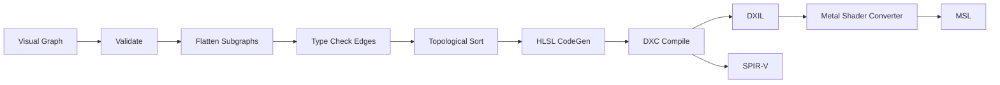
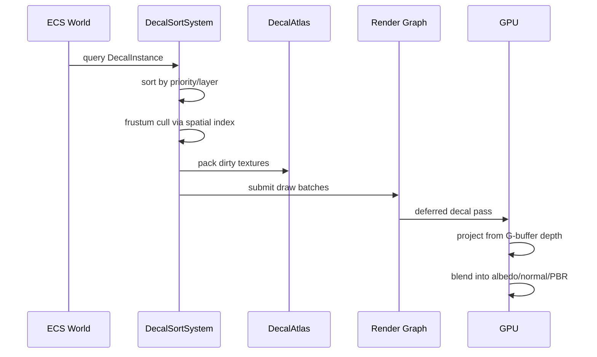
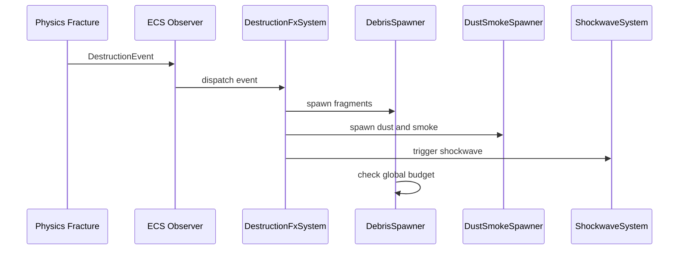
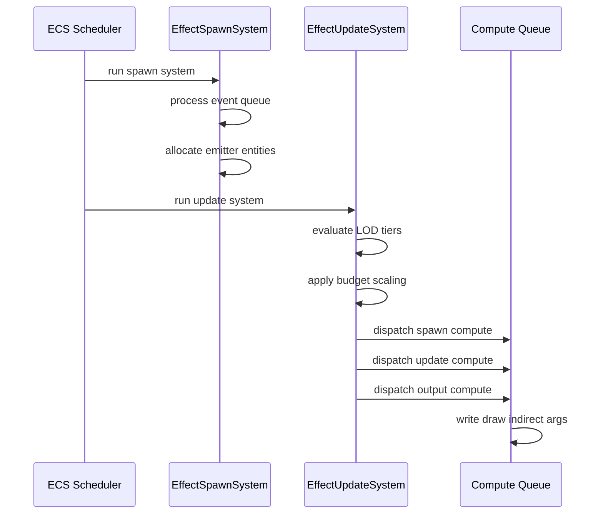

# VFX Effects & Effect Graph Design

## Requirements Trace

> **Canonical sources:** Features, requirements, and user stories are defined in
> [features/](../../features/), [requirements/](../../requirements/), and
> [user-stories/](../../user-stories/). The table below traces design elements to those definitions.

### Decals (11.2)

| Feature  | Requirement | User Story                         |
|----------|-------------|------------------------------------|
| F-11.2.1 | R-11.2.1    | US-11.2.1.1..US-11.2.1.3           |
| F-11.2.2 | R-11.2.2    | US-11.2.2.1, US-11.2.2.2           |
| F-11.2.3 | R-11.2.3    | US-11.2.3.1, US-11.2.3.2           |
| F-11.2.4 | R-11.2.4    | US-11.2.4.1..US-11.2.4.3           |
| F-11.2.5 | R-11.2.5    | US-11.2.5.1, US-11.2.5.2           |
| F-11.2.6 | R-11.2.6    | US-11.2.6.1..US-11.2.6.3           |

1. **F-11.2.1** — Deferred and projected decals with per-channel G-buffer modification
2. **F-11.2.2** — Mesh decals with tangent-space normals
3. **F-11.2.3** — Runtime decal atlas with LRU eviction
4. **F-11.2.4** — Priority layering, blend modes, lifecycle
5. **F-11.2.5** — Procedural blood and damage decals
6. **F-11.2.6** — Surface-aware footprints and tire tracks

### Screen Effects (11.3)

| Feature  | Requirement | User Story                         |
|----------|-------------|------------------------------------|
| F-11.3.1 | R-11.3.1    | US-11.3.1.1..US-11.3.1.3           |
| F-11.3.2 | R-11.3.2    | US-11.3.2.1, US-11.3.2.2           |
| F-11.3.3 | R-11.3.3    | US-11.3.3.1..US-11.3.3.3           |
| F-11.3.4 | R-11.3.4    | US-11.3.4.1, US-11.3.4.2           |
| F-11.3.5 | R-11.3.5    | US-11.3.5.1, US-11.3.5.2           |
| F-11.3.6 | R-11.3.6    | US-11.3.6.1..US-11.3.6.3           |

1. **F-11.3.1** — Perlin-noise camera shake with additive layering
2. **F-11.3.2** — Per-object and camera motion blur
3. **F-11.3.3** — Screen-space lens flare with templates
4. **F-11.3.4** — Chromatic aberration, film grain, vignette
5. **F-11.3.5** — Heat haze and screen-space refraction
6. **F-11.3.6** — Damage overlays and screen flash

### Weather and Environmental FX (11.4)

| Feature  | Requirement | User Story                         |
|----------|-------------|------------------------------------|
| F-11.4.1 | R-11.4.1    | US-11.4.1.1..US-11.4.1.3           |
| F-11.4.2 | R-11.4.2    | US-11.4.2.1..US-11.4.2.3           |
| F-11.4.3 | R-11.4.3    | US-11.4.3.1..US-11.4.3.3           |
| F-11.4.4 | R-11.4.4    | US-11.4.4.1, US-11.4.4.2           |
| F-11.4.5 | R-11.4.5    | US-11.4.5.1..US-11.4.5.3           |
| F-11.4.6 | R-11.4.6    | US-11.4.6.1..US-11.4.6.3           |
| F-11.4.7 | R-11.4.7    | US-11.4.7.1..US-11.4.7.3           |

1. **F-11.4.1** — Multi-layered rain with screen droplets
2. **F-11.4.2** — Dynamic puddles and wet surfaces
3. **F-11.4.3** — Vertex-displacement snow with deformation
4. **F-11.4.4** — Localized volumetric fog volumes
5. **F-11.4.5** — Procedural branching lightning
6. **F-11.4.6** — Wind-driven debris and dust storms
7. **F-11.4.7** — Underwater caustics, depth fog, god rays

### Destruction VFX (11.5)

| Feature  | Requirement | User Story                         |
|----------|-------------|------------------------------------|
| F-11.5.1 | R-11.5.1    | US-11.5.1.1..US-11.5.1.3           |
| F-11.5.2 | R-11.5.2    | US-11.5.2.1, US-11.5.2.2           |
| F-11.5.3 | R-11.5.3    | US-11.5.3.1..US-11.5.3.3           |
| F-11.5.4 | R-11.5.4    | US-11.5.4.1..US-11.5.4.3           |
| F-11.5.5 | R-11.5.5    | US-11.5.5.1, US-11.5.5.2           |
| F-11.5.6 | R-11.5.6    | US-11.5.6.1, US-11.5.6.2           |
| F-11.5.7 | R-11.5.7    | US-11.5.7.1..US-11.5.7.3           |

1. **F-11.5.1** — Event-driven debris spawning with budget
2. **F-11.5.2** — Material-colored dust clouds and smoke
3. **F-11.5.3** — Sparks with bounce and drifting embers
4. **F-11.5.4** — Animated crack decals from stress
5. **F-11.5.5** — Persistent scorch marks on G-buffer
6. **F-11.5.6** — Expanding shockwave distortion
7. **F-11.5.7** — Surface-spreading fire propagation

### Effect Graph (11.6)

| Feature   | Requirement |
|-----------|-------------|
| F-11.6.1  | R-11.6.1    |
| F-11.6.2  | R-11.6.2    |
| F-11.6.3  | R-11.6.3    |
| F-11.6.4  | R-11.6.4    |
| F-11.6.5  | R-11.6.5    |
| F-11.1.1  | R-11.1.1    |
| F-15.8.1  | R-15.8.1    |
| F-15.8.5b | R-15.8.5b   |

1. **F-11.6.1** — Node-based effect graph editor with GPU compile and real-time preview
2. **F-11.6.2** — Custom effect graph nodes via logic graph
3. **F-11.6.3** — Typed parameter slots with per-instance override and data binding
4. **F-11.6.4** — Event-driven VFX spawning from observers
5. **F-11.6.5** — Distance-based LOD and VFX budget
6. **F-11.1.1** — GPU compute shader particle simulation
7. **F-15.8.1** — Universal logic graph runtime
8. **F-15.8.5b** — Shader graph to HLSL compilation

## Overview

This document combines runtime VFX effects (decals, screen effects, weather, destruction) with the
VFX authoring graph compiler. Together they form the complete non-particle VFX pipeline.

### Runtime Effects

Four visual effect subsystems -- decals, screen effects, weather, and destruction VFX -- as pure ECS
systems on component data. A shared `EffectBudget` resource coordinates resource limits across all
subsystems.

### Effect Graph

The sole VFX authoring surface. Designers compose spawn, update, and output behaviors as nodes in a
visual graph. The compiler translates this into HLSL compute shaders that execute entirely on the
GPU.

Key design principles:

1. **ECS-native.** Every effect instance, emitter, parameter, and budget is an ECS component or
   resource.
2. **GPU-first.** Particle simulation, decal projection, distortion accumulation, weather
   heightfields run as GPU compute dispatches.
3. **Budget-aware.** Global budgets cap decal pools, debris fragments, particle counts per platform
   tier.
4. **Event-driven.** Destruction VFX spawn via ECS observers. Weather transitions via `WeatherState`
   changes.
5. **Graph-to-shader.** Visual graph compiles to fused HLSL compute per emitter lifecycle stage.
6. **Static dispatch.** All node types are enum variants.

## Architecture

### Module Boundaries


### Graph Compilation Pipeline



### Core Data Structures

```mermaid
classDiagram
    class EffectBudget {
        +PlatformTier tier
        +u32 decal_pool_max
        +u32 debris_budget_max
        +u32 overlay_max
        +try_alloc_decal() bool
        +try_alloc_debris(count) u32
    }

    class DecalInstance {
        +u8 priority
        +LayerMask layers
        +BlendMode blend_mode
    }

    class DecalProjection {
        +ProjectionKind kind
        +Vec3 half_extents
        +Vec3 fade_axis
        +f32 angle_threshold
    }

    class DecalMaterial {
        +AtlasRegion atlas_region
        +ChannelMask channels
        +Color tint
    }

    class DecalLifecycle {
        +f32 fade_in_secs
        +f32 sustain_secs
        +f32 dissolve_secs
        +f32 elapsed
        +LifecyclePhase phase
    }

    class ShakeSource {
        +f32 frequency
        +f32 amplitude
        +f32 decay_rate
        +Vec3 directional_bias
    }

    class ScreenOverlay {
        +OverlayKind kind
        +AssetId texture
        +Color tint
        +f32 intensity
        +OverlayLifecycle lifecycle
    }

    class WeatherState {
        +WeatherKind kind
        +f32 intensity
        +WindFieldHandle wind_field
        +f32 transition_progress
    }

    class WindField {
        +GpuTexture grid_texture
        +f32 cell_size_m
    }

    class WindZone {
        +WindZoneKind kind
        +Vec3 half_extents
        +f32 strength
        +f32 turbulence
    }

    class ForceField {
        +ForceShape shape
        +ForceKind kind
        +f32 strength
        +ForceFalloff falloff
    }

    class ForceKind {
        <<enum>>
        Radial
        Vortex
        Directional
        Drag
    }

    class FireDamage {
        +f32 dps
        +SurfaceMaterial fuel_type
    }

    class DestructionEvent {
        +Entity source
        +Vec3 impact_point
        +Vec3 impact_normal
        +f32 force
        +SurfaceMaterial material
    }

    class ShockwaveInstance {
        +Vec3 origin
        +f32 current_radius
        +f32 max_radius
        +f32 speed
        +f32 distortion_strength
    }

    class FirePropagation {
        +GpuTexture propagation_map
        +f32 spread_rate
        +f32 wind_influence
        +u32 max_light_sources
    }

    class EffectGraph {
        +Vec~EffectNode~ nodes
        +Vec~TypedEdge~ edges
        +Vec~ExposedParam~ params
    }

    class EffectNode {
        +NodeId id
        +NodeKind kind
        +Vec~Pin~ inputs
        +Vec~Pin~ outputs
    }

    class NodeKind {
        <<enum>>
        Context
        Attribute
        Operator
        Output
        Custom
    }

    class TypedEdge {
        +NodeId from_node
        +PinId from_pin
        +NodeId to_node
        +PinId to_pin
        +PinDataType data_type
    }

    class PinDataType {
        <<enum>>
        Float
        Vec2
        Vec3
        Vec4
        Int
        Bool
        Color
        Curve
        Gradient
        Texture
    }

    class CompiledEffect {
        +CompiledKernel spawn_kernel
        +CompiledKernel init_kernel
        +CompiledKernel update_kernel
        +CompiledKernel output_kernel
        +AttributeLayout attribute_layout
        +u64 content_hash
    }

    class EffectInstanceComponent {
        +AssetId compiled
        +SmallVec~ParamOverride4~ param_overrides
        +EffectPriority priority
        +LayerMask layers
    }

    class EmitterLodComponent {
        +LodTier current_tier
        +f32 distance_to_camera
    }

    class LodTier {
        <<enum>>
        Full
        Reduced
        Impostor
        Culled
    }

    class VfxSpawnEvent {
        +AssetId effect
        +Vec3 position
        +Vec3 normal
        +Vec3 velocity
    }

    DecalInstance *-- DecalProjection
    DecalInstance *-- DecalMaterial
    DecalInstance *-- DecalLifecycle
    EffectGraph *-- EffectNode
    EffectGraph *-- TypedEdge
    EffectNode --> NodeKind
    EffectNode *-- Pin
    TypedEdge --> PinDataType
    CompiledEffect *-- CompiledKernel
    EffectInstanceComponent --> EffectPriority
    EmitterLodComponent --> LodTier
    DestructionEvent --> ShockwaveInstance
    DestructionEvent --> FirePropagation
    WeatherState --> WeatherKind
    WeatherState --> WindField
    WindField *-- WindZone
    ForceField --> ForceKind
    FirePropagation --> FireDamage
```



### Decal Rendering Pipeline



### Destruction VFX Event Flow



### Effect Graph Frame Execution



### System Phase Assignments (RF-3, RF-4)

Physics-coupled systems run in `FixedUpdate` to match the physics timestep. Visual-only systems run
in `Update` or `PreRender`.

| System | Phase | Reason |
|--------|-------|---------|
| `destruction_event_system` | `FixedUpdate` | physics-coupled (RF-4) |
| `fire_spread_system` | `FixedUpdate` | physics-coupled (RF-4) |
| `shockwave_system` | `FixedUpdate` | physics-coupled (RF-4) |
| `physics_vfx_bridge_system` | `PostUpdate` | after physics step |
| `wind_field_update_system` | `Update` | frame-rate driven |
| `crack_growth_system` | `Update` | visual only |
| `decal_lifecycle_system` | `Update` | visual only |
| `decal_pool_reclaim_system` | `Update` | visual only |
| `rain_system` | `Update` | visual only |
| `puddle_system` | `Update` | visual only |
| `wet_surface_system` | `Update` | visual only |
| `snow_system` | `Update` | visual only |
| `fog_volume_system` | `Update` | visual only |
| `lightning_system` | `Update` | visual only |
| `wind_debris_system` | `Update` | visual only |
| `underwater_system` | `Update` | visual only |
| `shake_system` | `Update` | visual only |
| `overlay_system` | `Update` | visual only |
| `distortion_system` | `Update` | visual only |
| `lens_flare_system` | `Update` | visual only |
| `effect_spawn_system` | `Update` | event-driven |
| `effect_update_system` | `Update` | visual only |
| `budget_enforcement_system` | `Update` | visual only |
| `decal_render_system` | `PreRender` | GPU submission |
| `fire_damage_system` | `FixedUpdate` | physics-coupled (RF-4) |

## API Design

### Shared Types

```rust
// SurfaceMaterial is codegen'd in the middleman .dylib. Type descriptors are
// generated statically — no Reflect derive. See RF-15.
#[derive(Clone, Copy, Debug, PartialEq, Eq, Hash)]
pub enum SurfaceMaterial {
    Stone, Metal, Wood, Dirt, Sand,
    Snow, Water, Glass, Concrete, Vegetation,
    // Custom variants added via editor → middleman recompile
}

#[derive(Clone, Copy, Debug, PartialEq, Eq)]
pub struct ChannelMask {
    pub albedo: bool,
    pub normal: bool,
    pub roughness: bool,
    pub metallic: bool,
}

#[derive(Clone, Copy, Debug, PartialEq, Eq)]
pub enum BlendMode { Alpha, Multiply, Additive }
```

### Effect Budget

```rust
pub struct EffectBudget {
    tier: PlatformTier,
    decal_pool_max: u32,
    decal_pool_active: u32,
    debris_budget_max: u32,
    debris_budget_active: u32,
    overlay_max: u32,
    shockwave_max: u32,
    fire_light_max: u32,
}

impl EffectBudget {
    pub fn new(tier: PlatformTier) -> Self;
    pub fn try_alloc_decal(&mut self) -> bool;
    pub fn try_alloc_debris(
        &mut self, count: u32,
    ) -> u32;
    pub fn try_alloc_overlay(&mut self) -> bool;
    pub fn try_alloc_shockwave(&mut self) -> bool;
    pub fn release_decal(&mut self);
    pub fn release_debris(&mut self, count: u32);
}
```

Budget defaults per platform:

| Resource | Mobile | Switch | Console | Desktop |
|----------|--------|--------|---------|---------|
| Decal pool | 64 | 128 | 256 | 256 |
| Debris | 32 | 64 | 128 | 256 |
| Overlays | 2 | 3 | 4 | 4 |
| Shockwaves | 1 | 2 | 4 | 4 |
| Fire lights | 2 | 4 | 8 | 16 |

### Decal Components

```rust
// No Reflect derives — type descriptors generated by middleman codegen (RF-1).
#[derive(Clone, Copy, Debug, PartialEq, Eq)]
pub enum ProjectionKind { Deferred, Triplanar, Mesh }

#[derive(Clone, Copy, Debug, PartialEq, Eq)]
pub enum LifecyclePhase {
    FadeIn, Sustain, Dissolve, Expired,
}

#[derive(Clone, Debug)]
pub struct DecalProjection {
    pub kind: ProjectionKind,
    pub half_extents: Vec3,
    pub fade_axis: Vec3,
    pub angle_threshold: f32,
}

#[derive(Clone, Debug)]
pub struct DecalMaterial {
    pub atlas_region: AtlasRegion,
    pub channels: ChannelMask,
    pub tint: Color,
}

#[derive(Clone, Debug)]
pub struct DecalLifecycle {
    pub fade_in_secs: f32,
    pub sustain_secs: f32,
    pub dissolve_secs: f32,
    pub elapsed: f32,
    pub phase: LifecyclePhase,
}

#[derive(Clone, Debug)]
pub struct DecalInstance {
    pub priority: u8,
    pub layers: LayerMask,
    pub blend_mode: BlendMode,
}
```

### Screen Effect Components

```rust
// No Reflect derives — type descriptors generated by middleman codegen (RF-1).
#[derive(Clone, Debug)]
pub struct ShakeSource {
    pub frequency: f32,
    pub amplitude: f32,
    pub decay_rate: f32,
    pub directional_bias: Vec3,
    pub rotational: bool,
    pub elapsed: f32,
}

#[derive(Clone, Copy, Debug, PartialEq, Eq)]
pub enum OverlayKind {
    BloodSpatter, DamageFlash, Frost,
    CrackedGlass, Corruption, HealFlash, Custom,
}

#[derive(Clone, Debug)]
pub struct ScreenOverlay {
    pub kind: OverlayKind,
    pub texture: AssetId,
    pub tint: Color,
    pub intensity: f32,
    pub direction: Option<f32>,
    pub lifecycle: OverlayLifecycle,
}

#[derive(Clone, Debug)]
pub struct DistortionSource {
    pub kind: DistortionKind,
    pub world_origin: Vec3,
    pub radius: f32,
    pub strength: f32,
    pub speed: f32,
    pub elapsed: f32,
}

#[derive(Clone, Debug)]
pub struct LensFlareTemplate {
    // SmallVec<[FlareElement; 8]> avoids heap allocation for typical flares (RF-12)
    pub elements: SmallVec<[FlareElement; 8]>,
    pub occlusion_radius: f32,
    pub temporal_smooth: f32,
}
```

### Weather Components

```rust
// No Reflect derives — type descriptors generated by middleman codegen (RF-1).
#[derive(Clone, Copy, Debug, PartialEq, Eq)]
pub enum WeatherKind {
    Clear, Rain, Snow, Fog, DustStorm, Thunderstorm,
}

#[derive(Clone, Debug)]
pub struct WeatherState {
    pub kind: WeatherKind,
    pub intensity: f32,
    pub wind_field: WindFieldHandle, // shared wind field (RF-17)
    pub transition_progress: f32,
}

#[derive(Clone, Debug)]
pub struct RainConfig {
    pub particle_density: u32,
    pub streak_length: f32,
    pub screen_droplets: bool,
    pub ripple_intensity: f32,
    pub layers: LayerMask, // render layer for weather particles (RF-9)
}

#[derive(Clone, Debug)]
pub struct SnowLayer {
    pub height_texture: GpuTexture,
    // accumulation_rate is multiplied by dot(surface_normal, up) clamped [0,1]
    // and depth-tested top-down to handle overhangs (RF-24).
    pub accumulation_rate: f32,
    pub max_depth: f32,
    pub deformation_fade: f32,
}

#[derive(Clone, Debug)]
pub struct FogVolume {
    pub shape: FogShape,
    pub density: f32,
    pub color: Color,
    pub height_falloff: f32,
    pub animation_scroll: Vec3,
}

#[derive(Clone, Debug)]
pub struct LightningBolt {
    pub branch_depth: u32,
    pub branch_angle_range: f32,
    pub light_intensity: f32,
    pub decay_rate: f32,
    pub origin: Vec3,
    pub strike_point: Vec3,
}
```

### Destruction Components

```rust
// No Reflect derives — type descriptors generated by middleman codegen (RF-1).
#[derive(Clone, Debug)]
pub struct DestructionEvent {
    pub source: Entity,
    pub impact_point: Vec3,
    pub impact_normal: Vec3,
    pub force: f32,
    pub material: SurfaceMaterial,
    pub impact_velocity: Vec3,
}

#[derive(Clone, Debug)]
pub struct DebrisTable {
    // SmallVec avoids heap allocation for typical 1-8 debris entry tables (RF-12)
    pub entries: SmallVec<[DebrisEntry; 8]>,
    pub max_fragments: u32,
    pub layers: LayerMask, // render layer for debris fragments (RF-9)
}

#[derive(Clone, Debug)]
pub struct CrackOverlay {
    pub crack_atlas: AssetId,
    pub growth_speed: f32,
    pub branch_density: f32,
    pub accumulated_damage: f32,
    pub current_radius: f32,
}

#[derive(Clone, Debug)]
pub struct ShockwaveInstance {
    pub origin: Vec3,
    pub current_radius: f32,
    pub max_radius: f32,
    pub speed: f32,
    pub distortion_strength: f32,
    pub shake_intensity: f32,
}

// No Reflect derives — type descriptors generated by middleman codegen (RF-1).
#[derive(Clone, Debug)]
pub struct FirePropagation {
    pub propagation_map: GpuTexture,
    pub spread_rate: f32,
    pub wind_influence: f32, // samples shared WindField GPU texture (RF-17)
    pub max_light_sources: u32,
}

/// Active fire on entity. `FireDamage` system applies DPS to overlapping
/// entities. Destroyed fuel objects seed the propagation map (RF-22).
#[derive(Clone, Debug)]
pub struct FireDamage {
    pub dps: f32,
    pub fuel_type: SurfaceMaterial,
}
```

### Effect Graph Types

```rust
pub struct NodeId(pub u32);
pub struct PinId(pub u32);

#[derive(Clone, Copy, Debug, PartialEq, Eq)]
pub enum PinDataType {
    Bool, Float, Vec2, Vec3, Vec4, Int, UInt,
    Color, Texture, Curve, Gradient, Attribute,
}

pub enum NodeKind {
    Context(ContextNode),
    Attribute(AttributeNode),
    Operator(OperatorNode),
    Output(OutputNode),
    /// Handle/index into the codegen'd node table in the middleman .dylib (RF-11).
    /// No dynamic dispatch — adding a custom node type triggers middleman recompilation.
    Custom(CustomNodeRef),
}

/// Index into the static custom-node table generated by the middleman .dylib.
/// Not a trait object. All custom node HLSL is compiled at middleman build time.
pub struct CustomNodeRef(pub u32);

pub enum ContextNode {
    Spawn(SpawnConfig),
    Initialize(InitConfig),
    Update(UpdateConfig),
    OutputStage(OutputStageConfig),
}

pub enum SpawnShape {
    Point,
    Sphere { radius: f32 },
    Box { half_extents: Vec3 },
    Cone { angle: f32, radius: f32 },
    MeshSurface { mesh: AssetId },
}

pub enum OperatorNode {
    MathBinary(MathBinaryOp),
    MathUnary(MathUnaryOp),
    Noise(NoiseConfig),
    SampleTexture(TextureRef),
    SampleCurve(CurveRef),
    SampleGradient(GradientRef),
    Compare(CompareOp),
    Branch,
    Random(RandomConfig),
    Lerp, Remap, Dot, Cross, Normalize, Length,
}

pub enum OutputNode {
    Sprite(SpriteOutputConfig),
    Mesh(MeshOutputConfig),
    Ribbon(RibbonOutputConfig),
    Light(LightOutputConfig),
    /// Emits a spatial audio event tied to particle spawn/death/collision (RF-25).
    /// Covers explosion sounds, fire crackling, wind, rain patter.
    AudioEmit(AudioEmitConfig),
    /// Writes density+color into the froxel grid for volumetric smoke (RF-20).
    VolumetricDensity(VolumetricDensityConfig),
}

pub struct AudioEmitConfig {
    pub sound_asset: AssetId,
    pub trigger: AudioTrigger, // Spawn, Death, Collision
    pub radius_m: f32,
    pub volume: f32,
}

#[derive(Clone, Copy, Debug, PartialEq, Eq)]
pub enum AudioTrigger { Spawn, Death, Collision }

pub struct VolumetricDensityConfig {
    pub density_scale: f32,
    pub absorption: f32,
}
```

### Graph Compiler

```rust
pub struct CompiledEffect {
    pub source_hash: u64,
    pub spawn_kernel: CompiledKernel,
    pub init_kernel: CompiledKernel,
    pub update_kernel: CompiledKernel,
    pub output_kernel: CompiledKernel,
    pub attribute_layout: AttributeLayout,
    pub output_mode: OutputMode,
}

pub struct CompiledKernel {
    // rkyv-archived asset; zero-copy mmap load (RF-16)
    pub bytecode: Handle<ShaderBytecode>,
    pub thread_group_size: u32,
    pub param_layout: ParamBufferLayout,
}

pub struct EffectGraphCompiler;

impl EffectGraphCompiler {
    /// Synchronous compilation entry point (RF-2). Long-running compilations are
    /// submitted as jobs to the custom job system; the caller polls the returned
    /// handle at frame boundaries.
    pub fn compile(
        validated: &ValidatedGraph,
        cache: &ShaderCache,
        platform: PlatformTier,
    ) -> JobHandle<Result<CompiledEffect, CompileError>>;
}

pub struct HlslCodeGen;

impl HlslCodeGen {
    pub fn generate(
        stage: ContextNodeType,
        sorted_nodes: &[EffectNode],
        edges: &[TypedEdge],
        attribute_layout: &AttributeLayout,
        param_layout: &ParamBufferLayout,
    ) -> Result<String, CodeGenError>;
}
```

### LOD and Budget

```rust
#[derive(Clone, Copy, Debug, PartialEq, Eq, PartialOrd, Ord)]
pub enum LodTier { Full, Reduced, Impostor, Culled }

#[derive(Clone, Copy, Debug, PartialEq, Eq, PartialOrd, Ord)]
pub enum EffectPriority { Low, Medium, High, Critical }

pub struct VfxBudgetResource {
    pub max_total_particles: u32,
    pub max_gpu_compute_ms: f32,
    pub current_total_particles: u32,
    pub current_gpu_compute_ms: f32,
}

/// Placed on an entity to spawn and drive an effect graph instance (RF-9).
#[derive(Clone, Debug)]
pub struct EffectInstanceComponent {
    pub compiled: AssetId,
    // SmallVec avoids heap for typical 1-4 overrides (RF-12)
    pub param_overrides: SmallVec<[ParamOverride; 4]>,
    pub priority: EffectPriority,
    pub layers: LayerMask, // determines which cameras see this effect (RF-9)
}

#[derive(Clone, Debug)]
pub struct EmitterLodComponent {
    pub current_tier: LodTier,
    pub distance_to_camera: f32,
}
```

VFX particle budget defaults:

| Platform | Max Particles | Max GPU (ms) |
|----------|--------------|-------------|
| Mobile | 10,000 | 1.0 |
| Switch | 50,000 | 2.0 |
| Console | 200,000 | 4.0 |
| Desktop | 500,000 | 6.0 |

### Wind Field (RF-17)

```rust
/// World-space 3D grid compositing global wind + WindZone volumes into a GPU
/// texture. All consumers (particles, cloth, fire, debris, vegetation) sample
/// this shared texture. Updated once per frame by `wind_field_update_system`.
pub struct WindField {
    pub grid_texture: GpuTexture, // R16G16B16A16_FLOAT, froxel-aligned
    pub cell_size_m: f32,
}

/// Axis-aligned volume that contributes a wind force to the WindField.
#[derive(Clone, Debug)]
pub struct WindZone {
    pub kind: WindZoneKind,
    pub half_extents: Vec3,
    pub strength: f32,
    pub turbulence: f32,
}

#[derive(Clone, Copy, Debug, PartialEq, Eq)]
pub enum WindZoneKind { Directional, Vortex, Turbulence }
```

### Force Fields (RF-18)

```rust
/// Shape-bound force volume. Sampled from the shared BVH by particle sim,
/// cloth solver, soft body solver, and debris physics.
#[derive(Clone, Debug)]
pub struct ForceField {
    pub shape: ForceShape,    // Sphere, Box, Cone, Cylinder
    pub kind: ForceKind,
    pub strength: f32,
    pub falloff: ForceFalloff,
}

#[derive(Clone, Copy, Debug, PartialEq, Eq)]
pub enum ForceKind { Radial, Vortex, Directional, Drag }

#[derive(Clone, Copy, Debug, PartialEq, Eq)]
pub enum ForceFalloff { Constant, Linear, Quadratic }
```

### Physics VFX Bridge (RF-19)

```rust
/// Spawns VFX effect graph instances in response to physics events. Listens
/// for cloth tear, fracture, impact, and deformation threshold events.
pub struct PhysicsVfxBridge;

impl PhysicsVfxBridge {
    /// Run in PostUpdate after physics step. Polls physics event channel,
    /// spawns matching effect graph instances via VfxSpawnEvent.
    pub fn physics_vfx_bridge_system(
        events: &PhysicsEventChannel,
        vfx_events: &mut EventWriter<VfxSpawnEvent>,
        bridge_table: &PhysicsVfxTable,
    );
}
```

### Volumetric Smoke Injection (RF-20)

```rust
/// Marks a particle system as a volumetric density source. The atmospheric
/// scattering pass reads the froxel grid — smoke writes density+color into it
/// each frame, giving self-shadowing and correct fog-smoke blending.
#[derive(Clone, Debug)]
pub struct VolumetricDensity {
    pub density_scale: f32,
    pub color: Color,
    pub absorption: f32,
}
```

### Continuous Decal Placement (RF-21)

```rust
/// Physics contact point spawns an oriented decal at impact site.
#[derive(Clone, Debug)]
pub struct ContactDecalEmitter {
    pub texture_table: SmallVec<[AssetId; 4]>, // keyed by SurfaceMaterial
    pub size_range: (f32, f32),
}

/// Spawns decals at fixed stride intervals along movement path.
#[derive(Clone, Debug)]
pub struct StrideDecalEmitter {
    pub stride_m: f32,
    pub texture_table: SmallVec<[AssetId; 4]>,
    pub writes_deformation: bool, // true for snow/mud height texture
}

/// Ring-buffer of control points; GPU generates a projected quad strip.
/// Used for tire tracks, drag marks, skid marks. Points fade via lifecycle.
#[derive(Clone, Debug)]
pub struct DecalStrip {
    pub max_points: u32,
    pub width_m: f32,
    pub texture: AssetId,
    pub fade_secs: f32,
}
```

### Gameplay Indicator VFX (RF-26)

```rust
/// Common component shared by all gameplay VFX indicators.
#[derive(Clone, Debug)]
pub struct IndicatorEntity {
    pub kind: IndicatorKind,
    pub layers: LayerMask, // gameplay camera yes, minimap camera no
    pub lod_max_dist: f32,
}

#[derive(Clone, Copy, Debug, PartialEq, Eq)]
pub enum IndicatorKind {
    QuestMarker,
    WaypointBeam,
    LootSparkle,
    AreaIndicator,
    SelectionOutline,
    HitFlash,
    TrailEffect,
    StatusEffect,
}

/// Animated 3D icon (spinning gear, bobbing exclamation, pulsing diamond).
/// NOT a billboard UI sprite and NOT a particle system — a 3D mesh entity
/// with procedural animation timeline tracks.
#[derive(Clone, Debug)]
pub struct AnimatedIndicatorMesh {
    pub mesh: Handle<MeshAsset>,
    pub material: Handle<MaterialAsset>,
    pub billboard_axis: Option<Vec3>, // None = free-rotating
    // LOD: Full3D > SimplifiedMesh > BillboardSprite > Hidden
    pub lod_distances: [f32; 3],
}
```

### ParamDefaults (RF-10)

```rust
/// Static per-effect default parameter values. Not a runtime type registry —
/// purely a data struct populated by codegen from the effect graph asset.
pub struct ParamDefaults {
    pub entries: SmallVec<[ParamDefault; 16]>,
}
```

## Data Flow

### Per-Thread Arena Allocations (RF-13)

Temporary per-frame VFX allocations (sort buffers, spawn lists, compute dispatch parameter staging,
draw-call batch arrays) are made from per-thread arenas. Arenas reset at frame boundaries,
eliminating global allocator contention on hot paths. The frame-boundary reset occurs at the start
of `PreRender` before any VFX render system runs.

### Decal Frame Lifecycle

1. `decal_lifecycle_system` advances timers, despawns expired.
2. `decal_pool_reclaim_system` reclaims oldest low-priority when pool exceeds 90%.
3. `decal_render_system` frustum-culls, sorts, packs atlas, submits indirect draws.
4. GPU deferred pass rasterizes OBBs, projects from depth, blends into G-buffer channels.

### Screen Effects Frame Lifecycle

Screen effects are per-camera (RF-9). Each `Camera` entity has its own post-process stack. A
`ShakeSource`, `ScreenOverlay`, or `DistortionSource` component targets a specific camera via a
`TargetCamera(Entity)` component. The `overlay_system` filters by camera before submitting.

1. `shake_system` sums Perlin noise from all sources, applies accessibility attenuation, writes
   `CameraShakeOffset`.
2. `overlay_system` advances lifecycles, despawns expired, submits composite draws.
3. `distortion_system` projects sources to screen, writes half-res distortion buffer.
4. `lens_flare_system` performs occlusion test, submits flare element billboards.
5. Post-process executes: motion blur, distortion, lens flare, CA + grain, overlays, vignette.

### Weather Frame Lifecycle

1. `rain_system` spawns GPU streaks, drives screen droplets.
2. `puddle_system` updates heightfield via compute.
3. `wet_surface_system` lerps roughness/albedo by wetness.
4. `snow_system` updates height texture, stamps deformation.
5. `fog_volume_system` injects density into froxel grid.
6. `lightning_system` generates L-system geometry, emits light.
7. `wind_debris_system` spawns particles, injects scattering.
8. `underwater_system` applies caustics, depth fog, god rays.

### Destruction Event Lifecycle

1. Physics fracture emits `DestructionEvent`.
2. Observer spawns debris (budget-capped), dust, sparks, shockwave.
3. `crack_growth_system` advances crack overlays.
4. `shockwave_system` expands rings, applies distortion.
5. `fire_spread_system` propagates burn state via compute.
6. `scorch_mark_system` fades marks over time.
7. `fire_damage_system` applies DPS to entities overlapping the fire propagation map (RF-22).
8. When a fuel entity reaches zero health, `DestructionEvent` is emitted, seeding the propagation
   map at the destruction site and continuing the fire spread chain (RF-22).

### Effect Graph Lifecycle

1. **Author** -- effects artist connects typed nodes.
2. **Preview** -- graph compiles on save, preview simulates.
3. **Compile** -- validate, flatten, type check, sort, HLSL codegen, DXC compile. Cached by content
   hash.
4. **Load** -- runtime loads `CompiledEffect` binary.
5. **Spawn** -- `VfxSpawnEvent` creates ECS entities.
6. **Simulate** -- per-frame compute dispatches.
7. **Render** -- draw-indirect with zero CPU overhead.
8. **Budget** -- `BudgetEnforcementSystem` scales down low priority effects when over budget.
9. **Destroy** -- lifetime expires, buffers returned to pool.

### GPU Resource Ring-Buffering (RF-7)

All per-frame GPU resources are ring-buffered with N frames in flight (typically N=2 or N=3,
matching the render graph's `FRAMES_IN_FLIGHT` constant):

- Particle attribute buffers (position, velocity, lifetime, custom attributes)
- Indirect draw argument buffers (one per emitter)
- Distortion accumulation textures (half-res)
- Wind field GPU texture (written CPU-side, read GPU-side)

The render graph's frame resource manager owns these ring buffers. VFX systems request a slot per
frame via `frame_resources.acquire(frame_index % FRAMES_IN_FLIGHT)`.

### Frame-Boundary Handoff (RF-8)

ECS systems and the render thread communicate via a double-buffered staging channel:

1. **ECS write phase** (`PreRender`): VFX render systems fill a `VfxDrawList` staging buffer — decal
   batches, particle draw-indirect descriptors, overlay draw calls.
2. **Frame boundary**: the staging buffer is sent to the render thread via a
   `crossbeam_channel::Sender<VfxDrawList>`. The ECS side swaps to the next ring slot.
3. **Render thread consume**: the render thread receives the `VfxDrawList` and submits GPU commands.
   No shared mutable state; the channel transfer is the synchronization point.

## Platform Considerations

### Decals

| Feature | Mobile | Desktop |
|---------|--------|---------|
| Projection | Deferred | Deferred |
| Triplanar | No | Yes |
| Mesh decals | No | Yes |
| Atlas page | 1024 | 2048 |
| Pool size | 64 | 256 |

### Screen Effects

| Feature | Mobile | Desktop |
|---------|--------|---------|
| Motion blur | Disabled | Full |
| Lens flare | 2 ghosts | 6 ghosts |
| CA / grain | Disabled | Enabled |
| Distortion | Quarter-res | Half-res |
| Max overlays | 2 | 4 |

### Weather

| Feature | Mobile | Desktop |
|---------|--------|---------|
| Rain layers | 1 | 3 |
| Puddles | Pre-placed | Dynamic |
| Snow | Texture blend | Vertex disp |
| Fog volumes | Height fog | Froxel |
| Lightning depth | 2 | 4 |
| God rays | Disabled | Full |

### Shader Pipeline

| Platform | Source | DXC Output | Final |
|----------|--------|------------|-------|
| D3D12 | HLSL | DXIL | DXIL |
| Vulkan | HLSL | SPIR-V | SPIR-V |
| Metal | HLSL | DXIL | MSL |

### Node Count Limits

| Tier | Max Nodes | Custom Scope |
|------|----------|-------------|
| Desktop | 128 | Per-particle + emitter |
| Mobile | 32 | Per-emitter only |

### VR Platform (RF-14)

VR = both eyes rendered per frame. Platform tier uses Desktop budgets with these overrides:

| Feature | VR Override |
|---------|-------------|
| Motion blur | Disabled (comfort) |
| Chromatic aberration | Disabled (comfort) |
| Decal projection | 2× GPU cost (stereo) |
| Screen shake amplitude | 50% of normal |
| Max overlays | 2 (comfort limit) |

Mobile = iOS + Android. Desktop = Windows + macOS + Linux.

### 2D and 2.5D Mode (RF-6)

Every VFX subsystem must function in 2D and 2.5D game modes without a separate code path.

| Subsystem | 3D mode | 2D / 2.5D mode |
|-----------|---------|----------------|
| Decals | G-buffer OBB projection | 2D sprite overlay; `LayerMask` selects sprite layer |
| Screen effects | Full post-process stack | Full stack (same code path) |
| Weather | GPU streaks, vertex snow | Parallax sprite rain/snow layers |
| Effect graph | 3D spawn shapes, Vec3 positions | 2D spawn shapes, `Vec2` positions, sprite output |
| Destruction VFX | 3D debris + smoke | 2D debris with `PhysicsShape2D`, 2D smoke sprites |
| Wind field | 3D volumetric grid | 2D planar slice of WindField grid |
| Force fields | 3D sphere/box/cone/cylinder | 2D circle/rect |

### Render Graph Pass Inventory (RF-23)

All VFX render graph passes in pipeline order. Inputs and outputs use render graph resource names.

| Pass | Stage | Inputs | Outputs |
|------|-------|--------|---------|
| `decal_projection` | after GBuffer | GBuffer depth, decal batches | GBuffer albedo/normal/PBR |
| `wind_field_inject` | PreRender | WindZone ECS data | `wind_field_tex` |
| `snow_accumulation` | PreRender | depth, `wind_field_tex`, surface normals | `snow_height_tex` |
| `fire_propagation` | PreRender (FixedUpdate tick) | `fire_prop_map_prev` | `fire_prop_map` |
| `froxel_density_inject` | before lighting | particle density outputs | `froxel_density` |
| `fog_volume_inject` | before lighting | `FogVolume` ECS, depth | `froxel_density` |
| `particle_spawn` | PreRender | emitter ECS, `wind_field_tex` | particle attr buffers |
| `particle_update` | PreRender | particle attr buffers, `wind_field_tex` | particle attr buffers |
| `particle_output` | PreRender | particle attr buffers | draw-indirect arg buffers |
| `distortion_accumulate` | post-GBuffer | `DistortionSource` ECS, depth | `distortion_buf` |
| `lens_flare_occlusion` | post-GBuffer | depth, `LensFlareTemplate` ECS | `flare_occlusion` |
| `motion_blur` | post-lighting | scene color, velocity | scene color |
| `screen_distortion` | post-lighting | scene color, `distortion_buf` | scene color |
| `lens_flare_composite` | post-lighting | scene color, `flare_occlusion` | scene color |
| `ca_grain_vignette` | post-lighting | scene color | scene color |
| `screen_overlays` | post-lighting | scene color, overlay draw calls | scene color |
| `decal_strip_update` | PreRender | `DecalStrip` ECS | updated strip buffers |

## Test Plan

Tests are defined in the companion file [effects-test-cases.md](effects-test-cases.md).

### Unit Tests — Runtime Effects

| Test | Req |
|------|-----|
| `test_decal_lifecycle_phases` | R-11.2.4 |
| `test_decal_priority_sorting` | R-11.2.4 |
| `test_decal_pool_reclaim` | R-11.2.4 |
| `test_atlas_pack_and_lookup` | R-11.2.3 |
| `test_atlas_lru_eviction` | R-11.2.3 |
| `test_shake_decay` | R-11.3.1 |
| `test_shake_additive_clamping` | R-11.3.1 |
| `test_shake_reduced_motion` | R-11.3.1 |
| `test_overlay_lifecycle` | R-11.3.6 |
| `test_weather_state_transition` | R-11.4.1 |
| `test_puddle_accumulate_drain` | R-11.4.2 |
| `test_wet_surface_material` | R-11.4.2 |
| `test_snow_deformation_fade` | R-11.4.3 |
| `test_lightning_branch_depth` | R-11.4.5 |
| `test_debris_budget_cap` | R-11.5.1 |
| `test_dust_color_by_material` | R-11.5.2 |
| `test_crack_growth_rate` | R-11.5.4 |
| `test_shockwave_expansion` | R-11.5.6 |
| `test_fire_material_blocking` | R-11.5.7 |
| `test_budget_per_platform` | All |

### Unit Tests — Effect Graph

| Test | Req |
|------|-----|
| `test_validate_complete_graph` | R-11.6.1 |
| `test_validate_missing_context` | R-11.6.1 |
| `test_validate_type_mismatch` | R-11.6.1 |
| `test_validate_cycle_detection` | R-11.6.1 |
| `test_validate_mobile_node_limit` | R-11.6.1 |
| `test_codegen_gravity_update` | R-11.6.1 |
| `test_codegen_noise_operator` | R-11.6.1 |
| `test_topological_sort` | R-11.6.1 |
| `test_dead_node_elimination` | R-11.6.1 |
| `test_param_override` | R-11.6.3 |
| `test_lod_tier_selection` | R-11.6.5 |
| `test_lod_hysteresis` | R-11.6.5 |
| `test_budget_priority_ordering` | R-11.6.5 |
| `test_budget_critical_immune` | R-11.6.5 |
| `test_spawn_shape_coverage` | R-11.1.1 |

### Integration Tests

| Test | Req |
|------|-----|
| `test_decal_gbuffer_blend` | R-11.2.1 |
| `test_rain_full_pipeline` | R-11.4.1 |
| `test_debris_full_pipeline` | R-11.5.1 |
| `test_compile_and_dispatch` | R-11.6.1 |
| `test_event_spawn_collision` | R-11.6.4 |
| `test_param_data_binding` | R-11.6.3 |
| `test_preview_scrub` | R-11.6.1 |
| `test_shader_cache_hit` | R-11.6.1 |
| `test_output_sprite_render` | R-11.1.3 |

### Benchmarks

| Benchmark | Target | Source |
|-----------|--------|--------|
| 256 deferred decals | < 1 ms GPU | US-11.2.3.1 |
| Shake 20 sources | < 50 us CPU | US-11.3.1.2 |
| Rain 100K particles | < 1 ms GPU | US-11.4.1.1 |
| Debris spawn 256 | < 200 us CPU | US-11.5.1.1 |
| Fire propagation 256x256 | < 0.5 ms GPU | US-11.5.7.1 |
| Graph validate 128 nodes | < 1 ms | R-11.6.1 |
| HLSL codegen 128 nodes | < 10 ms | R-11.6.1 |
| Full compile | < 500 ms | R-11.6.1 |
| GPU update 100K particles | < 0.5 ms | R-11.1.1 |
| GPU update 500K particles | < 2.0 ms | R-11.1.1 |

## Design Q & A

**Q1. What is the biggest constraint?**

For runtime effects: deferred rendering dependency for projected decals means forward-rendered
platforms must fall back to mesh decals. For the effect graph: HLSL-only shader IL means two-stage
compilation (DXC + MSC), adding warm-up latency. We keep the constraint because a single IL reduces
compiler complexity.

**Q2. How can this design be improved?**

The weather system treats each weather type independently. A unified parametric blend would enable
smooth transitions (rain to sleet to snow). The effect graph fuses all nodes into one dispatch --
incremental compilation caching subgraph fragments would dramatically reduce iteration time.
Event-driven spawning lacks debounce for rapid collision events.

**Q3. Is there a better approach?**

For screen effects: a post-process graph where designers compose effects as nodes. We chose
hardcoded passes because screen effects are few, performance-critical, and rarely combined in novel
ways. For the effect graph: a CPU-interpreted VM avoids compilation but cannot scale to
million-particle counts required by F-11.1.1.

**Q4. Does this design solve all customer problems?**

Missing volumetric light shafts for indoor environments. Weather lacks thunder spatialization. The
effect graph lacks an AudioEmit node for synchronizing particle bursts with sounds -- currently
requires separate logic graph wiring.

**Q5. Is this design cohesive?**

Runtime effects integrate with the particle system, render graph, and spatial index. The effect
graph shares the GraphCompiler framework with material and shader graphs. One divergence: weather
surface effects modify materials directly rather than through the material graph pipeline. VFX LOD
uses its own distance logic rather than the shared spatial index LOD infrastructure.

## References (RF-5)

| Algorithm | Source |
|-----------|--------|
| Perlin noise (camera shake) | <https://mrl.cs.nyu.edu/~perlin/paper445.pdf> |
| L-system branching lightning | <https://algorithmicbotany.org/papers/abop/abop.pdf> |
| Froxel volumetric fog | <https://www.slideshare.net/BartWronski/volumetric-fog-unified-compute-shader-based-solution-to-atmospheric-scattering> |
| LRU eviction | <https://en.wikipedia.org/wiki/Cache_replacement_policies#LRU> |
| Cellular automaton fire propagation | <https://www.cs.unc.edu/~mucha/fire/fire.html> |
| Topological sort (Kahn's algorithm) | <https://en.wikipedia.org/wiki/Topological_sorting#Kahn's_algorithm> |
| Froxel density injection for smoke | <https://www.advances.realtimerendering.com/s2015/The%20Real-time%20Volumetric%20Cloudscapes%20of%20Horizon%20Zero%20Dawn.pptx> |
| Surface-normal accumulation model | <https://www.gdcvault.com/play/1023519/Naughty-Dog-Next-Gen-Snow> |

## Open Questions

### Runtime Effects

1. **Decal atlas format** -- BC7 compressed or RGBA8?
2. **Screen droplet fidelity** -- Full fluid sim or baked droplet paths?
3. **Snow height resolution** -- Memory vs detail tradeoff for large open worlds.
4. **Fire propagation rules** -- 4-neighbor vs 8-neighbor cellular automaton.
5. **Debris physics** -- Full rigid-body or simplified ballistic trajectories?

### Effect Graph

1. **Shader variant explosion** -- How aggressively to canonicalize equivalent subgraphs?
2. **Warm-up latency** -- Pre-compile all variants on save or compile on-demand with placeholder?
3. **GPU readback for counts** -- One-frame latency acceptable or use CPU-side estimates?
4. **Sub-emitter composition** -- Intra-graph edges or separate linked assets?
5. **Custom node compilation** -- Per-particle custom nodes must compile to HLSL, not bytecode.
   Needs alignment with logic graph AOT path (F-15.8.12).

## Review feedback

### RF-1: Remove all Reflect derives

All 25 structs/enums use `#[derive(Reflect)]` which violates the zero-reflection constraint. Remove
all `Reflect` derives and replace with codegen'd type descriptors emitted by the middleman .dylib.

### RF-2: Remove async from effect graph compiler

`EffectGraphCompiler::compile` is `async fn` which violates the no-async constraint. Change to a
synchronous function. If compilation is long-running, submit as a job to the custom job system and
return a handle polled at frame boundaries.

### RF-3: Map systems to game loop phases

Add a section or table mapping each VFX system to its game loop phase (Update, PostUpdate,
PreRender, FixedUpdate). Currently no phase assignments exist.

### RF-4: Fixed timestep for physics-coupled effects

Specify that physics-coupled systems (destruction event processing, fire propagation, shockwave
expansion) run in FixedUpdate. Visual-only updates (decal rendering, screen effects) remain in
Update/PreRender.

### RF-5: Add algorithm reference URLs

Add a References section with direct URLs for: Perlin noise, L-system lightning, froxel volumetric
fog (Bart Wronski SIGGRAPH), LRU eviction, cellular automaton fire, topological sort for graph
compilation.

### RF-6: Address 2D/2.5D support

Add a subsection explaining how each VFX subsystem adapts to 2D/2.5D mode. Decals: 2D sprite overlay
instead of G-buffer projection. Weather: 2D parallax rain/snow overlay. Effect graph: 2D spawn
shapes, Vec2 positions, sprite output. Destruction: 2D debris with 2D physics shapes.

### RF-7: Per-frame GPU resource ring-buffering

Specify that all per-frame GPU resources (particle attribute buffers, indirect draw argument
buffers, distortion accumulation textures) are ring-buffered with N frames in flight. Reference the
render graph's frame resource management.

### RF-8: Frame-boundary handoff points

Document handoff points: (1) ECS systems write draw commands into a staging buffer, (2) staging
buffer is swapped/submitted to the render thread at frame boundary, (3) render thread consumes it.
Specify mechanism (channel, double buffer, or render graph dependency).

### RF-9: Render layers on all VFX entities

Add `LayerMask` to weather particles, debris fragments, and effect graph output nodes — not just
`DecalInstance`. Screen effects that are per-camera should document which camera they apply to.

### RF-10: Rename ParameterRegistry

Rename `ParameterRegistry` to `ParameterStore` or `ParamDefaults` to avoid implying a runtime type
registry. Define it in the API section as a static data structure.

### RF-11: Codegen for plugin-extensible NodeKind

Clarify that `CustomNodeRef` is a handle/index into a codegen'd node table in the middleman .dylib,
not a dynamic dispatch mechanism. Adding custom nodes triggers middleman recompilation.

### RF-12: SmallVec for small collections

Replace `Vec<FlareElement>` with `SmallVec<[FlareElement; 8]>`, `Vec<ParamOverride>` with
`SmallVec<[ParamOverride; 4]>`, `Vec<DebrisEntry>` with `SmallVec<[DebrisEntry; 8]>`.

### RF-13: Per-thread arenas for hot-path allocations

Note that temporary allocations during per-frame VFX processing (sort buffers, spawn lists, compute
dispatch parameter staging) use per-thread arenas that reset at frame boundaries.

### RF-14: VR platform considerations

Add a VR row: disable motion blur and chromatic aberration by default, double decal projection cost
for stereo, reduce screen shake amplitude. Clarify Mobile = iOS + Android, Desktop = Windows + macOS

- Linux.

### RF-15: Codegen for SurfaceMaterial enum

`SurfaceMaterial` is a fixed 10-variant enum but games need custom surface materials. State that it
is codegen'd in the middleman .dylib with a default set; projects add custom materials through the
editor triggering middleman recompilation.

### RF-16: Handle for shader bytecode

Replace `bytecode: Vec<u8>` in `CompiledKernel` with `bytecode: Handle<ShaderBytecode>` where
`ShaderBytecode` is an rkyv-archived asset. Enables zero-copy mmap loading.

### RF-17: Wind field architecture

Design a `WindField` resource — a world-space 3D grid (or froxel-aligned) that composites a global
wind vector + `WindZone` entity volumes (directional, vortex, turbulence) into a GPU texture sampled
by all consumers. Cloth, particles, fire, vegetation, and debris all sample this shared texture.
Replace the flat `wind_direction` + `wind_speed` on `WeatherState` with a reference to the wind
field.

### RF-18: Force field primitives

Add `ForceField` component (shape + falloff + force type enum: radial, vortex, directional, drag)
that the particle sim, cloth solver, soft body solver, and debris physics all query from the shared
BVH. ForceField entities live in the ECS and participate in spatial queries. Covers explosions,
vacuums, tornados, water drag.

### RF-19: Cloth/soft body VFX integration

Define a `PhysicsVfxBridge` system that listens for physics events (tear, fracture, impact,
deformation threshold) and spawns VFX via effect graph instances. Specify how cloth and soft body
solvers sample the wind field GPU texture for force application.

### RF-20: Volumetric smoke via froxel density injection

Design volumetric particle-to-froxel injection: particle systems with a `VolumetricDensity` output
write density + color into the froxel grid. The atmospheric scattering pass already reads this grid
— smoke just writes into it. Gives self-shadowing smoke, light shafts through smoke, and correct
fog-smoke blending.

### RF-21: Continuous decal placement modes

Add three decal placement modes beyond static OBB projection:

1. **Contact stamp** — physics contact point + normal spawns an oriented decal.
   `ContactDecalEmitter` component on projectile entities. Used for bullet holes, blood splatter,
   impact marks.
2. **Stride stamp** — character/vehicle movement system spawns decals at fixed intervals along
   movement path. `StrideDecalEmitter` with stride distance, surface query, and texture table keyed
   by `SurfaceMaterial`.
3. **Spline strip** — `DecalStrip` entity with ring buffer of control points; GPU generates a
   projected quad strip. Used for tire tracks, drag marks, skid marks. Old points fade via lifecycle
   system.

For snow/mud, stride stamps also write into the deformation height texture.

### RF-22: Fire-destruction bidirectional chain

Define a `FireDamage` system that applies DPS to entities overlapping the fire propagation map. When
entity health reaches zero, emit `DestructionEvent`. Destruction of fuel-containing objects (wood,
gas) seeds the fire propagation map at the destruction location.

### RF-23: Render graph pass inventory

Add a render graph integration section listing every VFX pass by name, its inputs/outputs, and
ordering constraints relative to the standard deferred pipeline stages (GBuffer, lighting,
post-process).

### RF-24: Surface-aware snow accumulation

Snow accumulation compute shader should multiply `accumulation_rate` by `dot(surface_normal, up)`
clamped to [0,1] and perform a top-down depth test against scene geometry to handle overhangs.

### RF-25: VFX-audio synchronization

Add an `AudioEmit` output node to the effect graph that emits spatial audio events tied to particle
spawn/death/collision events. Covers explosion sounds, fire crackling, wind howling, rain patter.

### RF-26: 3D gameplay indicator VFX

The design covers environmental VFX (weather, destruction, decals) but has zero coverage of
gameplay-driven 3D visual indicators. These are some of the most common VFX in any game and must be
first-class effect types:

1. **Quest markers** — floating icons above NPC heads (! for available,? for turn-in, shield for
   quest giver). Billboard sprite or mesh, bobbing animation, distance-based fade. Driven by quest
   state: when a quest becomes available for the player, the marker entity spawns on the NPC.
   Visible through walls with outline or glow. LOD: icon only at distance, full marker with text at
   close range.
2. **Waypoint beams** — vertical light pillars or particle columns marking objective locations.
   Visible at extreme distance. Color- coded by objective type (main quest gold, side quest silver,
   custom colors). Effect graph instances spawned at objective world position.
3. **Loot sparkles** — particle effects on interactable items (loot, chests, harvestable resources).
   Color indicates rarity (white → green → blue → purple → gold). Visibility driven by interaction
   range and player state (e.g., only show if player can pick up).
4. **Interaction prompts** — 3D floating text/icon above interactable objects ("Press E to open",
   key icon for locked doors). World-space UI anchored to object position. Visibility driven by
   proximity and line-of-sight. This is world-space UI (F-10.1.10), not pure VFX.
5. **Area-of-effect indicators** — ground-projected circles, cones, rectangles showing ability
   ranges, danger zones, placement previews. Decal projection from above with animated edge. Color
   indicates friendly (green), enemy (red), neutral (yellow). Must work on uneven terrain via
   depth-based projection.
6. **Selection/highlight outlines** — Unreal-style outlines on hovered or selected entities.
   Stencil-based or post-process edge detection. Color indicates selection state (white = hover,
   blue = selected, red = enemy target).
7. **Damage/hit indicators** — screen-space directional damage indicators (red arc showing damage
   direction). 3D hit flash on damaged entity (brief emissive pulse on material). Already partially
   covered by screen effects but should be cross-referenced.
8. **Trail effects** — movement trails behind fast-moving objects (sword swing arc, dash trail,
   projectile tracer). Ribbon particles or mesh-based trails anchored to bone sockets.
9. **Status effect VFX** — persistent visual indicators for active buffs/debuffs (poison cloud
   around poisoned entity, fire aura for burning, frost overlay for frozen, shield bubble for
   protected). Effect graph instances attached to entity, driven by attribute/ effect system state.
10. **Minimap markers** — 2D icons on the minimap corresponding to 3D world positions. Not VFX but
    consumes the same gameplay state (quest objectives, enemy positions, resource nodes). Cross-
    reference to UI framework minimap widget.
11. **Animated 3D icons** — spinning quest markers, bobbing exclamation marks, pulsing loot
    indicators, rotating gears above crafting stations. These are NOT flat billboard UI and NOT
    particle VFX — they are 3D mesh entities with procedural animation. Each needs:
    - **Mesh** — small 3D model (exclamation mark, question mark, arrow, gear, coin, diamond) as a
      `Handle<MeshAsset>`
    - **Animated material** — emissive pulse, color cycling, fresnel glow. Material parameters
      driven by property animation tracks.
    - **Property animation** — spin (constant Y rotation), bob (sine wave vertical offset), scale
      pulse (breathe in/out). These are property animation timeline tracks (see timelines.md RF-19)
      driving transform and material components. Authored in the timeline editor as looping
      single-track timelines.
    - **Billboard mode** — optional axis-aligned billboard (always face camera around Y axis) or
      free-rotating.
    - **Distance LOD** — close: full 3D mesh with animation. Medium: simplified mesh or billboard
      sprite. Far: 2D icon only (falls back to world-space UI). Beyond max range: hidden.
    - **Render layer** — gameplay camera sees indicators, editor camera can toggle visibility,
      minimap camera ignores them.

**Integration model:** These indicators are spawned/despawned by gameplay systems (quest, inventory,
combat, spatial awareness) based on game state. The VFX system provides the visual primitives
(effect graph instances, decals, world-space UI anchors, animated 3D meshes). The gameplay system
owns the logic of when/where to show them. Each indicator type should be an effect graph template or
indicator prefab authored in the visual editor, not hardcoded.

**Boundary between world-space UI and VFX indicators:**

- Text, flat icons, health bars → world-space UI (`WorldSpaceAnchor`)
- Particles, beams, decals, ground projections → VFX effect graph
- Animated 3D meshes (spinning markers, bobbing icons) → VFX indicator entities with mesh + material
  - procedural animation
- At distance, 3D indicators degrade to 2D billboard (world-space UI)
