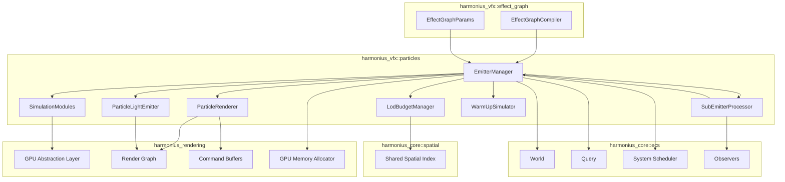
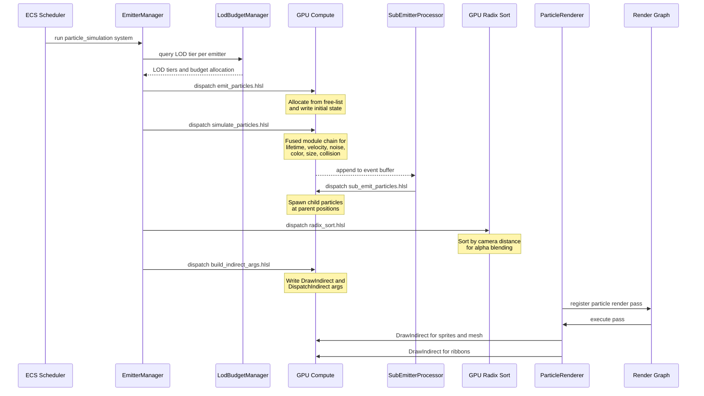
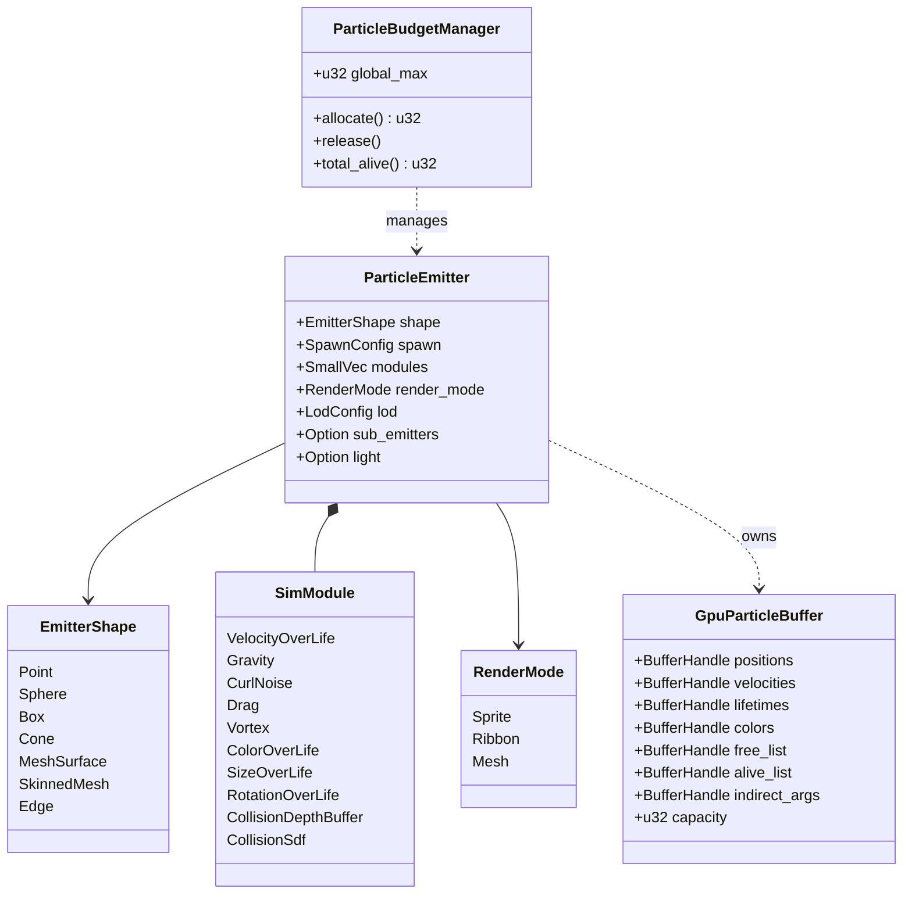
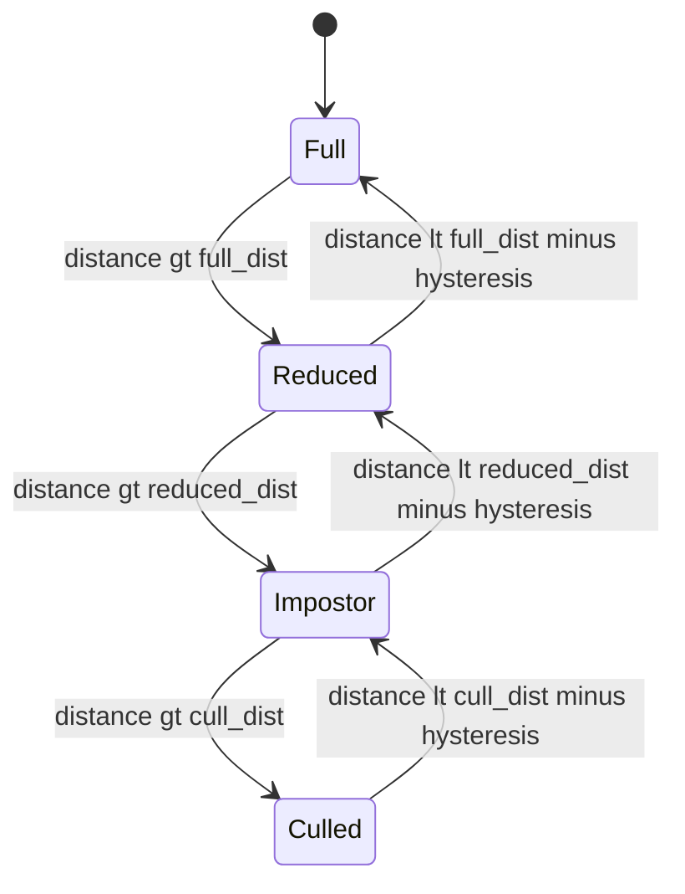
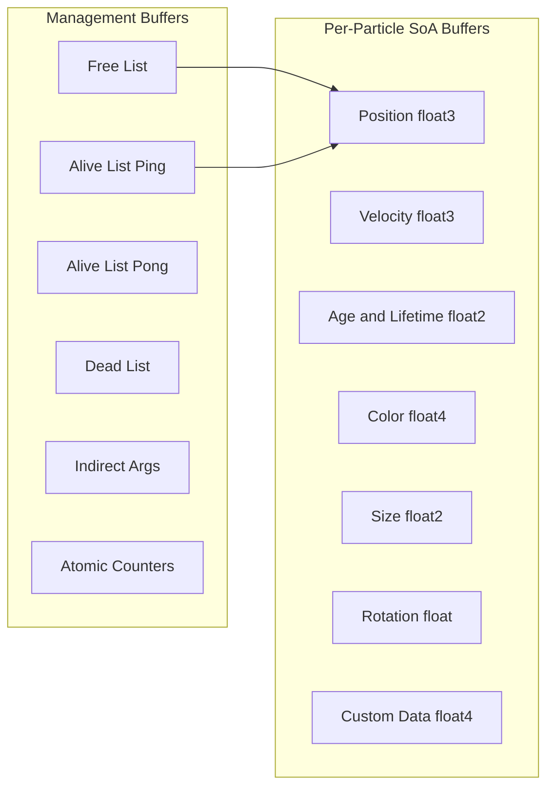
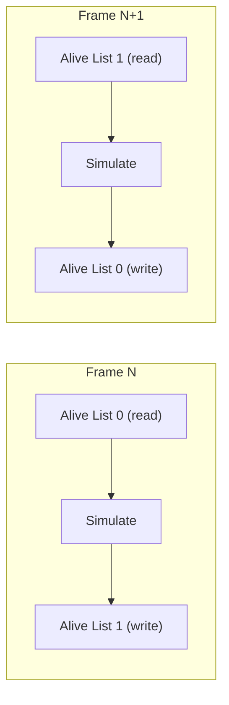

# GPU Particle System Design

## Requirements Trace

> **Canonical sources:** Features, requirements, and user stories are defined in
> [features/vfx/](../../features/vfx/), [requirements/vfx/](../../requirements/vfx/), and
> [user-stories/vfx/](../../user-stories/vfx/). The table below traces design elements to those
> definitions.

| Feature  | Requirement | User Stories                          |
|----------|-------------|---------------------------------------|
| F-11.1.1 | R-11.1.1    | US-11.1.1.1, US-11.1.1.2, US-11.1.1.3 |
| F-11.1.2 | R-11.1.2    | US-11.1.2.1, US-11.1.2.2, US-11.1.2.3 |
| F-11.1.3 | R-11.1.3    | US-11.1.3.1, US-11.1.3.2, US-11.1.3.3 |
| F-11.1.4 | R-11.1.4    | US-11.1.4.1, US-11.1.4.2, US-11.1.4.3 |
| F-11.1.5 | R-11.1.5    | US-11.1.5.1, US-11.1.5.2              |
| F-11.1.6 | R-11.1.6    | US-11.1.6.1, US-11.1.6.2              |
| F-11.1.7 | R-11.1.7    | US-11.1.7.1, US-11.1.7.2              |

1. **F-11.1.1** — GPU compute shader particle simulation with persistent buffers, free-list, and
   indirect dispatch
2. **F-11.1.2** — Composable per-particle simulation modules fused into single compute dispatch
3. **F-11.1.3** — Sprite billboard, ribbon, and mesh particle rendering modes
4. **F-11.1.4** — Hierarchical LOD, GPU radix sort, and global budget manager
5. **F-11.1.5** — Event-driven sub-emitter spawning on birth, death, collision, manual trigger
6. **F-11.1.6** — Particle-driven dynamic point lights into clustered light buffer
7. **F-11.1.7** — Grid-based Eulerian GPU fluid simulation with volumetric rendering

### Cross-Cutting Dependencies

| Dependency | Source | Consumed API |
|------------|--------|--------------|
| ECS world and queries | F-1.1.1 | `World`, `Query`, component storage |
| Change detection | F-1.1.22 | `Changed<T>` filter for dirty emitters |
| Observers | F-1.1.30 | Event-driven sub-emitter spawning |
| Shared spatial index | F-1.9.1 | BVH for LOD distance queries |
| GPU abstraction layer | F-2.1.1 | Backend trait, compute dispatch, buffer creation |
| Command buffers | F-2.1.2 | Compute and graphics command encoding |
| GPU memory allocator | F-2.1.7 | Sub-allocation for particle buffers |
| Render graph | F-2.2.1 | Pass registration for particle rendering |
| Async compute queues | F-2.2.6 | Overlap simulation with graphics |
| Clustered lighting | F-2.4.x | Light buffer injection for particle lights |
| Effect graph | F-11.6.1 | Visual authoring compiles to emitter configs |
| Scene transforms | F-1.2.4 | `GlobalTransform` for emitter world position |
| Thread pool | F-14.3.1 | Scoped tasks for CPU-side emitter updates |

## Overview

The GPU particle system simulates and renders millions of particles entirely on the GPU using
compute shaders. The CPU is responsible only for emitter lifecycle management, LOD evaluation, and
issuing compute dispatches. All per-particle state lives in persistent GPU buffers with free-list
allocation, and rendering uses GPU indirect draw to avoid CPU readback.

The design follows four principles:

1. **GPU-driven simulation.** All per-particle work runs in compute shaders. The CPU never reads
   particle data back. Emitters are entities with components; systems dispatch GPU work.
2. **Fused module pipeline.** Simulation modules (gravity, noise, collision, color-over-life) are
   compiled into a single compute dispatch per emitter, eliminating per-module dispatch overhead.
3. **Budget-aware LOD.** A global budget manager caps total alive particles per platform. LOD tiers
   reduce spawn rate and rendering cost at distance with hysteresis.
4. **No-code authoring.** The effect graph editor (F-11.6.1) compiles visual node graphs into the
   emitter configurations consumed by this system. Artists never write code or shaders.

### Performance Targets

| Metric | Target |
|--------|--------|
| Max alive particles (desktop) | 500K+ |
| Max alive particles (console) | 200K |
| Max alive particles (Switch) | 50K |
| Max alive particles (mobile) | 10K |
| Simulation throughput | 1M+ particles/frame at 60 fps |
| CPU overhead per emitter | < 5 us |
| GPU sort (100K particles) | < 0.5 ms |
| Warm-up (1 second) | < 50 ms |

## Architecture

### Module Boundaries



### File Layout

```text
harmonius_vfx/
├── particles/
│   ├── mod.rs            # Re-exports
│   ├── emitter.rs        # ParticleEmitter component,
│   │                     # EmitterShape, SpawnConfig
│   ├── modules.rs        # SimModule enum, module
│   │                     # configs, pipeline compiler
│   ├── gpu_buffers.rs    # GpuParticleBuffer,
│   │                     # free-list, alive/dead lists
│   ├── simulation.rs     # particle_simulation_system,
│   │                     # compute dispatch logic
│   ├── renderer.rs       # ParticleRenderer,
│   │                     # sprite/ribbon/mesh passes
│   ├── sorting.rs        # GPU radix sort dispatch
│   ├── lod.rs            # LodConfig, LodTier,
│   │                     # LodBudgetManager
│   ├── budget.rs         # ParticleBudgetManager,
│   │                     # per-platform caps
│   ├── sub_emitter.rs    # SubEmitterConfig,
│   │                     # SubEmitterProcessor
│   ├── light.rs          # ParticleLightConfig,
│   │                     # ParticleLightEmitter
│   ├── warm_up.rs        # WarmUpSimulator,
│   │                     # pre-simulation logic
│   ├── plugin.rs         # ParticlePlugin, system
│   │                     # registration and ordering
│   └── error.rs          # ParticleError variants
├── shaders/
│   ├── emit_particles.hlsl
│   ├── simulate_particles.hlsl
│   ├── sub_emit_particles.hlsl
│   ├── radix_sort.hlsl
│   ├── build_indirect_args.hlsl
│   ├── ribbon_geometry.hlsl
│   └── particle_common.hlsl
```

### GPU Simulation Pipeline



### Core Data Structures



### LOD State Machine

Emitters transition through four LOD tiers based on camera distance with hysteresis to prevent
popping.



| LOD Tier | Simulation | Spawn Rate | Rendering |
|----------|-----------|------------|-----------|
| Full | All modules | 100% | Full fidelity |
| Reduced | Core modules only | 25-50% | Simplified materials |
| Impostor | No simulation | 0% (existing only) | Billboard impostor |
| Culled | None | 0% | None |

### GPU Buffer Layout

Each emitter owns a contiguous GPU buffer set. Particle data uses a struct-of-arrays layout for
cache-efficient compute shader access.



## API Design

### Emitter Component

```rust
/// ECS component defining a particle emitter.
/// Attached to an entity with a GlobalTransform.
/// The effect graph editor produces these; artists
/// never construct them manually.
#[derive(Component, Clone, Debug, Reflect)]
pub struct ParticleEmitter {
    /// Spawn shape geometry.
    pub shape: EmitterShape,
    /// Spawn rate and lifetime configuration.
    pub spawn: SpawnConfig,
    /// Ordered chain of simulation modules.
    /// Compiled into a single GPU dispatch.
    pub modules: SmallVec<[SimModule; 8]>,
    /// How particles are rendered.
    pub render_mode: RenderMode,
    /// Distance-based LOD configuration.
    pub lod: LodConfig,
    /// Optional sub-emitter chain.
    pub sub_emitters: Option<SubEmitterConfig>,
    /// Optional particle light emission.
    pub light: Option<ParticleLightConfig>,
    /// Priority for budget allocation. Higher
    /// values are preserved when budget is tight.
    pub priority: u8,
    /// Whether to pre-simulate on spawn.
    pub warm_up: Option<WarmUpConfig>,
}

impl ParticleEmitter {
    pub fn new(shape: EmitterShape) -> Self {
        Self {
            shape,
            spawn: SpawnConfig::default(),
            modules: SmallVec::new(),
            render_mode: RenderMode::Sprite(
                SpriteConfig::default(),
            ),
            lod: LodConfig::default(),
            sub_emitters: None,
            light: None,
            priority: 128,
            warm_up: None,
        }
    }

    pub fn with_spawn(
        mut self,
        spawn: SpawnConfig,
    ) -> Self {
        self.spawn = spawn;
        self
    }

    pub fn with_module(
        mut self,
        module: SimModule,
    ) -> Self {
        self.modules.push(module);
        self
    }

    pub fn with_render_mode(
        mut self,
        mode: RenderMode,
    ) -> Self {
        self.render_mode = mode;
        self
    }

    pub fn with_lod(
        mut self,
        lod: LodConfig,
    ) -> Self {
        self.lod = lod;
        self
    }

    pub fn with_sub_emitters(
        mut self,
        config: SubEmitterConfig,
    ) -> Self {
        self.sub_emitters = Some(config);
        self
    }

    pub fn with_light(
        mut self,
        config: ParticleLightConfig,
    ) -> Self {
        self.light = Some(config);
        self
    }

    pub fn with_warm_up(
        mut self,
        config: WarmUpConfig,
    ) -> Self {
        self.warm_up = Some(config);
        self
    }
}
```

### Emitter Shape

```rust
/// Spatial region from which particles spawn.
#[derive(Clone, Debug, Reflect)]
pub enum EmitterShape {
    /// Single point at emitter origin.
    Point,
    /// Random point within a sphere.
    Sphere {
        radius: f32,
        /// Spawn on surface only.
        surface_only: bool,
    },
    /// Random point within an axis-aligned box.
    Box {
        half_extents: Vec3,
        /// Spawn on surface only.
        surface_only: bool,
    },
    /// Random point within a cone.
    Cone {
        angle: f32,
        radius: f32,
        length: f32,
    },
    /// Random point on a static mesh surface.
    /// Samples from the vertex buffer on GPU.
    MeshSurface {
        mesh: Handle<Mesh>,
    },
    /// Random point on an animated mesh surface.
    /// Samples skinned vertex buffer each frame.
    SkinnedMesh {
        mesh: Handle<Mesh>,
        skeleton: Entity,
    },
    /// Random point along an edge between two
    /// local-space positions.
    Edge {
        start: Vec3,
        end: Vec3,
    },
}
```

### Spawn Configuration

```rust
/// Controls particle emission rate and lifetime.
#[derive(Clone, Debug, Reflect)]
pub struct SpawnConfig {
    /// Continuous spawn rate.
    pub rate: SpawnRate,
    /// Minimum particle lifetime in seconds.
    pub lifetime_min: f32,
    /// Maximum particle lifetime in seconds.
    pub lifetime_max: f32,
    /// Maximum alive particles for this emitter.
    pub max_particles: u32,
    /// Burst entries for one-shot spawns.
    pub bursts: Vec<BurstEntry>,
    /// Initial velocity range (local space).
    pub initial_velocity_min: Vec3,
    /// Initial velocity range (local space).
    pub initial_velocity_max: Vec3,
    /// Inherit emitter velocity factor (0..1).
    pub inherit_velocity: f32,
}

/// Continuous emission rate.
#[derive(Clone, Debug, Reflect)]
pub enum SpawnRate {
    /// Fixed particles per second.
    Constant(f32),
    /// Particles per second driven by a curve
    /// over the emitter's normalized lifetime.
    OverLife(Curve<f32>),
    /// Distance-based emission: particles per
    /// unit of emitter world-space movement.
    PerDistance(f32),
}

/// A timed burst of particles.
#[derive(Clone, Debug, Reflect)]
pub struct BurstEntry {
    /// Time offset from emitter start (seconds).
    pub time: f32,
    /// Number of particles to emit.
    pub count: u32,
    /// Number of times to repeat. 0 = once.
    pub repeat_count: u32,
    /// Interval between repeats (seconds).
    pub repeat_interval: f32,
}

impl Default for SpawnConfig {
    fn default() -> Self {
        Self {
            rate: SpawnRate::Constant(100.0),
            lifetime_min: 1.0,
            lifetime_max: 2.0,
            max_particles: 1000,
            bursts: Vec::new(),
            initial_velocity_min: Vec3::ZERO,
            initial_velocity_max: Vec3::Y,
            inherit_velocity: 0.0,
        }
    }
}
```

### Simulation Modules

```rust
/// A composable per-particle simulation module.
/// Modules are evaluated in order on the GPU as
/// a fused compute dispatch per emitter.
#[derive(Clone, Debug, Reflect)]
pub enum SimModule {
    /// Apply constant or curved velocity over
    /// normalized particle lifetime.
    VelocityOverLife(Curve<Vec3>),

    /// Constant gravitational acceleration.
    Gravity(Vec3),

    /// Orbital velocity around the emitter
    /// origin.
    OrbitalVelocity {
        axis: Vec3,
        speed: Curve<f32>,
        radial_speed: Curve<f32>,
    },

    /// Curl noise displacement for organic
    /// motion (smoke, fire, magic).
    CurlNoise {
        frequency: f32,
        amplitude: f32,
        octaves: u32,
        scroll_speed: Vec3,
    },

    /// 3D vector field lookup for wind tunnels,
    /// force fields, and directional effects.
    VectorField {
        field: Handle<VectorFieldAsset>,
        strength: f32,
        world_space: bool,
    },

    /// Linear drag opposing velocity.
    Drag(f32),

    /// Vortex force around an axis.
    Vortex {
        axis: Vec3,
        strength: f32,
        pull: f32,
    },

    /// Multi-octave turbulence noise applied
    /// as force.
    Turbulence {
        frequency: f32,
        strength: f32,
        octaves: u32,
    },

    /// Attract toward or repel from a point.
    AttractRepel {
        target: AttractTarget,
        strength: f32,
        range: f32,
        falloff: Falloff,
    },

    /// Interpolate color over normalized
    /// particle lifetime.
    ColorOverLife(Gradient<Vec4>),

    /// Interpolate size over normalized
    /// particle lifetime.
    SizeOverLife(Curve<Vec2>),

    /// Interpolate rotation speed over
    /// normalized particle lifetime.
    RotationOverLife(Curve<f32>),

    /// Depth-buffer collision (screen-space).
    CollisionDepthBuffer {
        restitution: f32,
        friction: f32,
        lifetime_loss: f32,
        kill_on_collision: bool,
    },

    /// Signed-distance-field collision
    /// (world-space). Disabled on mobile.
    CollisionSdf {
        sdf: Handle<SdfAsset>,
        restitution: f32,
        friction: f32,
        lifetime_loss: f32,
        kill_on_collision: bool,
    },
}

/// Attraction target source.
#[derive(Clone, Debug, Reflect)]
pub enum AttractTarget {
    /// Attract to emitter origin.
    EmitterOrigin,
    /// Attract to a world-space position.
    WorldPosition(Vec3),
    /// Attract to another entity's position.
    Entity(Entity),
}

/// Distance falloff curve.
#[derive(Clone, Debug, Reflect)]
pub enum Falloff {
    Linear,
    InverseSquare,
    Custom(Curve<f32>),
}
```

### Render Modes

```rust
/// How particles are rendered.
#[derive(Clone, Debug, Reflect)]
pub enum RenderMode {
    /// Camera-facing billboard sprites.
    Sprite(SpriteConfig),
    /// Spline-based ribbon geometry connecting
    /// sequential particles.
    Ribbon(RibbonConfig),
    /// GPU-instanced mesh particles.
    Mesh(MeshParticleConfig),
}

/// Sprite billboard configuration.
#[derive(Clone, Debug, Reflect)]
pub struct SpriteConfig {
    /// Material (texture, blend mode).
    pub material: Handle<ParticleMaterial>,
    /// Flipbook animation atlas.
    pub flipbook: Option<FlipbookConfig>,
    /// Blend mode for compositing.
    pub blend_mode: ParticleBlendMode,
    /// Soft-particle depth fade distance.
    /// Set to 0 to disable.
    pub soft_fade_distance: f32,
    /// Billboard alignment mode.
    pub alignment: BillboardAlignment,
}

/// Flipbook atlas animation.
#[derive(Clone, Debug, Reflect)]
pub struct FlipbookConfig {
    /// Grid dimensions (columns x rows).
    pub grid: UVec2,
    /// Frames per second.
    pub fps: f32,
    /// Loop or clamp.
    pub loop_mode: FlipbookLoop,
}

#[derive(Clone, Copy, Debug, Reflect)]
pub enum FlipbookLoop {
    Loop,
    Clamp,
    PingPong,
}

#[derive(Clone, Copy, Debug, Reflect)]
pub enum ParticleBlendMode {
    Additive,
    Alpha,
    Premultiplied,
}

#[derive(Clone, Copy, Debug, Reflect)]
pub enum BillboardAlignment {
    /// Face camera (default).
    ViewFacing,
    /// Align to velocity direction.
    VelocityAligned,
    /// Align to a world axis.
    WorldAxis(Vec3),
}

/// Ribbon trail configuration.
#[derive(Clone, Debug, Reflect)]
pub struct RibbonConfig {
    /// Material for the ribbon strip.
    pub material: Handle<ParticleMaterial>,
    /// Maximum ribbon segment count.
    pub max_segments: u32,
    /// UV mode along ribbon length.
    pub uv_mode: RibbonUvMode,
    /// Width curve over ribbon length.
    pub width: Curve<f32>,
    /// Minimum distance between ribbon points
    /// before a new segment is added.
    pub min_segment_distance: f32,
    /// Catmull-Rom subdivision count.
    pub subdivisions: u32,
}

#[derive(Clone, Copy, Debug, Reflect)]
pub enum RibbonUvMode {
    /// UV stretches over entire ribbon.
    Stretch,
    /// UV tiles per world-space unit.
    Tile { units_per_tile: f32 },
}

/// Mesh particle configuration.
#[derive(Clone, Debug, Reflect)]
pub struct MeshParticleConfig {
    /// Mesh to instance per particle.
    pub mesh: Handle<Mesh>,
    /// Material applied to each instance.
    pub material: Handle<ParticleMaterial>,
    /// Per-particle LOD mesh variants.
    pub lod_meshes: Vec<LodMeshEntry>,
}

/// Mesh LOD entry for mesh particles.
#[derive(Clone, Debug, Reflect)]
pub struct LodMeshEntry {
    pub distance: f32,
    pub mesh: Handle<Mesh>,
}

impl Default for SpriteConfig {
    fn default() -> Self {
        Self {
            material: Handle::default(),
            flipbook: None,
            blend_mode: ParticleBlendMode::Additive,
            soft_fade_distance: 0.5,
            alignment: BillboardAlignment::ViewFacing,
        }
    }
}
```

### LOD and Budget

```rust
/// Per-emitter LOD distance thresholds.
#[derive(Clone, Debug, Reflect)]
pub struct LodConfig {
    /// Distance below which full simulation
    /// and rendering run.
    pub full_distance: f32,
    /// Distance at which spawn rate is reduced.
    pub reduced_distance: f32,
    /// Distance at which only billboard
    /// impostors remain.
    pub impostor_distance: f32,
    /// Distance at which the emitter is culled.
    pub cull_distance: f32,
    /// Hysteresis band width to prevent
    /// popping at tier boundaries.
    pub hysteresis: f32,
}

impl Default for LodConfig {
    fn default() -> Self {
        Self {
            full_distance: 30.0,
            reduced_distance: 60.0,
            impostor_distance: 100.0,
            cull_distance: 150.0,
            hysteresis: 5.0,
        }
    }
}

/// Current LOD tier for an emitter. Written by
/// the LOD evaluation system each frame.
#[derive(
    Component, Clone, Copy, Debug,
    PartialEq, Eq, Reflect,
)]
pub enum LodTier {
    /// Full simulation and rendering.
    Full,
    /// Reduced spawn rate, core modules only.
    Reduced,
    /// No new spawns, billboard impostor.
    Impostor,
    /// Completely culled.
    Culled,
}

/// Global particle budget manager. Caps total
/// alive particles and allocates per-emitter
/// budgets based on priority and LOD tier.
pub struct ParticleBudgetManager {
    /// Platform-specific global maximum.
    global_max: u32,
    /// Per-emitter budget allocations.
    allocations: Vec<BudgetAllocation>,
    /// Current total alive particle count.
    total_alive: u32,
}

struct BudgetAllocation {
    entity: Entity,
    priority: u8,
    lod_tier: LodTier,
    allocated: u32,
    alive: u32,
}

impl ParticleBudgetManager {
    pub fn new(
        platform: PlatformTier,
    ) -> Self {
        let global_max = match platform {
            PlatformTier::Mobile => 10_000,
            PlatformTier::Switch => 50_000,
            PlatformTier::Console => 200_000,
            PlatformTier::Desktop => 500_000,
        };
        Self {
            global_max,
            allocations: Vec::new(),
            total_alive: 0,
        }
    }

    /// Request a budget allocation for an
    /// emitter. Returns the number of particles
    /// granted (may be less than requested).
    pub fn allocate(
        &mut self,
        entity: Entity,
        priority: u8,
        lod_tier: LodTier,
        requested: u32,
    ) -> u32 {
        let remaining =
            self.global_max
                .saturating_sub(self.total_alive);
        let granted = requested.min(remaining);
        self.allocations.push(BudgetAllocation {
            entity,
            priority,
            lod_tier,
            allocated: granted,
            alive: 0,
        });
        self.total_alive += granted;
        granted
    }

    /// Release an emitter's budget allocation.
    pub fn release(&mut self, entity: Entity) {
        if let Some(idx) = self
            .allocations
            .iter()
            .position(|a| a.entity == entity)
        {
            let alloc =
                self.allocations.swap_remove(idx);
            self.total_alive -= alloc.alive;
        }
    }

    /// Rebalance budgets when over capacity.
    /// Culls lowest-priority emitters first.
    pub fn rebalance(&mut self) {
        self.allocations.sort_by(|a, b| {
            a.priority.cmp(&b.priority)
        });
        // Cull from lowest priority until under
        // budget. Higher LOD tiers culled first
        // within the same priority.
    }

    pub fn total_alive(&self) -> u32 {
        self.total_alive
    }

    pub fn global_max(&self) -> u32 {
        self.global_max
    }
}

#[derive(Clone, Copy, Debug, PartialEq, Eq)]
pub enum PlatformTier {
    Mobile,
    Switch,
    Console,
    Desktop,
}
```

**Note:** This `PlatformTier` enum uses `Console` instead of the canonical `HighEnd` variant. During
implementation, replace with the canonical `PlatformTier` from
[shared-primitives.md](../core-runtime/shared-primitives.md) which defines
`Mobile, Switch, Desktop, HighEnd`.

### GPU Particle Buffers

```rust
/// GPU-side particle data for one emitter.
/// Uses struct-of-arrays layout for
/// cache-efficient compute access.
pub struct GpuParticleBuffer {
    /// Per-particle position (float3).
    pub positions: BufferHandle,
    /// Per-particle velocity (float3).
    pub velocities: BufferHandle,
    /// Per-particle (age, max_lifetime) (float2).
    pub lifetimes: BufferHandle,
    /// Per-particle color (float4).
    pub colors: BufferHandle,
    /// Per-particle size (float2).
    pub sizes: BufferHandle,
    /// Per-particle rotation (float).
    pub rotations: BufferHandle,
    /// Per-particle user data (float4).
    pub custom_data: BufferHandle,
    /// Free-list of available particle indices.
    pub free_list: BufferHandle,
    /// Double-buffered alive list (ping-pong).
    pub alive_lists: [BufferHandle; 2],
    /// Dead list populated during simulation.
    pub dead_list: BufferHandle,
    /// Indirect dispatch/draw arguments.
    pub indirect_args: BufferHandle,
    /// Atomic counters (alive, dead, emit).
    pub counters: BufferHandle,
    /// Maximum particle capacity.
    pub capacity: u32,
    /// Current ping-pong index (0 or 1).
    pub alive_list_index: u32,
}

impl GpuParticleBuffer {
    /// Allocate all GPU buffers for an emitter
    /// with the given capacity.
    pub fn allocate<B: GpuBackend>(
        device: &B::Device,
        allocator: &GpuAllocator<B>,
        capacity: u32,
    ) -> Result<Self, ParticleError> {
        let positions = allocator.create_buffer(
            device,
            BufferDesc {
                size: capacity as u64 * 12,
                usage: BufferUsage::STORAGE
                    | BufferUsage::VERTEX,
                memory: MemoryLocation::GpuOnly,
            },
        )?;
        let velocities = allocator.create_buffer(
            device,
            BufferDesc {
                size: capacity as u64 * 12,
                usage: BufferUsage::STORAGE,
                memory: MemoryLocation::GpuOnly,
            },
        )?;
        let lifetimes = allocator.create_buffer(
            device,
            BufferDesc {
                size: capacity as u64 * 8,
                usage: BufferUsage::STORAGE,
                memory: MemoryLocation::GpuOnly,
            },
        )?;
        let colors = allocator.create_buffer(
            device,
            BufferDesc {
                size: capacity as u64 * 16,
                usage: BufferUsage::STORAGE
                    | BufferUsage::VERTEX,
                memory: MemoryLocation::GpuOnly,
            },
        )?;
        let sizes = allocator.create_buffer(
            device,
            BufferDesc {
                size: capacity as u64 * 8,
                usage: BufferUsage::STORAGE
                    | BufferUsage::VERTEX,
                memory: MemoryLocation::GpuOnly,
            },
        )?;
        let rotations = allocator.create_buffer(
            device,
            BufferDesc {
                size: capacity as u64 * 4,
                usage: BufferUsage::STORAGE
                    | BufferUsage::VERTEX,
                memory: MemoryLocation::GpuOnly,
            },
        )?;
        let custom_data = allocator.create_buffer(
            device,
            BufferDesc {
                size: capacity as u64 * 16,
                usage: BufferUsage::STORAGE,
                memory: MemoryLocation::GpuOnly,
            },
        )?;
        let free_list = allocator.create_buffer(
            device,
            BufferDesc {
                size: capacity as u64 * 4,
                usage: BufferUsage::STORAGE,
                memory: MemoryLocation::GpuOnly,
            },
        )?;
        let alive_list_0 =
            allocator.create_buffer(
                device,
                BufferDesc {
                    size: capacity as u64 * 4,
                    usage: BufferUsage::STORAGE,
                    memory:
                        MemoryLocation::GpuOnly,
                },
            )?;
        let alive_list_1 =
            allocator.create_buffer(
                device,
                BufferDesc {
                    size: capacity as u64 * 4,
                    usage: BufferUsage::STORAGE,
                    memory:
                        MemoryLocation::GpuOnly,
                },
            )?;
        let dead_list = allocator.create_buffer(
            device,
            BufferDesc {
                size: capacity as u64 * 4,
                usage: BufferUsage::STORAGE,
                memory: MemoryLocation::GpuOnly,
            },
        )?;
        let indirect_args =
            allocator.create_buffer(
                device,
                BufferDesc {
                    size: 64, // dispatch + draw
                    usage: BufferUsage::STORAGE
                        | BufferUsage::INDIRECT,
                    memory:
                        MemoryLocation::GpuOnly,
                },
            )?;
        let counters = allocator.create_buffer(
            device,
            BufferDesc {
                size: 16, // 4 x u32 counters
                usage: BufferUsage::STORAGE,
                memory: MemoryLocation::GpuOnly,
            },
        )?;

        Ok(Self {
            positions,
            velocities,
            lifetimes,
            colors,
            sizes,
            rotations,
            custom_data,
            free_list,
            alive_lists: [
                alive_list_0,
                alive_list_1,
            ],
            dead_list,
            indirect_args,
            counters,
            capacity,
            alive_list_index: 0,
        })
    }

    /// Swap alive list ping-pong buffers.
    pub fn swap_alive_lists(&mut self) {
        self.alive_list_index =
            1 - self.alive_list_index;
    }

    /// Current alive list (read).
    pub fn current_alive_list(
        &self,
    ) -> BufferHandle {
        self.alive_lists
            [self.alive_list_index as usize]
    }

    /// Next alive list (write target).
    pub fn next_alive_list(
        &self,
    ) -> BufferHandle {
        self.alive_lists
            [(1 - self.alive_list_index) as usize]
    }
}
```

### Sub-Emitters

```rust
/// Configuration for event-driven child emitter
/// spawning.
#[derive(Clone, Debug, Reflect)]
pub struct SubEmitterConfig {
    /// Sub-emitter definitions, keyed by
    /// triggering event.
    pub entries: Vec<SubEmitterEntry>,
}

/// A single sub-emitter trigger.
#[derive(Clone, Debug, Reflect)]
pub struct SubEmitterEntry {
    /// Event that triggers child emission.
    pub trigger: SubEmitterTrigger,
    /// The child emitter to spawn.
    pub emitter: ParticleEmitter,
    /// How many child particles per event.
    pub count: u32,
    /// Inherit parent velocity factor (0..1).
    pub inherit_velocity: f32,
}

/// Events that trigger sub-emitter spawning.
#[derive(Clone, Copy, Debug, Reflect)]
pub enum SubEmitterTrigger {
    /// Parent particle was born.
    Birth,
    /// Parent particle died (lifetime expired).
    Death,
    /// Parent particle collided.
    Collision,
    /// Manual trigger from gameplay logic.
    Manual,
}
```

### Particle Lights

```rust
/// Configuration for particle-driven dynamic
/// point lights injected into the clustered
/// light buffer.
#[derive(Clone, Debug, Reflect)]
pub struct ParticleLightConfig {
    /// Light color multiplied by particle color.
    pub color_multiplier: Vec3,
    /// Base light intensity.
    pub intensity: f32,
    /// Intensity curve over particle lifetime.
    pub intensity_over_life: Option<Curve<f32>>,
    /// Attenuation radius.
    pub radius: f32,
    /// Maximum lights per emitter (platform
    /// caps override if lower).
    pub max_lights: u32,
}
```

### Warm-Up

```rust
/// Pre-simulation configuration for emitters
/// that need to appear mid-effect on first
/// visibility.
#[derive(Clone, Debug, Reflect)]
pub struct WarmUpConfig {
    /// Duration to pre-simulate (seconds).
    pub duration: f32,
    /// Fixed time step for warm-up simulation.
    pub time_step: f32,
}
```

### GPU Radix Sort

```rust
/// GPU radix sort for transparent particle
/// ordering by camera distance.
pub struct GpuParticleSort {
    /// Sort key buffer (distance as u32).
    sort_keys: BufferHandle,
    /// Sort value buffer (particle index).
    sort_values: BufferHandle,
    /// Intermediate prefix sum buffers.
    prefix_sum: [BufferHandle; 2],
    /// Histogram buffer.
    histogram: BufferHandle,
}

/// Per-emitter sort mode.
#[derive(
    Clone, Copy, Debug, PartialEq, Eq, Reflect,
)]
pub enum ParticleSortMode {
    /// No sorting (additive blend).
    None,
    /// Sort back-to-front by camera distance.
    BackToFront,
    /// Sort front-to-back (for depth pre-pass).
    FrontToBack,
    /// Sort by age (oldest first).
    OldestFirst,
    /// Sort by age (youngest first).
    YoungestFirst,
}

impl GpuParticleSort {
    /// Allocate sort buffers for the given
    /// maximum particle count.
    pub fn allocate<B: GpuBackend>(
        device: &B::Device,
        allocator: &GpuAllocator<B>,
        max_particles: u32,
    ) -> Result<Self, ParticleError>;

    /// Dispatch GPU radix sort. Records compute
    /// commands into the provided command buffer.
    pub fn dispatch_sort<B: GpuBackend>(
        &self,
        cmd: &mut B::CommandBuffer,
        alive_list: BufferHandle,
        positions: BufferHandle,
        camera_pos: Vec3,
        alive_count: BufferHandle,
    );
}
```

### Simulation System

```rust
/// ECS system that runs GPU particle simulation
/// each frame. Scheduled in the PostUpdate phase
/// after transform propagation.
pub fn particle_simulation_system<B: GpuBackend>(
    emitters: Query<(
        Entity,
        &ParticleEmitter,
        &GlobalTransform,
        &mut GpuParticleBuffer,
        &LodTier,
    )>,
    budget: Res<ParticleBudgetManager>,
    device: Res<B::Device>,
    cmd_pool: Res<CommandPool<B>>,
    sort_resources: Res<GpuParticleSort>,
    camera: Res<ActiveCamera>,
    time: Res<Time>,
) {
    let mut cmd = cmd_pool.allocate_compute();
    let dt = time.delta_seconds();

    for (
        entity, emitter, transform, mut buffers,
        lod_tier,
    ) in emitters.iter_mut()
    {
        if *lod_tier == LodTier::Culled {
            continue;
        }

        // --- Phase 1: Emit new particles ---
        let emit_count = compute_emit_count(
            emitter, *lod_tier, dt,
            &budget, entity,
        );
        if emit_count > 0 {
            dispatch_emit(
                &mut cmd, &buffers, emitter,
                transform, emit_count,
            );
        }

        // --- Phase 2: Simulate alive particles ---
        dispatch_simulate(
            &mut cmd, &buffers, emitter,
            transform, dt,
        );

        // --- Phase 3: Sub-emitter events ---
        if emitter.sub_emitters.is_some() {
            dispatch_sub_emit(
                &mut cmd, &buffers, emitter,
            );
        }

        // --- Phase 4: Sort (if needed) ---
        let sort_mode = match &emitter.render_mode
        {
            RenderMode::Sprite(c)
                if c.blend_mode
                    != ParticleBlendMode::Additive
                => ParticleSortMode::BackToFront,
            _ => ParticleSortMode::None,
        };
        if sort_mode != ParticleSortMode::None {
            sort_resources.dispatch_sort(
                &mut cmd,
                buffers.current_alive_list(),
                buffers.positions,
                camera.position(),
                buffers.counters,
            );
        }

        // --- Phase 5: Build indirect args ---
        dispatch_build_indirect(
            &mut cmd, &buffers,
            &emitter.render_mode,
        );

        buffers.swap_alive_lists();
    }

    cmd_pool.submit_compute(cmd);
}
```

### Render Pass Registration

```rust
/// Particle render pass registered with the
/// render graph. Executes after the main opaque
/// pass and before post-processing.
pub struct ParticleRenderPass<B: GpuBackend> {
    _marker: PhantomData<B>,
}

impl<B: GpuBackend> RenderPass<B>
    for ParticleRenderPass<B>
{
    fn name(&self) -> &'static str {
        "particle_render"
    }

    fn queue(&self) -> QueueType {
        QueueType::Graphics
    }

    fn reads(&self) -> &[ResourceId] {
        &[
            ResourceId::DEPTH_BUFFER,
            ResourceId::PARTICLE_BUFFERS,
        ]
    }

    fn writes(&self) -> &[ResourceId] {
        &[ResourceId::COLOR_TARGET]
    }

    fn execute(
        &self,
        cmd: &mut B::CommandBuffer,
        resources: &PassResources<B>,
        world: &World,
    ) {
        let emitters = world.query::<(
            &ParticleEmitter,
            &GpuParticleBuffer,
            &LodTier,
        )>();

        for (emitter, buffers, lod_tier) in
            emitters.iter()
        {
            if *lod_tier == LodTier::Culled {
                continue;
            }

            match &emitter.render_mode {
                RenderMode::Sprite(config) => {
                    render_sprites(
                        cmd, buffers, config,
                        resources,
                    );
                }
                RenderMode::Ribbon(config) => {
                    render_ribbons(
                        cmd, buffers, config,
                        resources,
                    );
                }
                RenderMode::Mesh(config) => {
                    render_mesh_particles(
                        cmd, buffers, config,
                        resources,
                    );
                }
            }
        }
    }
}

/// Render sprite particles via indirect draw.
fn render_sprites<B: GpuBackend>(
    cmd: &mut B::CommandBuffer,
    buffers: &GpuParticleBuffer,
    config: &SpriteConfig,
    resources: &PassResources<B>,
) {
    cmd.set_pipeline(
        &resources.sprite_pipeline,
    );
    cmd.bind_vertex_buffer(
        0, buffers.positions,
    );
    cmd.bind_vertex_buffer(1, buffers.colors);
    cmd.bind_vertex_buffer(2, buffers.sizes);
    cmd.bind_vertex_buffer(3, buffers.rotations);
    cmd.draw_indirect(
        buffers.indirect_args,
        0, // offset for draw args
    );
}

/// Render ribbon particles. Ribbon geometry is
/// generated in a compute pass from sequential
/// particle positions.
fn render_ribbons<B: GpuBackend>(
    cmd: &mut B::CommandBuffer,
    buffers: &GpuParticleBuffer,
    config: &RibbonConfig,
    resources: &PassResources<B>,
) {
    cmd.set_pipeline(
        &resources.ribbon_pipeline,
    );
    cmd.bind_storage_buffer(
        0, buffers.positions,
    );
    cmd.bind_storage_buffer(1, buffers.colors);
    cmd.draw_indirect(
        buffers.indirect_args,
        16, // offset for ribbon draw args
    );
}

/// Render mesh particles via instanced
/// indirect draw.
fn render_mesh_particles<B: GpuBackend>(
    cmd: &mut B::CommandBuffer,
    buffers: &GpuParticleBuffer,
    config: &MeshParticleConfig,
    resources: &PassResources<B>,
) {
    cmd.set_pipeline(
        &resources.mesh_particle_pipeline,
    );
    cmd.bind_vertex_buffer(
        0, resources.mesh_vertex_buffer,
    );
    cmd.bind_storage_buffer(
        0, buffers.positions,
    );
    cmd.bind_storage_buffer(1, buffers.rotations);
    cmd.bind_storage_buffer(2, buffers.sizes);
    cmd.bind_storage_buffer(3, buffers.colors);
    cmd.draw_indexed_indirect(
        buffers.indirect_args,
        32, // offset for mesh draw args
    );
}
```

### Warm-Up Simulator

```rust
/// Pre-simulates an emitter to the specified
/// duration so it appears mid-effect when first
/// visible. Runs as a burst of compute
/// dispatches at emitter creation time.
pub struct WarmUpSimulator;

impl WarmUpSimulator {
    /// Run warm-up simulation for an emitter.
    /// Issues multiple simulation steps in a
    /// single command buffer.
    pub fn warm_up<B: GpuBackend>(
        device: &B::Device,
        cmd_pool: &CommandPool<B>,
        emitter: &ParticleEmitter,
        buffers: &mut GpuParticleBuffer,
        transform: &GlobalTransform,
        config: &WarmUpConfig,
    ) {
        let steps = (config.duration
            / config.time_step)
            .ceil() as u32;
        let mut cmd =
            cmd_pool.allocate_compute();

        for _ in 0..steps {
            let emit_count = compute_emit_count(
                emitter,
                LodTier::Full,
                config.time_step,
                // No budget limit during warm-up.
                &ParticleBudgetManager::unlimited(),
                Entity::PLACEHOLDER,
            );
            dispatch_emit(
                &mut cmd, buffers, emitter,
                transform, emit_count,
            );
            dispatch_simulate(
                &mut cmd, buffers, emitter,
                transform, config.time_step,
            );
            buffers.swap_alive_lists();
        }

        cmd_pool.submit_compute(cmd);
    }
}
```

### Particle Plugin

```rust
/// ECS plugin that registers all particle
/// systems, components, and resources.
pub struct ParticlePlugin {
    pub platform: PlatformTier,
}

impl Plugin for ParticlePlugin {
    fn build(&self, app: &mut App) {
        app.register_component::<ParticleEmitter>();
        app.register_component::<LodTier>();
        app.register_component::<GpuParticleBuffer>();

        app.insert_resource(
            ParticleBudgetManager::new(
                self.platform,
            ),
        );
        app.insert_resource(
            GpuParticleSort::default(),
        );

        // PostUpdate phase, after transform
        // propagation.
        app.add_system(
            particle_lod_system
                .in_phase(PostUpdate)
                .before(particle_simulation_system),
        );
        app.add_system(
            particle_simulation_system
                .in_phase(PostUpdate)
                .after(propagate_transforms),
        );
        app.add_system(
            particle_light_system
                .in_phase(PostUpdate)
                .after(particle_simulation_system),
        );

        // Register render pass.
        app.add_render_pass(
            ParticleRenderPass::new(),
        );
    }
}
```

### Error Types

```rust
/// Errors produced by the particle system.
#[derive(Debug)]
pub enum ParticleError {
    /// GPU buffer allocation failed.
    BufferAllocationFailed {
        required_bytes: u64,
    },
    /// Emitter capacity exceeds platform budget.
    ExceedsBudget {
        requested: u32,
        available: u32,
    },
    /// Invalid module configuration.
    InvalidModule {
        module: &'static str,
        reason: &'static str,
    },
    /// Shader compilation failed.
    ShaderCompilationFailed {
        shader: &'static str,
        error: String,
    },
    /// Sub-emitter depth exceeds platform limit.
    SubEmitterDepthExceeded {
        depth: u32,
        max_depth: u32,
    },
}
```

## Data Flow

### Per-Frame Simulation Pipeline

The particle system runs in the ECS `PostUpdate` phase after transform propagation ensures emitter
world positions are current.

```rust
// Phase ordering within PostUpdate:
//
// 1. propagate_transforms (scene)
// 2. particle_lod_system
// 3. particle_simulation_system
//    a. Emit (compute)
//    b. Simulate (compute)
//    c. Sub-emit (compute)
//    d. Sort (compute)
//    e. Build indirect args (compute)
// 4. particle_light_system
// 5. Render graph executes particle_render pass
```

### Emit Phase (GPU)

1. Read emitter spawn config and LOD-adjusted spawn count from a constant buffer.
2. Atomically pop indices from the free list.
3. Initialize particle state (position from shape, velocity from config, random lifetime within
   range, initial color/size).
4. Append new indices to the alive list.

### Simulate Phase (GPU)

1. For each alive particle (thread per particle):
   - Increment age by `dt`.
   - If `age >= lifetime`, append to dead list and write to event buffer (death event).
   - Otherwise, evaluate fused module chain in order: velocity, gravity, noise, drag, color, size,
     rotation, collision.
   - If collision detected, write to event buffer (collision event).
   - Append to next alive list.
2. Dead particles' indices return to the free list.

### Sub-Emit Phase (GPU)

1. Read the event buffer written during simulate.
2. For each death/collision/birth event, spawn child particles at the parent position with inherited
   velocity.
3. Child particles go into the sub-emitter's own `GpuParticleBuffer`.

### Sort Phase (GPU)

1. Compute sort key = float-to-uint distance from camera for each alive particle.
2. GPU radix sort (8-bit passes, 4 passes for 32-bit keys) on the alive list.
3. Sorted alive list used for draw order.

### Build Indirect Args Phase (GPU)

1. Read alive count from atomic counter.
2. Write `DrawIndirectArgs` for sprites (vertex_count = alive * 4 for quads).
3. Write `DrawIndexedIndirectArgs` for mesh particles.
4. Write `DispatchIndirectArgs` for next frame's simulate dispatch.

### Render Phase

1. Render graph executes `particle_render` pass after the opaque pass.
2. For each emitter:
   - Sprites: vertex shader expands quads from particle position/size/rotation. Fragment shader
     samples flipbook atlas, applies blend mode and soft depth fade.
   - Ribbons: compute shader builds Catmull-Rom spline geometry from sequential positions. Draw the
     generated triangle strip.
   - Mesh particles: instanced draw with per-instance position/rotation/size/color from storage
     buffers.
3. Transparent particles are rendered after opaques and before post-processing.

### Alive List Ping-Pong

The system double-buffers the alive list. Each frame, simulate reads from the current alive list and
writes survivors to the next alive list. This avoids read-write hazards within a single compute
dispatch.



## Platform Considerations

### GPU Backend Mapping

| Operation        | D3D12                              | Vulkan                            |
|------------------|------------------------------------|-----------------------------------|
| Compute dispatch | `Dispatch` on compute command list | `vkCmdDispatch` on compute queue  |
| Indirect draw    | `ExecuteIndirect`                  | `vkCmdDrawIndirect`               |
| Buffer barriers  | `ResourceBarrier` UAV              | `vkCmdPipelineBarrier`            |
| Atomic counters  | `InterlockedAdd` in HLSL           | `atomicAdd` in SPIR-V (from HLSL) |
| Async compute    | Separate compute queue             | Separate queue family             |

1. **Compute dispatch** — `dispatchThreadgroups` on compute encoder
2. **Indirect draw** — `drawPrimitives(indirectBuffer:)`
3. **Buffer barriers** — Automatic hazard tracking
4. **Atomic counters** — `atomic_fetch_add` (from MSL via shader converter)
5. **Async compute** — Shared or private command queue

### Platform-Specific Behavior

| Feature | Desktop | Console | Switch | Mobile |
|---------|---------|---------|--------|--------|
| Global particle budget | 500K+ | 200K | 50K | 10K |
| SDF collision | Yes | Yes | Yes | Disabled |
| Curl noise | Yes | Yes | Reduced | Disabled |
| Turbulence octaves | 4 | 4 | 2 | 1 |
| Vector field resolution | 128^3 | 128^3 | 64^3 | 32^3 |
| Sub-emitter max depth | 4 | 3 | 2 | 1 |
| Particle lights per emitter | 16 | 12 | 8 | 4 |
| Soft-particle depth fade | Yes | Yes | Yes | Low-end disabled |
| Mesh particle LOD tiers | 4 | 3 | 2 | 1 |
| GPU radix sort | Full | Full | Reduced (16-bit keys) | Disabled (age sort only) |

### Async Compute Scheduling

Particle simulation runs on the async compute queue when available, overlapping with the previous
frame's graphics work. On GPUs without async compute (some mobile), simulation falls back to the
graphics queue.

```mermaid
gantt
    title Frame GPU Timeline
    dateFormat X
    axisFormat %s

    section Graphics Queue
    Opaque Pass        : g1, 0, 6
    Particle Render    : g2, 6, 8
    Post-Processing    : g3, 8, 10

    section Async Compute
    Particle Simulate  : c1, 0, 4
    Particle Sort      : c2, 4, 5
    Build Indirect     : c3, 5, 6
```



### Shader Pipeline

All particle shaders are authored in HLSL (the project's sole shader IL). The build pipeline
compiles them:

1. **HLSL source** authored per-module.
2. **DXC** compiles HLSL to DXIL (D3D12) and SPIR-V (Vulkan) via cxx.rs bridge.
3. **Metal Shader Converter** transpiles DXIL to MSL (Metal) via cxx.rs bridge.
4. Effect graph compiler generates specialized HLSL by concatenating selected module functions into
   a single entry point.

### Module Fusion

The effect graph compiler fuses selected simulation modules into a single compute shader entry point
per emitter. This eliminates per-module dispatch overhead and enables the HLSL compiler to optimize
across module boundaries.

```text
// Generated fused shader (pseudocode):
[numthreads(256, 1, 1)]
void SimulateParticles(uint3 id : SV_DispatchThreadID) {
    uint idx = alive_list[id.x];
    float3 pos = positions[idx];
    float3 vel = velocities[idx];
    float  age = lifetimes[idx].x;

    // --- Module: Gravity ---
    vel += gravity * dt;

    // --- Module: CurlNoise ---
    vel += curl_noise(pos, time) * amplitude;

    // --- Module: Drag ---
    vel *= (1.0 - drag * dt);

    // --- Module: ColorOverLife ---
    float t = age / lifetimes[idx].y;
    colors[idx] = sample_gradient(color_gradient, t);

    // --- Module: SizeOverLife ---
    sizes[idx] = sample_curve(size_curve, t);

    // --- Module: CollisionDepthBuffer ---
    if (depth_test(pos, vel, dt)) {
        vel = reflect_and_damp(vel, restitution, friction);
        append_event(EVENT_COLLISION, idx);
    }

    pos += vel * dt;
    positions[idx] = pos;
    velocities[idx] = vel;
}
```

## Test Plan

### Unit Tests

| Test                                | Req      |
|-------------------------------------|----------|
| `test_emit_point_shape`             | R-11.1.1 |
| `test_emit_sphere_surface`          | R-11.1.1 |
| `test_emit_box_volume`              | R-11.1.1 |
| `test_emit_cone`                    | R-11.1.1 |
| `test_emit_mesh_surface`            | R-11.1.1 |
| `test_emit_skinned_mesh`            | R-11.1.1 |
| `test_free_list_allocation`         | R-11.1.1 |
| `test_indirect_dispatch_args`       | R-11.1.1 |
| `test_gravity_module`               | R-11.1.2 |
| `test_curl_noise_module`            | R-11.1.2 |
| `test_drag_module`                  | R-11.1.2 |
| `test_color_over_life`              | R-11.1.2 |
| `test_size_over_life`               | R-11.1.2 |
| `test_rotation_over_life`           | R-11.1.2 |
| `test_depth_buffer_collision`       | R-11.1.2 |
| `test_sdf_collision`                | R-11.1.2 |
| `test_fused_module_dispatch`        | R-11.1.2 |
| `test_sprite_billboard`             | R-11.1.3 |
| `test_flipbook_animation`           | R-11.1.3 |
| `test_soft_depth_fade`              | R-11.1.3 |
| `test_ribbon_connectivity`          | R-11.1.3 |
| `test_ribbon_catmull_rom`           | R-11.1.3 |
| `test_mesh_particle_instancing`     | R-11.1.3 |
| `test_lod_tier_transitions`         | R-11.1.4 |
| `test_lod_hysteresis`               | R-11.1.4 |
| `test_budget_cap_enforced`          | R-11.1.4 |
| `test_budget_priority_cull`         | R-11.1.4 |
| `test_radix_sort_correctness`       | R-11.1.4 |
| `test_sub_emitter_death`            | R-11.1.5 |
| `test_sub_emitter_collision`        | R-11.1.5 |
| `test_sub_emitter_inherit_velocity` | R-11.1.5 |
| `test_sub_emitter_depth_limit`      | R-11.1.5 |
| `test_particle_light_injection`     | R-11.1.6 |
| `test_particle_light_cap`           | R-11.1.6 |
| `test_warm_up_particle_count`       | R-11.1.1 |

1. **`test_emit_point_shape`** — Point emitter spawns particles at origin. Verify GPU buffer write.
2. **`test_emit_sphere_surface`** — Sphere surface emitter spawns at radius distance from origin.
3. **`test_emit_box_volume`** — Box emitter spawns within half-extent bounds.
4. **`test_emit_cone`** — Cone emitter spawns within angle and radius constraints.
5. **`test_emit_mesh_surface`** — Mesh surface emitter samples vertex buffer positions.
6. **`test_emit_skinned_mesh`** — Skinned mesh emitter samples animated vertex positions.
7. **`test_free_list_allocation`** — Emit then kill particles; verify free-list indices are
   recycled.
8. **`test_indirect_dispatch_args`** — Verify dispatch args match alive count after simulation.
9. **`test_gravity_module`** — Particle velocity increases by gravity * dt each frame.
10. **`test_curl_noise_module`** — Curl noise displaces particles; verify divergence-free motion.
11. **`test_drag_module`** — Drag reduces velocity toward zero over time.
12. **`test_color_over_life`** — Color matches gradient sample at normalized age.
13. **`test_size_over_life`** — Size matches curve sample at normalized age.
14. **`test_rotation_over_life`** — Rotation speed matches curve at normalized age.
15. **`test_depth_buffer_collision`** — Particle bounces off depth buffer with configured
    restitution.
16. **`test_sdf_collision`** — Particle bounces off SDF surface; disabled on mobile config.
17. **`test_fused_module_dispatch`** — All modules execute in single dispatch per emitter.
18. **`test_sprite_billboard`** — Sprite quads face camera from multiple angles.
19. **`test_flipbook_animation`** — Flipbook UV progresses at configured FPS.
20. **`test_soft_depth_fade`** — Alpha fades near depth buffer intersections.
21. **`test_ribbon_connectivity`** — Ribbon segments connect sequential particles without gaps.
22. **`test_ribbon_catmull_rom`** — Subdivided ribbon follows Catmull-Rom spline.
23. **`test_mesh_particle_instancing`** — Mesh particles render with correct per-instance
    transforms.
24. **`test_lod_tier_transitions`** — Emitter transitions through all 4 LOD tiers at correct
    distances.
25. **`test_lod_hysteresis`** — Tier does not oscillate at boundary distance.
26. **`test_budget_cap_enforced`** — Total alive never exceeds global_max per platform.
27. **`test_budget_priority_cull`** — Low-priority emitters culled before high-priority.
28. **`test_radix_sort_correctness`** — Sorted alive list is in back-to-front distance order.
29. **`test_sub_emitter_death`** — Child particles spawn at parent death position.
30. **`test_sub_emitter_collision`** — Child particles spawn at collision position with reflected
    velocity.
31. **`test_sub_emitter_inherit_velocity`** — Child particles inherit parent velocity at configured
    factor.
32. **`test_sub_emitter_depth_limit`** — Mobile limits sub-emitter depth to 1; desktop allows 4.
33. **`test_particle_light_injection`** — Particle lights appear in clustered light buffer.
34. **`test_particle_light_cap`** — Per-emitter light count does not exceed platform cap.
35. **`test_warm_up_particle_count`** — After warm-up, alive count matches expected spawn rate *
    duration.

### Integration Tests

| Test                              | Req      |
|-----------------------------------|----------|
| `test_async_compute_overlap`      | R-11.1.1 |
| `test_graphics_queue_fallback`    | R-11.1.1 |
| `test_40_player_raid_budget`      | R-11.1.4 |
| `test_effect_graph_compile`       | R-11.1.2 |
| `test_platform_tier_configs`      | R-11.1.4 |
| `test_cascading_sub_emitters`     | R-11.1.5 |
| `test_ribbon_moving_emitter`      | R-11.1.3 |
| `test_warm_up_visual_parity`      | R-11.1.1 |
| `test_depth_collision_all_angles` | R-11.1.2 |
| `test_particle_lights_raid`       | R-11.1.6 |

1. **`test_async_compute_overlap`** — Particle simulation overlaps with graphics on async compute
   queue.
2. **`test_graphics_queue_fallback`** — Simulation runs correctly when async compute is disabled.
3. **`test_40_player_raid_budget`** — 40 emitters with full modules; budget caps particles; frame
   rate stable.
4. **`test_effect_graph_compile`** — Effect graph with all module types compiles to valid fused
   shader.
5. **`test_platform_tier_configs`** — Budget, LOD distances, and module availability match each
   PlatformTier.
6. **`test_cascading_sub_emitters`** — Firework: burst -> death sub-emit -> color sparks. Full chain
   executes.
7. **`test_ribbon_moving_emitter`** — Ribbon trail follows moving entity without discontinuities.
8. **`test_warm_up_visual_parity`** — Warm-up result visually matches real-time simulation at same
   timestamp.
9. **`test_depth_collision_all_angles`** — Depth-buffer collision from multiple camera angles; no
   tunneling.
10. **`test_particle_lights_raid`** — 40 emitters with lights; per-tile cap enforced; lighting cost
    bounded.

### Benchmarks

| Benchmark | Target | Req |
|-----------|--------|-----|
| Simulate 1M particles | < 2 ms GPU | US-11.1.1.1 |
| Emit 100K particles/frame | < 0.5 ms GPU | US-11.1.1.1 |
| Radix sort 500K particles | < 1 ms GPU | R-11.1.4 |
| CPU overhead per emitter | < 5 us | US-11.1.1.1 |
| Warm-up 1 second at 60 fps | < 50 ms GPU | R-11.1.1 |
| Sprite draw 200K particles | < 2 ms GPU | R-11.1.3 |
| Ribbon draw 10K segments | < 0.5 ms GPU | R-11.1.3 |
| Mesh instanced draw 50K | < 1 ms GPU | R-11.1.3 |
| Budget rebalance (100 emitters) | < 100 us CPU | R-11.1.4 |
| LOD evaluation (100 emitters) | < 50 us CPU | R-11.1.4 |

### GPU Compute Availability

| Backend | Compute Shaders       | Mesh Shaders                      |
|---------|-----------------------|-----------------------------------|
| D3D12   | Yes (SM 5.0+)         | Yes (SM 6.5+, optional)           |
| Vulkan  | Yes (1.0+)            | Yes (task/mesh, optional)         |
| Metal   | Yes (MSL 2.0+)        | Object/mesh (Apple GPU family 7+) |
| Mobile  | Limited dispatch size | No mesh shaders                   |

1. **D3D12** — Full compute particle support.
2. **Vulkan** — Subgroup operations for reduction.
3. **Metal** — Threadgroup memory for local sort.
4. **Mobile** — Reduced particle budgets (PlatformTier::Mobile).

The VFX effect graph editor (see [effect-graph.md](effect-graph.md)) is the visual authoring surface
for particle system configurations.

## Design Q & A

**Q1. What is the biggest constraint limiting this design?**

The GPU-only simulation constraint (R-11.1.1 requires zero CPU readback) prevents gameplay systems
from reading individual particle state. This means game logic cannot query particle positions for
hit detection, AI visibility checks, or trigger volumes without an explicit GPU readback that the
design forbids. Lifting this would allow CPU-side particle queries at the cost of a frame of latency
and PCIe bandwidth. We keep the constraint because the million- particle throughput target requires
fully GPU-resident data, and gameplay queries can use the event buffer (sub-emitter collision
events) as a proxy for particle state.

**Q2. How can this design be improved?**

The free-list allocation scheme uses atomic operations on a single counter, which becomes a
serialization point when many emitters spawn simultaneously in dense combat. A per-emitter local
free-list with periodic global compaction would reduce atomic contention. The ribbon rendering mode
(F-11.1.3) also lacks width-over-life curves, forcing all ribbons to have uniform width. Adding
per-particle width modulation would improve sword trail and spell streak quality without additional
draw calls.

**Q3. Is there a better approach?**

An alternative is CPU-side particle simulation with SIMD vectorization (SoA layout, AVX-512/NEON),
uploading instance data to the GPU each frame for rendering only. This simplifies the architecture
and allows direct gameplay queries. We chose GPU compute because the target particle counts (500K+
on desktop per R-11.1.4) exceed what any CPU can simulate at 60fps, even with SIMD. CPU simulation
would cap practical particle counts at 50K-100K, which is insufficient for raid combat with dozens
of simultaneous spell effects (US-11.1.4.2).

**Q4. Does this design solve all customer problems?**

The design covers sprite, ribbon, and mesh rendering but lacks a volumetric particle rendering mode.
Effects like dense fog clouds, magic auras, and gas clouds require ray-marched volumetric rendering
of particle density fields rather than billboard sprites. F-11.1.7 provides GPU fluid simulation for
this, but that is a full Eulerian grid -- there is no lightweight particle-to-density splatting mode
for effects that need volumetric appearance without full fluid dynamics. Adding a density splat
rendering mode would fill this gap.

**Q5. Is this design cohesive with the overall engine?**

The particle system aligns with the engine's GPU-first philosophy and integrates cleanly with the
shared spatial index for LOD distance queries (F-1.9.1), the clustered light buffer for particle
light emission (F-11.1.6), and the ECS observer system for event-driven sub-emitters (F-1.1.30). The
platform tier system (PlatformTier enum) matches the engine-wide quality scaling used by rendering
and physics. One tension is that the particle budget manager operates independently from the render
graph's resource management. Integrating budget decisions into the render graph's frame planning
phase would allow the budget system to account for other GPU workloads (shadow maps,
post-processing) when making culling decisions.

## Open Questions

1. **Thread group size for simulation dispatch.** 256 threads per group is standard, but optimal
   size depends on register pressure from fused modules. May need per-emitter tuning or
   occupancy-based selection.

2. **Alive list compaction strategy.** Current design uses ping-pong alive lists. An alternative is
   stream compaction with parallel prefix sum on a single buffer. Prefix sum avoids double memory
   but adds a dispatch.

3. **Event buffer sizing for sub-emitters.** The event buffer must be large enough to hold all
   death/collision events in a frame. Fixed-size with overflow detection, or dynamically sized via
   atomic append?

4. **Ribbon particle memory model.** Ribbons need ordered particle history per trail. Current design
   stores ribbon points in the same SoA buffers. An alternative is a per-ribbon ring buffer for
   temporal coherence.

5. **Fluid simulation integration.** R-11.1.7 describes grid-based Eulerian fluid sim. This is
   architecturally distinct from the particle system (3D grid vs. point particles). Should it share
   the GpuParticleBuffer infrastructure or use its own buffer set?

6. **Sort key precision.** 32-bit radix sort is 4 passes. For mobile, 16-bit keys halve sort cost
   but reduce precision at distance. Need profiling to determine if 16-bit is sufficient.

7. **Effect graph hot-reload.** When an artist modifies an effect graph in the editor, the fused
   shader must be recompiled. Should this invalidate only the affected emitter's pipeline state, or
   rebuild all emitter shaders?
