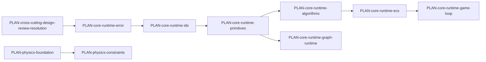

# Harmonius implementation plan index

This tree mirrors every primary subsystem design under `docs/design/` (141 plan files) plus
cross-cutting backlog plans driven by [design-review.md](../design/design-review.md),
[constraints.md](../design/constraints.md), and
[performance-budget.md](../design/performance-budget.md).

Excluded from one-to-one mapping (no code plan): [CLAUDE.md](../design/CLAUDE.md) (authoring guide),
[game-framework/test-link.md](../design/game-framework/test-link.md),
[integration/PROMPT.md](../design/integration/PROMPT.md) (integration prompt template).

## How to use

1. Pick a plan ID below; open its progress file first.
2. Prefer foundation tiers before domain work (see diagram).
3. Keep transforms pure; push side effects to phase boundaries (Rust + FP discipline).

## Topological tiers (cornerstones)

Tiers are advisory; exact `dependencies` arrays on each plan file win when present.

## ai

| Plan ID | Plan | Design |
|---------|------|--------|
| `PLAN-ai-behavior` | [behavior.md](ai/behavior.md) | [behavior.md](../design/ai/behavior.md) |
| `PLAN-ai-navigation` | [navigation.md](ai/navigation.md) | [navigation.md](../design/ai/navigation.md) |
| `PLAN-ai-steering-crowds` | [steering-crowds.md](ai/steering-crowds.md) | [steering-crowds.md](../design/ai/steering-crowds.md) |

## animation

| Plan ID | Plan | Design |
|---------|------|--------|
| `PLAN-animation-procedural` | [procedural.md](animation/procedural.md) | [procedural.md](../design/animation/procedural.md) |
| `PLAN-animation-skeletal` | [skeletal.md](animation/skeletal.md) | [skeletal.md](../design/animation/skeletal.md) |
| `PLAN-animation-state-machine` | [state-machine.md](animation/state-machine.md) | [state-machine.md](../design/animation/state-machine.md) |

## audio

| Plan ID | Plan | Design |
|---------|------|--------|
| `PLAN-audio-audio` | [audio.md](audio/audio.md) | [audio.md](../design/audio/audio.md) |

## content-pipeline

| Plan ID | Plan | Design |
|---------|------|--------|
| `PLAN-content-pipeline-asset-pipeline` | [asset-pipeline.md](content-pipeline/asset-pipeline.md) | [asset-pipeline.md](../design/content-pipeline/asset-pipeline.md) |
| `PLAN-content-pipeline-asset-processing` | [asset-processing.md](content-pipeline/asset-processing.md) | [asset-processing.md](../design/content-pipeline/asset-processing.md) |

## core-runtime

| Plan ID | Plan | Design |
|---------|------|--------|
| `PLAN-core-runtime-algorithms` | [algorithms.md](core-runtime/algorithms.md) | [algorithms.md](../design/core-runtime/algorithms.md) |
| `PLAN-core-runtime-change-detection` | [change-detection.md](core-runtime/change-detection.md) | [change-detection.md](../design/core-runtime/change-detection.md) |
| `PLAN-core-runtime-console-variables` | [console-variables.md](core-runtime/console-variables.md) | [console-variables.md](../design/core-runtime/console-variables.md) |
| `PLAN-core-runtime-ecs` | [ecs.md](core-runtime/ecs.md) | [ecs.md](../design/core-runtime/ecs.md) |
| `PLAN-core-runtime-error` | [error.md](core-runtime/error.md) | [error.md](../design/core-runtime/error.md) |
| `PLAN-core-runtime-events-plugins` | [events-plugins.md](core-runtime/events-plugins.md) | [events-plugins.md](../design/core-runtime/events-plugins.md) |
| `PLAN-core-runtime-game-loop` | [game-loop.md](core-runtime/game-loop.md) | [game-loop.md](../design/core-runtime/game-loop.md) |
| `PLAN-core-runtime-graph-runtime` | [graph-runtime.md](core-runtime/graph-runtime.md) | [graph-runtime.md](../design/core-runtime/graph-runtime.md) |
| `PLAN-core-runtime-hot-reload-protocol` | [hot-reload-protocol.md](core-runtime/hot-reload-protocol.md) | [hot-reload-protocol.md](../design/core-runtime/hot-reload-protocol.md) |
| `PLAN-core-runtime-ids` | [ids.md](core-runtime/ids.md) | [ids.md](../design/core-runtime/ids.md) |
| `PLAN-core-runtime-io` | [io.md](core-runtime/io.md) | [io.md](../design/core-runtime/io.md) |
| `PLAN-core-runtime-memory-async-io` | [memory-async-io.md](core-runtime/memory-async-io.md) | [memory-async-io.md](../design/core-runtime/memory-async-io.md) |
| `PLAN-core-runtime-primitives` | [primitives.md](core-runtime/primitives.md) | [primitives.md](../design/core-runtime/primitives.md) |
| `PLAN-core-runtime-reflection-serialization` | [reflection-serialization.md](core-runtime/reflection-serialization.md) | [reflection-serialization.md](../design/core-runtime/reflection-serialization.md) |
| `PLAN-core-runtime-scene-transforms` | [scene-transforms.md](core-runtime/scene-transforms.md) | [scene-transforms.md](../design/core-runtime/scene-transforms.md) |
| `PLAN-core-runtime-spatial-index` | [spatial-index.md](core-runtime/spatial-index.md) | [spatial-index.md](../design/core-runtime/spatial-index.md) |

## cross-cutting

| Plan ID | Plan | Design |
|---------|------|--------|
| `PLAN-cross-cutting-design-constraints` | [design-constraints.md](./cross-cutting/design-constraints.md) | [constraints.md](../design/constraints.md) |
| `PLAN-cross-cutting-design-review-resolution` | [design-review-resolution.md](./cross-cutting/design-review-resolution.md) | [design-review.md](../design/design-review.md) |
| `PLAN-cross-cutting-performance-budget` | [performance-budget.md](./cross-cutting/performance-budget.md) | [performance-budget.md](../design/performance-budget.md) |

## data-systems

| Plan ID | Plan | Design |
|---------|------|--------|
| `PLAN-data-systems-attributes-effects` | [attributes-effects.md](data-systems/attributes-effects.md) | [attributes-effects.md](../design/data-systems/attributes-effects.md) |
| `PLAN-data-systems-composition` | [composition.md](data-systems/composition.md) | [composition.md](../design/data-systems/composition.md) |
| `PLAN-data-systems-containers-slots` | [containers-slots.md](data-systems/containers-slots.md) | [containers-slots.md](../design/data-systems/containers-slots.md) |
| `PLAN-data-systems-data-tables` | [data-tables.md](data-systems/data-tables.md) | [data-tables.md](../design/data-systems/data-tables.md) |
| `PLAN-data-systems-directed-graphs` | [directed-graphs.md](data-systems/directed-graphs.md) | [directed-graphs.md](../design/data-systems/directed-graphs.md) |

## game-framework

| Plan ID | Plan | Design |
|---------|------|--------|
| `PLAN-game-framework-camera` | [camera.md](game-framework/camera.md) | [camera.md](../design/game-framework/camera.md) |
| `PLAN-game-framework-localization` | [localization.md](game-framework/localization.md) | [localization.md](../design/game-framework/localization.md) |
| `PLAN-game-framework-save-system` | [save-system.md](game-framework/save-system.md) | [save-system.md](../design/game-framework/save-system.md) |
| `PLAN-game-framework-scripting` | [scripting.md](game-framework/scripting.md) | [scripting.md](../design/game-framework/scripting.md) |

## geometry

| Plan ID | Plan | Design |
|---------|------|--------|
| `PLAN-geometry-procedural-generation` | [procedural-generation.md](geometry/procedural-generation.md) | [procedural-generation.md](../design/geometry/procedural-generation.md) |
| `PLAN-geometry-world-geometry` | [world-geometry.md](geometry/world-geometry.md) | [world-geometry.md](../design/geometry/world-geometry.md) |

## input

| Plan ID | Plan | Design |
|---------|------|--------|
| `PLAN-input-input` | [input.md](input/input.md) | [input.md](../design/input/input.md) |

## integration

| Plan ID | Plan | Design |
|---------|------|--------|
| `PLAN-integration-ai-animation` | [ai-animation.md](integration/ai-animation.md) | [ai-animation.md](../design/integration/ai-animation.md) |
| `PLAN-integration-ai-data-tables` | [ai-data-tables.md](integration/ai-data-tables.md) | [ai-data-tables.md](../design/integration/ai-data-tables.md) |
| `PLAN-integration-ai-event-logs` | [ai-event-logs.md](integration/ai-event-logs.md) | [ai-event-logs.md](../design/integration/ai-event-logs.md) |
| `PLAN-integration-ai-grids-volumes` | [ai-grids-volumes.md](integration/ai-grids-volumes.md) | [ai-grids-volumes.md](../design/integration/ai-grids-volumes.md) |
| `PLAN-integration-ai-physics` | [ai-physics.md](integration/ai-physics.md) | [ai-physics.md](../design/integration/ai-physics.md) |
| `PLAN-integration-ai-scripting` | [ai-scripting.md](integration/ai-scripting.md) | [ai-scripting.md](../design/integration/ai-scripting.md) |
| `PLAN-integration-ai-spatial-awareness` | [ai-spatial-awareness.md](integration/ai-spatial-awareness.md) | [ai-spatial-awareness.md](../design/integration/ai-spatial-awareness.md) |
| `PLAN-integration-animation-audio` | [animation-audio.md](integration/animation-audio.md) | [animation-audio.md](../design/integration/animation-audio.md) |
| `PLAN-integration-animation-physics` | [animation-physics.md](integration/animation-physics.md) | [animation-physics.md](../design/integration/animation-physics.md) |
| `PLAN-integration-animation-rendering` | [animation-rendering.md](integration/animation-rendering.md) | [animation-rendering.md](../design/integration/animation-rendering.md) |
| `PLAN-integration-animation-timelines` | [animation-timelines.md](integration/animation-timelines.md) | [animation-timelines.md](../design/integration/animation-timelines.md) |
| `PLAN-integration-animation-vfx` | [animation-vfx.md](integration/animation-vfx.md) | [animation-vfx.md](../design/integration/animation-vfx.md) |
| `PLAN-integration-asset-pipeline-build-deploy` | [asset-pipeline-build-deploy.md](integration/asset-pipeline-build-deploy.md) | [asset-pipeline-build-deploy.md](../design/integration/asset-pipeline-build-deploy.md) |
| `PLAN-integration-asset-pipeline-rendering` | [asset-pipeline-rendering.md](integration/asset-pipeline-rendering.md) | [asset-pipeline-rendering.md](../design/integration/asset-pipeline-rendering.md) |
| `PLAN-integration-attributes-effects-animation` | [attributes-effects-animation.md](integration/attributes-effects-animation.md) | [attributes-effects-animation.md](../design/integration/attributes-effects-animation.md) |
| `PLAN-integration-attributes-effects-physics` | [attributes-effects-physics.md](integration/attributes-effects-physics.md) | [attributes-effects-physics.md](../design/integration/attributes-effects-physics.md) |
| `PLAN-integration-audio-camera` | [audio-camera.md](integration/audio-camera.md) | [audio-camera.md](../design/integration/audio-camera.md) |
| `PLAN-integration-audio-physics` | [audio-physics.md](integration/audio-physics.md) | [audio-physics.md](../design/integration/audio-physics.md) |
| `PLAN-integration-audio-spatial-awareness` | [audio-spatial-awareness.md](integration/audio-spatial-awareness.md) | [audio-spatial-awareness.md](../design/integration/audio-spatial-awareness.md) |
| `PLAN-integration-containers-slots-rendering` | [containers-slots-rendering.md](integration/containers-slots-rendering.md) | [containers-slots-rendering.md](../design/integration/containers-slots-rendering.md) |
| `PLAN-integration-containers-slots-ui` | [containers-slots-ui.md](integration/containers-slots-ui.md) | [containers-slots-ui.md](../design/integration/containers-slots-ui.md) |
| `PLAN-integration-data-tables-ui` | [data-tables-ui.md](integration/data-tables-ui.md) | [data-tables-ui.md](../design/integration/data-tables-ui.md) |
| `PLAN-integration-directed-graphs-scripting` | [directed-graphs-scripting.md](integration/directed-graphs-scripting.md) | [directed-graphs-scripting.md](../design/integration/directed-graphs-scripting.md) |
| `PLAN-integration-editor-animation` | [editor-animation.md](integration/editor-animation.md) | [editor-animation.md](../design/integration/editor-animation.md) |
| `PLAN-integration-editor-asset-pipeline` | [editor-asset-pipeline.md](integration/editor-asset-pipeline.md) | [editor-asset-pipeline.md](../design/integration/editor-asset-pipeline.md) |
| `PLAN-integration-editor-core-runtime` | [editor-core-runtime.md](integration/editor-core-runtime.md) | [editor-core-runtime.md](../design/integration/editor-core-runtime.md) |
| `PLAN-integration-editor-physics` | [editor-physics.md](integration/editor-physics.md) | [editor-physics.md](../design/integration/editor-physics.md) |
| `PLAN-integration-editor-rendering` | [editor-rendering.md](integration/editor-rendering.md) | [editor-rendering.md](../design/integration/editor-rendering.md) |
| `PLAN-integration-event-logs-ui` | [event-logs-ui.md](integration/event-logs-ui.md) | [event-logs-ui.md](../design/integration/event-logs-ui.md) |
| `PLAN-integration-geometry-vfx` | [geometry-vfx.md](integration/geometry-vfx.md) | [geometry-vfx.md](../design/integration/geometry-vfx.md) |
| `PLAN-integration-grids-volumes-physics` | [grids-volumes-physics.md](integration/grids-volumes-physics.md) | [grids-volumes-physics.md](../design/integration/grids-volumes-physics.md) |
| `PLAN-integration-high-level` | [high-level.md](integration/high-level.md) | [high-level.md](../design/integration/high-level.md) |
| `PLAN-integration-input-camera` | [input-camera.md](integration/input-camera.md) | [input-camera.md](../design/integration/input-camera.md) |
| `PLAN-integration-input-ui` | [input-ui.md](integration/input-ui.md) | [input-ui.md](../design/integration/input-ui.md) |
| `PLAN-integration-localization-ui` | [localization-ui.md](integration/localization-ui.md) | [localization-ui.md](../design/integration/localization-ui.md) |
| `PLAN-integration-networking-audio` | [networking-audio.md](integration/networking-audio.md) | [networking-audio.md](../design/integration/networking-audio.md) |
| `PLAN-integration-networking-ecs` | [networking-ecs.md](integration/networking-ecs.md) | [networking-ecs.md](../design/integration/networking-ecs.md) |
| `PLAN-integration-networking-physics` | [networking-physics.md](integration/networking-physics.md) | [networking-physics.md](../design/integration/networking-physics.md) |
| `PLAN-integration-networking-save-system` | [networking-save-system.md](integration/networking-save-system.md) | [networking-save-system.md](../design/integration/networking-save-system.md) |
| `PLAN-integration-physics-geometry` | [physics-geometry.md](integration/physics-geometry.md) | [physics-geometry.md](../design/integration/physics-geometry.md) |
| `PLAN-integration-physics-spatial-index` | [physics-spatial-index.md](integration/physics-spatial-index.md) | [physics-spatial-index.md](../design/integration/physics-spatial-index.md) |
| `PLAN-integration-profiler-game-loop` | [profiler-game-loop.md](integration/profiler-game-loop.md) | [profiler-game-loop.md](../design/integration/profiler-game-loop.md) |
| `PLAN-integration-profiler-rendering` | [profiler-rendering.md](integration/profiler-rendering.md) | [profiler-rendering.md](../design/integration/profiler-rendering.md) |
| `PLAN-integration-rendering-camera` | [rendering-camera.md](integration/rendering-camera.md) | [rendering-camera.md](../design/integration/rendering-camera.md) |
| `PLAN-integration-rendering-geometry` | [rendering-geometry.md](integration/rendering-geometry.md) | [rendering-geometry.md](../design/integration/rendering-geometry.md) |
| `PLAN-integration-rendering-grids-volumes` | [rendering-grids-volumes.md](integration/rendering-grids-volumes.md) | [rendering-grids-volumes.md](../design/integration/rendering-grids-volumes.md) |
| `PLAN-integration-rendering-physics` | [rendering-physics.md](integration/rendering-physics.md) | [rendering-physics.md](../design/integration/rendering-physics.md) |
| `PLAN-integration-rendering-scripting` | [rendering-scripting.md](integration/rendering-scripting.md) | [rendering-scripting.md](../design/integration/rendering-scripting.md) |
| `PLAN-integration-rendering-ui` | [rendering-ui.md](integration/rendering-ui.md) | [rendering-ui.md](../design/integration/rendering-ui.md) |
| `PLAN-integration-rendering-vfx` | [rendering-vfx.md](integration/rendering-vfx.md) | [rendering-vfx.md](../design/integration/rendering-vfx.md) |
| `PLAN-integration-save-system-profiler` | [save-system-profiler.md](integration/save-system-profiler.md) | [save-system-profiler.md](../design/integration/save-system-profiler.md) |
| `PLAN-integration-save-system-serialization` | [save-system-serialization.md](integration/save-system-serialization.md) | [save-system-serialization.md](../design/integration/save-system-serialization.md) |
| `PLAN-integration-scripting-data-tables` | [scripting-data-tables.md](integration/scripting-data-tables.md) | [scripting-data-tables.md](../design/integration/scripting-data-tables.md) |
| `PLAN-integration-scripting-ecs` | [scripting-ecs.md](integration/scripting-ecs.md) | [scripting-ecs.md](../design/integration/scripting-ecs.md) |
| `PLAN-integration-scripting-ui` | [scripting-ui.md](integration/scripting-ui.md) | [scripting-ui.md](../design/integration/scripting-ui.md) |
| `PLAN-integration-shared-conventions` | [shared-conventions.md](integration/shared-conventions.md) | [shared-conventions.md](../design/integration/shared-conventions.md) |
| `PLAN-integration-shared-messaging-capacities` | [shared-messaging-capacities.md](integration/shared-messaging-capacities.md) | [shared-messaging-capacities.md](../design/integration/shared-messaging-capacities.md) |
| `PLAN-integration-timelines-audio` | [timelines-audio.md](integration/timelines-audio.md) | [timelines-audio.md](../design/integration/timelines-audio.md) |
| `PLAN-integration-timelines-camera` | [timelines-camera.md](integration/timelines-camera.md) | [timelines-camera.md](../design/integration/timelines-camera.md) |
| `PLAN-integration-timelines-scripting` | [timelines-scripting.md](integration/timelines-scripting.md) | [timelines-scripting.md](../design/integration/timelines-scripting.md) |
| `PLAN-integration-ui-physics` | [ui-physics.md](integration/ui-physics.md) | [ui-physics.md](../design/integration/ui-physics.md) |

## networking

| Plan ID | Plan | Design |
|---------|------|--------|
| `PLAN-networking-network-infrastructure` | [network-infrastructure.md](networking/network-infrastructure.md) | [network-infrastructure.md](../design/networking/network-infrastructure.md) |
| `PLAN-networking-network-services` | [network-services.md](networking/network-services.md) | [network-services.md](../design/networking/network-services.md) |
| `PLAN-networking-network-transport` | [network-transport.md](networking/network-transport.md) | [network-transport.md](../design/networking/network-transport.md) |

## physics

| Plan ID | Plan | Design |
|---------|------|--------|
| `PLAN-physics-advanced` | [advanced.md](physics/advanced.md) | [advanced.md](../design/physics/advanced.md) |
| `PLAN-physics-constraints` | [constraints.md](./physics/constraints.md) | [constraints.md](../design/physics/constraints.md) |
| `PLAN-physics-foundation` | [foundation.md](physics/foundation.md) | [foundation.md](../design/physics/foundation.md) |

## platform

| Plan ID | Plan | Design |
|---------|------|--------|
| `PLAN-platform-console-integration` | [console-integration.md](platform/console-integration.md) | [console-integration.md](../design/platform/console-integration.md) |
| `PLAN-platform-crash-reporting` | [crash-reporting.md](platform/crash-reporting.md) | [crash-reporting.md](../design/platform/crash-reporting.md) |
| `PLAN-platform-platform-services` | [platform-services.md](platform/platform-services.md) | [platform-services.md](../design/platform/platform-services.md) |
| `PLAN-platform-telemetry` | [telemetry.md](platform/telemetry.md) | [telemetry.md](../design/platform/telemetry.md) |
| `PLAN-platform-threading` | [threading.md](platform/threading.md) | [threading.md](../design/platform/threading.md) |
| `PLAN-platform-windowing` | [windowing.md](platform/windowing.md) | [windowing.md](../design/platform/windowing.md) |

Progress trackers live only under [progress/](progress/); they are not plans and are omitted here.

## rendering

| Plan ID | Plan | Design |
|---------|------|--------|
| `PLAN-rendering-2d` | [2d.md](rendering/2d.md) | [2d.md](../design/rendering/2d.md) |
| `PLAN-rendering-camera-rendering` | [camera-rendering.md](rendering/camera-rendering.md) | [camera-rendering.md](../design/rendering/camera-rendering.md) |
| `PLAN-rendering-meshlets` | [meshlets.md](rendering/meshlets.md) | [meshlets.md](../design/rendering/meshlets.md) |
| `PLAN-rendering-pipeline-state-cache` | [pipeline-state-cache.md](rendering/pipeline-state-cache.md) | [pipeline-state-cache.md](../design/rendering/pipeline-state-cache.md) |
| `PLAN-rendering-render-effects` | [render-effects.md](rendering/render-effects.md) | [render-effects.md](../design/rendering/render-effects.md) |
| `PLAN-rendering-render-pipeline` | [render-pipeline.md](rendering/render-pipeline.md) | [render-pipeline.md](../design/rendering/render-pipeline.md) |
| `PLAN-rendering-render-styles` | [render-styles.md](rendering/render-styles.md) | [render-styles.md](../design/rendering/render-styles.md) |
| `PLAN-rendering-rendering-core` | [rendering-core.md](rendering/rendering-core.md) | [rendering-core.md](../design/rendering/rendering-core.md) |
| `PLAN-rendering-shader-variants` | [shader-variants.md](rendering/shader-variants.md) | [shader-variants.md](../design/rendering/shader-variants.md) |

## simulation

| Plan ID | Plan | Design |
|---------|------|--------|
| `PLAN-simulation-event-logs` | [event-logs.md](simulation/event-logs.md) | [event-logs.md](../design/simulation/event-logs.md) |
| `PLAN-simulation-game-loop-phases` | [game-loop-phases.md](simulation/game-loop-phases.md) | [game-loop-phases.md](../design/simulation/game-loop-phases.md) |
| `PLAN-simulation-grids-volumes` | [grids-volumes.md](simulation/grids-volumes.md) | [grids-volumes.md](../design/simulation/grids-volumes.md) |
| `PLAN-simulation-spatial-awareness` | [spatial-awareness.md](simulation/spatial-awareness.md) | [spatial-awareness.md](../design/simulation/spatial-awareness.md) |
| `PLAN-simulation-timelines` | [timelines.md](simulation/timelines.md) | [timelines.md](../design/simulation/timelines.md) |

## tools

| Plan ID | Plan | Design |
|---------|------|--------|
| `PLAN-tools-build-deploy` | [build-deploy.md](tools/build-deploy.md) | [build-deploy.md](../design/tools/build-deploy.md) |
| `PLAN-tools-content-services` | [content-services.md](tools/content-services.md) | [content-services.md](../design/tools/content-services.md) |
| `PLAN-tools-editor-core` | [editor-core.md](tools/editor-core.md) | [editor-core.md](../design/tools/editor-core.md) |
| `PLAN-tools-level-world` | [level-world.md](tools/level-world.md) | [level-world.md](../design/tools/level-world.md) |
| `PLAN-tools-plugin-marketplace` | [plugin-marketplace.md](tools/plugin-marketplace.md) | [plugin-marketplace.md](../design/tools/plugin-marketplace.md) |
| `PLAN-tools-profiler` | [profiler.md](tools/profiler.md) | [profiler.md](../design/tools/profiler.md) |
| `PLAN-tools-scene-versioning` | [scene-versioning.md](tools/scene-versioning.md) | [scene-versioning.md](../design/tools/scene-versioning.md) |
| `PLAN-tools-selection-model` | [selection-model.md](tools/selection-model.md) | [selection-model.md](../design/tools/selection-model.md) |
| `PLAN-tools-team-tools` | [team-tools.md](tools/team-tools.md) | [team-tools.md](../design/tools/team-tools.md) |
| `PLAN-tools-undo-redo` | [undo-redo.md](tools/undo-redo.md) | [undo-redo.md](../design/tools/undo-redo.md) |
| `PLAN-tools-visual-editors` | [visual-editors.md](tools/visual-editors.md) | [visual-editors.md](../design/tools/visual-editors.md) |

## ui

| Plan ID | Plan | Design |
|---------|------|--------|
| `PLAN-ui-ui-framework` | [ui-framework.md](ui/ui-framework.md) | [ui-framework.md](../design/ui/ui-framework.md) |

## vfx

| Plan ID | Plan | Design |
|---------|------|--------|
| `PLAN-vfx-effects` | [effects.md](vfx/effects.md) | [effects.md](../design/vfx/effects.md) |
| `PLAN-vfx-particles` | [particles.md](vfx/particles.md) | [particles.md](../design/vfx/particles.md) |
