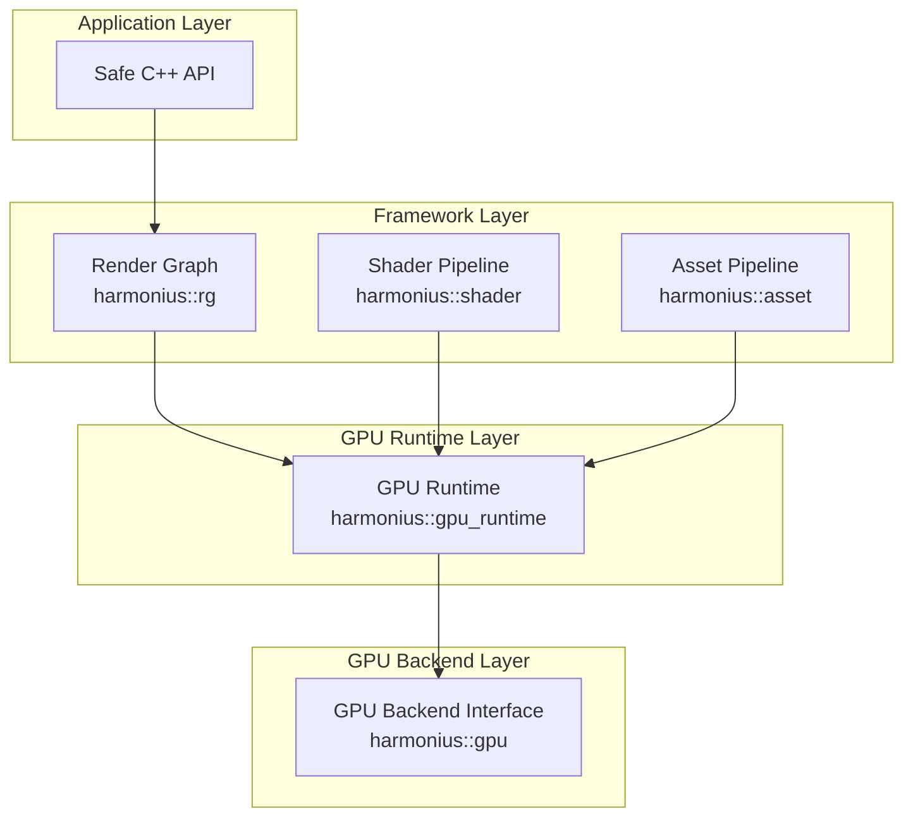

# 7. GPU Runtime

Requirements for the GPU runtime layer (`harmonius::gpu_runtime`), a shared services module
that sits between the GPU backend interface (`harmonius::gpu`) and consumers such as the render
graph (`harmonius::rg`) and asset pipeline (`harmonius::asset`).

The GPU runtime provides higher-level GPU resource management, state tracking, work graph
execution, and feature emulation built entirely on top of the GPU backend interface. It depends
only on `harmonius::gpu` and has no knowledge of render graph concepts (passes, resource
lifetimes, DAGs).

## Subsections

| ID   | File                                                        | Reqs | Scope                                                                         |
| ---- | ----------------------------------------------------------- | ---- | ----------------------------------------------------------------------------- |
| GR-1 | [7.1-memory-management.md](7.1-memory-management.md)       | 11   | Heap management, sub-allocation, ring buffers, defragmentation, budget        |
| GR-2 | [7.2-state-tracking.md](7.2-state-tracking.md)             | 7    | Redundant state elimination, resource state cache, tracked command buffers    |
| GR-3 | [7.3-work-graph-runtime.md](7.3-work-graph-runtime.md)     | 7    | Native GPU work graph execution, CPU-side emulation, transparent dispatch    |
| GR-4 | [7.4-feature-emulation.md](7.4-feature-emulation.md)       | 5    | Cross-backend feature emulation, barrier optimization, capability adaptation |

**Total: 30 requirements**

## Design Principles

| Principle                    | Rationale                                                                        |
| ---------------------------- | -------------------------------------------------------------------------------- |
| Backend-agnostic             | Built entirely on the `harmonius::gpu` interface — no backend-specific code      |
| No third-party allocators    | Memory management is in-house — no VMA, D3D12MA, or other external allocators    |
| Zero per-frame allocation    | Hot-path operations use pre-allocated pools and ring buffers                      |
| Transparent optimization     | Consumers see a single API; native vs. emulated paths are selected automatically |
| Static dispatch              | All dispatch is compile-time — no vtables, no virtual methods (R-1.1.5)          |
| Strict layer separation      | No render graph types, no application types — only GPU backend types (R-1.1.7)   |

## Architectural Position

