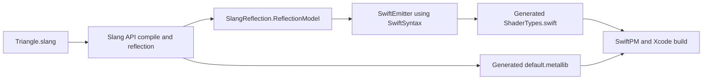

# Shader Code Generation

Harmonius keeps hand-authored shader code in `.slang` files only. Swift shader
bindings are generated from Slang reflection during SwiftPM and Xcode builds.
The generated Swift is not committed; it is produced by the SwiftPM build-tool
plugin.

## Pipeline



`SlangReflection` is the source of truth. The build does not parse generated
MSL or generated Metal library text.

`Sources/HarmoniusShaders/` must contain only `.slang` source files. The
`full-check` workflow enforces this so C/C++ shader headers or hand-written
Swift shader declarations cannot drift from reflection.

## Modules

```text
Sources/SlangReflection/
  ReflectionModel.swift
  SlangReflectionCompiler.swift

Sources/SlangReflectionBridge/
  include/SlangReflectionBridge.h
  src/SlangReflectionBridge.cpp

Sources/SwiftEmitter/
  SwiftEmitter.swift
  TypeMapper.swift

Sources/HarmoniusShaderTool/
  main.swift
```

`SlangReflectionBridge` owns the C++ walk over Slang reflection:

1. Create a Slang session for `SLANG_METAL_LIB`.
2. Load the `.slang` module.
3. Compose the module with all defined entry points.
4. Link the program and call `linkedProgram->getLayout()`.
5. Walk structs, fields, global parameters, resources, and entry points.
6. Write `default.metallib`.
7. Return a language-neutral `ShaderProgramModel` JSON payload to Swift.

`SwiftEmitter` maps the model into Swift syntax and formats the result with
SwiftSyntax. It emits:

- POD Swift structs for reflected Slang structs.
- fixed array wrappers used by reflected array fields.
- `ShaderBindings` resource constants, binding metadata, and buffer table size.
- `ShaderEntryPoints` and entry-point metadata.
- `ShaderReflectionLayout` and `ShaderValidation` runtime checks.
- the build-local `HarmoniusShaderResources.defaultMetallibPath`.

## Type Mapping

| Slang | Swift |
| --- | --- |
| `float` | `Float` |
| `float2` | `SIMD2<Float>` |
| `float3` | `SIMD3<Float>` |
| `float4` | `SIMD4<Float>` |
| `int` | `Int32` |
| `uint` | `UInt32` |
| `uint2` | `SIMD2<UInt32>` |
| `float2x2` | `simd_float2x2` |
| `float3x3` | `simd_float3x3` |
| `float4x4` | `simd_float4x4` |

Nested structs and fixed arrays are emitted recursively.

## Regeneration

Any SwiftPM or Xcode build that includes `HarmoniusShaderResources` runs
`HarmoniusShaderPlugin`.

Use these commands locally:

```bash
./scripts/dev.sh build macos debug
./scripts/dev.sh test-unit
./scripts/dev.sh test-render
```

The generated files live under SwiftPM plugin output directories such as:

```text
.build/plugins/outputs/harmonius/HarmoniusShaderResources/destination/
```

Do not edit those generated files directly. Change the `.slang` source,
reflection model, bridge walker, or Swift emitter, then rebuild.

## Validation

Generated code includes:

```swift
ShaderValidation.verifyAll()
```

The helper checks Swift `MemoryLayout` size, alignment, and field offsets
against the reflected Slang layout. Use it in focused runtime checks when adding
new shader data structs or changing layout-sensitive fields.

The renderer calls `ShaderValidation.verifyAll()` before creating shader data
buffers. It also uses generated entry-point names, binding slots, and
`ShaderBindings.maxBufferBindCount` so renderer constants stay derived from
Slang reflection.
