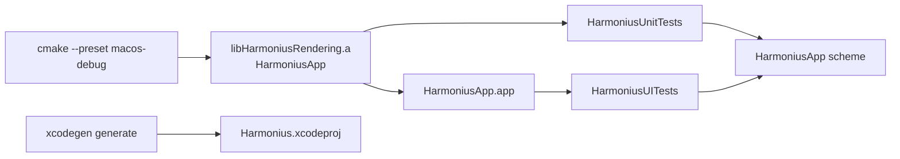

# Testing

Harmonius runs unit tests (swift-testing) and UI snapshot tests (XCUITest) via XcodeGen
on macOS. CI and local development use the unified **HarmoniusApp** scheme.

## Test targets

| Target | Framework | Scope |
| ------ | --------- | ----- |
| HarmoniusUnitTests | swift-testing | Pure Swift geometry and helpers |
| HarmoniusUITests | XCUITest + SnapshotTesting | End-to-end app launch + render snapshot |

CMake still builds production artifacts (`HarmoniusApp`, `HarmoniusRendering`). XcodeGen compiles
test targets in Xcode and links the CMake-built `HarmoniusRendering` static library into unit tests.



## Prerequisites

- macOS 26 + Xcode 26 (Metal 4, Swift 6.3)
- [XcodeGen](https://github.com/yonaskolb/XcodeGen) (`brew install xcodegen`)
- Ninja (`brew install ninja`)

## Run locally

Generate the Xcode project, then run tests from the CLI or Xcode. See the README for Xcode UI steps.
Agents should use the `xcodebuild` commands in [AGENTS.md](../AGENTS.md).

```bash
xcodegen generate
xcodebuild test \
  -project Harmonius.xcodeproj \
  -scheme HarmoniusApp \
  -destination "platform=macOS" \
  -clonedSourcePackagesDirPath build/spm \
  -derivedDataPath build/xcodegen
```

Run unit tests only:

```bash
xcodebuild test \
  -project Harmonius.xcodeproj \
  -scheme HarmoniusApp \
  -only-testing:HarmoniusUnitTests \
  -destination "platform=macOS" \
  -clonedSourcePackagesDirPath build/spm \
  -derivedDataPath build/xcodegen
```

## Unit tests

Unit tests are colocated with source under `app/HarmoniusRendering/` (files ending in `Tests.swift`)
and use [swift-testing](https://developer.apple.com/documentation/testing) (`import Testing`,
`@Test`, `#expect`).

Current coverage:

1. `TriangleVertexLayout.maxFramesInFlight`
2. `TriangleGeometry.frameData()` vertex colors
3. Vertex positions on the expected circle radius
4. Equilateral triangle side lengths

Add a new `@Test` function in a `*Tests.swift` file next to the code under test. Public API under
test must be marked `public` in the CMake-built module (for example
[TriangleGeometry.swift](../app/HarmoniusRendering/TriangleGeometry.swift)).

## UI snapshot test

[HarmoniusRenderTests.swift](../app/HarmoniusApp/HarmoniusRenderTests.swift) uses XCUITest and
[swift-snapshot-testing](https://github.com/pointfreeco/swift-snapshot-testing).

1. Append `-HarmoniusSnapshotMode` and launch the app.
2. Wait for `metal-view-ready`, then `metal-view`.
3. Call `assertSnapshot(of:as:named:)` on `metalView.screenshot().image` at precision `0.98`.

Snapshot mode is implemented in [ContentView.swift](../app/HarmoniusApp/ContentView.swift) and
[HarmoniusLaunchOptions.swift](../app/HarmoniusApp/HarmoniusLaunchOptions.swift). It shows a 960×540
`metal-view` and configures an opaque window without title chrome.

Reference PNGs live under `app/HarmoniusApp/__Snapshots__/HarmoniusRenderTests/`. SnapshotTesting
names files `{testFunction}.{named}.png` (for example `testTriangleRendersSnapshot.triangle.png`).

Recording is enabled when `SNAPSHOT_RECORD=1` via `withSnapshotTesting(record:)` in `invokeTest()`.

### Record or refresh UI baselines

```bash
SNAPSHOT_RECORD=1 xcodebuild test \
  -project Harmonius.xcodeproj \
  -scheme HarmoniusApp \
  -only-testing:HarmoniusUITests \
  -destination "platform=macOS" \
  -clonedSourcePackagesDirPath build/spm \
  -derivedDataPath build/xcodegen
```

Commit the updated PNG under `__Snapshots__/`.

## CI

The workflow in [.github/workflows/ci.yml](../.github/workflows/ci.yml) runs on every pull request
and `main` push:

1. `format` selects Xcode 26 and lints Swift files with `swift-format` on `macos-26`.
2. `macos-unit-tests` runs only `HarmoniusUnitTests` on `macos-26`.
3. `macos-ui-tests` runs only `HarmoniusUITests` on `macos-26-xlarge`.
4. `deploy-ios` archives `HarmoniusApp`, exports an IPA, and uploads it to App Store Connect
   on successful `main` pushes from `macos-26`.

Test results upload as GitHub Actions artifacts (`macos-unit-test-results` and
`macos-ui-test-results`). The exported IPA uploads as `ios-release-ipa`.

## App icon plan

The selected winner is the middleground controller mark from the final user-selected
reference image. It is a clean, borderless gamepad/controller silhouette split into three
organic pieces by thick white negative-space channels. The filled sections are desaturated
sage green across the upper bridge, muted warm orange/clay in the left grip, and dark
charcoal in the right grip.

This completes the image-selection decision. The durable vector source lives at
[`AppIcon.svg`](../app/AssetSources/AppIcon.svg). The Icon Composer import bridge lives at
[`AppIcon.pdf`](../app/AssetSources/AppIcon.pdf), and the saved Composer document lives at
[`AppIcon.icon`](../app/AssetSources/AppIcon.icon).

Implementation notes:

1. Use the final selected raster/reference image as the source of truth.
2. Vectorize into clean paths that preserve the exact silhouette, broad controller grips,
   soft upper bridge, large phase-aligned negative-space split channels, three-piece
   layout, rounded corners, and simple fill regions.
3. Remove any background or border. The final vector is only the controller silhouette
   pieces, with transparent outside/background and transparent negative-space gaps.
4. Preserve a WCAG-aware contrast relationship. Charcoal must remain clearly separated
   from the lighter sections; sage and clay stay desaturated but distinct, with enough
   lightness separation for small icon sizes.
5. Prepare SVG/PDF vector inputs for Apple Icon Composer. Keep path count low and avoid
   texture, gradients, buttons, sticks, symbols, code marks, play icons, cubes, stones,
   and metallic effects.
6. Use Icon Composer to place the vector layer into the app icon. Let the system/Liquid
   Glass background, lighting, and platform variants compose there instead of baking a
   border or background into the logo.
7. Generated PNG app icon sizes are produced by
   [`generate_app_assets.sh`](../scripts/generate_app_assets.sh) from the Icon Composer
   export. Do not hand-edit generated app icon PNGs.

Icon Composer source:

1. Open `app/AssetSources/AppIcon.icon` in Apple Icon Composer.
2. Keep `app/AssetSources/AppIcon.pdf` as the imported foreground artwork.
3. Keep the imported controller mark borderless with a transparent outside and gaps.
4. Use Icon Composer/Liquid Glass for background, lighting, and platform adaptation.
5. Use `app/AssetSources/AppIcon-composer.png` as the 1024 px exported review image.

## CMake artifact paths

If CMake output layout changes, update [project.yml](../project.yml):

| Artifact | Default path |
| -------- | ------------ |
| HarmoniusApp bundle | `build/macos/app/HarmoniusApp` |
| HarmoniusRendering archive | `build/macos/app/libHarmoniusRendering.a` |
| Swift module (import path) | `build/macos/app/` |

## Readiness signal

The renderer fires `didPresentFirstFrame` after the first drawable is presented. `ContentView`
exposes a hidden `Text` with accessibility identifier `metal-view-ready` once the Metal view has
presented.
