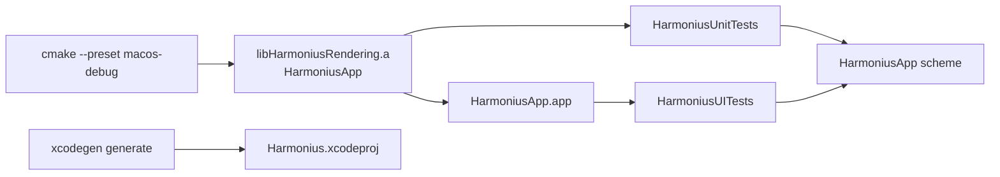

# Testing

Harmonius runs unit tests (swift-testing) and UI snapshot tests (XCUITest) via XcodeGen
on macOS. CI and local development use the unified **HarmoniusApp** scheme.

## Test targets

| Target | Framework | Scope |
| ------ | --------- | ----- |
| HarmoniusUnitTests | swift-testing | Pure Swift geometry and helpers |
| HarmoniusUITests | XCUITest + SnapshotTesting | End-to-end app launch + render snapshot |

CMake still builds production artifacts (`HarmoniusApp`, `HarmoniusRendering`). XcodeGen compiles
test targets in Xcode and links the CMake-built `HarmoniusRendering` static library into unit tests.



## Prerequisites

- macOS 26 + Xcode 26 (Metal 4, Swift 6.3)
- [XcodeGen](https://github.com/yonaskolb/XcodeGen) (`brew install xcodegen`)
- Ninja (`brew install ninja`)

## Run locally

Generate the Xcode project, then run tests from the CLI or Xcode. See the README for Xcode UI steps.
Agents should use the `xcodebuild` commands in [AGENTS.md](../AGENTS.md).

```bash
xcodegen generate
xcodebuild test \
  -project Harmonius.xcodeproj \
  -scheme HarmoniusApp \
  -destination "platform=macOS" \
  -clonedSourcePackagesDirPath build/spm \
  -derivedDataPath build/xcodegen
```

Run unit tests only:

```bash
xcodebuild test \
  -project Harmonius.xcodeproj \
  -scheme HarmoniusApp \
  -only-testing:HarmoniusUnitTests \
  -destination "platform=macOS" \
  -clonedSourcePackagesDirPath build/spm \
  -derivedDataPath build/xcodegen
```

## Unit tests

Unit tests are colocated with source under `app/HarmoniusRendering/` (files ending in `Tests.swift`)
and use [swift-testing](https://developer.apple.com/documentation/testing) (`import Testing`,
`@Test`, `#expect`).

Current coverage:

1. `TriangleVertexLayout.maxFramesInFlight`
2. `TriangleGeometry.frameData()` vertex colors
3. Vertex positions on the expected circle radius
4. Equilateral triangle side lengths

Add a new `@Test` function in a `*Tests.swift` file next to the code under test. Public API under
test must be marked `public` in the CMake-built module (for example
[TriangleGeometry.swift](../app/HarmoniusRendering/TriangleGeometry.swift)).

## UI snapshot test

[HarmoniusRenderTests.swift](../app/HarmoniusApp/HarmoniusRenderTests.swift) uses XCUITest and
[swift-snapshot-testing](https://github.com/pointfreeco/swift-snapshot-testing).

1. Append `-HarmoniusSnapshotMode` and launch the app.
2. Wait for `metal-view-ready`, then `metal-view`.
3. Call `assertSnapshot(of:as:named:)` on `metalView.screenshot().image` at precision `0.98`.

Snapshot mode is implemented in [ContentView.swift](../app/HarmoniusApp/ContentView.swift) and
[HarmoniusLaunchOptions.swift](../app/HarmoniusApp/HarmoniusLaunchOptions.swift). It shows a 960×540
`metal-view` and configures an opaque window without title chrome.

Reference PNGs live under `app/HarmoniusApp/__Snapshots__/HarmoniusRenderTests/`. SnapshotTesting
names files `{testFunction}.{named}.png` (for example `testTriangleRendersSnapshot.triangle.png`).

Recording is enabled when `SNAPSHOT_RECORD=1` via `withSnapshotTesting(record:)` in `invokeTest()`.

### Record or refresh UI baselines

```bash
SNAPSHOT_RECORD=1 xcodebuild test \
  -project Harmonius.xcodeproj \
  -scheme HarmoniusApp \
  -only-testing:HarmoniusUITests \
  -destination "platform=macOS" \
  -clonedSourcePackagesDirPath build/spm \
  -derivedDataPath build/xcodegen
```

Commit the updated PNG under `__Snapshots__/`.

## CI

The workflow in [.github/workflows/ci.yml](../.github/workflows/ci.yml) runs on every pull request
and `main` push:

1. `format` selects Xcode 26 and lints Swift files with `swift-format` on `macos-26`.
2. `macos-unit-tests` runs only `HarmoniusUnitTests` on `macos-26`.
3. `macos-ui-tests` runs only `HarmoniusUITests` on `macos-26-xlarge`.
4. `deploy-ios` archives `HarmoniusApp`, exports an IPA, and uploads it to App Store Connect
   on successful `main` pushes from `macos-26`.

Test results upload as GitHub Actions artifacts (`macos-unit-test-results` and
`macos-ui-test-results`). The exported IPA uploads as `ios-release-ipa`.

## CMake artifact paths

If CMake output layout changes, update [project.yml](../project.yml):

| Artifact | Default path |
| -------- | ------------ |
| HarmoniusApp bundle | `build/macos/app/HarmoniusApp` |
| HarmoniusRendering archive | `build/macos/app/libHarmoniusRendering.a` |
| Swift module (import path) | `build/macos/app/` |

## Readiness signal

The renderer fires `didPresentFirstFrame` after the first drawable is presented. `ContentView`
exposes a hidden `Text` with accessibility identifier `metal-view-ready` once the Metal view has
presented.
