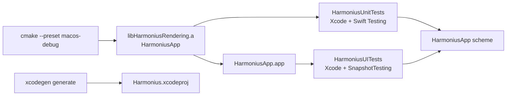

# Testing

Harmonius runs unit tests (swift-testing) and UI snapshot tests (XCUITest) via XcodeGen on macOS. CI
and local development use the single **HarmoniusApp** scheme.

## Test targets

| Target | Framework | Scope |
| ------ | --------- | ----- |
| HarmoniusUnitTests | swift-testing | Pure Swift geometry and helpers |
| HarmoniusUITests | XCUITest + SnapshotTesting | End-to-end app launch + render snapshot |

CMake still builds production artifacts (`HarmoniusApp`, `HarmoniusRendering`). XcodeGen compiles
test targets in Xcode and links the CMake-built `HarmoniusRendering` static library into unit tests.



## Prerequisites

- macOS 26 + Xcode 26 (Metal 4, Swift 6.3)
- [XcodeGen](https://github.com/yonaskolb/XcodeGen) (`brew install xcodegen`)
- Ninja (`brew install ninja`)

## Run locally

Generate the Xcode project, then run tests from the CLI or Xcode. See the README for Xcode UI steps.
Agents should use the `xcodebuild` commands in [AGENTS.md](../AGENTS.md).

```bash
xcodegen generate
xcodebuild test \
  -project Harmonius.xcodeproj \
  -scheme HarmoniusApp \
  -destination "platform=macOS" \
  -derivedDataPath build/xcodegen
```

Run unit tests only:

```bash
xcodebuild test \
  -project Harmonius.xcodeproj \
  -scheme HarmoniusApp \
  -only-testing:HarmoniusUnitTests \
  -destination "platform=macOS" \
  -derivedDataPath build/xcodegen
```

## Unit tests

Unit tests are colocated with source under `app/HarmoniusRendering/` (files ending in `Tests.swift`)
and use [swift-testing](https://developer.apple.com/documentation/testing) (`import Testing`,
`@Test`, `#expect`).

Current coverage:

1. `TriangleVertexLayout.maxFramesInFlight`
2. `TriangleGeometry.frameData()` vertex colors
3. Vertex positions on the expected circle radius
4. Equilateral triangle side lengths

Add a new `@Test` function in a `*Tests.swift` file next to the code under test. Public API under
test must be marked `public` in the CMake-built module (for example
[TriangleGeometry.swift](../app/HarmoniusRendering/TriangleGeometry.swift)).

## UI snapshot test

UI tests are colocated under `app/HarmoniusApp/` (`*Tests.swift`) and use XCUITest with
[swift-snapshot-testing](https://github.com/pointfreeco/swift-snapshot-testing).

[HarmoniusRenderTests.swift](../app/HarmoniusApp/HarmoniusRenderTests.swift) launches `Harmonius`,
waits for `metal-view-ready`, launches with `-HarmoniusSnapshotMode` (fixed-size opaque Metal view,
no title chrome), screenshots the `metal-view` element, and compares against a reference PNG via
`assertSnapshot(of:as:)`. Capturing the content element instead of the full window keeps desktop
wallpapers out of the snapshot.

Reference images live under `app/HarmoniusApp/__Snapshots__/HarmoniusRenderTests/`.

The UI test target clears Xcode's default `-module-alias Testing=_Testing_Unavailable` flag so
SnapshotTesting can link against the Testing module while still using XCUITest.

### Record or refresh UI baselines

Set `SNAPSHOT_RECORD=1` to record snapshots for the UI test suite:

```bash
SNAPSHOT_RECORD=1 xcodebuild test \
  -project Harmonius.xcodeproj \
  -scheme HarmoniusApp \
  -only-testing:HarmoniusUITests \
  -destination "platform=macOS" \
  -derivedDataPath build/xcodegen
```

Commit the updated PNG under `__Snapshots__/`.

## CI

The `test-macos` job in [.github/workflows/ci.yml](../.github/workflows/ci.yml) runs on every push
and pull request:

1. Generate the Xcode project with XcodeGen.
2. Run `xcodebuild test -scheme HarmoniusApp`. (XcodeGen handles the CMake build via pre-build
   scripts).

Test results upload as a GitHub Actions artifact (`macos-test-results`).

## CMake artifact paths

If CMake output layout changes, update [project.yml](../project.yml):

| Artifact | Default path |
| -------- | ------------ |
| HarmoniusApp archive | `build/macos/app/HarmoniusApp` |
| HarmoniusRendering archive | `build/macos/app/libHarmoniusRendering.a` |
| Swift module (import path) | `build/macos/app/` |

## Readiness signal

The renderer fires `didPresentFirstFrame` after the first drawable is presented. `ContentView`
exposes a hidden `Text` with accessibility identifier `metal-view-ready` once the Metal view has
presented.
